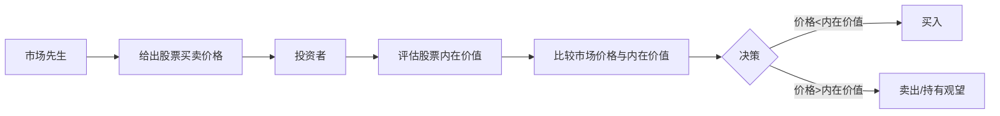

# 本杰明·格雷厄姆的市场先生理论现代应用

> 关键词：本杰明·格雷厄姆、市场先生理论、现代金融市场、投资决策、情绪管理

> 摘要：本文深入探讨了本杰明·格雷厄姆的市场先生理论在现代金融市场中的应用。首先介绍了该理论的背景和核心概念，通过文本示意图和Mermaid流程图清晰展示其原理和架构。详细阐述了其核心算法原理和具体操作步骤，结合Python代码进行说明，并给出了相关的数学模型和公式。通过项目实战案例，展示了如何在实际投资中运用该理论。分析了该理论在不同实际应用场景中的作用，同时推荐了学习该理论所需的工具和资源，包括书籍、在线课程、技术博客等。最后总结了市场先生理论的未来发展趋势与挑战，解答了常见问题，并提供了扩展阅读和参考资料，旨在帮助投资者更好地理解和运用市场先生理论进行投资决策。

## 1. 背景介绍 
### 1.1 目的和范围
本文章的目的是深入剖析本杰明·格雷厄姆的市场先生理论在现代金融市场中的应用。通过对该理论的原理、算法、数学模型等方面的详细讲解，结合实际案例，帮助投资者理解如何运用这一理论来指导投资决策，规避市场风险，实现资产的增值。范围涵盖了股票市场、债券市场等主要金融市场，以及个人投资者、机构投资者等不同类型的投资主体。

### 1.2 预期读者
本文预期读者包括对金融投资有兴趣的初学者，希望通过学习经典投资理论来建立正确投资观念；有一定投资经验的投资者，希望进一步优化投资策略，提高投资绩效；金融专业的学生和研究人员，用于学术研究和案例分析；以及金融行业的从业者，如基金经理、分析师等，为其日常工作提供理论支持和实践参考。

### 1.3 文档结构概述
本文将按照以下结构进行阐述：首先介绍市场先生理论的背景和相关术语；接着详细讲解核心概念及其联系，通过文本示意图和Mermaid流程图直观展示；然后阐述核心算法原理和具体操作步骤，结合Python代码进行说明；随后给出数学模型和公式，并举例说明；通过项目实战案例，展示代码实现和详细解读；分析该理论在不同实际应用场景中的作用；推荐学习该理论所需的工具和资源；总结未来发展趋势与挑战；解答常见问题；最后提供扩展阅读和参考资料。

### 1.4 术语表
#### 1.4.1 核心术语定义
- **市场先生理论**：由本杰明·格雷厄姆提出，将股票市场拟人化为“市场先生”，市场先生每天都会出现，给投资者提供一个股票的买卖价格，这个价格会受到情绪和短期因素的影响而大幅波动。
- **内在价值**：指公司的真实价值，是基于公司的基本面，如财务状况、盈利能力、行业前景等因素所决定的价值。
- **安全边际**：投资者在购买股票时，为了降低风险，会以低于股票内在价值的价格买入，这个价格与内在价值之间的差额就是安全边际。

#### 1.4.2 相关概念解释
- **有效市场假说**：该假说认为市场价格已经反映了所有可用的信息，因此投资者无法通过分析信息来获得超额收益。与市场先生理论不同，市场先生理论认为市场价格会受到情绪和短期因素的影响，可能会偏离内在价值。
- **行为金融学**：研究投资者在金融市场中的行为和决策过程，考虑到投资者的心理因素和认知偏差对市场价格的影响。市场先生理论与行为金融学有一定的联系，都强调投资者情绪对市场的影响。

#### 1.4.3 缩略词列表
- **EMH**：有效市场假说（Efficient Market Hypothesis）
- **PV**：现值（Present Value）
- **FV**：终值（Future Value）

## 2. 核心概念与联系 

### 核心概念原理
市场先生理论的核心是将股票市场拟人化为一个情绪不稳定的“市场先生”。市场先生每天都会来到投资者面前，给出一个股票的买卖价格。这个价格并不是基于股票的内在价值，而是受到市场情绪、短期消息等因素的影响，因此会大幅波动。

投资者的任务是识别市场先生给出的价格是否合理，即是否低于股票的内在价值。如果价格低于内在价值，投资者可以考虑买入；如果价格高于内在价值，投资者可以考虑卖出或持有观望。

### 架构的文本示意图
```
市场先生（情绪不稳定）
    |
    |-- 给出股票买卖价格（受情绪、短期消息影响）
    |
    |-- 投资者
        |
        |-- 评估股票内在价值
        |
        |-- 比较市场价格与内在价值
        |
        |-- 做出投资决策（买入、卖出、持有）
```

### Mermaid 流程图


## 3. 核心算法原理 & 具体操作步骤 

### 核心算法原理
市场先生理论的核心算法原理是通过评估股票的内在价值，与市场先生给出的价格进行比较，从而做出投资决策。评估股票内在价值的方法有很多种，常见的有现金流折现法（DCF）。

现金流折现法的基本思想是将公司未来的现金流折现到当前，得到公司的内在价值。公式为：

$$V = \sum_{t=1}^{n} \frac{CF_t}{(1 + r)^t}$$

其中，$V$ 表示公司的内在价值，$CF_t$ 表示第 $t$ 期的现金流，$r$ 表示折现率，$n$ 表示预测的期数。

### 具体操作步骤
1. **收集公司信息**：包括财务报表、行业报告、宏观经济数据等，以便了解公司的基本面和未来发展前景。
2. **预测未来现金流**：根据公司的历史数据和行业趋势，预测公司未来的现金流。可以采用线性回归、时间序列分析等方法进行预测。
3. **确定折现率**：折现率反映了投资者对投资的风险要求。一般可以采用资本资产定价模型（CAPM）来确定折现率：

$$r = R_f + \beta (R_m - R_f)$$

其中，$r$ 表示折现率，$R_f$ 表示无风险利率，$\beta$ 表示股票的贝塔系数，$R_m$ 表示市场收益率。

4. **计算内在价值**：将预测的未来现金流代入现金流折现公式，计算公司的内在价值。
5. **比较市场价格与内在价值**：如果市场价格低于内在价值，且存在足够的安全边际，则可以考虑买入；如果市场价格高于内在价值，则可以考虑卖出或持有观望。

### Python源代码实现
```python
import numpy as np

def calculate_dcf(cash_flows, discount_rate):
    """
    计算现金流折现价值
    :param cash_flows: 未来现金流列表
    :param discount_rate: 折现率
    :return: 现金流折现价值
    """
    n = len(cash_flows)
    present_values = []
    for t in range(n):
        pv = cash_flows[t] / ((1 + discount_rate) ** (t + 1))
        present_values.append(pv)
    return sum(present_values)

# 示例数据
cash_flows = [100, 120, 150, 180, 200]
discount_rate = 0.1

# 计算内在价值
intrinsic_value = calculate_dcf(cash_flows, discount_rate)
print(f"股票的内在价值为: {intrinsic_value}")
```

## 4. 数学模型和公式 & 详细讲解 & 举例说明 

### 现金流折现模型（DCF）
现金流折现模型是评估股票内在价值的常用方法，其公式为：

$$V = \sum_{t=1}^{n} \frac{CF_t}{(1 + r)^t}$$

其中，$V$ 表示公司的内在价值，$CF_t$ 表示第 $t$ 期的现金流，$r$ 表示折现率，$n$ 表示预测的期数。

### 详细讲解
- **现金流（$CF_t$）**：指公司在未来第 $t$ 期产生的现金流入减去现金流出的净额。现金流是公司实际可支配的资金，反映了公司的盈利能力和财务状况。
- **折现率（$r$）**：反映了投资者对投资的风险要求。折现率越高，说明投资者对风险的厌恶程度越高，未来现金流的现值就越低。
- **预测期数（$n$）**：表示预测公司未来现金流的时间范围。一般来说，预测期数越长，不确定性就越大，因此需要更加谨慎地进行预测。

### 举例说明
假设某公司未来 5 年的现金流分别为 100 万元、120 万元、150 万元、180 万元和 200 万元，折现率为 10%。则该公司的内在价值为：

$$V = \frac{100}{(1 + 0.1)^1} + \frac{120}{(1 + 0.1)^2} + \frac{150}{(1 + 0.1)^3} + \frac{180}{(1 + 0.1)^4} + \frac{200}{(1 + 0.1)^5}$$

```python
import numpy as np

cash_flows = [100, 120, 150, 180, 200]
discount_rate = 0.1
n = len(cash_flows)
present_values = []
for t in range(n):
    pv = cash_flows[t] / ((1 + discount_rate) ** (t + 1))
    present_values.append(pv)

intrinsic_value = sum(present_values)
print(f"公司的内在价值为: {intrinsic_value} 万元")
```

运行上述代码，可得到公司的内在价值。投资者可以将该内在价值与市场价格进行比较，从而做出投资决策。

## 5. 项目实战：代码实际案例和详细解释说明 

### 5.1  开发环境搭建
- **操作系统**：可以选择 Windows、Linux 或 macOS 操作系统。
- **Python 环境**：建议安装 Python 3.7 及以上版本。可以从 Python 官方网站（https://www.python.org/downloads/）下载并安装。
- **开发工具**：推荐使用 PyCharm 作为开发工具，它是一款功能强大的 Python IDE，提供了代码编辑、调试、版本控制等功能。也可以使用 Jupyter Notebook 进行交互式编程和数据分析。
- **必要的库**：需要安装 `numpy`、`pandas`、`matplotlib` 等库。可以使用以下命令进行安装：

```sh
pip install numpy pandas matplotlib
```

### 5.2  源代码详细实现和代码解读
以下是一个完整的项目实战代码示例，用于评估某股票的内在价值并做出投资决策：

```python
import numpy as np
import pandas as pd
import matplotlib.pyplot as plt

# 步骤 1: 收集公司信息（假设已经收集好并存储在 CSV 文件中）
data = pd.read_csv('company_cash_flows.csv')
cash_flows = data['cash_flows'].values

# 步骤 2: 预测未来现金流（这里简单假设现金流以固定增长率增长）
growth_rate = 0.05
n_years = 10
future_cash_flows = []
last_cash_flow = cash_flows[-1]
for i in range(n_years):
    next_cash_flow = last_cash_flow * (1 + growth_rate)
    future_cash_flows.append(next_cash_flow)
    last_cash_flow = next_cash_flow

# 步骤 3: 确定折现率
risk_free_rate = 0.03
beta = 1.2
market_return = 0.08
discount_rate = risk_free_rate + beta * (market_return - risk_free_rate)

# 步骤 4: 计算内在价值
def calculate_dcf(cash_flows, discount_rate):
    n = len(cash_flows)
    present_values = []
    for t in range(n):
        pv = cash_flows[t] / ((1 + discount_rate) ** (t + 1))
        present_values.append(pv)
    return sum(present_values)

intrinsic_value = calculate_dcf(future_cash_flows, discount_rate)

# 步骤 5: 比较市场价格与内在价值
market_price = 150
if market_price < intrinsic_value:
    decision = "买入"
else:
    decision = "卖出/持有观望"

# 可视化现金流和内在价值
years = np.arange(1, n_years + 1)
plt.figure(figsize=(10, 6))
plt.plot(years, future_cash_flows, label='未来现金流')
plt.axhline(y=intrinsic_value, color='r', linestyle='--', label='内在价值')
plt.xlabel('年份')
plt.ylabel('金额')
plt.title('公司未来现金流和内在价值')
plt.legend()
plt.show()

print(f"股票的内在价值为: {intrinsic_value}")
print(f"市场价格为: {market_price}")
print(f"投资决策: {decision}")
```

### 代码解读与分析
1. **数据收集**：通过 `pandas` 库读取存储公司历史现金流的 CSV 文件，并将现金流数据存储在 `cash_flows` 数组中。
2. **未来现金流预测**：假设现金流以固定增长率 `growth_rate` 增长，预测未来 `n_years` 年的现金流，并存储在 `future_cash_flows` 列表中。
3. **折现率确定**：使用资本资产定价模型（CAPM）确定折现率，其中 `risk_free_rate` 表示无风险利率，`beta` 表示股票的贝塔系数，`market_return` 表示市场收益率。
4. **内在价值计算**：调用 `calculate_dcf` 函数，将预测的未来现金流代入现金流折现公式，计算股票的内在价值。
5. **投资决策**：将市场价格与内在价值进行比较，如果市场价格低于内在价值，则建议买入；否则，建议卖出或持有观望。
6. **可视化**：使用 `matplotlib` 库绘制未来现金流和内在价值的折线图，直观展示公司的财务状况和内在价值。

## 6. 实际应用场景 
### 股票投资
在股票投资中，市场先生理论可以帮助投资者识别被低估或高估的股票。当市场先生情绪低落，给出的股票价格低于其内在价值时，投资者可以买入该股票；当市场先生情绪高涨，给出的价格高于内在价值时，投资者可以卖出股票。通过这种方式，投资者可以在市场波动中获取超额收益。

### 基金投资
对于基金投资者来说，市场先生理论同样适用。投资者可以通过分析基金的持仓情况和业绩表现，评估基金的内在价值。当市场情绪导致基金净值大幅下跌，但基金的基本面并未发生变化时，投资者可以考虑加仓；当市场情绪过度乐观，基金净值过高时，投资者可以考虑减仓。

### 债券投资
在债券投资中，市场先生理论可以帮助投资者判断债券的价格是否合理。债券的内在价值主要取决于债券的票面利率、到期时间和市场利率等因素。当市场先生给出的债券价格低于其内在价值时，投资者可以买入债券；当价格高于内在价值时，投资者可以卖出债券。

### 风险管理
市场先生理论还可以用于风险管理。投资者可以通过分散投资、控制仓位等方式，降低市场先生情绪波动对投资组合的影响。当市场先生情绪不稳定时，投资者要保持冷静，避免盲目跟风操作，从而降低投资风险。

## 7. 工具和资源推荐
### 7.1 学习资源推荐
#### 7.1.1 书籍推荐
- 《聪明的投资者》（The Intelligent Investor）：本杰明·格雷厄姆的经典著作，详细阐述了价值投资的理念和方法，包括市场先生理论的核心思想。
- 《证券分析》（Security Analysis）：同样是格雷厄姆的重要著作，对证券的分析方法和估值模型进行了深入探讨，是价值投资者的必读之书。
- 《巴菲特致股东的信》（Letters to Shareholders of Berkshire Hathaway）：沃伦·巴菲特作为格雷厄姆的学生，在信中分享了他对投资的见解和实践经验，对理解市场先生理论的实际应用有很大帮助。

#### 7.1.2 在线课程
- Coursera 上的“投资学原理”（Principles of Investment）：该课程由知名大学教授授课，涵盖了投资的基本概念、理论和方法，包括市场先生理论的讲解和应用。
- edX 上的“价值投资基础”（Foundations of Value Investing）：专门介绍价值投资的在线课程，深入讲解了市场先生理论、内在价值评估等核心内容。

#### 7.1.3 技术博客和网站
- 雪球网（https://xueqiu.com/）：国内知名的投资社区，有很多投资者分享自己的投资经验和对市场先生理论的应用案例。
- Seeking Alpha（https://seekingalpha.com/）：国外知名的金融投资网站，提供大量的股票分析、市场评论和投资策略文章，有助于投资者深入理解市场先生理论在国际市场的应用。

### 7.2 开发工具框架推荐
#### 7.2.1 IDE和编辑器
- PyCharm：功能强大的 Python IDE，提供了代码编辑、调试、版本控制等功能，适合开发复杂的投资分析程序。
- Jupyter Notebook：交互式编程环境，方便进行数据分析和可视化，适合快速验证投资模型和算法。

#### 7.2.2 调试和性能分析工具
- `pdb`：Python 内置的调试器，可以帮助开发者定位代码中的错误和问题。
- `cProfile`：Python 的性能分析工具，可以分析代码的运行时间和函数调用情况，帮助优化代码性能。

#### 7.2.3 相关框架和库
- `pandas`：强大的数据处理和分析库，提供了丰富的数据结构和函数，方便进行金融数据的处理和分析。
- `numpy`：Python 的数值计算库，提供了高效的数组操作和数学函数，用于实现投资模型和算法。
- `matplotlib`：常用的可视化库，可以绘制各种类型的图表，直观展示投资数据和分析结果。

### 7.3 相关论文著作推荐
#### 7.3.1 经典论文
- Graham, Benjamin, and David Dodd. "Security Analysis." McGraw-Hill, 1934. 该论文是价值投资领域的经典之作，首次提出了市场先生理论和内在价值的概念。
- Fama, Eugene F., and Kenneth R. French. "The Cross-Section of Expected Stock Returns." Journal of Finance 47, no. 2 (1992): 427-465. 提出了 Fama-French 三因子模型，对股票收益率的影响因素进行了深入研究，与市场先生理论的应用有一定关联。

#### 7.3.2 最新研究成果
- Barberis, Nicholas, and Richard H. Thaler. "A Survey of Behavioral Finance." Handbook of the Economics of Finance 1, no. 1 (2003): 1053-1128. 该研究成果探讨了行为金融学的发展和应用，与市场先生理论中强调的投资者情绪对市场的影响密切相关。
- Shiller, Robert J. "Irrational Exuberance." Princeton University Press, 2000. 分析了金融市场中的非理性行为和泡沫现象，对理解市场先生的情绪波动有重要参考价值。

#### 7.3.3 应用案例分析
- Buffett, Warren E. "The Superinvestors of Graham-and-Doddsville." Hermes 17, no. 1 (1984): 4-22. 沃伦·巴菲特通过实际案例分析，展示了如何运用格雷厄姆的价值投资理念和市场先生理论获得超额收益。

## 8. 总结：未来发展趋势与挑战
### 未来发展趋势
- **与量化投资的结合**：随着科技的发展，量化投资越来越受到关注。市场先生理论可以与量化投资模型相结合，通过大数据分析和机器学习算法，更准确地识别市场先生的情绪波动和股票的内在价值，提高投资决策的效率和准确性。
- **跨市场应用**：市场先生理论不仅可以应用于股票市场，还可以扩展到其他金融市场，如债券市场、期货市场、外汇市场等。通过跨市场分析，投资者可以更好地把握市场先生的整体情绪，实现资产的多元化配置。
- **投资者教育的普及**：随着投资者对金融知识的需求不断增加，市场先生理论作为一种经典的投资理念，将得到更广泛的传播和应用。投资者教育机构和金融媒体将加大对该理论的宣传和推广力度，帮助更多投资者树立正确的投资观念。

### 挑战
- **市场环境的变化**：现代金融市场的环境日益复杂，受到宏观经济政策、地缘政治、科技进步等多种因素的影响。市场先生的情绪波动更加频繁和剧烈，给投资者准确判断市场价格和内在价值带来了更大的挑战。
- **数据的准确性和可靠性**：市场先生理论的应用依赖于大量的金融数据和信息。然而，数据的准确性和可靠性往往受到多种因素的影响，如数据采集方法、数据质量控制等。如果数据存在误差或偏差，可能会导致投资决策的失误。
- **投资者情绪的复杂性**：投资者的情绪受到多种因素的影响，如个人心理、社会舆论、媒体报道等。投资者情绪的复杂性使得市场先生的行为更加难以预测，增加了运用市场先生理论进行投资决策的难度。

## 9. 附录：常见问题与解答
### 问题 1：市场先生理论是否适用于所有市场？
答：市场先生理论的核心思想是市场价格会受到情绪和短期因素的影响而偏离内在价值，这一原理在大多数金融市场中都适用，包括股票市场、债券市场、期货市场等。然而，不同市场的特点和影响因素可能有所不同，因此在应用市场先生理论时，需要结合具体市场的情况进行分析和判断。

### 问题 2：如何准确评估股票的内在价值？
答：评估股票内在价值的方法有很多种，常见的有现金流折现法（DCF）、相对估值法（如市盈率法、市净率法）等。在实际应用中，需要综合考虑公司的基本面、行业前景、宏观经济环境等因素，并结合多种估值方法进行评估，以提高评估结果的准确性。

### 问题 3：市场先生理论与技术分析有什么区别？
答：市场先生理论侧重于分析股票的内在价值和市场情绪对价格的影响，强调价值投资的理念；而技术分析则主要通过研究股票价格和成交量的历史数据，来预测未来价格的走势，更注重市场的短期波动和趋势。两者可以相互补充，投资者可以结合使用这两种方法进行投资决策。

### 问题 4：如何应对市场先生的情绪波动？
答：投资者要保持冷静和理性，不被市场先生的情绪所左右。在市场先生情绪低落时，要敢于买入被低估的股票；在市场先生情绪高涨时，要及时卖出被高估的股票。同时，投资者可以通过分散投资、控制仓位等方式，降低市场先生情绪波动对投资组合的影响。

## 10. 扩展阅读 & 参考资料
### 扩展阅读
- 《漫步华尔街》（A Random Walk Down Wall Street）：该书探讨了有效市场假说和随机漫步理论，与市场先生理论形成对比，有助于投资者从不同角度理解金融市场。
- 《金融炼金术》（The Alchemy of Finance）：乔治·索罗斯的著作，介绍了他的反身性理论，对市场先生理论的应用有一定的启示作用。

### 参考资料
- Graham, Benjamin. "The Intelligent Investor." HarperBusiness, 2003.
- Buffett, Warren E. "Annual Letters to Shareholders of Berkshire Hathaway." Berkshire Hathaway, Inc.
- Fama, Eugene F., and Kenneth R. French. "Common Risk Factors in the Returns on Stocks and Bonds." Journal of Financial Economics 33, no. 1 (1993): 3-56.

作者：AI天才研究院/AI Genius Institute & 禅与计算机程序设计艺术 /Zen And The Art of Computer Programming