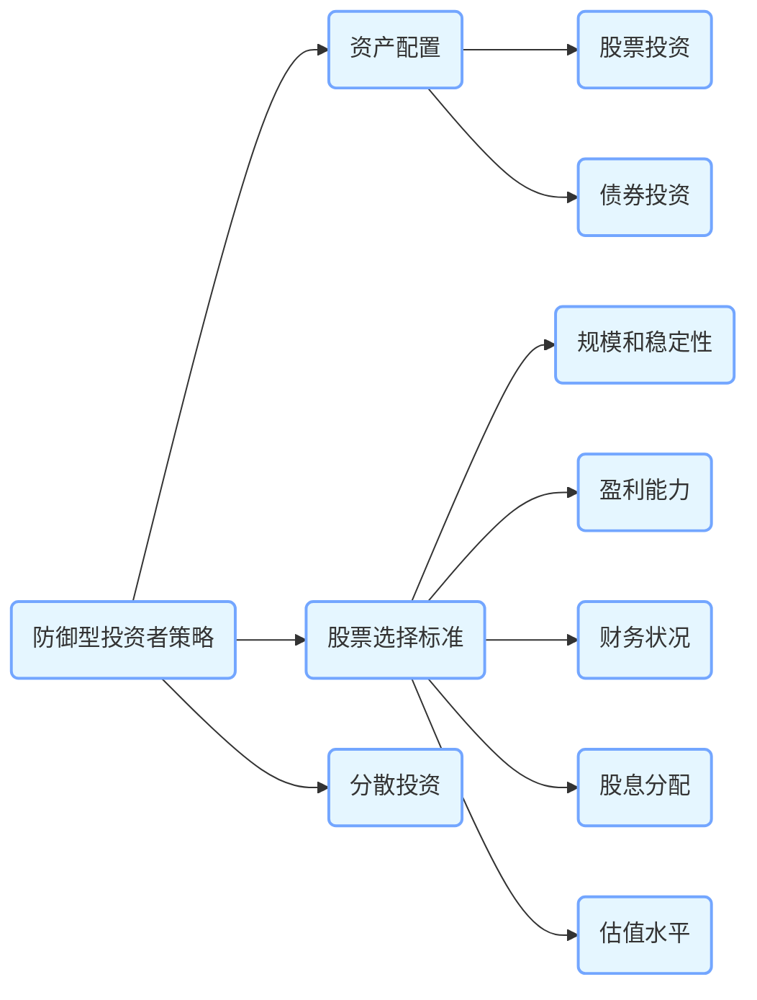

# 本杰明格雷厄姆的防御型投资者策略

> 关键词：本杰明格雷厄姆、防御型投资者策略、价值投资、证券分析、财务分析

> 摘要：本文深入探讨了本杰明格雷厄姆所提出的防御型投资者策略。从该策略产生的背景出发，详细阐述其核心概念、算法原理、数学模型等内容。通过实际案例展示策略在投资实践中的应用，同时介绍相关的工具和资源。最后对防御型投资者策略的未来发展趋势与挑战进行总结，并给出常见问题解答和扩展阅读参考资料，旨在帮助投资者全面理解和运用这一经典投资策略。

## 1. 背景介绍 
### 1.1 目的和范围
本杰明格雷厄姆被誉为“价值投资之父”，他的投资理念和策略对现代金融市场产生了深远影响。防御型投资者策略是格雷厄姆为那些没有大量时间和专业知识来深入研究股票市场的普通投资者设计的。本文章的目的在于全面解析这一策略，涵盖其理论基础、操作方法、实际应用等方面，帮助投资者理解并运用该策略进行合理的资产配置和投资决策。范围包括对策略核心概念的阐释、相关算法原理的讲解、数学模型的分析，以及通过实际案例展示策略在不同市场环境下的应用。

### 1.2 预期读者
本文预期读者主要包括对投资感兴趣的普通大众，尤其是那些希望通过稳健投资实现资产保值增值的防御型投资者。同时，也适合金融专业的学生、研究人员以及初涉投资领域的从业者，他们可以通过本文深入了解格雷厄姆的防御型投资者策略，为进一步的学习和实践提供参考。

### 1.3 文档结构概述
本文将按照以下结构展开：首先介绍防御型投资者策略的核心概念，包括其定义、与其他投资策略的区别以及相关的架构原理；接着详细阐述核心算法原理和具体操作步骤，通过Python代码进行说明；然后介绍数学模型和公式，并结合实例进行讲解；之后通过实际项目案例展示策略的应用过程和效果；再探讨该策略的实际应用场景；随后推荐相关的学习资源、开发工具和论文著作；最后对策略的未来发展趋势与挑战进行总结，并提供常见问题解答和扩展阅读参考资料。

### 1.4 术语表
#### 1.4.1 核心术语定义
- **防御型投资者**：指那些缺乏专业投资知识和时间，追求资产稳健增值，注重风险控制的投资者。他们通常不愿意承担过高的风险，更倾向于选择较为保守的投资方式。
- **价值投资**：本杰明格雷厄姆提出的投资理念，强调通过分析公司的内在价值，寻找被市场低估的股票进行投资，以获取长期稳定的收益。
- **内在价值**：公司股票所代表的实际价值，是基于公司的财务状况、盈利能力、资产质量等因素综合评估得出的价值。
- **安全边际**：指股票的市场价格低于其内在价值的幅度。安全边际为投资者提供了一定的缓冲，降低了投资风险。

#### 1.4.2 相关概念解释
- **分散投资**：将资金分散投资于不同的资产类别、行业和公司，以降低单一投资带来的风险。防御型投资者通常会采用分散投资的策略，避免过度集中投资于某一只股票或某一个行业。
- **固定比例投资法**：一种资产配置方法，投资者根据自己的风险承受能力和投资目标，确定不同资产（如股票和债券）在投资组合中的固定比例，并定期进行调整，以保持投资组合的平衡。

#### 1.4.3 缩略词列表
- **P/E**：市盈率（Price-to-Earnings Ratio），是指股票价格与每股收益的比率，用于衡量股票的估值水平。
- **P/B**：市净率（Price-to-Book Ratio），是指股票价格与每股净资产的比率，反映了股票价格相对于公司净资产的倍数。
- **ROE**：净资产收益率（Return on Equity），是指公司净利润与股东权益的比率，衡量了公司运用自有资本的效率。

## 2. 核心概念与联系 

### 2.1 防御型投资者策略的定义
防御型投资者策略是本杰明格雷厄姆在其经典著作《聪明的投资者》中提出的一种投资方法。该策略的核心思想是通过合理的资产配置和选择具有稳定业绩和较低风险的投资标的，实现资产的稳健增值，同时最大限度地降低投资风险。防御型投资者通常不追求通过频繁的买卖股票来获取短期的高额收益，而是更注重长期投资和资产的安全性。

### 2.2 与其他投资策略的区别
与积极型投资者策略相比，防御型投资者策略更加保守。积极型投资者通常会花费大量的时间和精力进行市场研究和股票分析，试图通过挖掘被市场低估的股票或把握市场趋势来获取超额收益。他们可能会采用更激进的投资方法，如集中投资、频繁交易等。而防御型投资者则更倾向于选择那些具有良好业绩记录、财务状况稳定、股息分配合理的大型蓝筹股，并且会通过分散投资来降低风险。

与投机策略相比，防御型投资者策略更加注重基本面分析和价值评估。投机者通常不关注公司的内在价值，而是通过预测市场价格的短期波动来获取利润。他们可能会参与高风险的投资活动，如期货交易、杠杆投资等。而防御型投资者则会根据公司的财务报表、盈利能力、行业前景等因素来评估股票的内在价值，并在股票价格低于其内在价值时进行投资。

### 2.3 核心概念原理和架构
防御型投资者策略的核心原理是基于价值投资理念，通过寻找具有安全边际的股票来降低投资风险。其架构主要包括以下几个方面：

#### 资产配置
防御型投资者通常会将资产分配到股票和债券两个主要资产类别中。一般来说，股票投资可以提供较高的长期回报，但同时也伴随着较高的风险；债券投资则相对较为稳定，能够提供固定的收益和一定的本金保障。投资者可以根据自己的风险承受能力和投资目标，确定股票和债券在投资组合中的比例。例如，对于风险承受能力较低的投资者，可以将股票投资比例控制在30% - 50%之间，其余资金投资于债券；对于风险承受能力较高的投资者，可以适当提高股票投资比例，但一般也不宜超过70%。

#### 股票选择标准
格雷厄姆为防御型投资者制定了一系列的股票选择标准，主要包括以下几个方面：
- **规模和稳定性**：选择大型、知名、财务状况稳定的公司。一般来说，公司的市值应较大，具有较长的经营历史和稳定的业绩记录。
- **盈利能力**：公司应具有持续的盈利能力，过去几年的净利润应保持稳定增长。可以通过查看公司的财务报表，分析其净利润增长率、毛利率、净利率等指标来评估公司的盈利能力。
- **财务状况**：公司的财务状况应良好，资产负债率应较低，流动比率和速动比率应较高。这些指标可以反映公司的偿债能力和资金流动性。
- **股息分配**：公司应具有合理的股息分配政策，过去几年应持续分红，并且股息率应较高。股息率是指股息与股票价格的比率，反映了投资者从股票投资中获得的现金收益。
- **估值水平**：股票的估值应合理，市盈率和市净率应处于较低水平。可以通过与同行业其他公司的估值水平进行比较，来判断股票是否被低估。

#### 分散投资
防御型投资者会将资金分散投资于不同的行业和公司，以降低单一投资带来的风险。一般来说，投资组合中应包含至少10 - 15只不同的股票，并且这些股票应来自不同的行业。通过分散投资，可以避免因某一个行业或某一家公司的不利因素而导致整个投资组合的大幅下跌。

### 2.4 文本示意图
```plaintext
防御型投资者策略
|-- 资产配置
|   |-- 股票投资
|   |-- 债券投资
|-- 股票选择标准
|   |-- 规模和稳定性
|   |-- 盈利能力
|   |-- 财务状况
|   |-- 股息分配
|   |-- 估值水平
|-- 分散投资
```

### 2.5 Mermaid 流程图


## 3. 核心算法原理 & 具体操作步骤 

### 3.1 核心算法原理
防御型投资者策略的核心算法原理是基于价值投资理念，通过计算股票的内在价值和安全边际，来判断股票是否具有投资价值。具体来说，主要包括以下几个步骤：

#### 计算股票的内在价值
股票的内在价值是指公司股票所代表的实际价值，是基于公司的财务状况、盈利能力、资产质量等因素综合评估得出的价值。常用的计算方法包括股息折现模型（Dividend Discount Model，DDM）、自由现金流折现模型（Discounted Cash Flow Model，DCF）等。

股息折现模型的基本公式为：
$$V = \frac{D_1}{r - g}$$
其中，$V$ 表示股票的内在价值，$D_1$ 表示下一年的预期股息，$r$ 表示投资者要求的必要收益率，$g$ 表示股息的增长率。

自由现金流折现模型的基本公式为：
$$V = \sum_{t=1}^{n} \frac{FCF_t}{(1 + r)^t} + \frac{TV}{(1 + r)^n}$$
其中，$V$ 表示股票的内在价值，$FCF_t$ 表示第 $t$ 年的自由现金流，$r$ 表示投资者要求的必要收益率，$TV$ 表示终值，$n$ 表示预测期数。

#### 计算安全边际
安全边际是指股票的市场价格低于其内在价值的幅度。计算公式为：
$$安全边际 = \frac{内在价值 - 市场价格}{内在价值} \times 100\%$$

#### 判断投资价值
当股票的安全边际大于一定的阈值（如20% - 30%）时，说明股票被低估，具有投资价值；当安全边际小于阈值时，说明股票可能被高估，不建议投资。

### 3.2 具体操作步骤
#### 步骤一：确定投资目标和风险承受能力
投资者首先需要明确自己的投资目标，如资产保值、资产增值、获取股息收益等。同时，需要评估自己的风险承受能力，包括投资期限、财务状况、心理承受能力等因素。根据投资目标和风险承受能力，确定股票和债券在投资组合中的比例。

#### 步骤二：筛选符合条件的股票
根据格雷厄姆的股票选择标准，筛选出符合条件的股票。可以通过查看公司的财务报表、行业研究报告、财经新闻等渠道获取相关信息。具体筛选标准如下：
- **规模和稳定性**：选择市值较大、经营历史较长、业绩稳定的公司。
- **盈利能力**：公司过去几年的净利润应保持稳定增长，毛利率和净利率应处于行业平均水平以上。
- **财务状况**：公司的资产负债率应较低，流动比率和速动比率应较高。
- **股息分配**：公司过去几年应持续分红，并且股息率应较高。
- **估值水平**：股票的市盈率和市净率应处于较低水平。

#### 步骤三：计算股票的内在价值和安全边际
对于筛选出的符合条件的股票，使用股息折现模型或自由现金流折现模型计算其内在价值。然后，根据股票的市场价格计算安全边际。

#### 步骤四：构建投资组合
根据安全边际的大小，选择安全边际较大的股票构建投资组合。同时，注意投资组合的分散性，确保投资组合中包含不同行业、不同规模的股票。

#### 步骤五：定期调整投资组合
定期（如每年或每半年）对投资组合进行调整，根据股票的市场表现和公司的基本面变化，卖出安全边际较小或基本面恶化的股票，买入安全边际较大的股票，以保持投资组合的合理性和有效性。

### 3.3 Python 源代码实现
```python
import pandas as pd
import numpy as np

# 步骤二：筛选符合条件的股票
def filter_stocks(financial_data):
    # 筛选市值较大的公司
    large_cap_stocks = financial_data[financial_data['market_cap'] > 1000000000]  # 市值大于 10 亿美元
    
    # 筛选盈利能力较强的公司
    profitable_stocks = large_cap_stocks[large_cap_stocks['net_income_growth_rate'] > 0.1]  # 净利润增长率大于 10%
    
    # 筛选财务状况良好的公司
    healthy_finance_stocks = profitable_stocks[profitable_stocks['debt_ratio'] < 0.5]  # 资产负债率小于 50%
    
    # 筛选股息分配合理的公司
    dividend_stocks = healthy_finance_stocks[healthy_finance_stocks['dividend_yield'] > 0.03]  # 股息率大于 3%
    
    # 筛选估值水平较低的公司
    undervalued_stocks = dividend_stocks[dividend_stocks['pe_ratio'] < 15]  # 市盈率小于 15
    
    return undervalued_stocks

# 步骤三：计算股票的内在价值和安全边际
def calculate_intrinsic_value_and_margin_of_safety(financial_data):
    intrinsic_values = []
    margins_of_safety = []
    
    for index, row in financial_data.iterrows():
        # 假设使用股息折现模型计算内在价值
        D1 = row['dividend_per_share'] * (1 + row['dividend_growth_rate'])
        r = 0.1  # 投资者要求的必要收益率为 10%
        g = row['dividend_growth_rate']
        intrinsic_value = D1 / (r - g)
        
        market_price = row['market_price']
        margin_of_safety = (intrinsic_value - market_price) / intrinsic_value * 100
        
        intrinsic_values.append(intrinsic_value)
        margins_of_safety.append(margin_of_safety)
    
    financial_data['intrinsic_value'] = intrinsic_values
    financial_data['margin_of_safety'] = margins_of_safety
    
    return financial_data

# 步骤四：构建投资组合
def build_portfolio(financial_data, num_stocks=10):
    sorted_data = financial_data.sort_values(by='margin_of_safety', ascending=False)
    portfolio = sorted_data.head(num_stocks)
    
    return portfolio

# 示例数据
data = {
    'ticker': ['AAPL', 'GOOG', 'MSFT', 'AMZN', 'FB'],
    'market_cap': [2000000000000, 1500000000000, 1800000000000, 1600000000000, 1200000000000],
    'net_income_growth_rate': [0.15, 0.2, 0.12, 0.18, 0.16],
    'debt_ratio': [0.3, 0.2, 0.25, 0.35, 0.28],
    'dividend_yield': [0.02, 0.01, 0.03, 0.0, 0.025],
    'pe_ratio': [20, 25, 18, 30, 22],
    'dividend_per_share': [0.8, 0.0, 1.2, 0.0, 0.9],
    'dividend_growth_rate': [0.05, 0.0, 0.06, 0.0, 0.07],
    'market_price': [150, 2500, 300, 3500, 320]
}

financial_data = pd.DataFrame(data)

# 筛选符合条件的股票
filtered_stocks = filter_stocks(financial_data)

# 计算股票的内在价值和安全边际
stocks_with_intrinsic_value = calculate_intrinsic_value_and_margin_of_safety(filtered_stocks)

# 构建投资组合
portfolio = build_portfolio(stocks_with_intrinsic_value)

print("投资组合：")
print(portfolio)
```

### 3.4 代码解释
- `filter_stocks` 函数：根据格雷厄姆的股票选择标准，筛选出符合条件的股票。具体筛选条件包括市值、净利润增长率、资产负债率、股息率和市盈率等。
- `calculate_intrinsic_value_and_margin_of_safety` 函数：使用股息折现模型计算股票的内在价值，并根据市场价格计算安全边际。
- `build_portfolio` 函数：根据安全边际的大小，选择安全边际较大的股票构建投资组合。
- 示例数据部分：创建了一个包含股票基本信息的 DataFrame，然后依次调用上述三个函数，最终得到投资组合并打印输出。

## 4. 数学模型和公式 & 详细讲解 & 举例说明 

### 4.1 股息折现模型（DDM）
#### 公式
$$V = \frac{D_1}{r - g}$$
其中，$V$ 表示股票的内在价值，$D_1$ 表示下一年的预期股息，$r$ 表示投资者要求的必要收益率，$g$ 表示股息的增长率。

#### 详细讲解
股息折现模型的基本思想是，股票的价值等于其未来所有股息的现值之和。在假设股息以固定增长率 $g$ 增长的情况下，可以推导出上述公式。该模型的前提条件是公司的股息政策稳定，股息增长率保持不变，并且投资者要求的必要收益率大于股息增长率。

#### 举例说明
假设某公司当前的股息为每股 $D_0 = 2$ 元，股息增长率 $g = 5\%$，投资者要求的必要收益率 $r = 10\%$。则下一年的预期股息 $D_1 = D_0 \times (1 + g) = 2 \times (1 + 0.05) = 2.1$ 元。根据股息折现模型，该股票的内在价值为：
$$V = \frac{D_1}{r - g} = \frac{2.1}{0.1 - 0.05} = 42$$ 元

如果该股票的市场价格为 35 元，则安全边际为：
$$安全边际 = \frac{42 - 35}{42} \times 100\% \approx 16.67\%$$

### 4.2 自由现金流折现模型（DCF）
#### 公式
$$V = \sum_{t=1}^{n} \frac{FCF_t}{(1 + r)^t} + \frac{TV}{(1 + r)^n}$$
其中，$V$ 表示股票的内在价值，$FCF_t$ 表示第 $t$ 年的自由现金流，$r$ 表示投资者要求的必要收益率，$TV$ 表示终值，$n$ 表示预测期数。

#### 详细讲解
自由现金流折现模型的基本思想是，股票的价值等于其未来所有自由现金流的现值之和。自由现金流是指公司在满足了所有营运资本需求和资本支出后剩余的现金流量，它反映了公司实际可用于分配给股东的现金。预测期数 $n$ 通常根据公司的发展阶段和行业特点来确定，一般为 5 - 10 年。终值 $TV$ 表示预测期结束后公司的价值，通常使用永续增长模型来计算：
$$TV = \frac{FCF_{n+1}}{r - g}$$
其中，$FCF_{n+1}$ 表示预测期结束后下一年的自由现金流，$g$ 表示永续增长率。

#### 举例说明
假设某公司未来 5 年的自由现金流分别为 $FCF_1 = 100$ 万元，$FCF_2 = 120$ 万元，$FCF_3 = 140$ 万元，$FCF_4 = 160$ 万元，$FCF_5 = 180$ 万元，投资者要求的必要收益率 $r = 10\%$，永续增长率 $g = 3\%$。预测期结束后下一年的自由现金流 $FCF_6 = FCF_5 \times (1 + g) = 180 \times (1 + 0.03) = 185.4$ 万元。则终值为：
$$TV = \frac{FCF_6}{r - g} = \frac{185.4}{0.1 - 0.03} \approx 2648.57$$ 万元

该公司股票的内在价值为：
$$V = \frac{100}{(1 + 0.1)^1} + \frac{120}{(1 + 0.1)^2} + \frac{140}{(1 + 0.1)^3} + \frac{160}{(1 + 0.1)^4} + \frac{180}{(1 + 0.1)^5} + \frac{2648.57}{(1 + 0.1)^5} \approx 1973.62$$ 万元

### 4.3 市盈率估值法
#### 公式
$$P = EPS \times P/E$$
其中，$P$ 表示股票的价格，$EPS$ 表示每股收益，$P/E$ 表示市盈率。

#### 详细讲解
市盈率估值法是一种相对简单的估值方法，它通过比较同行业其他公司的市盈率，来评估目标公司股票的价值。市盈率反映了投资者愿意为每一元盈利支付的价格，一般来说，市盈率越低，股票越被低估。

#### 举例说明
假设某公司的每股收益 $EPS = 5$ 元，同行业平均市盈率 $P/E = 15$。则该公司股票的合理价格为：
$$P = EPS \times P/E = 5 \times 15 = 75$$ 元

如果该股票的市场价格为 60 元，则可以认为该股票被低估，具有投资价值。

## 5. 项目实战：代码实际案例和详细解释说明 

### 5.1 开发环境搭建
#### 安装 Python
首先需要安装 Python 环境，建议使用 Python 3.7 及以上版本。可以从 Python 官方网站（https://www.python.org/downloads/）下载安装包，按照安装向导进行安装。

#### 安装必要的库
使用 `pip` 命令安装以下必要的库：
```sh
pip install pandas numpy
```
- `pandas`：用于数据处理和分析，方便读取和处理股票的财务数据。
- `numpy`：用于数值计算，提供高效的数组操作和数学函数。

### 5.2 源代码详细实现和代码解读
以下是一个完整的项目实战代码示例，结合前面介绍的核心算法原理和操作步骤，实现防御型投资者策略的股票筛选和投资组合构建：

```python
import pandas as pd
import numpy as np

# 步骤二：筛选符合条件的股票
def filter_stocks(financial_data):
    # 筛选市值较大的公司
    large_cap_stocks = financial_data[financial_data['market_cap'] > 1000000000]  # 市值大于 10 亿美元
    
    # 筛选盈利能力较强的公司
    profitable_stocks = large_cap_stocks[large_cap_stocks['net_income_growth_rate'] > 0.1]  # 净利润增长率大于 10%
    
    # 筛选财务状况良好的公司
    healthy_finance_stocks = profitable_stocks[profitable_stocks['debt_ratio'] < 0.5]  # 资产负债率小于 50%
    
    # 筛选股息分配合理的公司
    dividend_stocks = healthy_finance_stocks[healthy_finance_stocks['dividend_yield'] > 0.03]  # 股息率大于 3%
    
    # 筛选估值水平较低的公司
    undervalued_stocks = dividend_stocks[dividend_stocks['pe_ratio'] < 15]  # 市盈率小于 15
    
    return undervalued_stocks

# 步骤三：计算股票的内在价值和安全边际
def calculate_intrinsic_value_and_margin_of_safety(financial_data):
    intrinsic_values = []
    margins_of_safety = []
    
    for index, row in financial_data.iterrows():
        # 假设使用股息折现模型计算内在价值
        D1 = row['dividend_per_share'] * (1 + row['dividend_growth_rate'])
        r = 0.1  # 投资者要求的必要收益率为 10%
        g = row['dividend_growth_rate']
        intrinsic_value = D1 / (r - g)
        
        market_price = row['market_price']
        margin_of_safety = (intrinsic_value - market_price) / intrinsic_value * 100
        
        intrinsic_values.append(intrinsic_value)
        margins_of_safety.append(margin_of_safety)
    
    financial_data['intrinsic_value'] = intrinsic_values
    financial_data['margin_of_safety'] = margins_of_safety
    
    return financial_data

# 步骤四：构建投资组合
def build_portfolio(financial_data, num_stocks=10):
    sorted_data = financial_data.sort_values(by='margin_of_safety', ascending=False)
    portfolio = sorted_data.head(num_stocks)
    
    return portfolio

# 步骤五：模拟数据加载和投资组合构建
def main():
    # 模拟股票财务数据
    data = {
        'ticker': ['AAPL', 'GOOG', 'MSFT', 'AMZN', 'FB', 'JNJ', 'PG', 'KO', 'PEP', 'XOM'],
        'market_cap': [2000000000000, 1500000000000, 1800000000000, 1600000000000, 1200000000000, 400000000000, 350000000000, 250000000000, 280000000000, 300000000000],
        'net_income_growth_rate': [0.15, 0.2, 0.12, 0.18, 0.16, 0.08, 0.09, 0.07, 0.1, 0.06],
        'debt_ratio': [0.3, 0.2, 0.25, 0.35, 0.28, 0.4, 0.38, 0.32, 0.35, 0.42],
        'dividend_yield': [0.02, 0.01, 0.03, 0.0, 0.025, 0.035, 0.032, 0.038, 0.033, 0.04],
        'pe_ratio': [20, 25, 18, 30, 22, 14, 13, 12, 13, 11],
        'dividend_per_share': [0.8, 0.0, 1.2, 0.0, 0.9, 2.0, 1.8, 1.5, 1.6, 2.2],
        'dividend_growth_rate': [0.05, 0.0, 0.06, 0.0, 0.07, 0.04, 0.03, 0.035, 0.04, 0.02],
        'market_price': [150, 2500, 300, 3500, 320, 180, 150, 60, 130, 50]
    }
    
    financial_data = pd.DataFrame(data)
    
    # 筛选符合条件的股票
    filtered_stocks = filter_stocks(financial_data)
    
    # 计算股票的内在价值和安全边际
    stocks_with_intrinsic_value = calculate_intrinsic_value_and_margin_of_safety(filtered_stocks)
    
    # 构建投资组合
    portfolio = build_portfolio(stocks_with_intrinsic_value)
    
    print("筛选后的股票：")
    print(filtered_stocks)
    print("\n计算内在价值和安全边际后的股票：")
    print(stocks_with_intrinsic_value)
    print("\n投资组合：")
    print(portfolio)

if __name__ == "__main__":
    main()
```

### 5.3 代码解读与分析
#### 整体流程
代码主要分为五个步骤，依次实现了股票筛选、内在价值和安全边际计算、投资组合构建的功能：
1. **数据模拟**：在 `main` 函数中，模拟了包含 10 只股票的财务数据，存储在一个字典中，并使用 `pandas` 的 `DataFrame` 进行数据处理。
2. **股票筛选**：调用 `filter_stocks` 函数，根据市值、净利润增长率、资产负债率、股息率和市盈率等标准筛选出符合条件的股票。
3. **内在价值和安全边际计算**：调用 `calculate_intrinsic_value_and_margin_of_safety` 函数，使用股息折现模型计算每只股票的内在价值，并根据市场价格计算安全边际。
4. **投资组合构建**：调用 `build_portfolio` 函数，根据安全边际的大小对股票进行排序，选择安全边际较大的前 10 只股票构建投资组合。
5. **结果输出**：打印筛选后的股票、计算内在价值和安全边际后的股票以及最终的投资组合。

#### 关键函数分析
- `filter_stocks` 函数：通过对 `DataFrame` 进行条件筛选，逐步筛选出符合条件的股票。使用布尔索引实现条件筛选，代码简洁高效。
- `calculate_intrinsic_value_and_margin_of_safety` 函数：使用 `iterrows` 方法遍历 `DataFrame` 中的每一行，根据股息折现模型计算内在价值和安全边际，并将结果添加到 `DataFrame` 中。
- `build_portfolio` 函数：使用 `sort_values` 方法对 `DataFrame` 按安全边际进行排序，然后选择前 10 只股票作为投资组合。

#### 注意事项
- 代码中的参数（如市值阈值、净利润增长率阈值、必要收益率等）可以根据实际情况进行调整。
- 股息折现模型假设股息增长率保持不变，实际应用中可能需要根据公司的具体情况进行调整。
- 代码中的数据是模拟数据，实际应用中需要从真实的数据源（如财经网站、金融数据库等）获取股票的财务数据。

## 6. 实际应用场景 
### 6.1 个人投资者资产配置
对于普通个人投资者来说，防御型投资者策略是一种非常适合的投资方法。个人投资者通常没有专业的投资知识和大量的时间来研究市场，他们更注重资产的稳健增值和风险控制。通过采用防御型投资者策略，个人投资者可以将资产合理分配到股票和债券中，选择具有稳定业绩和较低风险的股票构建投资组合，从而实现资产的长期稳定增长。

例如，一位中年投资者希望为自己的退休生活储备资金，他可以将一部分资金投资于债券，以获取稳定的收益和本金保障；另一部分资金投资于符合防御型投资者策略标准的大型蓝筹股，如可口可乐、宝洁、强生等。这些公司具有良好的业绩记录、稳定的股息分配和较低的估值水平，能够为投资者提供一定的股息收益和资本增值潜力。

### 6.2 养老基金投资
养老基金是为了保障退休人员的生活而设立的基金，其投资目标是实现资产的长期稳健增值，同时确保资金的安全性。防御型投资者策略非常符合养老基金的投资需求。养老基金可以通过分散投资于不同行业和公司的股票和债券，降低投资风险。在股票选择方面，养老基金可以遵循格雷厄姆的股票选择标准，选择那些具有稳定盈利能力、良好财务状况和合理股息分配的公司。

例如，某养老基金在进行资产配置时，将 60% 的资金投资于债券，40% 的资金投资于股票。在股票投资中，该基金选择了一批大型蓝筹股，如工商银行、中国石油、中国移动等。这些公司具有较高的市值、稳定的业绩和较低的估值水平，能够为养老基金带来稳定的股息收益和资本增值。

### 6.3 保险资金投资
保险资金的投资具有长期性、稳定性和安全性的特点，因此也适合采用防御型投资者策略。保险公司可以将一部分保险资金投资于债券，以满足其负债匹配的需求；另一部分资金投资于股票，以获取更高的收益。在股票投资中，保险公司可以选择那些具有良好业绩记录、稳定现金流和较低风险的公司。

例如，某保险公司在进行资产配置时，将 70% 的资金投资于债券，30% 的资金投资于股票。在股票投资中，该公司选择了一些消费类、医药类和公用事业类的股票，如贵州茅台、恒瑞医药、长江电力等。这些公司具有较强的盈利能力、稳定的现金流和较低的估值水平，能够为保险公司带来稳定的收益和资产增值。

### 6.4 基金公司投资组合管理
基金公司在管理投资组合时，也可以借鉴防御型投资者策略。基金经理可以根据市场情况和投资者的风险偏好，将基金资产合理分配到股票和债券中，并选择符合防御型投资者策略标准的股票构建投资组合。通过采用防御型投资者策略，基金公司可以降低投资组合的风险，提高投资组合的稳定性和收益性。

例如，某基金公司管理的一只混合型基金，其投资策略是采用防御型投资者策略。该基金将 50% 的资产投资于债券，50% 的资产投资于股票。在股票投资中，基金经理选择了一批具有稳定业绩和较低风险的股票，如招商银行、中国平安、格力电器等。通过这种资产配置和股票选择方式，该基金在市场波动较大的情况下，仍然能够保持相对稳定的业绩表现。

## 7. 工具和资源推荐
### 7.1 学习资源推荐
#### 7.1.1 书籍推荐
- 《聪明的投资者》（The Intelligent Investor）：本杰明格雷厄姆的经典著作，被誉为投资界的圣经。本书详细介绍了防御型投资者和积极型投资者的投资策略，以及如何进行股票和债券投资。
- 《证券分析》（Security Analysis）：同样是本杰明格雷厄姆的著作，是价值投资理论的奠基之作。本书深入阐述了价值投资的基本原理和方法，包括财务报表分析、估值方法、投资组合构建等内容。
- 《巴菲特致股东的信：投资者和公司高管教程》（Letters to Shareholders of Berkshire Hathaway）：沃伦巴菲特每年写给伯克希尔哈撒韦股东的信，集合了巴菲特的投资理念和经验。通过阅读这些信件，投资者可以学习到巴菲特如何运用格雷厄姆的价值投资理念进行投资决策。

#### 7.1.2 在线课程
- Coursera 上的“投资学原理”（Principles of Investing）：该课程由宾夕法尼亚大学的教授授课，涵盖了投资的基本概念、资产定价理论、投资组合管理等内容，对防御型投资者策略有一定的介绍。
- edX 上的“金融市场”（Financial Markets）：由耶鲁大学的教授授课，课程内容包括金融市场的运作机制、投资工具的选择、风险管理等方面，有助于投资者深入理解投资市场和防御型投资者策略。

#### 7.1.3 技术博客和网站
- 雪球（https://xueqiu.com/）：国内知名的投资社区，提供股票、基金、债券等投资产品的行情信息、分析评论和投资交流平台。投资者可以在雪球上学习其他投资者的经验和策略，了解市场动态。
- 价值投资网（https://www.value-investing.info/）：专注于价值投资领域的网站，提供价值投资的理论知识、案例分析、研究报告等内容，对防御型投资者策略有深入的探讨。
- Seeking Alpha（https://seekingalpha.com/）：国际知名的金融投资网站，提供全球金融市场的新闻、分析和投资建议。网站上有很多关于价值投资和防御型投资者策略的文章和研究报告。

### 7.2 开发工具框架推荐
#### 7.2.1 IDE和编辑器
- PyCharm：一款专业的 Python 集成开发环境（IDE），提供代码编辑、调试、代码分析等功能，适合开发和调试与防御型投资者策略相关的 Python 代码。
- Jupyter Notebook：一个交互式的开发环境，支持 Python、R 等多种编程语言。可以通过 Jupyter Notebook 进行数据探索、模型开发和结果展示，非常适合进行投资数据分析和策略验证。

#### 7.2.2 调试和性能分析工具
- PDB：Python 自带的调试器，可以帮助开发者在代码执行过程中进行单步调试、查看变量值等操作，方便排查代码中的错误。
- cProfile：Python 的性能分析工具，可以分析代码的运行时间和函数调用次数，帮助开发者找出代码中的性能瓶颈。

#### 7.2.3 相关框架和库
- Pandas：用于数据处理和分析的 Python 库，提供了高效的数据结构和数据操作方法，方便处理股票的财务数据和进行数据分析。
- NumPy：用于数值计算的 Python 库，提供了高效的数组操作和数学函数，在计算股票的内在价值和安全边际等方面非常有用。
- Matplotlib：用于数据可视化的 Python 库，可以将股票的财务数据和投资组合的表现以图表的形式展示出来，方便投资者进行分析和决策。

### 7.3 相关论文著作推荐
#### 7.3.1 经典论文
- Graham, Benjamin, and David Dodd. "Security Analysis." McGraw-Hill, 1934. 该论文是本杰明格雷厄姆和大卫多德的经典著作《证券分析》的基础，奠定了价值投资理论的基础，对防御型投资者策略的发展产生了深远影响。
- Fama, Eugene F., and Kenneth R. French. "The Cross-Section of Expected Stock Returns." Journal of Finance 47, no. 2 (1992): 427-465. 该论文提出了著名的 Fama-French 三因子模型，解释了股票收益率的横截面差异，对投资组合的构建和风险管理有重要的指导意义。

#### 7.3.2 最新研究成果
- Asness, Clifford S., Andrea Frazzini, and Lasse Heje Pedersen. "Quality Minus Junk." Review of Accounting Studies 21, no. 1 (2016): 34-112. 该论文提出了“质量减去垃圾”（Quality Minus Junk）的投资策略，通过筛选高质量的公司进行投资，为防御型投资者策略提供了新的思路。
- Harvey, Campbell R., Yan Liu, and Heqing Zhu. "… and the Cross-Section of Expected Returns." Review of Financial Studies 29, no. 1 (2016): 5-68. 该论文对股票收益率的横截面预测因子进行了全面的研究，为投资者选择投资标的提供了更多的参考依据。

#### 7.3.3 应用案例分析
- Buffett, Warren E. "The Superinvestors of Graham-and-Doddsville." Hermes 17, no. 1 (1984): 4-15. 该论文是沃伦巴菲特在哥伦比亚大学的演讲，介绍了一批遵循本杰明格雷厄姆价值投资理念的投资者的成功案例，展示了防御型投资者策略在实际应用中的有效性。
- Greenblatt, Joel. "The Little Book That Beats the Market." Wiley, 2005. 该书中介绍了作者的“神奇公式”投资策略，通过筛选具有高资本回报率和低市盈率的公司进行投资，取得了良好的投资业绩，为防御型投资者策略的应用提供了案例参考。

## 8. 总结：未来发展趋势与挑战
### 8.1 未来发展趋势
#### 与量化投资的融合
随着信息技术的发展和金融数据的丰富，防御型投资者策略将越来越多地与量化投资相结合。量化投资通过运用数学模型和计算机算法，对大量的金融数据进行分析和处理，能够更客观、更高效地筛选出符合防御型投资者策略标准的股票。例如，利用机器学习算法对公司的财务指标、市场数据等进行分析，预测股票的未来表现，从而优化投资组合的构建。

#### 关注可持续投资
在全球可持续发展的背景下，防御型投资者将越来越关注企业的社会责任和环境、社会与治理（ESG）因素。具有良好 ESG 表现的公司通常具有更强的竞争力和抗风险能力，能够为投资者带来长期稳定的回报。因此，防御型投资者策略可能会将 ESG 因素纳入股票选择标准中，选择那些在环境保护、社会责任和公司治理方面表现优秀的公司进行投资。

#### 全球化投资
随着全球金融市场的一体化，防御型投资者将有更多的机会进行全球化投资。通过投资于不同国家和地区的股票和债券，投资者可以进一步分散投资风险，提高投资组合的稳定性和收益性。同时，全球化投资也可以让投资者分享不同国家和地区经济发展的成果。

### 8.2 挑战
#### 市场环境变化
金融市场是复杂多变的，宏观经济环境、政策法规、行业竞争等因素都会对股票价格和公司业绩产生影响。防御型投资者策略是基于历史数据和经验总结出来的，在市场环境发生重大变化时，可能会面临一定的挑战。例如，在经济衰退期间，许多公司的业绩可能会受到影响，即使是符合防御型投资者策略标准的公司也可能无法幸免。

#### 数据质量和可靠性
防御型投资者策略的实施依赖于准确、可靠的金融数据。然而，金融数据的质量和可靠性可能会受到多种因素的影响，如数据来源的可信度、数据处理过程中的误差等。如果使用了不准确或不可靠的数据，可能会导致投资决策的失误。

#### 投资者情绪和行为偏差
投资者的情绪和行为偏差也会对防御型投资者策略的实施产生影响。在市场上涨时，投资者可能会过于乐观，忽视股票的估值水平和风险；在市场下跌时，投资者可能会过于恐慌，做出非理性的投资决策。因此，投资者需要保持理性和冷静，避免受到情绪和行为偏差的影响。

## 9. 附录：常见问题与解答
### 9.1 防御型投资者策略适合所有投资者吗？
防御型投资者策略适合那些缺乏专业投资知识和时间，追求资产稳健增值，注重风险控制的投资者。但并不是所有投资者都适合采用该策略。对于那些具有丰富投资经验和专业知识，愿意承担较高风险以获取更高收益的投资者来说，可能更适合采用积极型投资者策略或其他更激进的投资方法。

### 9.2 如何确定股票和债券在投资组合中的比例？
股票和债券在投资组合中的比例应根据投资者的风险承受能力、投资目标和投资期限等因素来确定。一般来说，风险承受能力较低、投资目标为资产保值的投资者可以将股票投资比例控制在较低水平，如 30% - 50%，其余资金投资于债券；风险承受能力较高、投资目标为资产增值的投资者可以适当提高股票投资比例，但一般也不宜超过 70%。投资期限也是一个重要的考虑因素，投资期限较长的投资者可以适当增加股票投资比例，因为股票在长期内通常具有较高的回报率。

### 9.3 如何获取股票的财务数据？
可以通过以下几种途径获取股票的财务数据：
- 财经网站：如东方财富网、新浪财经、雪球等，这些网站提供了丰富的股票财务