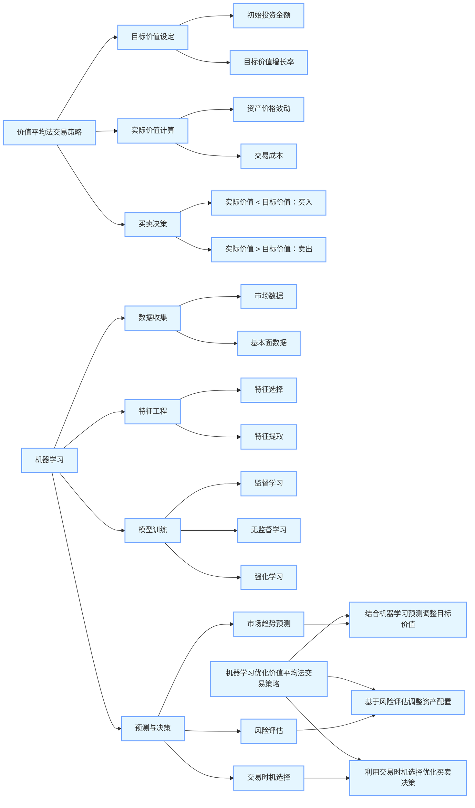

# 机器学习优化价值平均法交易策略

> 关键词：机器学习、价值平均法、交易策略、优化、量化交易

> 摘要：本文聚焦于利用机器学习技术对价值平均法交易策略进行优化。首先介绍了相关背景知识，包括目的、预期读者等内容。接着阐述了价值平均法和机器学习的核心概念及联系，详细讲解了核心算法原理与具体操作步骤，并给出Python代码示例。同时，介绍了相关数学模型和公式，并举例说明。通过项目实战，展示了如何搭建开发环境、实现源代码以及对代码进行解读分析。还探讨了该优化策略的实际应用场景，推荐了学习所需的工具和资源。最后总结了未来发展趋势与挑战，提供常见问题解答和扩展阅读参考资料，旨在为投资者和研究者提供全面深入的价值平均法交易策略优化方案。

## 1. 背景介绍 
### 1.1 目的和范围
本研究的主要目的是借助机器学习技术对传统的价值平均法交易策略进行优化，以提高交易策略的盈利能力和稳定性。价值平均法是一种常见的投资策略，通过定期调整投资组合的价值来实现资产的均衡配置。然而，传统的价值平均法往往基于固定的规则和假设，缺乏对市场动态变化的适应性。机器学习具有强大的数据分析和模式识别能力，能够从大量的历史数据中挖掘出有价值的信息，从而为交易决策提供更科学的依据。

本研究的范围涵盖了价值平均法交易策略的基本原理、机器学习算法的选择与应用、优化策略的实现与评估等方面。通过对这些内容的深入研究，旨在为投资者和量化交易从业者提供一种新的交易思路和方法。

### 1.2 预期读者
本文的预期读者主要包括以下几类人群：
1. **投资者**：对量化交易和投资策略优化感兴趣的个人投资者，希望通过学习和应用本文介绍的方法，提高自己的投资收益。
2. **量化交易从业者**：从事量化交易策略开发和研究的专业人士，期望从本文中获取新的思路和技术，完善自己的交易策略体系。
3. **机器学习爱好者**：对机器学习在金融领域的应用感兴趣的技术人员，希望通过实际案例了解机器学习在交易策略优化中的具体应用。
4. **金融研究者**：关注金融市场交易策略和风险管理的研究人员，通过本文可以深入了解价值平均法交易策略的优化方法和效果。

### 1.3 文档结构概述
本文将按照以下结构进行组织：
1. **背景介绍**：阐述研究的目的和范围、预期读者以及文档的结构概述，并给出相关术语的定义和解释。
2. **核心概念与联系**：介绍价值平均法和机器学习的核心概念，分析它们之间的联系，并通过文本示意图和Mermaid流程图进行直观展示。
3. **核心算法原理 & 具体操作步骤**：详细讲解机器学习优化价值平均法交易策略的核心算法原理，并给出具体的操作步骤和Python代码实现。
4. **数学模型和公式 & 详细讲解 & 举例说明**：介绍相关的数学模型和公式，对其进行详细讲解，并通过具体的例子进行说明。
5. **项目实战：代码实际案例和详细解释说明**：通过一个实际的项目案例，展示如何搭建开发环境、实现优化策略的源代码，并对代码进行详细的解读和分析。
6. **实际应用场景**：探讨机器学习优化价值平均法交易策略在不同市场环境下的实际应用场景。
7. **工具和资源推荐**：推荐学习和实践过程中所需的工具和资源，包括学习资源、开发工具框架和相关论文著作等。
8. **总结：未来发展趋势与挑战**：总结本文的主要内容，分析机器学习优化价值平均法交易策略的未来发展趋势和面临的挑战。
9. **附录：常见问题与解答**：提供常见问题的解答，帮助读者更好地理解和应用本文介绍的方法。
10. **扩展阅读 & 参考资料**：提供相关的扩展阅读材料和参考资料，方便读者进一步深入学习和研究。

### 1.4 术语表
#### 1.4.1 核心术语定义
- **价值平均法（Value Averaging）**：一种投资策略，通过定期调整投资组合的价值，使其按照预先设定的目标价值增长。在每个投资周期，投资者根据投资组合的实际价值与目标价值的差异，决定买入或卖出一定数量的资产。
- **机器学习（Machine Learning）**：一门多领域交叉学科，涉及概率论、统计学、逼近论、凸分析、算法复杂度理论等多门学科。它专门研究计算机怎样模拟或实现人类的学习行为，以获取新的知识或技能，重新组织已有的知识结构使之不断改善自身的性能。
- **交易策略（Trading Strategy）**：投资者在金融市场中进行交易时所遵循的一系列规则和方法，旨在实现投资目标，如获取最大收益、降低风险等。
- **量化交易（Quantitative Trading）**：利用数学模型和计算机算法进行交易决策的一种交易方式。通过对大量历史数据的分析和挖掘，找出市场中的规律和趋势，从而制定出科学合理的交易策略。

#### 1.4.2 相关概念解释
- **目标价值**：在价值平均法中，预先设定的投资组合在每个投资周期应达到的价值。目标价值通常根据投资者的投资计划和预期收益来确定。
- **实际价值**：投资组合在每个投资周期结束时的实际市场价值。实际价值受到资产价格波动、交易成本等因素的影响。
- **特征工程**：在机器学习中，将原始数据转换为适合模型训练的特征的过程。特征工程包括特征选择、特征提取、特征转换等步骤，旨在提高模型的性能和泛化能力。
- **模型训练**：使用历史数据对机器学习模型进行训练，调整模型的参数，使其能够对未知数据进行准确的预测和分类。

#### 1.4.3 缩略词列表
- **ML**：Machine Learning，机器学习
- **VA**：Value Averaging，价值平均法
- **QTrading**：Quantitative Trading，量化交易

## 2. 核心概念与联系 

### 价值平均法核心概念
价值平均法的核心思想是通过定期调整投资组合的价值，使其按照预定的目标价值增长。具体来说，在每个投资周期开始时，投资者根据目标价值和上一周期的实际价值，计算出本周期需要买入或卖出的资产数量。

假设投资者设定的初始投资金额为 $V_0$，投资周期为 $T$，目标价值增长率为 $r$。则在第 $n$ 个投资周期的目标价值 $V_n$ 可以通过以下公式计算：

$$V_n = V_0(1 + r)^n$$

在第 $n$ 个投资周期结束时，投资组合的实际价值为 $A_n$。如果 $A_n < V_n$，则投资者需要买入一定数量的资产，使投资组合的价值达到 $V_n$；如果 $A_n > V_n$，则投资者需要卖出一定数量的资产，使投资组合的价值降至 $V_n$。

### 机器学习核心概念
机器学习是一门让计算机通过数据学习模式和规律，并利用这些模式和规律进行预测和决策的学科。常见的机器学习算法包括监督学习、无监督学习和强化学习。

- **监督学习**：使用带有标签的数据进行训练，模型学习输入数据与标签之间的映射关系，从而对新的输入数据进行预测。例如，线性回归、逻辑回归、决策树等。
- **无监督学习**：使用无标签的数据进行训练，模型发现数据中的潜在结构和模式。例如，聚类分析、降维等。
- **强化学习**：智能体通过与环境进行交互，根据环境反馈的奖励信号来学习最优的行为策略。例如，Q - learning、深度强化学习等。

### 核心概念联系
将机器学习应用于价值平均法交易策略的优化，主要是利用机器学习算法对市场数据进行分析和预测，从而更准确地确定每个投资周期的目标价值和买卖决策。

具体来说，机器学习可以通过以下方式与价值平均法相结合：
1. **市场趋势预测**：使用机器学习算法对市场趋势进行预测，根据预测结果调整目标价值增长率 $r$，使投资组合更好地适应市场变化。
2. **风险评估**：通过机器学习模型评估市场风险，根据风险水平调整投资组合的资产配置，降低投资风险。
3. **交易时机选择**：利用机器学习算法分析市场数据，找出最佳的交易时机，提高交易的盈利能力。

### 文本示意图
```plaintext
价值平均法交易策略
|
|-- 目标价值设定
|   |-- 初始投资金额
|   |-- 目标价值增长率
|
|-- 实际价值计算
|   |-- 资产价格波动
|   |-- 交易成本
|
|-- 买卖决策
|   |-- 实际价值 < 目标价值：买入
|   |-- 实际价值 > 目标价值：卖出

机器学习
|
|-- 数据收集
|   |-- 市场数据
|   |-- 基本面数据
|
|-- 特征工程
|   |-- 特征选择
|   |-- 特征提取
|
|-- 模型训练
|   |-- 监督学习
|   |-- 无监督学习
|   |-- 强化学习
|
|-- 预测与决策
|   |-- 市场趋势预测
|   |-- 风险评估
|   |-- 交易时机选择

机器学习优化价值平均法交易策略
|
|-- 结合机器学习预测调整目标价值
|-- 基于风险评估调整资产配置
|-- 利用交易时机选择优化买卖决策
```

### Mermaid 流程图


## 3. 核心算法原理 & 具体操作步骤 

### 核心算法原理
我们选择使用线性回归模型来预测市场趋势，进而优化价值平均法的目标价值增长率。线性回归是一种简单而有效的监督学习算法，它通过拟合一条直线来描述自变量和因变量之间的线性关系。

假设我们有 $n$ 个样本数据，每个样本包含 $m$ 个特征 $x_{i1}, x_{i2}, \cdots, x_{im}$ 和一个目标值 $y_i$，线性回归模型的表达式为：

$$y_i = \theta_0 + \theta_1x_{i1} + \theta_2x_{i2} + \cdots + \theta_mx_{im} + \epsilon_i$$

其中，$\theta_0, \theta_1, \cdots, \theta_m$ 是模型的参数，$\epsilon_i$ 是误差项。

我们的目标是找到一组最优的参数 $\theta$，使得预测值 $\hat{y}_i$ 与真实值 $y_i$ 之间的误差最小。通常使用最小二乘法来求解最优参数，即最小化以下损失函数：

$$J(\theta) = \frac{1}{2n}\sum_{i = 1}^{n}(y_i - \hat{y}_i)^2 = \frac{1}{2n}\sum_{i = 1}^{n}(y_i - (\theta_0 + \theta_1x_{i1} + \theta_2x_{i2} + \cdots + \theta_mx_{im}))^2$$

### 具体操作步骤
1. **数据收集**：收集市场数据，包括股票价格、成交量、市盈率等，以及基本面数据，如公司财务报表、宏观经济指标等。
2. **特征工程**：对收集到的数据进行预处理，包括缺失值处理、异常值处理、特征标准化等。选择与市场趋势相关的特征作为输入特征。
3. **模型训练**：将处理后的数据划分为训练集和测试集，使用训练集对线性回归模型进行训练，得到最优的模型参数。
4. **市场趋势预测**：使用训练好的模型对未来市场趋势进行预测，得到预测的市场收益率。
5. **调整目标价值增长率**：根据预测的市场收益率，调整价值平均法的目标价值增长率 $r$。
6. **买卖决策**：根据调整后的目标价值和投资组合的实际价值，进行买卖决策。

### Python 代码实现
```python
import numpy as np
from sklearn.linear_model import LinearRegression
from sklearn.model_selection import train_test_split
from sklearn.preprocessing import StandardScaler

# 数据收集
# 假设我们有以下特征数据 X 和目标数据 y
X = np.array([[1, 2, 3], [4, 5, 6], [7, 8, 9], [10, 11, 12]])
y = np.array([10, 20, 30, 40])

# 特征工程
# 数据标准化
scaler = StandardScaler()
X_scaled = scaler.fit_transform(X)

# 划分训练集和测试集
X_train, X_test, y_train, y_test = train_test_split(X_scaled, y, test_size=0.2, random_state=42)

# 模型训练
model = LinearRegression()
model.fit(X_train, y_train)

# 市场趋势预测
y_pred = model.predict(X_test)

# 调整目标价值增长率
# 假设预测的市场收益率为 pred_return
pred_return = np.mean(y_pred)
# 初始目标价值增长率
initial_r = 0.05
# 调整后的目标价值增长率
adjusted_r = initial_r + pred_return

# 价值平均法买卖决策示例
# 初始投资金额
V0 = 10000
# 投资周期
T = 10
# 计算每个周期的目标价值
target_values = [V0 * (1 + adjusted_r) ** n for n in range(T)]

# 假设每个周期的实际价值
actual_values = [10100, 10200, 10300, 10400, 10500, 10600, 10700, 10800, 10900, 11000]

# 买卖决策
for n in range(T):
    if actual_values[n] < target_values[n]:
        print(f"第 {n + 1} 个周期：买入")
    elif actual_values[n] > target_values[n]:
        print(f"第 {n + 1} 个周期：卖出")
    else:
        print(f"第 {n + 1} 个周期：不操作")
```

## 4. 数学模型和公式 & 详细讲解 & 举例说明 

### 线性回归模型公式
线性回归模型的一般形式为：

$$y = \theta_0 + \theta_1x_1 + \theta_2x_2 + \cdots + \theta_mx_m + \epsilon$$

其中，$y$ 是因变量，$x_1, x_2, \cdots, x_m$ 是自变量，$\theta_0, \theta_1, \cdots, \theta_m$ 是模型的参数，$\epsilon$ 是误差项。

在矩阵形式下，线性回归模型可以表示为：

$$\mathbf{y} = \mathbf{X}\boldsymbol{\theta} + \boldsymbol{\epsilon}$$

其中，$\mathbf{y}$ 是 $n \times 1$ 的目标向量，$\mathbf{X}$ 是 $n \times (m + 1)$ 的特征矩阵（第一列全为 1，对应截距项 $\theta_0$），$\boldsymbol{\theta}$ 是 $(m + 1) \times 1$ 的参数向量，$\boldsymbol{\epsilon}$ 是 $n \times 1$ 的误差向量。

### 最小二乘法求解参数
最小二乘法的目标是最小化损失函数 $J(\boldsymbol{\theta})$：

$$J(\boldsymbol{\theta}) = \frac{1}{2n}(\mathbf{y} - \mathbf{X}\boldsymbol{\theta})^T(\mathbf{y} - \mathbf{X}\boldsymbol{\theta})$$

对 $J(\boldsymbol{\theta})$ 求关于 $\boldsymbol{\theta}$ 的偏导数，并令其等于 0，得到：

$$\frac{\partial J(\boldsymbol{\theta})}{\partial \boldsymbol{\theta}} = -\frac{1}{n}\mathbf{X}^T(\mathbf{y} - \mathbf{X}\boldsymbol{\theta}) = 0$$

解上述方程可得最优参数 $\boldsymbol{\theta}$ 的估计值：

$$\hat{\boldsymbol{\theta}} = (\mathbf{X}^T\mathbf{X})^{-1}\mathbf{X}^T\mathbf{y}$$

### 举例说明
假设我们有以下数据集：

| $x_1$ | $x_2$ | $y$ |
|-------|-------|-----|
| 1     | 2     | 5   |
| 2     | 3     | 8   |
| 3     | 4     | 11  |

我们可以将其表示为矩阵形式：

$$\mathbf{X} = \begin{bmatrix}
1 & 1 & 2 \\
1 & 2 & 3 \\
1 & 3 & 4
\end{bmatrix}, \quad \mathbf{y} = \begin{bmatrix}
5 \\
8 \\
11
\end{bmatrix}$$

首先计算 $\mathbf{X}^T\mathbf{X}$ 和 $\mathbf{X}^T\mathbf{y}$：

$$\mathbf{X}^T\mathbf{X} = \begin{bmatrix}
1 & 1 & 1 \\
1 & 2 & 3 \\
2 & 3 & 4
\end{bmatrix} \begin{bmatrix}
1 & 1 & 2 \\
1 & 2 & 3 \\
1 & 3 & 4
\end{bmatrix} = \begin{bmatrix}
3 & 6 & 9 \\
6 & 14 & 20 \\
9 & 20 & 29
\end{bmatrix}$$

$$\mathbf{X}^T\mathbf{y} = \begin{bmatrix}
1 & 1 & 1 \\
1 & 2 & 3 \\
2 & 3 & 4
\end{bmatrix} \begin{bmatrix}
5 \\
8 \\
11
\end{bmatrix} = \begin{bmatrix}
24 \\
54 \\
78
\end{bmatrix}$$

然后求 $(\mathbf{X}^T\mathbf{X})^{-1}$：

```python
import numpy as np

X = np.array([[1, 1, 2], [1, 2, 3], [1, 3, 4]])
y = np.array([[5], [8], [11]])

XTX = np.dot(X.T, X)
XTy = np.dot(X.T, y)

XTX_inv = np.linalg.inv(XTX)

theta_hat = np.dot(XTX_inv, XTy)
print(theta_hat)
```

运行上述代码，得到最优参数 $\hat{\boldsymbol{\theta}}$ 的估计值：

$$\hat{\boldsymbol{\theta}} = \begin{bmatrix}
2 \\
3 \\
0
\end{bmatrix}$$

即线性回归模型为 $y = 2 + 3x_1 + 0x_2$。

## 5. 项目实战：代码实际案例和详细解释说明 

### 5.1  开发环境搭建
#### 安装 Python
首先需要安装 Python 环境，建议使用 Python 3.7 及以上版本。可以从 Python 官方网站（https://www.python.org/downloads/）下载安装包，按照安装向导进行安装。

#### 安装必要的库
使用 `pip` 包管理器安装以下必要的库：
```sh
pip install numpy pandas scikit-learn matplotlib
```

- `numpy`：用于数值计算和数组操作。
- `pandas`：用于数据处理和分析。
- `scikit-learn`：提供了丰富的机器学习算法和工具。
- `matplotlib`：用于数据可视化。

### 5.2  源代码详细实现和代码解读
```python
import numpy as np
import pandas as pd
from sklearn.linear_model import LinearRegression
from sklearn.model_selection import train_test_split
from sklearn.preprocessing import StandardScaler
import matplotlib.pyplot as plt

# 数据收集
# 假设我们从 CSV 文件中读取市场数据
data = pd.read_csv('market_data.csv')

# 特征选择
# 选择相关特征作为输入
X = data[['feature1', 'feature2', 'feature3']].values
# 选择目标变量
y = data['target'].values

# 特征工程
# 数据标准化
scaler = StandardScaler()
X_scaled = scaler.fit_transform(X)

# 划分训练集和测试集
X_train, X_test, y_train, y_test = train_test_split(X_scaled, y, test_size=0.2, random_state=42)

# 模型训练
model = LinearRegression()
model.fit(X_train, y_train)

# 模型评估
train_score = model.score(X_train, y_train)
test_score = model.score(X_test, y_test)
print(f"训练集得分: {train_score}")
print(f"测试集得分: {test_score}")

# 市场趋势预测
y_pred = model.predict(X_test)

# 调整目标价值增长率
# 假设预测的市场收益率为 pred_return
pred_return = np.mean(y_pred)
# 初始目标价值增长率
initial_r = 0.05
# 调整后的目标价值增长率
adjusted_r = initial_r + pred_return

# 价值平均法买卖决策
# 初始投资金额
V0 = 10000
# 投资周期
T = 10
# 计算每个周期的目标价值
target_values = [V0 * (1 + adjusted_r) ** n for n in range(T)]

# 假设每个周期的实际价值
actual_values = np.random.randint(9000, 12000, T)

# 记录买卖决策
decisions = []
for n in range(T):
    if actual_values[n] < target_values[n]:
        decisions.append('买入')
    elif actual_values[n] > target_values[n]:
        decisions.append('卖出')
    else:
        decisions.append('不操作')

# 数据可视化
plt.figure(figsize=(10, 6))
plt.plot(range(T), target_values, label='目标价值')
plt.plot(range(T), actual_values, label='实际价值')
plt.scatter(range(T), actual_values, c=[1 if d == '买入' else 2 if d == '卖出' else 3 for d in decisions], cmap='viridis')
plt.legend()
plt.xlabel('投资周期')
plt.ylabel('价值')
plt.title('价值平均法交易策略')
plt.show()
```

### 5.3  代码解读与分析
1. **数据收集**：使用 `pandas` 库从 CSV 文件中读取市场数据，并选择相关特征作为输入特征和目标变量。
2. **特征工程**：使用 `StandardScaler` 对输入特征进行标准化处理，使特征具有相同的尺度，有助于提高模型的性能。
3. **模型训练**：使用 `LinearRegression` 模型对训练数据进行训练，并使用 `score` 方法评估模型在训练集和测试集上的性能。
4. **市场趋势预测**：使用训练好的模型对测试数据进行预测，得到预测的市场收益率。
5. **调整目标价值增长率**：根据预测的市场收益率，调整价值平均法的目标价值增长率。
6. **价值平均法买卖决策**：根据调整后的目标价值和每个周期的实际价值，进行买卖决策，并记录决策结果。
7. **数据可视化**：使用 `matplotlib` 库将目标价值、实际价值和买卖决策可视化，方便观察交易策略的执行情况。

## 6. 实际应用场景 
### 股票投资
在股票投资中，机器学习优化的价值平均法交易策略可以帮助投资者更好地把握市场趋势，提高投资收益。通过对股票价格、成交量、市盈率等市场数据的分析和预测，调整目标价值增长率，使投资组合更适应市场变化。例如，当预测市场将上涨时，适当提高目标价值增长率，增加股票投资比例；当预测市场将下跌时，降低目标价值增长率，减少股票投资比例。

### 基金投资
对于基金投资，该策略同样适用。投资者可以根据基金的历史业绩、持仓情况等数据，使用机器学习算法进行分析和预测，优化价值平均法的交易策略。在不同市场环境下，灵活调整投资组合的目标价值，实现基金资产的稳健增长。

### 期货交易
期货市场具有高风险性和高波动性的特点。机器学习优化的价值平均法交易策略可以帮助期货投资者更好地控制风险，提高交易的成功率。通过对期货价格、成交量、持仓量等数据的分析，预测市场趋势，调整目标价值和买卖决策。例如，在期货价格上涨趋势中，适时增加持仓；在价格下跌趋势中，及时减仓或平仓。

### 资产配置
在进行资产配置时，投资者可以将不同资产（如股票、债券、基金等）纳入价值平均法交易策略中。利用机器学习算法对不同资产的市场表现进行分析和预测，根据预测结果调整各资产的目标价值和投资比例，实现资产的多元化配置，降低投资组合的整体风险。

## 7. 工具和资源推荐
### 7.1 学习资源推荐
#### 7.1.1 书籍推荐
- 《Python 机器学习》（Sebastian Raschka 著）：本书详细介绍了 Python 在机器学习中的应用，包括数据预处理、模型选择、评估和优化等方面的内容，适合初学者入门。
- 《机器学习》（周志华 著）：被称为“西瓜书”，是国内机器学习领域的经典教材，系统地介绍了机器学习的基本概念、算法和应用，内容全面，深入浅出。
- 《量化投资：以 Python 为工具》（蔡立耑 著）：结合 Python 编程，介绍了量化投资的基本理论和方法，包括数据获取、策略开发、回测和实盘交易等方面的内容，对量化交易感兴趣的读者有很大帮助。

#### 7.1.2 在线课程
- Coursera 上的“机器学习”课程（Andrew Ng 教授主讲）：该课程是机器学习领域的经典课程，全面介绍了机器学习的基本概念、算法和应用，通过大量的案例和实践项目，帮助学员掌握机器学习的核心知识和技能。
- edX 上的“使用 Python 进行数据科学”课程：该课程介绍了使用 Python 进行数据科学的基本方法和工具，包括数据处理、数据分析、机器学习和数据可视化等方面的内容，适合有一定编程基础的学员学习。
- 网易云课堂上的“量化交易入门与实战”课程：该课程结合实际案例，介绍了量化交易的基本流程和方法，包括策略开发、回测和实盘交易等方面的内容，对量化交易感兴趣的学员可以从中获得实际操作经验。

#### 7.1.3 技术博客和网站
- Medium：一个内容丰富的技术博客平台，上面有很多关于机器学习、量化交易等领域的优质文章，作者来自世界各地的技术专家和从业者，可以从中获取最新的技术动态和实践经验。
- Towards Data Science：专注于数据科学和机器学习领域的博客网站，提供了大量的技术文章、教程和案例分析，适合数据科学和机器学习爱好者学习和交流。
- 聚宽社区：国内知名的量化交易社区，提供了丰富的量化交易策略、数据和工具，以及专业的技术交流平台，适合量化交易从业者和爱好者交流和分享经验。

### 7.2 开发工具框架推荐
#### 7.2.1 IDE和编辑器
- PyCharm：一款专业的 Python 集成开发环境，提供了丰富的代码编辑、调试、版本控制等功能，支持多种 Python 框架和库，适合专业的 Python 开发者使用。
- Jupyter Notebook：一种交互式的开发环境，支持代码、文本、图像等多种形式的展示，非常适合数据探索、模型实验和报告生成等工作，是数据科学和机器学习领域常用的开发工具之一。
- Visual Studio Code：一款轻量级的代码编辑器，支持多种编程语言和插件扩展，具有丰富的代码编辑和调试功能，适合初学者和快速开发场景。

#### 7.2.2 调试和性能分析工具
- PDB：Python 自带的调试工具，可以在代码中设置断点，逐步执行代码，查看变量的值和程序的执行流程，帮助开发者快速定位和解决问题。
- cProfile：Python 标准库中的性能分析工具，可以统计程序中各个函数的执行时间和调用次数，帮助开发者找出程序的性能瓶颈。
- Py-Spy：一个轻量级的 Python 性能分析工具，可以实时监测 Python 程序的性能，无需修改代码，适合快速定位性能问题。

#### 7.2.3 相关框架和库
- Scikit-learn：一个简单而有效的机器学习工具库，提供了丰富的机器学习算法和工具，包括分类、回归、聚类、降维等方面的内容，适合初学者和快速开发场景。
- TensorFlow：由 Google 开发的深度学习框架，支持多种深度学习模型和算法，具有高效的计算性能和分布式训练能力，广泛应用于图像识别、自然语言处理等领域。
- PyTorch：一个开源的深度学习框架，具有动态图机制，易于使用和调试，受到了很多研究人员和开发者的喜爱，在学术界和工业界都有广泛的应用。

### 7.3 相关论文著作推荐
#### 7.3.1 经典论文
- “Gradient-Based Learning Applied to Document Recognition”（Yann LeCun 等著）：介绍了卷积神经网络（CNN）在手写数字识别中的应用，是深度学习领域的经典论文之一，为后来的图像识别和计算机视觉研究奠定了基础。
- “Long Short-Term Memory”（Sepp Hochreiter 和 Jürgen Schmidhuber 著）：提出了长短期记忆网络（LSTM），解决了传统循环神经网络（RNN）在处理长序列数据时的梯度消失和梯度爆炸问题，在自然语言处理和时间序列分析等领域有广泛的应用。
- “A Decision-Theoretic Generalization of On-Line Learning and an Application to Boosting”（Yoav Freund 和 Robert E. Schapire 著）：提出了 AdaBoost 算法，是一种强大的集成学习算法，在分类和回归问题中都有很好的表现。

#### 7.3.2 最新研究成果
- “Attention Is All You Need”（Ashish Vaswani 等著）：提出了 Transformer 模型，引入了注意力机制，在自然语言处理领域取得了巨大的成功，成为了当前自然语言处理研究的主流模型之一。
- “Generative Adversarial Networks”（Ian J. Goodfellow 等著）：提出了生成对抗网络（GAN），是一种新型的生成模型，通过生成器和判别器的对抗训练，能够生成高质量的样本数据，在图像生成、数据增强等领域有广泛的应用。
- “Deep Reinforcement Learning: An Overview”（Yoshua Bengio 等著）：对深度强化学习进行了全面的综述，介绍了深度强化学习的基本概念、算法和应用，为深度强化学习的研究和应用提供了重要的参考。

#### 7.3.3 应用案例分析
- “Quantitative Trading Strategies Using Machine Learning”（Ernest P. Chan 著）：介绍了如何使用机器学习技术开发量化交易策略，包括数据预处理、特征工程、模型选择和优化等方面的内容，并通过实际案例进行了详细的分析和讲解。
- “Machine Learning for Algorithmic Trading”（Stefan Jansen 著）：结合实际案例，介绍了机器学习在算法交易中的应用，包括市场预测、风险评估、交易策略开发等方面的内容，对量化交易从业者有很大的参考价值。
- “Deep Learning in Finance”（Hossein Kazemi 等著）：探讨了深度学习在金融领域的应用，包括股票价格预测、风险评估、投资组合优化等方面的内容，展示了深度学习在金融领域的巨大潜力。

## 8. 总结：未来发展趋势与挑战
### 未来发展趋势
1. **多模型融合**：未来，机器学习优化价值平均法交易策略可能会采用多模型融合的方式，结合不同类型的机器学习算法（如深度学习、强化学习等）的优势，提高策略的准确性和稳定性。例如，使用深度学习模型进行市场趋势预测，使用强化学习模型进行交易决策优化。
2. **实时数据分析**：随着金融市场的快速变化，实时数据分析将变得越来越重要。未来的交易策略将能够实时处理大量的市场数据，及时调整投资组合的目标价值和买卖决策，以适应市场的动态变化。
3. **跨市场应用**：目前，机器学习优化价值平均法交易策略主要应用于股票、基金等单一市场。未来，该策略可能会扩展到跨市场应用，如股票与期货、外汇与债券等市场的组合投资，实现更广泛的资产配置和风险分散。
4. **智能化交易系统**：借助人工智能技术的发展，未来的交易系统将更加智能化。交易系统将能够自动学习和适应市场变化，自主调整交易策略，实现自动化交易，提高交易效率和盈利能力。

### 挑战
1. **数据质量和可靠性**：机器学习模型的性能高度依赖于数据的质量和可靠性。金融市场数据往往存在噪声、缺失值和异常值等问题，如何处理这些数据，提高数据的质量和可靠性，是一个重要的挑战。
2. **模型过拟合和泛化能力**：在模型训练过程中，容易出现过拟合问题，即模型在训练集上表现良好，但在测试集上表现不佳。如何选择合适的模型和参数，提高模型的泛化能力，是保证交易策略有效性的关键。
3. **市场不确定性**：金融市场具有高度的不确定性，受到多种因素的影响，如宏观经济政策、政治事件、自然灾害等。如何在不确定的市场环境中，准确地预测市场趋势，制定合理的交易策略，是一个巨大的挑战。
4. **监管和合规问题**：随着量化交易的发展，监管机构对量化交易的监管也越来越严格。如何确保交易策略符合监管要求，避免违规行为，是量化交易从业者需要面对的问题。

## 9. 附录：常见问题与解答
### 1. 价值平均法和定期定额投资法有什么区别？
价值平均法和定期定额投资法都是常见的投资策略，但它们的投资方式和目标有所不同。定期定额投资法是指在固定的时间间隔内，投入固定金额的资金购买资产。而价值平均法是通过定期调整投资组合的价值，使其按照预定的目标价值增长。在市场上涨时，价值平均法可能会减少投资金额或卖出部分资产；在市场下跌时，价值平均法会增加投资金额，以保证投资组合的价值达到目标值。

### 2. 机器学习优化价值平均法交易策略一定能提高投资收益吗？
不一定。虽然机器学习可以从大量的历史数据中挖掘出有价值的信息，为交易决策提供更科学的依据，但金融市场具有高度的不确定性，受到多种因素的影响。机器学习模型的预测结果也存在一定的误差，因此不能保证该策略一定能提高投资收益。在实际应用中，还需要结合市场情况和自身的投资目标，合理调整交易策略。

### 3. 如何选择合适的机器学习算法？
选择合适的机器学习算法需要考虑多个因素，如数据类型、问题类型、模型复杂度、计算资源等。对于市场趋势预测问题，可以选择线性回归、决策树、神经网络等算法；对于风险评估问题，可以选择支持向量机、随机森林等算法；对于交易时机选择问题，可以选择强化学习算法。在选择算法时，还需要进行实验和比较，选择性能最优的算法。

### 4. 如何评估机器学习优化价值平均法交易策略的性能？
可以从多个方面评估该交易策略的性能，如收益率、夏普比率、最大回撤等。收益率反映了投资策略的盈利能力；夏普比率衡量了投资策略在承担单位风险时所获得的超额收益；最大回撤表示投资组合在一段时间内从最高点到最低点的最大跌幅，反映了投资策略的风险控制能力。通过综合评估这些指标，可以全面了解交易策略的性能。

## 10. 扩展阅读 & 参考资料
### 扩展阅读
- 《智能投资：量化投资新前沿》：介绍了量化投资的最新发展趋势和技术，包括机器学习、深度学习在量化投资中的应用，以及智能投资系统的构建和实践。
- 《金融科技：应用与创新》：探讨了金融科技在金融领域的应用和创新，包括区块链、人工智能、大数据等技术在金融交易、风险管理、投资决策等方面的应用。
- 《算法交易与实践》：详细介绍了算法交易的基本原理、策略开发和实践经验，包括高频交易、量化交易等方面的内容。

### 参考资料
- 《Python 数据科学手册》（Jake VanderPlas 著）
- 《深度学习》（Ian Goodfellow、Yoshua Bengio 和 Aaron Courville 著）
- 《金融时间序列分析》（Ruey S. Tsay 著）

作者：AI天才研究院/AI Genius Institute & 禅与计算机程序设计艺术 /Zen And The Art of Computer Programming