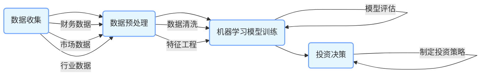

# 机器学习优化价值投资筛选流程

> 关键词：机器学习、价值投资、筛选流程、金融分析、模型优化

> 摘要：本文聚焦于运用机器学习技术对价值投资筛选流程进行优化。详细介绍了相关背景知识，阐述了核心概念及其联系，深入剖析核心算法原理与操作步骤，借助数学模型和公式进行理论阐释，并通过实际案例展示优化后的筛选流程在价值投资中的应用。同时，列举了相关的工具和资源，最后对未来发展趋势与挑战进行总结，旨在为投资者和金融从业者提供全面的技术指导和实践参考。

## 1. 背景介绍 
### 1.1 目的和范围
在当今复杂多变的金融市场中，价值投资作为一种重要的投资策略，旨在寻找被低估的资产以获取长期稳定的收益。然而，传统的价值投资筛选流程往往依赖于人工分析和经验判断，效率低下且容易受到主观因素的影响。本文章的目的在于探讨如何利用机器学习技术优化价值投资的筛选流程，提高筛选的准确性和效率，降低人为误差。范围涵盖了从机器学习算法的选择和应用，到实际投资案例的分析，以及相关工具和资源的推荐。

### 1.2 预期读者
本文预期读者包括金融领域的投资者、基金经理、分析师，以及对机器学习在金融领域应用感兴趣的技术人员和研究人员。对于投资者来说，可以通过本文了解如何运用先进的技术手段改进价值投资策略；对于技术人员而言，能够掌握将机器学习算法应用于金融数据处理和分析的方法。

### 1.3 文档结构概述
本文将按照以下结构进行阐述：首先介绍核心概念与联系，明确机器学习和价值投资的相关定义和关系；接着详细讲解核心算法原理和具体操作步骤，并结合 Python 代码进行说明；然后引入数学模型和公式，从理论层面深入分析；通过实际案例展示优化后的筛选流程在项目中的应用；列举实际应用场景和相关工具资源；最后总结未来发展趋势与挑战，并提供常见问题解答和扩展阅读资料。

### 1.4 术语表
#### 1.4.1 核心术语定义
- **价值投资**：一种投资策略，基于对公司基本面的分析，寻找被市场低估的股票，期望在长期内获得高于市场平均水平的回报。
- **机器学习**：一门多领域交叉学科，涉及概率论、统计学、逼近论、凸分析、算法复杂度理论等多门学科。它专门研究计算机怎样模拟或实现人类的学习行为，以获取新的知识或技能，重新组织已有的知识结构使之不断改善自身的性能。
- **筛选流程**：在价值投资中，对大量的潜在投资标的进行评估和筛选，以确定具有投资价值的资产的过程。

#### 1.4.2 相关概念解释
- **特征工程**：是指对原始数据进行预处理和转换，提取出对模型有意义的特征的过程。在价值投资筛选中，特征工程可以包括对财务数据、市场数据等进行清洗、归一化、特征选择等操作。
- **模型评估**：用于衡量机器学习模型性能的过程，常见的评估指标包括准确率、召回率、F1 值、均方误差等。在价值投资中，模型评估可以帮助投资者选择最适合的筛选模型。

#### 1.4.3 缩略词列表
- **ML**：Machine Learning，机器学习
- **AI**：Artificial Intelligence，人工智能
- **ROC**：Receiver Operating Characteristic，受试者工作特征曲线
- **AUC**：Area Under the Curve，曲线下面积

## 2. 核心概念与联系 
### 核心概念原理
价值投资的核心原理是基于公司的内在价值进行投资决策。通过分析公司的财务报表、行业地位、竞争优势等因素，评估公司的真实价值，并与当前市场价格进行比较。如果市场价格低于公司的内在价值，则认为该股票被低估，具有投资价值。

机器学习则是通过对大量数据的学习和分析，自动发现数据中的模式和规律，并利用这些规律进行预测和决策。在价值投资筛选中，机器学习可以帮助投资者处理大量的财务数据和市场信息，挖掘出潜在的投资机会。

### 架构的文本示意图
```plaintext
价值投资筛选流程
|-- 数据收集
|   |-- 财务数据
|   |-- 市场数据
|   |-- 行业数据
|-- 数据预处理
|   |-- 数据清洗
|   |-- 特征工程
|-- 机器学习模型训练
|   |-- 选择算法
|   |-- 模型训练
|   |-- 模型评估
|-- 投资决策
|   |-- 筛选投资标的
|   |-- 制定投资策略
```

### Mermaid 流程图


## 3. 核心算法原理 & 具体操作步骤 
### 算法原理讲解
在价值投资筛选中，常用的机器学习算法包括逻辑回归、决策树、随机森林、支持向量机等。下面以逻辑回归算法为例，详细讲解其原理和实现步骤。

逻辑回归是一种广泛应用于分类问题的机器学习算法。它通过对输入特征进行线性组合，然后通过逻辑函数将线性组合的结果映射到 [0, 1] 区间，从而得到样本属于某个类别的概率。逻辑函数的公式为：

$$\sigma(z)=\frac{1}{1 + e^{-z}}$$

其中，$z$ 是线性组合的结果，$\sigma(z)$ 是逻辑函数的输出。

逻辑回归的目标是找到一组最优的权重参数 $\theta$，使得模型对训练数据的预测概率与真实标签之间的损失最小。常用的损失函数是对数损失函数，公式为：

$$J(\theta)=-\frac{1}{m}\sum_{i=1}^{m}[y^{(i)}\log(h_{\theta}(x^{(i)}))+(1 - y^{(i)})\log(1 - h_{\theta}(x^{(i)}))]$$

其中，$m$ 是样本数量，$y^{(i)}$ 是第 $i$ 个样本的真实标签，$h_{\theta}(x^{(i)})$ 是模型对第 $i$ 个样本的预测概率。

### Python 源代码实现
```python
import numpy as np
from sklearn.linear_model import LogisticRegression
from sklearn.model_selection import train_test_split
from sklearn.metrics import accuracy_score

# 生成示例数据
np.random.seed(0)
X = np.random.randn(100, 2)
y = (X[:, 0] + X[:, 1] > 0).astype(int)

# 划分训练集和测试集
X_train, X_test, y_train, y_test = train_test_split(X, y, test_size=0.2, random_state=42)

# 创建逻辑回归模型
model = LogisticRegression()

# 训练模型
model.fit(X_train, y_train)

# 预测测试集
y_pred = model.predict(X_test)

# 评估模型
accuracy = accuracy_score(y_test, y_pred)
print(f"模型准确率: {accuracy}")
```

### 具体操作步骤
1. **数据收集**：收集相关的财务数据、市场数据和行业数据，作为模型的输入。
2. **数据预处理**：对收集到的数据进行清洗、归一化、特征选择等操作，以提高模型的性能。
3. **模型训练**：选择合适的机器学习算法，如逻辑回归、决策树等，使用训练数据对模型进行训练。
4. **模型评估**：使用测试数据对训练好的模型进行评估，计算评估指标，如准确率、召回率等。
5. **投资决策**：根据模型的预测结果，筛选出具有投资价值的股票，并制定相应的投资策略。

## 4. 数学模型和公式 & 详细讲解 & 举例说明 
### 逻辑回归的数学模型
逻辑回归的数学模型可以表示为：

$$h_{\theta}(x)=\sigma(\theta^T x)=\frac{1}{1 + e^{-\theta^T x}}$$

其中，$x$ 是输入特征向量，$\theta$ 是权重参数向量。

### 损失函数的详细讲解
对数损失函数的目的是衡量模型预测概率与真实标签之间的差异。当 $y = 1$ 时，损失函数为 $-\log(h_{\theta}(x))$；当 $y = 0$ 时，损失函数为 $-\log(1 - h_{\theta}(x))$。

### 举例说明
假设我们有一个简单的二分类问题，输入特征为 $x_1$ 和 $x_2$，真实标签为 $y$。我们使用逻辑回归模型进行预测，权重参数为 $\theta_0 = 0.1$，$\theta_1 = 0.2$，$\theta_2 = 0.3$。对于一个样本 $x = [1, 2, 3]$，计算其预测概率：

$$z=\theta_0 + \theta_1 x_1 + \theta_2 x_2 = 0.1 + 0.2\times2 + 0.3\times3 = 1.4$$

$$h_{\theta}(x)=\sigma(z)=\frac{1}{1 + e^{-1.4}}\approx0.802$$

如果真实标签 $y = 1$，则该样本的对数损失为：

$$-\log(h_{\theta}(x))=-\log(0.802)\approx0.221$$

## 5. 项目实战：代码实际案例和详细解释说明 
### 5.1  开发环境搭建
- **安装 Python**：建议使用 Python 3.7 及以上版本，可以从 Python 官方网站下载并安装。
- **安装必要的库**：使用 pip 安装所需的库，如 numpy、pandas、scikit-learn 等。
```bash
pip install numpy pandas scikit-learn
```

### 5.2  源代码详细实现和代码解读
```python
import pandas as pd
from sklearn.linear_model import LogisticRegression
from sklearn.model_selection import train_test_split
from sklearn.metrics import accuracy_score

# 读取数据
data = pd.read_csv('financial_data.csv')

# 提取特征和标签
X = data.drop('target', axis=1)
y = data['target']

# 划分训练集和测试集
X_train, X_test, y_train, y_test = train_test_split(X, y, test_size=0.2, random_state=42)

# 创建逻辑回归模型
model = LogisticRegression()

# 训练模型
model.fit(X_train, y_train)

# 预测测试集
y_pred = model.predict(X_test)

# 评估模型
accuracy = accuracy_score(y_test, y_pred)
print(f"模型准确率: {accuracy}")
```

### 代码解读与分析
1. **数据读取**：使用 pandas 库的 `read_csv` 函数读取存储在 CSV 文件中的财务数据。
2. **特征和标签提取**：将数据集中除了目标变量 `target` 以外的列作为特征，`target` 列作为标签。
3. **数据划分**：使用 `train_test_split` 函数将数据集划分为训练集和测试集，测试集占比为 20%。
4. **模型创建和训练**：创建逻辑回归模型，并使用训练集对模型进行训练。
5. **预测和评估**：使用训练好的模型对测试集进行预测，并计算预测结果的准确率。

## 6. 实际应用场景 
### 股票筛选
在股票投资中，机器学习可以帮助投资者从大量的股票中筛选出具有投资价值的股票。通过分析公司的财务指标、市场表现等因素，预测股票的未来走势，从而选择合适的投资标的。

### 基金评级
对于基金投资者来说，选择优质的基金是实现投资目标的关键。机器学习可以通过对基金的历史业绩、风险指标、投资策略等进行分析，对基金进行评级，为投资者提供参考。

### 投资组合优化
在构建投资组合时，需要考虑不同资产之间的相关性和风险收益特征。机器学习可以通过对历史数据的分析，优化投资组合的配置，降低风险，提高收益。

## 7. 工具和资源推荐
### 7.1 学习资源推荐
#### 7.1.1 书籍推荐
- 《机器学习》（周志华）：全面介绍了机器学习的基本概念、算法和应用，是机器学习领域的经典教材。
- 《Python 机器学习》（Sebastian Raschka）：结合 Python 语言，详细讲解了机器学习的算法和实践，适合初学者入门。
- 《价值投资：从格雷厄姆到巴菲特》（布鲁斯·格林沃尔德）：深入阐述了价值投资的理论和实践，是价值投资领域的权威著作。

#### 7.1.2 在线课程
- Coursera 上的《机器学习》课程（Andrew Ng）：由斯坦福大学教授 Andrew Ng 授课，是机器学习领域最受欢迎的在线课程之一。
- edX 上的《数据科学与机器学习微硕士》课程：提供了系统的数据分析和机器学习课程，适合有一定基础的学习者。

#### 7.1.3 技术博客和网站
- Medium：一个汇聚了众多技术专家和博主的平台，提供了丰富的机器学习和金融科技相关的文章。
- Kaggle：全球最大的数据科学社区，提供了大量的数据集和竞赛项目，可以帮助学习者提高实践能力。

### 7.2 开发工具框架推荐
#### 7.2.1 IDE和编辑器
- PyCharm：一款功能强大的 Python 集成开发环境，提供了代码编辑、调试、版本控制等功能。
- Jupyter Notebook：一个交互式的开发环境，适合进行数据分析和模型实验。

#### 7.2.2 调试和性能分析工具
- TensorBoard：一个用于可视化机器学习模型训练过程的工具，可以帮助开发者监控模型的性能和训练进度。
- Scikit-learn 的 `cross_val_score` 函数：用于交叉验证模型的性能，评估模型的泛化能力。

#### 7.2.3 相关框架和库
- Scikit-learn：一个简单易用的机器学习库，提供了丰富的算法和工具，适合初学者快速上手。
- TensorFlow：一个开源的深度学习框架，广泛应用于图像识别、自然语言处理等领域。

### 7.3 相关论文著作推荐
#### 7.3.1 经典论文
- 《Capital Asset Prices: A Theory of Market Equilibrium Under Conditions of Risk》（William F. Sharpe）：提出了资本资产定价模型（CAPM），是现代金融理论的重要基石。
- 《Efficient Capital Markets: A Review of Theory and Empirical Work》（Eugene F. Fama）：阐述了有效市场假说，对金融市场的研究产生了深远影响。

#### 7.3.2 最新研究成果
- 《Machine Learning for Asset Managers》（Marcos Lopez de Prado）：介绍了机器学习在资产管理中的应用，包括风险评估、投资组合优化等方面。
- 《Deep Learning for Financial Applications》（Amit Sheshadri）：探讨了深度学习在金融领域的应用，如股票预测、信用风险评估等。

#### 7.3.3 应用案例分析
- 《Applying Machine Learning to Stock Selection》（Barry Gillman）：分析了如何使用机器学习算法进行股票筛选，提高投资收益。
- 《Using Machine Learning to Predict Credit Risk》（Daniel H. Pink）：介绍了机器学习在信用风险评估中的应用，通过对客户的信用数据进行分析，预测违约概率。

## 8. 总结：未来发展趋势与挑战
### 未来发展趋势
- **深度学习的应用**：深度学习在图像识别、自然语言处理等领域取得了巨大成功，未来有望在价值投资筛选中得到更广泛的应用。通过构建深度神经网络，可以挖掘更复杂的数据模式，提高筛选的准确性。
- **多模态数据融合**：除了财务数据和市场数据，还可以融合文本数据、图像数据等多模态数据，从多个角度对投资标的进行评估，提高投资决策的科学性。
- **强化学习的应用**：强化学习可以通过与环境的交互，不断优化投资策略，实现动态的资产配置。未来，强化学习有望在投资组合管理中发挥重要作用。

### 挑战
- **数据质量问题**：金融数据往往存在噪声、缺失值等问题，需要进行有效的数据清洗和预处理。同时，数据的准确性和及时性也会影响模型的性能。
- **模型可解释性**：机器学习模型，尤其是深度学习模型，往往具有较高的复杂度，难以解释其决策过程。在价值投资中，投资者需要了解模型的决策依据，因此提高模型的可解释性是一个重要的挑战。
- **市场不确定性**：金融市场具有高度的不确定性，模型的预测结果可能会受到市场波动、政策变化等因素的影响。如何提高模型的鲁棒性，应对市场的不确定性，是未来需要解决的问题。

## 9. 附录：常见问题与解答
### 1. 机器学习模型在价值投资筛选中的准确率如何保证？
可以通过以下方法保证模型的准确率：
- 收集高质量的数据，进行有效的数据清洗和预处理。
- 选择合适的机器学习算法，并进行参数调优。
- 使用交叉验证等方法评估模型的性能，避免过拟合和欠拟合。

### 2. 如何选择适合的机器学习算法？
选择适合的机器学习算法需要考虑以下因素：
- 数据类型和规模：如果数据规模较小，可以选择简单的算法，如逻辑回归；如果数据规模较大，可以选择复杂的算法，如深度学习。
- 问题类型：如果是分类问题，可以选择逻辑回归、决策树等算法；如果是回归问题，可以选择线性回归、支持向量回归等算法。
- 模型可解释性：如果需要解释模型的决策过程，可以选择可解释性较强的算法，如决策树。

### 3. 机器学习模型能否完全替代人工分析？
机器学习模型不能完全替代人工分析。虽然机器学习可以处理大量的数据，挖掘潜在的投资机会，但它缺乏人类的判断力和经验。在实际投资中，需要将机器学习模型与人工分析相结合，做出更合理的投资决策。

## 10. 扩展阅读 & 参考资料
- 《金融计量学》（达摩达尔·N·古扎拉蒂）
- 《Python 数据分析实战》（韦斯·麦金尼）
- 《金融科技前沿：应用与趋势》（黄益平）
- 金融界网站：https://www.jrj.com.cn/
- 东方财富网：https://www.eastmoney.com/

作者：AI天才研究院/AI Genius Institute & 禅与计算机程序设计艺术 /Zen And The Art of Computer Programming