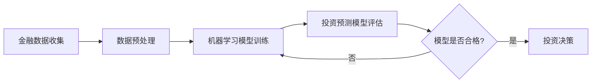

# 机器学习优化长期价值投资策略

> 关键词：机器学习、长期价值投资、投资策略优化、金融市场、预测模型

> 摘要：本文聚焦于运用机器学习技术来优化长期价值投资策略。首先介绍了研究的背景、目的、预期读者等信息，接着阐述了相关核心概念及其联系，详细讲解了核心算法原理和具体操作步骤，给出了数学模型和公式并举例说明。通过项目实战，展示了代码实现和解读。分析了该策略在实际中的应用场景，推荐了学习、开发所需的工具和资源，最后总结了未来发展趋势与挑战，并提供常见问题解答和参考资料，旨在为投资者和研究者提供全面的技术与策略指导。

## 1. 背景介绍 
### 1.1 目的和范围
在金融投资领域，长期价值投资一直是众多投资者遵循的重要理念。然而，传统的长期价值投资策略往往依赖于投资者的经验和对基本面的主观判断，缺乏精准的量化分析和动态调整能力。本研究的目的在于引入机器学习技术，通过对大量金融数据的分析和建模，优化长期价值投资策略，提高投资决策的科学性和准确性。

研究范围涵盖了常见的金融市场，如股票市场、债券市场等。主要研究如何运用机器学习算法处理市场数据、公司财务数据等，构建有效的投资预测模型，以筛选出具有长期投资价值的资产，并确定合理的投资组合和买卖时机。

### 1.2 预期读者
本文预期读者包括金融投资者、金融分析师、机器学习研究者、金融科技从业者等。对于投资者而言，希望能从本文中获取利用机器学习优化投资策略的方法和思路，提高投资收益；金融分析师可以借助文中的技术和模型，更深入地分析市场和资产；机器学习研究者可以将金融投资领域作为应用场景，探索算法的优化和改进；金融科技从业者则可以参考本文开发相关的投资决策辅助工具。

### 1.3 文档结构概述
本文将按照以下结构展开：首先介绍相关背景信息，让读者了解研究的目的和意义；接着阐述核心概念与联系，明确关键术语和模型架构；详细讲解核心算法原理和具体操作步骤，并给出Python代码示例；介绍数学模型和公式，通过举例说明其应用；进行项目实战，包括开发环境搭建、源代码实现和代码解读；分析实际应用场景；推荐学习和开发所需的工具和资源；总结未来发展趋势与挑战；最后提供常见问题解答和扩展阅读参考资料。

### 1.4 术语表
#### 1.4.1 核心术语定义
- **长期价值投资**：一种基于对资产内在价值的评估，通过长期持有具有成长潜力和稳定盈利能力的资产，以获取长期资本增值和股息收益的投资策略。
- **机器学习**：一门多领域交叉学科，涉及概率论、统计学、逼近论、凸分析、算法复杂度理论等多门学科。它专门研究计算机怎样模拟或实现人类的学习行为，以获取新的知识或技能，重新组织已有的知识结构使之不断改善自身的性能。
- **投资预测模型**：利用历史数据和机器学习算法构建的模型，用于预测资产价格走势、投资回报率等指标，为投资决策提供依据。
- **投资组合**：由投资者持有的多种资产构成的集合，通过合理配置不同资产，可以降低投资风险，提高收益的稳定性。

#### 1.4.2 相关概念解释
- **基本面分析**：通过对宏观经济形势、行业发展趋势、公司财务状况等基本因素的分析，评估资产的内在价值。在长期价值投资中，基本面分析是确定投资标的的重要依据。
- **技术分析**：通过研究市场交易数据，如价格、成交量等，分析市场趋势和投资者心理，以预测资产价格的短期波动。在机器学习优化投资策略中，可以结合技术分析数据提高模型的预测能力。
- **过拟合**：在机器学习中，模型在训练数据上表现良好，但在测试数据或实际应用中表现不佳的现象。过拟合会导致模型的泛化能力下降，影响投资决策的准确性。

#### 1.4.3 缩略词列表
- **ML**：Machine Learning（机器学习）
- **ROI**：Return on Investment（投资回报率）
- **GDP**：Gross Domestic Product（国内生产总值）

## 2. 核心概念与联系 

### 核心概念原理
#### 长期价值投资原理
长期价值投资的核心思想是寻找被市场低估的资产，并长期持有，等待资产价值回归和增长。其理论基础是价值规律，即资产的价格会围绕其内在价值波动。投资者通过对资产基本面的深入分析，评估其内在价值，当资产价格低于内在价值时买入，高于内在价值时卖出。

#### 机器学习原理
机器学习通过算法从数据中自动学习模式和规律，并利用这些规律进行预测和决策。常见的机器学习算法包括监督学习、无监督学习和强化学习。在优化长期价值投资策略中，主要使用监督学习算法，如线性回归、逻辑回归、决策树、随机森林、支持向量机等，通过对历史金融数据的学习，构建投资预测模型。

### 架构的文本示意图
```plaintext
金融数据收集（市场数据、公司财务数据等）
|
V
数据预处理（清洗、特征提取、标准化等）
|
V
机器学习模型训练（选择合适的算法，如随机森林）
|
V
投资预测模型评估（准确率、召回率、均方误差等指标）
|
V
投资决策（筛选投资标的、确定投资组合、买卖时机）
```

### Mermaid 流程图


## 3. 核心算法原理 & 具体操作步骤 

### 核心算法原理 - 随机森林
随机森林是一种集成学习算法，它由多个决策树组成。每个决策树在训练时使用随机选择的样本子集和特征子集，最后通过对多个决策树的预测结果进行综合，得到最终的预测结果。随机森林具有较高的准确性和稳定性，能够有效处理高维数据和非线性关系，在金融投资预测中具有广泛的应用。

### Python源代码详细阐述
```python
import pandas as pd
from sklearn.ensemble import RandomForestRegressor
from sklearn.model_selection import train_test_split
from sklearn.metrics import mean_squared_error

# 1. 数据加载
data = pd.read_csv('financial_data.csv')

# 2. 特征选择和目标变量定义
X = data.drop('target_variable', axis=1)
y = data['target_variable']

# 3. 数据划分
X_train, X_test, y_train, y_test = train_test_split(X, y, test_size=0.2, random_state=42)

# 4. 随机森林模型初始化
rf_model = RandomForestRegressor(n_estimators=100, random_state=42)

# 5. 模型训练
rf_model.fit(X_train, y_train)

# 6. 模型预测
y_pred = rf_model.predict(X_test)

# 7. 模型评估
mse = mean_squared_error(y_test, y_pred)
print(f"均方误差: {mse}")
```

### 具体操作步骤
1. **数据加载**：使用`pandas`库读取金融数据文件，将数据存储在`DataFrame`对象中。
2. **特征选择和目标变量定义**：从数据中选择用于预测的特征变量和目标变量。目标变量通常是资产的价格、回报率等指标。
3. **数据划分**：使用`train_test_split`函数将数据集划分为训练集和测试集，其中训练集用于模型训练，测试集用于模型评估。
4. **随机森林模型初始化**：创建`RandomForestRegressor`对象，设置模型的参数，如决策树的数量`n_estimators`等。
5. **模型训练**：使用训练集数据对随机森林模型进行训练，调用`fit`方法。
6. **模型预测**：使用训练好的模型对测试集数据进行预测，调用`predict`方法。
7. **模型评估**：使用`mean_squared_error`函数计算预测结果与真实值之间的均方误差，评估模型的性能。

## 4. 数学模型和公式 & 详细讲解 & 举例说明 

### 随机森林数学模型
随机森林由多个决策树组成，每个决策树的预测结果可以表示为：
$$
f_i(x) = \text{DecisionTree}_i(x)
$$
其中，$x$ 是输入特征向量，$\text{DecisionTree}_i(x)$ 表示第 $i$ 个决策树对输入 $x$ 的预测结果。

随机森林的最终预测结果是多个决策树预测结果的平均值：
$$
F(x) = \frac{1}{N} \sum_{i=1}^{N} f_i(x)
$$
其中，$N$ 是决策树的数量。

### 详细讲解
随机森林的核心思想是通过集成多个决策树的预测结果，降低单个决策树的过拟合风险，提高模型的泛化能力。每个决策树在训练时使用随机选择的样本子集和特征子集，使得每个决策树具有一定的差异性。在预测时，通过对多个决策树的预测结果进行平均，得到更稳定和准确的预测结果。

### 举例说明
假设我们有一个包含 1000 个样本的金融数据集，每个样本有 10 个特征变量和 1 个目标变量（资产回报率）。我们使用随机森林模型进行预测，设置决策树的数量 $N = 100$。

对于一个新的样本 $x$，每个决策树会根据自身的规则对其进行预测，得到 100 个预测结果 $f_1(x), f_2(x), \cdots, f_{100}(x)$。然后，我们将这 100 个预测结果进行平均，得到随机森林的最终预测结果 $F(x)$。

例如，假设 100 个决策树的预测结果分别为 $[0.05, 0.06, \cdots, 0.08]$，则随机森林的最终预测结果为：
$$
F(x) = \frac{1}{100} \sum_{i=1}^{100} f_i(x) = \frac{0.05 + 0.06 + \cdots + 0.08}{100}
$$

## 5. 项目实战：代码实际案例和详细解释说明 

### 5.1  开发环境搭建
#### 操作系统
可以选择 Windows、Linux 或 macOS 操作系统，建议使用 Linux 系统，因为它在数据处理和机器学习开发方面具有较好的性能和稳定性。

#### 编程语言和库
- **Python**：选择 Python 3.7 及以上版本，它是机器学习领域最常用的编程语言之一，具有丰富的库和工具。
- **Anaconda**：是一个开源的 Python 发行版本，包含了 Python 解释器、常用的科学计算和数据分析库，如`numpy`、`pandas`、`scikit-learn`等。可以从 Anaconda 官方网站下载并安装。

#### 开发工具
- **Jupyter Notebook**：是一个基于 Web 的交互式计算环境，支持代码编写、运行和可视化展示，非常适合机器学习项目的开发和实验。可以通过 Anaconda Navigator 启动 Jupyter Notebook。

### 5.2  源代码详细实现和代码解读
```python
import pandas as pd
import numpy as np
from sklearn.ensemble import RandomForestClassifier
from sklearn.model_selection import train_test_split
from sklearn.metrics import accuracy_score

# 数据加载
data = pd.read_csv('stock_data.csv')

# 数据预处理
# 处理缺失值
data = data.dropna()

# 特征选择
features = ['price', 'volume', 'pe_ratio', 'roe']
X = data[features]
y = data['label']  # 假设 label 是投资决策标签（0 或 1）

# 数据划分
X_train, X_test, y_train, y_test = train_test_split(X, y, test_size=0.2, random_state=42)

# 随机森林分类器初始化
rf_classifier = RandomForestClassifier(n_estimators=100, random_state=42)

# 模型训练
rf_classifier.fit(X_train, y_train)

# 模型预测
y_pred = rf_classifier.predict(X_test)

# 模型评估
accuracy = accuracy_score(y_test, y_pred)
print(f"模型准确率: {accuracy}")
```

### 代码解读与分析
1. **数据加载**：使用`pandas`库的`read_csv`函数读取股票数据文件`stock_data.csv`，将数据存储在`DataFrame`对象中。
2. **数据预处理**：
    - **处理缺失值**：使用`dropna`方法删除包含缺失值的行，确保数据的完整性。
    - **特征选择**：选择与投资决策相关的特征变量，如股票价格、成交量、市盈率、净资产收益率等。将特征变量存储在`X`中，目标变量（投资决策标签）存储在`y`中。
3. **数据划分**：使用`train_test_split`函数将数据集划分为训练集和测试集，其中测试集占总数据的 20%。
4. **随机森林分类器初始化**：创建`RandomForestClassifier`对象，设置决策树的数量为 100。
5. **模型训练**：使用训练集数据对随机森林分类器进行训练，调用`fit`方法。
6. **模型预测**：使用训练好的模型对测试集数据进行预测，调用`predict`方法。
7. **模型评估**：使用`accuracy_score`函数计算预测结果与真实值之间的准确率，评估模型的性能。

## 6. 实际应用场景 
### 股票投资
在股票市场中，机器学习优化的长期价值投资策略可以帮助投资者筛选具有长期投资价值的股票。通过对公司财务数据、行业发展趋势、市场情绪等多方面数据的分析，构建投资预测模型，预测股票的未来走势和投资回报率。投资者可以根据模型的预测结果，选择合适的股票进行长期投资，提高投资收益。

### 债券投资
对于债券投资，机器学习可以分析宏观经济数据、利率走势、债券信用评级等因素，预测债券的价格波动和违约风险。投资者可以根据模型的预测结果，合理配置债券资产，优化投资组合，降低投资风险。

### 基金投资
在基金投资领域，机器学习可以帮助投资者评估基金的业绩表现、风险水平和投资风格。通过对基金历史数据的分析，构建基金评价模型，筛选出具有优秀业绩和低风险的基金产品。投资者可以根据模型的评估结果，选择合适的基金进行投资，实现资产的长期增值。

## 7. 工具和资源推荐
### 7.1 学习资源推荐
#### 7.1.1 书籍推荐
- 《机器学习》（周志华）：这本书是机器学习领域的经典教材，全面介绍了机器学习的基本概念、算法和应用，适合初学者和有一定基础的读者。
- 《Python 机器学习》（Sebastian Raschka）：本书以 Python 为工具，详细介绍了机器学习的算法实现和应用，通过大量的代码示例和案例分析，帮助读者快速掌握机器学习的实践技能。
- 《金融数据分析与挖掘》（R. Ravi Kumar）：这本书结合金融领域的实际问题，介绍了数据分析和挖掘的方法和技术，包括数据预处理、模型构建、预测分析等内容，对于将机器学习应用于金融投资具有重要的参考价值。

#### 7.1.2 在线课程
- Coursera 上的“机器学习”课程（Andrew Ng 教授）：这是一门非常经典的机器学习入门课程，由斯坦福大学的 Andrew Ng 教授授课，课程内容涵盖了机器学习的基本概念、算法和应用，通过视频讲解、编程作业和测验等方式，帮助学习者系统地掌握机器学习知识。
- edX 上的“使用 Python 进行数据科学”课程：该课程介绍了使用 Python 进行数据处理、分析和可视化的方法和技术，包括`numpy`、`pandas`、`matplotlib`等库的使用，对于金融数据的处理和分析具有重要的帮助。
- 网易云课堂上的“量化投资与机器学习”课程：该课程结合金融市场的实际需求，介绍了量化投资的基本概念和方法，以及机器学习在量化投资中的应用，通过实际案例分析和代码实现，帮助学习者掌握量化投资的实践技能。

#### 7.1.3 技术博客和网站
- Kaggle（https://www.kaggle.com/）：是一个数据科学和机器学习竞赛平台，上面有大量的数据集、代码示例和竞赛项目，学习者可以通过参与竞赛和学习他人的代码，提高自己的数据分析和机器学习能力。
- Towards Data Science（https://towardsdatascience.com/）：是一个专注于数据科学和机器学习的技术博客，上面有很多优秀的文章和教程，涵盖了机器学习的各个领域和应用场景。
- Medium（https://medium.com/）：是一个综合性的写作平台，上面有很多关于机器学习、金融科技等领域的文章和观点，学习者可以从中获取最新的技术动态和行业信息。

### 7.2 开发工具框架推荐
#### 7.2.1 IDE和编辑器
- PyCharm：是一款专业的 Python 集成开发环境，具有代码编辑、调试、版本控制等功能，支持多种 Python 库和框架，适合大规模机器学习项目的开发。
- Jupyter Notebook：是一个基于 Web 的交互式计算环境，支持代码编写、运行和可视化展示，非常适合机器学习项目的开发和实验。
- Visual Studio Code：是一个轻量级的代码编辑器，具有丰富的插件和扩展功能，支持 Python 开发，适合初学者和快速开发。

#### 7.2.2 调试和性能分析工具
- Py-Spy：是一个 Python 性能分析工具，可以实时监控 Python 程序的运行状态和性能指标，帮助开发者找出性能瓶颈和优化代码。
- cProfile：是 Python 标准库中的性能分析模块，可以对 Python 程序的函数调用时间和次数进行统计，帮助开发者分析代码的性能。
- TensorBoard：是 TensorFlow 框架中的可视化工具，可以对深度学习模型的训练过程和性能进行可视化展示，帮助开发者监控模型的训练状态和优化模型参数。

#### 7.2.3 相关框架和库
- Scikit-learn：是一个常用的机器学习库，提供了丰富的机器学习算法和工具，包括分类、回归、聚类、降维等算法，以及数据预处理、模型评估等功能。
- TensorFlow：是一个开源的深度学习框架，由 Google 开发，支持多种深度学习模型的构建和训练，如神经网络、卷积神经网络、循环神经网络等。
- PyTorch：是一个基于 Python 的深度学习框架，由 Facebook 开发，具有动态图计算、易于使用等特点，广泛应用于计算机视觉、自然语言处理等领域。

### 7.3 相关论文著作推荐
#### 7.3.1 经典论文
- “Random Forests”（Leo Breiman）：这篇论文是随机森林算法的经典文献，详细介绍了随机森林的算法原理和性能分析，为随机森林在各个领域的应用奠定了基础。
- “A Decision-Theoretic Generalization of On-Line Learning and an Application to Boosting”（Yoav Freund, Robert E. Schapire）：这篇论文提出了 AdaBoost 算法，是集成学习领域的经典之作，为后续的集成学习算法研究提供了重要的思路和方法。
- “Deep Learning”（Yoshua Bengio, Ian J. Goodfellow, Aaron Courville）：这篇论文是深度学习领域的综述性文章，全面介绍了深度学习的基本概念、算法和应用，对于了解深度学习的发展历程和现状具有重要的参考价值。

#### 7.3.2 最新研究成果
- 可以关注顶级学术会议和期刊上的最新研究成果，如 NeurIPS（神经信息处理系统大会）、ICML（国际机器学习会议）、Journal of Financial Economics（金融经济学杂志）等。这些会议和期刊上发表的论文通常代表了机器学习和金融投资领域的最新研究动态和前沿技术。

#### 7.3.3 应用案例分析
- 《量化投资：策略与技术》（丁鹏）：这本书结合实际案例，介绍了量化投资的策略和技术，包括趋势跟踪、均值回归、多因子模型等策略，以及数据处理、模型构建、回测优化等技术，对于将机器学习应用于量化投资具有重要的参考价值。
- 《智能金融：科技驱动金融创新与监管变革》（杨涛）：本书探讨了人工智能、大数据、区块链等新兴技术在金融领域的应用和发展，通过实际案例分析，展示了科技驱动金融创新和监管变革的趋势和挑战。

## 8. 总结：未来发展趋势与挑战
### 未来发展趋势
#### 多模态数据融合
未来，机器学习优化长期价值投资策略将更加注重多模态数据的融合。除了传统的金融数据，还将引入文本数据（如新闻报道、社交媒体评论）、图像数据（如公司财报图表）、音频数据（如公司电话会议录音）等多模态数据，通过融合不同类型的数据，提高投资预测模型的准确性和全面性。

#### 强化学习的应用
强化学习作为一种能够在动态环境中进行决策优化的机器学习方法，将在长期价值投资中得到更广泛的应用。通过强化学习算法，投资者可以根据市场环境的变化实时调整投资策略，实现投资收益的最大化。

#### 人工智能与金融科技的深度融合
随着人工智能技术的不断发展，金融科技将迎来新的发展机遇。未来，人工智能将与金融科技深度融合，推动金融服务的智能化、个性化和高效化。例如，智能投顾将成为投资者的重要助手，根据投资者的风险偏好和投资目标，为其提供个性化的投资建议和资产配置方案。

### 挑战
#### 数据质量和隐私问题
金融数据的质量和隐私是机器学习优化长期价值投资策略面临的重要挑战。金融数据通常具有噪声大、缺失值多、数据分布不均衡等问题，需要进行复杂的数据预处理和清洗工作。同时，金融数据涉及用户的隐私和商业机密，如何在保证数据安全和隐私的前提下，充分利用数据进行模型训练，是一个亟待解决的问题。

#### 模型解释性和可解释性
机器学习模型，尤其是深度学习模型，通常是黑盒模型，其决策过程和结果难以解释。在金融投资领域，模型的解释性和可解释性至关重要，投资者需要了解模型的决策依据和风险因素，才能做出合理的投资决策。因此，如何提高机器学习模型的解释性和可解释性，是未来研究的重点方向之一。

#### 市场不确定性和风险
金融市场具有高度的不确定性和风险性，市场环境的变化可能导致投资预测模型的失效。机器学习模型通常是基于历史数据进行训练的，对于未来市场的变化和突发事件的预测能力有限。因此，如何提高模型的鲁棒性和适应性，应对市场的不确定性和风险，是长期价值投资策略优化面临的重要挑战。

## 9. 附录：常见问题与解答
### 1. 机器学习模型在金融投资中的准确性如何保证？
- 要保证机器学习模型在金融投资中的准确性，需要从多个方面入手。首先，要确保数据的质量，包括数据的准确性、完整性和一致性，对数据进行充分的预处理和清洗。其次，选择合适的机器学习算法和模型结构，根据数据的特点和问题的性质进行模型选择和调优。此外，要进行充分的模型评估和验证，使用交叉验证、回测等方法评估模型的性能，避免过拟合和欠拟合问题。最后，不断更新和优化模型，根据市场环境的变化和新的数据进行模型的调整和改进。

### 2. 如何处理金融数据中的缺失值和异常值？
- 处理金融数据中的缺失值和异常值可以采用以下方法：
    - **缺失值处理**：可以使用删除法，删除包含缺失值的行或列；也可以使用填充法，如均值填充、中位数填充、插值填充等方法，根据数据的特点选择合适的填充方法。
    - **异常值处理**：可以使用统计方法，如基于标准差的方法、基于四分位数的方法等，识别和删除异常值；也可以使用机器学习方法，如聚类分析、孤立森林等方法，对异常值进行检测和处理。

### 3. 机器学习优化的投资策略是否适用于所有投资者？
- 机器学习优化的投资策略并不适用于所有投资者。不同投资者的风险偏好、投资目标、投资经验和资金规模等因素都不同，需要根据自身情况选择合适的投资策略。机器学习优化的投资策略通常需要一定的技术和数据分析能力，对于缺乏相关知识和经验的投资者来说，可能难以理解和应用。此外，机器学习模型也存在一定的局限性和风险，不能保证投资的绝对收益。因此，投资者在使用机器学习优化的投资策略时，应该充分了解其原理和风险，结合自身情况进行决策。

## 10. 扩展阅读 & 参考资料
### 扩展阅读
- 《漫步华尔街》（伯顿·马尔基尔）：这本书介绍了股票市场的投资策略和理论，通过大量的案例和数据，阐述了长期价值投资的理念和方法。
- 《聪明的投资者》（本杰明·格雷厄姆）：这是一本投资领域的经典著作，被誉为“投资圣经”，书中介绍了价值投资的基本原则和方法，对投资者具有重要的指导意义。
- 《金融炼金术》（乔治·索罗斯）：这本书记录了索罗斯的投资经历和哲学思想，介绍了他的反身性理论和投资策略，对于理解金融市场的运行机制和投资决策具有重要的启示作用。

### 参考资料
- 周志华. 机器学习. 清华大学出版社, 2016.
- Sebastian Raschka. Python 机器学习. 人民邮电出版社, 2018.
- R. Ravi Kumar. 金融数据分析与挖掘. 机械工业出版社, 2019.
- Leo Breiman. Random Forests. Machine Learning, 2001, 45(1): 5-32.
- Yoav Freund, Robert E. Schapire. A Decision-Theoretic Generalization of On-Line Learning and an Application to Boosting. Journal of Computer and System Sciences, 1997, 55(1): 119-139.
- Yoshua Bengio, Ian J. Goodfellow, Aaron Courville. Deep Learning. MIT Press, 2016.

作者：AI天才研究院/AI Genius Institute & 禅与计算机程序设计艺术 /Zen And The Art of Computer Programming