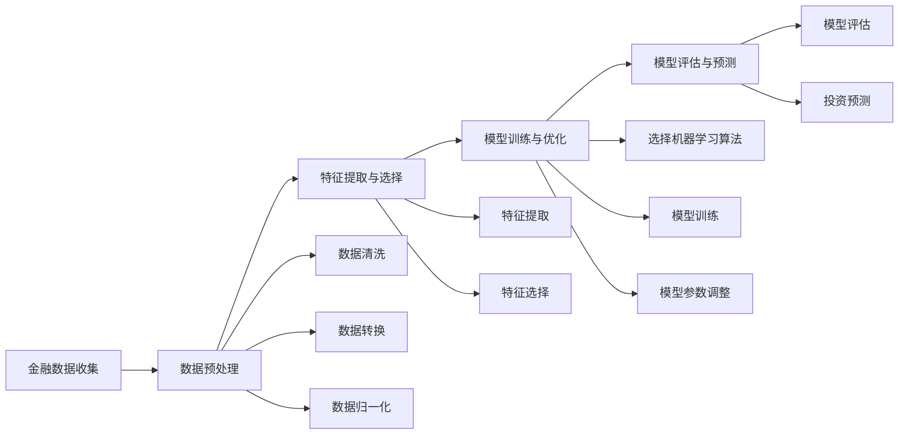

# 机器学习在投资策略中的应用

> 关键词：机器学习、投资策略、数据挖掘、算法交易、风险评估

> 摘要：本文深入探讨了机器学习在投资策略中的应用。首先介绍了研究的背景、目的、预期读者等信息，接着阐述了机器学习与投资策略相关的核心概念及联系，详细讲解了核心算法原理和具体操作步骤，并结合数学模型和公式进行分析。通过项目实战给出了代码实际案例和详细解释，分析了机器学习在不同投资场景中的应用。同时推荐了学习资源、开发工具框架以及相关论文著作。最后总结了未来发展趋势与挑战，还提供了常见问题解答和扩展阅读参考资料，旨在为投资者和相关从业者提供全面且深入的技术知识和实践指导。

## 1. 背景介绍 
### 1.1 目的和范围
随着金融市场的日益复杂和数据量的爆炸式增长，传统的投资策略已经难以满足投资者对收益和风险控制的需求。机器学习作为一种强大的数据分析和预测工具，为投资领域带来了新的机遇和挑战。本文的目的在于深入探讨机器学习在投资策略中的应用，包括但不限于股票投资、期货投资、基金投资等领域。我们将研究如何利用机器学习算法对金融数据进行分析和建模，以制定更加科学、有效的投资策略。

### 1.2 预期读者
本文预期读者包括金融投资者、金融分析师、机器学习从业者、金融科技公司的研发人员以及对金融和机器学习交叉领域感兴趣的研究人员。无论您是初学者还是有一定经验的专业人士，都可以从本文中获取有价值的信息和知识。

### 1.3 文档结构概述
本文将按照以下结构进行组织：首先介绍核心概念与联系，帮助读者建立起机器学习与投资策略之间的基本认知；接着详细讲解核心算法原理和具体操作步骤，并结合Python代码进行说明；然后介绍相关的数学模型和公式，并通过举例进行详细讲解；之后通过项目实战给出代码实际案例和详细解释；分析机器学习在实际投资场景中的应用；推荐学习资源、开发工具框架以及相关论文著作；最后总结未来发展趋势与挑战，并提供常见问题解答和扩展阅读参考资料。

### 1.4 术语表
#### 1.4.1 核心术语定义
- **机器学习（Machine Learning）**：是一门多领域交叉学科，涉及概率论、统计学、逼近论、凸分析、算法复杂度理论等多门学科。它专门研究计算机怎样模拟或实现人类的学习行为，以获取新的知识或技能，重新组织已有的知识结构使之不断改善自身的性能。
- **投资策略（Investment Strategy）**：是指投资者为了实现投资目标，在投资过程中所采用的一系列方法和原则，包括资产配置、选股、择时等方面。
- **数据挖掘（Data Mining）**：是指从大量的数据中通过算法搜索隐藏于其中信息的过程。数据挖掘通常与计算机科学有关，并通过统计、在线分析处理、情报检索、机器学习、专家系统（依靠过去的经验法则）和模式识别等诸多方法来实现上述目标。
- **算法交易（Algorithmic Trading）**：也被称为自动交易、黑盒交易或者机器交易，它指的是通过计算机程序来自动生成或执行交易指令的交易行为。
- **风险评估（Risk Assessment）**：是指在投资过程中，对可能面临的各种风险进行识别、分析和评估的过程，以确定投资的风险程度和可承受范围。

#### 1.4.2 相关概念解释
- **特征工程（Feature Engineering）**：是指从原始数据中提取特征，并将其转换为适合机器学习算法处理的格式的过程。在投资领域，特征工程可以包括对金融数据的清洗、转换、选择和创建等操作。
- **模型评估（Model Evaluation）**：是指对训练好的机器学习模型进行评估，以确定其性能和准确性的过程。常用的评估指标包括准确率、召回率、F1值、均方误差等。
- **过拟合（Overfitting）**：是指机器学习模型在训练数据上表现良好，但在测试数据上表现不佳的现象。过拟合通常是由于模型过于复杂，学习了训练数据中的噪声和异常值导致的。
- **欠拟合（Underfitting）**：是指机器学习模型在训练数据和测试数据上都表现不佳的现象。欠拟合通常是由于模型过于简单，无法捕捉数据中的复杂模式导致的。

#### 1.4.3 缩略词列表
- **ML**：Machine Learning（机器学习）
- **AI**：Artificial Intelligence（人工智能）
- **ETF**：Exchange-Traded Fund（交易型开放式指数基金）
- **MSE**：Mean Squared Error（均方误差）
- **RMSE**：Root Mean Squared Error（均方根误差）

## 2. 核心概念与联系 

### 核心概念原理
在投资策略中应用机器学习，核心在于利用机器学习算法从大量的金融数据中挖掘出有价值的信息和模式，以辅助投资者做出更明智的投资决策。以下是几个关键的核心概念及其原理：

#### 数据收集与预处理
金融数据来源广泛，包括股票价格、财务报表、宏观经济数据等。数据收集的目的是获取足够多且有代表性的数据，为后续的分析和建模提供基础。数据预处理则是对收集到的数据进行清洗、转换和归一化等操作，以提高数据的质量和可用性。例如，去除缺失值、异常值，将数据转换为统一的格式和尺度等。

#### 特征提取与选择
特征是指数据中能够反映投资对象特征和规律的变量。特征提取是从原始数据中提取出有代表性的特征，例如计算股票的收益率、波动率、市盈率等。特征选择则是从提取的特征中选择出对投资决策最有影响的特征，以减少数据的维度和复杂度，提高模型的训练效率和准确性。

#### 模型训练与优化
选择合适的机器学习算法对预处理后的数据进行训练，以建立投资模型。常用的机器学习算法包括线性回归、逻辑回归、决策树、随机森林、支持向量机、神经网络等。在模型训练过程中，需要不断调整模型的参数，以优化模型的性能。例如，使用交叉验证、网格搜索等方法来选择最优的模型参数。

#### 模型评估与预测
使用测试数据对训练好的模型进行评估，以确定模型的性能和准确性。常用的评估指标包括准确率、召回率、F1值、均方误差等。如果模型的性能满足要求，则可以使用该模型对未来的投资情况进行预测，为投资决策提供参考。

### 架构的文本示意图
```plaintext
金融数据收集
|
|-- 数据预处理
|   |
|   |-- 数据清洗
|   |-- 数据转换
|   |-- 数据归一化
|
|-- 特征提取与选择
|   |
|   |-- 特征提取
|   |-- 特征选择
|
|-- 模型训练与优化
|   |
|   |-- 选择机器学习算法
|   |-- 模型训练
|   |-- 模型参数调整
|
|-- 模型评估与预测
|   |
|   |-- 模型评估
|   |-- 投资预测
```

### Mermaid 流程图


## 3. 核心算法原理 & 具体操作步骤 

### 线性回归算法原理
线性回归是一种基本的机器学习算法，用于建立自变量和因变量之间的线性关系。在投资领域，线性回归可以用于预测股票价格、收益率等。其数学模型可以表示为：

$$y = \theta_0 + \theta_1x_1 + \theta_2x_2 + \cdots + \theta_nx_n + \epsilon$$

其中，$y$ 是因变量，$x_1, x_2, \cdots, x_n$ 是自变量，$\theta_0, \theta_1, \cdots, \theta_n$ 是模型的参数，$\epsilon$ 是误差项。

线性回归的目标是找到一组最优的参数 $\theta$，使得预测值与实际值之间的误差最小。常用的误差度量方法是均方误差（MSE），其计算公式为：

$$MSE = \frac{1}{m} \sum_{i=1}^{m} (y^{(i)} - \hat{y}^{(i)})^2$$

其中，$m$ 是样本数量，$y^{(i)}$ 是第 $i$ 个样本的实际值，$\hat{y}^{(i)}$ 是第 $i$ 个样本的预测值。

### 具体操作步骤
以下是使用Python实现线性回归的具体步骤：

#### 步骤1：导入必要的库
```python
import numpy as np
import pandas as pd
from sklearn.linear_model import LinearRegression
from sklearn.model_selection import train_test_split
from sklearn.metrics import mean_squared_error
```

#### 步骤2：加载数据
假设我们有一个包含股票价格和相关特征的数据集，我们可以使用Pandas库来加载数据。
```python
# 加载数据
data = pd.read_csv('stock_data.csv')

# 分离自变量和因变量
X = data.drop('stock_price', axis=1)
y = data['stock_price']
```

#### 步骤3：划分训练集和测试集
使用 `train_test_split` 函数将数据集划分为训练集和测试集。
```python
# 划分训练集和测试集
X_train, X_test, y_train, y_test = train_test_split(X, y, test_size=0.2, random_state=42)
```

#### 步骤4：创建线性回归模型并训练
```python
# 创建线性回归模型
model = LinearRegression()

# 训练模型
model.fit(X_train, y_train)
```

#### 步骤5：进行预测并评估模型
```python
# 进行预测
y_pred = model.predict(X_test)

# 计算均方误差
mse = mean_squared_error(y_test, y_pred)
print(f"均方误差: {mse}")
```

### 逻辑回归算法原理
逻辑回归是一种用于分类问题的机器学习算法，在投资领域可以用于预测股票的涨跌等。逻辑回归的核心是使用逻辑函数（也称为Sigmoid函数）将线性回归的输出映射到一个概率值。逻辑函数的定义为：

$$\sigma(z) = \frac{1}{1 + e^{-z}}$$

其中，$z$ 是线性回归的输出，即 $z = \theta_0 + \theta_1x_1 + \theta_2x_2 + \cdots + \theta_nx_n$。

逻辑回归的目标是找到一组最优的参数 $\theta$，使得预测的概率与实际的类别标签之间的误差最小。常用的损失函数是对数损失函数，其计算公式为：

$$J(\theta) = -\frac{1}{m} \sum_{i=1}^{m} [y^{(i)} \log(\sigma(z^{(i)})) + (1 - y^{(i)}) \log(1 - \sigma(z^{(i)}))]$$

其中，$m$ 是样本数量，$y^{(i)}$ 是第 $i$ 个样本的实际类别标签，$\sigma(z^{(i)})$ 是第 $i$ 个样本的预测概率。

### 具体操作步骤
以下是使用Python实现逻辑回归的具体步骤：

#### 步骤1：导入必要的库
```python
import numpy as np
import pandas as pd
from sklearn.linear_model import LogisticRegression
from sklearn.model_selection import train_test_split
from sklearn.metrics import accuracy_score
```

#### 步骤2：加载数据
假设我们有一个包含股票涨跌标签和相关特征的数据集，我们可以使用Pandas库来加载数据。
```python
# 加载数据
data = pd.read_csv('stock_classification_data.csv')

# 分离自变量和因变量
X = data.drop('stock_up_down', axis=1)
y = data['stock_up_down']
```

#### 步骤3：划分训练集和测试集
使用 `train_test_split` 函数将数据集划分为训练集和测试集。
```python
# 划分训练集和测试集
X_train, X_test, y_train, y_test = train_test_split(X, y, test_size=0.2, random_state=42)
```

#### 步骤4：创建逻辑回归模型并训练
```python
# 创建逻辑回归模型
model = LogisticRegression()

# 训练模型
model.fit(X_train, y_train)
```

#### 步骤5：进行预测并评估模型
```python
# 进行预测
y_pred = model.predict(X_test)

# 计算准确率
accuracy = accuracy_score(y_test, y_pred)
print(f"准确率: {accuracy}")
```

## 4. 数学模型和公式 & 详细讲解 & 举例说明 

### 线性回归的数学模型和公式
线性回归的数学模型为：

$$y = \theta_0 + \theta_1x_1 + \theta_2x_2 + \cdots + \theta_nx_n + \epsilon$$

其中，$y$ 是因变量，$x_1, x_2, \cdots, x_n$ 是自变量，$\theta_0, \theta_1, \cdots, \theta_n$ 是模型的参数，$\epsilon$ 是误差项。

线性回归的目标是找到一组最优的参数 $\theta$，使得预测值与实际值之间的误差最小。常用的误差度量方法是均方误差（MSE），其计算公式为：

$$MSE = \frac{1}{m} \sum_{i=1}^{m} (y^{(i)} - \hat{y}^{(i)})^2$$

其中，$m$ 是样本数量，$y^{(i)}$ 是第 $i$ 个样本的实际值，$\hat{y}^{(i)}$ 是第 $i$ 个样本的预测值。

为了找到最优的参数 $\theta$，可以使用最小二乘法。最小二乘法的目标是使均方误差最小，即：

$$\min_{\theta} MSE(\theta)$$

通过对均方误差求偏导数并令其等于0，可以得到最优参数的解析解：

$$\hat{\theta} = (X^T X)^{-1} X^T y$$

其中，$X$ 是自变量矩阵，$y$ 是因变量向量。

### 举例说明
假设我们有以下数据集：

| $x$ | $y$ |
| --- | --- |
| 1   | 2   |
| 2   | 4   |
| 3   | 6   |
| 4   | 8   |

我们可以使用线性回归来建立 $x$ 和 $y$ 之间的线性关系。首先，将数据集转换为矩阵形式：

$$X = \begin{bmatrix}
1 & 1 \\
1 & 2 \\
1 & 3 \\
1 & 4
\end{bmatrix},
y = \begin{bmatrix}
2 \\
4 \\
6 \\
8
\end{bmatrix}$$

然后，计算 $(X^T X)^{-1} X^T y$：

```python
import numpy as np

X = np.array([[1, 1], [1, 2], [1, 3], [1, 4]])
y = np.array([2, 4, 6, 8])

theta_hat = np.linalg.inv(X.T @ X) @ X.T @ y
print(f"最优参数: {theta_hat}")
```

运行上述代码，我们可以得到最优参数 $\hat{\theta} = [0, 2]$，即线性回归模型为 $y = 0 + 2x$。

### 逻辑回归的数学模型和公式
逻辑回归的核心是使用逻辑函数（也称为Sigmoid函数）将线性回归的输出映射到一个概率值。逻辑函数的定义为：

$$\sigma(z) = \frac{1}{1 + e^{-z}}$$

其中，$z$ 是线性回归的输出，即 $z = \theta_0 + \theta_1x_1 + \theta_2x_2 + \cdots + \theta_nx_n$。

逻辑回归的目标是找到一组最优的参数 $\theta$，使得预测的概率与实际的类别标签之间的误差最小。常用的损失函数是对数损失函数，其计算公式为：

$$J(\theta) = -\frac{1}{m} \sum_{i=1}^{m} [y^{(i)} \log(\sigma(z^{(i)})) + (1 - y^{(i)}) \log(1 - \sigma(z^{(i)}))]$$

其中，$m$ 是样本数量，$y^{(i)}$ 是第 $i$ 个样本的实际类别标签，$\sigma(z^{(i)})$ 是第 $i$ 个样本的预测概率。

为了找到最优的参数 $\theta$，可以使用梯度下降法。梯度下降法的基本思想是通过不断更新参数 $\theta$，使得损失函数 $J(\theta)$ 逐渐减小。具体来说，每次更新参数的公式为：

$$\theta_j := \theta_j - \alpha \frac{\partial J(\theta)}{\partial \theta_j}$$

其中，$\alpha$ 是学习率，$\frac{\partial J(\theta)}{\partial \theta_j}$ 是损失函数 $J(\theta)$ 对参数 $\theta_j$ 的偏导数。

### 举例说明
假设我们有以下二分类数据集：

| $x_1$ | $x_2$ | $y$ |
| --- | --- | --- |
| 1   | 2   | 0   |
| 2   | 3   | 0   |
| 3   | 4   | 1   |
| 4   | 5   | 1   |

我们可以使用逻辑回归来对数据进行分类。首先，将数据集转换为矩阵形式：

$$X = \begin{bmatrix}
1 & 1 & 2 \\
1 & 2 & 3 \\
1 & 3 & 4 \\
1 & 4 & 5
\end{bmatrix},
y = \begin{bmatrix}
0 \\
0 \\
1 \\
1
\end{bmatrix}$$

然后，使用梯度下降法来更新参数 $\theta$：

```python
import numpy as np

def sigmoid(z):
    return 1 / (1 + np.exp(-z))

def cost_function(X, y, theta):
    m = len(y)
    h = sigmoid(X @ theta)
    J = (-1/m) * (y.T @ np.log(h) + (1 - y).T @ np.log(1 - h))
    return J

def gradient_descent(X, y, theta, alpha, num_iters):
    m = len(y)
    J_history = []

    for iter in range(num_iters):
        h = sigmoid(X @ theta)
        theta = theta - (alpha/m) * X.T @ (h - y)
        J = cost_function(X, y, theta)
        J_history.append(J)

    return theta, J_history

X = np.array([[1, 1, 2], [1, 2, 3], [1, 3, 4], [1, 4, 5]])
y = np.array([0, 0, 1, 1]).reshape(-1, 1)
theta = np.zeros((X.shape[1], 1))
alpha = 0.01
num_iters = 1000

theta, J_history = gradient_descent(X, y, theta, alpha, num_iters)
print(f"最优参数: {theta}")
```

运行上述代码，我们可以得到最优参数 $\theta$，从而建立逻辑回归模型。

## 5. 项目实战：代码实际案例和详细解释说明 

### 5.1  开发环境搭建
#### 安装Python
首先，需要安装Python。建议使用Python 3.7及以上版本。可以从Python官方网站（https://www.python.org/downloads/）下载适合自己操作系统的安装包，并按照安装向导进行安装。

#### 安装必要的库
在Python环境中，需要安装一些必要的库，包括NumPy、Pandas、Scikit-learn等。可以使用以下命令来安装这些库：

```sh
pip install numpy pandas scikit-learn matplotlib
```

### 5.2  源代码详细实现和代码解读
以下是一个使用线性回归模型预测股票价格的完整代码示例：

```python
import numpy as np
import pandas as pd
from sklearn.linear_model import LinearRegression
from sklearn.model_selection import train_test_split
from sklearn.metrics import mean_squared_error
import matplotlib.pyplot as plt

# 加载数据
data = pd.read_csv('stock_data.csv')

# 分离自变量和因变量
X = data.drop('stock_price', axis=1)
y = data['stock_price']

# 划分训练集和测试集
X_train, X_test, y_train, y_test = train_test_split(X, y, test_size=0.2, random_state=42)

# 创建线性回归模型
model = LinearRegression()

# 训练模型
model.fit(X_train, y_train)

# 进行预测
y_pred = model.predict(X_test)

# 计算均方误差
mse = mean_squared_error(y_test, y_pred)
print(f"均方误差: {mse}")

# 可视化预测结果
plt.scatter(y_test, y_pred)
plt.xlabel('实际股票价格')
plt.ylabel('预测股票价格')
plt.title('实际股票价格 vs 预测股票价格')
plt.show()
```

### 代码解读与分析
#### 数据加载与预处理
```python
# 加载数据
data = pd.read_csv('stock_data.csv')

# 分离自变量和因变量
X = data.drop('stock_price', axis=1)
y = data['stock_price']
```
这部分代码使用Pandas库的 `read_csv` 函数加载股票数据，并将数据集分离为自变量 $X$ 和因变量 $y$。

#### 划分训练集和测试集
```python
# 划分训练集和测试集
X_train, X_test, y_train, y_test = train_test_split(X, y, test_size=0.2, random_state=42)
```
这部分代码使用Scikit-learn库的 `train_test_split` 函数将数据集划分为训练集和测试集，其中测试集占比为20%。

#### 模型训练与预测
```python
# 创建线性回归模型
model = LinearRegression()

# 训练模型
model.fit(X_train, y_train)

# 进行预测
y_pred = model.predict(X_test)
```
这部分代码创建了一个线性回归模型，并使用训练集对模型进行训练。然后，使用训练好的模型对测试集进行预测。

#### 模型评估与可视化
```python
# 计算均方误差
mse = mean_squared_error(y_test, y_pred)
print(f"均方误差: {mse}")

# 可视化预测结果
plt.scatter(y_test, y_pred)
plt.xlabel('实际股票价格')
plt.ylabel('预测股票价格')
plt.title('实际股票价格 vs 预测股票价格')
plt.show()
```
这部分代码使用Scikit-learn库的 `mean_squared_error` 函数计算预测结果的均方误差，并使用Matplotlib库将实际股票价格和预测股票价格进行可视化。

## 6. 实际应用场景 
### 股票投资
在股票投资中，机器学习可以用于预测股票价格的走势、评估股票的风险和价值等。例如，通过分析历史股票价格、财务报表、宏观经济数据等信息，使用线性回归、神经网络等模型来预测股票的未来价格。投资者可以根据预测结果制定投资策略，如买入、卖出或持有股票。

### 期货投资
期货市场具有高风险性和高杠杆性，机器学习可以帮助投资者更好地管理风险和制定交易策略。例如，通过分析期货价格的波动规律、成交量、持仓量等信息，使用支持向量机、随机森林等模型来预测期货价格的涨跌。投资者可以根据预测结果进行期货交易，如做多或做空期货合约。

### 基金投资
在基金投资中，机器学习可以用于评估基金的业绩、选择优质基金等。例如，通过分析基金的历史收益率、波动率、夏普比率等指标，使用聚类分析、决策树等模型来对基金进行分类和评估。投资者可以根据评估结果选择适合自己的基金进行投资。

### 风险评估
机器学习可以帮助投资者对投资组合的风险进行评估和管理。例如，通过分析投资组合中各种资产的相关性、波动率等信息，使用风险价值（VaR）、条件风险价值（CVaR）等模型来计算投资组合的风险程度。投资者可以根据风险评估结果调整投资组合的资产配置，以降低风险。

## 7. 工具和资源推荐
### 7.1 学习资源推荐
#### 7.1.1 书籍推荐
- 《机器学习》（周志华著）：本书是机器学习领域的经典教材，全面介绍了机器学习的基本概念、算法和应用。
- 《Python机器学习》（Sebastian Raschka著）：本书以Python为工具，详细介绍了机器学习的各种算法和实践技巧。
- 《深度学习》（Ian Goodfellow、Yoshua Bengio和Aaron Courville著）：本书是深度学习领域的权威著作，深入介绍了深度学习的原理、算法和应用。

#### 7.1.2 在线课程
- Coursera上的《机器学习》课程（Andrew Ng教授主讲）：这是一门非常经典的机器学习课程，适合初学者入门。
- edX上的《深度学习》课程（由MIT等知名高校的教授主讲）：该课程深入介绍了深度学习的理论和实践。
- Kaggle上的机器学习微课程：Kaggle提供了一系列的机器学习微课程，内容涵盖了数据处理、特征工程、模型训练等方面。

#### 7.1.3 技术博客和网站
- Medium：Medium上有很多机器学习和金融科技领域的优秀博客文章，可以帮助读者了解最新的技术动态和研究成果。
- Towards Data Science：这是一个专注于数据科学和机器学习的网站，提供了大量的技术文章和案例分析。
- Kaggle：Kaggle是一个数据科学竞赛平台，上面有很多优秀的数据科学家分享他们的经验和代码。

### 7.2 开发工具框架推荐
#### 7.2.1 IDE和编辑器
- PyCharm：PyCharm是一款专门为Python开发设计的集成开发环境（IDE），具有强大的代码编辑、调试和分析功能。
- Jupyter Notebook：Jupyter Notebook是一个交互式的编程环境，适合进行数据探索、模型实验和结果展示。
- Visual Studio Code：Visual Studio Code是一款轻量级的代码编辑器，支持多种编程语言，并且有丰富的插件可以扩展其功能。

#### 7.2.2 调试和性能分析工具
- PySnooper：PySnooper是一个简单易用的Python调试工具，可以帮助开发者快速定位代码中的问题。
- cProfile：cProfile是Python标准库中的一个性能分析工具，可以帮助开发者找出代码中的性能瓶颈。
- TensorBoard：TensorBoard是TensorFlow提供的一个可视化工具，可以帮助开发者可视化模型的训练过程和性能指标。

#### 7.2.3 相关框架和库
- NumPy：NumPy是Python中用于科学计算的基础库，提供了高效的多维数组对象和各种数学函数。
- Pandas：Pandas是Python中用于数据处理和分析的库，提供了灵活的数据结构和强大的数据操作功能。
- Scikit-learn：Scikit-learn是Python中用于机器学习的库，提供了各种机器学习算法和工具，如分类、回归、聚类等。
- TensorFlow：TensorFlow是一个开源的深度学习框架，广泛应用于图像识别、自然语言处理等领域。
- PyTorch：PyTorch是另一个开源的深度学习框架，具有动态图的特点，适合快速迭代和实验。

### 7.3 相关论文著作推荐
#### 7.3.1 经典论文
- 《A Decision-Theoretic Generalization of On-Line Learning and an Application to Boosting》（Yoav Freund和Robert E. Schapire著）：这篇论文提出了AdaBoost算法，是机器学习领域的经典论文之一。
- 《Support-Vector Networks》（Corinna Cortes和Vladimir Vapnik著）：这篇论文提出了支持向量机（SVM）算法，是机器学习领域的重要成果。
- 《Gradient-Based Learning Applied to Document Recognition》（Yann LeCun、Léon Bottou、Yoshua Bengio和Patrick Haffner著）：这篇论文介绍了卷积神经网络（CNN）在图像识别中的应用，是深度学习领域的经典论文。

#### 7.3.2 最新研究成果
- 《Deep Reinforcement Learning for Automated Stock Trading: An Ensemble Strategy》：这篇论文提出了一种基于深度强化学习的股票交易策略，通过集成多个模型来提高交易性能。
- 《Machine Learning for Asset Management》：这篇论文探讨了机器学习在资产管理中的应用，包括股票选择、风险评估等方面。
- 《A Survey on Deep Learning in Financial Time Series Forecasting》：这篇论文对深度学习在金融时间序列预测中的应用进行了综述，介绍了各种深度学习模型和方法。

#### 7.3.3 应用案例分析
- 《Machine Learning in Quantitative Finance》：这本书介绍了机器学习在量化金融中的应用案例，包括股票交易、期货交易、风险评估等方面。
- 《AI in Finance: From Theory to Practice》：这本书探讨了人工智能在金融领域的应用，通过实际案例分析了机器学习、深度学习等技术在投资决策、风险管理等方面的应用。

## 8. 总结：未来发展趋势与挑战
### 未来发展趋势
#### 多模态数据融合
未来，机器学习在投资策略中的应用将不仅仅局限于传统的金融数据，还将融合更多的多模态数据，如文本数据、图像数据、音频数据等。例如，通过分析新闻报道、社交媒体评论等文本数据，获取市场情绪和投资者预期，从而更好地预测股票价格的走势。

#### 强化学习的应用
强化学习作为一种能够在动态环境中进行决策和优化的机器学习方法，将在投资策略中得到更广泛的应用。例如，使用强化学习算法来优化投资组合的资产配置，根据市场环境的变化实时调整投资策略，以实现最大化的收益。

#### 深度学习与量化投资的结合
深度学习具有强大的特征提取和模式识别能力，将与量化投资进一步结合。例如，使用深度学习模型来挖掘金融数据中的复杂模式和规律，开发更加精准的量化投资策略。

#### 智能化投资顾问
随着机器学习技术的不断发展，智能化投资顾问将逐渐普及。智能化投资顾问可以根据投资者的风险偏好、投资目标等信息，为投资者提供个性化的投资建议和策略，实现智能化的投资决策。

### 挑战
#### 数据质量和隐私问题
金融数据的质量和隐私是机器学习在投资策略中应用面临的重要挑战。金融数据往往存在噪声、缺失值和异常值等问题，需要进行有效的数据清洗和预处理。同时，金融数据涉及到投资者的隐私和敏感信息，需要采取有效的措施来保护数据的安全和隐私。

#### 模型解释性问题
机器学习模型，尤其是深度学习模型，往往具有较高的复杂度和黑盒性，难以解释模型的决策过程和结果。在投资领域，模型的解释性非常重要，投资者需要了解模型是如何做出决策的，以便评估模型的可靠性和风险。因此，如何提高模型的解释性是机器学习在投资策略中应用需要解决的一个关键问题。

#### 市场环境的不确定性
金融市场是一个复杂多变的系统，受到多种因素的影响，如宏观经济环境、政策法规、突发事件等。市场环境的不确定性使得机器学习模型的预测结果存在一定的误差和风险。如何提高模型对市场环境变化的适应性和鲁棒性，是机器学习在投资策略中应用需要面对的另一个挑战。

#### 监管和合规问题
机器学习在投资策略中的应用涉及到金融市场的稳定和投资者的利益，需要遵守相关的监管和合规要求。例如，模型的开发和使用需要符合金融监管机构的规定，确保模型的公平性、透明度和可解释性。如何在满足监管和合规要求的前提下，充分发挥机器学习的优势，是机器学习在投资策略中应用需要解决的一个重要问题。

## 9. 附录：常见问题与解答
### 问题1：机器学习模型在投资策略中的准确性如何保证？
答：要保证机器学习模型在投资策略中的准确性，可以从以下几个方面入手：
- **数据质量**：确保收集到的金融数据准确、完整、无噪声。对数据进行有效的清洗和预处理，去除缺失值、异常值等。
- **特征工程**：选择和提取对投资决策有重要影响的特征，避免使用无关或冗余的特征。可以使用特征选择算法来筛选出最有价值的特征。
- **模型选择和调优**：根据数据的特点和投资问题的类型，选择合适的机器学习算法。使用交叉验证、网格搜索等方法来调整模型的参数，以优化模型的性能。
- **模型评估**：使用多种评估指标对模型进行评估，如准确率、召回率、F1值、均方误差等。同时，使用不同的数据集对模型进行验证，以确保模型的泛化能力。

### 问题2：如何处理金融数据中的缺失值和异常值？
答：处理金融数据中的缺失值和异常值可以采用以下方法：
- **缺失值处理**：
    - **删除法**：如果缺失值的比例较小，可以直接删除包含缺失值的样本或特征。
    - **填充法**：可以使用均值、中位数、众数等统计量来填充缺失值，也可以使用插值法、回归法等方法来预测缺失值。
    - **模型法**：可以使用机器学习模型来预测缺失值，如决策树、随机森林等。
- **异常值处理**：
    - **识别异常值**：可以使用统计方法（如Z分数、箱线图等）或机器学习方法（如聚类分析、孤立森林等）来识别异常值。
    - **删除异常值**：如果异常值是由于数据录入错误或噪声引起的，可以直接删除异常值。
    - **修正异常值**：如果异常值是真实存在的，但对模型的影响较大，可以对异常值进行修正，如将异常值替换为合理的数值。

### 问题3：机器学习模型在投资策略中的可解释性如何提高？
答：提高机器学习模型在投资策略中的可解释性可以采用以下方法：
- **选择可解释的模型**：优先选择可解释性较强的机器学习模型，如线性回归、逻辑回归、决策树等。这些模型的决策过程相对简单，容易理解和解释。
- **特征重要性分析**：使用特征重要性分析方法，如随机森林的特征重要性排序、线性回归的系数分析等，来确定哪些特征对模型的决策影响最大。
- **模型可视化**：使用可视化工具，如决策树的图形表示、特征重要性的柱状图等，来直观地展示模型的决策过程和结果。
- **局部解释方法**：使用局部解释方法，如LIME（Local Interpretable Model-agnostic Explanations）、SHAP（SHapley Additive exPlanations）等，来解释模型对单个样本的决策过程。

### 问题4：机器学习在投资策略中的应用是否会取代人类投资者？
答：机器学习在投资策略中的应用不会取代人类投资者，而是会与人类投资者相互补充。虽然机器学习可以处理大量的数据和复杂的模型，提供更精准的预测和决策建议，但它也存在一定的局限性。例如，机器学习模型无法理解市场的宏观经济背景、政策法规变化等因素，也无法处理突发事件和不确定性。而人类投资者具有丰富的经验、判断力和直觉，可以对市场情况进行综合分析和判断，做出更加灵活和明智的投资决策。因此，未来的投资领域将是机器学习和人类投资者共同发挥作用的时代。

## 10. 扩展阅读 & 参考资料
### 扩展阅读
- 《金融科技：应用与创新》：本书介绍了金融科技的各种应用和创新模式，包括机器学习在金融领域的应用。
- 《智能金融：AI时代金融科技的新趋势》：这本书探讨了人工智能在金融领域的发展趋势和应用前景，对机器学习在投资策略中的应用有深入的分析。
- 《量化投资：策略与技术》：本书详细介绍了量化投资的策略和技术，包括机器学习在量化投资中的应用案例。

### 参考资料
- 《机器学习》（周志华著）
- 《Python机器学习》（Sebastian Raschka著）
- 《深度学习》（Ian Goodfellow、Yoshua Bengio和Aaron Courville著）
- Coursera上的《机器学习》课程（Andrew Ng教授主讲）
- edX上的《深度学习》课程（由MIT等知名高校的教授主讲）
- Kaggle上的机器学习微课程
- Medium上的机器学习和金融科技相关博客文章
- Towards Data Science网站
- Kaggle平台上的数据科学竞赛和代码分享

作者：AI天才研究院/AI Genius Institute & 禅与计算机程序设计艺术 /Zen And The Art of Computer Programming