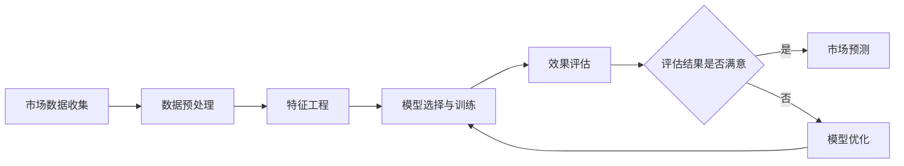

# 机器学习算法在市场预测中的效果评估

> 关键词：机器学习算法、市场预测、效果评估、评估指标、模型选择

> 摘要：本文围绕机器学习算法在市场预测中的效果评估展开。首先介绍了相关背景知识，包括目的范围、预期读者等。接着阐述了核心概念与联系，深入讲解了核心算法原理及具体操作步骤，并给出Python代码示例。通过数学模型和公式对相关理论进行详细讲解与举例说明。在项目实战部分，从开发环境搭建到源代码详细实现及解读，展示了如何应用机器学习算法进行市场预测。分析了其实际应用场景，推荐了学习、开发相关的工具和资源，包括书籍、在线课程、开发工具等。最后总结了未来发展趋势与挑战，提供了常见问题解答及扩展阅读参考资料，旨在为研究者和从业者全面了解机器学习算法在市场预测中的效果评估提供深入且实用的指导。

## 1. 背景介绍 
### 1.1 目的和范围
市场预测在商业决策、投资分析、资源分配等众多领域具有至关重要的作用。准确的市场预测能够帮助企业制定合理的生产计划、优化营销策略，投资者做出明智的投资决策。机器学习算法凭借其强大的数据处理和模式识别能力，在市场预测中得到了广泛应用。本文章的目的在于深入探讨如何对机器学习算法在市场预测中的效果进行全面、科学的评估。范围涵盖常见的机器学习算法，如线性回归、决策树、神经网络等，以及多种市场预测场景，包括股票市场、商品市场、房地产市场等。

### 1.2 预期读者
本文预期读者包括从事数据分析、机器学习、市场研究的专业人士，以及对市场预测和机器学习算法应用感兴趣的科研人员、学生和企业管理人员。对于专业人士，可作为技术参考和经验交流的资料；对于初学者，能帮助其系统地了解机器学习算法在市场预测中的效果评估方法；对于企业管理人员，有助于其在实际决策中更好地理解和应用相关技术。

### 1.3 文档结构概述
本文将按照以下结构展开：首先介绍相关背景知识，包括目的范围、预期读者等；接着阐述核心概念与联系，包括机器学习算法、市场预测、效果评估等概念及其相互关系；然后深入讲解核心算法原理及具体操作步骤，并给出Python代码示例；通过数学模型和公式对相关理论进行详细讲解与举例说明；在项目实战部分，从开发环境搭建到源代码详细实现及解读，展示如何应用机器学习算法进行市场预测；分析其实际应用场景；推荐学习、开发相关的工具和资源；最后总结未来发展趋势与挑战，提供常见问题解答及扩展阅读参考资料。

### 1.4 术语表
#### 1.4.1 核心术语定义
- **机器学习算法**：一类让计算机通过数据自动学习模式和规律，并利用这些模式和规律进行预测和决策的算法。常见的有监督学习算法（如线性回归、决策树）、无监督学习算法（如聚类算法）和强化学习算法。
- **市场预测**：运用各种信息和方法，对市场未来的发展趋势、需求变化、价格波动等进行预计和推测的过程。
- **效果评估**：对机器学习算法在市场预测任务中的性能和表现进行量化和分析的过程，以判断算法的有效性和可靠性。

#### 1.4.2 相关概念解释
- **过拟合**：机器学习模型在训练数据上表现良好，但在未见过的测试数据上表现不佳的现象。这是由于模型过于复杂，学习了训练数据中的噪声和细节，而无法泛化到新数据。
- **欠拟合**：模型过于简单，无法捕捉数据中的复杂模式和规律，导致在训练数据和测试数据上的表现都不理想。
- **泛化能力**：模型在未见过的新数据上的预测能力，是衡量模型优劣的重要指标之一。

#### 1.4.3 缩略词列表
- **RMSE**：Root Mean Squared Error，均方根误差
- **MAE**：Mean Absolute Error，平均绝对误差
- **R²**：Coefficient of Determination，决定系数

## 2. 核心概念与联系 
### 核心概念原理
#### 机器学习算法
机器学习算法是实现市场预测的核心工具。监督学习算法通过对带有标签的训练数据进行学习，建立输入特征与输出标签之间的映射关系，从而对新数据进行预测。例如，线性回归算法假设输入特征与输出标签之间存在线性关系，通过最小化误差平方和来确定回归系数。决策树算法则通过构建树形结构，根据特征的取值进行分类或回归。

无监督学习算法主要用于数据探索和特征提取，如聚类算法可以将数据分成不同的组，发现数据中的潜在结构。强化学习算法则通过智能体与环境的交互，不断优化策略以获得最大的累积奖励，在一些动态市场预测场景中具有应用潜力。

#### 市场预测
市场预测的核心在于收集和分析与市场相关的数据，包括历史价格、交易量、宏观经济指标、政策法规等。通过对这些数据的挖掘和建模，预测市场未来的走势。市场预测的准确性受到多种因素的影响，如数据质量、模型选择、市场的不确定性等。

#### 效果评估
效果评估是确保机器学习算法在市场预测中有效性的关键环节。通过选择合适的评估指标，如RMSE、MAE、R²等，可以量化模型的预测误差和拟合程度。同时，还可以采用交叉验证等方法来评估模型的泛化能力，避免过拟合和欠拟合问题。

### 架构的文本示意图
```plaintext
市场数据收集 -> 数据预处理 -> 特征工程 -> 模型选择与训练 -> 效果评估 -> 模型优化 -> 市场预测
```

### Mermaid流程图


## 3. 核心算法原理 & 具体操作步骤 
### 线性回归算法原理
线性回归是一种简单而常用的机器学习算法，用于建立自变量（特征）与因变量（目标）之间的线性关系。假设我们有 $n$ 个样本，每个样本有 $m$ 个特征，线性回归模型可以表示为：

$$
y = \theta_0 + \theta_1x_1 + \theta_2x_2 + \cdots + \theta_mx_m + \epsilon
$$

其中，$y$ 是目标变量，$x_1, x_2, \cdots, x_m$ 是特征变量，$\theta_0, \theta_1, \cdots, \theta_m$ 是模型的参数，$\epsilon$ 是误差项。

线性回归的目标是找到一组最优的参数 $\theta$，使得预测值 $\hat{y}$ 与真实值 $y$ 之间的误差最小。通常使用最小二乘法来求解，即最小化误差平方和：

$$
J(\theta) = \frac{1}{2n} \sum_{i=1}^{n} (y^{(i)} - \hat{y}^{(i)})^2
$$

其中，$y^{(i)}$ 是第 $i$ 个样本的真实值，$\hat{y}^{(i)}$ 是第 $i$ 个样本的预测值。

### 具体操作步骤
1. **数据收集**：收集与市场预测相关的数据，如历史价格、交易量等。
2. **数据预处理**：对收集到的数据进行清洗、缺失值处理、归一化等操作。
3. **特征工程**：选择和提取对市场预测有重要影响的特征。
4. **模型训练**：使用训练数据对线性回归模型进行训练，求解最优参数 $\theta$。
5. **模型评估**：使用测试数据对训练好的模型进行评估，计算评估指标。
6. **模型优化**：根据评估结果，调整模型参数或选择其他模型，以提高预测效果。

### Python源代码示例
```python
import numpy as np
from sklearn.linear_model import LinearRegression
from sklearn.model_selection import train_test_split
from sklearn.metrics import mean_squared_error, r2_score

# 生成示例数据
np.random.seed(0)
X = np.random.rand(100, 1)
y = 2 * X + 1 + 0.5 * np.random.randn(100, 1)

# 划分训练集和测试集
X_train, X_test, y_train, y_test = train_test_split(X, y, test_size=0.2, random_state=42)

# 创建线性回归模型
model = LinearRegression()

# 训练模型
model.fit(X_train, y_train)

# 预测
y_pred = model.predict(X_test)

# 评估模型
mse = mean_squared_error(y_test, y_pred)
rmse = np.sqrt(mse)
r2 = r2_score(y_test, y_pred)

print(f"均方根误差 (RMSE): {rmse}")
print(f"决定系数 (R²): {r2}")
```

## 4. 数学模型和公式 & 详细讲解 & 举例说明 
### 均方根误差 (RMSE)
均方根误差是最常用的评估指标之一，用于衡量模型预测值与真实值之间的平均误差。其计算公式为：

$$
RMSE = \sqrt{\frac{1}{n} \sum_{i=1}^{n} (y^{(i)} - \hat{y}^{(i)})^2}
$$

其中，$y^{(i)}$ 是第 $i$ 个样本的真实值，$\hat{y}^{(i)}$ 是第 $i$ 个样本的预测值，$n$ 是样本数量。

RMSE 的值越小，说明模型的预测精度越高。例如，在股票价格预测中，如果 RMSE 的值为 10，表示模型的平均预测误差为 10 元。

### 平均绝对误差 (MAE)
平均绝对误差是另一种常用的评估指标，用于衡量模型预测值与真实值之间的平均绝对误差。其计算公式为：

$$
MAE = \frac{1}{n} \sum_{i=1}^{n} |y^{(i)} - \hat{y}^{(i)}|
$$

MAE 不受误差正负的影响，更直观地反映了模型的预测误差。例如，在商品销售量预测中，如果 MAE 的值为 50，表示模型的平均预测误差为 50 件。

### 决定系数 (R²)
决定系数用于衡量模型对数据的拟合程度，其取值范围为 $(-\infty, 1]$。其计算公式为：

$$
R² = 1 - \frac{\sum_{i=1}^{n} (y^{(i)} - \hat{y}^{(i)})^2}{\sum_{i=1}^{n} (y^{(i)} - \bar{y})^2}
$$

其中，$\bar{y}$ 是真实值的平均值。

$R²$ 的值越接近 1，说明模型对数据的拟合程度越好。例如，在房地产价格预测中，如果 $R²$ 的值为 0.8，表示模型能够解释 80% 的房价变化。

### 举例说明
假设我们有以下真实值和预测值：

真实值：$y = [10, 20, 30, 40, 50]$

预测值：$\hat{y} = [12, 18, 32, 38, 52]$

计算 RMSE、MAE 和 $R²$：

```python
import numpy as np
from sklearn.metrics import mean_squared_error, mean_absolute_error, r2_score

y = np.array([10, 20, 30, 40, 50])
y_pred = np.array([12, 18, 32, 38, 52])

rmse = np.sqrt(mean_squared_error(y, y_pred))
mae = mean_absolute_error(y, y_pred)
r2 = r2_score(y, y_pred)

print(f"均方根误差 (RMSE): {rmse}")
print(f"平均绝对误差 (MAE): {mae}")
print(f"决定系数 (R²): {r2}")
```

## 5. 项目实战：代码实际案例和详细解释说明 
### 5.1  开发环境搭建
#### 安装Python
首先需要安装Python，建议使用Python 3.7及以上版本。可以从Python官方网站（https://www.python.org/downloads/）下载安装包，按照安装向导进行安装。

#### 安装必要的库
使用以下命令安装必要的Python库：
```sh
pip install numpy pandas scikit-learn matplotlib
```

### 5.2  源代码详细实现和代码解读
以下是一个使用线性回归算法进行股票价格预测的示例代码：

```python
import numpy as np
import pandas as pd
from sklearn.linear_model import LinearRegression
from sklearn.model_selection import train_test_split
from sklearn.metrics import mean_squared_error, r2_score
import matplotlib.pyplot as plt

# 读取股票数据
data = pd.read_csv('stock_data.csv')

# 提取特征和目标变量
X = data[['Open', 'High', 'Low', 'Volume']].values
y = data['Close'].values

# 划分训练集和测试集
X_train, X_test, y_train, y_test = train_test_split(X, y, test_size=0.2, random_state=42)

# 创建线性回归模型
model = LinearRegression()

# 训练模型
model.fit(X_train, y_train)

# 预测
y_pred = model.predict(X_test)

# 评估模型
mse = mean_squared_error(y_test, y_pred)
rmse = np.sqrt(mse)
r2 = r2_score(y_test, y_pred)

print(f"均方根误差 (RMSE): {rmse}")
print(f"决定系数 (R²): {r2}")

# 可视化预测结果
plt.figure(figsize=(10, 6))
plt.plot(y_test, label='真实值')
plt.plot(y_pred, label='预测值')
plt.xlabel('样本编号')
plt.ylabel('股票价格')
plt.title('股票价格预测结果')
plt.legend()
plt.show()
```

### 5.3  代码解读与分析
1. **数据读取**：使用 `pandas` 库读取股票数据文件 `stock_data.csv`。
2. **特征提取**：提取 `Open`、`High`、`Low` 和 `Volume` 作为特征变量，`Close` 作为目标变量。
3. **数据集划分**：使用 `train_test_split` 函数将数据集划分为训练集和测试集，测试集占比为 20%。
4. **模型创建与训练**：创建线性回归模型，并使用训练集进行训练。
5. **预测与评估**：使用训练好的模型对测试集进行预测，并计算 RMSE 和 $R²$ 评估指标。
6. **可视化**：使用 `matplotlib` 库绘制真实值和预测值的对比图，直观展示预测结果。

## 6. 实际应用场景 
### 股票市场预测
在股票市场中，机器学习算法可以用于预测股票价格的走势、波动率等。通过分析历史股票数据、宏观经济指标、公司财务报表等信息，建立预测模型，帮助投资者做出决策。例如，一些量化投资机构使用机器学习算法进行股票择时和选股，提高投资收益。

### 商品市场预测
在商品市场中，机器学习算法可以用于预测商品价格的变化、需求趋势等。通过分析商品的供求关系、生产成本、政策法规等因素，建立预测模型，帮助企业制定生产计划和营销策略。例如，石油公司可以使用机器学习算法预测原油价格的走势，优化生产和库存管理。

### 房地产市场预测
在房地产市场中，机器学习算法可以用于预测房价的变化、房屋销售量等。通过分析地理位置、房屋面积、周边配套设施、市场供需等因素，建立预测模型，帮助购房者和开发商做出决策。例如，房地产中介可以使用机器学习算法为客户提供房价预测和购房建议。

## 7. 工具和资源推荐
### 7.1 学习资源推荐
#### 7.1.1 书籍推荐
- 《机器学习》（周志华）：介绍了机器学习的基本概念、算法和应用，是机器学习领域的经典教材。
- 《Python机器学习实战》（Sebastian Raschka）：通过大量的Python代码示例，介绍了机器学习的实际应用，适合初学者。
- 《深度学习》（Ian Goodfellow、Yoshua Bengio、Aaron Courville）：介绍了深度学习的基本原理、算法和应用，是深度学习领域的权威著作。

#### 7.1.2 在线课程
- Coursera上的“机器学习”课程（Andrew Ng）：由斯坦福大学教授Andrew Ng主讲，是机器学习领域的经典课程。
- edX上的“深度学习”课程（MIT）：由麻省理工学院教授主讲，介绍了深度学习的最新进展和应用。
- 中国大学MOOC上的“机器学习基础”课程：由国内知名高校教授主讲，适合国内学生学习。

#### 7.1.3 技术博客和网站
- Medium：有许多机器学习领域的专家和爱好者分享他们的经验和见解。
- Kaggle：一个数据科学竞赛平台，有许多优秀的机器学习项目和代码可供学习。
- 机器学习算法全栈工程师：一个专注于机器学习算法的技术博客，提供了丰富的学习资源和案例分析。

### 7.2 开发工具框架推荐
#### 7.2.1 IDE和编辑器
- PyCharm：一款专业的Python集成开发环境，提供了丰富的代码编辑、调试和项目管理功能。
- Jupyter Notebook：一个交互式的开发环境，适合进行数据探索、模型训练和可视化。
- Visual Studio Code：一款轻量级的代码编辑器