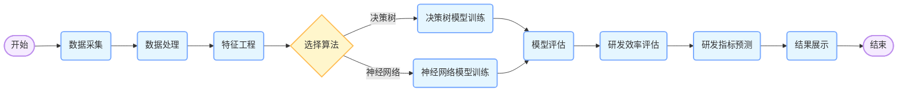

# 机器学习辅助公司研发效率评估

> 关键词：机器学习、研发效率评估、数据挖掘、指标体系、预测模型

> 摘要：本文旨在探讨如何利用机器学习技术辅助公司进行研发效率评估。首先介绍了研发效率评估的背景和重要性，阐述了相关的核心概念与联系。接着详细讲解了用于研发效率评估的核心算法原理及具体操作步骤，给出了相应的数学模型和公式，并进行举例说明。通过项目实战，展示了如何搭建开发环境、实现源代码并进行代码解读与分析。还探讨了机器学习在研发效率评估中的实际应用场景，推荐了相关的工具和资源。最后总结了未来发展趋势与挑战，提供了常见问题与解答以及扩展阅读和参考资料，为公司借助机器学习提升研发效率评估水平提供全面的指导。

## 1. 背景介绍 
### 1.1 目的和范围
在当今竞争激烈的商业环境中，公司的研发效率直接关系到其市场竞争力和创新能力。准确评估研发效率有助于公司合理分配资源、优化研发流程、提高研发产出。本文章的目的在于深入探讨如何运用机器学习技术来辅助公司进行研发效率评估，涵盖了从理论概念到实际应用的各个方面，包括研发效率评估指标的确定、机器学习算法的选择与应用、实际案例的分析等。

### 1.2 预期读者
本文预期读者包括公司的研发管理人员、数据分析师、机器学习工程师以及对研发效率评估和机器学习应用感兴趣的相关人员。研发管理人员可以从中获取如何利用机器学习提升研发效率评估准确性和有效性的方法；数据分析师能够学习到研发效率评估相关的数据处理和分析技巧；机器学习工程师则可以深入了解在研发效率评估场景下的算法应用和模型构建。

### 1.3 文档结构概述
本文首先介绍研发效率评估的背景知识，包括目的、预期读者和文档结构等内容。接着阐述核心概念与联系，通过文本示意图和 Mermaid 流程图展示相关概念的原理和架构。然后详细讲解核心算法原理和具体操作步骤，给出 Python 源代码示例。之后介绍数学模型和公式，并进行详细讲解和举例说明。通过项目实战展示代码的实际案例和详细解释。再探讨实际应用场景，推荐相关的工具和资源。最后总结未来发展趋势与挑战，提供常见问题与解答以及扩展阅读和参考资料。

### 1.4 术语表
#### 1.4.1 核心术语定义
- **研发效率**：指公司在研发过程中投入的资源（如人力、物力、财力等）与产出（如新产品、新技术、专利等）之间的比例关系，反映了研发过程的有效性和经济性。
- **机器学习**：一门多领域交叉学科，涉及概率论、统计学、逼近论、凸分析、算法复杂度理论等多门学科。它专门研究计算机怎样模拟或实现人类的学习行为，以获取新的知识或技能，重新组织已有的知识结构使之不断改善自身的性能。
- **特征工程**：指对原始数据进行预处理、转换和选择，提取出对模型训练有帮助的特征的过程。
- **评估指标**：用于衡量研发效率的各种量化指标，如研发周期、研发成本、专利数量等。

#### 1.4.2 相关概念解释
- **数据挖掘**：从大量的数据中通过算法搜索隐藏于其中信息的过程。在研发效率评估中，数据挖掘可以帮助发现数据中的潜在模式和关系，为评估提供依据。
- **预测模型**：利用机器学习算法构建的模型，用于预测研发效率相关的指标，如预测研发周期、研发成本等。
- **模型训练**：通过将已知数据输入到机器学习模型中，调整模型的参数，使模型能够学习到数据中的规律和模式的过程。

#### 1.4.3 缩略词列表
- **AI**：Artificial Intelligence，人工智能
- **ML**：Machine Learning，机器学习
- **KPI**：Key Performance Indicator，关键绩效指标

## 2. 核心概念与联系 
### 核心概念原理
研发效率评估是一个复杂的过程，涉及到多个方面的因素。核心概念包括研发投入、研发产出、研发过程等。研发投入包括人力、物力、财力等方面的资源投入；研发产出包括新产品、新技术、专利等；研发过程则涉及到研发流程的各个环节，如需求分析、设计、开发、测试等。

机器学习在研发效率评估中的应用主要是通过对研发相关数据的分析和挖掘，构建预测模型，从而实现对研发效率的评估和预测。例如，通过分析历史研发项目的数据，预测未来研发项目的周期、成本等指标。

### 架构的文本示意图
```plaintext
研发效率评估系统
|-- 数据采集层
|   |-- 研发过程数据（需求文档、设计文档、代码版本等）
|   |-- 研发产出数据（新产品、专利、论文等）
|   |-- 研发投入数据（人力工时、资金投入等）
|-- 数据处理层
|   |-- 数据清洗（去除噪声、缺失值处理等）
|   |-- 特征工程（提取有意义的特征）
|-- 模型构建层
|   |-- 选择机器学习算法（决策树、神经网络等）
|   |-- 模型训练（使用训练数据）
|   |-- 模型评估（使用测试数据）
|-- 评估与预测层
|   |-- 研发效率评估（根据模型输出评估研发效率）
|   |-- 研发指标预测（预测研发周期、成本等）
|-- 结果展示层
|   |-- 可视化报表（展示研发效率评估结果和预测指标）
```

### Mermaid 流程图


## 3. 核心算法原理 & 具体操作步骤 
### 线性回归算法原理
线性回归是一种基本的机器学习算法，用于建立自变量和因变量之间的线性关系。在研发效率评估中，可以用线性回归来预测研发成本、研发周期等连续型变量。

线性回归的数学模型可以表示为：
$$y = \theta_0 + \theta_1x_1 + \theta_2x_2 + \cdots + \theta_nx_n + \epsilon$$
其中，$y$ 是因变量，$x_1, x_2, \cdots, x_n$ 是自变量，$\theta_0, \theta_1, \cdots, \theta_n$ 是模型的参数，$\epsilon$ 是误差项。

线性回归的目标是找到一组最优的参数 $\theta$，使得预测值 $\hat{y}$ 与真实值 $y$ 之间的误差最小。通常使用最小二乘法来求解最优参数，即最小化误差平方和：
$$J(\theta) = \frac{1}{2m}\sum_{i=1}^{m}(y^{(i)} - \hat{y}^{(i)})^2$$
其中，$m$ 是样本数量，$y^{(i)}$ 是第 $i$ 个样本的真实值，$\hat{y}^{(i)}$ 是第 $i$ 个样本的预测值。

### 具体操作步骤
1. **数据准备**：收集研发相关的数据，包括研发投入、研发产出等信息，并进行数据清洗和预处理。
2. **特征选择**：选择与研发效率相关的特征作为自变量，如人力工时、资金投入等。
3. **模型训练**：使用训练数据对线性回归模型进行训练，求解最优参数 $\theta$。
4. **模型评估**：使用测试数据对训练好的模型进行评估，计算评估指标，如均方误差（MSE）、决定系数（$R^2$）等。
5. **预测与评估**：使用训练好的模型对新的研发项目进行预测，并根据预测结果评估研发效率。

### Python 源代码示例
```python
import numpy as np
from sklearn.linear_model import LinearRegression
from sklearn.model_selection import train_test_split
from sklearn.metrics import mean_squared_error, r2_score

# 生成示例数据
np.random.seed(0)
X = np.random.rand(100, 2)  # 自变量
y = 2 * X[:, 0] + 3 * X[:, 1] + np.random.randn(100)  # 因变量

# 划分训练集和测试集
X_train, X_test, y_train, y_test = train_test_split(X, y, test_size=0.2, random_state=42)

# 创建线性回归模型
model = LinearRegression()

# 模型训练
model.fit(X_train, y_train)

# 模型预测
y_pred = model.predict(X_test)

# 模型评估
mse = mean_squared_error(y_test, y_pred)
r2 = r2_score(y_test, y_pred)

print(f"均方误差 (MSE): {mse}")
print(f"决定系数 (R^2): {r2}")
```

## 4. 数学模型和公式 & 详细讲解 & 举例说明 
### 均方误差（MSE）
均方误差是衡量预测值与真实值之间误差的一种常用指标，其数学公式为：
$$MSE = \frac{1}{m}\sum_{i=1}^{m}(y^{(i)} - \hat{y}^{(i)})^2$$
其中，$m$ 是样本数量，$y^{(i)}$ 是第 $i$ 个样本的真实值，$\hat{y}^{(i)}$ 是第 $i$ 个样本的预测值。

均方误差的意义在于计算预测值与真实值之间误差的平方的平均值，它反映了预测值的平均误差程度。均方误差越小，说明模型的预测效果越好。

举例说明：假设有一组真实值 $y = [1, 2, 3, 4, 5]$ 和对应的预测值 $\hat{y} = [1.2, 1.8, 3.1, 3.9, 5.2]$，则均方误差为：
$$MSE = \frac{(1 - 1.2)^2 + (2 - 1.8)^2 + (3 - 3.1)^2 + (4 - 3.9)^2 + (5 - 5.2)^2}{5} = 0.02$$

### 决定系数（$R^2$）
决定系数是衡量回归模型拟合优度的指标，其数学公式为：
$$R^2 = 1 - \frac{\sum_{i=1}^{m}(y^{(i)} - \hat{y}^{(i)})^2}{\sum_{i=1}^{m}(y^{(i)} - \bar{y})^2}$$
其中，$m$ 是样本数量，$y^{(i)}$ 是第 $i$ 个样本的真实值，$\hat{y}^{(i)}$ 是第 $i$ 个样本的预测值，$\bar{y}$ 是真实值的平均值。

决定系数的取值范围是 $(-\infty, 1]$，$R^2$ 越接近 1，说明模型的拟合效果越好；$R^2$ 越接近 0，说明模型的拟合效果越差；$R^2$ 为负数时，说明模型的预测效果比直接使用平均值预测还要差。

举例说明：假设有一组真实值 $y = [1, 2, 3, 4, 5]$ 和对应的预测值 $\hat{y} = [1.2, 1.8, 3.1, 3.9, 5.2]$，真实值的平均值 $\bar{y} = \frac{1 + 2 + 3 + 4 + 5}{5} = 3$，则决定系数为：
$$R^2 = 1 - \frac{(1 - 1.2)^2 + (2 - 1.8)^2 + (3 - 3.1)^2 + (4 - 3.9)^2 + (5 - 5.2)^2}{(1 - 3)^2 + (2 - 3)^2 + (3 - 3)^2 + (4 - 3)^2 + (5 - 3)^2} \approx 0.98$$

### 梯度下降算法
梯度下降算法是一种优化算法，用于求解线性回归模型的最优参数 $\theta$。其基本思想是沿着目标函数的负梯度方向不断更新参数，直到找到目标函数的最小值。

梯度下降算法的更新公式为：
$$\theta_j := \theta_j - \alpha\frac{\partial J(\theta)}{\partial \theta_j}$$
其中，$\theta_j$ 是第 $j$ 个参数，$\alpha$ 是学习率，$\frac{\partial J(\theta)}{\partial \theta_j}$ 是目标函数 $J(\theta)$ 关于 $\theta_j$ 的偏导数。

举例说明：假设有一个简单的线性回归模型 $y = \theta_0 + \theta_1x$，目标函数为 $J(\theta) = \frac{1}{2m}\sum_{i=1}^{m}(y^{(i)} - (\theta_0 + \theta_1x^{(i)}))^2$，则 $\frac{\partial J(\theta)}{\partial \theta_0} = \frac{1}{m}\sum_{i=1}^{m}(y^{(i)} - (\theta_0 + \theta_1x^{(i)}))$，$\frac{\partial J(\theta)}{\partial \theta_1} = \frac{1}{m}\sum_{i=1}^{m}(y^{(i)} - (\theta_0 + \theta_1x^{(i)}))x^{(i)}$。

使用梯度下降算法更新参数的 Python 代码示例：
```python
import numpy as np

# 生成示例数据
np.random.seed(0)
X = np.random.rand(100, 1)
y = 2 * X + 1 + np.random.randn(100, 1)

# 初始化参数
theta = np.zeros((2, 1))
X_b = np.c_[np.ones((100, 1)), X]  # 添加偏置项

# 超参数设置
learning_rate = 0.1
n_iterations = 1000
m = 100

# 梯度下降算法
for iteration in range(n_iterations):
    gradients = 2/m * X_b.T.dot(X_b.dot(theta) - y)
    theta = theta - learning_rate * gradients

print(f"最优参数 theta: {theta}")
```

## 5. 项目实战：代码实际案例和详细解释说明 
### 5.1  开发环境搭建
1. **安装 Python**：推荐使用 Python 3.7 及以上版本，可以从 Python 官方网站（https://www.python.org/downloads/）下载并安装。
2. **安装必要的库**：使用 pip 命令安装所需的库，如 `numpy`、`pandas`、`scikit-learn`、`matplotlib` 等。
```sh
pip install numpy pandas scikit-learn matplotlib
```
3. **选择开发工具**：可以选择 PyCharm、Jupyter Notebook 等开发工具。Jupyter Notebook 适合进行数据探索和模型实验，PyCharm 适合进行大规模项目开发。

### 5.2  源代码详细实现和代码解读
#### 数据加载与预处理
```python
import pandas as pd
from sklearn.preprocessing import StandardScaler

# 加载数据
data = pd.read_csv('研发数据.csv')

# 数据清洗
data = data.dropna()  # 去除缺失值

# 特征选择
X = data[['人力工时', '资金投入', '研发周期']]
y = data['研发产出']

# 数据标准化
scaler = StandardScaler()
X_scaled = scaler.fit_transform(X)
```
代码解读：首先使用 `pandas` 库的 `read_csv` 函数加载研发数据。然后使用 `dropna` 函数去除数据中的缺失值。接着选择与研发效率相关的特征作为自变量 `X`，研发产出作为因变量 `y`。最后使用 `StandardScaler` 对自变量进行标准化处理，使数据具有零均值和单位方差，有助于提高模型的训练效果。

#### 模型训练与评估
```python
from sklearn.model_selection import train_test_split
from sklearn.linear_model import LinearRegression
from sklearn.metrics import mean_squared_error, r2_score

# 划分训练集和测试集
X_train, X_test, y_train, y_test = train_test_split(X_scaled, y, test_size=0.2, random_state=42)

# 创建线性回归模型
model = LinearRegression()

# 模型训练
model.fit(X_train, y_train)

# 模型预测
y_pred = model.predict(X_test)

# 模型评估
mse = mean_squared_error(y_test, y_pred)
r2 = r2_score(y_test, y_pred)

print(f"均方误差 (MSE): {mse}")
print(f"决定系数 (R^2): {r2}")
```
代码解读