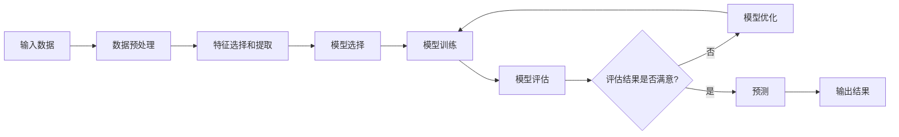

# 机器学习预测公司长期竞争力

> 关键词：机器学习、公司长期竞争力、预测模型、特征工程、数据挖掘

> 摘要：本文聚焦于利用机器学习技术预测公司长期竞争力这一主题。首先介绍了研究的背景、目的、预期读者和文档结构等内容。接着阐述了相关核心概念及其联系，包括公司长期竞争力的定义、机器学习的关键算法等，并给出了原理和架构的示意图与流程图。详细讲解了核心算法原理及具体操作步骤，结合Python源代码进行说明。同时介绍了相关的数学模型和公式，并举例说明。通过项目实战展示了代码的实际案例及详细解释，探讨了该技术在实际中的应用场景。还推荐了学习资源、开发工具框架和相关论文著作。最后总结了未来发展趋势与挑战，提供了常见问题的解答和扩展阅读参考资料，旨在为读者全面深入地了解如何运用机器学习预测公司长期竞争力提供有价值的信息。

## 1. 背景介绍 
### 1.1 目的和范围
在当今竞争激烈的商业环境中，准确预测公司的长期竞争力对于投资者、管理者和政策制定者都具有至关重要的意义。投资者需要评估公司的潜在价值，以便做出明智的投资决策；管理者需要了解公司在市场中的地位，制定有效的战略规划；政策制定者需要把握行业发展趋势，制定合理的产业政策。本研究的目的就是利用机器学习技术，构建一个能够准确预测公司长期竞争力的模型。

本研究的范围涵盖了多个行业的公司，收集了公司的财务数据、市场数据、管理数据等多方面的信息，运用多种机器学习算法进行建模和预测。通过对模型的评估和优化，提高预测的准确性和可靠性。

### 1.2 预期读者
本文的预期读者包括以下几类人群：
- **投资者**：希望通过分析公司的长期竞争力，找到具有投资价值的公司，优化投资组合。
- **企业管理者**：需要了解公司在市场中的竞争力状况，以便制定战略规划，提升公司的长期发展能力。
- **学术研究人员**：对机器学习在商业领域的应用感兴趣，希望通过本文了解相关的研究方法和技术。
- **政策制定者**：关注行业发展动态，需要依据公司竞争力的预测结果制定合理的产业政策。

### 1.3 文档结构概述
本文将按照以下结构进行组织：
- **核心概念与联系**：介绍公司长期竞争力的定义、机器学习的相关概念以及它们之间的联系，并给出原理和架构的示意图与流程图。
- **核心算法原理 & 具体操作步骤**：详细讲解用于预测公司长期竞争力的核心机器学习算法，结合Python源代码说明具体操作步骤。
- **数学模型和公式 & 详细讲解 & 举例说明**：介绍相关的数学模型和公式，并通过具体例子进行详细讲解。
- **项目实战：代码实际案例和详细解释说明**：通过一个实际项目，展示如何使用机器学习技术预测公司长期竞争力，包括开发环境搭建、源代码实现和代码解读。
- **实际应用场景**：探讨机器学习预测公司长期竞争力在实际中的应用场景。
- **工具和资源推荐**：推荐学习资源、开发工具框架和相关论文著作。
- **总结：未来发展趋势与挑战**：总结利用机器学习预测公司长期竞争力的未来发展趋势和面临的挑战。
- **附录：常见问题与解答**：解答读者在学习和应用过程中可能遇到的常见问题。
- **扩展阅读 & 参考资料**：提供相关的扩展阅读材料和参考资料。

### 1.4 术语表
#### 1.4.1 核心术语定义
- **公司长期竞争力**：指公司在长期的市场竞争中，能够持续保持优势地位，实现盈利增长和可持续发展的能力。
- **机器学习**：一门多领域交叉学科，涉及概率论、统计学、逼近论、凸分析、算法复杂度理论等多门学科。它专门研究计算机怎样模拟或实现人类的学习行为，以获取新的知识或技能，重新组织已有的知识结构使之不断改善自身的性能。
- **特征工程**：指从原始数据中提取特征，并将其转换为适合机器学习算法处理的格式的过程。
- **模型评估**：使用各种指标来评估机器学习模型的性能，如准确率、召回率、F1值等。

#### 1.4.2 相关概念解释
- **监督学习**：一种机器学习方法，在监督学习中，算法通过学习输入数据和对应的输出标签之间的关系来进行预测。
- **无监督学习**：另一种机器学习方法，无监督学习算法在没有输出标签的情况下对输入数据进行分析，发现数据中的模式和结构。
- **深度学习**：机器学习的一个分支领域，它基于人工神经网络，通过构建多层的神经网络模型来学习数据的复杂特征和模式。

#### 1.4.3 缩略词列表
- **ML**：Machine Learning，机器学习
- **AI**：Artificial Intelligence，人工智能
- **ANN**：Artificial Neural Network，人工神经网络
- **SVM**：Support Vector Machine，支持向量机
- **RF**：Random Forest，随机森林

## 2. 核心概念与联系 

### 2.1 公司长期竞争力的定义和影响因素
公司长期竞争力是一个综合性的概念，它受到多个因素的影响。从财务角度来看，公司的盈利能力、偿债能力、营运能力等都是重要的指标。盈利能力反映了公司创造利润的能力，常用的指标有净利润率、净资产收益率等；偿债能力反映了公司偿还债务的能力，常用的指标有资产负债率、流动比率等；营运能力反映了公司运营资产的效率，常用的指标有存货周转率、应收账款周转率等。

从市场角度来看，公司的市场份额、品牌影响力、产品创新能力等也对其长期竞争力有着重要的影响。市场份额反映了公司在市场中的地位，品牌影响力则体现了消费者对公司产品和服务的认可度，产品创新能力则决定了公司能否在不断变化的市场环境中保持竞争优势。

从管理角度来看，公司的管理团队素质、战略规划能力、组织架构合理性等也是影响其长期竞争力的关键因素。优秀的管理团队能够制定合理的战略规划，优化组织架构，提高公司的运营效率。

### 2.2 机器学习在预测公司长期竞争力中的应用
机器学习可以通过对大量的公司数据进行分析和挖掘，发现数据中的潜在模式和规律，从而构建预测模型来预测公司的长期竞争力。具体来说，机器学习可以完成以下几个方面的任务：
- **特征选择和提取**：从众多的公司数据中选择和提取与长期竞争力相关的特征，减少数据的维度，提高模型的效率和准确性。
- **模型构建**：选择合适的机器学习算法，如决策树、支持向量机、神经网络等，构建预测模型。
- **模型训练和优化**：使用历史数据对模型进行训练，并通过调整模型的参数和结构，优化模型的性能。
- **模型评估和预测**：使用测试数据对模型的性能进行评估，并使用训练好的模型对公司的长期竞争力进行预测。

### 2.3 核心概念原理和架构的文本示意图
下面是一个关于利用机器学习预测公司长期竞争力的原理和架构的文本示意图：

```plaintext
输入数据（公司财务数据、市场数据、管理数据等）
|
|-- 数据预处理（清洗、归一化、特征工程等）
|
|-- 特征选择和提取
|
|-- 模型选择（决策树、支持向量机、神经网络等）
|
|-- 模型训练（使用历史数据）
|
|-- 模型评估（使用测试数据）
|
|-- 模型优化（调整参数和结构）
|
|-- 预测（对公司长期竞争力进行预测）
|
输出结果（公司长期竞争力的预测值）
```

### 2.4 Mermaid流程图


## 3. 核心算法原理 & 具体操作步骤 

### 3.1 决策树算法原理
决策树是一种常用的机器学习算法，它通过构建一棵树状结构来进行决策。决策树的每个内部节点代表一个特征上的测试，每个分支代表一个测试输出，每个叶节点代表一个类别或值。决策树的构建过程是一个递归的过程，通过不断地选择最优的特征进行划分，直到满足停止条件为止。

决策树的优点是易于理解和解释，能够处理非线性数据，并且可以处理多分类问题。缺点是容易过拟合，特别是在数据量较小的情况下。

### 3.2 决策树算法的Python实现
下面是一个使用Python的`scikit-learn`库实现决策树算法的示例代码：

```python
from sklearn.datasets import load_iris
from sklearn.model_selection import train_test_split
from sklearn.tree import DecisionTreeClassifier
from sklearn.metrics import accuracy_score

# 加载数据集
iris = load_iris()
X = iris.data
y = iris.target

# 划分训练集和测试集
X_train, X_test, y_train, y_test = train_test_split(X, y, test_size=0.2, random_state=42)

# 创建决策树分类器
clf = DecisionTreeClassifier()

# 训练模型
clf.fit(X_train, y_train)

# 预测
y_pred = clf.predict(X_test)

# 评估模型
accuracy = accuracy_score(y_test, y_pred)
print(f"Accuracy: {accuracy}")
```

### 3.3 支持向量机算法原理
支持向量机是一种二分类模型，它的基本思想是在特征空间中找到一个最优的超平面，使得不同类别的样本能够被最大程度地分开。支持向量机的核心是核函数，通过核函数可以将低维空间中的数据映射到高维空间中，从而使得数据在高维空间中变得线性可分。

支持向量机的优点是能够处理高维数据，并且在处理小样本数据时表现较好。缺点是计算复杂度较高，特别是在处理大规模数据时。

### 3.4 支持向量机算法的Python实现
下面是一个使用Python的`scikit-learn`库实现支持向量机算法的示例代码：

```python
from sklearn.datasets import load_iris
from sklearn.model_selection import train_test_split
from sklearn.svm import SVC
from sklearn.metrics import accuracy_score

# 加载数据集
iris = load_iris()
X = iris.data
y = iris.target

# 划分训练集和测试集
X_train, X_test, y_train, y_test = train_test_split(X, y, test_size=0.2, random_state=42)

# 创建支持向量机分类器
clf = SVC()

# 训练模型
clf.fit(X_train, y_train)

# 预测
y_pred = clf.predict(X_test)

# 评估模型
accuracy = accuracy_score(y_test, y_pred)
print(f"Accuracy: {accuracy}")
```

### 3.5 神经网络算法原理
神经网络是一种模仿人类神经系统的机器学习模型，它由多个神经元组成，通过神经元之间的连接和权重来实现信息的传递和处理。神经网络可以分为输入层、隐藏层和输出层，隐藏层可以有多个。神经网络的训练过程是通过反向传播算法来调整神经元之间的权重，使得模型的输出与真实标签之间的误差最小化。

神经网络的优点是能够处理复杂的非线性数据，并且具有很强的学习能力。缺点是训练时间较长，容易过拟合，并且需要大量的训练数据。

### 3.6 神经网络算法的Python实现
下面是一个使用Python的`Keras`库实现简单神经网络的示例代码：

```python
from sklearn.datasets import load_iris
from sklearn.model_selection import train_test_split
from keras.models import Sequential
from keras.layers import Dense
from sklearn.preprocessing import OneHotEncoder
import numpy as np

# 加载数据集
iris = load_iris()
X = iris.data
y = iris.target

# 对标签进行one-hot编码
encoder = OneHotEncoder(sparse=False)
y = encoder.fit_transform(y.reshape(-1, 1))

# 划分训练集和测试集
X_train, X_test, y_train, y_test = train_test_split(X, y, test_size=0.2, random_state=42)

# 创建神经网络模型
model = Sequential()
model.add(Dense(10, input_dim=4, activation='relu'))
model.add(Dense(3, activation='softmax'))

# 编译模型
model.compile(loss='categorical_crossentropy', optimizer='adam', metrics=['accuracy'])

# 训练模型
model.fit(X_train, y_train, epochs=100, batch_size=10, verbose=1)

# 评估模型
_, accuracy = model.evaluate(X_test, y_test)
print(f"Accuracy: {accuracy}")
```

## 4. 数学模型和公式 & 详细讲解 & 举例说明 

### 4.1 决策树的信息增益公式
决策树的构建过程中，常用的特征选择方法是信息增益。信息增益是指在使用某个特征进行划分后，数据集的信息熵减少的量。信息熵是衡量数据集不确定性的指标，信息熵越大，数据集的不确定性就越大。

信息熵的计算公式为：
$$
H(D)=-\sum_{i=1}^{n}p_i\log_2p_i
$$
其中，$D$ 表示数据集，$p_i$ 表示数据集中第 $i$ 类样本的比例，$n$ 表示类别数。

信息增益的计算公式为：
$$
Gain(D,A)=H(D)-\sum_{v=1}^{V}\frac{|D^v|}{|D|}H(D^v)
$$
其中，$A$ 表示特征，$V$ 表示特征 $A$ 的取值个数，$D^v$ 表示特征 $A$ 取值为 $v$ 的样本子集。

下面通过一个简单的例子来说明信息增益的计算：

假设有一个数据集 $D$，包含 10 个样本，分为两类，其中第一类有 6 个样本，第二类有 4 个样本。则数据集 $D$ 的信息熵为：
$$
H(D)=-\frac{6}{10}\log_2\frac{6}{10}-\frac{4}{10}\log_2\frac{4}{10}\approx0.971
$$

假设我们有一个特征 $A$，它有两个取值 $A_1$ 和 $A_2$。特征 $A$ 取值为 $A_1$ 的样本子集 $D^1$ 包含 4 个样本，其中第一类有 3 个样本，第二类有 1 个样本；特征 $A$ 取值为 $A_2$ 的样本子集 $D^2$ 包含 6 个样本，其中第一类有 3 个样本，第二类有 3 个样本。则样本子集 $D^1$ 和 $D^2$ 的信息熵分别为：
$$
H(D^1)=-\frac{3}{4}\log_2\frac{3}{4}-\frac{1}{4}\log_2\frac{1}{4}\approx0.811
$$
$$
H(D^2)=-\frac{3}{6}\log_2\frac{3}{6}-\frac{3}{6}\log_2\frac{3}{6}=1
$$

则使用特征 $A$ 进行划分后的信息增益为：
$$
Gain(D,A)=0.971-\frac{4}{10}\times0.811-\frac{6}{10}\times1\approx0.046
$$

### 4.2 支持向量机的目标函数和约束条件
支持向量机的目标是在特征空间中找到一个最优的超平面，使得不同类别的样本能够被最大程度地分开。假设我们有一个二分类问题，训练数据集为 $\{(x_1,y_1),(x_2,y_2),\cdots,(x_n,y_n)\}$，其中 $x_i\in\mathbb{R}^d$ 表示第 $i$ 个样本的特征向量，$y_i\in\{-1,1\}$ 表示第 $i$ 个样本的类别标签。

支持向量机的目标函数可以表示为：
$$
\min_{w,b}\frac{1}{2}\|w\|^2
$$
约束条件为：
$$
y_i(w^Tx_i + b)\geq1, i = 1,2,\cdots,n
$$
其中，$w$ 是超平面的法向量，$b$ 是超平面的截距。

为了处理线性不可分的情况，支持向量机引入了松弛变量 $\xi_i\geq0$，目标函数变为：
$$
\min_{w,b,\xi}\frac{1}{2}\|w\|^2 + C\sum_{i=1}^{n}\xi_i
$$
约束条件变为：
$$
y_i(w^Tx_i + b)\geq1 - \xi_i, i = 1,2,\cdots,n
$$
$$
\xi_i\geq0, i = 1,2,\cdots,n
$$
其中，$C$ 是惩罚参数，用于控制模型的复杂度和误差之间的平衡。

### 4.3 神经网络的损失函数和反向传播算法
神经网络的训练过程是通过最小化损失函数来调整神经元之间的权重。常用的损失函数有均方误差损失函数和交叉熵损失函数。

均方误差损失函数的计算公式为：
$$
L=\frac{1}{2m}\sum_{i=1}^{m}(y_i - \hat{y}_i)^2
$$
其中，$m$ 表示样本数，$y_i$ 表示第 $i$ 个样本的真实标签，$\hat{y}_i$ 表示第 $i$ 个样本的预测标签。

交叉熵损失函数的计算公式为：
$$
L=-\frac{1}{m}\sum_{i=1}^{m}\sum_{j=1}^{k}y_{ij}\log\hat{y}_{ij}
$$
其中，$k$ 表示类别数，$y_{ij}$ 表示第 $i$ 个样本的第 $j$ 个类别的真实标签，$\hat{y}_{ij}$ 表示第 $i$ 个样本的第 $j$ 个类别的预测标签。

反向传播算法是神经网络训练的核心算法，它通过链式法则来计算损失函数对每个神经元的权重的梯度，然后根据梯度下降法来更新权重。具体步骤如下：
1. **前向传播**：将输入数据输入到神经网络中，计算每个神经元的输出。
2. **计算损失函数**：根据预测输出和真实标签计算损失函数的值。
3. **反向传播**：从输出层开始，依次计算每个神经元的误差项，并根据误差项计算损失函数对每个神经元的权重的梯度。
4. **更新权重**：根据梯度下降法更新每个神经元的权重。

## 5. 项目实战：代码实际案例和详细解释说明 

### 5.1  开发环境搭建
在进行项目实战之前，我们需要搭建好开发环境。以下是搭建开发环境的步骤：
1. **安装Python**：建议安装Python 3.7及以上版本，可以从Python官方网站（https://www.python.org/downloads/）下载安装包进行安装。
2. **安装必要的库**：我们需要安装一些常用的Python库，如`numpy`、`pandas`、`scikit-learn`、`keras`等。可以使用`pip`命令进行安装，例如：
```sh
pip install numpy pandas scikit-learn keras
```
3. **选择开发工具**：可以选择使用Jupyter Notebook、PyCharm等开发工具。Jupyter Notebook适合进行交互式开发和数据分析，PyCharm适合进行大型项目的开发和调试。

### 5.2  源代码详细实现和代码解读
下面我们通过一个实际的项目来展示如何使用机器学习技术预测公司长期竞争力。假设我们有一个包含公司财务数据和市场数据的数据集，我们的目标是根据这些数据预测公司的长期竞争力。

```python
import numpy as np
import pandas as pd
from sklearn.model_selection import train_test_split
from sklearn.preprocessing import StandardScaler
from sklearn.ensemble import RandomForestClassifier
from sklearn.metrics import accuracy_score

# 加载数据集
data = pd.read_csv('company_data.csv')

# 分离特征和标签
X = data.drop('long_term_competitiveness', axis=1)
y = data['long_term_competitiveness']

# 划分训练集和测试集
X_train, X_test, y_train, y_test = train_test_split(X, y, test_size=0.2, random_state=42)

# 数据标准化
scaler = StandardScaler()
X_train = scaler.fit_transform(X_train)
X_test = scaler.transform(X_test)

# 创建随机森林分类器
clf = RandomForestClassifier(n_estimators=100, random_state=42)

# 训练模型
clf.fit(X_train, y_train)

# 预测
y_pred = clf.predict(X_test)

# 评估模型
accuracy = accuracy_score(y_test, y_pred)
print(f"Accuracy: {accuracy}")
```

### 5.3  代码解读与分析
1. **数据加载**：使用`pandas`库的`read_csv`函数加载包含公司数据的CSV文件。
2. **特征和标签分离**：使用`drop`方法将目标标签`long_term_competitiveness`从数据集中分离出来，得到特征矩阵`X`和标签向量`y`。
3. **数据集划分**：使用`train_test_split`函数将数据集划分为训练集和测试集，测试集占总数据集的20%。
4. **数据标准化**：使用`StandardScaler`对特征矩阵进行标准化处理，使得每个特征的均值为0，标准差为1。
5. **模型创建**：使用`RandomForestClassifier`创建一个随机森林分类器，设置树的数量为100。
6. **模型训练**：使用训练集数据对随机森林分类器进行训练。
7. **模型预测**：使用训练好的模型对测试集数据进行预测。
8. **模型评估**：使用`accuracy_score`函数计算模型的准确率。

## 6. 实际应用场景 
### 6.1 投资决策
投资者可以利用机器学习预测公司长期竞争力的结果，选择具有投资价值的公司进行投资。通过对公司的财务数据、市场数据等进行分析，预测公司的未来发展趋势和盈利能力，从而做出更加明智的投资决策。

### 6.2 企业战略规划
企业管理者可以根据机器学习预测的结果，了解公司在市场中的竞争力状况，制定合理的战略规划。例如，如果预测结果显示公司的长期竞争力较弱，管理者可以考虑加大研发投入、优化产品结构、拓展市场渠道等措施来提升公司的竞争力。

### 6.3 行业分析和政策制定
政策制定者可以通过分析不同公司的长期竞争力，了解行业的发展趋势和竞争格局，制定合理的产业政策。例如，如果某个行业的整体竞争力较弱，政策制定者可以出台相关政策，鼓励企业加大创新投入，提高行业的整体竞争力。

### 6.4 风险管理
金融机构可以利用机器学习预测公司长期竞争力的结果，对企业的信用风险进行评估。通过对企业的财务状况、经营能力等进行分析，预测企业的违约概率，从而采取相应的风险管理措施，降低金融风险。

## 7. 工具和资源推荐
### 7.1 学习资源推荐
#### 7.1.1 书籍推荐
- 《机器学习》（周志华著）：这本书是机器学习领域的经典教材，全面介绍了机器学习的基本概念、算法和应用。
- 《深度学习》（Ian Goodfellow、Yoshua Bengio和Aaron Courville著）：这本书是深度学习领域的权威著作，详细介绍了深度学习的理论和实践。
- 《Python机器学习》（Sebastian Raschka和Vahid Mirjalili著）：这本书结合Python语言，介绍了机器学习的常用算法和工具，适合初学者学习。

#### 7.1.2 在线课程
- Coursera上的“机器学习”课程（Andrew Ng教授授课）：这是一门非常经典的机器学习课程，介绍了机器学习的基本概念、算法和应用。
- edX上的“深度学习”课程（由多个知名教授授课）：这门课程系统地介绍了深度学习的理论和实践。
- 网易云课堂上的“Python数据分析与机器学习实战”课程：这门课程结合实际案例，介绍了Python在数据分析和机器学习中的应用。

#### 7.1.3 技术博客和网站
- Medium：这是一个技术博客平台，上面有很多关于机器学习和人工智能的优质文章。
- Towards Data Science：这是一个专注于数据科学和机器学习的网站，上面有很多实用的教程和案例。
- Kaggle：这是一个数据科学竞赛平台，上面有很多公开的数据集和优秀的解决方案，可以学习到很多实际应用的经验。

### 7.2 开发工具框架推荐
#### 7.2.1 IDE和编辑器
- PyCharm：这是一款专业的Python集成开发环境，具有代码编辑、调试、版本控制等功能，适合大型项目的开发。
- Jupyter Notebook：这是一个交互式的开发环境，适合进行数据分析和模型实验，可以实时查看代码的运行结果。
- Visual Studio Code：这是一款轻量级的代码编辑器，支持多种编程语言，并且有丰富的插件可以扩展功能。

#### 7.2.2 调试和性能分析工具
- PySnooper：这是一个简单易用的Python调试工具，可以自动记录函数的调用过程和变量的值，方便调试代码。
- cProfile：这是Python标准库中的一个性能分析工具，可以分析代码的运行时间和函数调用次数，找出性能瓶颈。
- TensorBoard：这是TensorFlow的可视化工具，可以用于可视化神经网络的训练过程和模型结构。

#### 7.2.3 相关框架和库
- scikit-learn：这是一个常用的Python机器学习库，提供了丰富的机器学习算法和工具，如分类、回归、聚类等。
- Keras：这是一个高级神经网络库，基于TensorFlow、Theano等后端，简单易用，适合快速搭建神经网络模型。
- PyTorch：这是一个开源的深度学习框架，具有动态图的特点，适合进行研究和开发。

### 7.3 相关论文著作推荐
#### 7.3.1 经典论文
- “A Decision-Theoretic Generalization of On-Line Learning and an Application to Boosting”（Yoav Freund和Robert E. Schapire著）：这篇论文提出了AdaBoost算法，是机器学习领域的经典论文之一。
- “Support-Vector Networks”（Corinna Cortes和Vladimir Vapnik著）：这篇论文介绍了支持向量机的基本原理和算法，是支持向量机领域的奠基之作。
- “Gradient-Based Learning Applied to Document Recognition”（Yann LeCun、Léon Bottou、Yoshua Bengio和Patrick Haffner著）：这篇论文介绍了卷积神经网络的基本原理和应用，是深度学习领域的经典论文之一。

#### 7.3.2 最新研究成果
- 可以关注NeurIPS、ICML、CVPR等顶级机器学习和人工智能会议的论文，了解最新的研究成果和技术趋势。
- 也可以关注相关领域的学术期刊，如Journal of Machine Learning Research、Artificial Intelligence等。

#### 7.3.3 应用案例分析
- 《机器学习实战》（Peter Harrington著）：这本书通过实际案例介绍了机器学习的应用，包括分类、回归、聚类等算法的应用。
- 《Python数据分析实战》（Robert Johansson著）：这本书结合Python语言，介绍了数据分析和机器学习在实际项目中的应用。

## 8. 总结：未来发展趋势与挑战
### 8.1 未来发展趋势
- **多源数据融合**：未来，预测公司长期竞争力将不仅仅依赖于财务数据和市场数据，还会融合更多的数据源，如社交媒体数据、物联网数据等，以获取更全面的信息。
- **深度学习的广泛应用**：深度学习在处理复杂数据和挖掘潜在模式方面具有强大的能力，未来将在预测公司长期竞争力中得到更广泛的应用。
- **可解释性机器学习**：随着机器学习模型的复杂性不断增加，模型的可解释性变得越来越重要。未来，研究人员将致力于开发可解释性强的机器学习模型，以便更好地理解模型的决策过程。
- **实时预测**：随着数据的实时性要求越来越高，未来的预测模型将能够实现实时预测，及时反映公司竞争力的变化。

### 8.2 面临的挑战
- **数据质量问题**：数据的质量直接影响模型的性能。在实际应用中，数据可能存在缺失值、异常值等问题，需要进行有效的数据预处理。
- **模型过拟合问题**：机器学习模型容易出现过拟合问题，特别是在数据量较小的情况下。需要采用合适的模型选择和正则化方法来避免过拟合。
- **计算资源需求**：深度学习模型通常需要大量的计算资源和时间来训练，这对于一些小型企业和研究机构来说是一个挑战。
- **法律和伦理问题**：在使用机器学习预测公司长期竞争力时，需要考虑数据隐私、算法公平性等法律和伦理问题。

## 9. 附录：常见问题与解答
### 9.1 如何选择合适的机器学习算法？
选择合适的机器学习算法需要考虑多个因素，如数据的类型、数据的规模、问题的复杂度等。一般来说，可以先尝试一些简单的算法，如决策树、逻辑回归等，然后再尝试一些复杂的算法，如支持向量机、神经网络等。同时，可以使用交叉验证等方法来评估不同算法的性能，选择性能最优的算法。

### 9.2 如何处理数据中的缺失值和异常值？
处理数据中的缺失值和异常值可以采用以下方法：
- **缺失值处理**：可以使用均值、中位数、众数等统计量来填充缺失值，也可以使用插值方法来填充缺失值。
- **异常值处理**：可以使用统计方法（如Z-score法）来检测异常值，然后将异常值删除或进行修正。

### 9.3 如何评估机器学习模型的性能？
评估机器学习模型的性能可以使用多种指标，如准确率、召回率、F1值、均方误差等。具体选择哪种指标需要根据问题的类型和需求来确定。例如，在分类问题中，常用的指标有准确率、召回率、F1值等；在回归问题中，常用的指标有均方误差、平均绝对误差等。

### 9.4 如何避免模型过拟合？
避免模型过拟合可以采用以下方法：
- **增加数据量**：增加训练数据的规模可以减少模型过拟合的风险。
- **特征选择和提取**：选择和提取与目标变量相关的特征，减少无关特征的干扰。
- **正则化**：在模型的损失函数中加入正则化项，如L1正则化、L2正则化等，限制模型的复杂度。
- **交叉验证**：使用交叉验证方法来评估模型的性能，选择最优的模型参数。

## 10. 扩展阅读 & 参考资料
### 10.1 扩展阅读
- 《人工智能：现代方法》（Stuart Russell和Peter Norvig著）：这本书全面介绍了人工智能的基本概念、算法和应用，是人工智能领域的经典教材。
- 《数据挖掘：概念与技术》（Jiawei Han、Jian Pei和Jianwen Yin著）：这本书介绍了数据挖掘的基本概念、算法和应用，适合对数据挖掘感兴趣的读者阅读。
- 《Python高级编程》（Dustin Ingram和J. Burton Browning著）：这本书介绍了Python的高级特性和编程技巧，适合有一定Python基础的读者阅读。

### 10.2 参考资料
- scikit-learn官方文档：https://scikit-learn.org/stable/documentation.html
- Keras官方文档：https://keras.io/
- PyTorch官方文档：https://pytorch.org/docs/stable/index.html

作者：AI天才研究院/AI Genius Institute & 禅与计算机程序设计艺术 /Zen And The Art of Computer Programming