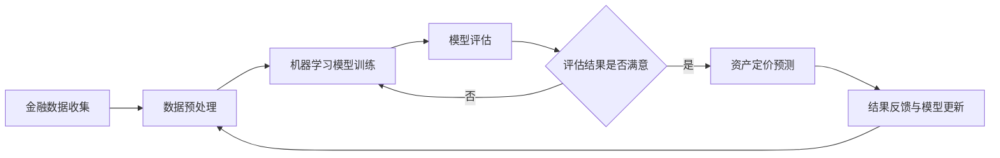

# 机器学习驱动的动态资产定价模型

> 关键词：机器学习、动态资产定价模型、金融市场、算法原理、实际应用

> 摘要：本文聚焦于机器学习驱动的动态资产定价模型，深入探讨其核心概念、算法原理、数学模型等内容。首先介绍了相关背景知识，包括目的范围、预期读者等。接着详细阐述了核心概念及联系，给出了原理和架构的示意图与流程图。通过Python代码对核心算法原理和具体操作步骤进行了说明，并讲解了数学模型和公式。在项目实战部分，展示了开发环境搭建、源代码实现及解读。分析了该模型的实际应用场景，推荐了学习资源、开发工具框架以及相关论文著作。最后总结了未来发展趋势与挑战，解答了常见问题并提供扩展阅读和参考资料，旨在为读者全面深入地了解机器学习驱动的动态资产定价模型提供有价值的信息。

## 1. 背景介绍 
### 1.1 目的和范围
动态资产定价一直是金融领域的核心问题之一，传统的资产定价模型往往基于一系列严格的假设，在实际金融市场复杂多变的情况下，其预测能力和适应性受到一定限制。本文章的目的在于探讨如何利用机器学习技术来构建更有效的动态资产定价模型，以提高资产定价的准确性和对市场变化的适应性。

范围涵盖了从机器学习的基本算法到动态资产定价模型的构建，包括核心概念的阐述、算法原理的讲解、数学模型的推导，以及通过实际案例展示模型的应用。同时，还会涉及该模型在不同金融场景中的应用，以及相关的学习资源和工具推荐。

### 1.2 预期读者
本文预期读者包括金融领域的从业者，如投资分析师、交易员、风险管理人员等，他们可以通过了解机器学习驱动的动态资产定价模型，提升自身在资产定价和投资决策方面的能力。也适合计算机科学和机器学习领域的研究人员和开发者，为他们在金融领域的应用研究提供参考。此外，对金融和机器学习交叉领域感兴趣的学生和爱好者也能从本文中获取有价值的知识。

### 1.3 文档结构概述
本文将按照以下结构进行阐述：首先介绍背景知识，包括目的范围、预期读者等；接着深入探讨核心概念与联系，给出相关的原理和架构示意图以及流程图；详细讲解核心算法原理和具体操作步骤，并通过Python代码进行说明；推导数学模型和公式，并举例说明；进行项目实战，包括开发环境搭建、源代码实现和解读；分析实际应用场景；推荐相关的学习资源、开发工具框架和论文著作；总结未来发展趋势与挑战；解答常见问题；最后提供扩展阅读和参考资料。

### 1.4 术语表
#### 1.4.1 核心术语定义
- **机器学习（Machine Learning）**：一门多领域交叉学科，涉及概率论、统计学、逼近论、凸分析、算法复杂度理论等多门学科。它专门研究计算机怎样模拟或实现人类的学习行为，以获取新的知识或技能，重新组织已有的知识结构使之不断改善自身的性能。
- **动态资产定价模型（Dynamic Asset Pricing Model）**：用于描述资产价格随时间变化的数学模型，考虑了市场中各种因素的动态变化对资产价格的影响。
- **特征工程（Feature Engineering）**：指从原始数据中提取特征，并将其转换为适合机器学习算法处理的形式的过程。

#### 1.4.2 相关概念解释
- **过拟合（Overfitting）**：在机器学习中，模型在训练数据上表现良好，但在测试数据或新数据上表现不佳的现象。这是由于模型过于复杂，学习了训练数据中的噪声和细节，而失去了对数据一般规律的把握。
- **欠拟合（Underfitting）**：模型在训练数据和测试数据上的表现都不佳的现象，通常是由于模型过于简单，无法捕捉数据中的复杂关系。

#### 1.4.3 缩略词列表
- **ML**：Machine Learning（机器学习）
- **DAPM**：Dynamic Asset Pricing Model（动态资产定价模型）

## 2. 核心概念与联系 
### 核心概念原理
机器学习驱动的动态资产定价模型的核心思想是利用机器学习算法从大量的金融数据中学习资产价格的动态变化规律，从而对资产进行定价。传统的资产定价模型，如资本资产定价模型（CAPM）、套利定价理论（APT）等，往往基于一些假设，如市场有效、投资者理性等，这些假设在实际市场中并不总是成立。而机器学习模型可以处理复杂的非线性关系，不需要严格的假设，能够更好地适应市场的变化。

常见的用于动态资产定价的机器学习算法包括神经网络、决策树、支持向量机等。神经网络可以自动学习数据中的复杂模式，通过多层神经元的非线性变换，对资产价格进行预测。决策树则可以通过对数据的划分，找出影响资产价格的关键因素。支持向量机可以在高维空间中找到最优的分类超平面，用于资产价格的分类和预测。

### 架构的文本示意图
```plaintext
金融数据收集 --> 数据预处理（清洗、特征工程） --> 机器学习模型训练（选择算法、调参） --> 模型评估（验证集、测试集） --> 资产定价预测 --> 结果反馈与模型更新
```

### Mermaid 流程图


## 3. 核心算法原理 & 具体操作步骤 
### 神经网络算法原理
神经网络是一种模仿人类神经系统的机器学习算法，由输入层、隐藏层和输出层组成。每个神经元接收输入信号，经过加权求和和非线性激活函数处理后，输出信号传递给下一层神经元。在动态资产定价中，输入层可以是各种金融数据特征，如历史价格、交易量、宏观经济指标等，输出层则是资产的预测价格。

以下是一个简单的使用Python和Keras库实现的神经网络模型代码：
```python
import numpy as np
from keras.models import Sequential
from keras.layers import Dense

# 生成一些示例数据
X = np.random.rand(100, 10)  # 100个样本，每个样本有10个特征
y = np.random.rand(100, 1)   # 对应的目标值

# 构建神经网络模型
model = Sequential()
model.add(Dense(64, input_dim=10, activation='relu'))  # 输入层到第一个隐藏层
model.add(Dense(32, activation='relu'))  # 第二个隐藏层
model.add(Dense(1, activation='linear'))  # 输出层

# 编译模型
model.compile(loss='mean_squared_error', optimizer='adam')

# 训练模型
model.fit(X, y, epochs=100, batch_size=10)

# 进行预测
new_X = np.random.rand(1, 10)
prediction = model.predict(new_X)
print("预测结果:", prediction)
```
### 具体操作步骤
1. **数据收集**：收集与资产定价相关的金融数据，如历史价格、交易量、财务报表、宏观经济指标等。
2. **数据预处理**：对收集到的数据进行清洗，去除缺失值、异常值等。进行特征工程，提取有价值的特征，并将特征进行标准化处理，使不同特征具有相同的尺度。
3. **模型选择**：根据数据的特点和问题的需求，选择合适的机器学习算法，如神经网络、决策树、支持向量机等。
4. **模型训练**：将预处理后的数据分为训练集和验证集，使用训练集对模型进行训练，通过调整模型的参数，使模型在验证集上的表现达到最优。
5. **模型评估**：使用测试集对训练好的模型进行评估，常用的评估指标包括均方误差（MSE）、平均绝对误差（MAE）等。
6. **资产定价预测**：使用训练好的模型对新的资产进行定价预测。
7. **模型更新**：随着市场数据的不断变化，定期对模型进行更新，以保证模型的准确性和适应性。

## 4. 数学模型和公式 & 详细讲解 & 举例说明 
### 均方误差（MSE）
均方误差是衡量模型预测值与真实值之间差异的常用指标，其数学公式为：
$$MSE = \frac{1}{n} \sum_{i=1}^{n} (y_i - \hat{y}_i)^2$$
其中，$n$ 是样本数量，$y_i$ 是真实值，$\hat{y}_i$ 是预测值。

例如，假设有三个样本的真实值分别为 $y_1 = 2, y_2 = 4, y_3 = 6$，模型的预测值分别为 $\hat{y}_1 = 2.1, \hat{y}_2 = 3.9, \hat{y}_3 = 6.2$，则均方误差为：
$$MSE = \frac{1}{3} [(2 - 2.1)^2 + (4 - 3.9)^2 + (6 - 6.2)^2] = \frac{1}{3} [0.01 + 0.01 + 0.04] = \frac{0.06}{3} = 0.02$$

### 神经网络的前向传播和反向传播
在神经网络中，前向传播是指输入数据从输入层经过隐藏层传递到输出层的过程。假设输入层有 $n$ 个神经元，第 $j$ 个隐藏层的第 $k$ 个神经元的输入为：
$$z_{jk} = \sum_{i=1}^{n} w_{ijk} x_i + b_{jk}$$
其中，$w_{ijk}$ 是输入层第 $i$ 个神经元到第 $j$ 个隐藏层第 $k$ 个神经元的权重，$x_i$ 是输入层第 $i$ 个神经元的输入，$b_{jk}$ 是第 $j$ 个隐藏层第 $k$ 个神经元的偏置。

经过激活函数 $\sigma$ 处理后，输出为：
$$a_{jk} = \sigma(z_{jk})$$

反向传播是指根据模型的损失函数，从输出层向输入层反向传播误差，更新模型的权重和偏置的过程。常用的损失函数是均方误差损失函数，通过求损失函数对权重和偏置的偏导数，使用梯度下降法更新权重和偏置。

## 5. 项目实战：代码实际案例和详细解释说明 
### 5.1  开发环境搭建
#### 安装Python
首先需要安装Python，建议使用Python 3.7及以上版本。可以从Python官方网站（https://www.python.org/downloads/）下载安装包进行安装。

#### 安装必要的库
使用pip命令安装以下必要的库：
```sh
pip install numpy pandas scikit-learn keras tensorflow
```
其中，numpy用于数值计算，pandas用于数据处理，scikit-learn用于机器学习算法，keras和tensorflow用于构建和训练神经网络模型。

### 5.2  源代码详细实现和代码解读
```python
import numpy as np
import pandas as pd
from sklearn.model_selection import train_test_split
from sklearn.preprocessing import StandardScaler
from keras.models import Sequential
from keras.layers import Dense

# 1. 数据加载
data = pd.read_csv('asset_pricing_data.csv')  # 假设数据文件名为 asset_pricing_data.csv
X = data.drop('price', axis=1).values  # 特征数据
y = data['price'].values  # 目标数据

# 2. 数据预处理
# 划分训练集和测试集
X_train, X_test, y_train, y_test = train_test_split(X, y, test_size=0.2, random_state=42)

# 数据标准化
scaler = StandardScaler()
X_train = scaler.fit_transform(X_train)
X_test = scaler.transform(X_test)

# 3. 构建神经网络模型
model = Sequential()
model.add(Dense(64, input_dim=X_train.shape[1], activation='relu'))
model.add(Dense(32, activation='relu'))
model.add(Dense(1, activation='linear'))

# 4. 编译模型
model.compile(loss='mean_squared_error', optimizer='adam')

# 5. 训练模型
model.fit(X_train, y_train, epochs=100, batch_size=10, validation_split=0.1)

# 6. 模型评估
loss = model.evaluate(X_test, y_test)
print("测试集损失:", loss)

# 7. 进行预测
new_X = np.random.rand(1, X_train.shape[1])
new_X = scaler.transform(new_X)
prediction = model.predict(new_X)
print("预测价格:", prediction)
```
### 5.3  代码解读与分析
1. **数据加载**：使用pandas库的`read_csv`函数加载数据文件，并将特征数据和目标数据分别存储在`X`和`y`中。
2. **数据预处理**：使用`train_test_split`函数将数据划分为训练集和测试集，比例为8:2。使用`StandardScaler`对数据进行标准化处理，使不同特征具有相同的尺度。
3. **构建神经网络模型**：使用Keras库构建一个简单的神经网络模型，包含一个输入层、两个隐藏层和一个输出层。输入层的神经元数量根据特征的数量确定，隐藏层使用ReLU激活函数，输出层使用线性激活函数。
4. **编译模型**：使用均方误差损失函数和Adam优化器编译模型。
5. **训练模型**：使用训练集对模型进行训练，设置训练轮数为100，批次大小为10，并使用10%的训练数据作为验证集。
6. **模型评估**：使用测试集对训练好的模型进行评估，计算测试集的损失。
7. **进行预测**：生成一个新的样本，对其进行标准化处理后，使用训练好的模型进行预测。

## 6. 实际应用场景 
### 股票定价
在股票市场中，机器学习驱动的动态资产定价模型可以用于预测股票价格的走势。通过分析公司的财务报表、行业数据、宏观经济指标等信息，模型可以学习到影响股票价格的因素，从而对股票进行定价。投资者可以根据模型的预测结果进行投资决策，如买入、卖出或持有股票。

### 债券定价
对于债券市场，模型可以考虑债券的票面利率、到期时间、信用评级等因素，对债券的价格进行预测。债券发行人可以根据模型的定价结果确定债券的发行价格，投资者可以根据预测价格评估债券的投资价值。

### 期权定价
期权定价是金融领域的一个复杂问题，传统的期权定价模型如布莱克 - 斯科尔斯模型有一定的局限性。机器学习驱动的动态资产定价模型可以处理更多的市场因素和复杂的非线性关系，提高期权定价的准确性。期权交易者可以根据模型的定价结果进行期权交易策略的制定。

### 风险管理
在金融机构的风险管理中，动态资产定价模型可以用于评估资产组合的风险。通过对资产价格的动态预测，模型可以计算出资产组合的风险价值（VaR）等风险指标，帮助金融机构制定合理的风险管理策略，降低风险损失。

## 7. 工具和资源推荐
### 7.1 学习资源推荐
#### 7.1.1 书籍推荐
- 《机器学习》（周志华）：这本书是机器学习领域的经典教材，系统地介绍了机器学习的基本概念、算法和应用，适合初学者和有一定基础的读者。
- 《深度学习》（Ian Goodfellow、Yoshua Bengio、Aaron Courville）：深度学习领域的权威著作，详细介绍了深度学习的理论和实践，对神经网络、卷积神经网络、循环神经网络等进行了深入讲解。
- 《金融机器学习》（Marcos Lopez de Prado）：专门介绍机器学习在金融领域的应用，包括资产定价、风险管理、交易策略等方面，结合实际案例进行分析。

#### 7.1.2 在线课程
- Coursera上的“机器学习”课程（Andrew Ng教授主讲）：该课程是机器学习领域的经典在线课程，由斯坦福大学的Andrew Ng教授主讲，内容涵盖了机器学习的基本算法和应用，适合初学者。
- edX上的“深度学习专项课程”：由深度学习领域的知名学者授课，包括深度学习基础、卷积神经网络、循环神经网络等课程，适合有一定机器学习基础的读者深入学习深度学习。

#### 7.1.3 技术博客和网站
- Medium：有很多机器学习和金融领域的博主分享最新的研究成果和实践经验，可以关注相关的主题和作者。
- arXiv：一个预印本数据库，包含了大量的机器学习和金融领域的研究论文，可以及时了解最新的研究动态。

### 7.2 开发工具框架推荐
#### 7.2.1 IDE和编辑器
- PyCharm：一款专业的Python集成开发环境，提供了丰富的代码编辑、调试、版本控制等功能，适合开发机器学习项目。
- Jupyter Notebook：一种交互式的开发环境，可以将代码、文本、图表等结合在一起，方便进行数据分析和模型开发。

#### 7.2.2 调试和性能分析工具
- TensorBoard：TensorFlow的可视化工具，可以用于可视化模型的训练过程、损失函数的变化、模型的结构等，帮助开发者调试和优化模型。
- Scikit-learn的GridSearchCV：用于模型参数调优的工具，可以通过网格搜索的方式找到最优的模型参数。

#### 7.2.3 相关框架和库
- TensorFlow：一个开源的机器学习框架，提供了丰富的工具和接口，用于构建和训练各种机器学习模型，特别是深度学习模型。
- PyTorch：另一个流行的深度学习框架，具有动态图的特点，易于使用和调试，在学术界和工业界都有广泛的应用。
- Scikit-learn：一个简单易用的机器学习库，提供了各种机器学习算法和工具，如分类、回归、聚类等，适合快速开发和实验。

### 7.3 相关论文著作推荐
#### 7.3.1 经典论文
- Fama, Eugene F., and Kenneth R. French. "The Cross-Section of Expected Stock Returns." The Journal of Finance 47.2 (1992): 427-465. 该论文提出了著名的Fama - French三因子模型，对资产定价理论有重要贡献。
- Black, Fischer, and Myron Scholes. "The Pricing of Options and Corporate Liabilities." Journal of Political Economy 81.3 (1973): 637-654. 这是期权定价领域的经典论文，提出了布莱克 - 斯科尔斯期权定价模型。

#### 7.3.2 最新研究成果
可以关注顶级金融期刊如Journal of Financial Economics、Review of Financial Studies等，以及机器学习领域的会议如NeurIPS、ICML等，获取最新的研究成果。

#### 7.3.3 应用案例分析
一些金融科技公司和研究机构会发布机器学习在金融领域的应用案例分析报告，可以通过他们的官方网站或相关行业媒体获取这些报告，了解实际应用中的经验和挑战。

## 8. 总结：未来发展趋势与挑战
### 未来发展趋势
#### 融合更多数据源
未来的机器学习驱动的动态资产定价模型将融合更多类型的数据源，如社交媒体数据、新闻文本数据、卫星图像数据等。这些非传统数据源可以提供更多关于市场情绪、行业动态等方面的信息，有助于提高模型的预测能力。

#### 结合强化学习
强化学习可以在动态的金融市场环境中进行决策优化，将强化学习与机器学习驱动的动态资产定价模型相结合，可以实现更智能的投资决策和交易策略。

#### 模型可解释性增强
随着金融监管的加强和投资者对模型信任度的要求提高，未来的模型将更加注重可解释性。研究者将开发出更多的方法来解释模型的决策过程和结果，使模型的预测更加透明和可信。

### 挑战
#### 数据质量和隐私问题
金融数据往往存在质量参差不齐、缺失值、异常值等问题，同时数据隐私也是一个重要的挑战。如何保证数据的质量和隐私，是构建有效模型的关键。

#### 模型复杂度和计算资源
机器学习模型，特别是深度学习模型，通常具有较高的复杂度，需要大量的计算资源进行训练和预测。如何在有限的计算资源下提高模型的效率，是一个亟待解决的问题。

#### 市场不确定性
金融市场具有高度的不确定性，受到多种因素的影响，如政策变化、突发事件等。模型如何适应市场的不确定性，提高对市场变化的鲁棒性，是一个巨大的挑战。

## 9. 附录：常见问题与解答
### 问题1：机器学习驱动的动态资产定价模型与传统资产定价模型相比，有哪些优势？
答：传统资产定价模型往往基于严格的假设，在实际市场中可能不成立。而机器学习驱动的动态资产定价模型可以处理复杂的非线性关系，不需要严格的假设，能够更好地适应市场的变化。它可以从大量的金融数据中学习到资产价格的动态变化规律，提高定价的准确性。

### 问题2：如何选择合适的机器学习算法用于动态资产定价？
答：选择合适的机器学习算法需要考虑数据的特点和问题的需求。如果数据具有复杂的非线性关系，神经网络可能是一个不错的选择；如果数据具有明显的特征划分，决策树或随机森林可能更合适；如果需要在高维空间中进行分类和预测，支持向量机可能是一个好的选择。同时，还可以通过交叉验证等方法比较不同算法的性能，选择最优的算法。

### 问题3：如何评估机器学习驱动的动态资产定价模型的性能？
答：常用的评估指标包括均方误差（MSE）、平均绝对误差（MAE）、决定系数（R²）等。均方误差衡量了模型预测值与真实值之间的平均平方误差，平均绝对误差衡量了平均绝对误差，决定系数表示模型对数据的拟合程度。此外，还可以通过可视化方法，如绘制预测值与真实值的散点图等，直观地评估模型的性能。

### 问题4：模型训练过程中出现过拟合怎么办？
答：可以采取以下方法解决过拟合问题：
- 增加训练数据：更多的数据可以让模型学习到更广泛的特征，减少对训练数据中噪声的学习。
- 正则化：如L1和L2正则化，可以限制模型的复杂度，避免模型过于复杂。
- 早停法：在模型训练过程中，当验证集的性能不再提升时，停止训练，避免模型在训练集上过度学习。
- 数据增强：对于图像数据等，可以通过旋转、翻转等方式增加数据的多样性。

## 10. 扩展阅读 & 参考资料
### 扩展阅读
- 《金融科技前沿：技术驱动的金融创新》：介绍了金融科技领域的最新发展和应用，包括机器学习在金融领域的应用案例。
- 《人工智能时代的金融风险管理》：探讨了人工智能技术在金融风险管理中的应用和挑战。

### 参考资料
- 相关金融期刊和学术会议论文，如Journal of Financial Economics、NeurIPS等。
- 机器学习和深度学习相关的开源代码库，如GitHub上的相关项目。

作者：AI天才研究院/AI Genius Institute & 禅与计算机程序设计艺术 /Zen And The Art of Computer Programming