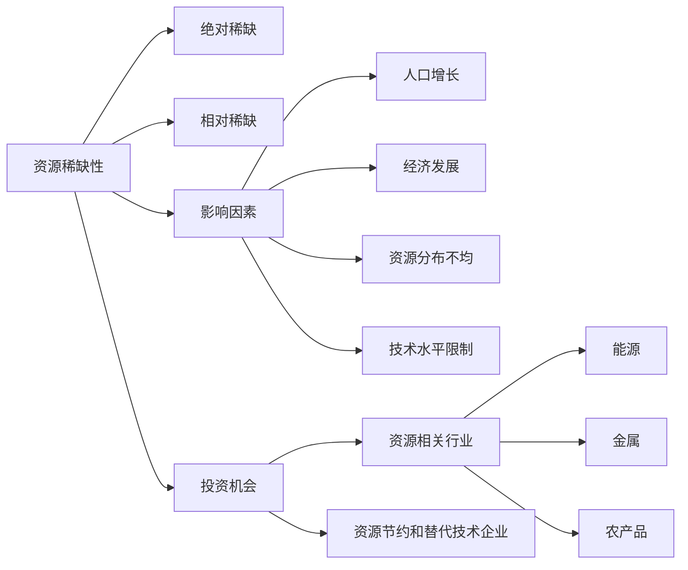

# 杰里米·格兰瑟姆的资源稀缺性投资机会

> 关键词：杰里米·格兰瑟姆、资源稀缺性、投资机会、可持续发展、大宗商品

> 摘要：本文围绕杰里米·格兰瑟姆所提出的资源稀缺性投资机会展开深入探讨。首先介绍了格兰瑟姆的投资理念及资源稀缺性概念提出的背景，剖析资源稀缺性的核心概念及其与投资的联系。接着阐述相关核心算法原理及操作步骤，运用数学模型和公式对资源稀缺性下的投资规律进行分析并举例说明。通过项目实战案例展示如何在实际中把握资源稀缺性投资机会，分析其在不同领域的实际应用场景。同时推荐了相关的学习资源、开发工具框架以及论文著作，最后总结资源稀缺性投资的未来发展趋势与挑战，解答常见问题，并提供扩展阅读和参考资料，旨在为投资者和相关研究人员提供全面且深入的指导。

## 1. 背景介绍 
### 1.1 目的和范围
本文章旨在全面剖析杰里米·格兰瑟姆所强调的资源稀缺性投资机会。通过深入研究格兰瑟姆的投资理论，结合实际案例和相关数据，为投资者揭示在资源稀缺背景下的潜在投资方向和策略。范围涵盖了各类稀缺资源，如能源、金属、农产品等，以及与之相关的行业和企业。同时，探讨资源稀缺性对全球经济和金融市场的影响，为投资者提供更广阔的视野和更深入的分析。

### 1.2 预期读者
本文的预期读者包括专业投资者、金融分析师、投资机构从业者、经济学研究人员以及对资源投资和可持续发展感兴趣的普通读者。无论是寻求投资机会的个人和机构，还是希望了解资源稀缺性相关理论和实践的专业人士，都能从本文中获得有价值的信息和启示。

### 1.3 文档结构概述
本文将按照以下结构展开：首先介绍核心概念与联系，明确资源稀缺性的定义和投资机会的内涵；接着阐述核心算法原理和具体操作步骤，运用 Python 代码进行详细说明；然后通过数学模型和公式对资源稀缺性投资进行量化分析，并举例说明；随后通过项目实战案例展示实际操作和代码解读；再分析资源稀缺性投资的实际应用场景；接着推荐相关的学习资源、开发工具框架和论文著作；最后总结未来发展趋势与挑战，解答常见问题，并提供扩展阅读和参考资料。

### 1.4 术语表
#### 1.4.1 核心术语定义
- **资源稀缺性**：指在一定的时间和空间范围内，自然资源的供给不能满足人类日益增长的需求，导致资源的相对不足。
- **投资机会**：指在市场中存在的、能够为投资者带来收益的投资项目或领域。
- **大宗商品**：指可进入流通领域，但非零售环节，具有商品属性并用于工农业生产与消费使用的大批量买卖的物质商品，如原油、金属、农产品等。

#### 1.4.2 相关概念解释
- **可持续发展**：指既满足当代人的需求，又不损害后代人满足其需求的能力的发展。在资源投资中，可持续发展要求投资者考虑资源的合理利用和环境保护。
- **周期性行业**：指行业的景气度与宏观经济周期密切相关的行业，如钢铁、煤炭、有色金属等。资源稀缺性会影响周期性行业的供需关系和价格波动。

#### 1.4.3 缩略词列表
- **GDP**：国内生产总值（Gross Domestic Product）
- **CPI**：消费者物价指数（Consumer Price Index）
- **ETF**：交易型开放式指数基金（Exchange Traded Fund）

## 2. 核心概念与联系 

### 2.1 杰里米·格兰瑟姆的投资理念
杰里米·格兰瑟姆是一位著名的投资策略师和慈善家，他以对市场泡沫的准确预测和对资源稀缺性的深刻洞察而闻名。格兰瑟姆认为，随着全球人口的增长和经济的发展，对自然资源的需求不断增加，而资源的供给是有限的，这将导致资源稀缺性问题日益突出。在这种背景下，投资者应该关注那些与稀缺资源相关的行业和企业，以获取长期的投资回报。

### 2.2 资源稀缺性的核心概念
资源稀缺性是指在一定的时间和空间范围内，自然资源的供给不能满足人类日益增长的需求，导致资源的相对不足。资源稀缺性可以分为绝对稀缺和相对稀缺。绝对稀缺是指资源的总量是有限的，随着人类的开发和利用，资源会逐渐耗尽；相对稀缺是指由于资源的分布不均、技术水平限制等原因，导致某些地区或某些行业的资源供给不足。

### 2.3 资源稀缺性与投资机会的联系
资源稀缺性与投资机会密切相关。当资源稀缺性问题日益突出时，资源的价格往往会上涨，从而为投资者带来投资机会。投资者可以通过投资与稀缺资源相关的行业和企业，如能源、金属、农产品等，来获取资源价格上涨带来的收益。此外，资源稀缺性还会促使企业加大对资源节约和替代技术的研发投入，从而为相关的科技企业带来发展机遇。

### 2.4 核心概念原理和架构的文本示意图
```plaintext
资源稀缺性
|-- 绝对稀缺
|-- 相对稀缺
|
|-- 影响因素
|   |-- 人口增长
|   |-- 经济发展
|   |-- 资源分布不均
|   |-- 技术水平限制
|
|-- 投资机会
|   |-- 资源相关行业
|   |   |-- 能源
|   |   |-- 金属
|   |   |-- 农产品
|   |-- 资源节约和替代技术企业
```

### 2.5 Mermaid 流程图


## 3. 核心算法原理 & 具体操作步骤 

### 3.1 核心算法原理
在资源稀缺性投资中，一个重要的算法原理是基于供需关系的价格预测模型。该模型认为，资源的价格受到供给和需求的影响，当供给小于需求时，价格会上涨；当供给大于需求时，价格会下跌。因此，通过分析资源的供给和需求情况，可以预测资源价格的走势，从而为投资决策提供依据。

### 3.2 具体操作步骤
#### 3.2.1 数据收集
收集与资源相关的历史数据，包括资源的产量、消费量、价格等。可以从政府部门、行业协会、市场研究机构等获取这些数据。

#### 3.2.2 数据预处理
对收集到的数据进行清洗、整理和分析，去除异常值和缺失值，计算相关的统计指标，如均值、标准差、增长率等。

#### 3.2.3 建立模型
根据供需关系的原理，建立资源价格预测模型。可以使用线性回归、时间序列分析、机器学习等方法来建立模型。

#### 3.2.4 模型训练和评估
使用历史数据对模型进行训练和评估，调整模型的参数，提高模型的预测精度。

#### 3.2.5 投资决策
根据模型的预测结果，制定投资策略，选择合适的投资标的和投资时机。

### 3.3 Python 源代码详细阐述
```python
import pandas as pd
import numpy as np
from sklearn.linear_model import LinearRegression
from sklearn.model_selection import train_test_split
from sklearn.metrics import mean_squared_error

# 数据收集和预处理
# 假设已经收集到了资源的产量、消费量和价格数据，并保存为 CSV 文件
data = pd.read_csv('resource_data.csv')
# 提取特征和目标变量
X = data[['production', 'consumption']]
y = data['price']

# 划分训练集和测试集
X_train, X_test, y_train, y_test = train_test_split(X, y, test_size=0.2, random_state=42)

# 建立线性回归模型
model = LinearRegression()

# 模型训练
model.fit(X_train, y_train)

# 模型预测
y_pred = model.predict(X_test)

# 模型评估
mse = mean_squared_error(y_test, y_pred)
rmse = np.sqrt(mse)
print(f"均方误差 (MSE): {mse}")
print(f"均方根误差 (RMSE): {rmse}")

# 根据模型预测结果进行投资决策
# 假设预测到资源价格将上涨，则可以考虑买入相关的投资标的
if model.predict([[X_test.iloc[0]['production'], X_test.iloc[0]['consumption']]]) > y_test.iloc[0]:
    print("预测价格上涨，建议买入相关投资标的")
else:
    print("预测价格下跌，建议卖出相关投资标的")
```

## 4. 数学模型和公式 & 详细讲解 & 举例说明 

### 4.1 供需关系模型
供需关系模型是资源稀缺性投资中最基本的数学模型之一。该模型认为，资源的价格 $P$ 是供给 $S$ 和需求 $D$ 的函数，可以表示为：

$$P = f(S, D)$$

一般来说，供给和需求与价格之间存在着反向关系，即供给增加会导致价格下降，需求增加会导致价格上涨。可以用以下公式来表示：

$$S = S_0 + \alpha P$$

$$D = D_0 - \beta P$$

其中，$S_0$ 和 $D_0$ 分别是供给和需求的初始值，$\alpha$ 和 $\beta$ 分别是供给和需求对价格的弹性系数。

当市场达到均衡时，供给等于需求，即 $S = D$。将上述公式代入均衡条件中，可以得到：

$$S_0 + \alpha P = D_0 - \beta P$$

解这个方程，可以得到均衡价格 $P^*$：

$$P^* = \frac{D_0 - S_0}{\alpha + \beta}$$

### 4.2 举例说明
假设某种资源的初始供给量 $S_0 = 100$，初始需求量 $D_0 = 200$，供给弹性系数 $\alpha = 2$，需求弹性系数 $\beta = 3$。将这些值代入均衡价格公式中，可以得到：

$$P^* = \frac{200 - 100}{2 + 3} = 20$$

这意味着在当前的供给和需求条件下，该资源的均衡价格为 20。如果供给量增加到 120，需求量不变，则新的均衡价格为：

$$P^* = \frac{200 - 120}{2 + 3} = 16$$

可以看到，供给量的增加导致了价格的下降。

### 4.3 时间序列模型
时间序列模型是另一种常用的资源价格预测模型。该模型认为，资源的价格具有一定的时间序列特征，可以通过分析历史价格数据来预测未来价格。常用的时间序列模型包括 ARIMA 模型、SARIMA 模型等。

以 ARIMA 模型为例，其数学表达式为：

$$\phi(B)(1 - B)^d y_t = \theta(B)\epsilon_t$$

其中，$\phi(B)$ 和 $\theta(B)$ 分别是自回归和移动平均算子，$B$ 是滞后算子，$d$ 是差分阶数，$y_t$ 是时间序列数据，$\epsilon_t$ 是白噪声序列。

### 4.4 举例说明
假设我们有某种资源的历史价格数据 $y_1, y_2, \cdots, y_n$，我们可以使用 Python 的 `statsmodels` 库来建立 ARIMA 模型并进行预测。

```python
import pandas as pd
from statsmodels.tsa.arima.model import ARIMA

# 假设已经收集到了资源的历史价格数据，并保存为 CSV 文件
data = pd.read_csv('resource_price.csv', index_col='date', parse_dates=True)

# 建立 ARIMA 模型
model = ARIMA(data['price'], order=(1, 1, 1))
model_fit = model.fit()

# 进行预测
forecast = model_fit.get_forecast(steps=10)
forecast_mean = forecast.predicted_mean
print(forecast_mean)
```

## 5. 项目实战：代码实际案例和详细解释说明 

### 5.1  开发环境搭建
#### 5.1.1 安装 Python
首先，需要安装 Python 环境。可以从 Python 官方网站（https://www.python.org/downloads/）下载适合自己操作系统的 Python 安装包，并按照安装向导进行安装。

#### 5.1.2 安装必要的库
在 Python 环境中，需要安装一些必要的库，如 `pandas`、`numpy`、`scikit-learn`、`statsmodels` 等。可以使用 `pip` 命令来安装这些库：

```sh
pip install pandas numpy scikit-learn statsmodels
```

### 5.2  源代码详细实现和代码解读
```python
import pandas as pd
import numpy as np
from sklearn.linear_model import LinearRegression
from sklearn.model_selection import train_test_split
from sklearn.metrics import mean_squared_error

# 数据收集和预处理
# 假设已经收集到了资源的产量、消费量和价格数据，并保存为 CSV 文件
data = pd.read_csv('resource_data.csv')
# 提取特征和目标变量
X = data[['production', 'consumption']]
y = data['price']

# 划分训练集和测试集
X_train, X_test, y_train, y_test = train_test_split(X, y, test_size=0.2, random_state=42)

# 建立线性回归模型
model = LinearRegression()

# 模型训练
model.fit(X_train, y_train)

# 模型预测
y_pred = model.predict(X_test)

# 模型评估
mse = mean_squared_error(y_test, y_pred)
rmse = np.sqrt(mse)
print(f"均方误差 (MSE): {mse}")
print(f"均方根误差 (RMSE): {rmse}")

# 根据模型预测结果进行投资决策
# 假设预测到资源价格将上涨，则可以考虑买入相关的投资标的
if model.predict([[X_test.iloc[0]['production'], X_test.iloc[0]['consumption']]]) > y_test.iloc[0]:
    print("预测价格上涨，建议买入相关投资标的")
else:
    print("预测价格下跌，建议卖出相关投资标的")
```

### 代码解读：
1. **数据收集和预处理**：使用 `pandas` 库读取保存有资源产量、消费量和价格数据的 CSV 文件，并提取特征变量 `X` 和目标变量 `y`。
2. **划分训练集和测试集**：使用 `sklearn` 库的 `train_test_split` 函数将数据集划分为训练集和测试集，其中测试集占比为 20%。
3. **建立线性回归模型**：使用 `sklearn` 库的 `LinearRegression` 类建立线性回归模型。
4. **模型训练**：使用训练集数据对模型进行训练。
5. **模型预测**：使用训练好的模型对测试集数据进行预测。
6. **模型评估**：使用 `sklearn` 库的 `mean_squared_error` 函数计算均方误差（MSE），并计算均方根误差（RMSE）。
7. **投资决策**：根据模型的预测结果，判断资源价格是否上涨，并给出相应的投资建议。

### 5.3  代码解读与分析
#### 5.3.1 优点
- **简单易懂**：线性回归模型是一种简单易懂的机器学习模型，容易实现和解释。
- **计算效率高**：线性回归模型的训练和预测速度较快，适合处理大规模数据集。
- **可解释性强**：线性回归模型的系数可以直观地反映特征变量对目标变量的影响程度，便于进行解释和分析。

#### 5.3.2 缺点
- **假设条件严格**：线性回归模型假设特征变量和目标变量之间存在线性关系，当数据不满足这个假设时，模型的预测效果可能会受到影响。
- **容易过拟合**：线性回归模型在处理复杂数据时容易过拟合，导致模型的泛化能力下降。

#### 5.3.3 改进建议
- **使用非线性模型**：当数据不满足线性关系时，可以考虑使用非线性模型，如决策树、神经网络等。
- **进行特征工程**：通过对特征变量进行变换、组合等操作，提高模型的表达能力。
- **使用正则化方法**：如 Lasso 回归、Ridge 回归等，可以防止模型过拟合，提高模型的泛化能力。

## 6. 实际应用场景 
### 6.1 能源领域
在能源领域，资源稀缺性主要体现在石油、天然气等化石能源的有限性上。随着全球经济的发展，对能源的需求不断增加，而化石能源的储量逐渐减少，这将导致能源价格的上涨。投资者可以通过投资石油、天然气等能源企业的股票、期货，或者投资可再生能源企业，如太阳能、风能等，来获取资源稀缺性带来的投资机会。

### 6.2 金属领域
金属领域的资源稀缺性主要体现在一些稀有金属和贵金属的供给不足上。例如，锂、钴等稀有金属是电动汽车电池的重要原材料，随着电动汽车市场的快速发展，对这些稀有金属的需求急剧增加，而其供给相对有限，这将导致稀有金属价格的上涨。投资者可以通过投资稀有金属矿业企业的股票、期货，或者投资相关的 ETF 来获取投资收益。

### 6.3 农产品领域
农产品领域的资源稀缺性主要体现在耕地资源的有限性和气候变化对农业生产的影响上。随着全球人口的增长和饮食结构的变化，对农产品的需求不断增加，而耕地资源的增长有限，同时气候变化也会导致农业生产的不稳定，这将导致农产品价格的波动。投资者可以通过投资农产品期货、农业企业的股票等方式来参与农产品市场的投资。

### 6.4 水资源领域
水资源是人类生存和发展的重要基础资源，但全球水资源分布不均，部分地区面临着水资源短缺的问题。随着人口增长和经济发展，对水资源的需求不断增加，水资源的稀缺性将日益突出。投资者可以通过投资水资源管理企业、污水处理企业等相关领域的股票，或者投资水资源相关的基础设施项目，来获取水资源稀缺性带来的投资机会。

## 7. 工具和资源推荐
### 7.1 学习资源推荐
#### 7.1.1 书籍推荐
- 《聪明的投资者》（The Intelligent Investor）：本杰明·格雷厄姆（Benjamin Graham）著，这本书是价值投资的经典之作，对投资者的投资理念和投资方法具有重要的指导意义。
- 《金融炼金术》（The Alchemy of Finance）：乔治·索罗斯（George Soros）著，书中介绍了索罗斯的投资哲学和投资策略，对理解金融市场的运行规律和投资机会具有重要的参考价值。
- 《资源诅咒：自然资源丰富国家的经济发展困境》（The Resource Curse: How Natural Resources Can Hinder Economic Development）：理查德·M·奥蒂（Richard M. Auty）著，该书深入探讨了资源丰富国家在经济发展过程中面临的问题和挑战，对理解资源稀缺性与经济发展的关系具有重要的启示作用。

#### 7.1.2 在线课程
- Coursera 上的“投资学原理”（Principles of Investing）课程：该课程由哥伦比亚大学教授授课，系统地介绍了投资学的基本原理和方法，包括资产定价、投资组合理论、风险管理等内容。
- edX 上的“金融市场”（Financial Markets）课程：该课程由耶鲁大学教授罗伯特·希勒（Robert Shiller）授课，深入分析了金融市场的运行机制和投资机会，对理解资源稀缺性投资具有重要的帮助。

#### 7.1.3 技术博客和网站
- Seeking Alpha：这是一个知名的金融投资博客网站，提供了大量的投资分析文章和研究报告，包括对资源稀缺性投资的分析和建议。
- Bloomberg：彭博社是全球著名的财经媒体，其网站提供了丰富的金融市场数据和新闻资讯，对投资者了解资源市场的动态和投资机会具有重要的参考价值。

### 7.2 开发工具框架推荐
#### 7.2.1 IDE和编辑器
- PyCharm：这是一款专门为 Python 开发设计的集成开发环境（IDE），具有强大的代码编辑、调试和项目管理功能，适合进行资源稀缺性投资相关的数据分析和模型开发。
- Jupyter Notebook：这是一个基于网页的交互式计算环境，支持多种编程语言，如 Python、R 等，适合进行数据探索、模型验证和结果展示。

#### 7.2.2 调试和性能分析工具
- IPython：这是一个增强版的 Python 交互式解释器，提供了丰富的调试和分析功能，如代码调试、性能分析等，有助于提高开发效率和代码质量。
- cProfile：这是 Python 标准库中的一个性能分析工具，可以帮助开发者找出代码中的性能瓶颈，优化代码性能。

#### 7.2.3 相关框架和库
- pandas：这是一个强大的数据分析库，提供了丰富的数据结构和数据处理功能，适合进行资源数据的清洗、整理和分析。
- numpy：这是一个用于科学计算的 Python 库，提供了高效的数组操作和数学函数，是进行资源稀缺性投资模型开发的基础库之一。
- scikit-learn：这是一个常用的机器学习库，提供了丰富的机器学习算法和工具，如线性回归、决策树、神经网络等，适合进行资源价格预测和投资决策模型的开发。

### 7.3 相关论文著作推荐
#### 7.3.1 经典论文
- "The Limits to Growth"（《增长的极限》）：这是罗马俱乐部于 1972 年发表的一份研究报告，该报告通过系统动力学模型分析了人口增长、资源消耗、环境污染等因素对全球经济增长的影响，提出了资源稀缺性将对人类社会发展构成重大挑战的观点。
- "Hotelling's Rule"（《霍特林法则》）：由哈罗德·霍特林（Harold Hotelling）于 1931 年提出，该法则认为，在完全竞争市场条件下，不可再生资源的价格应该随着时间的推移而以等于利率的速度上涨。

#### 7.3.2 最新研究成果
- 近年来，关于资源稀缺性投资的研究主要集中在可持续发展、绿色金融、资源定价机制等方面。可以通过学术数据库，如 IEEE Xplore、ACM Digital Library、ScienceDirect 等，搜索相关的研究论文。

#### 7.3.3 应用案例分析
- 一些国际金融机构和研究机构会发布关于资源稀缺性投资的应用案例分析报告，如世界银行、国际货币基金组织（IMF）等。这些报告可以帮助投资者了解实际投资项目中的经验和教训，为自己的投资决策提供参考。

## 8. 总结：未来发展趋势与挑战
### 8.1 未来发展趋势
#### 8.1.1 资源价格上涨
随着全球人口的增长和经济的发展，对自然资源的需求将继续增加，而资源的供给是有限的，这将导致资源价格的长期上涨趋势。投资者可以通过投资与稀缺资源相关的行业和企业，获取资源价格上涨带来的收益。

#### 8.1.2 可持续发展投资增加
资源稀缺性问题的日益突出，将促使投资者更加关注可持续发展投资。投资者将倾向于投资那些注重资源节约和环境保护的企业，以及可再生能源、水资源管理等领域的项目。

#### 8.1.3 技术创新推动投资机会
技术创新将在资源稀缺性背景下发挥重要作用。例如，新能源技术、资源回收利用技术、智能农业技术等的发展，将为投资者带来新的投资机会。投资者可以关注那些在技术创新方面具有优势的企业。

### 8.2 挑战
#### 8.2.1 市场不确定性
资源市场受到多种因素的影响，如政治、经济、自然等，市场不确定性较大。投资者需要具备较强的风险意识和风险管理能力，以应对市场的波动。

#### 8.2.2 政策风险
政府的政策对资源市场和资源投资具有重要的影响。政策的变化可能导致资源价格的波动和投资机会的变化。投资者需要密切关注政策动态，及时调整投资策略。

#### 8.2.3 技术风险
在资源节约和替代技术领域，技术创新具有较高的风险。新技术的研发和应用可能面临技术难题、成本过高、市场接受度低等问题。投资者需要对技术风险进行充分的评估和管理。

## 9. 附录：常见问题与解答
### 9.1 资源稀缺性投资是否适合所有投资者？
资源稀缺性投资具有一定的风险和专业性，并不适合所有投资者。对于普通投资者来说，如果缺乏相关的知识和经验，建议通过投资基金等间接方式参与资源稀缺性投资。而对于专业投资者来说，可以根据自己的风险承受能力和投资目标，选择合适的投资标的和投资策略。

### 9.2 如何评估资源稀缺性投资的风险？
评估资源稀缺性投资的风险可以从以下几个方面入手：
- **市场风险**：分析资源市场的供需关系、价格波动情况等。
- **政策风险**：关注政府的相关政策，如资源税、环保政策等。
- **技术风险**：评估资源节约和替代技术的发展前景和应用风险。
- **企业风险**：分析投资企业的财务状况、经营管理能力等。

### 9.3 资源稀缺性投资的长期收益如何？
资源稀缺性投资的长期收益受到多种因素的影响，如资源价格的走势、企业的经营业绩等。从长期来看，随着资源稀缺性问题的日益突出，资源价格有望上涨，从而为投资者带来一定的收益。但投资者需要注意市场风险和投资时机的选择，以获取更好的投资回报。

## 10. 扩展阅读 & 参考资料
### 10.1 扩展阅读
- 《资本论》（Das Kapital）：卡尔·马克思（Karl Marx）著，该书对资本主义经济的运行规律进行了深入的分析，对理解资源稀缺性与经济发展的关系具有重要的理论价值。
- 《创新者的窘境》（The Innovator's Dilemma）：克莱顿·克里斯坦森（Clayton Christensen）著，书中介绍了创新对企业和行业的影响，对投资者关注资源节约和替代技术领域的投资机会具有重要的启示作用。

### 10.2 参考资料
- 杰里米·格兰瑟姆的相关著作和演讲：可以通过其官方网站、金融媒体等渠道获取。
- 相关的财经新闻和研究报告：如《华尔街日报》、《金融时报》、《经济学人》等。
- 学术研究论文：可以通过学术数据库，如 IEEE Xplore、ACM Digital Library、ScienceDirect 等进行搜索。

作者：AI天才研究院/AI Genius Institute & 禅与计算机程序设计艺术 /Zen And The Art of Computer Programming