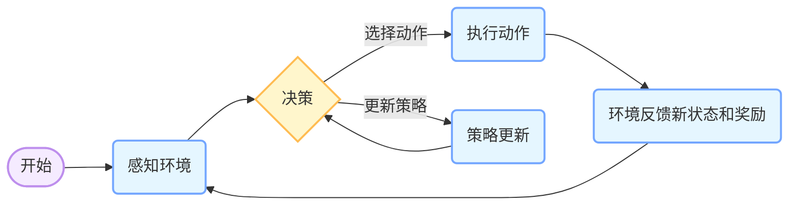

# 构建AI Agent常见挑战及解决方案

> 关键词：AI Agent、构建挑战、解决方案、人工智能、智能体架构

> 摘要：本文围绕构建AI Agent过程中面临的常见挑战展开深入探讨，并详细阐述对应的解决方案。首先介绍了构建AI Agent的背景信息，包括目的范围、预期读者等内容。接着阐述了AI Agent的核心概念与联系，通过文本示意图和Mermaid流程图清晰展示其原理和架构。在核心算法原理部分，使用Python代码进行详细说明。同时给出了相关的数学模型和公式，并结合实际例子进行讲解。通过项目实战案例，展示了代码的实现和解读过程。还分析了AI Agent的实际应用场景，推荐了学习资源、开发工具框架以及相关论文著作。最后总结了AI Agent未来的发展趋势与挑战，提供了常见问题解答和扩展阅读参考资料，旨在为相关从业者和研究者提供全面且深入的技术指导。

## 1. 背景介绍 
### 1.1 目的和范围
构建AI Agent的目的在于创建能够自主感知环境、进行决策并采取行动以实现特定目标的智能实体。这些智能体可以应用于多个领域，如游戏、机器人控制、自动化系统、智能客服等。本文章的范围将聚焦于构建AI Agent过程中遇到的常见挑战，涵盖技术层面（如算法设计、环境交互）、性能层面（如效率、稳定性）、安全层面（如数据隐私、鲁棒性）等多个方面，并针对这些挑战提供切实可行的解决方案。

### 1.2 预期读者
本文的预期读者包括人工智能领域的研究人员、开发者、软件工程师、对AI Agent技术感兴趣的学生以及相关行业的从业者。这些读者可能希望深入了解构建AI Agent的技术细节，掌握应对常见挑战的方法，或者在实际项目中应用相关的解决方案。

### 1.3 文档结构概述
本文将按照以下结构进行组织：首先介绍核心概念与联系，帮助读者建立对AI Agent的基本认识；接着阐述核心算法原理和具体操作步骤，通过Python代码进行详细说明；然后介绍相关的数学模型和公式，并举例说明其应用；之后通过项目实战展示代码的实际实现和解读；再分析AI Agent的实际应用场景；随后推荐学习资源、开发工具框架以及相关论文著作；最后总结未来发展趋势与挑战，提供常见问题解答和扩展阅读参考资料。

### 1.4 术语表
#### 1.4.1 核心术语定义
- **AI Agent（人工智能智能体）**：能够感知环境、根据感知信息进行决策并采取行动以实现特定目标的智能实体。
- **环境（Environment）**：AI Agent所处的外部世界，是其感知和行动的对象。
- **状态（State）**：环境在某一时刻的描述，AI Agent根据状态进行决策。
- **动作（Action）**：AI Agent在环境中可以执行的操作。
- **奖励（Reward）**：环境给予AI Agent的反馈，用于评估其行动的好坏。

#### 1.4.2 相关概念解释
- **强化学习（Reinforcement Learning）**：一种机器学习方法，AI Agent通过与环境进行交互，根据奖励信号不断调整自己的策略，以最大化长期累积奖励。
- **深度学习（Deep Learning）**：基于神经网络的机器学习技术，能够自动从大量数据中学习特征和模式，常用于处理复杂的感知和决策任务。
- **多智能体系统（Multi - Agent System）**：由多个AI Agent组成的系统，这些智能体之间可以进行交互和协作，以实现共同或各自的目标。

#### 1.4.3 缩略词列表
- **RL（Reinforcement Learning）**：强化学习
- **DL（Deep Learning）**：深度学习
- **MDP（Markov Decision Process）**：马尔可夫决策过程
- **Q - learning**：一种基于值函数的强化学习算法

## 2. 核心概念与联系 
### 核心概念原理
AI Agent的核心原理基于感知 - 决策 - 行动的循环。AI Agent通过传感器感知环境的状态，然后根据自身的策略对感知到的状态进行分析和决策，选择合适的动作执行，最后将动作作用于环境，环境会产生新的状态和奖励反馈给AI Agent。这个过程不断循环，AI Agent通过学习奖励信号来优化自己的策略，以更好地适应环境并实现目标。

### 架构的文本示意图
AI Agent的架构可以用以下文本描述：
AI Agent由感知模块、决策模块和行动模块组成。感知模块负责收集环境信息，将其转化为内部可处理的状态表示。决策模块根据感知到的状态，依据预设的策略或通过学习算法计算出最优的动作。行动模块将决策模块输出的动作作用于环境。同时，环境会返回新的状态和奖励给感知模块和决策模块，用于更新策略和评估行动效果。

### Mermaid流程图


这个流程图展示了AI Agent的基本工作流程。从开始节点出发，AI Agent首先感知环境，然后进行决策，选择合适的动作执行。执行动作后，环境会反馈新的状态和奖励，AI Agent根据这些反馈更新策略，然后再次进入感知环境的循环。

## 3. 核心算法原理 & 具体操作步骤 
### 强化学习算法原理
强化学习是构建AI Agent常用的算法之一，其核心思想是让AI Agent通过与环境进行交互，不断尝试不同的动作，根据环境给予的奖励信号来学习最优的策略。以Q - learning算法为例，其目标是学习一个Q值函数 $Q(s, a)$，表示在状态 $s$ 下执行动作 $a$ 的预期累积奖励。

### Q - learning算法的Python代码实现
```python
import numpy as np

# 定义环境参数
num_states = 5
num_actions = 2
gamma = 0.9  # 折扣因子
alpha = 0.1  # 学习率

# 初始化Q表
Q = np.zeros((num_states, num_actions))

# 定义环境反馈函数
def get_reward(state, action):
    # 简单示例，根据状态和动作返回奖励
    if state == 2 and action == 1:
        return 1
    return 0

# 定义环境状态转移函数
def get_next_state(state, action):
    # 简单示例，根据状态和动作转移到下一个状态
    if action == 0:
        return (state - 1) % num_states
    return (state + 1) % num_states

# Q - learning算法
def q_learning(num_episodes):
    for episode in range(num_episodes):
        state = np.random.randint(0, num_states)  # 随机初始化状态
        done = False
        while not done:
            # 选择动作（使用ε - 贪心策略）
            epsilon = 0.1
            if np.random.uniform(0, 1) < epsilon:
                action = np.random.randint(0, num_actions)
            else:
                action = np.argmax(Q[state, :])

            # 执行动作，获取奖励和下一个状态
            reward = get_reward(state, action)
            next_state = get_next_state(state, action)

            # 更新Q表
            Q[state, action] = Q[state, action] + alpha * (reward + gamma * np.max(Q[next_state, :]) - Q[state, action])

            state = next_state

            # 判断是否结束
            if reward == 1:
                done = True

    return Q

# 训练Q - learning算法
Q = q_learning(1000)
print("最终的Q表：")
print(Q)
```
### 具体操作步骤
1. **初始化**：初始化Q表 $Q(s, a)$ 为全零矩阵，设置折扣因子 $\gamma$ 和学习率 $\alpha$。
2. **环境交互**：在每个训练周期（episode）中，随机初始化状态 $s$。
3. **动作选择**：使用 $\epsilon$ - 贪心策略选择动作 $a$。以概率 $\epsilon$ 随机选择动作，以概率 $1 - \epsilon$ 选择Q值最大的动作。
4. **执行动作**：执行选择的动作 $a$，获取环境反馈的奖励 $r$ 和下一个状态 $s'$。
5. **Q表更新**：根据Q - learning更新公式 $Q(s, a) = Q(s, a)+\alpha\left[r+\gamma\max_{a'}Q(s', a') - Q(s, a)\right]$ 更新Q表。
6. **状态转移**：将下一个状态 $s'$ 作为当前状态，重复步骤3 - 5，直到达到终止条件（如获得奖励）。
7. **训练结束**：重复多个训练周期，直到Q表收敛或达到预设的训练次数。

## 4. 数学模型和公式 & 详细讲解 & 举例说明 
### 马尔可夫决策过程（MDP）
马尔可夫决策过程是强化学习的基础数学模型，它由一个四元组 $(S, A, P, R)$ 定义：
- $S$ 是有限的状态集合。
- $A$ 是有限的动作集合。
- $P(s'|s, a)$ 是状态转移概率，表示在状态 $s$ 下执行动作 $a$ 后转移到状态 $s'$ 的概率。
- $R(s, a, s')$ 是奖励函数，表示在状态 $s$ 下执行动作 $a$ 并转移到状态 $s'$ 时获得的奖励。

### 价值函数
在MDP中，有两种重要的价值函数：
- **状态价值函数 $V^{\pi}(s)$**：表示在策略 $\pi$ 下，从状态 $s$ 开始的预期累积奖励，定义为：
$$V^{\pi}(s)=\mathbb{E}_{\pi}\left[\sum_{t = 0}^{\infty}\gamma^{t}R_{t + 1}|S_{0}=s\right]$$
其中，$\gamma\in[0, 1]$ 是折扣因子，用于平衡即时奖励和未来奖励；$R_{t+1}$ 是在时间步 $t + 1$ 获得的奖励；$S_0$ 是初始状态。

- **动作价值函数 $Q^{\pi}(s, a)$**：表示在策略 $\pi$ 下，从状态 $s$ 执行动作 $a$ 后，再继续遵循策略 $\pi$ 的预期累积奖励，定义为：
$$Q^{\pi}(s, a)=\mathbb{E}_{\pi}\left[\sum_{t = 0}^{\infty}\gamma^{t}R_{t + 1}|S_{0}=s, A_{0}=a\right]$$

### Q - learning更新公式
Q - learning算法的核心是更新Q值函数，其更新公式为：
$$Q(s, a)=Q(s, a)+\alpha\left[r+\gamma\max_{a'}Q(s', a') - Q(s, a)\right]$$
其中，$\alpha$ 是学习率，控制每次更新的步长；$r$ 是执行动作 $a$ 后获得的即时奖励；$s'$ 是执行动作 $a$ 后转移到的下一个状态；$\max_{a'}Q(s', a')$ 表示在下一个状态 $s'$ 下选择最优动作的Q值。

### 举例说明
假设有一个简单的网格世界环境，AI Agent需要从起点移动到终点。状态 $s$ 表示AI Agent在网格中的位置，动作 $a$ 包括上下左右四个方向的移动。奖励函数定义为：到达终点获得奖励1，其他情况奖励为0。

初始时，Q表 $Q(s, a)$ 全为零。AI Agent在状态 $s$ 下选择动作 $a$ 向右移动，到达下一个状态 $s'$，获得奖励 $r = 0$。假设当前Q表中 $Q(s, a)=0$，$\max_{a'}Q(s', a') = 0$，学习率 $\alpha = 0.1$，折扣因子 $\gamma = 0.9$。根据Q - learning更新公式，更新后的Q值为：
$$Q(s, a)=0+0.1\times(0 + 0.9\times0 - 0)=0$$

随着不断的交互和学习，Q表会逐渐收敛到最优值，AI Agent可以根据Q表选择最优的动作来到达终点。

## 5. 项目实战：代码实际案例和详细解释说明 
### 5.1  开发环境搭建
#### 操作系统
可以选择Windows、Linux（如Ubuntu）或macOS作为开发操作系统。

#### 编程语言和库
- **Python**：选择Python 3.x版本，Python是构建AI Agent常用的编程语言，具有丰富的科学计算和机器学习库。
- **NumPy**：用于数值计算和数组操作。
- **OpenAI Gym**：一个开源的强化学习环境库，提供了多种不同类型的环境供开发和测试使用。

#### 安装步骤
1. 安装Python：从Python官方网站（https://www.python.org/downloads/）下载并安装Python 3.x版本。
2. 安装NumPy：使用pip命令安装NumPy，在命令行中输入 `pip install numpy`。
3. 安装OpenAI Gym：使用pip命令安装OpenAI Gym，在命令行中输入 `pip install gym`。

### 5.2  源代码详细实现和代码解读
#### 使用OpenAI Gym的CartPole环境进行Q - learning训练
```python
import gym
import numpy as np

# 初始化环境
env = gym.make('CartPole-v1')

# 定义参数
num_states = 4  # CartPole环境的状态维度
num_actions = env.action_space.n  # 动作空间大小
gamma = 0.99  # 折扣因子
alpha = 0.1  # 学习率
epsilon = 0.1  # 探索率
num_episodes = 1000  # 训练周期数

# 初始化Q表
Q = np.zeros((num_states, num_actions))

# 定义Q - learning算法
def q_learning(env, Q, num_episodes, gamma, alpha, epsilon):
    for episode in range(num_episodes):
        state = env.reset()
        done = False
        while not done:
            # 选择动作（使用ε - 贪心策略）
            if np.random.uniform(0, 1) < epsilon:
                action = env.action_space.sample()
            else:
                action = np.argmax(Q[state, :])

            # 执行动作，获取奖励和下一个状态
            next_state, reward, done, _ = env.step(action)

            # 更新Q表
            Q[state, action] = Q[state, action] + alpha * (reward + gamma * np.max(Q[next_state, :]) - Q[state, action])

            state = next_state

    return Q

# 训练Q - learning算法
Q = q_learning(env, Q, num_episodes, gamma, alpha, epsilon)

# 测试训练好的Q表
state = env.reset()
done = False
total_reward = 0
while not done:
    action = np.argmax(Q[state, :])
    next_state, reward, done, _ = env.step(action)
    total_reward += reward
    state = next_state

print("测试总奖励：", total_reward)

# 关闭环境
env.close()
```
#### 代码解读
1. **环境初始化**：使用 `gym.make('CartPole-v1')` 初始化OpenAI Gym的CartPole环境。
2. **参数定义**：定义状态维度、动作空间大小、折扣因子、学习率、探索率和训练周期数等参数。
3. **Q表初始化**：初始化Q表为全零矩阵。
4. **Q - learning算法实现**：在每个训练周期中，使用 $\epsilon$ - 贪心策略选择动作，执行动作后获取奖励和下一个状态，根据Q - learning更新公式更新Q表。
5. **测试训练好的Q表**：使用训练好的Q表选择动作，在环境中进行测试，记录总奖励。
6. **关闭环境**：测试结束后，关闭环境。

### 5.3  代码解读与分析
#### 优点
- **简单易懂**：Q - learning算法的实现相对简单，易于理解和调试。
- **通用性**：可以应用于多种不同类型的环境，只需要调整状态和动作的定义。

#### 缺点
- **高维状态处理困难**：对于高维状态空间，Q表的规模会非常大，导致存储和计算开销增加。
- **收敛速度慢**：在复杂环境中，Q - learning算法的收敛速度可能较慢，需要大量的训练周期。

#### 改进方向
- **使用函数逼近**：可以使用神经网络等函数逼近器来代替Q表，处理高维状态空间。
- **探索策略优化**：采用更复杂的探索策略，如UCB（Upper Confidence Bound）算法，提高探索效率。

## 6. 实际应用场景 
### 游戏领域
在游戏中，AI Agent可以作为游戏角色的智能控制者。例如，在围棋、象棋等棋类游戏中，AI Agent可以通过学习大量的棋局数据，掌握最优的下棋策略，与人类玩家进行对战。在电子竞技游戏中，AI Agent可以控制游戏角色进行战斗、资源管理等操作，提高游戏的竞技性和趣味性。

### 机器人控制
在机器人领域，AI Agent可以用于机器人的自主导航和任务执行。例如，在室内环境中，机器人可以通过感知周围环境的信息（如激光雷达、摄像头），使用AI Agent算法规划最优的路径，避开障碍物，到达目标位置。在工业生产中，机器人可以根据生产任务的要求，自主调整操作动作，提高生产效率和质量。

### 智能客服
在智能客服系统中，AI Agent可以根据用户的提问，自动理解问题的意图，从知识库中检索相关的答案，并以自然语言的形式回复用户。通过不断学习用户的提问和反馈，AI Agent可以逐渐提高回答的准确性和效率，提供更好的客户服务体验。

### 自动化系统
在自动化系统中，AI Agent可以用于系统的监控和决策。例如，在电力系统中，AI Agent可以实时监测电网的运行状态，根据负荷需求和发电情况，自动调整电力分配策略，提高电网的稳定性和效率。在交通系统中，AI Agent可以控制交通信号灯的时间，优化交通流量，减少拥堵。

## 7. 工具和资源推荐
### 7.1 学习资源推荐
#### 7.1.1 书籍推荐
- 《Reinforcement Learning: An Introduction》（《强化学习：原理与Python实现》）：这是一本强化学习领域的经典教材，详细介绍了强化学习的基本概念、算法和应用，适合初学者和有一定基础的读者。
- 《Artificial Intelligence: A Modern Approach》（《人工智能：一种现代的方法》）：全面介绍了人工智能的各个领域，包括搜索算法、机器学习、知识表示等，是人工智能领域的权威教材。

#### 7.1.2 在线课程
- Coursera上的“Reinforcement Learning Specialization”：由知名教授授课，系统介绍了强化学习的理论和实践，包括Q - learning、策略梯度算法等。
- edX上的“Introduction to Artificial Intelligence”：提供了人工智能的入门知识，包括搜索、推理、学习等方面的内容。

#### 7.1.3 技术博客和网站
- OpenAI博客（https://openai.com/blog/）：OpenAI团队发布的最新研究成果和技术文章，涵盖了人工智能的多个领域。
- Medium上的AI相关博客：有许多人工智能领域的专家和从业者分享的技术文章和经验。

### 7.2 开发工具框架推荐
#### 7.2.1 IDE和编辑器
- PyCharm：一款专业的Python集成开发环境，提供了代码编辑、调试、版本控制等功能，适合Python开发。
- Jupyter Notebook：一个交互式的开发环境，支持Python、R等多种编程语言，方便进行数据分析和模型训练。

#### 7.2.2 调试和性能分析工具
- TensorBoard：TensorFlow的可视化工具，可以用于监控模型的训练过程，分析模型的性能指标。
- Py-Spy：一个Python性能分析工具，可以实时监测Python程序的CPU使用率和函数调用情况。

#### 7.2.3 相关框架和库
- TensorFlow：一个开源的机器学习框架，提供了丰富的深度学习模型和工具，支持分布式训练。
- PyTorch：另一个流行的深度学习框架，具有动态图的优势，易于使用和调试。
- Stable Baselines3：一个基于PyTorch的强化学习库，提供了多种强化学习算法的实现，方便快速开发和测试。

### 7.3 相关论文著作推荐
#### 7.3.1 经典论文
- “Q - learning”：Watkins和Dayan在1992年发表的论文，首次提出了Q - learning算法，是强化学习领域的经典之作。
- “Human - Level Control through Deep Reinforcement Learning”：DeepMind团队在2015年发表的论文，介绍了使用深度Q网络（DQN）在Atari游戏上取得人类水平的控制效果。

#### 7.3.2 最新研究成果
- 关注NeurIPS（神经信息处理系统大会）、ICML（国际机器学习会议）等顶级学术会议上的最新研究成果，了解AI Agent领域的前沿技术。
- 在arXiv（https://arxiv.org/）上搜索相关的预印本论文，获取最新的研究进展。

#### 7.3.3 应用案例分析
- 阅读工业界的技术博客和案例分享，了解AI Agent在实际项目中的应用和解决方案。例如，Google、Facebook等公司的技术博客会分享他们在人工智能领域的实践经验。

## 8. 总结：未来发展趋势与挑战
### 未来发展趋势
- **多智能体协作**：未来的AI Agent系统将更多地涉及多个智能体之间的协作和交互，以实现更复杂的任务。例如，在自动驾驶领域，多辆自动驾驶汽车之间需要进行协作，以提高交通效率和安全性。
- **结合知识图谱**：将知识图谱与AI Agent相结合，可以使智能体更好地理解和处理语义信息，提高决策的准确性和可解释性。
- **自适应学习**：AI Agent将具备更强的自适应学习能力，能够在不同的环境和任务中快速调整自己的策略，提高泛化能力。

### 挑战
- **数据隐私和安全**：随着AI Agent在各个领域的广泛应用，数据隐私和安全问题变得越来越重要。智能体在与环境交互过程中会收集大量的数据，如何保护这些数据的隐私和安全是一个亟待解决的问题。
- **可解释性**：目前的AI Agent大多基于深度学习等黑盒模型，其决策过程难以解释。在一些关键领域（如医疗、金融），需要智能体能够提供可解释的决策依据，以提高用户的信任度。
- **计算资源需求**：构建和训练复杂的AI Agent需要大量的计算资源，如GPU、TPU等。如何降低计算资源的需求，提高算法的效率，是未来发展的一个挑战。

## 9. 附录：常见问题与解答
### 问题1：Q - learning算法一定能收敛到最优策略吗？
解答：在满足一定条件下，Q - learning算法可以收敛到最优策略。这些条件包括状态和动作空间是有限的、学习率 $\alpha$ 满足一定的衰减条件等。但在实际应用中，由于环境的复杂性和数据的有限性，可能无法完全满足这些条件，导致收敛速度较慢或无法收敛到最优策略。

### 问题2：如何选择合适的折扣因子 $\gamma$？
解答：折扣因子 $\gamma$ 用于平衡即时奖励和未来奖励。当 $\gamma$ 接近1时，智能体更注重未来的长期奖励；当 $\gamma$ 接近0时，智能体更注重即时奖励。一般来说，可以通过实验来选择合适的 $\gamma$ 值，根据具体的任务和环境特点进行调整。

### 问题3：如何处理高维状态空间？
解答：对于高维状态空间，可以使用函数逼近器（如神经网络）来代替Q表。通过神经网络学习状态和动作之间的映射关系，可以减少存储和计算开销。常见的方法包括深度Q网络（DQN）、策略梯度算法等。

### 问题4：如何评估AI Agent的性能？
解答：可以使用多种指标来评估AI Agent的性能，如累积奖励、成功率、平均步数等。在不同的应用场景中，选择合适的评估指标非常重要。例如，在游戏中可以使用胜率作为评估指标；在机器人导航任务中可以使用到达目标的平均时间作为评估指标。

## 10. 扩展阅读 & 参考资料
### 扩展阅读
- 《Deep Reinforcement Learning Hands-On》（《深度强化学习实战》）：深入介绍了深度强化学习的算法和实践，包括DQN、A3C等算法的实现。
- 《Probabilistic Robotics》（《概率机器人学》）：介绍了机器人领域中基于概率模型的方法，对于理解机器人的感知和决策有很大帮助。

### 参考资料
- Sutton, R. S., & Barto, A. G. (2018). Reinforcement Learning: An Introduction. MIT press.
- McCarthy, J. (2007). What Is Artificial Intelligence?. Stanford Artificial Intelligence Laboratory.
- Mnih, V., et al. (2015). Human - Level Control through Deep Reinforcement Learning. Nature.

作者：AI天才研究院/AI Genius Institute & 禅与计算机程序设计艺术 /Zen And The Art of Computer Programming