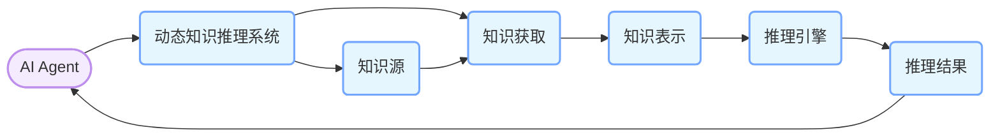

# 构建AI Agent的动态知识推理系统

> 关键词：AI Agent、动态知识推理系统、知识表示、推理算法、应用场景

> 摘要：本文围绕构建AI Agent的动态知识推理系统展开，详细介绍了该系统的背景、核心概念、算法原理、数学模型、项目实战、实际应用场景等内容。旨在帮助读者深入理解动态知识推理系统的构建方法和技术要点，为相关领域的研究和开发提供有价值的参考。通过对系统的全面剖析，阐述了其在未来AI发展中的重要性以及面临的挑战和发展趋势。

## 1. 背景介绍 
### 1.1 目的和范围
随着人工智能技术的不断发展，AI Agent在各个领域的应用越来越广泛。然而，传统的AI Agent往往缺乏动态知识推理的能力，难以适应复杂多变的环境。构建AI Agent的动态知识推理系统的目的在于赋予AI Agent更强的智能，使其能够根据实时变化的知识和环境信息进行高效准确的推理。

本文章的范围涵盖了动态知识推理系统的核心概念、算法原理、数学模型、项目实战以及实际应用场景等方面，旨在为读者提供一个全面的技术指南，帮助他们理解和构建这样的系统。

### 1.2 预期读者
本文预期读者包括人工智能领域的研究人员、程序员、软件架构师、对AI Agent和知识推理感兴趣的技术爱好者等。无论你是初学者想要了解动态知识推理系统的基本原理，还是有一定经验的专业人士希望深入研究相关技术，本文都将为你提供有价值的信息。

### 1.3 文档结构概述
本文将按照以下结构进行组织：首先介绍核心概念与联系，包括相关概念的原理和架构，并通过文本示意图和Mermaid流程图进行展示；接着阐述核心算法原理和具体操作步骤，使用Python源代码详细说明；然后讲解数学模型和公式，并给出具体的举例；之后通过项目实战，介绍开发环境搭建、源代码实现和代码解读；再介绍实际应用场景；随后推荐相关的工具和资源；最后进行总结，分析未来发展趋势与挑战，并提供常见问题与解答以及扩展阅读和参考资料。

### 1.4 术语表
#### 1.4.1 核心术语定义
- **AI Agent**：能够感知环境、做出决策并采取行动以实现特定目标的智能实体。
- **动态知识推理系统**：一种可以处理实时变化的知识，并根据这些知识进行推理的系统。
- **知识表示**：将知识以计算机能够理解和处理的方式进行表达。
- **推理算法**：用于从已知知识中推导出新的知识的算法。

#### 1.4.2 相关概念解释
- **知识图谱**：一种以图的形式表示知识的方法，节点表示实体，边表示实体之间的关系。
- **本体论**：对概念和关系的形式化描述，用于定义知识的结构和语义。
- **规则引擎**：根据预定义的规则对知识进行推理和决策的系统。

#### 1.4.3 缩略词列表
- **AI**：Artificial Intelligence（人工智能）
- **RDF**：Resource Description Framework（资源描述框架）
- **OWL**：Web Ontology Language（网络本体语言）

## 2. 核心概念与联系 

### 核心概念原理
#### AI Agent
AI Agent是一个自主的实体，它能够感知周围环境的信息，根据这些信息做出决策，并采取相应的行动。例如，在一个智能家居系统中，AI Agent可以感知房间的温度、湿度等信息，根据用户的设定和当前环境条件，决定是否打开空调或加湿器。

#### 动态知识推理系统
动态知识推理系统的核心在于能够处理动态变化的知识。知识可以随着时间、环境的变化而更新，系统需要能够实时地获取这些新知识，并利用已有的知识和推理算法进行推理。例如，在股票市场预测中，市场信息不断变化，动态知识推理系统需要实时获取最新的股票价格、公司财报等信息，并进行分析和推理，以预测股票的走势。

#### 知识表示
知识表示是将知识以计算机能够理解和处理的方式进行表达。常见的知识表示方法包括谓词逻辑、产生式规则、语义网络、知识图谱等。例如，在知识图谱中，我们可以用节点表示实体（如人物、公司等），用边表示实体之间的关系（如“工作于”、“投资于”等）。

### 架构的文本示意图
```plaintext
+---------------------+
|      AI Agent       |
| +-----------------+ |
| | 感知模块       | |
| +-----------------+ |
| | 决策模块       | |
| +-----------------+ |
| | 行动模块       | |
| +-----------------+ |
+---------------------+
          |
          v
+---------------------+
| 动态知识推理系统   |
| +-----------------+ |
| | 知识获取模块   | |
| +-----------------+ |
| | 知识表示模块   | |
| +-----------------+ |
| | 推理引擎模块   | |
| +-----------------+ |
+---------------------+
          |
          v
+---------------------+
| 知识源             |
| +-----------------+ |
| | 数据库         | |
| +-----------------+ |
| | 网络数据       | |
| +-----------------+ |
| | 传感器数据     | |
| +-----------------+ |
+---------------------+
```

### Mermaid流程图


## 3. 核心算法原理 & 具体操作步骤 

### 算法原理
我们可以使用基于规则的推理算法来实现动态知识推理。基于规则的推理算法是根据预定义的规则对知识进行推理的方法。规则通常由条件和结论两部分组成，当条件满足时，就可以得出相应的结论。

### Python源代码实现
```python
# 定义规则类
class Rule:
    def __init__(self, conditions, conclusion):
        self.conditions = conditions
        self.conclusion = conclusion

    def evaluate(self, facts):
        for condition in self.conditions:
            if condition not in facts:
                return False
        return True

# 定义推理引擎类
class InferenceEngine:
    def __init__(self, rules):
        self.rules = rules

    def infer(self, facts):
        new_facts = set(facts)
        while True:
            added = False
            for rule in self.rules:
                if rule.evaluate(new_facts) and rule.conclusion not in new_facts:
                    new_facts.add(rule.conclusion)
                    added = True
            if not added:
                break
        return new_facts

# 示例规则和事实
rules = [
    Rule(['A', 'B'], 'C'),
    Rule(['C'], 'D')
]
facts = {'A', 'B'}

# 创建推理引擎并进行推理
engine = InferenceEngine(rules)
result = engine.infer(facts)

print("推理结果:", result)
```

### 具体操作步骤
1. **定义规则**：根据具体的业务需求，定义一系列的规则，每个规则包含条件和结论。
2. **初始化事实**：将已知的事实作为初始输入。
3. **创建推理引擎**：使用定义好的规则创建推理引擎。
4. **进行推理**：将初始事实输入到推理引擎中，推理引擎会根据规则不断推导出新的事实，直到无法再推导出新的事实为止。
5. **输出结果**：输出最终的推理结果。

## 4. 数学模型和公式 & 详细讲解 & 举例说明 

### 数学模型
我们可以使用一阶谓词逻辑来建立动态知识推理的数学模型。一阶谓词逻辑是一种形式化的逻辑系统，用于表示和推理关于对象和关系的知识。

### 公式
- **命题**：可以用谓词来表示，例如 $P(x)$ 表示对象 $x$ 具有属性 $P$。
- **规则**：可以用蕴含式来表示，例如 $P(x) \land Q(x) \rightarrow R(x)$ 表示如果对象 $x$ 具有属性 $P$ 和 $Q$，那么它具有属性 $R$。

### 详细讲解
在一阶谓词逻辑中，我们可以使用推理规则（如假言推理、拒取式等）来进行推理。假言推理的规则是：如果已知 $P \rightarrow Q$ 和 $P$ 为真，那么可以推出 $Q$ 为真。

### 举例说明
假设我们有以下知识：
- 所有的鸟都会飞：$\forall x (Bird(x) \rightarrow CanFly(x))$
- 企鹅是鸟：$Bird(Penguin)$

根据假言推理，我们可以得出：$CanFly(Penguin)$。但是在实际情况中，企鹅不会飞，这说明我们的知识可能存在不准确或不完整的地方，需要进行修正和更新。

## 5. 项目实战：代码实际案例和详细解释说明 

### 5.1  开发环境搭建
- **操作系统**：可以选择Windows、Linux或macOS。
- **编程语言**：Python 3.x
- **开发工具**：可以使用PyCharm、VS Code等集成开发环境。
- **相关库**：需要安装`rdflib`库用于处理RDF数据，`owlready2`库用于处理OWL本体。

### 5.2  源代码详细实现和代码解读
```python
from rdflib import Graph, Literal, RDF, URIRef
from owlready2 import *

# 创建一个RDF图
g = Graph()

# 定义命名空间
ns = Namespace("http://example.org/")

# 创建实体和属性
person = URIRef(ns + "person")
name = URIRef(ns + "name")
age = URIRef(ns + "age")

# 添加三元组
g.add((person, name, Literal("John")))
g.add((person, age, Literal(30)))

# 保存RDF图
g.serialize(destination='example.rdf', format='xml')

# 加载OWL本体
onto = get_ontology("http://example.org/onto.owl").load()

# 定义类和属性
with onto:
    class Person(Thing):
        pass
    class has_name(ObjectProperty):
        domain = [Person]
        range = [str]
    class has_age(ObjectProperty):
        domain = [Person]
        range = [int]

# 创建实例
john = Person(name="John")
john.has_name = ["John"]
john.has_age = [30]

# 保存本体
onto.save(file="example.owl", format="rdfxml")

# 进行推理
sync_reasoner()

# 查询推理结果
results = list(default_world.sparql("SELECT?s?p?o WHERE {?s?p?o}"))
for result in results:
    print(result)
```

### 代码解读与分析
- **RDF图的创建和操作**：使用`rdflib`库创建一个RDF图，并添加三元组。三元组由主语、谓语和宾语组成，用于表示知识。
- **OWL本体的加载和定义**：使用`owlready2`库加载OWL本体，并定义类和属性。类表示概念，属性表示概念之间的关系。
- **实例的创建和保存**：创建实例并设置其属性，然后将本体保存到文件中。
- **推理和查询**：使用`sync_reasoner()`函数进行推理，然后使用SPARQL查询语言查询推理结果。

## 6. 实际应用场景 
### 智能客服
动态知识推理系统可以用于智能客服，根据用户的问题和历史对话记录，实时推理出最合适的回答。例如，当用户询问某个产品的价格时，系统可以根据当前的市场信息和用户的购买记录，给出准确的价格和优惠信息。

### 医疗诊断
在医疗诊断中，动态知识推理系统可以结合患者的症状、病历、检查结果等信息，进行疾病的诊断和治疗方案的推荐。系统可以实时获取最新的医学研究成果和临床经验，不断更新自己的知识，提高诊断的准确性。

### 金融风险评估
金融机构可以使用动态知识推理系统来评估客户的信用风险和市场风险。系统可以实时监测市场数据、客户的财务状况和交易记录等信息，根据预设的规则和模型进行风险评估和预警。

### 智能家居控制
在智能家居系统中，动态知识推理系统可以根据用户的习惯、环境条件和设备状态，自动控制家居设备的开关和调节。例如，当检测到室内温度过高时，系统可以自动打开空调；当用户离开家时，系统可以自动关闭所有电器设备。

## 7. 工具和资源推荐
### 7.1 学习资源推荐
#### 7.1.1 书籍推荐
- 《人工智能：一种现代的方法》：这是一本经典的人工智能教材，涵盖了人工智能的各个方面，包括知识表示、推理、机器学习等。
- 《知识图谱：方法、实践与应用》：详细介绍了知识图谱的构建方法、推理技术和实际应用。
- 《Python人工智能编程》：通过Python语言介绍了人工智能的基本算法和应用，适合初学者学习。

#### 7.1.2 在线课程
- Coursera上的“人工智能基础”课程：由知名高校的教授授课，系统地介绍了人工智能的基础知识和技术。
- edX上的“知识图谱与语义网”课程：深入讲解了知识图谱的理论和实践，包括知识表示、推理和应用。
- 中国大学MOOC上的“Python语言程序设计”课程：适合初学者学习Python语言，为后续的人工智能开发打下基础。

#### 7.1.3 技术博客和网站
- 博客园：有很多人工智能领域的技术博客，分享了最新的技术动态和实践经验。
- 知乎：可以在知乎上搜索人工智能相关的问题和文章，了解行业内的最新观点和研究成果。
- arXiv：一个预印本平台，提供了大量的人工智能领域的研究论文。

### 7.2 开发工具框架推荐
#### 7.2.1 IDE和编辑器
- PyCharm：一款专业的Python集成开发环境，提供了丰富的代码编辑、调试和项目管理功能。
- VS Code：一款轻量级的代码编辑器，支持多种编程语言，并且有很多插件可以扩展其功能。
- Jupyter Notebook：一种交互式的开发环境，适合进行数据分析和机器学习实验。

#### 7.2.2 调试和性能分析工具
- pdb：Python自带的调试工具，可以帮助开发者定位和解决代码中的问题。
- cProfile：Python的性能分析工具，可以分析代码的运行时间和资源消耗情况。
- Py-Spy：一个简单易用的Python性能分析工具，可以实时监控Python程序的运行状态。

#### 7.2.3 相关框架和库
- rdflib：用于处理RDF数据的Python库，提供了创建、解析和查询RDF图的功能。
- owlready2：用于处理OWL本体的Python库，支持本体的加载、创建和推理。
- NetworkX：一个用于创建、操作和研究复杂网络的Python库，可以用于知识图谱的可视化和分析。

### 7.3 相关论文著作推荐
#### 7.3.1 经典论文
- “A Logical Calculus of the Ideas Immanent in Nervous Activity”：由Warren McCulloch和Walter Pitts发表，提出了人工神经网络的概念，是人工智能领域的经典论文之一。
- “Knowledge Representation and Reasoning”：介绍了知识表示和推理的基本理论和方法，对后续的研究产生了深远的影响。
- “Semantic Web”：由Tim Berners-Lee等人发表，提出了语义网的概念，为知识图谱的发展奠定了基础。

#### 7.3.2 最新研究成果
- 在顶级学术会议（如AAAI、IJCAI、NeurIPS等）上发表的关于动态知识推理、知识图谱、AI Agent的研究论文。
- 在知名学术期刊（如Artificial Intelligence、Journal of Artificial Intelligence Research等）上发表的相关研究成果。

#### 7.3.3 应用案例分析
- 分析一些实际应用中使用动态知识推理系统的案例，了解其在不同领域的应用效果和挑战。例如，分析智能客服系统、医疗诊断系统等的实现原理和性能评估。

## 8. 总结：未来发展趋势与挑战
### 未来发展趋势
- **与深度学习的融合**：动态知识推理系统将与深度学习技术相结合，充分发挥两者的优势。深度学习可以用于处理大规模的数据和复杂的模式，而动态知识推理系统可以提供结构化的知识和逻辑推理能力，两者结合可以提高AI Agent的智能水平。
- **多模态知识推理**：未来的动态知识推理系统将支持多模态知识的处理，包括文本、图像、音频、视频等。通过融合不同模态的知识，可以更全面地理解和分析信息，提高推理的准确性和可靠性。
- **自适应和自学习能力**：系统将具备更强的自适应和自学习能力，能够根据环境的变化和用户的反馈自动调整和优化知识和推理策略。例如，系统可以自动发现新的知识和规则，更新知识库，提高推理的效率和效果。

### 挑战
- **知识获取和更新**：动态知识推理系统需要实时获取和更新大量的知识，这面临着数据来源的可靠性、知识的一致性和时效性等挑战。如何从海量的数据中提取有用的知识，并保证知识的质量和更新速度是一个亟待解决的问题。
- **推理效率和可扩展性**：随着知识量的增加和推理复杂度的提高，推理效率和可扩展性成为了重要的挑战。如何设计高效的推理算法和数据结构，以满足大规模知识推理的需求，是当前研究的热点之一。
- **知识表示和语义理解**：不同领域的知识具有不同的表示方法和语义，如何实现知识的统一表示和语义理解是一个难题。此外，如何处理模糊、不确定和不完整的知识也是需要解决的问题。

## 9. 附录：常见问题与解答
### 问题1：动态知识推理系统和传统知识推理系统有什么区别？
动态知识推理系统可以处理实时变化的知识，而传统知识推理系统通常处理静态的知识。动态知识推理系统需要具备知识更新和实时推理的能力，以适应环境的变化。

### 问题2：如何选择合适的知识表示方法？
选择合适的知识表示方法需要考虑知识的类型、复杂度、应用场景等因素。例如，对于结构化的知识，可以选择知识图谱或本体；对于规则性的知识，可以选择产生式规则；对于逻辑关系复杂的知识，可以选择一阶谓词逻辑。

### 问题3：动态知识推理系统的性能如何评估？
可以从推理的准确性、效率、可扩展性等方面评估动态知识推理系统的性能。准确性可以通过与真实结果的对比来评估；效率可以通过推理的时间和资源消耗来评估；可扩展性可以通过在不同规模的数据集上进行测试来评估。

## 10. 扩展阅读 & 参考资料
### 扩展阅读
- 《人工智能哲学》：从哲学的角度探讨人工智能的发展和影响，有助于深入理解人工智能的本质和意义。
- 《复杂网络》：介绍了复杂网络的理论和应用，对于理解知识图谱的结构和特性有很大的帮助。
- 《机器学习实战》：通过实际案例介绍了机器学习的算法和应用，为动态知识推理系统的开发提供了实践经验。

### 参考资料
- 相关的学术论文和研究报告，如在ACM、IEEE等学术数据库中搜索到的关于动态知识推理、AI Agent的论文。
- 开源项目的文档和代码，如`rdflib`、`owlready2`等开源库的官方文档和源代码。
- 行业标准和规范，如RDF、OWL等知识表示标准的官方文档。

作者：AI天才研究院/AI Genius Institute & 禅与计算机程序设计艺术 /Zen And The Art of Computer Programming