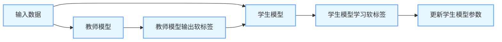

# 构建AI Agent的动态知识蒸馏机制

> 关键词：AI Agent、动态知识蒸馏、机器学习、模型压缩、知识迁移

> 摘要：本文聚焦于构建AI Agent的动态知识蒸馏机制。首先介绍了该研究的背景、目的、预期读者等信息。接着详细阐述了核心概念与联系，包括知识蒸馏和AI Agent的原理及架构。深入讲解了核心算法原理，通过Python代码进行具体操作步骤的说明。同时给出了相关数学模型和公式，并举例说明。在项目实战部分，展示了开发环境搭建、源代码实现与解读。探讨了实际应用场景，推荐了学习资源、开发工具框架以及相关论文著作。最后总结了未来发展趋势与挑战，还设置了常见问题解答和扩展阅读参考资料。旨在为读者全面深入地介绍如何构建AI Agent的动态知识蒸馏机制。

## 1. 背景介绍 
### 1.1 目的和范围
在当今人工智能领域，AI Agent的应用越来越广泛，如智能客服、自动驾驶、游戏AI等。然而，许多先进的AI Agent模型往往具有庞大的参数和复杂的结构，这导致模型在部署和运行时面临计算资源消耗大、推理速度慢等问题。知识蒸馏作为一种有效的模型压缩和知识迁移技术，可以将大型教师模型的知识迁移到小型学生模型中，从而在降低模型复杂度的同时保持较好的性能。

本研究的目的是构建一种动态知识蒸馏机制，以适应AI Agent在不同场景和任务下的需求。传统的知识蒸馏方法通常是静态的，即在训练过程中固定教师模型和学生模型的参数和结构。而动态知识蒸馏机制可以根据环境变化、任务需求和数据分布的动态调整蒸馏过程，提高学生模型的学习效率和性能。

本研究的范围主要包括动态知识蒸馏机制的核心概念、算法原理、数学模型、实际应用场景以及相关的开发工具和资源。我们将通过理论分析、代码实现和实际案例来详细阐述如何构建和应用这种机制。

### 1.2 预期读者
本文的预期读者包括人工智能领域的研究人员、工程师、学生以及对AI Agent和知识蒸馏技术感兴趣的爱好者。对于研究人员，本文可以提供新的研究思路和方法；对于工程师，本文可以指导他们在实际项目中应用动态知识蒸馏机制；对于学生，本文可以帮助他们深入理解相关的理论和技术；对于爱好者，本文可以让他们了解该领域的前沿进展。

### 1.3 文档结构概述
本文将按照以下结构进行组织：
1. 背景介绍：介绍研究的目的、范围、预期读者和文档结构概述。
2. 核心概念与联系：详细解释知识蒸馏和AI Agent的核心概念，以及它们之间的联系，并给出原理和架构的文本示意图和Mermaid流程图。
3. 核心算法原理 & 具体操作步骤：讲解动态知识蒸馏机制的核心算法原理，并使用Python源代码详细阐述具体操作步骤。
4. 数学模型和公式 & 详细讲解 & 举例说明：给出动态知识蒸馏机制的数学模型和公式，并进行详细讲解和举例说明。
5. 项目实战：代码实际案例和详细解释说明：通过一个实际项目，展示如何搭建开发环境、实现源代码，并对代码进行解读和分析。
6. 实际应用场景：探讨动态知识蒸馏机制在不同领域的实际应用场景。
7. 工具和资源推荐：推荐学习资源、开发工具框架和相关论文著作。
8. 总结：未来发展趋势与挑战：总结动态知识蒸馏机制的发展趋势和面临的挑战。
9. 附录：常见问题与解答：解答读者可能遇到的常见问题。
10. 扩展阅读 & 参考资料：提供扩展阅读的建议和参考资料。

### 1.4 术语表
#### 1.4.1 核心术语定义
- **AI Agent**：能够感知环境、做出决策并采取行动以实现特定目标的人工智能实体。
- **知识蒸馏**：一种将大型教师模型的知识迁移到小型学生模型中的技术，通过让学生模型学习教师模型的输出分布来提高自身性能。
- **动态知识蒸馏**：在知识蒸馏过程中，根据环境变化、任务需求和数据分布动态调整蒸馏参数和过程的机制。
- **教师模型**：知识蒸馏中提供知识的大型、复杂模型，通常具有较高的性能。
- **学生模型**：知识蒸馏中接收知识的小型、简单模型，通过学习教师模型的知识来提高自身性能。

#### 1.4.2 相关概念解释
- **模型压缩**：通过各种技术减少模型的参数数量和计算复杂度，以降低模型的存储和计算成本。
- **知识迁移**：将在一个任务或领域中学习到的知识应用到另一个任务或领域中的过程。
- **蒸馏损失**：衡量学生模型输出与教师模型输出之间差异的损失函数，用于指导学生模型的学习。

#### 1.4.3 缩略词列表
- **ML**：Machine Learning，机器学习
- **DL**：Deep Learning，深度学习
- **DNN**：Deep Neural Network，深度神经网络
- **CNN**：Convolutional Neural Network，卷积神经网络
- **RNN**：Recurrent Neural Network，循环神经网络

## 2. 核心概念与联系 

### 知识蒸馏原理
知识蒸馏的核心思想是让学生模型学习教师模型的软标签（即概率分布），而不仅仅是硬标签（即类别标签）。通过这种方式，学生模型可以从教师模型中获取更多的知识，从而提高自身的性能。

假设教师模型 $T$ 和学生模型 $S$ 都用于解决分类问题，输入样本为 $x$，教师模型的输出为 $p_T(x)$，学生模型的输出为 $p_S(x)$。传统的分类任务通常使用交叉熵损失函数来训练学生模型，目标是最小化学生模型的输出与真实标签 $y$ 之间的差异：

$$L_{CE}(p_S(x), y) = - \sum_{i=1}^{C} y_i \log(p_{S_i}(x))$$

其中 $C$ 是类别数，$y_i$ 是真实标签的第 $i$ 个分量，$p_{S_i}(x)$ 是学生模型输出的第 $i$ 个分量。

在知识蒸馏中，除了使用交叉熵损失函数外，还引入了蒸馏损失函数，用于衡量学生模型输出与教师模型输出之间的差异。常用的蒸馏损失函数是KL散度：

$$L_{KD}(p_S(x), p_T(x)) = \sum_{i=1}^{C} p_{T_i}(x) \log\left(\frac{p_{T_i}(x)}{p_{S_i}(x)}\right)$$

最终的损失函数是交叉熵损失和蒸馏损失的加权和：

$$L = \alpha L_{CE}(p_S(x), y) + (1 - \alpha) L_{KD}(p_S(x), p_T(x))$$

其中 $\alpha$ 是一个超参数，用于控制交叉熵损失和蒸馏损失的相对权重。

### AI Agent原理
AI Agent是一个能够感知环境、做出决策并采取行动的实体。它通常由感知模块、决策模块和执行模块组成。感知模块用于获取环境信息，决策模块根据感知到的信息做出决策，执行模块根据决策采取相应的行动。

AI Agent的决策过程可以使用强化学习来实现。强化学习是一种通过智能体与环境进行交互，根据环境反馈的奖励信号来学习最优策略的机器学习方法。在强化学习中，智能体的目标是最大化长期累积奖励。

假设智能体在时间步 $t$ 观察到环境状态 $s_t$，采取行动 $a_t$，环境反馈奖励 $r_t$，并转移到下一个状态 $s_{t+1}$。智能体的策略 $\pi$ 定义了在每个状态下选择行动的概率分布：

$$\pi(a|s) = P(a_t = a | s_t = s)$$

智能体的目标是学习一个最优策略 $\pi^*$，使得长期累积奖励最大化：

$$\pi^* = \arg\max_{\pi} E\left[\sum_{t=0}^{\infty} \gamma^t r_t\right]$$

其中 $\gamma$ 是折扣因子，用于控制未来奖励的重要性。

### 动态知识蒸馏与AI Agent的联系
在AI Agent的训练过程中，动态知识蒸馏可以用于加速智能体的学习过程和提高智能体的性能。具体来说，可以将一个已经训练好的大型教师智能体的知识蒸馏到一个小型学生智能体中。在不同的环境和任务下，可以动态调整蒸馏过程，以适应不同的需求。

例如，在一个复杂的游戏环境中，教师智能体可以通过大量的训练学习到最优策略。然后，可以使用动态知识蒸馏机制将教师智能体的知识迁移到学生智能体中。在游戏的不同阶段，可以根据环境的变化动态调整蒸馏参数，如蒸馏损失的权重、教师模型的选择等，以提高学生智能体的学习效率和性能。

### 文本示意图
```plaintext
+---------------------+        +---------------------+
|      教师模型       |        |      学生模型       |
+---------------------+        +---------------------+
|  接收输入数据       |        |  接收输入数据       |
|  输出软标签         | -----> |  学习软标签         |
|                     |        |                     |
|  预训练好的模型     |        |  待训练的模型       |
+---------------------+        +---------------------+
```

### Mermaid流程图


## 3. 核心算法原理 & 具体操作步骤 

### 核心算法原理
动态知识蒸馏机制的核心思想是在知识蒸馏过程中动态调整蒸馏参数，以适应不同的环境和任务需求。具体来说，我们可以根据以下几个因素来动态调整蒸馏参数：
1. **环境状态**：根据智能体所处的环境状态，调整蒸馏损失的权重。例如，在环境变化剧烈的情况下，可以增加蒸馏损失的权重，让学生模型更快地学习教师模型的知识。
2. **任务难度**：根据任务的难度，调整教师模型的选择。对于较难的任务，可以选择性能更好的教师模型进行知识蒸馏。
3. **数据分布**：根据输入数据的分布，调整蒸馏参数。例如，对于某些特定的数据分布，可以增加相应数据样本的蒸馏损失权重。

### 具体操作步骤

#### 步骤1：初始化教师模型和学生模型
首先，我们需要初始化一个预训练好的教师模型 $T$ 和一个待训练的学生模型 $S$。教师模型通常是一个大型、复杂的模型，具有较高的性能；学生模型则是一个小型、简单的模型，需要通过知识蒸馏来学习教师模型的知识。

```python
import torch
import torch.nn as nn

# 定义教师模型
class TeacherModel(nn.Module):
    def __init__(self):
        super(TeacherModel, self).__init__()
        self.fc1 = nn.Linear(10, 20)
        self.fc2 = nn.Linear(20, 5)

    def forward(self, x):
        x = torch.relu(self.fc1(x))
        x = self.fc2(x)
        return x

# 定义学生模型
class StudentModel(nn.Module):
    def __init__(self):
        super(StudentModel, self).__init__()
        self.fc1 = nn.Linear(10, 10)
        self.fc2 = nn.Linear(10, 5)

    def forward(self, x):
        x = torch.relu(self.fc1(x))
        x = self.fc2(x)
        return x

# 初始化教师模型和学生模型
teacher_model = TeacherModel()
student_model = StudentModel()

# 加载预训练的教师模型参数
teacher_model.load_state_dict(torch.load('teacher_model.pth'))
```

#### 步骤2：定义损失函数和优化器
我们需要定义交叉熵损失函数、蒸馏损失函数和最终的损失函数。同时，选择合适的优化器来更新学生模型的参数。

```python
import torch.nn.functional as F

# 定义交叉熵损失函数
ce_loss = nn.CrossEntropyLoss()

# 定义蒸馏损失函数（KL散度）
def kl_divergence_loss(p, q):
    return F.kl_div(F.log_softmax(p, dim=1), F.softmax(q, dim=1), reduction='batchmean')

# 定义最终的损失函数
def distillation_loss(student_output, teacher_output, labels, alpha=0.5):
    ce = ce_loss(student_output, labels)
    kd = kl_divergence_loss(student_output, teacher_output)
    return alpha * ce + (1 - alpha) * kd

# 定义优化器
optimizer = torch.optim.Adam(student_model.parameters(), lr=0.001)
```

#### 步骤3：动态调整蒸馏参数
在训练过程中，我们可以根据环境状态、任务难度和数据分布等因素动态调整蒸馏参数。例如，我们可以根据环境状态动态调整蒸馏损失的权重 $\alpha$。

```python
# 模拟环境状态
env_state = 0

# 根据环境状态动态调整蒸馏损失的权重
def adjust_alpha(env_state):
    if env_state < 0.5:
        return 0.2
    else:
        return 0.8

# 训练循环
num_epochs = 10
for epoch in range(num_epochs):
    # 模拟输入数据和标签
    inputs = torch.randn(32, 10)
    labels = torch.randint(0, 5, (32,))

    # 前向传播
    teacher_output = teacher_model(inputs)
    student_output = student_model(inputs)

    # 动态调整蒸馏参数
    alpha = adjust_alpha(env_state)

    # 计算损失
    loss = distillation_loss(student_output, teacher_output, labels, alpha)

    # 反向传播和优化
    optimizer.zero_grad()
    loss.backward()
    optimizer.step()

    print(f'Epoch {epoch+1}/{num_epochs}, Loss: {loss.item()}')
```

## 4. 数学模型和公式 & 详细讲解 & 举例说明 

### 数学模型和公式
在动态知识蒸馏机制中，我们主要关注以下几个数学模型和公式：

#### 交叉熵损失函数
交叉熵损失函数用于衡量学生模型的输出与真实标签之间的差异。对于一个多分类问题，假设输入样本 $x$ 的真实标签为 $y$，学生模型的输出为 $p_S(x)$，则交叉熵损失函数定义为：

$$L_{CE}(p_S(x), y) = - \sum_{i=1}^{C} y_i \log(p_{S_i}(x))$$

其中 $C$ 是类别数，$y_i$ 是真实标签的第 $i$ 个分量，$p_{S_i}(x)$ 是学生模型输出的第 $i$ 个分量。

#### 蒸馏损失函数（KL散度）
蒸馏损失函数用于衡量学生模型的输出与教师模型的输出之间的差异。常用的蒸馏损失函数是KL散度，定义为：

$$L_{KD}(p_S(x), p_T(x)) = \sum_{i=1}^{C} p_{T_i}(x) \log\left(\frac{p_{T_i}(x)}{p_{S_i}(x)}\right)$$

其中 $p_T(x)$ 是教师模型的输出，$p_{S_i}(x)$ 和 $p_{T_i}(x)$ 分别是学生模型和教师模型输出的第 $i$ 个分量。

#### 最终损失函数
最终的损失函数是交叉熵损失和蒸馏损失的加权和：

$$L = \alpha L_{CE}(p_S(x), y) + (1 - \alpha) L_{KD}(p_S(x), p_T(x))$$

其中 $\alpha$ 是一个超参数，用于控制交叉熵损失和蒸馏损失的相对权重。

### 详细讲解
交叉熵损失函数是一种常用的分类损失函数，它衡量了真实标签分布与预测标签分布之间的差异。在知识蒸馏中，我们不仅希望学生模型能够正确分类，还希望它能够学习到教师模型的输出分布，因此引入了蒸馏损失函数。

KL散度是一种衡量两个概率分布之间差异的指标。在知识蒸馏中，我们使用KL散度来衡量学生模型的输出分布与教师模型的输出分布之间的差异。通过最小化蒸馏损失，学生模型可以学习到教师模型的输出分布，从而获取更多的知识。

最终的损失函数通过加权和的方式将交叉熵损失和蒸馏损失结合起来。$\alpha$ 的值越大，说明我们更注重学生模型的分类准确性；$\alpha$ 的值越小，说明我们更注重学生模型学习教师模型的输出分布。

### 举例说明
假设我们有一个三分类问题，输入样本 $x$ 的真实标签为 $y = [0, 1, 0]$，教师模型的输出为 $p_T(x) = [0.1, 0.8, 0.1]$，学生模型的输出为 $p_S(x) = [0.2, 0.7, 0.1]$。

#### 计算交叉熵损失
$$L_{CE}(p_S(x), y) = - (0 \times \log(0.2) + 1 \times \log(0.7) + 0 \times \log(0.1)) \approx 0.357$$

#### 计算蒸馏损失
$$L_{KD}(p_S(x), p_T(x)) = 0.1 \times \log\left(\frac{0.1}{0.2}\right) + 0.8 \times \log\left(\frac{0.8}{0.7}\right) + 0.1 \times \log\left(\frac{0.1}{0.1}\right) \approx 0.064$$

#### 计算最终损失
假设 $\alpha = 0.5$，则最终损失为：

$$L = 0.5 \times 0.357 + (1 - 0.5) \times 0.064 \approx 0.2105$$

通过不断调整学生模型的参数，最小化最终损失，学生模型可以学习到教师模型的知识，提高自身的性能。

## 5. 项目实战：代码实际案例和详细解释说明 

### 5.1  开发环境搭建
在进行项目实战之前，我们需要搭建开发环境。以下是具体的步骤：

#### 步骤1：安装Python
首先，确保你已经安装了Python 3.6或更高版本。你可以从Python官方网站（https://www.python.org/downloads/）下载并安装Python。

#### 步骤2：创建虚拟环境
为了避免不同项目之间的依赖冲突，建议使用虚拟环境。可以使用`venv`或`conda`来创建虚拟环境。以下是使用`venv`创建虚拟环境的示例：

```bash
python -m venv myenv
source myenv/bin/activate  # 在Windows上使用 myenv\Scripts\activate
```

#### 步骤3：安装必要的库
在虚拟环境中，安装必要的深度学习库，如`torch`和`torchvision`。可以使用以下命令进行安装：

```bash
pip install torch torchvision
```

### 5.2  源代码详细实现和代码解读
以下是一个完整的动态知识蒸馏项目的源代码示例：

```python
import torch
import torch.nn as nn
import torch.nn.functional as F
import torch.optim as optim

# 定义教师模型
class TeacherModel(nn.Module):
    def __init__(self):
        super(TeacherModel, self).__init__()
        self.fc1 = nn.Linear(10, 20)
        self.fc2 = nn.Linear(20, 5)

    def forward(self, x):
        x = torch.relu(self.fc1(x))
        x = self.fc2(x)
        return x

# 定义学生模型
class StudentModel(nn.Module):
    def __init__(self):
        super(StudentModel, self).__init__()
        self.fc1 = nn.Linear(10, 10)
        self.fc2 = nn.Linear(10, 5)

    def forward(self, x):
        x = torch.relu(self.fc1(x))
        x = self.fc2(x)
        return x

# 定义交叉熵损失函数
ce_loss = nn.CrossEntropyLoss()

# 定义蒸馏损失函数（KL散度）
def kl_divergence_loss(p, q):
    return F.kl_div(F.log_softmax(p, dim=1), F.softmax(q, dim=1), reduction='batchmean')

# 定义最终的损失函数
def distillation_loss(student_output, teacher_output, labels, alpha=0.5):
    ce = ce_loss(student_output, labels)
    kd = kl_divergence_loss(student_output, teacher_output)
    return alpha * ce + (1 - alpha) * kd

# 模拟环境状态
env_state = 0

# 根据环境状态动态调整蒸馏损失的权重
def adjust_alpha(env_state):
    if env_state < 0.5:
        return 0.2
    else:
        return 0.8

# 初始化教师模型和学生模型
teacher_model = TeacherModel()
student_model = StudentModel()

# 加载预训练的教师模型参数
# 这里假设教师模型已经预训练好
# teacher_model.load_state_dict(torch.load('teacher_model.pth'))

# 定义优化器
optimizer = optim.Adam(student_model.parameters(), lr=0.001)

# 训练循环
num_epochs = 10
for epoch in range(num_epochs):
    # 模拟输入数据和标签
    inputs = torch.randn(32, 10)
    labels = torch.randint(0, 5, (32,))

    # 前向传播
    teacher_output = teacher_model(inputs)
    student_output = student_model(inputs)

    # 动态调整蒸馏参数
    alpha = adjust_alpha(env_state)

    # 计算损失
    loss = distillation_loss(student_output, teacher_output, labels, alpha)

    # 反向传播和优化
    optimizer.zero_grad()
    loss.backward()
    optimizer.step()

    print(f'Epoch {epoch+1}/{num_epochs}, Loss: {loss.item()}')
```

### 代码解读与分析
#### 模型定义
- `TeacherModel`：定义了一个简单的全连接神经网络作为教师模型，包含两个全连接层。
- `StudentModel`：定义了一个比教师模型更简单的全连接神经网络作为学生模型，同样包含两个全连接层。

#### 损失函数定义
- `ce_loss`：定义了交叉熵损失函数，用于衡量学生模型的输出与真实标签之间的差异。
- `kl_divergence_loss`：定义了蒸馏损失函数，使用KL散度来衡量学生模型的输出与教师模型的输出之间的差异。
- `distillation_loss`：定义了最终的损失函数，是交叉熵损失和蒸馏损失的加权和。

#### 动态调整蒸馏参数
- `adjust_alpha`：根据环境状态动态调整蒸馏损失的权重 $\alpha$。当环境状态小于0.5时，$\alpha$ 为0.2；当环境状态大于等于0.5时，$\alpha$ 为0.8。

#### 训练循环
- 在每个训练 epoch 中，模拟输入数据和标签，进行前向传播计算教师模型和学生模型的输出。
- 动态调整蒸馏参数 $\alpha$，计算最终损失。
- 进行反向传播和优化，更新学生模型的参数。

通过这种方式，学生模型可以在训练过程中动态学习教师模型的知识，提高自身的性能。

## 6. 实际应用场景 
### 智能客服
在智能客服系统中，通常会使用大型的预训练语言模型作为教师模型，这些模型具有强大的语言理解和生成能力。然而，在实际部署中，由于计算资源和响应时间的限制，需要使用小型的学生模型。通过动态知识蒸馏机制，可以将教师模型的知识迁移到学生模型中，并根据不同的客户问题和对话场景动态调整蒸馏参数。例如，对于复杂的问题，可以增加蒸馏损失的权重，让学生模型更快地学习教师模型的知识；对于简单的问题，可以减少蒸馏损失的权重，更注重学生模型的分类准确性。

### 自动驾驶
在自动驾驶领域，AI Agent需要实时感知环境、做出决策并控制车辆行驶。大型的深度学习模型可以在训练阶段学习到丰富的环境信息和驾驶策略，但在实际部署中，由于计算资源的限制，需要使用小型的模型。动态知识蒸馏机制可以将大型教师模型的知识迁移到小型学生模型中，并根据不同的驾驶场景（如城市道路、高速公路、恶劣天气等）动态调整蒸馏参数。例如，在复杂的城市道路场景中，可以增加蒸馏损失的权重，让学生模型更好地学习教师模型的决策策略；在高速公路场景中，可以减少蒸馏损失的权重，提高学生模型的推理速度。

### 游戏AI
在游戏开发中，AI Agent需要与玩家进行交互，做出智能的决策。大型的游戏AI模型可以通过大量的训练学习到最优的游戏策略，但在实际应用中，由于内存和计算资源的限制，需要使用小型的模型。动态知识蒸馏机制可以将大型教师模型的知识迁移到小型学生模型中，并根据游戏的不同阶段和玩家的行为动态调整蒸馏参数。例如，在游戏的初期阶段，可以增加蒸馏损失的权重，让学生模型快速学习教师模型的基本策略；在游戏的后期阶段，可以根据玩家的行为动态调整蒸馏参数，让学生模型更好地应对不同的游戏情况。

### 医疗诊断
在医疗诊断领域，AI Agent可以辅助医生进行疾病诊断和治疗方案推荐。大型的医学图像分析模型和电子病历分析模型可以学习到丰富的医学知识，但在实际应用中，由于数据隐私和计算资源的限制，需要使用小型的模型。动态知识蒸馏机制可以将大型教师模型的知识迁移到小型学生模型中，并根据不同的疾病类型和患者情况动态调整蒸馏参数。例如，对于罕见病的诊断，可以增加蒸馏损失的权重，让学生模型更深入地学习教师模型的诊断知识；对于常见疾病的诊断，可以减少蒸馏损失的权重，提高学生模型的诊断效率。

## 7. 工具和资源推荐
### 7.1 学习资源推荐
#### 7.1.1 书籍推荐
- 《深度学习》（Deep Learning）：由Ian Goodfellow、Yoshua Bengio和Aaron Courville所著，是深度学习领域的经典教材，涵盖了深度学习的基本概念、算法和应用。
- 《动手学深度学习》（Dive into Deep Learning）：由 Aston Zhang、Zachary C. Lipton、Mu Li和Alexander J. Smola所著，提供了丰富的代码示例和实践项目，适合初学者快速上手深度学习。
- 《强化学习：原理与Python实现》：由杉山将所著，详细介绍了强化学习的基本原理和算法，并提供了Python代码实现。

#### 7.1.2 在线课程
- Coursera上的“深度学习专项课程”（Deep Learning Specialization）：由Andrew Ng教授主讲，包括深度学习基础、卷积神经网络、循环神经网络等多个课程，是学习深度学习的优质资源。
- edX上的“强化学习”（Reinforcement Learning）：由UC Berkeley的Pieter Abbeel教授主讲，系统介绍了强化学习的理论和算法。
- 哔哩哔哩（B站）上有许多关于深度学习和知识蒸馏的教学视频，如“李宏毅机器学习”系列课程，讲解生动易懂。

#### 7.1.3 技术博客和网站
- arXiv（https://arxiv.org/）：是一个预印本平台，包含了大量的人工智能领域的最新研究论文。
- Medium（https://medium.com/）：有许多技术博主分享关于深度学习、知识蒸馏等方面的文章和经验。
- 机器之心（https://www.alldatasheet.com/）：提供了人工智能领域的最新资讯、技术文章和研究成果。

### 7.2 开发工具框架推荐
#### 7.2.1 IDE和编辑器
- PyCharm：是一款专门为Python开发设计的集成开发环境（IDE），提供了丰富的代码编辑、调试和项目管理功能。
- Jupyter Notebook：是一个交互式的开发环境，适合进行数据探索、模型训练和代码演示。
- Visual Studio Code：是一款轻量级的代码编辑器，支持多种编程语言和插件扩展，也可以用于Python开发。

#### 7.2.2 调试和性能分析工具
- PyTorch Profiler：是PyTorch自带的性能分析工具，可以帮助开发者分析模型的计算性能和内存使用情况。
- TensorBoard：是TensorFlow提供的可视化工具，也可以与PyTorch结合使用，用于可视化模型的训练过程和性能指标。
- NVIDIA Nsight Systems：是一款针对NVIDIA GPU的性能分析工具，可以帮助开发者优化GPU代码的性能。

#### 7.2.3 相关框架和库
- PyTorch：是一个开源的深度学习框架，提供了丰富的神经网络层和优化算法，支持动态图计算，易于使用和调试。
- TensorFlow：是另一个广泛使用的深度学习框架，提供了高级的API和分布式训练功能，适合大规模的深度学习项目。
- Scikit-learn：是一个用于机器学习的Python库，提供了各种机器学习算法和工具，如分类、回归、聚类等。

### 7.3 相关论文著作推荐
#### 7.3.1 经典论文
- “Distilling the Knowledge in a Neural Network”：由Geoffrey Hinton等人发表，首次提出了知识蒸馏的概念。
- “Policy Distillation”：探讨了如何将强化学习中的策略进行蒸馏，将复杂策略的知识迁移到简单策略中。
- “Model Compression via Distillation and Quantization”：研究了如何结合知识蒸馏和量化技术进行模型压缩。

#### 7.3.2 最新研究成果
- 关注arXiv上关于动态知识蒸馏、AI Agent等方面的最新论文，了解该领域的前沿研究进展。
- 参加国际人工智能会议，如NeurIPS、ICML、CVPR等，获取最新的研究成果和学术动态。

#### 7.3.3 应用案例分析
- 一些知名的科技公司会在其技术博客上分享动态知识蒸馏在实际项目中的应用案例，如Google、Facebook、Microsoft等。
- 相关的学术期刊和会议论文集也会收录一些应用案例分析，如ACM Transactions on Intelligent Systems and Technology、IEEE Transactions on Neural Networks and Learning Systems等。

## 8. 总结：未来发展趋势与挑战
### 未来发展趋势
#### 自适应蒸馏策略
未来的动态知识蒸馏机制将更加注重自适应蒸馏策略的研究。通过引入更多的环境信息和任务特征，动态调整蒸馏参数和过程，使学生模型能够更好地适应不同的场景和任务需求。例如，根据数据的不确定性、模型的置信度等因素动态调整蒸馏损失的权重。

#### 多模态知识蒸馏
随着多模态数据（如图像、文本、音频等）在人工智能领域的广泛应用，多模态知识蒸馏将成为一个重要的研究方向。如何将不同模态的知识有效地蒸馏到一个统一的学生模型中，以及如何处理不同模态之间的关联和互补性，是未来需要解决的问题。

#### 强化学习与知识蒸馏的深度融合
强化学习和知识蒸馏都是人工智能领域的重要技术，未来将加强两者的深度融合。通过知识蒸馏加速强化学习智能体的学习过程，同时利用强化学习的反馈机制动态调整知识蒸馏的过程，提高智能体的性能和适应性。

#### 跨领域知识蒸馏
在实际应用中，不同领域的知识之间存在着一定的关联和共性。未来的动态知识蒸馏机制将探索跨领域知识蒸馏的方法，将一个领域的知识迁移到另一个领域的学生模型中，实现知识的共享和复用。

### 挑战
#### 蒸馏过程的稳定性
动态知识蒸馏过程中，蒸馏参数的动态调整可能会导致蒸馏过程的不稳定。例如，蒸馏损失的权重频繁变化可能会使学生模型的训练陷入震荡，难以收敛到最优解。如何保证蒸馏过程的稳定性，是需要解决的一个重要挑战。

#### 知识的有效迁移
在知识蒸馏过程中，如何确保教师模型的知识能够有效地迁移到学生模型中，是一个关键问题。特别是在动态知识蒸馏中，由于蒸馏参数的动态变化，可能会导致知识迁移的效率降低。需要研究更加有效的知识迁移方法，提高学生模型的学习效果。

#### 计算资源和时间成本
动态知识蒸馏机制通常需要在训练过程中实时计算和调整蒸馏参数，这会增加计算资源和时间成本。如何在保证蒸馏效果的前提下，降低计算资源和时间成本，是实际应用中需要解决的问题。

#### 数据隐私和安全
在一些应用场景中，如医疗、金融等领域，数据隐私和安全是至关重要的。在知识蒸馏过程中，如何保护教师模型和学生模型的数据隐私，防止数据泄露和恶意攻击，是需要关注的问题。

## 9. 附录：常见问题与解答
### 问题1：动态知识蒸馏与传统知识蒸馏有什么区别？
传统知识蒸馏通常是静态的，即在训练过程中固定教师模型和学生模型的参数和结构，以及蒸馏损失的权重。而动态知识蒸馏机制可以根据环境变化、任务需求和数据分布等因素动态调整蒸馏参数和过程，使学生模型能够更好地适应不同的场景和任务。

### 问题2：如何选择合适的教师模型和学生模型？
选择教师模型时，通常选择性能较好、参数较多的大型模型，如预训练的深度学习模型。学生模型则应该选择结构相对简单、参数较少的模型，以便在保证一定性能的前提下降低计算成本。同时，教师模型和学生模型的输入输出格式应该保持一致。

### 问题3：蒸馏损失的权重 $\alpha$ 如何确定？
蒸馏损失的权重 $\alpha$ 可以根据具体的任务和实验进行调整。一般来说，如果更注重学生模型的分类准确性，可以适当增大 $\alpha$ 的值；如果更注重学生模型学习教师模型的输出分布，可以适当减小 $\alpha$ 的值。在动态知识蒸馏中，可以根据环境状态、任务难度等因素动态调整 $\alpha$ 的值。

### 问题4：动态知识蒸馏机制对计算资源有什么要求？
动态知识蒸馏机制需要在训练过程中实时计算和调整蒸馏参数，因此对计算资源有一定的要求。特别是在处理大规模数据和复杂模型时，可能需要使用GPU等高性能计算设备来加速训练过程。同时，也可以通过优化算法和模型结构来降低计算资源的消耗。

### 问题5：动态知识蒸馏机制可以应用于哪些领域？
动态知识蒸馏机制可以应用于多个领域，如智能客服、自动驾驶、游戏AI、医疗诊断等。在这些领域中，通过将大型教师模型的知识迁移到小型学生模型中，并根据不同的场景和任务动态调整蒸馏过程，可以提高模型的性能和适应性，同时降低计算成本和响应时间。

## 10. 扩展阅读 & 参考资料
### 扩展阅读
- 阅读更多关于知识蒸馏、强化学习和AI Agent的研究论文，深入了解相关的理论和技术。
- 学习其他模型压缩和加速技术，如量化、剪枝等，与动态知识蒸馏机制相结合，进一步提高模型的性能和效率。
- 关注人工智能领域的最新研究动态和应用案例，了解动态知识蒸馏机制在实际项目中的应用和发展趋势。

### 参考资料
- Hinton, G., Vinyals, O., & Dean, J. (2015). Distilling the Knowledge in a Neural Network. arXiv preprint arXiv:1503.02531.
- Rusu, A. A., Colmenarejo, S. G., Gulcehre, C., Desjardins, G., Kirkpatrick, J., Pascanu, R.,... & Kavukcuoglu, K. (2015). Policy Distillation. arXiv preprint arXiv:1511.06295.
- Han, S., Mao, H., & Dally, W. J. (2015). Deep compression: Compressing deep neural networks with pruning, trained quantization and huffman coding. arXiv preprint arXiv:1510.00149.

作者：AI天才研究院/AI Genius Institute & 禅与计算机程序设计艺术 /Zen And The Art of Computer Programming