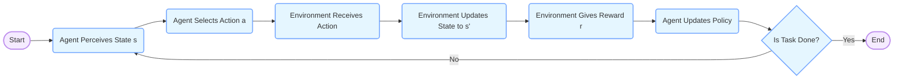

# 构建AI Agent的反馈学习机制

> 关键词：AI Agent、反馈学习机制、强化学习、监督学习、元学习

> 摘要：本文围绕构建AI Agent的反馈学习机制展开深入探讨。首先介绍了相关背景，包括目的、预期读者等内容。接着阐述了核心概念与联系，详细解释了AI Agent、反馈学习机制等关键概念及其相互关系，并通过示意图和流程图进行直观展示。在核心算法原理部分，运用Python代码详细讲解了如Q - learning、策略梯度算法等。通过数学模型和公式进一步剖析了反馈学习机制的本质，并结合实际例子进行说明。项目实战环节从开发环境搭建开始，给出了具体的源代码实现和详细解读。同时分析了实际应用场景，推荐了相关的学习资源、开发工具框架以及论文著作。最后总结了未来发展趋势与挑战，还提供了常见问题解答和扩展阅读参考资料，旨在为读者全面深入地理解和构建AI Agent的反馈学习机制提供系统的知识和实践指导。

## 1. 背景介绍 
### 1.1 目的和范围
在当今人工智能飞速发展的时代，AI Agent的应用越来越广泛，如在自动驾驶、游戏、智能客服等领域。然而，要使AI Agent能够更加智能、灵活地应对各种复杂任务，构建有效的反馈学习机制至关重要。本文的目的在于深入探讨如何构建AI Agent的反馈学习机制，涵盖了从基础概念、算法原理到实际应用和未来趋势等多个方面。范围涉及常见的反馈学习方法，如强化学习、监督学习中的反馈机制，以及新兴的元学习在反馈学习中的应用等。

### 1.2 预期读者
本文预期读者包括人工智能领域的研究者、开发者、学生以及对AI Agent技术感兴趣的爱好者。对于研究者而言，本文可提供新的研究思路和理论基础；开发者能够从中获取构建反馈学习机制的实践指导；学生可以借此系统学习相关知识；而爱好者则能对AI Agent的反馈学习机制有一个较为全面的了解。

### 1.3 文档结构概述
本文首先介绍背景信息，让读者对构建AI Agent反馈学习机制的重要性和意义有初步认识。接着阐述核心概念与联系，帮助读者理解关键术语和它们之间的关系。核心算法原理部分详细讲解了实现反馈学习的算法，并通过Python代码进行演示。数学模型和公式则从理论层面深入剖析反馈学习机制。项目实战环节提供了具体的代码案例和详细解释。实际应用场景分析展示了反馈学习机制在不同领域的应用。工具和资源推荐为读者提供了学习和开发所需的资料和工具。最后总结未来发展趋势与挑战，解答常见问题，并提供扩展阅读和参考资料。

### 1.4 术语表
#### 1.4.1 核心术语定义
- **AI Agent**：是一个能够感知环境、根据感知到的信息做出决策并采取行动的智能实体。它可以是软件程序，也可以是物理机器人。
- **反馈学习机制**：指AI Agent在执行任务过程中，根据环境反馈的信息来调整自身的行为和策略，以提高任务执行的效果和效率的一种学习方式。
- **强化学习**：是一种机器学习方法，AI Agent通过与环境进行交互，根据环境给予的奖励或惩罚信号来学习最优策略。
- **监督学习**：利用带标签的数据进行学习，模型通过最小化预测结果与真实标签之间的误差来进行参数调整。
- **元学习**：也称为“学习如何学习”，旨在让模型能够快速适应新的任务或环境，通过在多个任务上进行学习来掌握通用的学习策略。

#### 1.4.2 相关概念解释
- **环境**：指AI Agent所处的外部世界，它可以是物理环境，如现实世界中的场景；也可以是虚拟环境，如游戏中的场景。环境会根据AI Agent的行动给出相应的反馈。
- **状态**：描述环境在某一时刻的特征信息，AI Agent根据当前状态来做出决策。
- **动作**：AI Agent在某一状态下可以采取的行为。
- **奖励**：环境给予AI Agent的一种数值反馈，用于表示AI Agent采取的动作在当前状态下的好坏程度。

#### 1.4.3 缩略词列表
- **RL**：Reinforcement Learning，强化学习
- **SL**：Supervised Learning，监督学习
- **ML**：Meta - Learning，元学习
- **Q - learning**：一种无模型的强化学习算法

## 2. 核心概念与联系 
### 核心概念原理
#### AI Agent
AI Agent是一个自主的智能体，它具有感知、决策和行动的能力。感知模块负责从环境中获取信息，决策模块根据感知到的信息选择合适的动作，行动模块则执行所选的动作。例如，在一个自动驾驶汽车的场景中，传感器（如摄像头、雷达）就是感知模块，负责收集道路、交通标志等信息；决策模块根据这些信息决定汽车的行驶速度、转向等动作；而发动机、方向盘等则是行动模块，执行决策模块下达的指令。

#### 反馈学习机制
反馈学习机制是AI Agent不断优化自身行为的关键。通过环境的反馈，AI Agent可以了解自己的行为是否达到了预期的效果。在强化学习中，反馈通常以奖励的形式出现。如果AI Agent采取的动作导致环境给予正奖励，那么它会倾向于在类似状态下再次采取该动作；反之，如果得到负奖励，它会尝试调整策略。在监督学习中，反馈是通过真实标签与模型预测结果之间的误差来体现的，模型会根据误差来调整参数以减小误差。

#### 强化学习与反馈
强化学习是反馈学习机制的一种重要实现方式。在强化学习中，AI Agent与环境进行交互，每个时间步都会从环境中获取当前状态 $s_t$，选择一个动作 $a_t$ 执行，然后环境会返回下一个状态 $s_{t + 1}$ 和奖励 $r_t$。AI Agent的目标是学习一个策略 $\pi$，使得长期累积奖励最大化。

#### 监督学习与反馈
监督学习中的反馈主要体现在训练过程中。给定一组带标签的数据 $(x_i, y_i)$，其中 $x_i$ 是输入数据，$y_i$ 是对应的真实标签。模型根据输入 $x_i$ 进行预测得到 $\hat{y}_i$，然后计算预测值与真实标签之间的误差，如均方误差 $L(\hat{y}_i, y_i)=( \hat{y}_i - y_i)^2$。模型通过反向传播算法根据误差来更新参数，以减小误差。

#### 元学习与反馈
元学习强调在多个任务上进行学习，以获取通用的学习策略。在元学习中，反馈不仅来自于单个任务的训练误差，还来自于多个任务之间的关系。通过在多个任务上进行学习和调整，元学习模型能够更快地适应新的任务。

### 架构的文本示意图
```plaintext
          +-----------------+
          |    Environment    |
          +-----------------+
                  |
                  |  State (s)
                  v
          +-----------------+
          |     AI Agent      |
          +-----------------+
          |  Perception      |
          |  Decision        |
          |  Action          |
          +-----------------+
                  |
                  |  Action (a)
                  v
          +-----------------+
          |    Environment    |
          +-----------------+
                  |
                  |  Reward (r)
                  v
          +-----------------+
          |     AI Agent      |
          +-----------------+
```
这个示意图展示了AI Agent与环境之间的交互过程。AI Agent从环境中感知状态，做出决策并采取行动，环境根据行动给予奖励，AI Agent根据奖励调整自身的行为。

### Mermaid流程图

这个流程图清晰地展示了AI Agent在反馈学习过程中的循环步骤。从感知状态开始，选择动作，环境做出响应并给予奖励，AI Agent根据奖励更新策略，直到任务完成。

## 3. 核心算法原理 & 具体操作步骤 
### Q - learning算法原理与Python实现
#### 算法原理
Q - learning是一种无模型的强化学习算法，其核心思想是学习一个Q值函数 $Q(s, a)$，表示在状态 $s$ 下采取动作 $a$ 的预期累积奖励。Q值函数通过不断更新来逼近最优Q值函数 $Q^*$。更新公式如下：
$$Q(s_t, a_t) \leftarrow Q(s_t, a_t)+\alpha\left[r_t+\gamma\max_{a}Q(s_{t + 1}, a)-Q(s_t, a_t)\right]$$
其中，$\alpha$ 是学习率，控制每次更新的步长；$\gamma$ 是折扣因子，用于权衡当前奖励和未来奖励；$r_t$ 是在状态 $s_t$ 采取动作 $a_t$ 后得到的即时奖励。

#### Python代码实现
```python
import numpy as np

# 定义Q - learning类
class QLearningAgent:
    def __init__(self, state_size, action_size, learning_rate=0.1, discount_factor=0.9):
        self.state_size = state_size
        self.action_size = action_size
        self.learning_rate = learning_rate
        self.discount_factor = discount_factor
        # 初始化Q表
        self.q_table = np.zeros((state_size, action_size))

    def choose_action(self, state, epsilon=0.1):
        if np.random.uniform(0, 1) < epsilon:
            # 探索：随机选择动作
            action = np.random.choice(self.action_size)
        else:
            # 利用：选择Q值最大的动作
            action = np.argmax(self.q_table[state, :])
        return action

    def update_q_table(self, state, action, reward, next_state):
        # 根据Q - learning更新公式更新Q表
        max_q_next = np.max(self.q_table[next_state, :])
        self.q_table[state, action] += self.learning_rate * (
            reward + self.discount_factor * max_q_next - self.q_table[state, action]
        )


# 示例使用
state_size = 5
action_size = 3
agent = QLearningAgent(state_size, action_size)

# 模拟一个时间步的交互
state = 2
action = agent.choose_action(state)
reward = 1
next_state = 3
agent.update_q_table(state, action, reward, next_state)

print("Updated Q - table:", agent.q_table)
```
#### 具体操作步骤
1. **初始化**：初始化Q表，Q表的大小为状态数乘以动作数，初始值都设为0。
2. **选择动作**：根据当前状态，以一定的概率（$\epsilon$ - greedy策略）选择探索（随机选择动作）或利用（选择Q值最大的动作）。
3. **执行动作并获取反馈**：执行选择的动作，从环境中获取即时奖励和下一个状态。
4. **更新Q表**：根据Q - learning更新公式更新当前状态和动作对应的Q值。
5. **重复步骤2 - 4**：直到达到终止条件，如完成指定的时间步数或达到目标状态。

### 策略梯度算法原理与Python实现
#### 算法原理
策略梯度算法直接对策略 $\pi(a|s; \theta)$ 进行优化，其中 $\theta$ 是策略的参数。策略梯度定理表明，策略的目标函数 $J(\theta)$ 关于参数 $\theta$ 的梯度可以表示为：
$$\nabla_{\theta}J(\theta)=\mathbb{E}_{\tau\sim\pi_{\theta}}\left[\sum_{t = 0}^{T}\nabla_{\theta}\log\pi_{\theta}(a_t|s_t)R(\tau)\right]$$
其中，$\tau$ 是一个轨迹，$R(\tau)$ 是轨迹 $\tau$ 的累积奖励。通过梯度上升法更新策略参数 $\theta$，使得目标函数 $J(\theta)$ 增大。

#### Python代码实现
```python
import torch
import torch.nn as nn
import torch.optim as optim
import numpy as np

# 定义策略网络
class PolicyNetwork(nn.Module):
    def __init__(self, state_size, action_size):
        super(PolicyNetwork, self).__init__()
        self.fc1 = nn.Linear(state_size, 128)
        self.fc2 = nn.Linear(128, action_size)

    def forward(self, x):
        x = torch.relu(self.fc1(x))
        x = torch.softmax(self.fc2(x), dim=-1)
        return x


# 定义策略梯度代理
class PolicyGradientAgent:
    def __init__(self, state_size, action_size, learning_rate=0.001):
        self.state_size = state_size
        self.action_size = action_size
        self.policy_network = PolicyNetwork(state_size, action_size)
        self.optimizer = optim.Adam(self.policy_network.parameters(), lr=learning_rate)
        self.log_probs = []
        self.rewards = []

    def choose_action(self, state):
        state = torch.FloatTensor(state).unsqueeze(0)
        probs = self.policy_network(state)
        action = torch.multinomial(probs, 1).item()
        log_prob = torch.log(probs.squeeze(0)[action])
        self.log_probs.append(log_prob)
        return action

    def update_policy(self):
        total_reward = sum(self.rewards)
        policy_loss = []
        for log_prob in self.log_probs:
            policy_loss.append(-log_prob * total_reward)
        policy_loss = torch.stack(policy_loss).sum()

        self.optimizer.zero_grad()
        policy_loss.backward()
        self.optimizer.step()

        # 清空记录
        self.log_probs = []
        self.rewards = []


# 示例使用
state_size = 5
action_size = 3
agent = PolicyGradientAgent(state_size, action_size)

# 模拟一个轨迹
state = np.random.rand(state_size)
for _ in range(10):
    action = agent.choose_action(state)
    reward = np.random.rand()
    agent.rewards.append(reward)
    state = np.random.rand(state_size)

agent.update_policy()
```
#### 具体操作步骤
1. **定义策略网络**：使用神经网络来表示策略 $\pi(a|s; \theta)$。
2. **选择动作**：根据当前状态，通过策略网络得到动作的概率分布，然后从该分布中采样得到一个动作。记录该动作的对数概率。
3. **执行动作并获取奖励**：执行选择的动作，从环境中获取即时奖励，并记录下来。
4. **更新策略**：在一个轨迹结束后，计算策略的损失函数，使用梯度上升法更新策略网络的参数。
5. **重复步骤2 - 4**：进行多个轨迹的训练，不断优化策略。

## 4. 数学模型和公式 & 详细讲解 & 举例说明 
### 强化学习中的数学模型
#### 马尔可夫决策过程（MDP）
马尔可夫决策过程是强化学习的基础数学模型，它由一个四元组 $(S, A, P, R)$ 组成：
- $S$ 是状态空间，表示环境所有可能的状态集合。
- $A$ 是动作空间，表示AI Agent在每个状态下可以采取的动作集合。
- $P(s_{t + 1}|s_t, a_t)$ 是状态转移概率，表示在状态 $s_t$ 采取动作 $a_t$ 后转移到状态 $s_{t + 1}$ 的概率。
- $R(s_t, a_t)$ 是奖励函数，表示在状态 $s_t$ 采取动作 $a_t$ 后得到的即时奖励。

#### 值函数
值函数用于评估状态或状态 - 动作对的价值。
- **状态值函数**：$V^{\pi}(s)=\mathbb{E}_{\tau\sim\pi}\left[\sum_{t = 0}^{\infty}\gamma^t r_t|s_0 = s\right]$，表示在策略 $\pi$ 下，从状态 $s$ 开始的预期累积折扣奖励。
- **动作值函数**：$Q^{\pi}(s, a)=\mathbb{E}_{\tau\sim\pi}\left[\sum_{t = 0}^{\infty}\gamma^t r_t|s_0 = s, a_0 = a\right]$，表示在策略 $\pi$ 下，从状态 $s$ 采取动作 $a$ 开始的预期累积折扣奖励。

#### 贝尔曼方程
贝尔曼方程描述了值函数的递归关系。
- **状态值函数的贝尔曼方程**：
$$V^{\pi}(s)=\sum_{a\in A}\pi(a|s)\sum_{s'\in S}P(s'|s, a)\left[R(s, a)+\gamma V^{\pi}(s')\right]$$
- **动作值函数的贝尔曼方程**：
$$Q^{\pi}(s, a)=\sum_{s'\in S}P(s'|s, a)\left[R(s, a)+\gamma\sum_{a'\in A}\pi(a'|s')Q^{\pi}(s', a')\right]$$

### 举例说明
假设有一个简单的网格世界环境，状态空间 $S$ 是网格中的所有位置，动作空间 $A=\{\text{上}, \text{下}, \text{左}, \text{右}\}$。状态转移概率 $P$ 表示在某个位置采取某个动作后转移到下一个位置的概率，例如在没有障碍物的情况下，向上移动一步的概率为1。奖励函数 $R$ 可以定义为：如果到达目标位置，奖励为10；如果撞到障碍物，奖励为 - 5；其他情况奖励为0。

设策略 $\pi$ 是随机选择动作，我们可以使用贝尔曼方程来计算状态值函数。假设当前状态 $s$ 是距离目标位置一步之遥的位置，我们可以根据贝尔曼方程计算 $V^{\pi}(s)$。首先，对于每个可能的动作 $a$，计算转移到下一个状态 $s'$ 的概率和奖励，然后根据公式求和得到 $V^{\pi}(s)$。

### 监督学习中的数学模型
#### 损失函数
在监督学习中，损失函数用于衡量模型预测结果与真实标签之间的差异。常见的损失函数有：
- **均方误差（MSE）**：$L(\hat{y}, y)=\frac{1}{n}\sum_{i = 1}^{n}(\hat{y}_i - y_i)^2$，其中 $\hat{y}_i$ 是模型的预测值，$y_i$ 是真实标签。
- **交叉熵损失**：对于分类问题，交叉熵损失可以表示为 $L(\hat{y}, y)=-\sum_{i = 1}^{n}y_i\log\hat{y}_i$，其中 $\hat{y}_i$ 是模型预测的概率分布，$y_i$ 是真实的概率分布。

#### 梯度下降法
梯度下降法是一种常用的优化算法，用于最小化损失函数。对于损失函数 $L(\theta)$，其中 $\theta$ 是模型的参数，梯度下降法的更新公式为：
$$\theta_{t + 1}=\theta_t-\alpha\nabla_{\theta}L(\theta_t)$$
其中，$\alpha$ 是学习率，$\nabla_{\theta}L(\theta_t)$ 是损失函数关于参数 $\theta$ 在 $\theta_t$ 处的梯度。

### 举例说明
假设我们有一个简单的线性回归模型 $y = wx + b$，其中 $w$ 和 $b$ 是模型的参数。我们使用均方误差作为损失函数：
$$L(w, b)=\frac{1}{n}\sum_{i = 1}^{n}(wx_i + b - y_i)^2$$
为了最小化损失函数，我们使用梯度下降法更新参数 $w$ 和 $b$。首先计算损失函数关于 $w$ 和 $b$ 的梯度：
$$\frac{\partial L}{\partial w}=\frac{2}{n}\sum_{i = 1}^{n}(wx_i + b - y_i)x_i$$
$$\frac{\partial L}{\partial b}=\frac{2}{n}\sum_{i = 1}^{n}(wx_i + b - y_i)$$
然后根据梯度下降法的更新公式更新参数：
$$w_{t + 1}=w_t-\alpha\frac{\partial L}{\partial w}$$
$$b_{t + 1}=b_t-\alpha\frac{\partial L}{\partial b}$$
不断迭代更新参数，直到损失函数收敛。

## 5. 项目实战：代码实际案例和详细解释说明 
### 5.1  开发环境搭建
#### 安装Python
首先，确保你已经安装了Python 3.x版本。可以从Python官方网站（https://www.python.org/downloads/）下载并安装适合你操作系统的版本。

#### 安装必要的库
在构建AI Agent的反馈学习机制的项目中，我们需要安装一些常用的库，如`numpy`、`torch`等。可以使用`pip`命令进行安装：
```sh
pip install numpy torch
```
如果你想在强化学习中使用一些现成的环境，可以安装`gym`库：
```sh
pip install gym
```

### 5.2  源代码详细实现和代码解读
#### 基于Q - learning的网格世界导航项目
```python
import numpy as np
import gym

# 定义Q - learning类
class QLearningAgent:
    def __init__(self, state_size, action_size, learning_rate=0.1, discount_factor=0.9, epsilon=0.1):
        self.state_size = state_size
        self.action_size = action_size
        self.learning_rate = learning_rate
        self.discount_factor = discount_factor
        self.epsilon = epsilon
        # 初始化Q表
        self.q_table = np.zeros((state_size, action_size))

    def choose_action(self, state):
        if np.random.uniform(0, 1) < self.epsilon:
            # 探索：随机选择动作
            action = np.random.choice(self.action_size)
        else:
            # 利用：选择Q值最大的动作
            action = np.argmax(self.q_table[state, :])
        return action

    def update_q_table(self, state, action, reward, next_state):
        # 根据Q - learning更新公式更新Q表
        max_q_next = np.max(self.q_table[next_state, :])
        self.q_table[state, action] += self.learning_rate * (
            reward + self.discount_factor * max_q_next - self.q_table[state, action]
        )


# 创建网格世界环境
env = gym.make('FrozenLake-v1')
state_size = env.observation_space.n
action_size = env.action_space.n

# 创建Q - learning代理
agent = QLearningAgent(state_size, action_size)

# 训练代理
num_episodes = 1000
for episode in range(num_episodes):
    state = env.reset()
    done = False
    while not done:
        action = agent.choose_action(state)
        next_state, reward, done, _ = env.step(action)
        agent.update_q_table(state, action, reward, next_state)
        state = next_state

# 测试代理
state = env.reset()
done = False
while not done:
    action = agent.choose_action(state)
    next_state, reward, done, _ = env.step(action)
    state = next_state
    env.render()

env.close()
```
#### 代码解读
1. **导入必要的库**：导入`numpy`用于数值计算，`gym`用于创建和管理环境。
2. **定义Q - learning类**：
    - `__init__`方法：初始化Q表、学习率、折扣因子和探索率等参数。
    - `choose_action`方法：根据 $\epsilon$ - greedy策略选择动作。
    - `update_q_table`方法：根据Q - learning更新公式更新Q表。
3. **创建环境和代理**：使用`gym.make`创建`FrozenLake-v1`环境，获取状态空间和动作空间的大小，然后创建Q - learning代理。
4. **训练代理**：在多个回合中，代理与环境进行交互，不断更新Q表。
5. **测试代理**：在训练完成后，使用训练好的Q表进行测试，观察代理的导航效果。

### 5.3  代码解读与分析
#### 代码优点
- **简单易懂**：代码结构清晰，逻辑简单，易于理解和修改。
- **可扩展性**：可以方便地修改参数，如学习率、折扣因子等，也可以扩展到其他环境和算法。

#### 代码缺点
- **性能有限**：Q - learning算法在处理大规模状态空间和复杂任务时可能会遇到性能瓶颈。
- **缺乏探索与利用的平衡**：$\epsilon$ - greedy策略在探索和利用之间的平衡可能不够优化，需要进一步调整。

## 6. 实际应用场景 
### 自动驾驶
在自动驾驶领域，AI Agent需要根据实时的交通状况、道路信息等做出决策，如加速、减速、转向等。反馈学习机制可以帮助AI Agent不断优化驾驶策略。例如，通过强化学习，AI Agent可以根据环境给予的奖励（如安全到达目的地、遵守交通规则等）来学习最优的驾驶策略。在实际行驶过程中，AI Agent会不断感知环境状态，选择合适的动作，然后根据环境的反馈（如是否发生碰撞、是否偏离车道等）来调整自己的策略。

### 游戏
在游戏中，AI Agent可以作为玩家的对手或队友。例如，在围棋、象棋等棋类游戏中，AI Agent可以通过与人类玩家或其他AI Agent进行对战，根据游戏的胜负结果（奖励）来学习更好的下棋策略。在实时策略游戏中，AI Agent需要根据游戏中的资源、兵力等状态信息做出决策，如建造建筑、出兵攻击等，反馈学习机制可以帮助AI Agent提高游戏水平。

### 智能客服
智能客服系统可以看作是一个AI Agent，它需要根据用户的问题做出回答。通过监督学习，智能客服可以利用大量的历史对话数据进行训练，学习问题和答案之间的映射关系。同时，反馈学习机制可以在实际使用过程中发挥作用，根据用户对回答的满意度（反馈）来调整模型的参数，提高回答的准确性和质量。

### 工业自动化
在工业自动化领域，AI Agent可以控制机器人进行生产操作。例如，在装配线上，机器人需要根据零件的位置、形状等状态信息进行抓取和装配。反馈学习机制可以让机器人根据装配的成功率、效率等反馈信息来优化自己的操作策略，提高生产效率和质量。

## 7. 工具和资源推荐
### 7.1 学习资源推荐
#### 7.1.1 书籍推荐
- 《Reinforcement Learning: An Introduction》：由Richard S. Sutton和Andrew G. Barto所著，是强化学习领域的经典教材，全面介绍了强化学习的基本概念、算法和应用。
- 《Artificial Intelligence: A Modern Approach》：作者是Stuart Russell和Peter Norvig，这本书涵盖了人工智能的各个方面，包括搜索算法、知识表示、机器学习等，对AI Agent和反馈学习机制也有详细的介绍。
- 《Deep Learning》：由Ian Goodfellow、Yoshua Bengio和Aaron Courville所著，是深度学习领域的权威书籍，介绍了深度学习的基本原理、模型和应用，对于理解反馈学习机制在深度学习中的应用有很大帮助。

#### 7.1.2 在线课程
- Coursera上的“Reinforcement Learning Specialization”：由Alberta University提供，包括多门关于强化学习的课程，从基础概念到高级算法都有涉及。
- edX上的“Artificial Intelligence”：由Berkeley University提供，全面介绍了人工智能的各个领域，包括AI Agent和反馈学习机制。
- Udemy上的“Deep Learning A-Z™: Hands-On Artificial Neural Networks”：该课程通过实际项目讲解深度学习的应用，对理解反馈学习机制在深度学习中的实践有很大帮助。

#### 7.1.3 技术博客和网站
- OpenAI Blog（https://openai.com/blog/）：OpenAI发布的最新研究成果和技术文章，涵盖了人工智能的多个领域，包括强化学习和AI Agent。
- DeepMind Blog（https://deepmind.com/blog/）：DeepMind公司的官方博客，分享了他们在人工智能领域的研究和实践经验。
- Towards Data Science（https://towardsdatascience.com/）：一个数据科学和人工智能领域的技术博客平台，有很多关于反馈学习机制、AI Agent等方面的优质文章。

### 7.2 开发工具框架推荐
#### 7.2.1 IDE和编辑器
- PyCharm：一款专门为Python开发设计的集成开发环境，具有代码编辑、调试、版本控制等功能，适合开发AI Agent和反馈学习机制相关的项目。
- Jupyter Notebook：一种交互式的开发环境，可以在浏览器中编写和运行代码，方便进行数据分析和模型实验，对于学习和开发反馈学习机制的代码非常有用。
- Visual Studio Code：一款轻量级的代码编辑器，支持多种编程语言和插件，具有丰富的扩展功能，可以用于开发AI Agent项目。

#### 7.2.2 调试和性能分析工具
- TensorBoard：是TensorFlow的可视化工具，可以用于监控模型的训练过程，如损失函数的变化、准确率的变化等，还可以可视化模型的结构和参数分布，对于调试和优化反馈学习机制的模型非常有帮助。
- Py-Spy：一个Python性能分析工具，可以实时监控Python程序的CPU使用率、函数调用时间等信息，帮助开发者找出程序中的性能瓶颈。
- cProfile：Python内置的性能分析模块，可以分析Python程序中各个函数的执行时间和调用次数，方便进行性能优化。

#### 7.2.3 相关框架和库
- TensorFlow：一个开源的机器学习框架，提供了丰富的工具和函数，支持深度学习模型的构建、训练和部署，对于实现反馈学习机制中的深度学习模型非常方便。
- PyTorch：另一个流行的深度学习框架，具有动态图的特点，易于使用和调试，适合研究和开发反馈学习机制的算法。
- Stable Baselines：一个基于OpenAI Gym的强化学习库，提供了多种强化学习算法的实现，如A2C、PPO等，可以方便地用于开发强化学习的AI Agent。

### 7.3 相关论文著作推荐
#### 7.3.1 经典论文
- “Q - learning” by Christopher J. C. H. Watkins and Peter Dayan：这篇论文首次提出了Q - learning算法，是强化学习领域的经典之作。
- “Policy Gradient Methods for Reinforcement Learning with Function Approximation” by Richard S. Sutton, David McAllester, Satinder Singh, and Yishay Mansour：该论文提出了策略梯度算法，为直接优化策略提供了理论基础。
- “Learning Representations by Back - propagating Errors” by David E. Rumelhart, Geoffrey E. Hinton, and Ronald J. Williams：这篇论文介绍了反向传播算法，是监督学习中训练神经网络的核心算法。

#### 7.3.2 最新研究成果
- “Proximal Policy Optimization Algorithms” by John Schulman, Filip Wolski, Prafulla Dhariwal, Alec Radford, and Oleg Klimov：提出了近端策略优化算法（PPO），在强化学习中取得了很好的效果。
- “Model - Agnostic Meta - Learning for Fast Adaptation of Deep Networks” by Chelsea Finn, Pieter Abbeel, and Sergey Levine：介绍了模型无关元学习（MAML）算法，为元学习领域的发展做出了重要贡献。
- “Attention Is All You Need” by Ashish Vaswani, Noam Shazeer, Niki Parmar, Jakob Uszkoreit, Llion Jones, Aidan N. Gomez, Lukasz Kaiser, and Illia Polosukhin：提出了Transformer模型，在自然语言处理等领域取得了巨大成功，也为反馈学习机制在序列处理任务中的应用提供了新的思路。

#### 7.3.3 应用案例分析
- “Human - Level Control through Deep Reinforcement Learning” by Volodymyr Mnih, Koray Kavukcuoglu, David Silver, Andrei A. Rusu, Joel Veness, Marc G. Bellemare, Alex Graves, Martin Riedmiller, Andreas K. Fidjeland, Georg Ostrovski, Stig Petersen, Charles Beattie, Amir Sadik, Ioannis Antonoglou, Helen King, Dharshan Kumaran, Daan Wierstra, Shane Legg, and Demis Hassabis：介绍了DeepMind团队使用深度强化学习在Atari游戏中取得人类水平的控制能力的研究成果。
- “AlphaGo Zero: Learning from Scratch” by David Silver, Julian Schrittwieser, Karen Simonyan, Ioannis Antonoglou, Aja Huang, Arthur Guez, Thomas Hubert, Lucas Baker, Matthew Lai, Adrian Bolton, Yutian Chen, Timothy Lillicrap, Fan Hui, Laurent Sifre, George van den Driessche, Thore Graepel, and Demis Hassabis：讲述了AlphaGo Zero通过自我对弈学习围棋策略的过程，展示了反馈学习机制在复杂棋类游戏中的强大能力。

## 8. 总结：未来发展趋势与挑战
### 未来发展趋势
#### 多智能体反馈学习
未来，AI Agent将更多地在多智能体环境中工作，如多个机器人协作完成任务、多个智能客服协同服务用户等。多智能体反馈学习需要解决智能体之间的通信、协作和竞争等问题，研究如何设计有效的反馈机制来促进智能体之间的合作，提高整体性能。

#### 结合多种学习方式
单一的学习方式可能无法满足复杂任务的需求，未来的反馈学习机制将结合强化学习、监督学习、无监督学习和元学习等多种学习方式。例如，在初始阶段使用监督学习进行预训练，然后使用强化学习进行进一步的优化；或者使用元学习来快速适应新的任务。

#### 与物理世界的深度融合
随着机器人技术和物联网的发展，AI Agent将更多地与物理世界进行交互。反馈学习机制需要考虑物理世界的动态性、不确定性和实时性等特点，研究如何在物理环境中有效地进行学习和决策。

#### 可解释性反馈学习
随着AI Agent在关键领域的应用越来越广泛，如医疗、金融等，对反馈学习机制的可解释性要求也越来越高。未来需要研究如何设计可解释的反馈学习算法，使得AI Agent的决策过程和学习结果能够被人类理解和信任。

### 挑战
#### 数据效率问题
在反馈学习中，往往需要大量的数据来训练模型。然而，在实际应用中，数据的收集和标注可能非常困难和昂贵。因此，如何提高数据效率，减少对大量数据的依赖，是一个亟待解决的问题。

#### 环境复杂性
现实世界的环境非常复杂，存在大量的不确定性和噪声。AI Agent需要在这样的环境中进行学习和决策，如何处理环境的复杂性，提高AI Agent的鲁棒性和适应性，是一个挑战。

#### 伦理和安全问题
随着AI Agent的能力不断增强，伦理和安全问题也越来越受到关注。例如，AI Agent的决策可能会对人类产生影响，如何确保AI Agent的行为符合伦理和法律要求，如何防止AI Agent被恶意利用，是需要解决的重要问题。

#### 计算资源需求
反馈学习机制中的一些算法，如深度强化学习，通常需要大量的计算资源来进行训练。如何降低计算资源的需求，提高算法的效率，使得反馈学习机制能够在资源受限的设备上运行，也是一个挑战。

## 9. 附录：常见问题与解答
### 问题1：反馈学习机制和传统机器学习有什么区别？
反馈学习机制强调在学习过程中根据环境的反馈来调整模型的参数和策略，更加注重动态的学习过程。而传统机器学习通常是基于预先标注好的数据进行训练，模型在训练完成后参数相对固定。反馈学习机制更适合处理需要实时决策和不断优化的任务，如自动驾驶、游戏等。

### 问题2：如何选择合适的反馈学习算法？
选择合适的反馈学习算法需要考虑多个因素，如任务的性质、状态空间和动作空间的大小、数据的可用性等。如果任务是离散的、状态空间和动作空间较小，可以考虑使用Q - learning等传统的强化学习算法；如果任务是连续的、状态空间和动作空间较大，可以使用策略梯度算法等。如果有大量的标注数据，可以结合监督学习进行预训练；如果需要快速适应新的任务，可以考虑使用元学习算法。

### 问题3：在实际应用中，如何平衡探索和利用？
在实际应用中，可以使用一些策略来平衡探索和利用，如 $\epsilon$ - greedy策略。在训练初期，可以设置较大的探索率，让AI Agent更多地探索环境；随着训练的进行，逐渐减小探索率，让AI Agent更多地利用已经学到的知识。此外，还可以使用一些自适应的探索策略，如基于不确定性的探索策略，根据模型对不同动作的不确定性来决定探索的程度。

### 问题4：反馈学习机制的收敛性如何保证？
反馈学习机制的收敛性是一个复杂的问题，不同的算法有不同的收敛条件。例如，Q - learning算法在满足一定条件下可以保证收敛到最优Q值函数，如学习率逐渐减小、环境是马尔可夫决策过程等。对于一些复杂的算法，如深度强化学习算法，收敛性的分析更加困难，通常需要通过实验来验证算法的收敛性，并进行参数调整来提高收敛的稳定性。

## 10. 扩展阅读 & 参考资料
### 扩展阅读
- 《Advanced Reinforcement Learning and Stochastic Optimization: Adaptive Approximation Algorithms and Applications》：这本书深入介绍了强化学习的高级算法和随机优化方法，适合对反馈学习机制有一定基础的读者进一步学习。
- 《Meta - Learning: A Survey》：该论文对元学习进行了全面的综述，介绍了元学习的概念、算法和应用，对于了解元学习在反馈学习机制中的应用有很大帮助。
- 《Deep Reinforcement Learning Hands - On》：通过实际项目和代码示例，详细介绍了深度强化学习的应用，适合想要进行实践的读者阅读。

### 参考资料
- Sutton, R. S., & Barto, A. G. (2018). Reinforcement Learning: An Introduction. MIT Press.
- Russell, S. J., & Norvig, P. (2020). Artificial Intelligence: A Modern Approach. Pearson.
- Goodfellow, I., Bengio, Y., & Courville, A. (2016). Deep Learning. MIT Press.
- Watkins, C. J. C. H., & Dayan, P. (1992). Q - learning. Machine learning, 8(3 - 4), 279 - 292.
- Sutton, R. S., McAllester, D. A., Singh, S. P., & Mansour, Y. (2000). Policy gradient methods for reinforcement learning with function approximation. Advances in neural information processing systems, 1057 - 1063.
- Rumelhart, D. E., Hinton, G. E., & Williams, R. J. (1986). Learning representations by back - propagating errors. Nature, 323(6088), 533 - 536.

作者：AI天才研究院/AI Genius Institute & 禅与计算机程序设计艺术 /Zen And The Art of Computer Programming