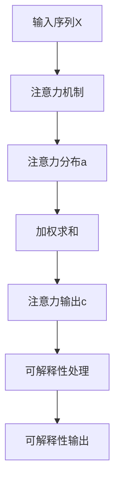

# 构建AI Agent的可解释性注意力机制

> 关键词：AI Agent、可解释性、注意力机制、深度学习、自然语言处理

> 摘要：本文围绕构建AI Agent的可解释性注意力机制展开，深入探讨了其核心概念、算法原理、数学模型等内容。通过实际案例展示了如何在项目中运用可解释性注意力机制，分析了其在不同领域的应用场景。同时，推荐了相关的学习资源、开发工具和论文著作。最后总结了该领域的未来发展趋势与挑战，并对常见问题进行了解答。旨在为开发者和研究人员提供全面且深入的技术指导，推动可解释性注意力机制在AI Agent中的应用与发展。

## 1. 背景介绍 

### 1.1 目的和范围
随着人工智能技术的飞速发展，AI Agent在众多领域得到了广泛应用，如自然语言处理、计算机视觉、机器人等。然而，这些AI Agent的决策过程往往缺乏可解释性，使得用户难以理解其行为和决策依据。可解释性注意力机制的引入旨在解决这一问题，通过让AI Agent在决策过程中明确展示其关注的信息，提高模型的透明度和可信度。

本文的范围涵盖了可解释性注意力机制的基本概念、算法原理、数学模型、实际应用案例以及相关的工具和资源推荐。我们将详细介绍如何构建可解释性注意力机制，并探讨其在不同场景下的应用。

### 1.2 预期读者
本文预期读者包括人工智能领域的研究人员、开发者、学生以及对AI Agent可解释性感兴趣的专业人士。无论是想要深入了解可解释性注意力机制的原理，还是希望在实际项目中应用该技术的读者，都能从本文中获得有价值的信息。

### 1.3 文档结构概述
本文将按照以下结构进行组织：
1. **核心概念与联系**：介绍可解释性注意力机制的基本概念，以及它与AI Agent、深度学习等领域的联系。
2. **核心算法原理 & 具体操作步骤**：详细阐述可解释性注意力机制的算法原理，并通过Python代码进行实现。
3. **数学模型和公式 & 详细讲解 & 举例说明**：使用数学公式描述可解释性注意力机制的工作原理，并通过具体例子进行说明。
4. **项目实战：代码实际案例和详细解释说明**：通过一个实际项目，展示如何在代码中实现可解释性注意力机制，并对代码进行详细解读。
5. **实际应用场景**：探讨可解释性注意力机制在不同领域的应用场景。
6. **工具和资源推荐**：推荐相关的学习资源、开发工具和论文著作。
7. **总结：未来发展趋势与挑战**：总结可解释性注意力机制的发展趋势，并分析其面临的挑战。
8. **附录：常见问题与解答**：解答读者在学习和应用可解释性注意力机制过程中常见的问题。
9. **扩展阅读 & 参考资料**：提供相关的扩展阅读材料和参考资料。

### 1.4 术语表

#### 1.4.1 核心术语定义
- **AI Agent**：人工智能代理，是一种能够感知环境、做出决策并采取行动的智能实体。
- **注意力机制**：一种在深度学习中广泛应用的技术，用于模拟人类的注意力分配过程，使模型能够自动关注输入序列中的重要部分。
- **可解释性**：指模型的决策过程和结果能够被人类理解和解释的特性。
- **可解释性注意力机制**：在注意力机制的基础上，增加了可解释性的特性，使得模型的注意力分配过程能够被清晰地展示和解释。

#### 1.4.2 相关概念解释
- **深度学习**：一种基于人工神经网络的机器学习方法，通过多层神经网络自动学习数据的特征和模式。
- **自然语言处理**：研究如何让计算机理解和处理人类语言的技术领域，包括文本分类、情感分析、机器翻译等任务。
- **计算机视觉**：研究如何让计算机理解和处理图像和视频的技术领域，包括图像分类、目标检测、图像生成等任务。

#### 1.4.3 缩略词列表
- **AI**：Artificial Intelligence，人工智能
- **NLP**：Natural Language Processing，自然语言处理
- **CV**：Computer Vision，计算机视觉
- **DNN**：Deep Neural Network，深度神经网络
- **RNN**：Recurrent Neural Network，循环神经网络
- **LSTM**：Long Short-Term Memory，长短期记忆网络
- **GRU**：Gated Recurrent Unit，门控循环单元
- **Transformer**：一种基于注意力机制的深度学习模型架构

## 2. 核心概念与联系 

### 2.1 注意力机制的基本原理
注意力机制的核心思想是模拟人类的注意力分配过程，使模型能够自动关注输入序列中的重要部分。在深度学习中，注意力机制通常用于处理序列数据，如自然语言文本、时间序列等。

假设我们有一个输入序列 $\mathbf{X} = [\mathbf{x}_1, \mathbf{x}_2, \cdots, \mathbf{x}_T]$，其中 $\mathbf{x}_t \in \mathbb{R}^d$ 表示第 $t$ 个时间步的输入向量，$T$ 表示序列的长度，$d$ 表示向量的维度。注意力机制通过计算一个注意力分布 $\mathbf{a} = [a_1, a_2, \cdots, a_T]$，其中 $a_t \in [0, 1]$ 表示在第 $t$ 个时间步的注意力权重，且 $\sum_{t=1}^T a_t = 1$。然后，将输入序列 $\mathbf{X}$ 与注意力分布 $\mathbf{a}$ 进行加权求和，得到注意力输出 $\mathbf{c}$：

$$\mathbf{c} = \sum_{t=1}^T a_t \mathbf{x}_t$$

### 2.2 可解释性注意力机制的引入
传统的注意力机制虽然能够有效地提高模型的性能，但往往缺乏可解释性。可解释性注意力机制的引入旨在解决这一问题，通过让模型的注意力分配过程能够被清晰地展示和解释，提高模型的透明度和可信度。

可解释性注意力机制通常通过以下几种方式实现：
- **可视化**：将注意力分布以可视化的方式展示出来，如热力图、柱状图等，让用户能够直观地看到模型关注的信息。
- **特征重要性分析**：分析注意力权重与输入特征之间的关系，找出对模型决策影响最大的特征。
- **规则提取**：从注意力分布中提取出可解释的规则，如“如果输入序列中包含某个关键词，则模型会重点关注该部分”。

### 2.3 可解释性注意力机制与AI Agent的联系
AI Agent需要能够感知环境、做出决策并采取行动。可解释性注意力机制可以帮助AI Agent在决策过程中明确展示其关注的信息，提高模型的透明度和可信度。例如，在自然语言处理任务中，AI Agent可以使用可解释性注意力机制来理解用户的输入，并展示其关注的关键词和句子，从而让用户更好地理解模型的决策过程。

### 2.4 核心概念原理和架构的文本示意图
```plaintext
输入序列 X = [x1, x2,..., xT]
|
| 注意力机制
|
V
注意力分布 a = [a1, a2,..., aT]
|
| 加权求和
|
V
注意力输出 c = sum(a_t * x_t)
|
| 可解释性处理
|
V
可解释性输出（可视化、特征重要性分析、规则提取等）
```

### 2.5 Mermaid流程图


## 3. 核心算法原理 & 具体操作步骤 

### 3.1 注意力机制的算法原理
常见的注意力机制包括点积注意力（Dot-Product Attention）、缩放点积注意力（Scaled Dot-Product Attention）和多头注意力（Multi-Head Attention）。下面我们以缩放点积注意力为例，详细介绍其算法原理。

缩放点积注意力的计算公式如下：

$$\text{Attention}(Q, K, V) = \text{softmax}\left(\frac{QK^T}{\sqrt{d_k}}\right)V$$

其中，$Q \in \mathbb{R}^{n \times d_k}$ 表示查询矩阵，$K \in \mathbb{R}^{m \times d_k}$ 表示键矩阵，$V \in \mathbb{R}^{m \times d_v}$ 表示值矩阵，$d_k$ 表示键向量的维度，$d_v$ 表示值向量的维度，$n$ 表示查询的数量，$m$ 表示键和值的数量。

### 3.2 可解释性注意力机制的实现步骤
1. **输入处理**：将输入序列进行编码，得到查询矩阵 $Q$、键矩阵 $K$ 和值矩阵 $V$。
2. **注意力计算**：根据缩放点积注意力的公式，计算注意力分布。
3. **可解释性处理**：对注意力分布进行可视化、特征重要性分析或规则提取等操作，得到可解释性输出。

### 3.3 Python代码实现
```python
import torch
import torch.nn as nn
import torch.nn.functional as F

class ScaledDotProductAttention(nn.Module):
    def __init__(self, d_k):
        super(ScaledDotProductAttention, self).__init__()
        self.d_k = d_k

    def forward(self, q, k, v, mask=None):
        attn_scores = torch.matmul(q, k.transpose(-2, -1)) / torch.sqrt(torch.tensor(self.d_k, dtype=torch.float32))
        if mask is not None:
            attn_scores = attn_scores.masked_fill(mask == 0, -1e9)
        attn_dist = F.softmax(attn_scores, dim=-1)
        output = torch.matmul(attn_dist, v)
        return output, attn_dist

# 示例使用
d_k = 64
batch_size = 32
seq_len = 10
input_dim = 128

q = torch.randn(batch_size, seq_len, d_k)
k = torch.randn(batch_size, seq_len, d_k)
v = torch.randn(batch_size, seq_len, input_dim)

attention_layer = ScaledDotProductAttention(d_k)
output, attn_dist = attention_layer(q, k, v)

print("Output shape:", output.shape)
print("Attention distribution shape:", attn_dist.shape)
```

### 3.4 代码解释
1. **`ScaledDotProductAttention` 类**：定义了缩放点积注意力层，其中 `__init__` 方法初始化了键向量的维度 $d_k$，`forward` 方法实现了缩放点积注意力的计算过程。
2. **注意力计算**：在 `forward` 方法中，首先计算查询矩阵 $Q$ 和键矩阵 $K$ 的点积，然后除以 $\sqrt{d_k}$ 进行缩放。如果存在掩码 `mask`，则将掩码为 0 的位置的注意力分数设置为一个非常小的负数，以避免在 `softmax` 函数中被选中。最后，使用 `softmax` 函数计算注意力分布，并将其与值矩阵 $V$ 相乘，得到注意力输出。
3. **示例使用**：创建了随机的查询矩阵 $Q$、键矩阵 $K$ 和值矩阵 $V$，并调用 `ScaledDotProductAttention` 类的 `forward` 方法进行注意力计算。最后，打印出注意力输出和注意力分布的形状。

## 4. 数学模型和公式 & 详细讲解 & 举例说明 

### 4.1 缩放点积注意力的数学模型
缩放点积注意力的数学模型可以用以下公式表示：

$$\text{Attention}(Q, K, V) = \text{softmax}\left(\frac{QK^T}{\sqrt{d_k}}\right)V$$

其中，$QK^T$ 表示查询矩阵 $Q$ 和键矩阵 $K$ 的点积，$\frac{QK^T}{\sqrt{d_k}}$ 表示缩放后的点积，$\text{softmax}$ 函数用于将缩放后的点积转换为注意力分布，最后将注意力分布与值矩阵 $V$ 相乘，得到注意力输出。

### 4.2 详细讲解
- **查询矩阵 $Q$**：表示模型需要关注的信息，通常是输入序列的编码表示。
- **键矩阵 $K$**：表示输入序列中的所有信息，用于与查询矩阵进行匹配。
- **值矩阵 $V$**：表示输入序列中的所有信息，用于根据注意力分布进行加权求和。
- **缩放因子 $\sqrt{d_k}$**：用于避免点积的结果过大，导致 `softmax` 函数的梯度消失。

### 4.3 举例说明
假设我们有一个输入序列 $\mathbf{X} = [\mathbf{x}_1, \mathbf{x}_2, \mathbf{x}_3]$，其中 $\mathbf{x}_i \in \mathbb{R}^d$ 表示第 $i$ 个时间步的输入向量。我们将输入序列进行编码，得到查询矩阵 $Q$、键矩阵 $K$ 和值矩阵 $V$：

$$Q = \begin{bmatrix} \mathbf{q}_1 \\ \mathbf{q}_2 \\ \mathbf{q}_3 \end{bmatrix}, \quad K = \begin{bmatrix} \mathbf{k}_1 \\ \mathbf{k}_2 \\ \mathbf{k}_3 \end{bmatrix}, \quad V = \begin{bmatrix} \mathbf{v}_1 \\ \mathbf{v}_2 \\ \mathbf{v}_3 \end{bmatrix}$$

其中，$\mathbf{q}_i$、$\mathbf{k}_i$ 和 $\mathbf{v}_i$ 分别表示查询向量、键向量和值向量。

首先，计算查询矩阵 $Q$ 和键矩阵 $K$ 的点积：

$$QK^T = \begin{bmatrix} \mathbf{q}_1 \cdot \mathbf{k}_1 & \mathbf{q}_1 \cdot \mathbf{k}_2 & \mathbf{q}_1 \cdot \mathbf{k}_3 \\ \mathbf{q}_2 \cdot \mathbf{k}_1 & \mathbf{q}_2 \cdot \mathbf{k}_2 & \mathbf{q}_2 \cdot \mathbf{k}_3 \\ \mathbf{q}_3 \cdot \mathbf{k}_1 & \mathbf{q}_3 \cdot \mathbf{k}_2 & \mathbf{q}_3 \cdot \mathbf{k}_3 \end{bmatrix}$$

然后，将点积结果除以 $\sqrt{d_k}$ 进行缩放：

$$\frac{QK^T}{\sqrt{d_k}} = \begin{bmatrix} \frac{\mathbf{q}_1 \cdot \mathbf{k}_1}{\sqrt{d_k}} & \frac{\mathbf{q}_1 \cdot \mathbf{k}_2}{\sqrt{d_k}} & \frac{\mathbf{q}_1 \cdot \mathbf{k}_3}{\sqrt{d_k}} \\ \frac{\mathbf{q}_2 \cdot \mathbf{k}_1}{\sqrt{d_k}} & \frac{\mathbf{q}_2 \cdot \mathbf{k}_2}{\sqrt{d_k}} & \frac{\mathbf{q}_2 \cdot \mathbf{k}_3}{\sqrt{d_k}} \\ \frac{\mathbf{q}_3 \cdot \mathbf{k}_1}{\sqrt{d_k}} & \frac{\mathbf{q}_3 \cdot \mathbf{k}_2}{\sqrt{d_k}} & \frac{\mathbf{q}_3 \cdot \mathbf{k}_3}{\sqrt{d_k}} \end{bmatrix}$$

接着，使用 `softmax` 函数将缩放后的点积结果转换为注意力分布：

$$\text{softmax}\left(\frac{QK^T}{\sqrt{d_k}}\right) = \begin{bmatrix} a_{11} & a_{12} & a_{13} \\ a_{21} & a_{22} & a_{23} \\ a_{31} & a_{32} & a_{33} \end{bmatrix}$$

其中，$a_{ij}$ 表示在第 $i$ 个查询向量下，第 $j$ 个键向量的注意力权重。

最后，将注意力分布与值矩阵 $V$ 相乘，得到注意力输出：

$$\text{Attention}(Q, K, V) = \begin{bmatrix} a_{11} \mathbf{v}_1 + a_{12} \mathbf{v}_2 + a_{13} \mathbf{v}_3 \\ a_{21} \mathbf{v}_1 + a_{22} \mathbf{v}_2 + a_{23} \mathbf{v}_3 \\ a_{31} \mathbf{v}_1 + a_{32} \mathbf{v}_2 + a_{33} \mathbf{v}_3 \end{bmatrix}$$

## 5. 项目实战：代码实际案例和详细解释说明 

### 5.1 开发环境搭建
本项目使用Python 3.8和PyTorch 1.9进行开发。可以使用以下命令安装所需的库：

```bash
pip install torch torchvision numpy matplotlib
```

### 5.2 源代码详细实现和代码解读
我们将使用一个简单的文本分类任务来演示可解释性注意力机制的应用。具体来说，我们将使用IMDB电影评论数据集，对电影评论进行情感分类（正面或负面）。

```python
import torch
import torch.nn as nn
import torch.optim as optim
from torchtext.legacy import data, datasets
import matplotlib.pyplot as plt

# 定义字段
TEXT = data.Field(tokenize='spacy', tokenizer_language='en_core_web_sm', include_lengths=True)
LABEL = data.LabelField(dtype=torch.float)

# 加载数据集
train_data, test_data = datasets.IMDB.splits(TEXT, LABEL)

# 划分验证集
train_data, valid_data = train_data.split()

# 构建词汇表
MAX_VOCAB_SIZE = 25000
TEXT.build_vocab(train_data, max_size=MAX_VOCAB_SIZE, vectors="glove.6B.100d")
LABEL.build_vocab(train_data)

# 创建迭代器
BATCH_SIZE = 64
device = torch.device('cuda' if torch.cuda.is_available() else 'cpu')
train_iterator, valid_iterator, test_iterator = data.BucketIterator.splits(
    (train_data, valid_data, test_data),
    batch_size=BATCH_SIZE,
    sort_within_batch=True,
    device=device
)

# 定义模型
class AttentionModel(nn.Module):
    def __init__(self, vocab_size, embedding_dim, hidden_dim, output_dim, n_layers, bidirectional, dropout):
        super(AttentionModel, self).__init__()
        self.embedding = nn.Embedding(vocab_size, embedding_dim)
        self.rnn = nn.LSTM(embedding_dim, hidden_dim, num_layers=n_layers, bidirectional=bidirectional, dropout=dropout)
        self.fc = nn.Linear(hidden_dim * 2 if bidirectional else hidden_dim, output_dim)
        self.dropout = nn.Dropout(dropout)
        self.attention = nn.Linear(hidden_dim * 2 if bidirectional else hidden_dim, 1)

    def forward(self, text, text_lengths):
        embedded = self.dropout(self.embedding(text))
        packed_embedded = nn.utils.rnn.pack_padded_sequence(embedded, text_lengths.to('cpu'))
        packed_output, (hidden, cell) = self.rnn(packed_embedded)
        output, output_lengths = nn.utils.rnn.pad_packed_sequence(packed_output)
        attn_scores = self.attention(output.permute(1, 0, 2))
        attn_dist = torch.softmax(attn_scores, dim=1)
        weighted_output = torch.sum(attn_dist * output.permute(1, 0, 2), dim=1)
        predictions = self.fc(weighted_output)
        return predictions, attn_dist

# 初始化模型
VOCAB_SIZE = len(TEXT.vocab)
EMBEDDING_DIM = 100
HIDDEN_DIM = 256
OUTPUT_DIM = 1
N_LAYERS = 2
BIDIRECTIONAL = True
DROPOUT = 0.5

model = AttentionModel(VOCAB_SIZE, EMBEDDING_DIM, HIDDEN_DIM, OUTPUT_DIM, N_LAYERS, BIDIRECTIONAL, DROPOUT)

# 加载预训练的词向量
pretrained_embeddings = TEXT.vocab.vectors
model.embedding.weight.data.copy_(pretrained_embeddings)

# 定义优化器和损失函数
optimizer = optim.Adam(model.parameters())
criterion = nn.BCEWithLogitsLoss()

model = model.to(device)
criterion = criterion.to(device)

# 训练模型
def train(model, iterator, optimizer, criterion):
    model.train()
    epoch_loss = 0
    for batch in iterator:
        optimizer.zero_grad()
        text, text_lengths = batch.text
        predictions, _ = model(text, text_lengths)
        loss = criterion(predictions.squeeze(1), batch.label)
        loss.backward()
        optimizer.step()
        epoch_loss += loss.item()
    return epoch_loss / len(iterator)

# 评估模型
def evaluate(model, iterator, criterion):
    model.eval()
    epoch_loss = 0
    with torch.no_grad():
        for batch in iterator:
            text, text_lengths = batch.text
            predictions, _ = model(text, text_lengths)
            loss = criterion(predictions.squeeze(1), batch.label)
            epoch_loss += loss.item()
    return epoch_loss / len(iterator)

# 训练模型
N_EPOCHS = 5
for epoch in range(N_EPOCHS):
    train_loss = train(model, train_iterator, optimizer, criterion)
    valid_loss = evaluate(model, valid_iterator, criterion)
    print(f'Epoch: {epoch+1:02}, Train Loss: {train_loss:.3f}, Val. Loss: {valid_loss:.3f}')

# 测试模型
test_loss = evaluate(model, test_iterator, criterion)
print(f'Test Loss: {test_loss:.3f}')

# 可视化注意力分布
import spacy
nlp = spacy.load('en_core_web_sm')

def predict_sentiment(model, sentence):
    model.eval()
    tokenized = [tok.text for tok in nlp.tokenizer(sentence)]
    indexed = [TEXT.vocab.stoi[t] for t in tokenized]
    length = [len(indexed)]
    tensor = torch.LongTensor(indexed).to(device)
    tensor = tensor.unsqueeze(1)
    length_tensor = torch.LongTensor(length)
    prediction, attn_dist = model(tensor, length_tensor)
    attn_dist = attn_dist.squeeze(1).squeeze(1).cpu().detach().numpy()
    plt.bar(range(len(tokenized)), attn_dist)
    plt.xticks(range(len(tokenized)), tokenized, rotation=90)
    plt.show()
    return torch.sigmoid(prediction).item()

# 测试一个句子
sentence = "This movie is amazing! I really enjoyed it."
prediction = predict_sentiment(model, sentence)
print(f'Predicted sentiment: {prediction:.3f}')
```

### 5.3 代码解读与分析
1. **数据处理**：使用 `torchtext` 库加载IMDB电影评论数据集，并进行分词、构建词汇表等操作。
2. **模型定义**：定义了一个基于LSTM和注意力机制的文本分类模型 `AttentionModel`。在模型的 `forward` 方法中，首先将输入文本进行词嵌入，然后通过LSTM层提取特征。接着，使用注意力机制计算注意力分布，并将注意力分布与LSTM的输出进行加权求和。最后，将加权后的输出通过全连接层得到预测结果。
3. **训练和评估**：使用 `Adam` 优化器和 `BCEWithLogitsLoss` 损失函数对模型进行训练和评估。
4. **可视化注意力分布**：定义了 `predict_sentiment` 函数，用于对输入的句子进行情感分类，并可视化注意力分布。通过观察注意力分布，我们可以直观地看到模型在决策过程中关注的词语。

## 6. 实际应用场景 
### 6.1 自然语言处理
- **文本分类**：在文本分类任务中，可解释性注意力机制可以帮助我们理解模型为什么将某个文本分类为特定的类别。例如，在电影评论情感分类任务中，通过可视化注意力分布，我们可以看到模型关注的关键词，如“amazing”、“enjoyed”等，从而更好地理解模型的决策过程。
- **机器翻译**：在机器翻译任务中，可解释性注意力机制可以帮助我们理解模型在翻译过程中如何关注源语言和目标语言的信息。例如，在将英文句子翻译成中文句子时，模型可以通过注意力机制关注源语言中的重要词语，并将其正确地翻译成目标语言。
- **问答系统**：在问答系统中，可解释性注意力机制可以帮助我们理解模型如何从问题和文档中提取答案。例如，在阅读理解任务中，模型可以通过注意力机制关注文档中的重要句子和段落，从而找到问题的答案。

### 6.2 计算机视觉
- **图像分类**：在图像分类任务中，可解释性注意力机制可以帮助我们理解模型为什么将某个图像分类为特定的类别。例如，在猫和狗的图像分类任务中，通过可视化注意力分布，我们可以看到模型关注的图像区域，如猫的眼睛、狗的鼻子等，从而更好地理解模型的决策过程。
- **目标检测**：在目标检测任务中，可解释性注意力机制可以帮助我们理解模型如何检测图像中的目标。例如，在人脸检测任务中，模型可以通过注意力机制关注图像中的人脸区域，从而准确地检测出人脸的位置和大小。
- **图像生成**：在图像生成任务中，可解释性注意力机制可以帮助我们理解模型如何生成图像。例如，在生成动漫人物图像的任务中，模型可以通过注意力机制关注不同的图像特征，如头发、眼睛、衣服等，从而生成逼真的动漫人物图像。

### 6.3 医疗保健
- **疾病诊断**：在疾病诊断任务中，可解释性注意力机制可以帮助医生理解模型为什么做出某个诊断结果。例如，在乳腺癌诊断任务中，通过可视化注意力分布，医生可以看到模型关注的乳腺图像区域，如肿块、钙化等，从而更好地理解模型的诊断依据。
- **药物研发**：在药物研发任务中，可解释性注意力机制可以帮助研究人员理解模型如何预测药物的疗效和副作用。例如，在预测抗癌药物疗效的任务中，模型可以通过注意力机制关注药物分子的结构和靶点，从而预测药物的疗效和副作用。
- **健康监测**：在健康监测任务中，可解释性注意力机制可以帮助用户理解模型如何分析健康数据。例如，在监测心率和血压的任务中，模型可以通过注意力机制关注不同时间段的心率和血压数据，从而分析用户的健康状况。

## 7. 工具和资源推荐
### 7.1 学习资源推荐
#### 7.1.1 书籍推荐
- 《深度学习》（Deep Learning）：由Ian Goodfellow、Yoshua Bengio和Aaron Courville合著，是深度学习领域的经典教材，涵盖了深度学习的基本概念、算法和应用。
- 《动手学深度学习》（Dive into Deep Learning）：由李沐、Aston Zhang等人合著，是一本开源的深度学习教材，提供了丰富的代码示例和实践项目，适合初学者学习。
- 《自然语言处理入门》（Natural Language Processing with Python）：由Steven Bird、Ewan Klein和Edward Loper合著，介绍了自然语言处理的基本概念、算法和工具，使用Python进行实现。

#### 7.1.2 在线课程
- Coursera上的“深度学习专项课程”（Deep Learning Specialization）：由Andrew Ng教授授课，涵盖了深度学习的各个方面，包括神经网络、卷积神经网络、循环神经网络等。
- edX上的“人工智能基础”（Foundations of Artificial Intelligence）：由UC Berkeley的Pieter Abbeel教授授课，介绍了人工智能的基本概念、算法和应用。
- 网易云课堂上的“Python深度学习实战”：由唐宇迪老师授课，通过实际项目介绍了Python和深度学习的应用。

#### 7.1.3 技术博客和网站
- Medium：一个技术博客平台，上面有很多关于人工智能、深度学习和自然语言处理的文章。
- arXiv：一个预印本论文平台，上面有很多最新的人工智能和深度学习研究成果。
- Towards Data Science：一个数据科学和人工智能领域的博客平台，提供了很多实用的技术文章和教程。

### 7.2 开发工具框架推荐
#### 7.2.1 IDE和编辑器
- PyCharm：一款专门为Python开发设计的集成开发环境，提供了丰富的代码编辑、调试和项目管理功能。
- Jupyter Notebook：一个交互式的开发环境，适合进行数据分析、模型训练和可视化。
- Visual Studio Code：一款轻量级的代码编辑器，支持多种编程语言和插件，可用于Python开发。

#### 7.2.2 调试和性能分析工具
- PyTorch Profiler：PyTorch提供的性能分析工具，可用于分析模型的运行时间、内存使用等情况。
- TensorBoard：TensorFlow提供的可视化工具，也可用于PyTorch模型的可视化和性能分析。
- cProfile：Python标准库中的性能分析工具，可用于分析Python代码的运行时间和函数调用情况。

#### 7.2.3 相关框架和库
- PyTorch：一个开源的深度学习框架，提供了丰富的神经网络层和优化算法，易于使用和扩展。
- TensorFlow：一个开源的深度学习框架，广泛应用于工业界和学术界，提供了丰富的工具和库。
- Hugging Face Transformers：一个开源的自然语言处理库，提供了预训练的Transformer模型和工具，可用于文本分类、机器翻译等任务。

### 7.3 相关论文著作推荐
#### 7.3.1 经典论文
- “Attention Is All You Need”：提出了Transformer模型，是注意力机制在深度学习中的经典应用。
- “Long Short-Term Memory”：介绍了长短期记忆网络（LSTM），是循环神经网络的重要改进。
- “Gradient-Based Learning Applied to Document Recognition”：介绍了卷积神经网络（CNN）在手写字符识别中的应用，是CNN的经典论文。

#### 7.3.2 最新研究成果
- “Explainable AI: A Systematic Review of Machine Learning Interpretability Methods”：对可解释性人工智能的研究进行了系统的综述。
- “Interpretability Beyond Feature Attribution: Quantitative Testing with Concept Activation Vectors (TCAV)”：提出了概念激活向量（TCAV）方法，用于解释深度学习模型的决策过程。
- “Towards A Rigorous Science of Interpretable Machine Learning”：探讨了可解释性机器学习的理论基础和研究方法。

#### 7.3.3 应用案例分析
- “Interpretability in Natural Language Processing: A Survey of Challenges, Methods, and Applications”：对自然语言处理中的可解释性问题进行了综述，并介绍了相关的应用案例。
- “Explainable Computer Vision: A Survey”：对计算机视觉中的可解释性问题进行了综述，并介绍了相关的应用案例。
- “Interpretability in Healthcare AI: A Review”：对医疗保健领域中的可解释性人工智能问题进行了综述，并介绍了相关的应用案例。

## 8. 总结：未来发展趋势与挑战
### 8.1 未来发展趋势
- **多模态可解释性**：随着人工智能技术的发展，多模态数据（如文本、图像、视频等）的处理越来越重要。未来的可解释性注意力机制将不仅关注单一模态的数据，还将考虑多模态数据之间的交互和融合，提供更全面的解释。
- **自适应可解释性**：不同的用户对模型的可解释性需求可能不同。未来的可解释性注意力机制将能够根据用户的需求和场景，自适应地提供不同层次和粒度的解释，提高用户的满意度。
- **与强化学习的结合**：强化学习在机器人控制、游戏等领域有着广泛的应用。未来的可解释性注意力机制将与强化学习相结合，帮助机器人更好地理解环境和决策过程，提高其智能水平和安全性。

### 8.2 挑战
- **计算效率**：可解释性注意力机制通常需要额外的计算资源来生成解释，这可能会影响模型的计算效率。如何在保证可解释性的前提下，提高模型的计算效率是一个重要的挑战。
- **解释的准确性**：生成的解释是否准确地反映了模型的决策过程是一个关键问题。由于深度学习模型的复杂性，解释的准确性可能会受到多种因素的影响，如模型结构、数据分布等。
- **用户理解**：即使生成了准确的解释，用户是否能够理解这些解释也是一个挑战。如何将复杂的解释以简单易懂的方式呈现给用户，提高用户对模型的信任和接受度是一个重要的研究方向。

## 9. 附录：常见问题与解答
### 9.1 可解释性注意力机制与传统注意力机制有什么区别？
传统的注意力机制主要用于提高模型的性能，而可解释性注意力机制在提高模型性能的同时，还注重模型决策过程的可解释性。可解释性注意力机制通过可视化、特征重要性分析、规则提取等方式，让用户能够更好地理解模型的决策依据。

### 9.2 如何评估可解释性注意力机制的效果？
评估可解释性注意力机制的效果可以从多个方面进行，如解释的准确性、用户的满意度、模型的性能等。可以使用一些定量的指标来评估解释的准确性，如特征重要性的相关性、规则的覆盖率等。同时，也可以通过用户调研等方式来评估用户的满意度。

### 9.3 可解释性注意力机制是否会降低模型的性能？
在某些情况下，可解释性注意力机制可能会引入一些额外的计算开销，从而影响模型的计算效率。但是，通过合理的设计和优化，可解释性注意力机制可以在保证可解释性的前提下，不显著降低模型的性能。

### 9.4 可解释性注意力机制适用于哪些类型的模型？
可解释性注意力机制适用于各种类型的深度学习模型，如神经网络、卷积神经网络、循环神经网络等。特别是在处理序列数据和多模态数据的任务中，可解释性注意力机制具有很好的应用前景。

## 10. 扩展阅读 & 参考资料
- Goodfellow, I., Bengio, Y., & Courville, A. (2016). Deep Learning. MIT Press.
- Zhang, A., Lipton, Z. C., Li, M., & Smola, A. J. (2020). Dive into Deep Learning.
- Bird, S., Klein, E., & Loper, E. (2009). Natural Language Processing with Python. O'Reilly Media.
- Vaswani, A., Shazeer, N., Parmar, N., Uszkoreit, J., Jones, L., Gomez, A. N.,... & Polosukhin, I. (2017). Attention is all you need. In Advances in neural information processing systems (pp. 5998-6008).
- Hochreiter, S., & Schmidhuber, J. (1997). Long short-term memory. Neural computation, 9(8), 1735-1780.
- LeCun, Y., Bottou, L., Bengio, Y., & Haffner, P. (1998). Gradient-based learning applied to document recognition. Proceedings of the IEEE, 86(11), 2278-2324.

作者：AI天才研究院/AI Genius Institute & 禅与计算机程序设计艺术 /Zen And The Art of Computer Programming