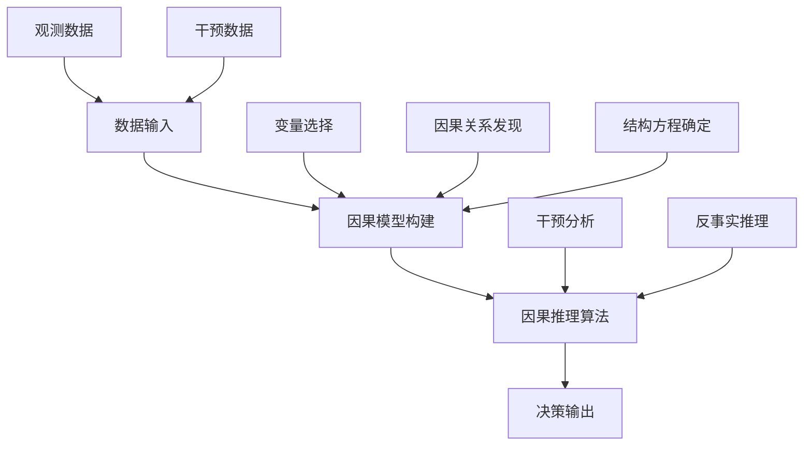

# 构建AI Agent的因果推理模块

> 关键词：AI Agent、因果推理模块、因果模型、算法原理、实际应用

> 摘要：本文聚焦于构建AI Agent的因果推理模块。首先介绍了该模块构建的背景信息，包括目的、预期读者等。接着阐述了核心概念与联系，详细讲解了因果推理的原理和架构。通过Python代码说明了核心算法原理及具体操作步骤，还给出了相关的数学模型和公式并举例说明。然后进行项目实战，从开发环境搭建到源代码实现与解读进行了全面分析。之后探讨了实际应用场景，推荐了学习、开发工具及相关论文著作。最后总结了未来发展趋势与挑战，提供了常见问题解答及扩展阅读参考资料，旨在为构建AI Agent的因果推理模块提供全面且深入的指导。

## 1. 背景介绍 
### 1.1 目的和范围
在当今人工智能的发展进程中，AI Agent的能力提升至关重要。传统的AI Agent往往基于相关性进行决策和推理，但在许多复杂的现实场景中，仅仅依靠相关性是不够的，需要深入理解事物之间的因果关系。构建AI Agent的因果推理模块的目的在于赋予AI Agent更强大的决策能力和智能水平，使其能够像人类一样理解因果机制，从而做出更合理、更具前瞻性的决策。

本文章的范围涵盖了从因果推理的基本概念到如何在AI Agent中实现因果推理模块的全过程。包括因果推理的核心算法原理、数学模型，以及通过实际项目案例展示如何构建和应用该模块。同时，还会探讨该模块在不同领域的实际应用场景，为读者提供全面的知识体系。

### 1.2 预期读者
本文的预期读者主要包括人工智能领域的研究人员、开发者和工程师。对于正在研究AI Agent技术的科研人员来说，文章提供了关于因果推理模块的深入理论和最新研究成果，有助于拓展研究思路。对于开发者和工程师而言，详细的代码实现和项目实战案例能够帮助他们在实际项目中构建和优化AI Agent的因果推理模块。此外，对人工智能和因果推理感兴趣的学生和爱好者也可以从本文中获得基础知识和学习资源。

### 1.3 文档结构概述
本文将按照以下结构进行阐述：
- 核心概念与联系：介绍因果推理的基本概念、相关原理以及与AI Agent的联系，并通过文本示意图和Mermaid流程图进行直观展示。
- 核心算法原理 & 具体操作步骤：详细讲解因果推理的核心算法，使用Python源代码进行说明，并给出具体的操作步骤。
- 数学模型和公式 & 详细讲解 & 举例说明：介绍因果推理所涉及的数学模型和公式，进行详细的讲解，并通过具体例子加深理解。
- 项目实战：通过实际项目案例，从开发环境搭建、源代码实现到代码解读，全面展示如何构建AI Agent的因果推理模块。
- 实际应用场景：探讨因果推理模块在不同领域的实际应用场景。
- 工具和资源推荐：推荐学习因果推理和构建AI Agent的相关书籍、在线课程、技术博客、开发工具、框架和论文著作。
- 总结：总结未来发展趋势与挑战。
- 附录：提供常见问题与解答。
- 扩展阅读 & 参考资料：列出相关的扩展阅读材料和参考资料。

### 1.4 术语表
#### 1.4.1 核心术语定义
- **AI Agent**：人工智能体，是一种能够感知环境、进行决策并采取行动以实现特定目标的软件或硬件实体。
- **因果推理**：从数据中识别和推断变量之间因果关系的过程，不仅仅关注变量之间的相关性，更强调因果机制。
- **因果模型**：用于表示变量之间因果关系的数学模型，常见的有结构因果模型（SCM）等。
- **干预**：在因果推理中，通过主动改变某个变量的值来观察其他变量的变化，以确定因果关系。

#### 1.4.2 相关概念解释
- **相关性与因果性**：相关性是指两个或多个变量之间的统计关联，而因果性则意味着一个变量的变化直接导致另一个变量的变化。例如，冰淇淋销量和溺水人数之间存在相关性，但它们之间并没有因果关系，而是都受到气温这个共同因素的影响。
- **反事实推理**：在因果推理中，反事实推理是指想象如果某个事件没有发生或者以不同的方式发生，结果会如何。例如，假设一个人服用了某种药物后康复了，反事实推理会思考如果这个人没有服用该药物，是否还会康复。

#### 1.4.3 缩略词列表
- **SCM**：Structural Causal Model，结构因果模型
- **DAG**：Directed Acyclic Graph，有向无环图

## 2. 核心概念与联系 
### 因果推理的基本概念
因果推理旨在从数据中揭示变量之间的因果关系。与传统的相关性分析不同，因果推理更关注变量之间的因果机制，即一个变量的变化如何直接导致另一个变量的变化。例如，在医学研究中，因果推理可以帮助确定某种药物是否真的能够治愈疾病，而不仅仅是观察到药物使用和疾病康复之间的相关性。

### 因果推理与AI Agent的联系
AI Agent通常需要根据环境信息做出决策。在许多情况下，仅仅依靠相关性进行决策可能会导致错误的结果。引入因果推理模块可以使AI Agent更好地理解环境中的因果关系，从而做出更合理、更具前瞻性的决策。例如，在自动驾驶领域，AI Agent需要判断不同驾驶行为（如加速、刹车）与事故发生之间的因果关系，以便在复杂的交通环境中做出安全的决策。

### 因果推理的原理和架构
因果推理的核心原理是基于因果模型。常见的因果模型是结构因果模型（SCM），它由一组变量和一组结构方程组成，用于描述变量之间的因果关系。SCM可以用有向无环图（DAG）来表示，其中节点表示变量，有向边表示因果关系。

以下是因果推理原理和架构的文本示意图：

```plaintext
因果推理模块
|
|-- 数据输入
|   |-- 观测数据
|   |-- 干预数据
|
|-- 因果模型构建
|   |-- 变量选择
|   |-- 因果关系发现
|   |-- 结构方程确定
|
|-- 因果推理算法
|   |-- 干预分析
|   |-- 反事实推理
|
|-- 决策输出
```

以下是对应的Mermaid流程图：



## 3. 核心算法原理 & 具体操作步骤 
### 因果推理的核心算法原理
在因果推理中，一个重要的算法是基于结构因果模型的干预分析。干预分析的目标是通过主动改变某个变量的值来观察其他变量的变化，从而确定因果关系。以下是干预分析的Python代码示例：

```python
import numpy as np
import pandas as pd
import networkx as nx
from dowhy import CausalModel

# 生成一些示例数据
np.random.seed(0)
N = 1000
X = np.random.normal(0, 1, N)
Y = 2 * X + np.random.normal(0, 1, N)
Z = 0.5 * X + np.random.normal(0, 1, N)
data = pd.DataFrame({'X': X, 'Y': Y, 'Z': Z})

# 定义因果图
graph = nx.DiGraph()
graph.add_edges_from([('X', 'Y'), ('X', 'Z')])

# 构建因果模型
model = CausalModel(
    data=data,
    treatment='X',
    outcome='Y',
    graph=nx.drawing.nx_pydot.to_pydot(graph).to_string()
)

# 进行因果推理
identified_estimand = model.identify_effect()
estimate = model.estimate_effect(identified_estimand,
                                 method_name="backdoor.linear_regression",
                                 test_significance=True)

print("因果效应估计值:", estimate.value)
```

### 具体操作步骤
1. **数据准备**：收集相关的观测数据和干预数据。观测数据是指在自然状态下收集到的数据，而干预数据是指在主动改变某个变量的值后收集到的数据。
2. **因果图构建**：根据领域知识或数据挖掘方法，构建表示变量之间因果关系的有向无环图（DAG）。
3. **因果模型构建**：使用收集到的数据和构建好的因果图，构建结构因果模型（SCM）。
4. **因果推理**：选择合适的因果推理算法，如干预分析、反事实推理等，对因果模型进行推理，得到因果效应的估计值。
5. **结果评估**：对因果推理的结果进行评估，判断其可靠性和有效性。可以使用统计检验、交叉验证等方法进行评估。

## 4. 数学模型和公式 & 详细讲解 & 举例说明 
### 结构因果模型（SCM）
结构因果模型（SCM）是因果推理中常用的数学模型。一个SCM由一组变量 $V = \{V_1, V_2, \cdots, V_n\}$ 和一组结构方程 $F = \{f_1, f_2, \cdots, f_n\}$ 组成。每个结构方程 $f_i$ 描述了变量 $V_i$ 如何依赖于其他变量和一个外生噪声变量 $U_i$。

数学公式表示为：
$$V_i = f_i(Pa(V_i), U_i), \quad i = 1, 2, \cdots, n$$
其中，$Pa(V_i)$ 表示变量 $V_i$ 的父节点集合，即对 $V_i$ 有直接因果影响的变量集合。

### 干预和因果效应
在因果推理中，干预是指主动改变某个变量的值。假设我们对变量 $X$ 进行干预，将其值固定为 $x$，记为 $do(X = x)$。在干预下，变量 $Y$ 的期望值与未干预时的期望值之差称为因果效应。

数学公式表示为：
$$ACE = E[Y|do(X = 1)] - E[Y|do(X = 0)]$$
其中，$ACE$ 表示平均因果效应。

### 举例说明
假设有一个简单的因果模型，变量 $X$ 表示是否服用某种药物，变量 $Y$ 表示是否康复，变量 $Z$ 表示患者的年龄。结构方程如下：
$$X = U_X$$
$$Z = U_Z$$
$$Y = 2X + 0.5Z + U_Y$$

假设我们想估计服用药物对康复的因果效应。首先，我们可以通过干预分析，计算 $E[Y|do(X = 1)]$ 和 $E[Y|do(X = 0)]$。

在这个例子中，当 $X = 1$ 时：
$$E[Y|do(X = 1)] = E[2\times1 + 0.5Z + U_Y] = 2 + 0.5E[Z] + E[U_Y]$$

当 $X = 0$ 时：
$$E[Y|do(X = 0)] = E[2\times0 + 0.5Z + U_Y] = 0.5E[Z] + E[U_Y]$$

则因果效应为：
$$ACE = E[Y|do(X = 1)] - E[Y|do(X = 0)] = 2$$

这意味着服用药物会使康复的概率平均提高 2 个单位。

## 5. 项目实战：代码实际案例和详细解释说明 
### 5.1  开发环境搭建
为了实现AI Agent的因果推理模块，我们需要搭建相应的开发环境。以下是具体步骤：
1. **安装Python**：推荐使用Python 3.7及以上版本。可以从Python官方网站（https://www.python.org/downloads/）下载并安装。
2. **安装必要的库**：使用pip命令安装以下库：
```bash
pip install numpy pandas networkx dowhy
```
- `numpy`：用于数值计算。
- `pandas`：用于数据处理和分析。
- `networkx`：用于图论和网络分析。
- `dowhy`：用于因果推理。

### 5.2  源代码详细实现和代码解读
以下是一个完整的项目实战代码示例：

```python
import numpy as np
import pandas as pd
import networkx as nx
from dowhy import CausalModel

# 生成示例数据
np.random.seed(42)
N = 1000
X = np.random.binomial(1, 0.5, N)  # 治疗变量
Z = np.random.normal(0, 1, N)  # 混淆变量
Y = 2 * X + 0.5 * Z + np.random.normal(0, 1, N)  # 结果变量
data = pd.DataFrame({'X': X, 'Z': Z, 'Y': Y})

# 定义因果图
graph = nx.DiGraph()
graph.add_edges_from([('Z', 'X'), ('Z', 'Y'), ('X', 'Y')])

# 构建因果模型
model = CausalModel(
    data=data,
    treatment='X',
    outcome='Y',
    graph=nx.drawing.nx_pydot.to_pydot(graph).to_string()
)

# 识别因果效应
identified_estimand = model.identify_effect()

# 估计因果效应
estimate = model.estimate_effect(identified_estimand,
                                 method_name="backdoor.linear_regression",
                                 test_significance=True)

# 打印因果效应估计值
print("因果效应估计值:", estimate.value)

# 进行敏感性分析
refute_results = model.refute_estimate(identified_estimand, estimate,
                                       method_name="random_common_cause")
print("敏感性分析结果:", refute_results)
```

### 代码解读与分析
1. **数据生成**：使用`numpy`生成示例数据，包括治疗变量 $X$、混淆变量 $Z$ 和结果变量 $Y$。
2. **因果图定义**：使用`networkx`定义因果图，描述变量之间的因果关系。
3. **因果模型构建**：使用`dowhy`库构建因果模型，指定数据、治疗变量、结果变量和因果图。
4. **因果效应识别**：调用`model.identify_effect()`方法识别因果效应。
5. **因果效应估计**：使用`backdoor.linear_regression`方法估计因果效应，并进行显著性检验。
6. **敏感性分析**：调用`model.refute_estimate()`方法进行敏感性分析，检查因果效应估计的稳健性。

## 6. 实际应用场景 
### 医疗领域
在医疗领域，因果推理模块可以帮助医生确定某种治疗方法是否真的对患者有效。例如，通过分析大量的临床数据，使用因果推理可以判断某种药物是否能够降低患者的死亡率，而不仅仅是观察到药物使用和死亡率之间的相关性。此外，因果推理还可以用于个性化医疗，根据患者的基因信息、病史等因素，为患者制定最适合的治疗方案。

### 金融领域
在金融领域，因果推理模块可以帮助投资者评估投资策略的有效性。例如，通过分析市场数据，使用因果推理可以判断某种投资策略是否真的能够带来更高的回报率，而不是仅仅因为市场的整体趋势而获得收益。此外，因果推理还可以用于风险管理，识别影响金融市场波动的因果因素，提前采取措施防范风险。

### 自动驾驶领域
在自动驾驶领域，因果推理模块可以帮助AI Agent更好地理解交通环境中的因果关系。例如，通过分析传感器数据，使用因果推理可以判断不同驾驶行为（如加速、刹车）与事故发生之间的因果关系，从而在复杂的交通环境中做出安全的决策。此外，因果推理还可以用于故障诊断，当自动驾驶系统出现故障时，通过分析相关数据，找出故障的根本原因。

## 7. 工具和资源推荐
### 7.1 学习资源推荐
#### 7.1.1 书籍推荐
- 《因果论：模型、推理和推断》（*Causality: Models, Reasoning, and Inference*）：朱迪亚·珀尔（Judea Pearl）著，是因果推理领域的经典著作，系统介绍了因果推理的理论和方法。
- 《为什么：关于因果关系的新科学》（*The Book of Why: The New Science of Cause and Effect*）：朱迪亚·珀尔（Judea Pearl）和达纳·麦肯齐（Dana Mackenzie）著，以通俗易懂的语言介绍了因果推理的基本概念和应用。

#### 7.1.2 在线课程
- Coursera上的“因果推理”（*Causal Inference*）课程：由密歇根大学的研究人员授课，系统介绍了因果推理的理论和方法。
- edX上的“因果推断与机器学习”（*Causal Inference and Machine Learning*）课程：结合了因果推断和机器学习的知识，介绍了如何在实际项目中应用因果推理。

#### 7.1.3 技术博客和网站
- 因果推断社区（https://www.causalinference.org/）：提供了因果推理领域的最新研究成果、会议信息和开源代码。
- 因果科学与CausalAI社区（https://causalscience.cn/）：专注于因果科学和因果AI的研究和应用，分享了许多优质的技术文章和案例。

### 7.2 开发工具框架推荐
#### 7.2.1 IDE和编辑器
- PyCharm：是一款专业的Python集成开发环境，提供了丰富的代码编辑、调试和项目管理功能。
- Jupyter Notebook：是一个交互式的开发环境，适合进行数据探索和代码演示。

#### 7.2.2 调试和性能分析工具
- PDB：Python自带的调试工具，可以帮助开发者调试代码。
- cProfile：Python自带的性能分析工具，可以帮助开发者找出代码中的性能瓶颈。

#### 7.2.3 相关框架和库
- DoWhy：是一个开源的因果推理库，提供了多种因果推理算法和工具，支持从数据准备到因果效应估计的全过程。
- CausalML：是一个开源的因果机器学习库，结合了因果推断和机器学习的方法，提供了多种因果效应估计和预测模型。

### 7.3 相关论文著作推荐
#### 7.3.1 经典论文
- Pearl, J. (2009). *Causality: Models, Reasoning, and Inference*. Cambridge University Press. 该论文是因果推理领域的经典之作，提出了结构因果模型和因果图的概念。
- Rubin, D. B. (1974). Estimating causal effects of treatments in randomized and nonrandomized studies. *Journal of Educational Psychology*, 66(5), 688-701. 该论文提出了潜在结果框架，为因果推断提供了重要的理论基础。

#### 7.3.2 最新研究成果
- Athey, S., & Imbens, G. W. (2016). Recursive partitioning for heterogeneous causal effects. *Proceedings of the National Academy of Sciences*, 113(27), 7353-7360. 该论文提出了递归分区方法，用于估计异质因果效应。
- Pearl, J., & Mackenzie, D. (2018). *The Book of Why: The New Science of Cause and Effect*. Basic Books. 该著作以通俗易懂的语言介绍了因果推理的最新研究成果和应用。

#### 7.3.3 应用案例分析
- Hill, J. L. (2011). Bayesian nonparametric modeling for causal inference. *Journal of Computational and Graphical Statistics*, 20(1), 217-240. 该论文介绍了如何使用贝叶斯非参数模型进行因果推断，并应用于教育领域的案例分析。
- Wager, S., & Athey, S. (2018). Estimation and inference of heterogeneous treatment effects using random forests. *Journal of the American Statistical Association*, 113(523), 1228-1242. 该论文介绍了如何使用随机森林估计异质治疗效应，并应用于医疗领域的案例分析。

## 8. 总结：未来发展趋势与挑战
### 未来发展趋势
- **与机器学习的深度融合**：因果推理与机器学习的结合将是未来的一个重要发展趋势。通过将因果推理的思想引入机器学习模型，可以提高模型的可解释性和泛化能力。例如，在深度学习中引入因果结构，可以使模型更好地理解数据中的因果关系，从而做出更合理的决策。
- **多源数据融合**：随着数据的不断增长和多样化，如何融合多源数据进行因果推理将是一个重要的研究方向。例如，将医疗数据、生物数据和环境数据等多源数据融合，可以更全面地了解疾病的发生和发展机制，为个性化医疗提供更准确的依据。
- **应用领域的拓展**：因果推理模块将在更多的领域得到应用，如智能交通、智能农业、智能家居等。通过在这些领域应用因果推理模块，可以提高系统的智能化水平和决策能力，为人们的生活带来更多的便利。

### 挑战
- **数据质量和数量**：因果推理需要大量高质量的数据，而在实际应用中，数据往往存在噪声、缺失值等问题，这会影响因果推理的准确性。此外，获取足够多的数据也是一个挑战，特别是在一些新兴领域。
- **因果关系的复杂性**：现实世界中的因果关系往往非常复杂，存在多个因果路径和混淆因素。如何准确地识别和处理这些复杂的因果关系是因果推理面临的一个重要挑战。
- **计算复杂度**：一些因果推理算法的计算复杂度较高，特别是在处理大规模数据和复杂因果模型时。如何提高算法的计算效率，降低计算复杂度是需要解决的问题。

## 9. 附录：常见问题与解答
### 问题1：因果推理和相关性分析有什么区别？
因果推理关注变量之间的因果机制，即一个变量的变化如何直接导致另一个变量的变化。而相关性分析仅仅关注变量之间的统计关联，不考虑因果关系。例如，冰淇淋销量和溺水人数之间存在相关性，但它们之间并没有因果关系，而是都受到气温这个共同因素的影响。

### 问题2：如何判断因果关系的可靠性？
可以通过以下方法判断因果关系的可靠性：
- **实验设计**：进行随机对照实验是判断因果关系最可靠的方法。通过随机分配实验组和对照组，可以控制其他因素的影响，从而更准确地判断因果关系。
- **敏感性分析**：进行敏感性分析可以检查因果效应估计的稳健性。如果在不同的假设和条件下，因果效应的估计值变化不大，则说明因果关系比较可靠。
- **领域知识**：结合领域知识可以帮助判断因果关系的合理性。如果因果关系符合领域知识和常识，则更有可能是可靠的。

### 问题3：因果推理模块在实际应用中需要注意什么？
在实际应用中，需要注意以下几点：
- **数据质量**：确保数据的质量，处理好数据中的噪声、缺失值等问题。
- **因果图的构建**：因果图的构建需要结合领域知识和数据挖掘方法，确保因果图能够准确地表示变量之间的因果关系。
- **算法选择**：根据具体的问题和数据特点，选择合适的因果推理算法。不同的算法有不同的适用场景和优缺点。
- **结果评估**：对因果推理的结果进行评估，判断其可靠性和有效性。可以使用统计检验、交叉验证等方法进行评估。

## 10. 扩展阅读 & 参考资料
### 扩展阅读
- Pearl, J. (2010). An introduction to causal inference. *The International Journal of Biostatistics*, 6(1), 1-46.
- Imbens, G. W., & Rubin, D. B. (2015). *Causal Inference for Statistics, Social, and Biomedical Sciences: An Introduction*. Cambridge University Press.

### 参考资料
- DoWhy官方文档：https://microsoft.github.io/dowhy/
- CausalML官方文档：https://causalml.readthedocs.io/en/latest/

作者：AI天才研究院/AI Genius Institute & 禅与计算机程序设计艺术 /Zen And The Art of Computer Programming