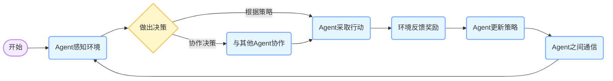

# 构建AI Agent的多Agent协作学习系统

> 关键词：AI Agent、多Agent协作学习、强化学习、通信机制、分布式系统

> 摘要：本文旨在深入探讨构建AI Agent的多Agent协作学习系统。首先介绍了该系统的背景，包括目的、预期读者等信息。接着阐述了核心概念及它们之间的联系，通过文本示意图和Mermaid流程图进行清晰展示。详细讲解了核心算法原理，并用Python代码进行说明，同时给出了相关的数学模型和公式。通过项目实战，展示了系统的具体实现过程。分析了系统的实际应用场景，推荐了学习、开发相关的工具和资源。最后对系统的未来发展趋势与挑战进行总结，并提供常见问题解答和扩展阅读资料。

## 1. 背景介绍 
### 1.1 目的和范围
随着人工智能技术的不断发展，单一的AI Agent在面对复杂任务时往往表现出一定的局限性。多Agent协作学习系统旨在通过多个AI Agent之间的协作，充分发挥各自的优势，共同完成复杂的任务。本系统的构建旨在提高任务解决的效率和质量，应用范围涵盖了机器人协作、智能交通、分布式计算等多个领域。

### 1.2 预期读者
本文的预期读者包括人工智能领域的研究人员、开发者、对多Agent系统感兴趣的学生以及相关行业的从业者。这些读者需要具备一定的编程基础和人工智能相关知识，以便更好地理解本文的内容。

### 1.3 文档结构概述
本文将按照以下结构进行组织：首先介绍核心概念与联系，让读者对多Agent协作学习系统有一个初步的认识；接着详细讲解核心算法原理和具体操作步骤，并用Python代码进行实现；然后给出数学模型和公式，帮助读者从理论层面理解系统；通过项目实战，展示系统的实际开发过程；分析系统的实际应用场景；推荐相关的学习、开发工具和资源；最后总结系统的未来发展趋势与挑战，并提供常见问题解答和扩展阅读资料。

### 1.4 术语表
#### 1.4.1 核心术语定义
- **AI Agent**：人工智能代理，是一种能够感知环境、做出决策并采取行动的智能实体。
- **多Agent协作学习**：多个AI Agent通过相互协作，共同学习以完成特定任务的过程。
- **强化学习**：一种机器学习方法，Agent通过与环境进行交互，根据环境反馈的奖励信号来学习最优策略。
- **通信机制**：多Agent之间进行信息交换的方式和规则。
- **分布式系统**：由多个独立的计算单元组成，通过网络进行通信和协作的系统。

#### 1.4.2 相关概念解释
- **环境**：AI Agent所处的外部世界，Agent通过感知环境获取信息，并对环境产生影响。
- **策略**：Agent根据感知到的环境信息做出决策的规则。
- **奖励信号**：环境对Agent的行为给予的反馈，用于指导Agent学习最优策略。

#### 1.4.3 缩略词列表
- **RL**：强化学习（Reinforcement Learning）
- **MAS**：多Agent系统（Multi-Agent System）
- **Q-learning**：一种经典的强化学习算法（Q-learning Algorithm）

## 2. 核心概念与联系 

### 核心概念原理
在多Agent协作学习系统中，核心概念包括AI Agent、环境、通信机制和协作策略。每个AI Agent都有自己的感知能力和决策能力，能够根据感知到的环境信息做出相应的决策。多个Agent之间通过通信机制进行信息交换，以协调各自的行动。协作策略则规定了Agent之间如何进行协作，以实现共同的目标。

### 架构的文本示意图
```plaintext
+-----------------+
|  多Agent协作学习系统  |
+-----------------+
|  Agent 1        |
|  Agent 2        |
|   ...          |
|  Agent n        |
+-----------------+
|  通信机制       |
+-----------------+
|  环境           |
+-----------------+
```

### Mermaid流程图


## 3. 核心算法原理 & 具体操作步骤 

### 核心算法原理
在多Agent协作学习系统中，常用的算法是强化学习算法，如Q-learning算法。Q-learning算法通过学习一个Q值函数来确定Agent在不同状态下采取不同行动的价值。Q值函数的更新公式为：

$$Q(s,a) \leftarrow Q(s,a) + \alpha [r + \gamma \max_{a'} Q(s',a') - Q(s,a)]$$

其中，$s$ 表示当前状态，$a$ 表示当前行动，$r$ 表示环境反馈的奖励，$s'$ 表示下一个状态，$\alpha$ 是学习率，$\gamma$ 是折扣因子。

### 具体操作步骤
1. **初始化**：初始化所有Agent的Q值函数和环境。
2. **循环**：
    - 每个Agent感知当前环境状态 $s$。
    - 根据Q值函数选择行动 $a$。
    - 执行行动 $a$，并从环境中获取奖励 $r$ 和下一个状态 $s'$。
    - 根据Q值更新公式更新Q值函数。
    - Agent之间进行通信，交换信息。
3. **终止条件**：达到最大迭代次数或满足特定的终止条件。

### Python源代码实现
```python
import numpy as np

# 定义Q-learning类
class QLearningAgent:
    def __init__(self, state_size, action_size, learning_rate=0.1, discount_factor=0.9):
        self.state_size = state_size
        self.action_size = action_size
        self.learning_rate = learning_rate
        self.discount_factor = discount_factor
        self.q_table = np.zeros((state_size, action_size))

    def choose_action(self, state):
        # 选择行动
        if np.random.uniform(0, 1) < 0.1:
            return np.random.choice(self.action_size)
        else:
            return np.argmax(self.q_table[state, :])

    def update_q_table(self, state, action, reward, next_state):
        # 更新Q值表
        predict = self.q_table[state, action]
        target = reward + self.discount_factor * np.max(self.q_table[next_state, :])
        self.q_table[state, action] = (1 - self.learning_rate) * predict + self.learning_rate * target

# 定义环境类
class Environment:
    def __init__(self):
        self.state = 0
        self.goal_state = 3

    def step(self, action):
        # 执行行动
        if action == 0:
            self.state = max(0, self.state - 1)
        elif action == 1:
            self.state = min(3, self.state + 1)

        if self.state == self.goal_state:
            reward = 1
            done = True
        else:
            reward = 0
            done = False

        next_state = self.state
        return next_state, reward, done

# 主函数
def main():
    state_size = 4
    action_size = 2
    agent = QLearningAgent(state_size, action_size)
    env = Environment()

    num_episodes = 100
    for episode in range(num_episodes):
        state = env.state
        done = False
        while not done:
            action = agent.choose_action(state)
            next_state, reward, done = env.step(action)
            agent.update_q_table(state, action, reward, next_state)
            state = next_state

        print(f"Episode {episode + 1}: Reached goal!")

if __name__ == "__main__":
    main()
```

## 4. 数学模型和公式 & 详细讲解 & 举例说明 

### 数学模型和公式
在多Agent协作学习系统中，除了Q-learning算法的Q值更新公式外，还涉及到一些其他的数学模型和公式。

#### 状态转移概率
在环境中，Agent的行动会导致状态的转移。状态转移概率 $P(s'|s,a)$ 表示在状态 $s$ 下采取行动 $a$ 后转移到状态 $s'$ 的概率。

#### 期望奖励
期望奖励 $R(s,a)$ 表示在状态 $s$ 下采取行动 $a$ 所获得的期望奖励。

#### 协作策略的优化目标
在多Agent协作学习中，通常需要优化一个全局的目标函数，例如最大化所有Agent的累积奖励之和。设 $J$ 为全局目标函数，则可以表示为：

$$J = \sum_{t=0}^{T} \sum_{i=1}^{n} r_i(t)$$

其中，$r_i(t)$ 表示第 $i$ 个Agent在时间步 $t$ 获得的奖励，$n$ 是Agent的数量，$T$ 是总时间步数。

### 详细讲解
- **状态转移概率**：状态转移概率描述了环境的动态特性。在实际应用中，状态转移概率可以通过环境的物理模型或经验数据来估计。例如，在机器人导航问题中，机器人的行动（如前进、左转、右转）会导致其位置和方向的改变，状态转移概率可以根据机器人的运动学模型来计算。
- **期望奖励**：期望奖励反映了Agent采取某个行动的潜在收益。在设计奖励函数时，需要根据任务的目标来合理设置奖励值。例如，在游戏中，如果Agent达到了目标位置，则给予正奖励；如果Agent撞到了障碍物，则给予负奖励。
- **协作策略的优化目标**：协作策略的优化目标是多Agent协作学习的核心。通过最大化全局目标函数，可以使所有Agent的行动更加协调，从而提高整个系统的性能。

### 举例说明
假设有两个Agent在一个二维网格世界中协作完成搜索任务。每个Agent可以选择上下左右四个方向移动。状态可以表示为Agent在网格中的位置，行动就是Agent的移动方向。状态转移概率可以根据网格世界的规则来确定，例如，如果Agent在边界位置，向边界外移动的状态转移概率为0。期望奖励可以设置为Agent发现目标的奖励和移动的代价。全局目标函数就是两个Agent在一定时间内发现目标的总奖励减去移动的总代价。

## 5. 项目实战：代码实际案例和详细解释说明 

### 5.1  开发环境搭建
为了实现多Agent协作学习系统，我们可以使用Python作为开发语言，并使用一些常用的库，如NumPy、Matplotlib等。以下是搭建开发环境的步骤：
1. **安装Python**：从Python官方网站（https://www.python.org/downloads/）下载并安装Python 3.x版本。
2. **安装依赖库**：使用pip命令安装NumPy和Matplotlib库。
```bash
pip install numpy matplotlib
```

### 5.2  源代码详细实现和代码解读
```python
import numpy as np
import matplotlib.pyplot as plt

# 定义Agent类
class Agent:
    def __init__(self, state_size, action_size, learning_rate=0.1, discount_factor=0.9):
        self.state_size = state_size
        self.action_size = action_size
        self.learning_rate = learning_rate
        self.discount_factor = discount_factor
        self.q_table = np.zeros((state_size, action_size))

    def choose_action(self, state):
        # 选择行动
        if np.random.uniform(0, 1) < 0.1:
            return np.random.choice(self.action_size)
        else:
            return np.argmax(self.q_table[state, :])

    def update_q_table(self, state, action, reward, next_state):
        # 更新Q值表
        predict = self.q_table[state, action]
        target = reward + self.discount_factor * np.max(self.q_table[next_state, :])
        self.q_table[state, action] = (1 - self.learning_rate) * predict + self.learning_rate * target

# 定义环境类
class Environment:
    def __init__(self):
        self.grid_size = 5
        self.agent_pos = [0, 0]
        self.goal_pos = [4, 4]

    def get_state(self):
        # 获取当前状态
        return self.agent_pos[0] * self.grid_size + self.agent_pos[1]

    def step(self, action):
        # 执行行动
        if action == 0:  # 上
            self.agent_pos[0] = max(0, self.agent_pos[0] - 1)
        elif action == 1:  # 下
            self.agent_pos[0] = min(self.grid_size - 1, self.agent_pos[0] + 1)
        elif action == 2:  # 左
            self.agent_pos[1] = max(0, self.agent_pos[1] - 1)
        elif action == 3:  # 右
            self.agent_pos[1] = min(self.grid_size - 1, self.agent_pos[1] + 1)

        if self.agent_pos == self.goal_pos:
            reward = 1
            done = True
        else:
            reward = 0
            done = False

        next_state = self.get_state()
        return next_state, reward, done

    def reset(self):
        # 重置环境
        self.agent_pos = [0, 0]
        return self.get_state()

# 主函数
def main():
    state_size = 25
    action_size = 4
    agent = Agent(state_size, action_size)
    env = Environment()

    num_episodes = 200
    rewards = []

    for episode in range(num_episodes):
        state = env.reset()
        total_reward = 0
        done = False

        while not done:
            action = agent.choose_action(state)
            next_state, reward, done = env.step(action)
            agent.update_q_table(state, action, reward, next_state)
            state = next_state
            total_reward += reward

        rewards.append(total_reward)
        print(f"Episode {episode + 1}: Total Reward = {total_reward}")

    # 绘制奖励曲线
    plt.plot(rewards)
    plt.xlabel('Episode')
    plt.ylabel('Total Reward')
    plt.title('Training Curve')
    plt.show()

if __name__ == "__main__":
    main()
```

### 5.3  代码解读与分析
- **Agent类**：定义了Agent的基本属性和方法。`__init__` 方法初始化Agent的Q值表、学习率和折扣因子。`choose_action` 方法根据Q值表选择行动，采用了 $\epsilon$-贪心策略。`update_q_table` 方法根据Q-learning算法的更新公式更新Q值表。
- **Environment类**：定义了环境的基本属性和方法。`get_state` 方法将Agent的位置转换为状态编号。`step` 方法执行Agent的行动，并返回下一个状态、奖励和是否完成的标志。`reset` 方法重置环境，将Agent的位置设置为初始位置。
- **主函数**：创建Agent和环境对象，进行多次训练迭代。在每次迭代中，Agent根据当前状态选择行动，执行行动后更新Q值表，直到达到目标或达到最大步数。记录每次迭代的总奖励，并绘制奖励曲线。

通过分析奖励曲线，我们可以观察到Agent的学习过程。随着迭代次数的增加，总奖励逐渐增加，说明Agent在不断学习和优化策略。

## 6. 实际应用场景 
多Agent协作学习系统在许多领域都有广泛的应用，以下是一些常见的应用场景：

### 机器人协作
在工业生产、物流配送等领域，多个机器人可以通过协作完成复杂的任务。例如，在仓库中，多个搬运机器人可以协作完成货物的搬运和存储任务。每个机器人可以根据自己的位置和任务分配，选择合适的行动，通过通信机制协调各自的行动，提高任务完成的效率。

### 智能交通
在智能交通系统中，多个车辆可以作为Agent进行协作。例如，在自动驾驶场景中，车辆可以通过车联网技术进行通信，共享路况信息和行驶意图，实现协同驾驶。这样可以减少交通拥堵，提高交通安全。

### 分布式计算
在分布式计算系统中，多个计算节点可以作为Agent进行协作。每个计算节点可以根据自己的计算能力和任务负载，选择合适的任务进行处理，并通过网络进行通信和数据交换，实现分布式计算的高效性。

### 游戏开发
在多人游戏中，多个玩家角色可以作为Agent进行协作。例如，在团队竞技游戏中，玩家可以通过语音或文字通信，制定协作策略，共同对抗对手。多Agent协作学习系统可以用于训练游戏AI，提高游戏的趣味性和挑战性。

## 7. 工具和资源推荐
### 7.1 学习资源推荐
#### 7.1.1 书籍推荐
- 《Reinforcement Learning: An Introduction》：这是一本关于强化学习的经典教材，详细介绍了强化学习的基本概念、算法和应用。
- 《Multiagent Systems: Algorithmic, Game-Theoretic, and Logical Foundations》：本书全面介绍了多Agent系统的理论和方法，包括博弈论、算法设计和逻辑推理等方面。
- 《Artificial Intelligence: A Modern Approach》：这是一本人工智能领域的权威教材，涵盖了多Agent系统、机器学习、自然语言处理等多个方面的内容。

#### 7.1.2 在线课程
- Coursera上的“Reinforcement Learning Specialization”：由知名教授授课，系统介绍了强化学习的理论和实践。
- edX上的“Multiagent Systems”：提供了多Agent系统的深入学习资源，包括视频讲座、作业和项目实践。
- Udemy上的“Python for Reinforcement Learning”：通过Python代码实现，讲解了强化学习的基本算法和应用。

#### 7.1.3 技术博客和网站
- OpenAI Blog：OpenAI官方博客，发布了许多关于人工智能和强化学习的最新研究成果和应用案例。
- Medium上的“Towards Data Science”：汇集了大量的数据科学和人工智能相关的文章，包括多Agent系统和强化学习的技术分享。
- arXiv.org：一个预印本论文库，提供了许多关于多Agent系统和强化学习的最新研究论文。

### 7.2 开发工具框架推荐
#### 7.2.1 IDE和编辑器
- PyCharm：一款功能强大的Python集成开发环境，提供了代码编辑、调试、版本控制等功能。
- Jupyter Notebook：一种交互式的开发环境，适合进行数据分析和模型实验。
- Visual Studio Code：一款轻量级的代码编辑器，支持多种编程语言和插件扩展。

#### 7.2.2 调试和性能分析工具
- TensorBoard：一个可视化工具，用于监控和分析深度学习模型的训练过程。
- Py-Spy：一个性能分析工具，可以分析Python程序的CPU和内存使用情况。
- cProfile：Python标准库中的性能分析模块，可以统计函数调用的时间和次数。

#### 7.2.3 相关框架和库
- OpenAI Gym：一个用于开发和比较强化学习算法的工具包，提供了多种环境和评估指标。
- Stable Baselines3：一个基于PyTorch的强化学习库，提供了多种预训练的强化学习算法和模型。
- Mesa：一个用于构建多Agent系统的Python库，提供了Agent和环境的基本类和方法。

### 7.3 相关论文著作推荐
#### 7.3.1 经典论文
- “Q-learning”：由Watkins和Dayan于1992年发表的论文，提出了Q-learning算法，是强化学习领域的经典之作。
- “Multiagent Systems: A Modern Approach to Distributed Artificial Intelligence”：由Weiss编辑的论文集，全面介绍了多Agent系统的理论和应用。
- “The Stag Hunt and the Evolution of Social Structure”：由Skyrms撰写的论文，探讨了多Agent协作中的博弈论问题。

#### 7.3.2 最新研究成果
- “Emergent Complexity via Multi-Agent Competition”：OpenAI团队发表的论文，研究了多Agent竞争环境下的复杂行为涌现。
- “Multi-Agent Actor-Critic for Mixed Cooperative-Competitive Environments”：提出了一种用于混合协作竞争环境的多Agent强化学习算法。
- “Graph Neural Networks for Learning Multi-Agent Interaction Dynamics”：将图神经网络应用于多Agent系统，用于学习Agent之间的交互动态。

#### 7.3.3 应用案例分析
- “Autonomous Vehicle Platooning: A Review of the State-of-the-Art”：对自动驾驶车辆编队的研究现状进行了综述，分析了多Agent协作在智能交通中的应用。
- “Multi-Robot Collaboration in Industrial Environments: A Survey”：对工业环境中多机器人协作的研究进行了总结，介绍了相关的应用案例和技术挑战。
- “Multi-Agent Reinforcement Learning in Game Theory”：探讨了多Agent强化学习在博弈论中的应用，通过具体案例分析了协作策略的优化方法。

## 8. 总结：未来发展趋势与挑战
### 未来发展趋势
- **深度强化学习与多Agent协作的结合**：深度强化学习可以处理高维的状态和动作空间，将其与多Agent协作学习相结合，可以提高系统的学习能力和适应性。
- **多模态通信与协作**：除了传统的文本和数值通信，未来的多Agent系统可能会支持图像、语音等多模态通信方式，从而实现更加自然和高效的协作。
- **跨领域应用拓展**：多Agent协作学习系统将在更多领域得到应用，如医疗保健、农业、能源管理等，为解决复杂的实际问题提供新的思路和方法。

### 挑战
- **通信带宽和延迟**：在大规模多Agent系统中，通信带宽和延迟是一个重要的问题。过多的通信可能会导致网络拥塞，而延迟的通信可能会影响Agent之间的协作效率。
- **协作策略的可解释性**：随着多Agent系统的复杂性增加，协作策略的可解释性变得越来越重要。如何设计可解释的协作策略，让人类能够理解和信任系统的决策，是一个亟待解决的问题。
- **多Agent系统的安全性**：多Agent系统的安全性是一个关键问题。在实际应用中，系统可能会受到恶意攻击或干扰，如何保证系统的安全性和可靠性是一个挑战。

## 9. 附录：常见问题与解答
### Q1：多Agent协作学习系统与单Agent学习系统有什么区别？
A1：单Agent学习系统中，只有一个Agent与环境进行交互，学习最优策略。而多Agent协作学习系统中，有多个Agent相互协作，共同完成任务。多Agent系统可以利用Agent之间的信息共享和协作，提高任务解决的效率和质量，但也面临着通信、协调等方面的挑战。

### Q2：如何设计多Agent之间的通信机制？
A2：通信机制的设计需要考虑多个因素，如通信协议、通信频率、信息内容等。常见的通信协议包括消息传递协议、发布-订阅协议等。通信频率可以根据任务的需求进行调整，信息内容可以包括Agent的状态、行动、目标等。

### Q3：如何评估多Agent协作学习系统的性能？
A3：可以从多个方面评估多Agent协作学习系统的性能，如任务完成时间、任务完成率、资源利用率等。还可以使用一些指标，如平均奖励、累积奖励等，来评估Agent的学习效果。

### Q4：多Agent协作学习系统在实际应用中可能会遇到哪些问题？
A4：在实际应用中，多Agent协作学习系统可能会遇到通信故障、Agent故障、环境变化等问题。为了应对这些问题，可以采用冗余设计、故障诊断和恢复机制、自适应策略等方法。

## 10. 扩展阅读 & 参考资料
- Sutton, R. S., & Barto, A. G. (2018). Reinforcement Learning: An Introduction. MIT Press.
- Weiss, G. (Ed.). (2013). Multiagent Systems: A Modern Approach to Distributed Artificial Intelligence. MIT Press.
- OpenAI. (2017). Emergent Complexity via Multi-Agent Competition. arXiv preprint arXiv:1710.03748.
- Lowe, R., Wu, Y., Tamar, A., Harb, J., Abbeel, P. P., & Mordatch, I. (2017). Multi-Agent Actor-Critic for Mixed Cooperative-Competitive Environments. arXiv preprint arXiv:1706.02275.

作者：AI天才研究院/AI Genius Institute & 禅与计算机程序设计艺术 /Zen And The Art of Computer Programming