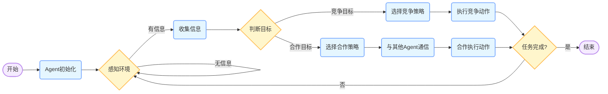

# 构建AI Agent的多Agent竞争与合作框架

> 关键词：AI Agent、多Agent系统、竞争与合作框架、智能交互、分布式决策

> 摘要：本文聚焦于构建AI Agent的多Agent竞争与合作框架。首先介绍了相关背景，包括目的范围、预期读者等内容。接着阐述核心概念与联系，展示了多Agent系统中竞争与合作的原理和架构。详细讲解了核心算法原理及具体操作步骤，通过Python代码进行示例。给出了相关数学模型和公式并举例说明。通过项目实战，从开发环境搭建到源代码实现及解读进行了全面分析。探讨了实际应用场景，推荐了学习、开发工具等相关资源。最后总结了未来发展趋势与挑战，还包含常见问题解答和扩展阅读参考资料，旨在为构建多Agent竞争与合作框架提供全面而深入的技术指导。

## 1. 背景介绍 
### 1.1 目的和范围
随着人工智能技术的飞速发展，单个AI Agent的能力已经难以满足复杂多变的现实需求。多Agent系统应运而生，它由多个自主的AI Agent组成，这些Agent可以在一个共同的环境中相互作用。构建AI Agent的多Agent竞争与合作框架的目的在于使多个AI Agent能够在竞争与合作的机制下协同工作，以更高效地完成复杂任务。本框架的范围涵盖了多种类型的AI Agent，包括但不限于基于规则的Agent、学习型Agent等，适用于多种领域，如智能交通、物流调度、游戏等。

### 1.2 预期读者
本文预期读者包括人工智能领域的研究人员、软件开发者、对多Agent系统感兴趣的技术爱好者。对于研究人员来说，本文可以为他们的学术研究提供理论和实践参考；软件开发者可以借鉴本文的框架和代码实现，开发出更高效的多Agent应用程序；技术爱好者则可以通过本文了解多Agent系统的基本原理和构建方法。

### 1.3 文档结构概述
本文将按照以下结构进行阐述：首先介绍核心概念与联系，让读者了解多Agent竞争与合作的基本原理和架构；接着详细讲解核心算法原理和具体操作步骤，并通过Python代码进行演示；然后给出相关的数学模型和公式，并举例说明；之后进行项目实战，包括开发环境搭建、源代码实现和代码解读；探讨实际应用场景；推荐相关的工具和资源；最后总结未来发展趋势与挑战，解答常见问题，并提供扩展阅读和参考资料。

### 1.4 术语表
#### 1.4.1 核心术语定义
- **AI Agent**：具有一定智能的自主实体，能够感知环境，根据内部状态和目标做出决策并执行相应的动作。
- **多Agent系统（Multi-Agent System，MAS）**：由多个AI Agent组成的系统，这些Agent之间可以进行交互和协作。
- **竞争**：多个Agent为了获取有限的资源或达成各自的目标而相互对抗的行为。
- **合作**：多个Agent为了共同的目标而相互协作、共享信息和资源的行为。
- **框架**：一种软件设计模式，为构建特定类型的系统提供了通用的结构和方法。

#### 1.4.2 相关概念解释
- **自主决策**：AI Agent能够独立地根据自身的感知和目标做出决策，而不需要外部的直接干预。
- **交互协议**：规定了Agent之间进行信息交换和交互的规则和方式。
- **分布式决策**：在多Agent系统中，决策不是由一个中心节点做出，而是由各个Agent根据自身的信息和与其他Agent的交互结果共同做出。

#### 1.4.3 缩略词列表
- **MAS**：Multi-Agent System（多Agent系统）
- **AI**：Artificial Intelligence（人工智能）

## 2. 核心概念与联系 

### 核心概念原理
在多Agent系统中，竞争与合作是两个重要的概念。竞争通常发生在多个Agent争夺有限资源或追求不同但相互冲突的目标时。例如，在一个物流调度系统中，多个运输车辆可能会竞争同一条最优路线。而合作则发生在多个Agent为了实现共同的目标而联合起来的情况下。比如，在一个团队游戏中，多个玩家控制的Agent需要合作来击败对手。

Agent之间的交互是竞争与合作的基础。Agent通过感知环境获取信息，并根据这些信息和自身的目标选择合适的行动。在交互过程中，Agent可以与其他Agent进行通信，共享信息或请求帮助。

### 架构的文本示意图
一个典型的多Agent竞争与合作框架的架构可以描述如下：

多个AI Agent分布在一个共同的环境中。每个Agent包含感知模块、决策模块和执行模块。感知模块负责收集环境信息和其他Agent的信息；决策模块根据感知到的信息和自身的目标做出决策，决定是采取竞争还是合作的策略；执行模块根据决策执行相应的动作。Agent之间通过通信模块进行信息交换，通信模块遵循一定的交互协议。

### Mermaid 流程图


这个流程图展示了一个AI Agent在多Agent系统中的基本工作流程。首先进行初始化，然后不断感知环境，根据感知到的信息和目标选择竞争或合作策略，执行相应的动作，直到任务完成。

## 3. 核心算法原理 & 具体操作步骤 

### 核心算法原理
在多Agent竞争与合作框架中，一个重要的算法是基于博弈论的策略选择算法。博弈论研究的是在竞争或合作的情况下，参与者如何做出最优决策。在多Agent系统中，每个Agent可以看作是一个博弈参与者。

以经典的囚徒困境博弈为例，两个囚徒可以选择合作（保持沉默）或背叛（告发对方）。如果两个囚徒都合作，他们将获得较轻的惩罚；如果一个囚徒合作，另一个背叛，背叛者将获得较轻的惩罚，而合作者将获得较重的惩罚；如果两个囚徒都背叛，他们将获得中等的惩罚。

在多Agent系统中，Agent可以根据对方的历史行为和自身的利益选择合作或竞争策略。一种常用的策略是“以牙还牙”策略，即Agent在第一次交互时选择合作，然后在后续的交互中模仿对方上一次的行为。

### 具体操作步骤及Python代码示例
以下是一个简单的Python代码示例，模拟了两个Agent在囚徒困境博弈中的交互过程：

```python
import random

# 定义囚徒困境的收益矩阵
PAYOFF_MATRIX = {
    ('C', 'C'): (3, 3),  # 双方合作
    ('C', 'D'): (0, 5),  # 一方合作，一方背叛
    ('D', 'C'): (5, 0),  # 一方背叛，一方合作
    ('D', 'D'): (1, 1)   # 双方背叛
}

# 定义Agent类
class Agent:
    def __init__(self, strategy):
        self.strategy = strategy
        self.last_action = None

    def choose_action(self, opponent_last_action=None):
        if self.strategy == 'tit_for_tat':
            if opponent_last_action is None:
                return 'C'  # 第一次选择合作
            else:
                return opponent_last_action
        elif self.strategy == 'random':
            return random.choice(['C', 'D'])

# 模拟多次交互
def simulate_interaction(agent1, agent2, num_rounds):
    agent1_payoff = 0
    agent2_payoff = 0
    for _ in range(num_rounds):
        action1 = agent1.choose_action(agent2.last_action)
        action2 = agent2.choose_action(agent1.last_action)
        payoff1, payoff2 = PAYOFF_MATRIX[(action1, action2)]
        agent1_payoff += payoff1
        agent2_payoff += payoff2
        agent1.last_action = action1
        agent2.last_action = action2
    return agent1_payoff, agent2_payoff

# 创建两个Agent
agent1 = Agent('tit_for_tat')
agent2 = Agent('random')

# 模拟10次交互
num_rounds = 10
payoff1, payoff2 = simulate_interaction(agent1, agent2, num_rounds)

print(f"Agent 1 (Tit-for-Tat) payoff: {payoff1}")
print(f"Agent 2 (Random) payoff: {payoff2}")
```

### 代码解释
1. **收益矩阵**：`PAYOFF_MATRIX` 定义了囚徒困境的收益矩阵，记录了不同行动组合下两个Agent的收益。
2. **Agent类**：`Agent` 类表示一个AI Agent，包含策略属性 `strategy` 和上一次的行动 `last_action`。`choose_action` 方法根据策略选择行动。
3. **模拟交互函数**：`simulate_interaction` 函数模拟了两个Agent的多次交互过程，记录每次交互的收益，并更新Agent的上一次行动。
4. **创建Agent并模拟交互**：创建了一个采用“以牙还牙”策略的Agent和一个采用随机策略的Agent，并模拟了10次交互，最后输出两个Agent的总收益。

## 4. 数学模型和公式 & 详细讲解 & 举例说明 

### 数学模型
在多Agent竞争与合作框架中，可以使用博弈论的数学模型来描述Agent之间的交互。一个常见的模型是双人博弈模型，其中有两个参与者（Agent），每个参与者有有限个行动选择。

设参与者 $i$ 的行动集合为 $A_i=\{a_{i1},a_{i2},\cdots,a_{in_i}\}$，其中 $n_i$ 是参与者 $i$ 的行动数量。参与者 $i$ 的收益函数为 $u_i:A_1\times A_2\rightarrow\mathbb{R}$，表示当参与者 1 选择行动 $a_{1j}$，参与者 2 选择行动 $a_{2k}$ 时，参与者 $i$ 的收益为 $u_i(a_{1j},a_{2k})$。

### 公式
在囚徒困境博弈中，设参与者 1 和参与者 2 的行动分别为 $a_1$ 和 $a_2$，其中 $a_1,a_2\in\{C,D\}$（$C$ 表示合作，$D$ 表示背叛）。收益函数可以表示为：

$$
u_1(a_1,a_2)=\begin{cases}
3, & \text{if } a_1 = C, a_2 = C \\
0, & \text{if } a_1 = C, a_2 = D \\
5, & \text{if } a_1 = D, a_2 = C \\
1, & \text{if } a_1 = D, a_2 = D
\end{cases}
$$

$$
u_2(a_1,a_2)=\begin{cases}
3, & \text{if } a_1 = C, a_2 = C \\
5, & \text{if } a_1 = C, a_2 = D \\
0, & \text{if } a_1 = D, a_2 = C \\
1, & \text{if } a_1 = D, a_2 = D
\end{cases}
$$

### 详细讲解
收益函数描述了在不同行动组合下参与者的收益情况。在囚徒困境中，如果两个参与者都合作，他们都能获得较高的收益（3）；如果一个参与者合作，另一个背叛，背叛者将获得最高的收益（5），而合作者将获得最低的收益（0）；如果两个参与者都背叛，他们的收益都较低（1）。

### 举例说明
假设参与者 1 选择合作（$a_1 = C$），参与者 2 选择背叛（$a_2 = D$），根据收益函数，参与者 1 的收益为 $u_1(C,D)=0$，参与者 2 的收益为 $u_2(C,D)=5$。

在多轮博弈中，参与者可以根据对方的历史行动和自身的策略选择行动，以最大化自己的总收益。例如，采用“以牙还牙”策略的参与者会根据对方上一轮的行动来决定自己本轮的行动。

## 5. 项目实战：代码实际案例和详细解释说明 

### 5.1  开发环境搭建
为了实现一个多Agent竞争与合作的项目，我们可以使用Python作为开发语言。以下是搭建开发环境的步骤：

1. **安装Python**：从Python官方网站（https://www.python.org/downloads/）下载并安装Python 3.x版本。
2. **创建虚拟环境**：建议使用虚拟环境来管理项目的依赖。在命令行中执行以下命令创建并激活虚拟环境：
   ```sh
   python -m venv myenv
   source myenv/bin/activate  # 对于Windows系统，使用 myenv\Scripts\activate
   ```
3. **安装必要的库**：在本项目中，我们只需要Python的标准库，无需额外安装其他库。

### 5.2  源代码详细实现和代码解读
以下是一个更复杂的多Agent竞争与合作项目的代码示例，模拟了多个Agent在一个资源竞争环境中的交互：

```python
import random

# 定义资源环境类
class ResourceEnvironment:
    def __init__(self, total_resources):
        self.total_resources = total_resources
        self.available_resources = total_resources

    def request_resources(self, amount):
        if amount <= self.available_resources:
            self.available_resources -= amount
            return amount
        else:
            return 0

    def replenish_resources(self, amount):
        self.available_resources = min(self.total_resources, self.available_resources + amount)

# 定义Agent类
class Agent:
    def __init__(self, id, initial_energy, resource_demand):
        self.id = id
        self.energy = initial_energy
        self.resource_demand = resource_demand
        self.strategy = random.choice(['cooperative', 'competitive'])

    def act(self, environment):
        if self.strategy == 'cooperative':
            # 合作策略：请求部分资源
            requested_amount = min(self.resource_demand, self.energy)
            obtained_resources = environment.request_resources(requested_amount)
            self.energy += obtained_resources
            if obtained_resources > 0:
                # 分享部分资源给其他Agent
                share_amount = obtained_resources // 2
                environment.replenish_resources(share_amount)
        elif self.strategy == 'competitive':
            # 竞争策略：请求全部资源
            requested_amount = self.resource_demand
            obtained_resources = environment.request_resources(requested_amount)
            self.energy += obtained_resources

# 模拟多Agent交互
def simulate_agents(environment, agents, num_steps):
    for step in range(num_steps):
        print(f"Step {step}: Available resources = {environment.available_resources}")
        for agent in agents:
            agent.act(environment)
        # 补充资源
        environment.replenish_resources(10)

# 创建资源环境和Agent
environment = ResourceEnvironment(total_resources=100)
agents = [Agent(id=i, initial_energy=10, resource_demand=20) for i in range(5)]

# 模拟10步交互
simulate_agents(environment, agents, num_steps=10)
```

### 5.3  代码解读与分析
1. **资源环境类**：`ResourceEnvironment` 类表示资源环境，包含总资源量 `total_resources` 和可用资源量 `available_resources`。`request_resources` 方法用于处理Agent的资源请求，`replenish_resources` 方法用于补充资源。
2. **Agent类**：`Agent` 类表示一个AI Agent，包含ID、初始能量、资源需求和策略。`act` 方法根据策略选择行动，合作策略的Agent会请求部分资源并分享部分资源给其他Agent，竞争策略的Agent会请求全部资源。
3. **模拟多Agent交互函数**：`simulate_agents` 函数模拟了多个Agent在资源环境中的交互过程，每个步骤中，Agent根据自身策略行动，然后环境补充一定量的资源。
4. **创建资源环境和Agent并模拟交互**：创建了一个资源环境和5个Agent，然后模拟了10步交互，输出每一步的可用资源量。

通过这个项目，我们可以观察到不同策略的Agent在资源竞争环境中的行为和表现。合作策略的Agent可能会在短期内减少自己的资源获取，但从长期来看，可能会促进整个系统的资源平衡和稳定。

## 6. 实际应用场景 
### 智能交通
在智能交通系统中，多个自动驾驶车辆可以看作是多个AI Agent。这些车辆之间需要进行竞争与合作。例如，在路口处，车辆需要竞争有限的通行权，但在某些情况下，它们也需要合作以避免碰撞和提高交通效率。通过多Agent竞争与合作框架，车辆可以根据实时交通情况和其他车辆的行为选择合适的策略，如减速让行、加速通过等。

### 物流调度
在物流调度系统中，多个运输车辆或机器人需要竞争有限的任务和资源，如货物、运输路线等。同时，它们也需要合作来完成复杂的物流任务，如货物的装卸、配送等。通过多Agent竞争与合作框架，物流系统可以更高效地分配任务和资源，提高物流效率和降低成本。

### 游戏
在多人游戏中，玩家控制的角色可以看作是AI Agent。这些角色之间既存在竞争关系，如争夺游戏中的资源、击败对手等，也存在合作关系，如组队完成任务、共同对抗敌人等。多Agent竞争与合作框架可以为游戏开发者提供一种有效的方法来设计智能的游戏角色，提高游戏的趣味性和挑战性。

### 工业自动化
在工业自动化生产线上，多个机器人或自动化设备可以看作是AI Agent。它们需要竞争有限的工作空间和资源，如原材料、工具等。同时，它们也需要合作来完成复杂的生产任务，如组装产品、检测质量等。通过多Agent竞争与合作框架，工业自动化系统可以更高效地运行，提高生产效率和产品质量。

## 7. 工具和资源推荐
### 7.1 学习资源推荐
#### 7.1.1 书籍推荐
- 《多Agent系统：原理与编程》：这本书系统地介绍了多Agent系统的基本原理、算法和编程实现，是学习多Agent系统的经典教材。
- 《博弈论基础》：博弈论是多Agent竞争与合作的重要理论基础，这本书详细讲解了博弈论的基本概念、模型和算法。
- 《人工智能：一种现代的方法》：这本书涵盖了人工智能的各个领域，包括多Agent系统，对多Agent系统的原理和应用进行了深入的介绍。

#### 7.1.2 在线课程
- Coursera上的“Multi-Agent Systems”课程：由知名教授授课，内容涵盖了多Agent系统的基本概念、模型、算法和应用。
- edX上的“Game Theory”课程：介绍了博弈论的基本原理和应用，对于理解多Agent竞争与合作有很大的帮助。

#### 7.1.3 技术博客和网站
- AI Stack Exchange：一个专门讨论人工智能问题的问答社区，其中有很多关于多Agent系统的讨论和解答。
- Towards Data Science：一个专注于数据科学和人工智能的技术博客，上面有很多关于多Agent系统的最新研究成果和实践经验分享。

### 7.2 开发工具框架推荐
#### 7.2.1 IDE和编辑器
- PyCharm：一款功能强大的Python集成开发环境，提供了代码编辑、调试、测试等功能，适合开发多Agent系统的Python项目。
- Visual Studio Code：一个轻量级的代码编辑器，支持多种编程语言，有丰富的插件可以扩展功能，也可以用于开发多Agent系统。

#### 7.2.2 调试和性能分析工具
- pdb：Python的标准调试器，可以帮助开发者定位和解决代码中的问题。
- cProfile：Python的性能分析工具，可以分析代码的运行时间和资源消耗情况，帮助开发者优化代码性能。

#### 7.2.3 相关框架和库
- Mesa：一个用于构建基于代理的模型的Python库，提供了Agent、环境、调度器等基本组件，方便开发者快速搭建多Agent系统。
- JADE：一个用Java实现的多Agent开发框架，提供了丰富的工具和接口，支持Agent的创建、通信和管理。

### 7.3 相关论文著作推荐
#### 7.3.1 经典论文
- “The Evolution of Cooperation” by Robert Axelrod：这篇论文介绍了“以牙还牙”策略在囚徒困境博弈中的表现，对多Agent合作的研究产生了深远的影响。
- “Multiagent Systems: A Modern Approach to Distributed Artificial Intelligence” by Gerhard Weiss：这篇论文系统地介绍了多Agent系统的基本概念、模型和算法，是多Agent系统领域的经典文献。

#### 7.3.2 最新研究成果
- 在ACM SIGART、IEEE Transactions on Intelligent Systems等学术期刊和会议上发表的关于多Agent竞争与合作的最新研究论文。
- arXiv上的预印本论文，这些论文通常包含了最新的研究成果和技术。

#### 7.3.3 应用案例分析
- 一些实际应用场景中的多Agent系统案例分析，如智能交通、物流调度等领域的应用案例，可以帮助开发者更好地理解多Agent竞争与合作框架的实际应用。

## 8. 总结：未来发展趋势与挑战
### 未来发展趋势
- **与其他技术的融合**：多Agent竞争与合作框架将与其他人工智能技术，如深度学习、强化学习等深度融合，以提高Agent的智能水平和决策能力。例如，将深度学习用于Agent的感知模块，将强化学习用于Agent的决策模块。
- **大规模多Agent系统**：随着计算能力的提升和网络技术的发展，未来将出现大规模的多Agent系统，包含成千上万个Agent。这些系统将应用于更复杂的领域，如智慧城市、全球供应链管理等。
- **开放和动态环境**：多Agent系统将更多地应用于开放和动态的环境中，Agent需要能够适应环境的变化和不确定性，与未知的Agent进行交互和合作。

### 挑战
- **通信和协调**：在大规模多Agent系统中，Agent之间的通信和协调将变得更加困难。如何设计高效的通信协议和协调机制，以确保Agent之间能够及时、准确地交换信息和协同工作，是一个亟待解决的问题。
- **安全和隐私**：多Agent系统中涉及大量的信息交换和交互，如何保障Agent的安全和隐私，防止信息泄露和恶意攻击，是一个重要的挑战。
- **智能水平提升**：虽然目前的AI Agent已经具有一定的智能水平，但与人类的智能相比，仍有很大的差距。如何进一步提升Agent的智能水平，使其能够更好地应对复杂的环境和任务，是未来的研究方向之一。

## 9. 附录：常见问题与解答
### 问题1：多Agent竞争与合作框架与传统的分布式系统有什么区别？
解答：传统的分布式系统主要关注系统的性能、可靠性和可扩展性，各个节点之间的交互通常是基于预定义的协议和规则。而多Agent竞争与合作框架更强调Agent的自主性和智能性，Agent可以根据自身的目标和环境的变化自主地做出决策，并且可以在竞争和合作之间进行灵活切换。

### 问题2：如何选择合适的Agent策略？
解答：选择合适的Agent策略需要考虑多个因素，如环境的特点、任务的目标、其他Agent的策略等。在一些简单的环境中，可以采用一些经典的策略，如“以牙还牙”策略。在复杂的环境中，可能需要使用机器学习算法来学习最优的策略。

### 问题3：多Agent系统的性能如何评估？
解答：多Agent系统的性能可以从多个方面进行评估，如任务完成率、资源利用率、通信成本等。可以根据具体的应用场景选择合适的评估指标。

### 问题4：如何解决多Agent系统中的冲突？
解答：解决多Agent系统中的冲突可以采用多种方法，如协商、仲裁、规则约束等。协商是指Agent之间通过通信和谈判来达成共识；仲裁是指引入一个第三方来解决冲突；规则约束是指预先定义一些规则，当冲突发生时，按照规则进行处理。

## 10. 扩展阅读 & 参考资料
### 扩展阅读
- 《Complex Adaptive Systems: An Introduction to Computational Models of Social Life》：这本书介绍了复杂自适应系统的基本概念和模型，对于理解多Agent系统在复杂环境中的行为有很大的帮助。
- 《Swarm Intelligence: From Natural to Artificial Systems》：这本书介绍了群体智能的原理和应用，群体智能是多Agent系统的一个重要研究方向。

### 参考资料
- Weiss, G. (Ed.). (2013). Multiagent Systems: A Modern Approach to Distributed Artificial Intelligence. MIT Press.
- Axelrod, R. (1984). The Evolution of Cooperation. Basic Books.
- Python官方文档：https://docs.python.org/3/
- Mesa官方文档：https://mesa.readthedocs.io/
- JADE官方网站：https://jade.tilab.com/

作者：AI天才研究院/AI Genius Institute & 禅与计算机程序设计艺术 /Zen And The Art of Computer Programming