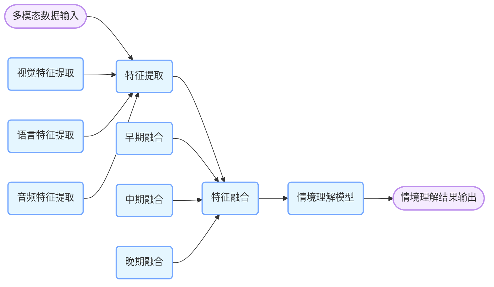

# 构建AI Agent的多模态情境理解系统

> 关键词：AI Agent、多模态情境理解、计算机视觉、自然语言处理、机器学习

> 摘要：本文聚焦于构建AI Agent的多模态情境理解系统，详细阐述了多模态情境理解的核心概念、相关算法原理、数学模型，通过项目实战展示了系统的开发流程和代码实现。同时探讨了该系统的实际应用场景，推荐了学习资源、开发工具和相关论文著作。最后对未来发展趋势与挑战进行了总结，并给出常见问题解答和扩展阅读参考资料，旨在为开发者和研究者提供全面深入的技术指导。

## 1. 背景介绍 
### 1.1 目的和范围
随着人工智能技术的不断发展，单一模态的数据处理已经难以满足复杂场景下的应用需求。AI Agent需要具备对多种模态信息（如视觉、语言、音频等）的综合理解能力，才能更准确地感知和应对周围环境。本文的目的是深入探讨如何构建一个有效的AI Agent多模态情境理解系统，涵盖从核心概念的介绍、算法原理的分析到实际项目的开发等多个方面，为相关领域的研究和开发提供全面的技术支持。

### 1.2 预期读者
本文主要面向人工智能领域的开发者、研究者，以及对多模态情境理解系统感兴趣的技术爱好者。无论您是初学者想要了解基本概念，还是有一定经验的专业人士希望深入研究相关技术，都能从本文中获得有价值的信息。

### 1.3 文档结构概述
本文将按照以下结构进行阐述：首先介绍多模态情境理解的核心概念和相关联系；接着详细讲解核心算法原理和具体操作步骤，并给出Python源代码示例；然后介绍数学模型和公式，并通过举例进行说明；随后通过项目实战展示系统的开发过程，包括开发环境搭建、源代码实现和代码解读；之后探讨该系统的实际应用场景；推荐学习资源、开发工具和相关论文著作；最后总结未来发展趋势与挑战，提供常见问题解答和扩展阅读参考资料。

### 1.4 术语表
#### 1.4.1 核心术语定义
- **AI Agent**：能够感知环境、进行决策并执行动作的智能实体。
- **多模态**：指包含多种不同类型的数据模态，如视觉（图像、视频）、语言（文本）、音频等。
- **情境理解**：指AI Agent对所处环境的综合理解，包括环境中的对象、事件、关系等信息。
- **特征融合**：将不同模态的数据特征进行整合，以获得更全面的信息表示。

#### 1.4.2 相关概念解释
- **深度学习**：一种基于人工神经网络的机器学习方法，在多模态情境理解中常用于特征提取和模型训练。
- **注意力机制**：一种能够自动关注数据中重要部分的机制，在多模态融合中可以帮助模型更好地捕捉不同模态之间的关联。

#### 1.4.3 缩略词列表
- **CNN**：Convolutional Neural Network，卷积神经网络，常用于图像特征提取。
- **RNN**：Recurrent Neural Network，循环神经网络，常用于处理序列数据，如文本。
- **LSTM**：Long Short-Term Memory，长短期记忆网络，是一种特殊的RNN，能够有效处理长序列数据。
- **Transformer**：一种基于注意力机制的深度学习模型，在自然语言处理和多模态任务中取得了很好的效果。

## 2. 核心概念与联系 

### 核心概念原理
多模态情境理解系统的核心在于将不同模态的数据进行融合和分析，以实现对情境的全面理解。不同模态的数据具有各自的特点和优势，例如视觉数据可以提供丰富的空间信息，语言数据可以提供明确的语义信息。通过将这些不同模态的数据进行融合，可以充分发挥它们的优势，提高AI Agent对情境的理解能力。

### 架构示意图


### 架构说明
- **多模态数据输入**：系统接收来自不同模态的原始数据，如图像、文本、音频等。
- **特征提取**：针对不同模态的数据，使用相应的方法提取其特征。例如，对于图像数据可以使用CNN进行特征提取，对于文本数据可以使用RNN或Transformer进行特征提取。
- **特征融合**：将不同模态的特征进行融合，常见的融合方法包括早期融合、中期融合和晚期融合。早期融合是在特征提取之前将不同模态的数据进行合并，中期融合是在特征提取过程中进行融合，晚期融合是在特征提取之后进行融合。
- **情境理解模型**：使用融合后的特征进行情境理解，常见的模型包括基于深度学习的神经网络模型，如多层感知机（MLP）、循环神经网络（RNN）等。
- **情境理解结果输出**：输出AI Agent对情境的理解结果，如对环境中对象的识别、事件的判断等。

## 3. 核心算法原理 & 具体操作步骤 

### 特征提取算法
#### 图像特征提取（CNN）
卷积神经网络（CNN）是一种专门用于处理图像数据的深度学习模型，其核心思想是通过卷积层、池化层和全连接层对图像进行特征提取和分类。以下是一个使用PyTorch实现的简单CNN模型示例：

```python
import torch
import torch.nn as nn

class SimpleCNN(nn.Module):
    def __init__(self):
        super(SimpleCNN, self).__init__()
        self.conv1 = nn.Conv2d(3, 16, kernel_size=3, padding=1)
        self.relu1 = nn.ReLU()
        self.pool1 = nn.MaxPool2d(kernel_size=2, stride=2)
        self.conv2 = nn.Conv2d(16, 32, kernel_size=3, padding=1)
        self.relu2 = nn.ReLU()
        self.pool2 = nn.MaxPool2d(kernel_size=2, stride=2)
        self.fc1 = nn.Linear(32 * 8 * 8, 128)
        self.relu3 = nn.ReLU()
        self.fc2 = nn.Linear(128, 10)

    def forward(self, x):
        x = self.pool1(self.relu1(self.conv1(x)))
        x = self.pool2(self.relu2(self.conv2(x)))
        x = x.view(-1, 32 * 8 * 8)
        x = self.relu3(self.fc1(x))
        x = self.fc2(x)
        return x

# 示例使用
model = SimpleCNN()
input_image = torch.randn(1, 3, 32, 32)
output = model(input_image)
print(output.shape)
```

#### 文本特征提取（Transformer）
Transformer是一种基于注意力机制的深度学习模型，在自然语言处理中取得了很好的效果。以下是一个使用Hugging Face的`transformers`库实现的简单Transformer模型示例：

```python
from transformers import AutoTokenizer, AutoModel

# 加载预训练的模型和分词器
tokenizer = AutoTokenizer.from_pretrained('bert-base-uncased')
model = AutoModel.from_pretrained('bert-base-uncased')

# 输入文本
text = "This is a sample sentence."
inputs = tokenizer(text, return_tensors='pt')

# 模型推理
outputs = model(**inputs)
last_hidden_state = outputs.last_hidden_state
print(last_hidden_state.shape)
```

### 特征融合算法
#### 早期融合
早期融合是在特征提取之前将不同模态的数据进行合并。以下是一个简单的早期融合示例：

```python
import torch

# 假设图像特征和文本特征
image_feature = torch.randn(1, 128)
text_feature = torch.randn(1, 128)

# 早期融合
early_fusion_feature = torch.cat((image_feature, text_feature), dim=1)
print(early_fusion_feature.shape)
```

#### 中期融合
中期融合是在特征提取过程中进行融合。以下是一个简单的中期融合示例：

```python
import torch
import torch.nn as nn

class MidFusionModel(nn.Module):
    def __init__(self):
        super(MidFusionModel, self).__init__()
        self.image_fc = nn.Linear(128, 64)
        self.text_fc = nn.Linear(128, 64)
        self.fc = nn.Linear(128, 10)

    def forward(self, image_feature, text_feature):
        image_output = self.image_fc(image_feature)
        text_output = self.text_fc(text_feature)
        mid_fusion_feature = torch.cat((image_output, text_output), dim=1)
        output = self.fc(mid_fusion_feature)
        return output

# 示例使用
model = MidFusionModel()
image_feature = torch.randn(1, 128)
text_feature = torch.randn(1, 128)
output = model(image_feature, text_feature)
print(output.shape)
```

#### 晚期融合
晚期融合是在特征提取之后进行融合。以下是一个简单的晚期融合示例：

```python
import torch
import torch.nn as nn

class LateFusionModel(nn.Module):
    def __init__(self):
        super(LateFusionModel, self).__init__()
        self.image_fc = nn.Linear(128, 10)
        self.text_fc = nn.Linear(128, 10)
        self.fc = nn.Linear(20, 10)

    def forward(self, image_feature, text_feature):
        image_output = self.image_fc(image_feature)
        text_output = self.text_fc(text_feature)
        late_fusion_feature = torch.cat((image_output, text_output), dim=1)
        output = self.fc(late_fusion_feature)
        return output

# 示例使用
model = LateFusionModel()
image_feature = torch.randn(1, 128)
text_feature = torch.randn(1, 128)
output = model(image_feature, text_feature)
print(output.shape)
```

### 情境理解模型
情境理解模型可以使用多层感知机（MLP）、循环神经网络（RNN）等。以下是一个使用MLP实现的简单情境理解模型示例：

```python
import torch
import torch.nn as nn

class MLPModel(nn.Module):
    def __init__(self, input_size, hidden_size, output_size):
        super(MLPModel, self).__init__()
        self.fc1 = nn.Linear(input_size, hidden_size)
        self.relu = nn.ReLU()
        self.fc2 = nn.Linear(hidden_size, output_size)

    def forward(self, x):
        x = self.relu(self.fc1(x))
        x = self.fc2(x)
        return x

# 示例使用
input_size = 256
hidden_size = 128
output_size = 10
model = MLPModel(input_size, hidden_size, output_size)
input_feature = torch.randn(1, input_size)
output = model(input_feature)
print(output.shape)
```

## 4. 数学模型和公式 & 详细讲解 & 举例说明 

### 卷积神经网络（CNN）
#### 卷积操作
卷积操作是CNN的核心操作，其数学公式如下：
$$
y_{i,j} = \sum_{m=0}^{M-1} \sum_{n=0}^{N-1} x_{i+m,j+n} \cdot w_{m,n} + b
$$
其中，$x$ 是输入图像，$w$ 是卷积核，$b$ 是偏置，$y$ 是卷积输出。$M$ 和 $N$ 是卷积核的大小。

#### 池化操作
池化操作用于减小特征图的尺寸，常见的池化操作有最大池化和平均池化。最大池化的数学公式如下：
$$
y_{i,j} = \max_{m=0}^{M-1} \max_{n=0}^{N-1} x_{i \cdot s + m,j \cdot s + n}
$$
其中，$s$ 是池化的步长，$M$ 和 $N$ 是池化窗口的大小。

### Transformer
#### 注意力机制
注意力机制的数学公式如下：
$$
\text{Attention}(Q, K, V) = \text{softmax}\left(\frac{QK^T}{\sqrt{d_k}}\right)V
$$
其中，$Q$ 是查询矩阵，$K$ 是键矩阵，$V$ 是值矩阵，$d_k$ 是键的维度。

#### 多头注意力
多头注意力是将多个注意力头的输出进行拼接，其数学公式如下：
$$
\text{MultiHead}(Q, K, V) = \text{Concat}(\text{head}_1, \ldots, \text{head}_h)W^O
$$
其中，$\text{head}_i = \text{Attention}(QW_i^Q, KW_i^K, VW_i^V)$，$W^Q$、$W^K$、$W^V$ 和 $W^O$ 是可学习的权重矩阵。

### 举例说明
假设我们有一个输入图像 $x$ 是一个 $3 \times 32 \times 32$ 的张量，使用一个 $3 \times 3$ 的卷积核进行卷积操作，卷积核的步长为 1，填充为 1。根据卷积操作的公式，输出特征图的尺寸仍然是 $16 \times 32 \times 32$（假设卷积核的数量为 16）。

再假设我们有一个输入序列 $x$ 是一个长度为 10 的文本序列，使用一个 Transformer 模型进行特征提取。输入序列经过嵌入层转换为一个 $10 \times 768$ 的张量，然后经过多头注意力机制和前馈神经网络，最终输出一个 $10 \times 768$ 的特征表示。

## 5. 项目实战：代码实际案例和详细解释说明 

### 5.1  开发环境搭建
#### 安装Python
首先需要安装Python 3.x版本，可以从Python官方网站（https://www.python.org/downloads/）下载并安装。

#### 创建虚拟环境
使用`virtualenv`或`conda`创建一个虚拟环境，以避免不同项目之间的依赖冲突。以下是使用`virtualenv`创建虚拟环境的示例：
```bash
pip install virtualenv
virtualenv myenv
source myenv/bin/activate
```

#### 安装必要的库
在虚拟环境中安装必要的库，如`torch`、`torchvision`、`transformers`等：
```bash
pip install torch torchvision transformers
```

### 5.2  源代码详细实现和代码解读
以下是一个完整的多模态情境理解系统的示例代码：

```python
import torch
import torch.nn as nn
from transformers import AutoTokenizer, AutoModel

# 图像特征提取模型
class ImageFeatureExtractor(nn.Module):
    def __init__(self):
        super(ImageFeatureExtractor, self).__init__()
        self.conv1 = nn.Conv2d(3, 16, kernel_size=3, padding=1)
        self.relu1 = nn.ReLU()
        self.pool1 = nn.MaxPool2d(kernel_size=2, stride=2)
        self.conv2 = nn.Conv2d(16, 32, kernel_size=3, padding=1)
        self.relu2 = nn.ReLU()
        self.pool2 = nn.MaxPool2d(kernel_size=2, stride=2)
        self.fc1 = nn.Linear(32 * 8 * 8, 128)
        self.relu3 = nn.ReLU()

    def forward(self, x):
        x = self.pool1(self.relu1(self.conv1(x)))
        x = self.pool2(self.relu2(self.conv2(x)))
        x = x.view(-1, 32 * 8 * 8)
        x = self.relu3(self.fc1(x))
        return x

# 文本特征提取模型
class TextFeatureExtractor(nn.Module):
    def __init__(self):
        super(TextFeatureExtractor, self).__init__()
        self.tokenizer = AutoTokenizer.from_pretrained('bert-base-uncased')
        self.model = AutoModel.from_pretrained('bert-base-uncased')

    def forward(self, text):
        inputs = self.tokenizer(text, return_tensors='pt')
        outputs = self.model(**inputs)
        last_hidden_state = outputs.last_hidden_state
        pooled_output = torch.mean(last_hidden_state, dim=1)
        return pooled_output

# 多模态融合模型
class MultiModalFusionModel(nn.Module):
    def __init__(self):
        super(MultiModalFusionModel, self).__init__()
        self.image_extractor = ImageFeatureExtractor()
        self.text_extractor = TextFeatureExtractor()
        self.fc = nn.Linear(256, 10)

    def forward(self, image, text):
        image_feature = self.image_extractor(image)
        text_feature = self.text_extractor(text)
        fusion_feature = torch.cat((image_feature, text_feature), dim=1)
        output = self.fc(fusion_feature)
        return output

# 示例使用
model = MultiModalFusionModel()
image = torch.randn(1, 3, 32, 32)
text = "This is a sample sentence."
output = model(image, text)
print(output.shape)
```

### 代码解读与分析
- **ImageFeatureExtractor**：用于提取图像特征，使用了简单的CNN模型。
- **TextFeatureExtractor**：用于提取文本特征，使用了预训练的BERT模型。
- **MultiModalFusionModel**：将图像特征和文本特征进行融合，使用了晚期融合的方法，最后通过一个全连接层输出结果。

## 6. 实际应用场景 
### 智能客服
在智能客服系统中，AI Agent可以同时处理用户的文本咨询和上传的图片信息，通过多模态情境理解系统，更准确地理解用户的问题，并提供更精准的回答。例如，用户在咨询某款产品的问题时，同时上传了产品的图片，系统可以通过分析图片中的产品特征和用户的文本描述，更好地解决用户的问题。

### 自动驾驶
在自动驾驶领域，AI Agent需要综合处理来自摄像头、雷达、激光雷达等多种传感器的数据，以实现对周围环境的准确感知和决策。多模态情境理解系统可以将视觉、雷达等不同模态的数据进行融合，提高自动驾驶系统的安全性和可靠性。例如，通过融合视觉图像和雷达数据，可以更准确地识别前方的障碍物和道路状况。

### 智能家居
在智能家居系统中，AI Agent可以通过语音指令和摄像头图像等多模态信息，实现对家居设备的智能控制和环境监测。例如，用户可以通过语音指令控制灯光的开关和亮度，同时系统可以通过摄像头监测房间内的人员活动和环境状况，自动调整家居设备的运行状态。

### 医疗诊断
在医疗诊断领域，多模态情境理解系统可以结合医学图像（如X光、CT、MRI等）和患者的病历文本信息，辅助医生进行疾病的诊断和治疗方案的制定。例如，通过分析医学图像中的病变特征和病历文本中的症状描述，系统可以为医生提供更准确的诊断建议。

## 7. 工具和资源推荐
### 7.1 学习资源推荐
#### 7.1.1 书籍推荐
- 《深度学习》（Deep Learning）：由Ian Goodfellow、Yoshua Bengio和Aaron Courville所著，是深度学习领域的经典教材，涵盖了深度学习的基本原理、算法和应用。
- 《Python深度学习》（Deep Learning with Python）：由Francois Chollet所著，以Python和Keras为工具，介绍了深度学习的基本概念和实践方法。
- 《计算机视觉：算法与应用》（Computer Vision: Algorithms and Applications）：由Richard Szeliski所著，全面介绍了计算机视觉领域的各种算法和应用。

#### 7.1.2 在线课程
- Coursera上的“深度学习专项课程”（Deep Learning Specialization）：由Andrew Ng教授授课，包括神经网络和深度学习、改善深层神经网络、结构化机器学习项目、卷积神经网络、序列模型等课程。
- edX上的“人工智能基础”（Introduction to Artificial Intelligence）：由MIT的Patrick H. Winston教授授课，介绍了人工智能的基本概念、算法和应用。
- 哔哩哔哩上的“李沐深度学习”系列课程：由李沐博士授课，以通俗易懂的方式讲解深度学习的原理和实践。

#### 7.1.3 技术博客和网站
- Medium：一个技术博客平台，上面有很多关于人工智能、深度学习等领域的优秀文章。
- arXiv：一个预印本论文库，提供了大量最新的人工智能研究论文。
- Hugging Face：一个专注于自然语言处理的开源社区，提供了丰富的预训练模型和工具。

### 7.2 开发工具框架推荐
#### 7.2.1 IDE和编辑器
- PyCharm：一款专业的Python集成开发环境，提供了丰富的代码编辑、调试和项目管理功能。
- Jupyter Notebook：一个交互式的开发环境，适合进行数据分析和模型实验。
- Visual Studio Code：一款轻量级的代码编辑器，支持多种编程语言和插件扩展。

#### 7.2.2 调试和性能分析工具
- TensorBoard：一个用于可视化深度学习模型训练过程的工具，可以帮助开发者监控模型的训练进度和性能。
- PyTorch Profiler：一个用于分析PyTorch模型性能的工具，可以帮助开发者找出模型中的性能瓶颈。
- NVIDIA Nsight Systems：一个用于分析GPU应用程序性能的工具，可以帮助开发者优化GPU代码。

#### 7.2.3 相关框架和库
- PyTorch：一个开源的深度学习框架，提供了丰富的神经网络层和优化算法，易于使用和扩展。
- TensorFlow：一个广泛使用的深度学习框架，提供了高效的分布式训练和部署能力。
- scikit-learn：一个用于机器学习的Python库，提供了丰富的机器学习算法和工具。

### 7.3 相关论文著作推荐
#### 7.3.1 经典论文
- “Attention Is All You Need”：介绍了Transformer模型，提出了基于注意力机制的序列处理方法，是自然语言处理领域的经典论文。
- “ImageNet Classification with Deep Convolutional Neural Networks”：介绍了AlexNet模型，开创了深度学习在计算机视觉领域的应用先河。
- “Long Short-Term Memory”：介绍了LSTM模型，解决了传统RNN在处理长序列数据时的梯度消失问题。

#### 7.3.2 最新研究成果
- 可以关注ICML、NeurIPS、CVPR、ACL等顶级学术会议的论文，了解多模态情境理解领域的最新研究成果。
- 一些知名的学术期刊，如Journal of Artificial Intelligence Research（JAIR）、Artificial Intelligence等，也会发表相关的研究论文。

#### 7.3.3 应用案例分析
- 可以参考一些实际应用案例的论文，了解多模态情境理解系统在不同领域的应用方法和效果。例如，一些关于智能客服、自动驾驶、智能家居等领域的应用案例论文。

## 8. 总结：未来发展趋势与挑战
### 未来发展趋势
- **多模态融合方法的创新**：未来将不断探索更有效的多模态融合方法，以提高AI Agent对情境的理解能力。例如，结合知识图谱等技术，将语义信息融入多模态融合中。
- **跨模态迁移学习**：通过跨模态迁移学习，将在一种模态上学习到的知识迁移到其他模态上，提高模型的泛化能力和学习效率。
- **与其他技术的融合**：多模态情境理解系统将与其他技术（如区块链、物联网等）进行融合，拓展其应用场景和功能。例如，在物联网环境中，结合多模态情境理解系统和区块链技术，实现更安全、可靠的设备交互和数据共享。

### 挑战
- **数据标注和获取**：多模态数据的标注和获取是一个挑战，需要大量的人力和物力资源。同时，不同模态的数据之间可能存在不一致性和噪声，需要进行有效的处理。
- **计算资源需求**：多模态情境理解系统通常需要大量的计算资源，尤其是在处理大规模数据和复杂模型时。如何优化模型结构和算法，降低计算资源需求是一个重要的挑战。
- **模型可解释性**：多模态情境理解系统的模型通常比较复杂，难以解释其决策过程和结果。提高模型的可解释性，让用户更好地理解和信任系统的决策是一个亟待解决的问题。

## 9. 附录：常见问题与解答
### 问题1：多模态情境理解系统与单一模态系统相比有什么优势？
答：多模态情境理解系统可以综合利用不同模态的数据信息，充分发挥各模态数据的优势，从而提高对情境的理解能力。与单一模态系统相比，多模态系统可以更全面、准确地感知和分析环境，处理更复杂的任务。

### 问题2：如何选择合适的特征融合方法？
答：选择合适的特征融合方法需要考虑多个因素，如数据的特点、任务的需求、模型的复杂度等。早期融合适用于数据之间相关性较强的情况，中期融合可以在特征提取过程中更好地捕捉不同模态之间的关联，晚期融合则更灵活，可以分别对不同模态的数据进行处理。在实际应用中，可以通过实验比较不同融合方法的性能，选择最优的方法。

### 问题3：多模态情境理解系统的训练数据从哪里获取？
答：多模态情境理解系统的训练数据可以从多个渠道获取，如公开数据集、企业内部数据、用户上传的数据等。一些常见的公开数据集包括MNIST、CIFAR-10、ImageNet等图像数据集，以及GLUE、SQuAD等文本数据集。同时，也可以通过数据合成、数据增强等方法来扩充训练数据。

### 问题4：如何提高多模态情境理解系统的性能？
答：可以从以下几个方面提高多模态情境理解系统的性能：
- 选择合适的特征提取模型和融合方法。
- 增加训练数据的数量和质量。
- 优化模型的结构和参数，如调整学习率、增加网络层数等。
- 采用正则化方法，如L1、L2正则化，防止模型过拟合。

## 10. 扩展阅读 & 参考资料
### 扩展阅读
- 《人工智能：一种现代的方法》（Artificial Intelligence: A Modern Approach）：全面介绍了人工智能的基本概念、算法和应用，是人工智能领域的经典教材。
- 《模式识别与机器学习》（Pattern Recognition and Machine Learning）：介绍了模式识别和机器学习的基本理论和方法，适合对机器学习感兴趣的读者。
- 《计算机视觉中的多视图几何》（Multiple View Geometry in Computer Vision）：深入介绍了计算机视觉中的多视图几何理论和方法，对于理解计算机视觉中的三维重建等问题有很大帮助。

### 参考资料
- Goodfellow, I., Bengio, Y., & Courville, A. (2016). Deep Learning. MIT Press.
- Chollet, F. (2017). Deep Learning with Python. Manning Publications.
- Szeliski, R. (2010). Computer Vision: Algorithms and Applications. Springer.
- Vaswani, A., Shazeer, N., Parmar, N., Uszkoreit, J., Jones, L., Gomez, A. N.,... & Polosukhin, I. (2017). Attention is all you need. Advances in neural information processing systems, 5998-6008.
- Krizhevsky, A., Sutskever, I., & Hinton, G. E. (2012). ImageNet classification with deep convolutional neural networks. Advances in neural information processing systems, 1097-1105.
- Hochreiter, S., & Schmidhuber, J. (1997). Long short-term memory. Neural computation, 9(8), 1735-1780.

作者：AI天才研究院/AI Genius Institute & 禅与计算机程序设计艺术 /Zen And The Art of Computer Programming