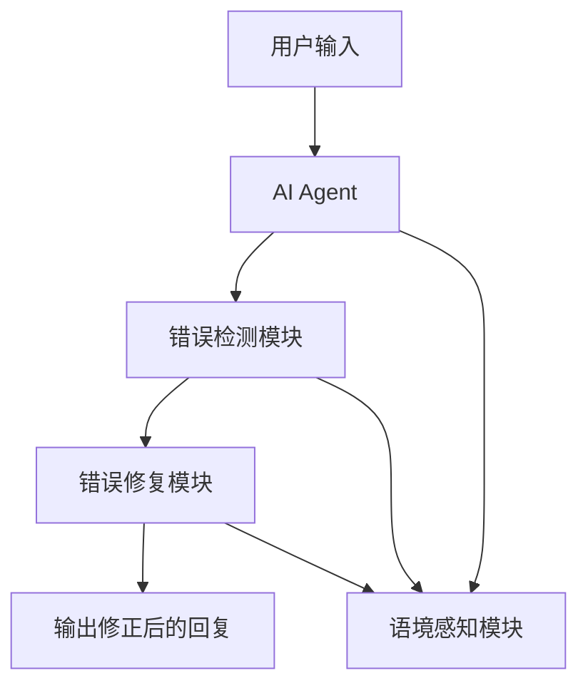

# 构建AI Agent的实时对话修复系统

> 关键词：AI Agent、实时对话修复、自然语言处理、机器学习、对话系统

> 摘要：本文围绕构建AI Agent的实时对话修复系统展开，详细阐述了该系统的背景、核心概念、算法原理、数学模型、项目实战、实际应用场景等内容。首先介绍了系统构建的目的、预期读者和文档结构，解释了相关术语。接着分析核心概念及其联系，给出原理和架构示意图与流程图。通过Python代码讲解核心算法原理和具体操作步骤，同时介绍数学模型和公式并举例说明。在项目实战部分，从开发环境搭建到源代码实现与解读进行了详细说明。探讨了系统的实际应用场景，推荐了学习资源、开发工具框架和相关论文著作。最后总结了未来发展趋势与挑战，提供常见问题解答和扩展阅读参考资料，旨在为开发者提供全面的技术指导。

## 1. 背景介绍 
### 1.1 目的和范围
随着人工智能技术的飞速发展，AI Agent在各种对话场景中得到了广泛应用，如智能客服、聊天机器人等。然而，在实际对话过程中，AI Agent可能会出现各种错误，例如回答不准确、语义理解偏差、生成的回复不符合语境等。实时对话修复系统的目的就是在对话过程中及时发现这些错误，并进行修复，以提高AI Agent的对话质量和用户体验。

本系统的范围主要涵盖自然语言处理领域，涉及到文本的语义分析、错误检测和修复等技术。系统将处理来自用户的实时对话输入和AI Agent的回复，对回复进行实时评估和修复。

### 1.2 预期读者
本文的预期读者包括对自然语言处理、人工智能对话系统感兴趣的开发者、研究人员，以及从事智能客服、聊天机器人等相关领域的技术人员。他们可能具备一定的编程基础和机器学习知识，希望了解如何构建一个实时对话修复系统。

### 1.3 文档结构概述
本文将按照以下结构进行详细阐述：
1. **背景介绍**：介绍系统构建的目的、预期读者和文档结构，解释相关术语。
2. **核心概念与联系**：分析核心概念及其联系，给出原理和架构示意图与流程图。
3. **核心算法原理 & 具体操作步骤**：通过Python代码讲解核心算法原理和具体操作步骤。
4. **数学模型和公式 & 详细讲解 & 举例说明**：介绍数学模型和公式并举例说明。
5. **项目实战：代码实际案例和详细解释说明**：从开发环境搭建到源代码实现与解读进行详细说明。
6. **实际应用场景**：探讨系统的实际应用场景。
7. **工具和资源推荐**：推荐学习资源、开发工具框架和相关论文著作。
8. **总结：未来发展趋势与挑战**：总结未来发展趋势与挑战。
9. **附录：常见问题与解答**：提供常见问题解答。
10. **扩展阅读 & 参考资料**：提供扩展阅读参考资料。

### 1.4 术语表
#### 1.4.1 核心术语定义
- **AI Agent**：人工智能代理，是一种能够感知环境、做出决策并采取行动的智能实体，在对话系统中表现为能够与用户进行对话交流的程序。
- **实时对话修复**：在对话过程中，对AI Agent的回复进行实时检测和修正，以提高回复的准确性和质量。
- **自然语言处理（NLP）**：研究如何让计算机理解和处理人类自然语言的技术领域。
- **语义分析**：对文本的语义信息进行分析和理解，包括词汇语义、句子语义和篇章语义等。

#### 1.4.2 相关概念解释
- **错误检测**：通过一定的方法和规则，判断AI Agent的回复是否存在错误。
- **错误修复**：在检测到错误后，采取相应的措施对回复进行修正。
- **语境感知**：考虑对话的上下文信息，以更好地理解用户的意图和生成合适的回复。

#### 1.4.3 缩略词列表
- **NLP**：Natural Language Processing（自然语言处理）
- **ML**：Machine Learning（机器学习）
- **RNN**：Recurrent Neural Network（循环神经网络）
- **LSTM**：Long Short - Term Memory（长短期记忆网络）

## 2. 核心概念与联系 
### 核心概念原理
实时对话修复系统主要涉及以下几个核心概念：
1. **错误检测模块**：该模块的主要任务是判断AI Agent的回复是否存在错误。可以通过多种方法实现，例如基于规则的方法、机器学习方法等。基于规则的方法通过预设的规则来判断回复是否符合语法、语义等要求；机器学习方法则通过训练模型来学习正常回复和错误回复的特征，从而进行判断。
2. **错误修复模块**：当错误检测模块检测到错误后，错误修复模块将对回复进行修正。修复方法可以是简单的替换、删除或添加词汇，也可以是更复杂的语义重构。
3. **语境感知模块**：为了更好地进行错误检测和修复，系统需要考虑对话的上下文信息。语境感知模块负责提取和分析对话的上下文，为其他模块提供必要的信息。

### 架构的文本示意图
```plaintext
用户输入 ---> AI Agent ---> 错误检测模块 ---> 错误修复模块 ---> 输出修正后的回复
               |                     |
               |                     |
               v                     v
         语境感知模块           语境感知模块
```

### Mermaid流程图


## 3. 核心算法原理 & 具体操作步骤 
### 错误检测算法原理及Python实现
我们可以使用基于机器学习的方法进行错误检测，这里以一个简单的二分类问题为例，判断回复是否存在错误。我们使用逻辑回归模型，代码如下：

```python
import numpy as np
from sklearn.linear_model import LogisticRegression
from sklearn.feature_extraction.text import TfidfVectorizer

# 示例数据
correct_responses = ["这是一个正确的回复", "很好的回答"]
incorrect_responses = ["这是一个错误的回答，语法有问题", "回答完全不相关"]

# 合并数据和标签
responses = correct_responses + incorrect_responses
labels = [0] * len(correct_responses) + [1] * len(incorrect_responses)

# 特征提取
vectorizer = TfidfVectorizer()
X = vectorizer.fit_transform(responses)

# 训练模型
model = LogisticRegression()
model.fit(X, labels)

# 实时检测函数
def detect_error(response):
    response_vector = vectorizer.transform([response])
    prediction = model.predict(response_vector)
    return prediction[0]

# 测试
test_response = "这是一个可能有问题的回复"
error_detected = detect_error(test_response)
print(f"是否检测到错误: {error_detected}")
```

### 具体操作步骤
1. **数据准备**：收集正常回复和错误回复的样本数据，将其分为训练集和测试集。
2. **特征提取**：使用TF - IDF等方法将文本数据转换为数值特征。
3. **模型训练**：选择合适的机器学习模型，如逻辑回归、决策树等，对训练数据进行训练。
4. **实时检测**：在对话过程中，将AI Agent的回复输入到训练好的模型中，判断是否存在错误。

### 错误修复算法原理及Python实现
对于简单的错误修复，我们可以使用规则-based的方法，例如替换特定的错误词汇。代码如下：

```python
def repair_response(response):
    error_words = ["错误词汇1", "错误词汇2"]
    correct_words = ["正确词汇1", "正确词汇2"]
    for i in range(len(error_words)):
        response = response.replace(error_words[i], correct_words[i])
    return response

# 测试
test_response = "这是包含错误词汇1的回复"
repaired_response = repair_response(test_response)
print(f"修复后的回复: {repaired_response}")
```

### 具体操作步骤
1. **定义错误词汇和正确词汇列表**：根据常见的错误类型，定义需要替换的错误词汇和对应的正确词汇。
2. **遍历回复**：在回复中查找错误词汇，并将其替换为正确词汇。

## 4. 数学模型和公式 & 详细讲解 & 举例说明 
### 逻辑回归模型
逻辑回归是一种常用的二分类模型，其数学模型可以表示为：

$$P(y = 1|x) = \frac{1}{1 + e^{-(w_0 + w_1x_1 + w_2x_2+\cdots+w_nx_n)}}$$

其中，$P(y = 1|x)$ 表示在输入特征 $x=(x_1,x_2,\cdots,x_n)$ 的条件下，输出为正类（存在错误）的概率，$w_0,w_1,\cdots,w_n$ 是模型的参数。

### 详细讲解
逻辑回归模型通过对输入特征进行线性组合，然后使用sigmoid函数将其映射到 $[0, 1]$ 区间，得到输出为正类的概率。当概率大于某个阈值（通常为0.5）时，判断为正类；否则判断为负类。

### 举例说明
假设我们有一个简单的特征向量 $x=(x_1,x_2)$，模型参数 $w_0 = 0.1$，$w_1 = 0.2$，$w_2 = 0.3$，则：

$$z = w_0 + w_1x_1 + w_2x_2=0.1 + 0.2x_1 + 0.3x_2$$

$$P(y = 1|x) = \frac{1}{1 + e^{-z}}$$

如果 $x_1 = 1$，$x_2 = 2$，则 $z = 0.1+0.2\times1 + 0.3\times2=0.9$，$P(y = 1|x)=\frac{1}{1 + e^{-0.9}}\approx0.71$。如果阈值为0.5，则判断该样本为正类（存在错误）。

### TF - IDF公式
TF - IDF（Term Frequency - Inverse Document Frequency）是一种常用的文本特征提取方法，其公式如下：

$$TF - IDF(t,d,D)=TF(t,d)\times IDF(t,D)$$

其中，$TF(t,d)$ 表示词 $t$ 在文档 $d$ 中的词频，即词 $t$ 在文档 $d$ 中出现的次数除以文档 $d$ 的总词数；$IDF(t,D)$ 表示词 $t$ 的逆文档频率，计算公式为：

$$IDF(t,D)=\log\frac{N}{n_t + 1}$$

其中，$N$ 是文档集合 $D$ 中的文档总数，$n_t$ 是包含词 $t$ 的文档数。

### 详细讲解
TF - IDF的思想是，一个词在某个文档中出现的频率越高，同时在其他文档中出现的频率越低，则该词对该文档的重要性越高。通过TF - IDF可以将文本数据转换为数值特征，用于机器学习模型的训练。

### 举例说明
假设文档集合 $D$ 中有100个文档，词 $t$ 在文档 $d$ 中出现了5次，文档 $d$ 的总词数为100，包含词 $t$ 的文档数为20。则：

$$TF(t,d)=\frac{5}{100}=0.05$$

$$IDF(t,D)=\log\frac{100}{20 + 1}\approx1.51$$

$$TF - IDF(t,d,D)=0.05\times1.51 = 0.0755$$

## 5. 项目实战：代码实际案例和详细解释说明 
### 5.1  开发环境搭建
#### 安装Python
首先需要安装Python，建议使用Python 3.7及以上版本。可以从Python官方网站（https://www.python.org/downloads/）下载并安装。

#### 安装必要的库
使用pip安装以下必要的库：
```sh
pip install numpy scikit-learn
```

### 5.2  源代码详细实现和代码解读
```python
import numpy as np
from sklearn.linear_model import LogisticRegression
from sklearn.feature_extraction.text import TfidfVectorizer

# 示例数据
correct_responses = ["这是一个正确的回复", "很好的回答"]
incorrect_responses = ["这是一个错误的回答，语法有问题", "回答完全不相关"]

# 合并数据和标签
responses = correct_responses + incorrect_responses
labels = [0] * len(correct_responses) + [1] * len(incorrect_responses)

# 特征提取
vectorizer = TfidfVectorizer()
X = vectorizer.fit_transform(responses)

# 训练模型
model = LogisticRegression()
model.fit(X, labels)

# 实时检测函数
def detect_error(response):
    response_vector = vectorizer.transform([response])
    prediction = model.predict(response_vector)
    return prediction[0]

# 错误修复函数
def repair_response(response):
    error_words = ["错误词汇1", "错误词汇2"]
    correct_words = ["正确词汇1", "正确词汇2"]
    for i in range(len(error_words)):
        response = response.replace(error_words[i], correct_words[i])
    return response

# 模拟对话过程
user_input = "请给我一个回答"
ai_response = "这是包含错误词汇1的回复"

# 检测错误
error_detected = detect_error(ai_response)
if error_detected:
    repaired_response = repair_response(ai_response)
    print(f"检测到错误，修复后的回复: {repaired_response}")
else:
    print(f"未检测到错误，回复: {ai_response}")
```

### 代码解读与分析
1. **数据准备**：定义了正确回复和错误回复的示例数据，并将其合并为一个列表，同时为每个回复分配一个标签（0表示正确，1表示错误）。
2. **特征提取**：使用 `TfidfVectorizer` 将文本数据转换为TF - IDF特征矩阵。
3. **模型训练**：使用 `LogisticRegression` 模型对特征矩阵和标签进行训练。
4. **实时检测函数**：`detect_error` 函数将输入的回复转换为特征向量，并使用训练好的模型进行预测。
5. **错误修复函数**：`repair_response` 函数根据预设的错误词汇和正确词汇列表，对回复进行替换修复。
6. **模拟对话过程**：模拟用户输入和AI Agent的回复，调用错误检测函数进行检测，如果检测到错误，则调用错误修复函数进行修复。

## 6. 实际应用场景 
### 智能客服
在智能客服系统中，实时对话修复系统可以帮助客服机器人及时纠正错误回复，提高服务质量。例如，当用户询问产品信息时，客服机器人可能会给出不准确或不完整的回答，实时对话修复系统可以检测并修正这些错误，为用户提供更准确的信息。

### 聊天机器人
聊天机器人在与用户对话时，可能会出现语义理解偏差或回复不合理的情况。实时对话修复系统可以对聊天机器人的回复进行实时监控和修复，使对话更加流畅和自然。

### 虚拟助手
虚拟助手如语音助手、智能音箱等，在处理用户语音指令和回复时，也可能会出现错误。实时对话修复系统可以提高虚拟助手的准确性和可靠性，增强用户体验。

## 7. 工具和资源推荐
### 7.1 学习资源推荐
#### 7.1.1 书籍推荐
- 《自然语言处理入门》：介绍了自然语言处理的基础知识和常用算法，适合初学者。
- 《深度学习》：详细讲解了深度学习的原理和应用，对于理解相关算法有很大帮助。
- 《Python自然语言处理》：通过Python代码示例，介绍了自然语言处理的实践方法。

#### 7.1.2 在线课程
- Coursera上的“Natural Language Processing Specialization”：由顶尖大学的教授授课，涵盖了自然语言处理的多个方面。
- edX上的“Introduction to Artificial Intelligence”：介绍了人工智能的基本概念和方法，包括自然语言处理。

#### 7.1.3 技术博客和网站
- Medium上的“Towards Data Science”：有很多关于自然语言处理和机器学习的技术文章。
- 开源中国：提供了丰富的技术资讯和开源项目，对于学习和实践有很大帮助。

### 7.2 开发工具框架推荐
#### 7.2.1 IDE和编辑器
- PyCharm：一款功能强大的Python集成开发环境，提供了代码编辑、调试、版本控制等功能。
- Jupyter Notebook：适合进行数据探索和代码实验，支持Markdown和代码块的混合编写。

#### 7.2.2 调试和性能分析工具
- pdb：Python自带的调试器，可以帮助开发者定位代码中的错误。
- cProfile：Python的性能分析工具，可以分析代码的运行时间和资源消耗。

#### 7.2.3 相关框架和库
- NLTK：Natural Language Toolkit，提供了丰富的自然语言处理工具和数据集。
- SpaCy：一个高效的自然语言处理库，支持多种语言和任务。
- TensorFlow和PyTorch：深度学习框架，可用于构建更复杂的自然语言处理模型。

### 7.3 相关论文著作推荐
#### 7.3.1 经典论文
- “A Neural Probabilistic Language Model”：介绍了神经网络语言模型的基本原理。
- “Long Short-Term Memory”：提出了长短期记忆网络（LSTM），解决了循环神经网络中的梯度消失问题。

#### 7.3.2 最新研究成果
- 关注ACL（Association for Computational Linguistics）、EMNLP（Conference on Empirical Methods in Natural Language Processing）等顶级自然语言处理会议的论文，了解最新的研究动态。

#### 7.3.3 应用案例分析
- 可以参考一些大型科技公司的技术博客，如Google、Microsoft等，了解他们在自然语言处理和对话系统方面的应用案例。

## 8. 总结：未来发展趋势与挑战
### 未来发展趋势
1. **多模态融合**：未来的实时对话修复系统将不仅仅局限于文本处理，还会融合语音、图像等多模态信息，以提供更全面的对话体验。
2. **个性化修复**：根据用户的偏好和历史对话记录，实现个性化的错误检测和修复，提高修复的准确性和针对性。
3. **与知识图谱结合**：利用知识图谱的丰富知识，增强系统的语义理解和推理能力，更好地处理复杂的对话场景。

### 挑战
1. **复杂语义理解**：自然语言具有丰富的语义和语境信息，准确理解和处理这些信息仍然是一个挑战。
2. **实时性要求**：在实时对话场景中，系统需要在短时间内完成错误检测和修复，对系统的性能和效率提出了很高的要求。
3. **数据不足**：构建高质量的实时对话修复系统需要大量的标注数据，但收集和标注这些数据是一项艰巨的任务。

## 9. 附录：常见问题与解答
### 问题1：如何提高错误检测的准确性？
答：可以从以下几个方面入手：
- 增加训练数据的数量和多样性，使模型能够学习到更多的错误模式。
- 选择更合适的特征提取方法和机器学习模型，例如使用深度学习模型。
- 结合多种检测方法，如规则-based方法和机器学习方法，提高检测的准确性。

### 问题2：如何处理新出现的错误类型？
答：可以定期收集新的错误数据，对模型进行更新和训练。同时，可以使用一些主动学习的方法，让模型自动选择最有价值的数据进行标注和训练。

### 问题3：系统的性能如何优化？
答：可以采用以下方法进行性能优化：
- 选择高效的算法和数据结构，减少计算复杂度。
- 使用并行计算和分布式计算技术，提高系统的处理能力。
- 对模型进行压缩和量化，减少模型的存储空间和计算量。

## 10. 扩展阅读 & 参考资料
### 扩展阅读
- 《人工智能：现代方法》：全面介绍了人工智能的各个领域，包括自然语言处理和机器学习。
- 《对话系统技术原理与应用》：深入探讨了对话系统的技术原理和应用场景。

### 参考资料
- Scikit-learn官方文档：https://scikit-learn.org/stable/
- NLTK官方文档：https://www.nltk.org/
- SpaCy官方文档：https://spacy.io/

作者：AI天才研究院/AI Genius Institute & 禅与计算机程序设计艺术 /Zen And The Art of Computer Programming