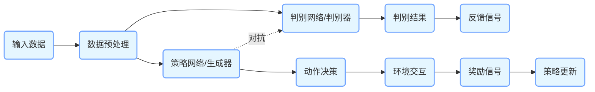

# 构建AI Agent的对抗学习机制：提高鲁棒性

> 关键词：AI Agent、对抗学习机制、鲁棒性、强化学习、博弈论

> 摘要：本文聚焦于构建AI Agent的对抗学习机制以提高其鲁棒性。首先介绍了相关背景知识，包括目的、预期读者、文档结构和术语表。接着阐述了核心概念与联系，通过文本示意图和Mermaid流程图进行直观展示。详细讲解了核心算法原理，并给出Python源代码。同时，介绍了相关数学模型和公式，并举例说明。通过项目实战，展示了代码实际案例并进行详细解释。分析了实际应用场景，推荐了学习资源、开发工具框架和相关论文著作。最后总结了未来发展趋势与挑战，并给出常见问题解答和扩展阅读参考资料，旨在为读者深入理解和应用AI Agent的对抗学习机制提供全面的指导。

## 1. 背景介绍 
### 1.1 目的和范围
随着人工智能技术的快速发展，AI Agent在各个领域得到了广泛应用，如游戏、自动驾驶、机器人控制等。然而，这些AI Agent在实际应用中往往面临各种不确定性和攻击，其鲁棒性成为了一个关键问题。本文章的目的是深入探讨如何构建AI Agent的对抗学习机制，以提高其在复杂环境下的鲁棒性。具体范围涵盖了对抗学习机制的核心概念、算法原理、数学模型、实际应用场景等方面，通过理论分析和项目实战相结合的方式，为读者提供全面的技术指导。

### 1.2 预期读者
本文预期读者包括人工智能领域的研究人员、开发者、工程师，以及对AI Agent和对抗学习感兴趣的学生和爱好者。具备一定的机器学习、深度学习和编程基础的读者将更容易理解本文的内容，但即使是初学者，也可以通过仔细阅读和参考相关资料，逐步掌握其中的关键技术。

### 1.3 文档结构概述
本文将按照以下结构进行组织：
- 核心概念与联系：介绍对抗学习机制的基本概念、原理和架构，通过文本示意图和Mermaid流程图进行直观展示。
- 核心算法原理 & 具体操作步骤：详细讲解对抗学习的核心算法，如生成对抗网络（GAN）、对抗强化学习等，并给出Python源代码实现。
- 数学模型和公式 & 详细讲解 & 举例说明：介绍对抗学习中的数学模型和公式，如损失函数、优化算法等，并通过具体例子进行说明。
- 项目实战：代码实际案例和详细解释说明：通过一个具体的项目实战，展示如何构建AI Agent的对抗学习机制，并对代码进行详细解读。
- 实际应用场景：分析对抗学习机制在不同领域的实际应用场景，如安全防护、图像生成、游戏等。
- 工具和资源推荐：推荐相关的学习资源、开发工具框架和论文著作，帮助读者进一步深入学习和研究。
- 总结：未来发展趋势与挑战：总结对抗学习机制的发展趋势和面临的挑战，为读者提供展望和思考。
- 附录：常见问题与解答：解答读者在学习和实践过程中可能遇到的常见问题。
- 扩展阅读 & 参考资料：提供相关的扩展阅读材料和参考资料，方便读者进一步探索。

### 1.4 术语表
#### 1.4.1 核心术语定义
- **AI Agent**：人工智能代理，是一种能够感知环境、做出决策并采取行动的智能实体。
- **对抗学习机制**：通过引入对抗性的训练方式，使AI Agent能够学习到更鲁棒的策略和特征表示。
- **鲁棒性**：指系统在面对各种不确定性和干扰时，仍能保持稳定和可靠的性能。
- **生成对抗网络（GAN）**：一种由生成器和判别器组成的深度学习模型，通过对抗训练来生成逼真的数据。
- **对抗强化学习**：将对抗学习的思想引入强化学习中，使智能体在与对手的对抗中学习到更优的策略。

#### 1.4.2 相关概念解释
- **策略网络**：在强化学习中，用于表示智能体的决策策略的神经网络。
- **价值网络**：用于评估智能体在某个状态下的价值的神经网络。
- **损失函数**：用于衡量模型预测结果与真实标签之间的差异，是模型训练的目标函数。
- **优化算法**：用于最小化损失函数的算法，如随机梯度下降（SGD）、Adam等。

#### 1.4.3 缩略词列表
- **GAN**：Generative Adversarial Network（生成对抗网络）
- **RL**：Reinforcement Learning（强化学习）
- **A2C**：Advantage Actor - Critic（优势演员 - 评论家算法）
- **PPO**：Proximal Policy Optimization（近端策略优化算法）

## 2. 核心概念与联系 
### 核心概念原理
对抗学习机制的核心思想是通过引入对抗性的训练方式，使AI Agent能够学习到更鲁棒的策略和特征表示。在对抗学习中，通常存在两个或多个相互对抗的参与者，它们通过不断地竞争和博弈来提高自身的性能。

以生成对抗网络（GAN）为例，GAN由生成器（Generator）和判别器（Discriminator）组成。生成器的目标是生成逼真的数据，而判别器的目标是区分生成的数据和真实的数据。在训练过程中，生成器和判别器相互对抗，生成器不断改进自己的生成能力，以欺骗判别器；判别器则不断提高自己的判别能力，以识别出虚假的数据。通过这种对抗训练，生成器最终能够生成非常逼真的数据。

在对抗强化学习中，智能体与对手进行对抗训练，智能体的目标是学习到最优的策略，以在与对手的对抗中获得最大的收益。对手可以是另一个智能体，也可以是环境中的干扰因素。通过与对手的对抗，智能体能够学习到更鲁棒的策略，以应对各种不确定性和干扰。

### 架构的文本示意图
```plaintext
AI Agent对抗学习机制架构

输入数据
|
v
数据预处理
|
v
策略网络（生成器） ------ 对抗 ------ 判别网络（判别器）
|                                      |
v                                      v
动作决策                             判别结果
|                                      |
v                                      v
环境交互                             反馈信号
|
v
奖励信号
|
v
策略更新
```

### Mermaid流程图


这个流程图展示了AI Agent对抗学习机制的主要流程。输入数据经过预处理后，分别输入到策略网络（生成器）和判别网络（判别器）中。策略网络根据输入数据做出动作决策，与环境进行交互；判别网络对输入数据进行判别，并输出判别结果。环境交互产生奖励信号，用于更新策略网络。同时，策略网络和判别网络之间存在对抗关系，通过不断的对抗训练来提高整个系统的性能。

## 3. 核心算法原理 & 具体操作步骤 
### 生成对抗网络（GAN）原理
生成对抗网络（GAN）由生成器 $G$ 和判别器 $D$ 组成。生成器 $G$ 接收一个随机噪声向量 $z$ 作为输入，生成一个数据样本 $G(z)$。判别器 $D$ 接收一个数据样本 $x$（可以是真实数据或生成器生成的数据）作为输入，输出一个概率值 $D(x)$，表示 $x$ 是真实数据的概率。

GAN的训练目标是使生成器生成的数据尽可能逼真，同时使判别器能够准确地区分真实数据和生成的数据。这可以通过最小化以下对抗损失函数来实现：

$$
\min_G \max_D V(D, G) = \mathbb{E}_{x \sim p_{data}(x)}[\log D(x)] + \mathbb{E}_{z \sim p_z(z)}[\log(1 - D(G(z)))]
$$

其中，$p_{data}(x)$ 是真实数据的分布，$p_z(z)$ 是随机噪声的分布。

### Python源代码实现
```python
import torch
import torch.nn as nn
import torch.optim as optim
import numpy as np
import matplotlib.pyplot as plt

# 定义生成器
class Generator(nn.Module):
    def __init__(self, input_dim, output_dim):
        super(Generator, self).__init__()
        self.model = nn.Sequential(
            nn.Linear(input_dim, 128),
            nn.LeakyReLU(0.2),
            nn.Linear(128, output_dim),
            nn.Tanh()
        )

    def forward(self, z):
        return self.model(z)

# 定义判别器
class Discriminator(nn.Module):
    def __init__(self, input_dim):
        super(Discriminator, self).__init__()
        self.model = nn.Sequential(
            nn.Linear(input_dim, 128),
            nn.LeakyReLU(0.2),
            nn.Linear(128, 1),
            nn.Sigmoid()
        )

    def forward(self, x):
        return self.model(x)

# 超参数设置
input_dim = 100
output_dim = 1
batch_size = 32
epochs = 100
lr = 0.0002

# 初始化生成器和判别器
generator = Generator(input_dim, output_dim)
discriminator = Discriminator(output_dim)

# 定义优化器和损失函数
g_optimizer = optim.Adam(generator.parameters(), lr=lr)
d_optimizer = optim.Adam(discriminator.parameters(), lr=lr)
criterion = nn.BCELoss()

# 生成真实数据
def generate_real_data(batch_size):
    return torch.FloatTensor(np.random.normal(0, 1, (batch_size, output_dim)))

# 训练过程
for epoch in range(epochs):
    for _ in range(100):
        # 训练判别器
        discriminator.zero_grad()

        # 真实数据
        real_data = generate_real_data(batch_size)
        real_labels = torch.ones(batch_size, 1)
        real_output = discriminator(real_data)
        d_real_loss = criterion(real_output, real_labels)

        # 生成数据
        z = torch.FloatTensor(np.random.normal(0, 1, (batch_size, input_dim)))
        fake_data = generator(z)
        fake_labels = torch.zeros(batch_size, 1)
        fake_output = discriminator(fake_data.detach())
        d_fake_loss = criterion(fake_output, fake_labels)

        # 判别器总损失
        d_loss = d_real_loss + d_fake_loss
        d_loss.backward()
        d_optimizer.step()

        # 训练生成器
        generator.zero_grad()
        z = torch.FloatTensor(np.random.normal(0, 1, (batch_size, input_dim)))
        fake_data = generator(z)
        fake_labels = torch.ones(batch_size, 1)
        fake_output = discriminator(fake_data)
        g_loss = criterion(fake_output, fake_labels)
        g_loss.backward()
        g_optimizer.step()

    if epoch % 10 == 0:
        print(f'Epoch {epoch}: Generator Loss: {g_loss.item()}, Discriminator Loss: {d_loss.item()}')

# 生成一些样本进行可视化
z = torch.FloatTensor(np.random.normal(0, 1, (1000, input_dim)))
generated_samples = generator(z).detach().numpy()
plt.hist(generated_samples, bins=50)
plt.show()
```
### 代码解释
1. **生成器和判别器的定义**：`Generator` 类和 `Discriminator` 类分别定义了生成器和判别器的神经网络结构。生成器接收一个随机噪声向量作为输入，输出一个数据样本；判别器接收一个数据样本作为输入，输出一个概率值。
2. **优化器和损失函数**：使用Adam优化器来更新生成器和判别器的参数，使用二元交叉熵损失函数（`BCELoss`）来计算损失。
3. **训练过程**：在每个训练步骤中，首先训练判别器，使其能够区分真实数据和生成的数据；然后训练生成器，使其能够生成更逼真的数据。
4. **可视化**：训练完成后，生成一些样本并进行可视化，观察生成器的生成效果。

### 对抗强化学习原理
在对抗强化学习中，智能体与对手进行对抗训练，智能体的目标是学习到最优的策略，以在与对手的对抗中获得最大的收益。常见的对抗强化学习算法包括A2C（Advantage Actor - Critic）和PPO（Proximal Policy Optimization）等。

以A2C算法为例，A2C算法结合了策略梯度和价值函数的思想，通过一个演员网络（策略网络）来选择动作，通过一个评论家网络（价值网络）来评估状态的价值。

### Python源代码实现（A2C算法示例）
```python
import torch
import torch.nn as nn
import torch.optim as optim
import numpy as np
import gym

# 定义演员 - 评论家网络
class ActorCritic(nn.Module):
    def __init__(self, input_dim, output_dim):
        super(ActorCritic, self).__init__()
        self.fc1 = nn.Linear(input_dim, 128)
        self.actor = nn.Linear(128, output_dim)
        self.critic = nn.Linear(128, 1)

    def forward(self, x):
        x = torch.relu(self.fc1(x))
        action_probs = torch.softmax(self.actor(x), dim=-1)
        state_value = self.critic(x)
        return action_probs, state_value

# 超参数设置
input_dim = 4
output_dim = 2
gamma = 0.99
lr = 0.001
epochs = 1000

# 初始化环境和网络
env = gym.make('CartPole-v1')
model = ActorCritic(input_dim, output_dim)
optimizer = optim.Adam(model.parameters(), lr=lr)

# 训练过程
for epoch in range(epochs):
    state = env.reset()
    state = torch.FloatTensor(state).unsqueeze(0)
    log_probs = []
    rewards = []
    values = []

    while True:
        action_probs, state_value = model(state)
        action = torch.multinomial(action_probs, 1).item()
        next_state, reward, done, _ = env.step(action)
        next_state = torch.FloatTensor(next_state).unsqueeze(0)

        log_prob = torch.log(action_probs.squeeze(0)[action])
        log_probs.append(log_prob)
        rewards.append(reward)
        values.append(state_value)

        state = next_state

        if done:
            break

    # 计算回报
    R = 0
    returns = []
    for r in reversed(rewards):
        R = r + gamma * R
        returns.insert(0, R)
    returns = torch.FloatTensor(returns)

    # 计算优势
    values = torch.cat(values)
    advantages = returns - values.squeeze()

    # 计算损失
    actor_loss = -torch.stack(log_probs) * advantages.detach()
    actor_loss = actor_loss.mean()
    critic_loss = advantages.pow(2).mean()
    loss = actor_loss + critic_loss

    # 更新参数
    optimizer.zero_grad()
    loss.backward()
    optimizer.step()

    if epoch % 100 == 0:
        print(f'Epoch {epoch}: Loss: {loss.item()}')

env.close()
```
### 代码解释
1. **演员 - 评论家网络的定义**：`ActorCritic` 类定义了演员 - 评论家网络的结构，包括一个共享的全连接层，一个演员网络用于输出动作概率，一个评论家网络用于输出状态价值。
2. **训练过程**：在每个训练周期中，智能体与环境进行交互，记录动作的对数概率、奖励和状态价值。训练结束后，计算回报和优势，然后计算演员损失和评论家损失，最后更新网络参数。

## 4. 数学模型和公式 & 详细讲解 & 举例说明 
### 生成对抗网络（GAN）的数学模型和公式
#### 对抗损失函数
如前文所述，GAN的对抗损失函数为：

$$
\min_G \max_D V(D, G) = \mathbb{E}_{x \sim p_{data}(x)}[\log D(x)] + \mathbb{E}_{z \sim p_z(z)}[\log(1 - D(G(z)))]
$$

详细讲解：
- 第一项 $\mathbb{E}_{x \sim p_{data}(x)}[\log D(x)]$ 表示判别器对真实数据的判别能力。判别器的目标是最大化这一项，即尽可能准确地识别出真实数据。
- 第二项 $\mathbb{E}_{z \sim p_z(z)}[\log(1 - D(G(z)))]$ 表示判别器对生成数据的判别能力。判别器的目标是最大化这一项，即尽可能准确地识别出虚假数据；而生成器的目标是最小化这一项，即生成更逼真的数据来欺骗判别器。

#### 举例说明
假设真实数据服从正态分布 $N(0, 1)$，生成器接收一个随机噪声向量 $z$ 并生成一个数据样本 $G(z)$。判别器的输出范围是 $[0, 1]$，表示输入数据是真实数据的概率。在训练过程中，判别器会不断调整自己的参数，使得对于真实数据，输出接近1；对于生成数据，输出接近0。生成器则会不断调整自己的参数，使得生成的数据能够让判别器输出接近1。

### 对抗强化学习的数学模型和公式
#### 策略梯度定理
在强化学习中，策略梯度定理是计算策略梯度的基础。策略梯度定理表明，策略的梯度可以表示为：

$$
\nabla_{\theta} J(\theta) = \mathbb{E}_{\tau \sim \pi_{\theta}(\tau)}\left[\sum_{t=0}^{T} \nabla_{\theta} \log \pi_{\theta}(a_t|s_t) A^{\pi_{\theta}}(s_t, a_t)\right]
$$

其中，$\theta$ 是策略网络的参数，$J(\theta)$ 是策略的期望回报，$\tau$ 是一个轨迹，$\pi_{\theta}(\tau)$ 是策略 $\pi_{\theta}$ 生成轨迹 $\tau$ 的概率，$\pi_{\theta}(a_t|s_t)$ 是在状态 $s_t$ 下采取动作 $a_t$ 的概率，$A^{\pi_{\theta}}(s_t, a_t)$ 是优势函数。

详细讲解：
- 策略梯度定理的核心思想是通过调整策略网络的参数，使得策略在与环境交互过程中获得的期望回报最大化。
- 优势函数 $A^{\pi_{\theta}}(s_t, a_t)$ 表示在状态 $s_t$ 下采取动作 $a_t$ 相对于平均动作的优势。如果优势函数为正，则说明采取该动作会获得更高的回报；如果优势函数为负，则说明采取该动作会获得更低的回报。

#### A2C算法的损失函数
在A2C算法中，损失函数由演员损失和评论家损失组成：

$$
L = L_{actor} + L_{critic}
$$

其中，演员损失为：

$$
L_{actor} = -\mathbb{E}_{s, a \sim \pi_{\theta}}[\log \pi_{\theta}(a|s) A^{\pi_{\theta}}(s, a)]
$$

评论家损失为：

$$
L_{critic} = \mathbb{E}_{s \sim \pi_{\theta}}[(V^{\pi_{\theta}}(s) - R)^2]
$$

其中，$V^{\pi_{\theta}}(s)$ 是状态 $s$ 的价值估计，$R$ 是回报。

详细讲解：
- 演员损失的目标是最大化策略在与环境交互过程中获得的期望回报。通过最小化演员损失，策略网络会调整参数，使得在优势函数为正的情况下，采取该动作的概率增加；在优势函数为负的情况下，采取该动作的概率减少。
- 评论家损失的目标是最小化状态价值估计与实际回报之间的误差。通过最小化评论家损失，价值网络会调整参数，使得状态价值估计更加准确。

#### 举例说明
以CartPole环境为例，智能体的目标是控制一个杆子保持平衡。在每个时间步，智能体观察到当前的状态 $s_t$，根据策略网络 $\pi_{\theta}$ 选择一个动作 $a_t$，并获得一个奖励 $r_t$。在一个轨迹结束后，计算回报 $R$ 和优势函数 $A^{\pi_{\theta}}(s_t, a_t)$，然后根据A2C算法的损失函数更新策略网络和价值网络的参数。经过多次训练，智能体能够学习到一个最优的策略，使得杆子能够保持更长时间的平衡。

## 5. 项目实战：代码实际案例和详细解释说明 
### 5.1  开发环境搭建
#### 安装Python和相关库
首先，确保你已经安装了Python 3.6或更高版本。然后，使用以下命令安装所需的库：
```sh
pip install torch numpy matplotlib gym
```
- `torch`：PyTorch深度学习框架，用于构建和训练神经网络。
- `numpy`：用于数值计算。
- `matplotlib`：用于数据可视化。
- `gym`：OpenAI Gym是一个用于开发和比较强化学习算法的工具包，提供了各种环境供智能体进行训练和测试。

### 5.2  源代码详细实现和代码解读
#### 项目背景
我们将构建一个简单的AI Agent对抗学习机制，使用生成对抗网络（GAN）生成手写数字图像，并使用对抗强化学习让智能体在一个简单的游戏环境中学习最优策略。

#### 生成对抗网络（GAN）生成手写数字图像
```python
import torch
import torch.nn as nn
import torch.optim as optim
import torchvision
import torchvision.datasets as datasets
import torchvision.transforms as transforms
import matplotlib.pyplot as plt
import numpy as np

# 定义生成器
class Generator(nn.Module):
    def __init__(self, input_dim, output_dim):
        super(Generator, self).__init__()
        self.model = nn.Sequential(
            nn.Linear(input_dim, 256),
            nn.LeakyReLU(0.2),
            nn.Linear(256, 512),
            nn.LeakyReLU(0.2),
            nn.Linear(512, output_dim),
            nn.Tanh()
        )

    def forward(self, z):
        return self.model(z)

# 定义判别器
class Discriminator(nn.Module):
    def __init__(self, input_dim):
        super(Discriminator, self).__init__()
        self.model = nn.Sequential(
            nn.Linear(input_dim, 512),
            nn.LeakyReLU(0.2),
            nn.Linear(512, 256),
            nn.LeakyReLU(0.2),
            nn.Linear(256, 1),
            nn.Sigmoid()
        )

    def forward(self, x):
        return self.model(x)

# 超参数设置
input_dim = 100
output_dim = 784  # 28x28图像
batch_size = 64
epochs = 50
lr = 0.0002

# 加载数据集
transform = transforms.Compose([
    transforms.ToTensor(),
    transforms.Normalize((0.5,), (0.5,))
])
dataset = datasets.MNIST(root='./data', train=True, transform=transform, download=True)
dataloader = torch.utils.data.DataLoader(dataset, batch_size=batch_size, shuffle=True)

# 初始化生成器和判别器
generator = Generator(input_dim, output_dim)
discriminator = Discriminator(output_dim)

# 定义优化器和损失函数
g_optimizer = optim.Adam(generator.parameters(), lr=lr)
d_optimizer = optim.Adam(discriminator.parameters(), lr=lr)
criterion = nn.BCELoss()

# 训练过程
for epoch in range(epochs):
    for i, (real_images, _) in enumerate(dataloader):
        real_images = real_images.view(real_images.size(0), -1)

        # 训练判别器
        discriminator.zero_grad()

        # 真实数据
        real_labels = torch.ones(real_images.size(0), 1)
        real_output = discriminator(real_images)
        d_real_loss = criterion(real_output, real_labels)

        # 生成数据
        z = torch.randn(real_images.size(0), input_dim)
        fake_images = generator(z)
        fake_labels = torch.zeros(real_images.size(0), 1)
        fake_output = discriminator(fake_images.detach())
        d_fake_loss = criterion(fake_output, fake_labels)

        # 判别器总损失
        d_loss = d_real_loss + d_fake_loss
        d_loss.backward()
        d_optimizer.step()

        # 训练生成器
        generator.zero_grad()
        z = torch.randn(real_images.size(0), input_dim)
        fake_images = generator(z)
        fake_labels = torch.ones(real_images.size(0), 1)
        fake_output = discriminator(fake_images)
        g_loss = criterion(fake_output, fake_labels)
        g_loss.backward()
        g_optimizer.step()

    if epoch % 10 == 0:
        print(f'Epoch {epoch}: Generator Loss: {g_loss.item()}, Discriminator Loss: {d_loss.item()}')

# 生成一些样本进行可视化
z = torch.randn(16, input_dim)
generated_images = generator(z).detach().view(-1, 1, 28, 28)
generated_images = (generated_images + 1) / 2.0  # 反归一化
grid = torchvision.utils.make_grid(generated_images)
plt.imshow(np.transpose(grid, (1, 2, 0)))
plt.show()
```
#### 代码解读
1. **数据加载**：使用 `torchvision.datasets.MNIST` 加载MNIST手写数字数据集，并使用 `torch.utils.data.DataLoader` 创建数据加载器。
2. **生成器和判别器的定义**：`Generator` 类和 `Discriminator` 类分别定义了生成器和判别器的神经网络结构。生成器接收一个随机噪声向量作为输入，输出一个784维的向量，表示一个28x28的手写数字图像；判别器接收一个784维的向量作为输入，输出一个概率值，表示输入图像是真实图像的概率。
3. **训练过程**：在每个训练步骤中，首先训练判别器，使其能够区分真实图像和生成图像；然后训练生成器，使其能够生成更逼真的图像。
4. **可视化**：训练完成后，生成一些样本并进行可视化，观察生成器的生成效果。

#### 对抗强化学习在简单游戏环境中的应用
```python
import torch
import torch.nn as nn
import torch.optim as optim
import numpy as np
import gym

# 定义演员 - 评论家网络
class ActorCritic(nn.Module):
    def __init__(self, input_dim, output_dim):
        super(ActorCritic, self).__init__()
        self.fc1 = nn.Linear(input_dim, 128)
        self.actor = nn.Linear(128, output_dim)
        self.critic = nn.Linear(128, 1)

    def forward(self, x):
        x = torch.relu(self.fc1(x))
        action_probs = torch.softmax(self.actor(x), dim=-1)
        state_value = self.critic(x)
        return action_probs, state_value

# 超参数设置
input_dim = 4
output_dim = 2
gamma = 0.99
lr = 0.001
epochs = 1000

# 初始化环境和网络
env = gym.make('CartPole-v1')
model = ActorCritic(input_dim, output_dim)
optimizer = optim.Adam(model.parameters(), lr=lr)

# 训练过程
for epoch in range(epochs):
    state = env.reset()
    state = torch.FloatTensor(state).unsqueeze(0)
    log_probs = []
    rewards = []
    values = []

    while True:
        action_probs, state_value = model(state)
        action = torch.multinomial(action_probs, 1).item()
        next_state, reward, done, _ = env.step(action)
        next_state = torch.FloatTensor(next_state).unsqueeze(0)

        log_prob = torch.log(action_probs.squeeze(0)[action])
        log_probs.append(log_prob)
        rewards.append(reward)
        values.append(state_value)

        state = next_state

        if done:
            break

    # 计算回报
    R = 0
    returns = []
    for r in reversed(rewards):
        R = r + gamma * R
        returns.insert(0, R)
    returns = torch.FloatTensor(returns)

    # 计算优势
    values = torch.cat(values)
    advantages = returns - values.squeeze()

    # 计算损失
    actor_loss = -torch.stack(log_probs) * advantages.detach()
    actor_loss = actor_loss.mean()
    critic_loss = advantages.pow(2).mean()
    loss = actor_loss + critic_loss

    # 更新参数
    optimizer.zero_grad()
    loss.backward()
    optimizer.step()

    if epoch % 100 == 0:
        print(f'Epoch {epoch}: Loss: {loss.item()}')

env.close()
```
#### 代码解读
1. **环境初始化**：使用 `gym.make('CartPole-v1')` 初始化CartPole环境。
2. **演员 - 评论家网络的定义**：`ActorCritic` 类定义了演员 - 评论家网络的结构，包括一个共享的全连接层，一个演员网络用于输出动作概率，一个评论家网络用于输出状态价值。
3. **训练过程**：在每个训练周期中，智能体与环境进行交互，记录动作的对数概率、奖励和状态价值。训练结束后，计算回报和优势，然后计算演员损失和评论家损失，最后更新网络参数。
4. **结果输出**：每隔100个训练周期，输出当前的损失值。

### 5.3  代码解读与分析
#### 生成对抗网络（GAN）
- **生成器和判别器的对抗训练**：生成器和判别器在训练过程中相互对抗，生成器试图生成更逼真的图像来欺骗判别器，判别器试图准确地区分真实图像和生成图像。这种对抗训练的方式使得生成器能够学习到数据的分布，从而生成高质量的图像。
- **损失函数的作用**：判别器的损失函数用于衡量其区分真实图像和生成图像的能力，生成器的损失函数用于衡量其生成图像的逼真程度。通过最小化损失函数，生成器和判别器不断调整自己的参数，以提高性能。

#### 对抗强化学习
- **策略梯度和价值函数的结合**：A2C算法结合了策略梯度和价值函数的思想，通过演员网络选择动作，通过评论家网络评估状态的价值。这种结合使得智能体能够更有效地学习到最优策略。
- **优势函数的作用**：优势函数用于衡量在某个状态下采取某个动作相对于平均动作的优势。通过使用优势函数，演员网络能够更有针对性地调整策略，提高学习效率。

## 6. 实际应用场景 
### 安全防护领域
在安全防护领域，对抗学习机制可以用于检测和防御各种攻击。例如，在网络安全中，通过训练一个判别器来区分正常流量和恶意流量，同时训练一个生成器来生成模拟的恶意流量，以增强判别器的检测能力。在图像识别中，对抗学习可以用于检测和防御对抗样本攻击，通过训练一个模型来识别对抗样本，并生成更鲁棒的特征表示。

### 图像生成领域
生成对抗网络（GAN）在图像生成领域取得了巨大的成功。通过对抗训练，生成器能够学习到真实图像的分布，从而生成高质量的图像。例如，在艺术创作中，GAN可以用于生成逼真的绘画、照片等；在影视制作中，GAN可以用于生成特效场景、虚拟角色等。

### 游戏领域
在游戏领域，对抗强化学习可以用于训练智能体在游戏中学习最优策略。例如，在围棋、象棋等棋类游戏中，通过让智能体与对手进行对抗训练，智能体能够学习到更复杂的策略和战术。在电子竞技游戏中，对抗强化学习可以用于训练智能体与人类玩家进行对抗，提高游戏的趣味性和挑战性。

### 自动驾驶领域
在自动驾驶领域，对抗学习机制可以用于提高自动驾驶系统的鲁棒性。例如，通过训练一个对抗智能体来模拟各种可能的干扰和攻击，让自动驾驶系统在与对抗智能体的对抗中学习到更鲁棒的决策策略，从而提高在复杂环境下的安全性。

## 7. 工具和资源推荐
### 7.1 学习资源推荐
#### 7.1.1 书籍推荐
- 《深度学习》（Deep Learning）：由Ian Goodfellow、Yoshua Bengio和Aaron Courville合著，是深度学习领域的经典教材，涵盖了深度学习的基本概念、算法和应用。
- 《强化学习：原理与Python实现》：详细介绍了强化学习的基本原理和算法，并提供了Python代码实现，适合初学者入门。
- 《生成对抗网络实战》（GANs in Action）：全面介绍了生成对抗网络的原理、算法和应用，并提供了大量的代码示例和案例分析。

#### 7.1.2 在线课程
- Coursera上的“深度学习专项课程”（Deep Learning Specialization）：由Andrew Ng教授授课，涵盖了深度学习的各个方面，包括神经网络、卷积神经网络、循环神经网络等。
- Udemy上的“强化学习实战”（Reinforcement Learning A-Z™: Learn How To Build AI）：通过实际项目和案例，介绍了强化学习的基本原理和算法，适合初学者和有一定基础的开发者。
- edX上的“生成对抗网络基础”（Fundamentals of Generative Adversarial Networks）：深入介绍了生成对抗网络的原理、算法和应用，适合对GAN感兴趣的研究人员和开发者。

#### 7.1.3 技术博客和网站
- Medium：一个技术博客平台，有很多关于人工智能、深度学习、强化学习等领域的优质文章。
- arXiv：一个预印本服务器，提供了大量的学术论文和研究成果，是获取最新技术信息的重要来源。
- OpenAI官方博客：OpenAI是人工智能领域的领先研究机构，其官方博客发布了很多关于人工智能的最新研究成果和技术进展。

### 7.2 开发工具框架推荐
#### 7.2.1 IDE和编辑器
- PyCharm：一款专业的Python集成开发环境，提供了丰富的代码编辑、调试、版本控制等功能，适合Python开发者使用。
- Jupyter Notebook：一个交互式的笔记本环境，支持Python、R等多种编程语言，适合数据科学和机器学习领域的开发和研究。
- Visual Studio Code：一款轻量级的代码编辑器，支持多种编程语言和插件扩展，适合快速开发和调试。

#### 7.2.2 调试和性能分析工具
- TensorBoard：TensorFlow提供的可视化工具，用于监控和分析模型的训练过程和性能指标。
- PyTorch Profiler：PyTorch提供的性能分析工具，用于分析模型的运行时间、内存使用等情况，帮助开发者优化代码性能。
- cProfile：Python标准库中的性能分析工具，用于分析Python代码的运行时间和函数调用情况。

#### 7.2.3 相关框架和库
- PyTorch：一个开源的深度学习框架，提供了丰富的神经网络层、优化算法和数据处理工具，易于使用和扩展。
- TensorFlow：另一个广泛使用的深度学习框架，具有强大的分布式训练和部署能力，适合大规模的工业应用。
- Gym：OpenAI开发的强化学习工具包，提供了各种环境供智能体进行训练和测试，方便开发者进行强化学习算法的研究和实验。

### 7.3 相关论文著作推荐
#### 7.3.1 经典论文
- “Generative Adversarial Nets”：GAN的开创性论文，由Ian Goodfellow等人发表，首次提出了生成对抗网络的概念和算法。
- “Policy Gradient Methods for Reinforcement Learning with Function Approximation”：策略梯度算法的经典论文，为强化学习中的策略优化提供了理论基础。
- “Asynchronous Methods for Deep Reinforcement Learning”：A3C算法的论文，提出了异步优势演员 - 评论家算法，提高了强化学习的训练效率。

#### 7.3.2 最新研究成果
- 关注顶级学术会议如NeurIPS、ICML、CVPR等的最新论文，这些会议汇集了人工智能领域的最新研究成果和技术进展。
- 关注知名研究机构如OpenAI、DeepMind等的官方网站和博客，他们经常发布最新的研究成果和技术报告。

#### 7.3.3 应用案例分析
- 《AI未来进行式》：介绍了人工智能在各个领域的应用案例和发展趋势，包括医疗、金融、交通等。
- 《智能时代》：探讨了人工智能对社会和经济的影响，以及如何利用人工智能推动各行业的发展。

## 8. 总结：未来发展趋势与挑战
### 未来发展趋势
- **多智能体对抗学习**：随着人工智能技术的发展，越来越多的应用场景需要多个智能体之间进行协作和对抗。多智能体对抗学习将成为未来的一个重要研究方向，例如在自动驾驶、机器人协作等领域。
- **结合其他技术**：对抗学习机制将与其他技术如迁移学习、元学习等相结合，以提高模型的泛化能力和学习效率。例如，通过迁移学习可以将在一个任务中学习到的知识迁移到另一个任务中，从而减少训练时间和数据需求。
- **应用领域拓展**：对抗学习机制将在更多的领域得到应用，如医疗、金融、教育等。例如，在医疗领域，对抗学习可以用于疾病诊断、药物研发等；在金融领域，对抗学习可以用于风险评估、欺诈检测等。

### 挑战
- **训练稳定性**：对抗学习机制的训练过程往往不稳定，容易出现梯度消失、梯度爆炸等问题。如何提高训练的稳定性是一个亟待解决的问题。
- **可解释性**：对抗学习模型通常是黑盒模型，难以解释其决策过程和结果。在一些对安全性和可靠性要求较高的应用场景中，模型的可解释性至关重要。
- **对抗攻击防御**：虽然对抗学习可以用于检测和防御对抗攻击，但攻击者也可以利用对抗学习技术生成更强大的对抗样本。如何提高模型对对抗攻击的防御能力是一个长期的挑战。

## 9. 附录：常见问题与解答
### 1. 对抗学习和传统机器学习有什么区别？
对抗学习通过引入对抗性的训练方式，使模型能够学习到更鲁棒的特征表示和策略。与传统机器学习相比，对抗学习更注重模型在面对不确定性和干扰时的性能，能够提高模型的鲁棒性和泛化能力。

### 2. 如何选择合适的对抗学习算法？
选择合适的对抗学习算法需要考虑多个因素，如问题的类型、数据的特点、计算资源等。例如，如果是图像生成问题，可以选择生成对抗网络（GAN）；如果是强化学习问题，可以选择对抗强化学习算法如A2C、PPO等。

### 3. 对抗学习机制容易出现过拟合吗？
对抗学习机制在训练过程中也可能出现过拟合问题。为了避免过拟合，可以采用一些正则化方法，如Dropout、L1/L2正则化等，同时增加训练数据的多样性和数量。

### 4. 对抗学习机制的训练时间通常较长，有什么方法可以加速训练？
可以采用以下方法加速对抗学习机制的训练：
- 使用更强大的计算资源，如GPU、TPU等。
- 优化算法的实现，如采用异步训练、分布式训练等技术。
- 减少模型的复杂度，如减少神经网络的层数和神经元数量。

## 10. 扩展阅读 & 参考资料
### 扩展阅读
- 《深度学习进阶：算法与应用》：深入介绍了深度学习的各种算法和应用，包括对抗学习、强化学习等。
- 《人工智能：现代方法》：全面介绍了人工智能的基本概念、算法和应用，是人工智能领域的经典教材。

### 参考资料
- Goodfellow, I. J., et al. "Generative adversarial nets." Advances in neural information processing systems. 2014.
- Mnih, V., et al. "Asynchronous methods for deep reinforcement learning." International conference on machine learning. 2016.
- Schulman, J., et al. "Proximal policy optimization algorithms." arXiv preprint arXiv:1707.06347 (2017).

作者：AI天才研究院/AI Genius Institute & 禅与计算机程序设计艺术 /Zen And The Art of Computer Programming