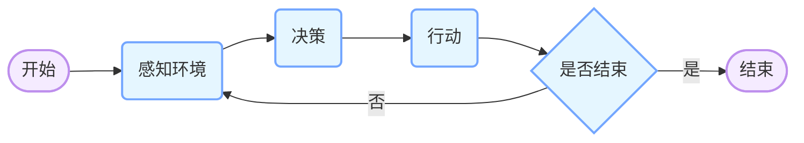

# 构建AI Agent的技术栈选择指南

> 关键词：AI Agent、技术栈选择、人工智能、编程语言、开发框架

> 摘要：本文旨在为开发者提供一份全面的构建AI Agent技术栈选择指南。通过深入剖析AI Agent的核心概念、算法原理、数学模型等方面，结合实际项目案例，详细阐述了在不同场景下如何选择合适的技术栈。同时，还推荐了相关的学习资源、开发工具和论文著作，最后对AI Agent未来发展趋势与挑战进行了总结，帮助开发者更好地掌握构建AI Agent的技术要点。

## 1. 背景介绍 
### 1.1 目的和范围
随着人工智能技术的飞速发展，AI Agent在各个领域的应用越来越广泛。AI Agent能够感知环境、做出决策并采取行动，为解决复杂问题提供了强大的支持。本指南的目的是帮助开发者了解构建AI Agent所需的技术栈，从编程语言、开发框架到相关工具，全面介绍各种选择，并提供实际应用场景下的建议，以便开发者能够根据自己的需求和项目特点选择最合适的技术栈。

本指南的范围涵盖了AI Agent的核心概念、算法原理、数学模型、项目实战等方面，同时还涉及到学习资源、开发工具和论文著作的推荐，为开发者提供一站式的技术栈选择参考。

### 1.2 预期读者
本指南主要面向对人工智能和AI Agent开发感兴趣的开发者，包括但不限于以下人群：
- 初学者：希望了解AI Agent开发基础知识和技术栈选择的新手开发者。
- 有一定经验的开发者：想要深入学习AI Agent开发，提高自己的技术水平和项目实践能力的开发者。
- 研究人员：从事人工智能相关研究，需要构建AI Agent进行实验和验证的研究人员。

### 1.3 文档结构概述
本指南的结构如下：
- 核心概念与联系：介绍AI Agent的核心概念、原理和架构，通过文本示意图和Mermaid流程图进行直观展示。
- 核心算法原理 & 具体操作步骤：详细讲解构建AI Agent常用的算法原理，并使用Python源代码进行阐述。
- 数学模型和公式 & 详细讲解 & 举例说明：介绍AI Agent涉及的数学模型和公式，并通过具体例子进行说明。
- 项目实战：代码实际案例和详细解释说明：通过实际项目案例，展示如何使用所选技术栈构建AI Agent，并对代码进行详细解读。
- 实际应用场景：介绍AI Agent在不同领域的实际应用场景，以及相应的技术栈选择建议。
- 工具和资源推荐：推荐学习资源、开发工具框架和相关论文著作，帮助开发者更好地学习和实践。
- 总结：未来发展趋势与挑战：对AI Agent未来的发展趋势进行总结，并分析面临的挑战。
- 附录：常见问题与解答：解答开发者在构建AI Agent过程中常见的问题。
- 扩展阅读 & 参考资料：提供相关的扩展阅读材料和参考资料，供开发者进一步深入学习。

### 1.4 术语表
#### 1.4.1 核心术语定义
- **AI Agent**：人工智能代理，是一种能够感知环境、做出决策并采取行动的智能实体。
- **技术栈**：指构建一个软件系统所需的一系列技术和工具的集合。
- **感知**：AI Agent获取环境信息的过程。
- **决策**：AI Agent根据感知到的信息，选择合适的行动方案的过程。
- **行动**：AI Agent根据决策结果，对环境进行操作的过程。

#### 1.4.2 相关概念解释
- **强化学习**：一种机器学习方法，通过智能体与环境进行交互，根据环境反馈的奖励信号来学习最优策略。
- **深度学习**：一种基于人工神经网络的机器学习方法，能够自动从大量数据中学习特征和模式。
- **自然语言处理**：研究如何让计算机理解和处理人类语言的技术。
- **计算机视觉**：研究如何让计算机理解和处理图像和视频的技术。

#### 1.4.3 缩略词列表
- **RL**：强化学习（Reinforcement Learning）
- **DL**：深度学习（Deep Learning）
- **NLP**：自然语言处理（Natural Language Processing）
- **CV**：计算机视觉（Computer Vision）

## 2. 核心概念与联系 

### 2.1 AI Agent的核心概念
AI Agent是一个能够自主感知环境、做出决策并采取行动的智能实体。它可以是软件程序、机器人或其他形式的智能系统。AI Agent的核心功能包括感知、决策和行动三个方面。

- **感知**：AI Agent通过各种传感器获取环境信息，如摄像头、麦克风、雷达等。这些信息可以是图像、声音、温度、湿度等。
- **决策**：AI Agent根据感知到的信息，使用一定的算法和模型进行分析和推理，选择合适的行动方案。决策过程可以基于规则、机器学习或深度学习等方法。
- **行动**：AI Agent根据决策结果，对环境进行操作。行动可以是物理动作，如移动、抓取等，也可以是虚拟动作，如发送消息、执行任务等。

### 2.2 AI Agent的原理和架构
AI Agent的原理基于智能体与环境的交互。智能体通过感知环境获取信息，然后根据这些信息进行决策，最后采取行动影响环境。环境会根据智能体的行动产生新的状态和奖励信号，智能体根据这些反馈信息调整自己的决策策略，不断学习和优化。

AI Agent的架构可以分为以下几个部分：
- **感知模块**：负责获取环境信息，将其转换为智能体能够处理的格式。
- **决策模块**：根据感知模块提供的信息，使用一定的算法和模型进行决策，选择合适的行动方案。
- **行动模块**：根据决策模块的结果，对环境进行操作。
- **学习模块**：根据环境反馈的奖励信号，对决策模块的策略进行调整和优化。

下面是AI Agent架构的文本示意图：

```plaintext
+-----------------+
|    感知模块     |
+-----------------+
       |
       v
+-----------------+
|    决策模块     |
+-----------------+
       |
       v
+-----------------+
|    行动模块     |
+-----------------+
       |
       v
+-----------------+
|    环境         |
+-----------------+
       |
       v
+-----------------+
|    奖励信号     |
+-----------------+
       |
       v
+-----------------+
|    学习模块     |
+-----------------+
       |
       v
+-----------------+
|    决策模块     |
+-----------------+
```

### 2.3 Mermaid流程图


这个流程图展示了AI Agent的基本工作流程：从感知环境开始，进行决策，然后采取行动，根据行动结果判断是否结束任务，如果未结束则继续循环。

## 3. 核心算法原理 & 具体操作步骤 

### 3.1 强化学习算法原理
强化学习是构建AI Agent常用的算法之一。在强化学习中，智能体与环境进行交互，根据环境反馈的奖励信号来学习最优策略。强化学习的核心概念包括状态、动作、奖励和策略。

- **状态**：表示环境的当前状态，智能体根据状态来选择行动。
- **动作**：智能体可以采取的行动，不同的动作会导致环境状态的变化。
- **奖励**：环境根据智能体的行动给予的反馈信号，用于评估行动的好坏。
- **策略**：智能体根据状态选择动作的规则。

强化学习的目标是找到一个最优策略，使得智能体在长期内获得最大的累积奖励。常用的强化学习算法包括Q学习、深度Q网络（DQN）等。

### 3.2 Q学习算法原理及Python代码实现
Q学习是一种无模型的强化学习算法，通过学习一个Q值函数来找到最优策略。Q值函数表示在某个状态下采取某个动作的预期累积奖励。

Q学习的更新公式如下：

$$Q(s_t, a_t) = Q(s_t, a_t) + \alpha [r_{t+1} + \gamma \max_{a} Q(s_{t+1}, a) - Q(s_t, a_t)]$$

其中：
- $s_t$ 表示当前状态
- $a_t$ 表示当前动作
- $r_{t+1}$ 表示执行动作后获得的奖励
- $s_{t+1}$ 表示执行动作后的下一个状态
- $\alpha$ 表示学习率
- $\gamma$ 表示折扣因子

下面是一个简单的Q学习算法的Python代码实现：

```python
import numpy as np

# 定义环境
num_states = 5
num_actions = 2
Q = np.zeros((num_states, num_actions))

# 定义参数
alpha = 0.1  # 学习率
gamma = 0.9  # 折扣因子
epsilon = 0.1  # 探索率
num_episodes = 100

# 定义环境反馈函数
def get_reward(state, action):
    if state == 4 and action == 1:
        return 1
    return 0

# 定义状态转移函数
def get_next_state(state, action):
    if action == 0:
        return max(0, state - 1)
    else:
        return min(num_states - 1, state + 1)

# Q学习算法
for episode in range(num_episodes):
    state = 0
    done = False
    while not done:
        # 选择动作
        if np.random.uniform(0, 1) < epsilon:
            action = np.random.choice(num_actions)
        else:
            action = np.argmax(Q[state, :])
        
        # 执行动作
        next_state = get_next_state(state, action)
        reward = get_reward(state, action)
        
        # 更新Q值
        Q[state, action] = Q[state, action] + alpha * (reward + gamma * np.max(Q[next_state, :]) - Q[state, action])
        
        state = next_state
        
        if state == 4:
            done = True

print("最终的Q值表：")
print(Q)
```

### 3.3 具体操作步骤
1. **初始化Q值表**：将Q值表初始化为全零。
2. **选择动作**：根据当前状态，使用探索-利用策略选择一个动作。可以使用epsilon-greedy策略，以一定的概率随机选择动作，以一定的概率选择Q值最大的动作。
3. **执行动作**：执行选择的动作，获取下一个状态和奖励。
4. **更新Q值**：根据Q学习的更新公式更新当前状态和动作的Q值。
5. **更新状态**：将当前状态更新为下一个状态。
6. **判断是否结束**：如果达到终止状态，则结束当前回合；否则，继续循环。

通过不断重复以上步骤，智能体可以逐渐学习到最优策略。

## 4. 数学模型和公式 & 详细讲解 & 举例说明 

### 4.1 马尔可夫决策过程（MDP）
马尔可夫决策过程是强化学习的数学基础。MDP可以用一个五元组 $(S, A, P, R, \gamma)$ 表示：
- $S$ 是状态集合，表示环境的所有可能状态。
- $A$ 是动作集合，表示智能体可以采取的所有动作。
- $P(s'|s, a)$ 是状态转移概率，表示在状态 $s$ 下采取动作 $a$ 后转移到状态 $s'$ 的概率。
- $R(s, a)$ 是奖励函数，表示在状态 $s$ 下采取动作 $a$ 获得的奖励。
- $\gamma$ 是折扣因子，用于权衡当前奖励和未来奖励的重要性。

MDP的目标是找到一个最优策略 $\pi^*$，使得智能体在长期内获得最大的累积折扣奖励。累积折扣奖励可以表示为：

$$G_t = \sum_{k=0}^{\infty} \gamma^k r_{t+k+1}$$

其中 $r_{t+k+1}$ 表示在时间步 $t + k + 1$ 获得的奖励。

### 4.2 价值函数
价值函数用于评估状态或状态-动作对的价值。常用的价值函数包括状态价值函数 $V(s)$ 和动作价值函数 $Q(s, a)$。

- 状态价值函数 $V^{\pi}(s)$ 表示在策略 $\pi$ 下，从状态 $s$ 开始的预期累积折扣奖励：

$$V^{\pi}(s) = \mathbb{E}_{\pi} [G_t | s_t = s]$$

- 动作价值函数 $Q^{\pi}(s, a)$ 表示在策略 $\pi$ 下，从状态 $s$ 采取动作 $a$ 开始的预期累积折扣奖励：

$$Q^{\pi}(s, a) = \mathbb{E}_{\pi} [G_t | s_t = s, a_t = a]$$

价值函数满足贝尔曼方程，以状态价值函数为例，贝尔曼方程可以表示为：

$$V^{\pi}(s) = \sum_{a \in A} \pi(a|s) \left[ R(s, a) + \gamma \sum_{s' \in S} P(s'|s, a) V^{\pi}(s') \right]$$

### 4.3 举例说明
假设有一个简单的MDP，状态集合 $S = \{s_1, s_2\}$，动作集合 $A = \{a_1, a_2\}$，状态转移概率和奖励函数如下：

| $s$ | $a$ | $s'$ | $P(s'|s, a)$ | $R(s, a)$ |
|-----|-----|------|--------------|-----------|
| $s_1$ | $a_1$ | $s_1$ | 0.8 | 1 |
| $s_1$ | $a_1$ | $s_2$ | 0.2 | 0 |
| $s_1$ | $a_2$ | $s_1$ | 0.3 | 0 |
| $s_1$ | $a_2$ | $s_2$ | 0.7 | 2 |
| $s_2$ | $a_1$ | $s_1$ | 0.6 | 3 |
| $s_2$ | $a_1$ | $s_2$ | 0.4 | 0 |
| $s_2$ | $a_2$ | $s_1$ | 0.1 | 0 |
| $s_2$ | $a_2$ | $s_2$ | 0.9 | 1 |

假设折扣因子 $\gamma = 0.9$，策略 $\pi$ 是一个随机策略，即 $\pi(a_1|s) = \pi(a_2|s) = 0.5$。

我们可以使用贝尔曼方程来计算状态价值函数 $V^{\pi}(s)$。以状态 $s_1$ 为例：

$$
\begin{align*}
V^{\pi}(s_1) &= \sum_{a \in A} \pi(a|s_1) \left[ R(s_1, a) + \gamma \sum_{s' \in S} P(s'|s_1, a) V^{\pi}(s') \right] \\
&= 0.5 \left[ R(s_1, a_1) + \gamma (0.8 V^{\pi}(s_1) + 0.2 V^{\pi}(s_2)) \right] + 0.5 \left[ R(s_1, a_2) + \gamma (0.3 V^{\pi}(s_1) + 0.7 V^{\pi}(s_2)) \right] \\
&= 0.5 \left[ 1 + 0.9 (0.8 V^{\pi}(s_1) + 0.2 V^{\pi}(s_2)) \right] + 0.5 \left[ 0 + 0.9 (0.3 V^{\pi}(s_1) + 0.7 V^{\pi}(s_2)) \right]
\end{align*}
$$

同理，可以列出状态 $s_2$ 的贝尔曼方程，然后联立求解这两个方程，就可以得到状态价值函数 $V^{\pi}(s_1)$ 和 $V^{\pi}(s_2)$ 的值。

## 5. 项目实战：代码实际案例和详细解释说明 

### 5.1  开发环境搭建
本项目使用Python语言进行开发，需要安装以下库：
- **NumPy**：用于数值计算。
- **OpenAI Gym**：一个用于开发和比较强化学习算法的工具包，提供了各种环境。

可以使用以下命令安装这些库：

```sh
pip install numpy gym
```

### 5.2  源代码详细实现和代码解读
我们以OpenAI Gym中的CartPole环境为例，使用DQN算法构建一个AI Agent来平衡倒立摆。

```python
import gym
import numpy as np
import torch
import torch.nn as nn
import torch.optim as optim
import random
from collections import deque

# 定义DQN网络
class DQN(nn.Module):
    def __init__(self, input_dim, output_dim):
        super(DQN, self).__init__()
        self.fc1 = nn.Linear(input_dim, 64)
        self.fc2 = nn.Linear(64, 64)
        self.fc3 = nn.Linear(64, output_dim)

    def forward(self, x):
        x = torch.relu(self.fc1(x))
        x = torch.relu(self.fc2(x))
        x = self.fc3(x)
        return x

# 定义DQN Agent
class DQNAgent:
    def __init__(self, state_dim, action_dim):
        self.state_dim = state_dim
        self.action_dim = action_dim
        self.memory = deque(maxlen=2000)
        self.gamma = 0.95  # 折扣因子
        self.epsilon = 1.0  # 探索率
        self.epsilon_min = 0.01
        self.epsilon_decay = 0.995
        self.learning_rate = 0.001
        self.model = DQN(state_dim, action_dim)
        self.optimizer = optim.Adam(self.model.parameters(), lr=self.learning_rate)
        self.criterion = nn.MSELoss()

    def remember(self, state, action, reward, next_state, done):
        self.memory.append((state, action, reward, next_state, done))

    def act(self, state):
        if np.random.rand() <= self.epsilon:
            return random.randrange(self.action_dim)
        state = torch.FloatTensor(state).unsqueeze(0)
        q_values = self.model(state)
        action = torch.argmax(q_values, dim=1).item()
        return action

    def replay(self, batch_size):
        minibatch = random.sample(self.memory, batch_size)
        for state, action, reward, next_state, done in minibatch:
            state = torch.FloatTensor(state).unsqueeze(0)
            next_state = torch.FloatTensor(next_state).unsqueeze(0)
            target = reward
            if not done:
                target = (reward + self.gamma * torch.max(self.model(next_state)).item())
            target_f = self.model(state)
            target_f[0][action] = target
            self.optimizer.zero_grad()
            loss = self.criterion(self.model(state), target_f)
            loss.backward()
            self.optimizer.step()
        if self.epsilon > self.epsilon_min:
            self.epsilon *= self.epsilon_decay

# 主函数
def main():
    env = gym.make('CartPole-v1')
    state_dim = env.observation_space.shape[0]
    action_dim = env.action_space.n
    agent = DQNAgent(state_dim, action_dim)
    batch_size = 32
    num_episodes = 1000

    for episode in range(num_episodes):
        state = env.reset()
        total_reward = 0
        done = False
        while not done:
            action = agent.act(state)
            next_state, reward, done, _ = env.step(action)
            agent.remember(state, action, reward, next_state, done)
            state = next_state
            total_reward += reward
            if len(agent.memory) > batch_size:
                agent.replay(batch_size)
        print(f"Episode: {episode + 1}, Total Reward: {total_reward}")

    env.close()

if __name__ == "__main__":
    main()
```

### 5.3  代码解读与分析
- **DQN网络定义**：`DQN` 类定义了一个简单的三层全连接神经网络，用于近似Q值函数。
- **DQN Agent定义**：`DQNAgent` 类实现了DQN算法的核心逻辑，包括经验回放、动作选择和Q值更新。
    - `remember` 方法用于将经验存储到经验回放缓冲区中。
    - `act` 方法根据epsilon-greedy策略选择动作。
    - `replay` 方法从经验回放缓冲区中随机采样一批经验，进行Q值更新。
- **主函数**：在主函数中，我们创建了一个CartPole环境和一个DQN Agent，然后进行多个回合的训练。在每个回合中，智能体与环境进行交互，存储经验并进行Q值更新。

通过不断训练，智能体可以逐渐学习到如何平衡倒立摆，获得更高的累积奖励。

## 6. 实际应用场景 
### 6.1 游戏领域
在游戏领域，AI Agent可以用于开发游戏智能对手。例如，在棋类游戏中，AI Agent可以通过学习大量的棋局数据，掌握各种策略和技巧，与人类玩家进行对战。在动作游戏中，AI Agent可以根据玩家的操作和游戏场景，实时做出决策，提供更具挑战性的游戏体验。

### 6.2 自动驾驶领域
在自动驾驶领域，AI Agent可以作为自动驾驶系统的核心，负责感知环境、做出决策和控制车辆。AI Agent可以通过摄像头、雷达等传感器获取道路信息，识别交通标志、障碍物和其他车辆，然后根据这些信息规划行驶路线和控制车辆的速度、方向等。

### 6.3 智能家居领域
在智能家居领域，AI Agent可以作为智能家居控制系统的核心，负责感知家居环境、做出决策和控制家居设备。AI Agent可以通过温度传感器、湿度传感器、光照传感器等获取家居环境信息，然后根据用户的需求和习惯，自动调节空调、灯光、窗帘等设备的状态。

### 6.4 金融领域
在金融领域，AI Agent可以用于投资决策、风险评估等方面。AI Agent可以通过分析大量的金融数据，如股票价格、利率、汇率等，预测市场走势，为投资者提供投资建议。同时，AI Agent还可以评估金融风险，帮助金融机构制定风险管理策略。

### 6.5 医疗领域
在医疗领域，AI Agent可以用于疾病诊断、治疗方案推荐等方面。AI Agent可以通过分析患者的病历、检查报告等数据，结合医学知识和临床经验，为医生提供诊断建议和治疗方案推荐。同时，AI Agent还可以监测患者的病情变化，及时提醒医生采取相应的措施。

## 7. 工具和资源推荐
### 7.1 学习资源推荐
#### 7.1.1 书籍推荐
- 《强化学习：原理与Python实现》：详细介绍了强化学习的基本原理和算法，并提供了Python代码实现。
- 《深度学习》：深度学习领域的经典教材，全面介绍了深度学习的理论和实践。
- 《人工智能：一种现代的方法》：人工智能领域的权威教材，涵盖了人工智能的各个方面。

#### 7.1.2 在线课程
- Coursera上的“强化学习专项课程”：由顶尖大学的教授授课，系统地介绍了强化学习的理论和实践。
- edX上的“深度学习微硕士课程”：提供了深度学习的深入学习资源，包括课程视频、作业和项目实践。
- 吴恩达的“机器学习”课程：经典的机器学习入门课程，适合初学者学习。

#### 7.1.3 技术博客和网站
- Medium：一个技术博客平台，有很多关于人工智能和AI Agent的优质文章。
- arXiv：一个预印本服务器，提供了大量的人工智能相关的研究论文。
- OpenAI官方博客：OpenAI发布最新研究成果和技术动态的平台。

### 7.2 开发工具框架推荐
#### 7.2.1 IDE和编辑器
- PyCharm：一款专业的Python集成开发环境，提供了丰富的功能和插件，方便开发者进行Python开发。
- Jupyter Notebook：一个交互式的开发环境，适合进行数据分析和机器学习实验。
- Visual Studio Code：一款轻量级的代码编辑器，支持多种编程语言和插件，具有强大的代码编辑和调试功能。

#### 7.2.2 调试和性能分析工具
- TensorBoard：TensorFlow提供的可视化工具，可以用于可视化训练过程、模型结构和性能指标。
- PyTorch Profiler：PyTorch提供的性能分析工具，可以帮助开发者分析模型的性能瓶颈。
- cProfile：Python标准库中的性能分析工具，可以用于分析Python代码的执行时间和调用关系。

#### 7.2.3 相关框架和库
- TensorFlow：一个开源的机器学习框架，提供了丰富的工具和库，用于构建和训练深度学习模型。
- PyTorch：一个开源的深度学习框架，具有动态图和易于使用的特点，广泛应用于学术界和工业界。
- OpenAI Gym：一个用于开发和比较强化学习算法的工具包，提供了各种环境。

### 7.3 相关论文著作推荐
#### 7.3.1 经典论文
- “Playing Atari with Deep Reinforcement Learning”：介绍了使用深度Q网络（DQN）玩Atari游戏的方法，是强化学习领域的经典论文。
- “Human-level control through deep reinforcement learning”：进一步改进了DQN算法，实现了人类水平的游戏控制。
- “Attention Is All You Need”：提出了Transformer模型，在自然语言处理领域取得了巨大的成功。

#### 7.3.2 最新研究成果
- 关注顶级学术会议，如NeurIPS、ICML、CVPR等，这些会议会发布人工智能领域的最新研究成果。
- 关注知名研究机构和学者的最新论文，如OpenAI、DeepMind等。

#### 7.3.3 应用案例分析
- 可以在相关的技术博客和网站上找到AI Agent在不同领域的应用案例分析，了解实际项目中的技术选型和实现方法。

## 8. 总结：未来发展趋势与挑战
### 8.1 未来发展趋势
- **多智能体协作**：未来的AI Agent将不再是孤立的个体，而是多个智能体之间进行协作，共同完成复杂的任务。例如，在自动驾驶领域，多辆自动驾驶车辆之间可以进行协作，提高交通效率和安全性。
- **与现实世界的深度融合**：AI Agent将更加深入地融入现实世界，与物理系统进行交互。例如，在工业制造领域，AI Agent可以控制机器人进行生产操作，提高生产效率和质量。
- **可解释性和可靠性**：随着AI Agent在关键领域的应用越来越广泛，对其可解释性和可靠性的要求也越来越高。未来的研究将致力于开发可解释的AI Agent模型，提高其决策的透明度和可信度。
- **跨领域应用**：AI Agent将在更多的领域得到应用，如教育、娱乐、文化等。通过与不同领域的知识和技术相结合，AI Agent可以创造出更多的价值。

### 8.2 挑战
- **数据隐私和安全**：AI Agent的训练和运行需要大量的数据，这些数据可能包含用户的隐私信息。如何保护数据隐私和安全，防止数据泄露和滥用，是一个亟待解决的问题。
- **算法复杂度和计算资源**：随着AI Agent的功能越来越强大，其算法复杂度也越来越高，需要大量的计算资源来支持。如何优化算法和提高计算效率，是一个挑战。
- **伦理和法律问题**：AI Agent的决策和行为可能会对人类社会产生影响，如就业、道德、法律等方面。如何制定相应的伦理和法律规范，引导AI Agent的健康发展，是一个重要的问题。
- **环境适应性**：现实世界的环境是复杂多变的，AI Agent需要具备良好的环境适应性。如何让AI Agent在不同的环境中都能稳定运行，是一个挑战。

## 9. 附录：常见问题与解答
### 9.1 如何选择合适的编程语言来构建AI Agent？
选择合适的编程语言取决于多个因素，如项目需求、开发经验、性能要求等。Python是构建AI Agent最常用的编程语言，因为它具有丰富的机器学习和深度学习库，如TensorFlow、PyTorch等，易于开发和调试。如果对性能要求较高，可以考虑使用C++或Java等编程语言。

### 9.2 强化学习和监督学习有什么区别？
监督学习是一种基于有标签数据的学习方法，通过训练模型来预测输入数据的标签。而强化学习是一种基于智能体与环境交互的学习方法，通过环境反馈的奖励信号来学习最优策略。监督学习主要用于分类和回归问题，而强化学习主要用于决策和控制问题。

### 9.3 如何评估AI Agent的性能？
评估AI Agent的性能可以从多个方面进行，如累积奖励、成功率、平均步数等。在不同的应用场景中，可能需要选择不同的评估指标。例如，在游戏领域，可以使用胜率和得分来评估AI Agent的性能；在自动驾驶领域，可以使用安全性和效率等指标来评估。

### 9.4 如何处理强化学习中的探索-利用困境？
探索-利用困境是强化学习中的一个重要问题，即如何在探索新的动作和利用已知的最优动作之间进行平衡。常用的方法包括epsilon-greedy策略、UCB算法等。epsilon-greedy策略以一定的概率随机选择动作进行探索，以一定的概率选择Q值最大的动作进行利用。UCB算法则根据动作的不确定性来选择动作，优先选择不确定性较大的动作进行探索。

## 10. 扩展阅读 & 参考资料
### 10.1 扩展阅读
- 《强化学习精要：核心算法与TensorFlow实现》：进一步深入介绍强化学习的算法和实现。
- 《自然语言处理入门》：了解自然语言处理的基本原理和方法，对于构建具有自然语言交互能力的AI Agent有帮助。
- 《计算机视觉：算法与应用》：学习计算机视觉的知识，对于构建具有视觉感知能力的AI Agent有帮助。

### 10.2 参考资料
- Sutton, R. S., & Barto, A. G. (2018). Reinforcement learning: An introduction. MIT press.
- Goodfellow, I., Bengio, Y., & Courville, A. (2016). Deep learning. MIT press.
- McCarthy, J. (2007). What is artificial intelligence?. Stanford Artificial Intelligence Laboratory.

作者：AI天才研究院/AI Genius Institute & 禅与计算机程序设计艺术 /Zen And The Art of Computer Programming