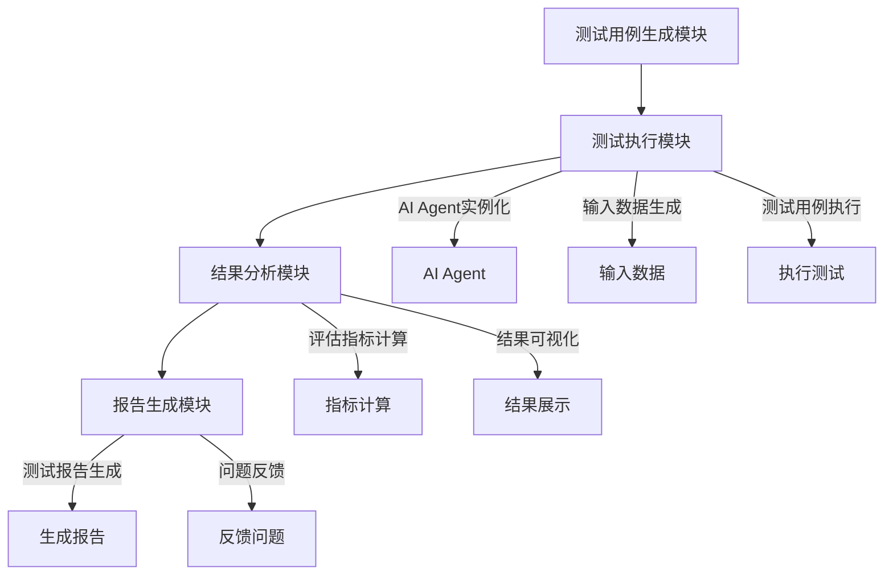

# 构建AI Agent的测试与评估框架

> 关键词：AI Agent、测试与评估框架、自动化测试、评估指标、性能分析

> 摘要：本文聚焦于构建AI Agent的测试与评估框架。首先介绍了构建该框架的背景信息，包括目的、预期读者等内容。接着阐述了AI Agent相关的核心概念及其联系，给出了原理和架构的文本示意图与Mermaid流程图。详细讲解了核心算法原理，并结合Python源代码说明具体操作步骤。同时给出了数学模型和公式，辅以举例进行深入解读。通过项目实战，展示了开发环境搭建、源代码实现及代码解读过程。分析了实际应用场景，推荐了学习资源、开发工具框架和相关论文著作。最后总结了未来发展趋势与挑战，提供了常见问题解答及扩展阅读与参考资料，旨在为开发者提供全面且深入的指导，助力构建有效的AI Agent测试与评估框架。

## 1. 背景介绍 
### 1.1 目的和范围
在当今人工智能飞速发展的时代，AI Agent被广泛应用于各种领域，如智能客服、自动化游戏、智能决策系统等。然而，确保AI Agent的性能、可靠性和正确性是一个极具挑战性的任务。构建AI Agent的测试与评估框架的主要目的在于：
- 验证AI Agent的功能是否符合预期，确保其能够正确地完成各种任务。
- 评估AI Agent的性能指标，如响应时间、准确率、召回率等，以便对其进行优化和改进。
- 检测AI Agent在不同环境和输入下的鲁棒性，确保其在复杂情况下仍能稳定运行。

本框架的范围涵盖了多种类型的AI Agent，包括基于规则的Agent、机器学习Agent和深度学习Agent等。同时，支持对不同任务场景下的AI Agent进行测试和评估，如自然语言处理、计算机视觉、机器人控制等。

### 1.2 预期读者
本文的预期读者包括：
- AI开发者：希望通过测试与评估框架来验证和优化自己开发的AI Agent。
- 研究人员：对AI Agent的性能评估和分析感兴趣，希望深入了解相关技术和方法。
- 质量保证工程师：负责确保AI Agent的质量和可靠性，需要借助测试与评估框架进行全面的测试。

### 1.3 文档结构概述
本文将按照以下结构进行详细阐述：
- 核心概念与联系：介绍AI Agent、测试与评估框架的核心概念及其之间的联系，给出原理和架构的文本示意图与Mermaid流程图。
- 核心算法原理 & 具体操作步骤：讲解用于测试和评估AI Agent的核心算法原理，并使用Python源代码详细说明具体操作步骤。
- 数学模型和公式 & 详细讲解 & 举例说明：给出评估指标的数学模型和公式，进行详细讲解，并通过具体例子进行说明。
- 项目实战：通过一个实际的项目案例，展示如何搭建开发环境、实现源代码以及对代码进行解读和分析。
- 实际应用场景：分析AI Agent测试与评估框架在不同领域的实际应用场景。
- 工具和资源推荐：推荐相关的学习资源、开发工具框架和论文著作。
- 总结：未来发展趋势与挑战：总结AI Agent测试与评估框架的未来发展趋势和面临的挑战。
- 附录：常见问题与解答：提供常见问题的解答，帮助读者更好地理解和应用本文的内容。
- 扩展阅读 & 参考资料：提供扩展阅读的建议和相关参考资料。

### 1.4 术语表
#### 1.4.1 核心术语定义
- **AI Agent**：能够感知环境、做出决策并采取行动以实现特定目标的人工智能实体。
- **测试与评估框架**：用于对AI Agent进行测试和评估的一套系统和方法，包括测试用例设计、测试执行、结果分析等环节。
- **自动化测试**：使用自动化工具和脚本来执行测试用例，减少人工干预，提高测试效率和准确性。
- **评估指标**：用于衡量AI Agent性能和质量的量化指标，如准确率、召回率、F1值等。

#### 1.4.2 相关概念解释
- **功能测试**：验证AI Agent的功能是否符合预期，确保其能够正确地完成各种任务。
- **性能测试**：评估AI Agent的性能指标，如响应时间、吞吐量等，以确定其在不同负载下的表现。
- **鲁棒性测试**：检测AI Agent在不同环境和输入下的鲁棒性，确保其在复杂情况下仍能稳定运行。

#### 1.4.3 缩略词列表
- **NLP**：Natural Language Processing，自然语言处理
- **CV**：Computer Vision，计算机视觉
- **ML**：Machine Learning，机器学习
- **DL**：Deep Learning，深度学习
- **TP**：True Positive，真阳性
- **TN**：True Negative，真阴性
- **FP**：False Positive，假阳性
- **FN**：False Negative，假阴性

## 2. 核心概念与联系 
### 核心概念原理
AI Agent是一个具有自主性、反应性、社会性和适应性的智能实体。它能够感知环境中的信息，根据自身的目标和知识做出决策，并采取相应的行动。测试与评估框架的核心原理是通过设计一系列的测试用例，对AI Agent的功能、性能和鲁棒性进行全面的检测和评估。

### 架构的文本示意图
以下是一个简单的AI Agent测试与评估框架的架构文本示意图：

```plaintext
+---------------------+
| 测试用例生成模块     |
+---------------------+
           |
           v
+---------------------+
| 测试执行模块         |
|  - AI Agent实例化    |
|  - 输入数据生成      |
|  - 测试用例执行      |
+---------------------+
           |
           v
+---------------------+
| 结果分析模块         |
|  - 评估指标计算      |
|  - 结果可视化        |
+---------------------+
           |
           v
+---------------------+
| 报告生成模块         |
|  - 测试报告生成      |
|  - 问题反馈          |
+---------------------+
```

### Mermaid流程图


## 3. 核心算法原理 & 具体操作步骤 
### 核心算法原理
在AI Agent的测试与评估中，常用的算法原理包括分类算法评估、回归算法评估等。以分类算法为例，我们可以使用混淆矩阵来计算各种评估指标。

混淆矩阵是一个 $2\times2$ 的矩阵，用于表示分类结果的真实情况和预测情况。矩阵的四个元素分别为：
- 真阳性（TP）：预测为正类，实际也为正类的样本数。
- 真阴性（TN）：预测为负类，实际也为负类的样本数。
- 假阳性（FP）：预测为正类，实际为负类的样本数。
- 假阴性（FN）：预测为负类，实际为正类的样本数。

### 具体操作步骤及Python代码实现
以下是一个使用Python实现的简单示例，用于计算分类算法的评估指标：

```python
import numpy as np

def calculate_confusion_matrix(y_true, y_pred):
    """
    计算混淆矩阵
    :param y_true: 真实标签
    :param y_pred: 预测标签
    :return: 混淆矩阵
    """
    tp = np.sum((y_true == 1) & (y_pred == 1))
    tn = np.sum((y_true == 0) & (y_pred == 0))
    fp = np.sum((y_true == 0) & (y_pred == 1))
    fn = np.sum((y_true == 1) & (y_pred == 0))
    return tp, tn, fp, fn

def calculate_metrics(tp, tn, fp, fn):
    """
    计算评估指标
    :param tp: 真阳性
    :param tn: 真阴性
    :param fp: 假阳性
    :param fn: 假阴性
    :return: 准确率、精确率、召回率、F1值
    """
    accuracy = (tp + tn) / (tp + tn + fp + fn)
    precision = tp / (tp + fp) if (tp + fp) > 0 else 0
    recall = tp / (tp + fn) if (tp + fn) > 0 else 0
    f1_score = 2 * (precision * recall) / (precision + recall) if (precision + recall) > 0 else 0
    return accuracy, precision, recall, f1_score

# 示例数据
y_true = np.array([1, 0, 1, 0, 1])
y_pred = np.array([1, 1, 0, 0, 1])

# 计算混淆矩阵
tp, tn, fp, fn = calculate_confusion_matrix(y_true, y_pred)

# 计算评估指标
accuracy, precision, recall, f1_score = calculate_metrics(tp, tn, fp, fn)

print(f"准确率: {accuracy}")
print(f"精确率: {precision}")
print(f"召回率: {recall}")
print(f"F1值: {f1_score}")
```

### 代码解释
- `calculate_confusion_matrix` 函数：用于计算混淆矩阵的四个元素，通过比较真实标签和预测标签来统计TP、TN、FP和FN的数量。
- `calculate_metrics` 函数：根据混淆矩阵的四个元素计算准确率、精确率、召回率和F1值。
- 示例数据：定义了真实标签 `y_true` 和预测标签 `y_pred`，调用上述两个函数进行计算并输出结果。

## 4. 数学模型和公式 & 详细讲解 & 举例说明 
### 评估指标的数学模型和公式
#### 准确率（Accuracy）
准确率是指分类正确的样本数占总样本数的比例，计算公式为：
$$
\text{Accuracy} = \frac{TP + TN}{TP + TN + FP + FN}
$$

#### 精确率（Precision）
精确率是指预测为正类的样本中，实际为正类的样本数占比，计算公式为：
$$
\text{Precision} = \frac{TP}{TP + FP}
$$

#### 召回率（Recall）
召回率是指实际为正类的样本中，被预测为正类的样本数占比，计算公式为：
$$
\text{Recall} = \frac{TP}{TP + FN}
$$

#### F1值（F1-score）
F1值是精确率和召回率的调和平均数，用于综合衡量分类器的性能，计算公式为：
$$
\text{F1-score} = 2 \times \frac{\text{Precision} \times \text{Recall}}{\text{Precision} + \text{Recall}}
$$

### 详细讲解
- **准确率**：反映了分类器整体的分类正确性，但在样本不均衡的情况下，可能会产生误导。例如，在一个二分类问题中，正类样本占比很小，如果分类器总是预测为负类，准确率可能会很高，但实际上并没有真正解决问题。
- **精确率**：关注的是预测为正类的样本的准确性，适用于需要严格控制误判正类的场景，如垃圾邮件分类。
- **召回率**：关注的是实际正类样本的被检测率，适用于需要尽可能找出所有正类样本的场景，如疾病诊断。
- **F1值**：综合考虑了精确率和召回率，在两者之间取得平衡，是一个更全面的评估指标。

### 举例说明
假设我们有一个二分类问题，真实标签和预测标签如下：
- 真实标签：[1, 0, 1, 0, 1]
- 预测标签：[1, 1, 0, 0, 1]

通过前面的Python代码计算得到：
- $TP = 2$
- $TN = 2$
- $FP = 1$
- $FN = 1$

则各项评估指标计算如下：
- 准确率：$\text{Accuracy} = \frac{2 + 2}{2 + 2 + 1 + 1} = \frac{4}{6} \approx 0.67$
- 精确率：$\text{Precision} = \frac{2}{2 + 1} = \frac{2}{3} \approx 0.67$
- 召回率：$\text{Recall} = \frac{2}{2 + 1} = \frac{2}{3} \approx 0.67$
- F1值：$\text{F1-score} = 2 \times \frac{\frac{2}{3} \times \frac{2}{3}}{\frac{2}{3} + \frac{2}{3}} = \frac{2}{3} \approx 0.67$

## 5. 项目实战：代码实际案例和详细解释说明 
### 5.1  开发环境搭建
本项目使用Python作为开发语言，以下是搭建开发环境的步骤：
1. **安装Python**：从Python官方网站（https://www.python.org/downloads/）下载并安装Python 3.x版本。
2. **创建虚拟环境**：使用 `venv` 模块创建一个虚拟环境，以隔离项目的依赖。
```bash
python -m venv ai_agent_test_env
```
3. **激活虚拟环境**：
- 在Windows上：
```bash
ai_agent_test_env\Scripts\activate
```
- 在Linux/Mac上：
```bash
source ai_agent_test_env/bin/activate
```
4. **安装依赖库**：使用 `pip` 安装所需的依赖库，如 `numpy`、`pandas` 等。
```bash
pip install numpy pandas
```

### 5.2  源代码详细实现和代码解读
以下是一个完整的项目示例，用于对一个简单的AI Agent进行测试和评估：

```python
import numpy as np

# 定义一个简单的AI Agent类
class SimpleAgent:
    def __init__(self, threshold=0.5):
        self.threshold = threshold

    def predict(self, X):
        """
        预测函数
        :param X: 输入数据
        :return: 预测标签
        """
        return (X > self.threshold).astype(int)

# 生成测试数据
def generate_test_data(n_samples=100):
    """
    生成测试数据
    :param n_samples: 样本数量
    :return: 输入数据和真实标签
    """
    X = np.random.rand(n_samples)
    y_true = (X > 0.5).astype(int)
    return X, y_true

# 计算混淆矩阵
def calculate_confusion_matrix(y_true, y_pred):
    tp = np.sum((y_true == 1) & (y_pred == 1))
    tn = np.sum((y_true == 0) & (y_pred == 0))
    fp = np.sum((y_true == 0) & (y_pred == 1))
    fn = np.sum((y_true == 1) & (y_pred == 0))
    return tp, tn, fp, fn

# 计算评估指标
def calculate_metrics(tp, tn, fp, fn):
    accuracy = (tp + tn) / (tp + tn + fp + fn)
    precision = tp / (tp + fp) if (tp + fp) > 0 else 0
    recall = tp / (tp + fn) if (tp + fn) > 0 else 0
    f1_score = 2 * (precision * recall) / (precision + recall) if (precision + recall) > 0 else 0
    return accuracy, precision, recall, f1_score

# 主函数
def main():
    # 生成测试数据
    X, y_true = generate_test_data()

    # 实例化AI Agent
    agent = SimpleAgent()

    # 进行预测
    y_pred = agent.predict(X)

    # 计算混淆矩阵
    tp, tn, fp, fn = calculate_confusion_matrix(y_true, y_pred)

    # 计算评估指标
    accuracy, precision, recall, f1_score = calculate_metrics(tp, tn, fp, fn)

    print(f"准确率: {accuracy}")
    print(f"精确率: {precision}")
    print(f"召回率: {recall}")
    print(f"F1值: {f1_score}")

if __name__ == "__main__":
    main()
```

### 代码解读
- **SimpleAgent类**：定义了一个简单的AI Agent，根据输入数据和阈值进行预测。
- **generate_test_data函数**：生成测试数据，包括输入数据 `X` 和真实标签 `y_true`。
- **calculate_confusion_matrix函数**：计算混淆矩阵的四个元素。
- **calculate_metrics函数**：根据混淆矩阵计算评估指标。
- **main函数**：主函数，负责生成测试数据、实例化AI Agent、进行预测、计算混淆矩阵和评估指标，并输出结果。

### 5.3  代码解读与分析
通过上述代码，我们可以看到一个完整的AI Agent测试与评估流程。首先，生成测试数据，然后实例化AI Agent并进行预测。接着，计算混淆矩阵和评估指标，最后输出评估结果。

在实际应用中，我们可以根据具体需求对代码进行扩展，例如：
- 增加更多的评估指标，如ROC曲线、AUC值等。
- 对不同类型的AI Agent进行测试和评估，如基于机器学习和深度学习的Agent。
- 实现自动化测试，定期对AI Agent进行测试和监控。

## 6. 实际应用场景 
### 自然语言处理
在自然语言处理领域，AI Agent可用于文本分类、情感分析、机器翻译等任务。测试与评估框架可以用于验证AI Agent的分类准确率、翻译质量等指标。例如，在文本分类任务中，通过设计一系列的测试用例，对不同类别的文本进行分类测试，计算准确率、精确率、召回率等指标，以评估AI Agent的性能。

### 计算机视觉
在计算机视觉领域，AI Agent可用于图像分类、目标检测、人脸识别等任务。测试与评估框架可以用于评估AI Agent的识别准确率、检测精度等指标。例如，在目标检测任务中，使用标注好的图像数据集进行测试，计算平均精度均值（mAP）等指标，以评估AI Agent的性能。

### 机器人控制
在机器人控制领域，AI Agent可用于机器人的路径规划、动作决策等任务。测试与评估框架可以用于验证机器人的运动准确性、任务完成率等指标。例如，在机器人路径规划任务中，通过模拟不同的环境和任务场景，测试机器人是否能够正确地规划路径并到达目标位置，计算成功率等指标，以评估AI Agent的性能。

## 7. 工具和资源推荐
### 7.1 学习资源推荐
#### 7.1.1 书籍推荐
- 《人工智能：一种现代的方法》：全面介绍了人工智能的基本概念、算法和应用，是学习人工智能的经典教材。
- 《机器学习》：详细讲解了机器学习的各种算法和模型，是学习机器学习的重要参考书籍。
- 《深度学习》：深入探讨了深度学习的原理和应用，是学习深度学习的权威著作。

#### 7.1.2 在线课程
- Coursera上的“人工智能基础”课程：由知名高校教授授课，系统地介绍了人工智能的基础知识和算法。
- edX上的“机器学习导论”课程：提供了丰富的案例和实践项目，帮助学习者掌握机器学习的基本技能。
- Udemy上的“深度学习实战”课程：通过实际项目，让学习者深入了解深度学习的应用和开发。

#### 7.1.3 技术博客和网站
- Medium：拥有众多人工智能领域的技术博客，涵盖了最新的研究成果和实践经验。
- Towards Data Science：专注于数据科学和人工智能领域，提供了大量的技术文章和教程。
- AI Stack Exchange：一个问答社区，用户可以在这里提问和分享人工智能相关的问题和解决方案。

### 7.2 开发工具框架推荐
#### 7.2.1 IDE和编辑器
- PyCharm：一款功能强大的Python集成开发环境，提供了代码编辑、调试、版本控制等功能。
- Jupyter Notebook：一个交互式的开发环境，适合进行数据分析和模型开发，支持多种编程语言。
- Visual Studio Code：一款轻量级的代码编辑器，具有丰富的插件和扩展功能，适用于各种编程语言的开发。

#### 7.2.2 调试和性能分析工具
- PDB：Python自带的调试器，可用于调试Python代码，定位问题。
- TensorBoard：TensorFlow提供的可视化工具，可用于监控模型训练过程中的各种指标和可视化结果。
- Py-Spy：一个用于分析Python程序性能的工具，可帮助开发者找出程序中的性能瓶颈。

#### 7.2.3 相关框架和库
- Scikit-learn：一个简单易用的机器学习库，提供了各种机器学习算法和工具，适用于数据挖掘和数据分析。
- TensorFlow：一个开源的深度学习框架，广泛应用于图像识别、自然语言处理等领域。
- PyTorch：一个基于Python的深度学习框架，具有动态图机制，易于使用和调试。

### 7.3 相关论文著作推荐
#### 7.3.1 经典论文
- “A Unified Approach to Interpreting Model Predictions”：提出了一种统一的方法来解释模型的预测结果，有助于提高模型的可解释性。
- “Attention Is All You Need”：介绍了Transformer架构，是自然语言处理领域的重要突破。
- “Generative Adversarial Nets”：提出了生成对抗网络（GAN）的概念，开创了生成式模型的新纪元。

#### 7.3.2 最新研究成果
- 关注顶级学术会议如NeurIPS、ICML、CVPR等的最新研究论文，了解AI Agent测试与评估领域的最新进展。
- 关注知名学术期刊如Journal of Artificial Intelligence Research（JAIR）、Artificial Intelligence等的相关研究文章。

#### 7.3.3 应用案例分析
- 分析各大科技公司的技术博客和开源项目，了解他们在AI Agent测试与评估方面的实践经验和应用案例。
- 参考相关的行业报告和白皮书，了解AI Agent在不同领域的应用现状和发展趋势。

## 8. 总结：未来发展趋势与挑战
### 未来发展趋势
- **自动化测试的普及**：随着AI Agent的复杂度不断增加，手动测试将变得越来越困难和耗时。未来，自动化测试将成为主流，通过自动化工具和脚本实现测试用例的自动生成、执行和结果分析。
- **多模态测试与评估**：AI Agent的应用场景越来越多样化，涉及到文本、图像、音频等多种模态的数据。未来的测试与评估框架将支持多模态数据的处理和分析，以更全面地评估AI Agent的性能。
- **强化学习测试与评估**：强化学习在机器人控制、游戏等领域取得了显著的成果。未来，将需要专门的测试与评估方法来验证强化学习Agent的性能和安全性。
- **可解释性测试与评估**：随着AI Agent在关键领域的应用越来越广泛，其可解释性变得越来越重要。未来的测试与评估框架将关注AI Agent的可解释性，确保其决策过程能够被理解和信任。

### 面临的挑战
- **数据多样性和质量**：AI Agent的性能很大程度上依赖于训练数据的质量和多样性。如何获取高质量、多样化的测试数据是一个挑战，同时还需要处理数据中的噪声和偏差。
- **复杂环境模拟**：在实际应用中，AI Agent需要在复杂的环境中运行。如何模拟这些复杂环境，对AI Agent进行全面的测试和评估是一个难题。
- **模型复杂度和计算资源**：随着深度学习模型的不断发展，模型的复杂度越来越高，计算资源的需求也越来越大。如何在有限的计算资源下进行高效的测试和评估是一个挑战。
- **伦理和法律问题**：AI Agent的应用涉及到伦理和法律问题，如隐私保护、公平性、安全性等。如何在测试与评估框架中考虑这些问题，确保AI Agent的合法合规使用是一个重要的挑战。

## 9. 附录：常见问题与解答
### 如何选择合适的评估指标？
选择合适的评估指标取决于具体的应用场景和任务需求。例如，在垃圾邮件分类任务中，精确率可能更重要，因为我们希望尽可能减少误判为垃圾邮件的正常邮件；而在疾病诊断任务中，召回率可能更重要，因为我们希望尽可能找出所有患病的患者。

### 如何处理样本不均衡问题？
样本不均衡问题是指数据集中不同类别的样本数量差异较大。可以采用以下方法来处理样本不均衡问题：
- 重采样：通过过采样（如SMOTE算法）或欠采样的方法，使不同类别的样本数量更加均衡。
- 调整评估指标：使用对样本不均衡不敏感的评估指标，如F1值、AUC值等。
- 调整模型：在模型训练过程中，通过调整损失函数的权重，对少数类样本给予更高的权重。

### 如何评估强化学习Agent的性能？
评估强化学习Agent的性能可以使用以下指标：
- 累计奖励：Agent在整个训练过程中获得的累计奖励，反映了Agent的长期性能。
- 成功率：Agent完成任务的成功率，适用于有明确任务目标的场景。
- 收敛速度：Agent学习到最优策略的速度，反映了Agent的学习效率。

## 10. 扩展阅读 & 参考资料
### 扩展阅读
- 《人工智能测试技术》：深入介绍了人工智能测试的各种技术和方法，对AI Agent的测试与评估有更深入的探讨。
- 《AI安全与隐私》：关注AI Agent在安全和隐私方面的问题，为测试与评估框架的设计提供了新的视角。

### 参考资料
- 各开源框架的官方文档，如Scikit-learn、TensorFlow、PyTorch等。
- 相关学术会议和期刊的论文，如NeurIPS、ICML、CVPR、JAIR、Artificial Intelligence等。

作者：AI天才研究院/AI Genius Institute & 禅与计算机程序设计艺术 /Zen And The Art of Computer Programming