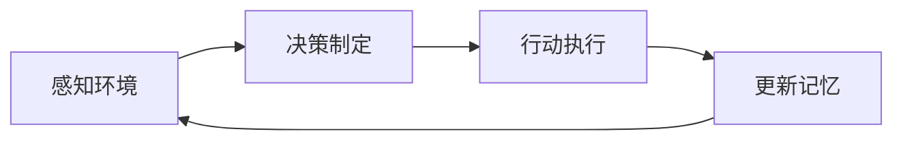

# 构建AI Agent的测试框架：确保性能和可靠性

> 关键词：AI Agent、测试框架、性能、可靠性、自动化测试

> 摘要：本文聚焦于构建AI Agent的测试框架，旨在确保其性能和可靠性。通过深入探讨AI Agent的核心概念、算法原理、数学模型等方面，详细阐述了如何搭建一个有效的测试框架。文中提供了Python源代码示例，展示了具体的操作步骤和代码实现。同时，介绍了实际应用场景、推荐了相关的工具和资源，并对未来发展趋势与挑战进行了总结。此外，还设有附录解答常见问题，并提供扩展阅读和参考资料，为读者全面深入了解和构建AI Agent测试框架提供了丰富的知识和实践指导。

## 1. 背景介绍 
### 1.1 目的和范围
随着人工智能技术的飞速发展，AI Agent在各个领域得到了广泛应用。然而，确保AI Agent的性能和可靠性是一个至关重要的问题。本文章的目的在于提供一个全面的指导，帮助开发者构建一个有效的测试框架，用于评估AI Agent在不同场景下的性能和可靠性。范围涵盖了从AI Agent的核心概念理解到测试框架的具体实现，以及实际应用和未来发展趋势的探讨。

### 1.2 预期读者
本文预期读者包括人工智能开发者、软件测试工程师、数据科学家以及对AI Agent测试感兴趣的技术爱好者。无论是初学者还是有一定经验的专业人士，都能从本文中获取有价值的信息。

### 1.3 文档结构概述
本文将按照以下结构进行阐述：首先介绍AI Agent的核心概念与联系，包括原理和架构的文本示意图以及Mermaid流程图；接着讲解核心算法原理和具体操作步骤，并使用Python源代码详细阐述；然后介绍数学模型和公式，通过详细讲解和举例说明帮助读者理解；之后通过项目实战展示代码实际案例和详细解释说明；再探讨实际应用场景；推荐相关的工具和资源；总结未来发展趋势与挑战；最后设有附录解答常见问题，并提供扩展阅读和参考资料。

### 1.4 术语表
#### 1.4.1 核心术语定义
- **AI Agent**：人工智能代理，是一种能够感知环境、做出决策并采取行动以实现特定目标的软件实体。
- **测试框架**：为了对软件系统进行测试而设计的一套结构和规则，包括测试用例的管理、执行和结果分析等功能。
- **性能**：指AI Agent在处理任务时的速度、效率和资源利用率等方面的表现。
- **可靠性**：指AI Agent在各种情况下能够稳定、正确地完成任务的能力。
- **自动化测试**：使用自动化工具执行测试用例，减少人工干预，提高测试效率和准确性。

#### 1.4.2 相关概念解释
- **环境感知**：AI Agent通过传感器或其他方式获取环境信息的能力。
- **决策制定**：根据感知到的环境信息，AI Agent运用算法和模型做出行动决策的过程。
- **行动执行**：AI Agent根据决策结果在环境中采取具体行动的过程。

#### 1.4.3 缩略词列表
- **AI**：Artificial Intelligence（人工智能）
- **ML**：Machine Learning（机器学习）
- **DL**：Deep Learning（深度学习）
- **API**：Application Programming Interface（应用程序编程接口）

## 2. 核心概念与联系 
### 2.1 AI Agent的核心概念原理
AI Agent的核心原理基于感知 - 决策 - 行动的循环。它首先通过各种传感器感知环境信息，然后将这些信息输入到决策模型中，决策模型根据预设的规则或学习到的知识做出决策，最后AI Agent根据决策结果在环境中执行相应的行动。这个循环不断重复，使AI Agent能够适应环境的变化并实现其目标。

例如，一个智能扫地机器人作为一个AI Agent，它通过摄像头、激光雷达等传感器感知房间的布局和障碍物信息，然后根据这些信息规划清扫路径（决策），最后按照规划的路径进行清扫（行动）。

### 2.2 AI Agent的架构
AI Agent的架构通常包括以下几个部分：
- **感知模块**：负责收集环境信息，如传感器数据、图像、文本等。
- **决策模块**：根据感知模块提供的信息，运用算法和模型做出决策。决策模块可以基于规则、机器学习或深度学习等方法实现。
- **行动模块**：根据决策模块的输出，在环境中执行相应的行动。行动模块可以控制机器人的运动、发送消息等。
- **记忆模块**：用于存储AI Agent的历史信息和学习到的知识，以便在后续的决策中使用。

下面是AI Agent架构的文本示意图：

```plaintext
+-----------------+
|   感知模块      |
+-----------------+
       |
       v
+-----------------+
|   决策模块      |
+-----------------+
       |
       v
+-----------------+
|   行动模块      |
+-----------------+
       |
       v
+-----------------+
|   记忆模块      |
+-----------------+
```

### 2.3 Mermaid流程图


这个流程图展示了AI Agent的感知 - 决策 - 行动 - 记忆更新的循环过程。AI Agent不断地感知环境，根据感知结果做出决策，执行行动，并更新自己的记忆，以适应环境的变化。

## 3. 核心算法原理 & 具体操作步骤 
### 3.1 决策算法原理
在AI Agent中，决策算法是核心部分之一。常见的决策算法包括基于规则的决策算法和基于机器学习的决策算法。

#### 3.1.1 基于规则的决策算法
基于规则的决策算法通过预设的规则来做出决策。例如，在一个简单的交通信号灯控制AI Agent中，可以定义以下规则：
- 如果当前绿灯时间达到预设的最大值，则切换到黄灯。
- 如果当前黄灯时间达到预设值，则切换到红灯。
- 如果当前红灯时间达到预设值，且路口没有车辆等待，则切换到绿灯。

以下是一个基于规则的决策算法的Python示例：

```python
class TrafficLightAgent:
    def __init__(self):
        self.current_light = 'green'
        self.green_time = 0
        self.yellow_time = 0
        self.red_time = 0
        self.max_green_time = 60
        self.yellow_duration = 3
        self.max_red_time = 90

    def update(self):
        if self.current_light == 'green':
            self.green_time += 1
            if self.green_time >= self.max_green_time:
                self.current_light = 'yellow'
                self.green_time = 0
        elif self.current_light == 'yellow':
            self.yellow_time += 1
            if self.yellow_time >= self.yellow_duration:
                self.current_light = 'red'
                self.yellow_time = 0
        elif self.current_light == 'red':
            self.red_time += 1
            if self.red_time >= self.max_red_time:
                self.current_light = 'green'
                self.red_time = 0

        return self.current_light


# 创建交通信号灯AI Agent实例
agent = TrafficLightAgent()

# 模拟100个时间步
for _ in range(100):
    current_light = agent.update()
    print(f"当前信号灯颜色: {current_light}")
```

#### 3.1.2 基于机器学习的决策算法
基于机器学习的决策算法通过学习大量的数据来做出决策。常见的机器学习算法包括决策树、神经网络等。以下是一个使用简单神经网络进行决策的Python示例：

```python
import numpy as np
import tensorflow as tf

# 定义一个简单的神经网络模型
model = tf.keras.Sequential([
    tf.keras.layers.Dense(10, activation='relu', input_shape=(2,)),
    tf.keras.layers.Dense(1, activation='sigmoid')
])

# 编译模型
model.compile(optimizer='adam', loss='binary_crossentropy', metrics=['accuracy'])

# 生成一些示例数据
x_train = np.array([[0, 0], [0, 1], [1, 0], [1, 1]])
y_train = np.array([0, 1, 1, 0])

# 训练模型
model.fit(x_train, y_train, epochs=100, verbose=0)

# 进行预测
test_input = np.array([[0, 0]])
prediction = model.predict(test_input)
print(f"预测结果: {prediction[0][0]}")
```

### 3.2 具体操作步骤
#### 3.2.1 数据收集
为了训练基于机器学习的决策算法，需要收集大量的训练数据。数据可以来自实际的应用场景、模拟环境或公开数据集。

#### 3.2.2 数据预处理
收集到的数据通常需要进行预处理，包括数据清洗、特征提取、归一化等操作，以提高模型的训练效果。

#### 3.2.3 模型训练
使用预处理后的数据对机器学习模型进行训练。在训练过程中，需要选择合适的算法和超参数，并进行模型评估和调优。

#### 3.2.4 模型部署
训练好的模型可以部署到AI Agent中，用于实际的决策。在部署过程中，需要考虑模型的性能、资源需求等因素。

#### 3.2.5 测试与优化
对部署好的AI Agent进行测试，评估其性能和可靠性。根据测试结果，对模型和算法进行优化，以提高AI Agent的表现。

## 4. 数学模型和公式 & 详细讲解 & 举例说明 
### 4.1 基于规则的决策模型
基于规则的决策模型可以用逻辑表达式来表示。例如，在上述交通信号灯控制的例子中，规则可以用以下逻辑表达式表示：

- 绿灯切换到黄灯：$green\_time \geq max\_green\_time$
- 黄灯切换到红灯：$yellow\_time \geq yellow\_duration$
- 红灯切换到绿灯：$red\_time \geq max\_red\_time \land no\_vehicles\_waiting$

其中，$green\_time$ 表示当前绿灯的持续时间，$max\_green\_time$ 表示绿灯的最大持续时间，$yellow\_time$ 表示当前黄灯的持续时间，$yellow\_duration$ 表示黄灯的持续时长，$red\_time$ 表示当前红灯的持续时间，$max\_red\_time$ 表示红灯的最大持续时间，$no\_vehicles\_waiting$ 表示路口是否没有车辆等待的布尔变量。

### 4.2 基于机器学习的决策模型
#### 4.2.1 线性回归模型
线性回归模型是一种简单的机器学习模型，用于预测连续值。其数学公式为：

$$y = \theta_0 + \theta_1x_1 + \theta_2x_2 + \cdots + \theta_nx_n$$

其中，$y$ 是预测值，$x_1, x_2, \cdots, x_n$ 是输入特征，$\theta_0, \theta_1, \cdots, \theta_n$ 是模型的参数。

例如，假设有一个简单的线性回归模型用于预测房价，输入特征为房屋面积 $x_1$ 和房间数量 $x_2$，则预测房价 $y$ 的公式为：

$$y = \theta_0 + \theta_1x_1 + \theta_2x_2$$

以下是一个使用Python实现简单线性回归的示例：

```python
import numpy as np
from sklearn.linear_model import LinearRegression

# 生成一些示例数据
x = np.array([[100, 2], [150, 3], [200, 4]])
y = np.array([500000, 700000, 900000])

# 创建线性回归模型
model = LinearRegression()

# 训练模型
model.fit(x, y)

# 进行预测
test_input = np.array([[120, 2]])
prediction = model.predict(test_input)
print(f"预测房价: {prediction[0]}")
```

#### 4.2.2 逻辑回归模型
逻辑回归模型用于分类问题，其输出是一个概率值。逻辑回归的数学公式为：

$$P(y = 1|x) = \frac{1}{1 + e^{-(\theta_0 + \theta_1x_1 + \theta_2x_2 + \cdots + \theta_nx_n)}}$$

其中，$P(y = 1|x)$ 表示在输入特征 $x$ 下，类别为 1 的概率，$\theta_0, \theta_1, \cdots, \theta_n$ 是模型的参数。

例如，在一个二分类问题中，判断一个邮件是否为垃圾邮件，输入特征为邮件的各种特征（如关键词频率、发件人信息等），通过逻辑回归模型可以计算出该邮件为垃圾邮件的概率。

以下是一个使用Python实现逻辑回归的示例：

```python
import numpy as np
from sklearn.linear_model import LogisticRegression

# 生成一些示例数据
x = np.array([[1, 2], [2, 3], [3, 4], [4, 5]])
y = np.array([0, 0, 1, 1])

# 创建逻辑回归模型
model = LogisticRegression()

# 训练模型
model.fit(x, y)

# 进行预测
test_input = np.array([[2, 2]])
prediction = model.predict(test_input)
print(f"预测结果: {prediction[0]}")
```

## 5. 项目实战：代码实际案例和详细解释说明 
### 5.1  开发环境搭建
#### 5.1.1 安装Python
首先需要安装Python，建议使用Python 3.7及以上版本。可以从Python官方网站（https://www.python.org/downloads/）下载安装包进行安装。

#### 5.1.2 安装必要的库
在构建AI Agent测试框架时，需要安装一些必要的Python库，如`numpy`、`tensorflow`、`pytest`等。可以使用以下命令进行安装：

```sh
pip install numpy tensorflow pytest
```

### 5.2  源代码详细实现和代码解读
以下是一个简单的AI Agent测试框架的Python实现示例：

```python
import pytest

# 定义一个简单的AI Agent类
class SimpleAgent:
    def __init__(self):
        self.state = 0

    def step(self, action):
        if action == 0:
            self.state -= 1
        elif action == 1:
            self.state += 1
        return self.state


# 定义测试用例
@pytest.mark.parametrize("action, expected_state", [(0, -1), (1, 1)])
def test_simple_agent(action, expected_state):
    agent = SimpleAgent()
    new_state = agent.step(action)
    assert new_state == expected_state


if __name__ == "__main__":
    pytest.main()
```

#### 代码解读
- **SimpleAgent类**：定义了一个简单的AI Agent，它有一个状态变量`state`，并提供了一个`step`方法，根据输入的动作更新状态。
- **test_simple_agent函数**：这是一个使用`pytest`框架编写的测试用例，使用`pytest.mark.parametrize`装饰器对不同的动作和预期状态进行参数化测试。
- **pytest.main()**：调用`pytest`框架运行所有的测试用例。

### 5.3  代码解读与分析
通过上述代码，我们可以看到如何使用`pytest`框架构建一个简单的AI Agent测试框架。测试用例可以对AI Agent的不同功能进行验证，确保其在不同输入下的输出符合预期。在实际项目中，可以根据AI Agent的具体需求和功能，编写更多的测试用例，覆盖各种可能的情况，以提高AI Agent的性能和可靠性。

## 6. 实际应用场景 
### 6.1 智能客服
在智能客服系统中，AI Agent作为客服代表与用户进行交互。测试框架可以用于评估AI Agent在处理各种用户问题时的性能和可靠性，例如响应时间、回答准确率等。通过不断地测试和优化，可以提高智能客服的服务质量，提升用户满意度。

### 6.2 自动驾驶
在自动驾驶领域，AI Agent负责控制车辆的行驶。测试框架可以模拟各种路况和场景，对AI Agent的决策和控制能力进行测试，确保其在不同情况下都能安全、稳定地行驶。例如，测试AI Agent在遇到障碍物、交通信号灯变化等情况时的反应。

### 6.3 游戏AI
在游戏中，AI Agent作为游戏角色与玩家进行对抗或合作。测试框架可以评估AI Agent的智能水平、行为合理性等方面的性能，确保游戏的趣味性和挑战性。例如，测试AI Agent在不同游戏策略下的应对能力。

## 7. 工具和资源推荐
### 7.1 学习资源推荐
#### 7.1.1 书籍推荐
- 《人工智能：一种现代的方法》：这是一本经典的人工智能教材，全面介绍了人工智能的各个领域，包括AI Agent的相关知识。
- 《Python机器学习》：详细介绍了使用Python进行机器学习的方法和技巧，对于理解AI Agent中的机器学习算法有很大帮助。
- 《深度学习》：由深度学习领域的三位权威专家撰写，深入讲解了深度学习的原理和应用。

#### 7.1.2 在线课程
- Coursera上的“人工智能基础”课程：由知名高校的教授授课，系统地介绍了人工智能的基本概念和方法。
- edX上的“深度学习专项课程”：提供了深度学习的深入学习内容，包括神经网络、卷积神经网络等。
- Udemy上的“Python自动化测试”课程：专门介绍了使用Python进行自动化测试的技术和方法，对于构建AI Agent测试框架有很大的指导作用。

#### 7.1.3 技术博客和网站
- Medium：上面有很多关于人工智能和AI Agent的技术文章，涵盖了最新的研究成果和实践经验。
- Towards Data Science：专注于数据科学和机器学习领域，提供了丰富的技术教程和案例分析。
- AI Stack Exchange：一个专门的人工智能问答社区，可以在这里提出问题并获取专业的解答。

### 7.2 开发工具框架推荐
#### 7.2.1 IDE和编辑器
- PyCharm：一款功能强大的Python集成开发环境，提供了代码编辑、调试、版本控制等一系列功能，非常适合开发AI Agent和测试框架。
- Visual Studio Code：轻量级的代码编辑器，支持多种编程语言和插件扩展，可以方便地进行Python开发和测试。

#### 7.2.2 调试和性能分析工具
- PDB：Python自带的调试器，可以帮助开发者定位代码中的问题。
- cProfile：Python的性能分析工具，可以分析代码的运行时间和资源消耗情况，帮助优化代码性能。

#### 7.2.3 相关框架和库
- TensorFlow：一个开源的深度学习框架，提供了丰富的工具和接口，方便开发者构建和训练神经网络模型。
- PyTorch：另一个流行的深度学习框架，具有动态图机制，易于使用和调试。
- pytest：一个功能强大的Python测试框架，支持参数化测试、插件扩展等功能，适合构建AI Agent测试框架。

### 7.3 相关论文著作推荐
#### 7.3.1 经典论文
- “A Rational Agent Architecture for Autonomous Agents”：提出了一种理性AI Agent的架构，为AI Agent的设计提供了理论基础。
- “Reinforcement Learning: An Introduction”：介绍了强化学习的基本概念和方法，对于理解AI Agent的决策和学习过程有重要意义。

#### 7.3.2 最新研究成果
- 每年的NeurIPS（神经信息处理系统大会）、ICML（国际机器学习会议）等顶级学术会议上都会有关于AI Agent的最新研究成果发布，可以关注这些会议的论文。

#### 7.3.3 应用案例分析
- 一些知名科技公司（如Google、Microsoft等）会发布关于AI Agent应用的案例分析报告，可以从中学习到实际应用中的经验和技巧。

## 8. 总结：未来发展趋势与挑战
### 8.1 未来发展趋势
#### 8.1.1 多智能体系统
未来的AI Agent将更多地以多智能体系统的形式出现，多个AI Agent之间进行协作和竞争，以实现更复杂的任务。例如，在智能交通系统中，多个自动驾驶车辆作为AI Agent之间需要进行协同决策，以提高交通效率和安全性。

#### 8.1.2 与人类的深度融合
AI Agent将与人类进行更深度的融合，例如在医疗领域，AI Agent可以辅助医生进行诊断和治疗决策；在教育领域，AI Agent可以为学生提供个性化的学习服务。

#### 8.1.3 可解释性和透明度
随着AI Agent在关键领域的应用越来越广泛，其可解释性和透明度将变得越来越重要。未来的AI Agent需要能够解释其决策过程和依据，以便人类能够更好地理解和信任它们。

### 8.2 挑战
#### 8.2.1 数据隐私和安全
AI Agent的训练和运行需要大量的数据，如何保护这些数据的隐私和安全是一个重要的挑战。例如，在医疗领域，AI Agent处理的患者数据需要严格保密。

#### 8.2.2 算法复杂度和资源消耗
随着AI Agent的功能越来越复杂，其算法复杂度和资源消耗也会相应增加。如何在有限的资源下实现高效的AI Agent是一个亟待解决的问题。

#### 8.2.3 伦理和法律问题
AI Agent的决策和行为可能会对人类产生影响，因此需要解决相关的伦理和法律问题。例如，当AI Agent在自动驾驶中发生事故时，责任如何界定。

## 9. 附录：常见问题与解答
### 9.1 如何选择合适的测试框架？
选择合适的测试框架需要考虑多个因素，如项目的规模、复杂度、编程语言等。对于Python项目，`pytest`是一个功能强大且易于使用的测试框架；对于Java项目，可以选择JUnit。此外，还需要考虑测试框架的扩展性、社区支持等因素。

### 9.2 如何评估AI Agent的性能和可靠性？
评估AI Agent的性能可以从多个方面进行，如响应时间、准确率、召回率等。可靠性可以通过测试AI Agent在不同场景下的稳定性和正确性来评估。可以使用测试框架编写各种测试用例，模拟不同的情况，对AI Agent进行全面的测试。

### 9.3 如何处理AI Agent测试中的不确定性？
AI Agent的决策和行为可能存在一定的不确定性，例如基于机器学习的AI Agent在面对新的数据时可能会产生不同的结果。可以通过多次测试、统计分析等方法来处理这种不确定性。同时，也可以使用模拟环境来控制测试的条件，减少不确定性的影响。

## 10. 扩展阅读 & 参考资料
### 10.1 扩展阅读
- 《强化学习实战》：进一步深入学习强化学习在AI Agent中的应用。
- 《人工智能安全》：了解AI Agent在安全方面的相关知识和技术。

### 10.2 参考资料
- AI Agent相关的学术论文和研究报告。
- 各大科技公司的技术博客和开源项目。

作者：AI天才研究院/AI Genius Institute & 禅与计算机程序设计艺术 /Zen And The Art of Computer Programming