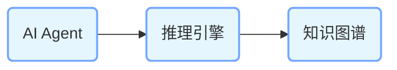

# 构建AI Agent的知识图谱推理引擎优化

> 关键词：AI Agent、知识图谱、推理引擎、优化策略、深度学习

> 摘要：本文聚焦于构建AI Agent的知识图谱推理引擎优化这一核心主题。首先介绍了相关背景，包括目的范围、预期读者等内容。接着阐述了核心概念，通过文本示意图和Mermaid流程图展现了知识图谱推理的架构。详细讲解了核心算法原理，结合Python代码示例进行说明，同时给出了数学模型和公式并辅以举例。通过项目实战展示了如何搭建开发环境、实现源代码及进行代码解读。分析了实际应用场景，推荐了学习资源、开发工具框架和相关论文著作。最后总结了未来发展趋势与挑战，提供了常见问题解答和扩展阅读参考资料，旨在为研究者和开发者在AI Agent知识图谱推理引擎优化方面提供全面而深入的指导。

## 1. 背景介绍 
### 1.1 目的和范围
在当今人工智能快速发展的时代，AI Agent 已经成为实现智能化交互和自动化决策的重要工具。知识图谱作为一种强大的语义网络，能够将大量的实体、概念及其关系进行结构化表示，为 AI Agent 提供丰富的背景知识。而推理引擎则是知识图谱发挥作用的关键，它能够根据已有的知识进行逻辑推理，挖掘潜在的信息。

本文章的目的在于深入探讨如何对构建 AI Agent 的知识图谱推理引擎进行优化。范围涵盖了从核心概念的介绍、算法原理的分析、数学模型的构建，到项目实战的演示、实际应用场景的分析，以及相关工具和资源的推荐等多个方面。

### 1.2 预期读者
本文预期读者主要包括人工智能领域的研究者、开发者，尤其是对知识图谱推理引擎感兴趣的专业人士。同时，也适合相关专业的学生，如计算机科学、人工智能、信息管理等专业，帮助他们深入了解知识图谱推理引擎的优化方法和技术。

### 1.3 文档结构概述
本文将按照以下结构进行组织：
- 核心概念与联系：介绍知识图谱、推理引擎和 AI Agent 的核心概念，并通过文本示意图和 Mermaid 流程图展示它们之间的关系。
- 核心算法原理 & 具体操作步骤：详细讲解常见的知识图谱推理算法，并用 Python 代码实现。
- 数学模型和公式 & 详细讲解 & 举例说明：给出知识图谱推理的数学模型和公式，并结合实际例子进行说明。
- 项目实战：通过一个具体的项目案例，展示如何搭建开发环境、实现源代码，并对代码进行解读。
- 实际应用场景：分析知识图谱推理引擎在不同领域的实际应用场景。
- 工具和资源推荐：推荐学习资源、开发工具框架和相关论文著作。
- 总结：未来发展趋势与挑战：总结知识图谱推理引擎的未来发展趋势和面临的挑战。
- 附录：常见问题与解答：解答读者在学习和实践过程中可能遇到的常见问题。
- 扩展阅读 & 参考资料：提供相关的扩展阅读材料和参考资料。

### 1.4 术语表
#### 1.4.1 核心术语定义
- **AI Agent**：人工智能代理，是一种能够感知环境、自主决策并采取行动以实现特定目标的软件实体。
- **知识图谱**：一种以图的形式表示知识的语义网络，由实体、概念及其之间的关系组成。
- **推理引擎**：一种能够根据已有的知识进行逻辑推理，挖掘潜在信息的软件模块。
- **本体**：对领域内概念、关系和规则的形式化描述，用于定义知识图谱的语义结构。

#### 1.4.2 相关概念解释
- **语义网络**：一种用节点和边表示概念及其关系的图结构，是知识图谱的基础。
- **逻辑推理**：根据已知的事实和规则，推导出新的事实和结论的过程。
- **机器学习**：让计算机通过数据学习模式和规律，从而实现预测和决策的技术。

#### 1.4.3 缩略词列表
- **RDF**：Resource Description Framework，资源描述框架，用于描述 Web 资源的元数据。
- **OWL**：Web Ontology Language，网络本体语言，用于定义知识图谱的本体。
- **SPARQL**：SPARQL Protocol and RDF Query Language，用于查询和操作 RDF 数据的语言。

## 2. 核心概念与联系 

### 核心概念原理
#### 知识图谱
知识图谱是一种结构化的语义网络，它将现实世界中的实体、概念及其关系以图的形式表示出来。每个实体可以看作是图中的一个节点，而实体之间的关系则是连接节点的边。例如，在一个人物关系的知识图谱中，“张三”和“李四”是两个实体节点，“朋友”则是连接这两个节点的边。

知识图谱的构建通常包括数据采集、数据清洗、实体识别、关系抽取和知识融合等步骤。通过这些步骤，可以将各种来源的数据整合到一个统一的知识图谱中，为 AI Agent 提供丰富的背景知识。

#### 推理引擎
推理引擎是知识图谱的核心组件之一，它能够根据已有的知识进行逻辑推理，挖掘潜在的信息。推理引擎通常基于一定的逻辑规则和算法，如本体推理、规则推理、基于机器学习的推理等。

例如，在一个医学知识图谱中，如果已知“感冒会导致咳嗽”和“张三患有感冒”，那么推理引擎可以根据这些知识推导出“张三可能会咳嗽”。

#### AI Agent
AI Agent 是一种能够感知环境、自主决策并采取行动以实现特定目标的软件实体。它可以利用知识图谱中的知识和推理引擎的能力，进行信息检索、问题解答、决策支持等任务。

例如，一个智能客服 AI Agent 可以通过知识图谱和推理引擎，理解用户的问题，并根据已有的知识提供准确的答案。

### 架构的文本示意图
```plaintext
              +----------------+
              |    AI Agent    |
              +----------------+
                     |
                     v
              +----------------+
              | 推理引擎        |
              +----------------+
                     |
                     v
              +----------------+
              | 知识图谱        |
              +----------------+
```

### Mermaid 流程图


这个流程图展示了 AI Agent、推理引擎和知识图谱之间的关系。AI Agent 通过推理引擎利用知识图谱中的知识进行决策和行动。

## 3. 核心算法原理 & 具体操作步骤 

### 本体推理算法原理
本体推理是基于本体语言（如 OWL）定义的语义和规则进行推理的方法。本体语言定义了一系列的公理和规则，推理引擎可以根据这些规则推导出新的知识。

例如，在 OWL 中，有一个传递性属性的概念。如果定义了“isAncestorOf”是一个传递性属性，并且已知“张三 isAncestorOf 李四”和“李四 isAncestorOf 王五”，那么推理引擎可以推导出“张三 isAncestorOf 王五”。

### Python 代码实现本体推理
```python
from owlready2 import *

# 加载本体文件
onto = get_ontology("file://path/to/your/ontology.owl").load()

# 创建推理引擎
with onto:
    sync_reasoner()

# 定义查询
query = list(default_world.sparql("""
    SELECT?x?y
    WHERE {
       ?x :isAncestorOf?y.
    }
"""))

# 输出查询结果
for result in query:
    print(result)
```

### 规则推理算法原理
规则推理是基于用户定义的规则进行推理的方法。用户可以定义一系列的规则，如“如果 A 是 B 的父亲，并且 B 是 C 的父亲，那么 A 是 C 的祖父”。推理引擎可以根据这些规则推导出新的知识。

### Python 代码实现规则推理
```python
from rdflib import Graph, Literal, RDF, URIRef
from rdflib.plugins.sparql import prepareQuery

# 创建一个 RDF 图
g = Graph()

# 定义实体和关系
person1 = URIRef("http://example.org/person1")
person2 = URIRef("http://example.org/person2")
person3 = URIRef("http://example.org/person3")
fatherOf = URIRef("http://example.org/fatherOf")
grandfatherOf = URIRef("http://example.org/grandfatherOf")

# 添加三元组到图中
g.add((person1, fatherOf, person2))
g.add((person2, fatherOf, person3))

# 定义规则
rule = """
    CONSTRUCT {
       ?x <http://example.org/grandfatherOf>?z
    }
    WHERE {
       ?x <http://example.org/fatherOf>?y.
       ?y <http://example.org/fatherOf>?z.
    }
"""

# 执行规则推理
result = g.query(rule)

# 将推理结果添加到图中
for row in result:
    g.add(row)

# 输出图中的三元组
for s, p, o in g:
    print(s, p, o)
```

### 基于机器学习的推理算法原理
基于机器学习的推理方法是利用机器学习模型（如神经网络、支持向量机等）来学习知识图谱中的模式和规律，从而进行推理。例如，可以使用图神经网络（GNN）来学习实体和关系的表示，然后根据这些表示进行推理。

### Python 代码实现基于 GNN 的推理
```python
import torch
import torch.nn.functional as F
from torch_geometric.nn import GCNConv

# 定义一个简单的图神经网络模型
class GCN(torch.nn.Module):
    def __init__(self, in_channels, hidden_channels, out_channels):
        super(GCN, self).__init__()
        self.conv1 = GCNConv(in_channels, hidden_channels)
        self.conv2 = GCNConv(hidden_channels, out_channels)

    def forward(self, x, edge_index):
        x = self.conv1(x, edge_index)
        x = F.relu(x)
        x = F.dropout(x, training=self.training)
        x = self.conv2(x, edge_index)
        return F.log_softmax(x, dim=1)

# 初始化模型
model = GCN(in_channels=16, hidden_channels=32, out_channels=2)

# 定义输入数据
x = torch.randn(10, 16)  # 10 个节点，每个节点 16 维特征
edge_index = torch.tensor([[0, 1, 1, 2], [1, 0, 2, 1]], dtype=torch.long)

# 前向传播
output = model(x, edge_index)
print(output)
```

## 4. 数学模型和公式 & 详细讲解 & 举例说明 

### 本体推理的数学模型
本体推理可以基于描述逻辑（Description Logic）进行建模。描述逻辑是一种基于一阶逻辑的知识表示语言，它通过概念（Concept）、角色（Role）和个体（Individual）来描述知识。

#### 基本概念
- **概念**：表示一类对象的集合，如“人”、“动物”等。
- **角色**：表示对象之间的关系，如“父亲”、“朋友”等。
- **个体**：表示具体的对象，如“张三”、“李四”等。

#### 描述逻辑的语法
描述逻辑的语法通常包括以下几种构造符：
- **合取（Conjunction）**：用 $\sqcap$ 表示，如 $C \sqcap D$ 表示既属于概念 $C$ 又属于概念 $D$ 的对象集合。
- **析取（Disjunction）**：用 $\sqcup$ 表示，如 $C \sqcup D$ 表示属于概念 $C$ 或者属于概念 $D$ 的对象集合。
- **否定（Negation）**：用 $\neg$ 表示，如 $\neg C$ 表示不属于概念 $C$ 的对象集合。
- **存在量词（Existential Quantification）**：用 $\exists$ 表示，如 $\exists R.C$ 表示通过角色 $R$ 与概念 $C$ 中的某个对象相关联的对象集合。
- **全称量词（Universal Quantification）**：用 $\forall$ 表示，如 $\forall R.C$ 表示通过角色 $R$ 与概念 $C$ 中的所有对象相关联的对象集合。

#### 举例说明
假设我们有以下描述逻辑的知识库：
- $Human \sqsubseteq Animal$（人是动物的子类）
- $Male \sqcap Human$（男性是人）
- $\exists hasChild.Female$（存在有女儿的人）

我们可以根据这些知识进行推理，例如，如果已知“张三是男性”，那么可以推导出“张三是人”。

### 规则推理的数学模型
规则推理可以基于产生式规则（Production Rule）进行建模。产生式规则的一般形式为：
$$
IF \; condition_1 \; AND \; condition_2 \; AND \; \cdots \; AND \; condition_n \; THEN \; conclusion
$$

其中，$condition_i$ 是前提条件，$conclusion$ 是结论。当所有的前提条件都满足时，规则被触发，结论成立。

#### 举例说明
假设我们有以下规则：
$$
IF \; Person(x) \; AND \; FatherOf(x, y) \; AND \; FatherOf(y, z) \; THEN \; GrandfatherOf(x, z)
$$

如果已知“张三是李四的父亲”和“李四是王五的父亲”，那么可以根据这个规则推导出“张三是王五的祖父”。

### 基于机器学习的推理的数学模型
基于机器学习的推理通常使用神经网络来学习知识图谱中的模式和规律。以图神经网络（GNN）为例，GNN 的基本思想是通过节点之间的消息传递来更新节点的表示。

#### 消息传递机制
GNN 的消息传递机制可以用以下公式表示：
$$
m_{u \rightarrow v}^{(k)} = M^{(k)}(h_u^{(k - 1)}, h_v^{(k - 1)}, e_{u \rightarrow v})
$$
$$
h_v^{(k)} = U^{(k)}(h_v^{(k - 1)}, \sum_{u \in \mathcal{N}(v)} m_{u \rightarrow v}^{(k)})
$$

其中，$m_{u \rightarrow v}^{(k)}$ 是从节点 $u$ 到节点 $v$ 的第 $k$ 层消息，$M^{(k)}$ 是消息函数，$h_u^{(k - 1)}$ 和 $h_v^{(k - 1)}$ 分别是节点 $u$ 和节点 $v$ 在第 $k - 1$ 层的表示，$e_{u \rightarrow v}$ 是节点 $u$ 到节点 $v$ 的边的特征，$\mathcal{N}(v)$ 是节点 $v$ 的邻居节点集合，$U^{(k)}$ 是更新函数。

#### 举例说明
假设我们有一个简单的图，包含 3 个节点和 2 条边。每个节点的初始特征是一个 2 维向量，边的特征是一个标量。我们可以使用 GNN 来更新节点的表示，最终得到每个节点的新表示。

```python
import torch
import torch.nn.functional as F
from torch_geometric.nn import GCNConv

# 定义一个简单的图神经网络模型
class GCN(torch.nn.Module):
    def __init__(self, in_channels, hidden_channels, out_channels):
        super(GCN, self).__init__()
        self.conv1 = GCNConv(in_channels, hidden_channels)
        self.conv2 = GCNConv(hidden_channels, out_channels)

    def forward(self, x, edge_index):
        x = self.conv1(x, edge_index)
        x = F.relu(x)
        x = F.dropout(x, training=self.training)
        x = self.conv2(x, edge_index)
        return F.log_softmax(x, dim=1)

# 初始化模型
model = GCN(in_channels=2, hidden_channels=4, out_channels=2)

# 定义输入数据
x = torch.tensor([[1.0, 2.0], [3.0, 4.0], [5.0, 6.0]], dtype=torch.float)
edge_index = torch.tensor([[0, 1, 1, 2], [1, 0, 2, 1]], dtype=torch.long)

# 前向传播
output = model(x, edge_index)
print(output)
```

在这个例子中，我们使用了一个简单的两层 GCN 模型来更新节点的表示。最终输出的是每个节点的分类概率。

## 5. 项目实战：代码实际案例和详细解释说明 

### 5.1  开发环境搭建
#### 安装 Python
首先，需要安装 Python 环境。建议使用 Python 3.7 及以上版本。可以从 Python 官方网站（https://www.python.org/downloads/）下载并安装。

#### 安装必要的库
在项目中，我们需要使用一些 Python 库，如 `owlready2`、`rdflib`、`torch` 和 `torch_geometric`。可以使用以下命令进行安装：
```bash
pip install owlready2 rdflib torch torch_geometric
```

#### 准备知识图谱数据
可以使用公开的知识图谱数据集，如 Freebase、DBpedia 等，也可以自己构建知识图谱。将知识图谱数据保存为 RDF 或 OWL 格式的文件。

### 5.2  源代码详细实现和代码解读
#### 本体推理项目
```python
from owlready2 import *

# 加载本体文件
onto = get_ontology("file://path/to/your/ontology.owl").load()

# 创建推理引擎
with onto:
    sync_reasoner()

# 定义查询
query = list(default_world.sparql("""
    SELECT?x?y
    WHERE {
       ?x :isRelatedTo?y.
    }
"""))

# 输出查询结果
for result in query:
    print(result)
```
**代码解读**：
- `get_ontology("file://path/to/your/ontology.owl").load()`：加载指定路径的 OWL 本体文件。
- `sync_reasoner()`：启动推理引擎，根据本体中的公理和规则进行推理。
- `default_world.sparql()`：执行 SPARQL 查询，查询所有满足 `?x :isRelatedTo?y` 条件的实体对。
- 最后，遍历查询结果并输出。

#### 规则推理项目
```python
from rdflib import Graph, Literal, RDF, URIRef
from rdflib.plugins.sparql import prepareQuery

# 创建一个 RDF 图
g = Graph()

# 定义实体和关系
person1 = URIRef("http://example.org/person1")
person2 = URIRef("http://example.org/person2")
person3 = URIRef("http://example.org/person3")
fatherOf = URIRef("http://example.org/fatherOf")
grandfatherOf = URIRef("http://example.org/grandfatherOf")

# 添加三元组到图中
g.add((person1, fatherOf, person2))
g.add((person2, fatherOf, person3))

# 定义规则
rule = """
    CONSTRUCT {
       ?x <http://example.org/grandfatherOf>?z
    }
    WHERE {
       ?x <http://example.org/fatherOf>?y.
       ?y <http://example.org/fatherOf>?z.
    }
"""

# 执行规则推理
result = g.query(rule)

# 将推理结果添加到图中
for row in result:
    g.add(row)

# 输出图中的三元组
for s, p, o in g:
    print(s, p, o)
```
**代码解读**：
- `Graph()`：创建一个 RDF 图对象。
- `URIRef()`：定义实体和关系的 URI。
- `g.add()`：向图中添加三元组。
- `g.query(rule)`：执行规则推理，根据规则生成新的三元组。
- 最后，将推理结果添加到图中并输出图中的所有三元组。

#### 基于 GNN 的推理项目
```python
import torch
import torch.nn.functional as F
from torch_geometric.nn import GCNConv

# 定义一个简单的图神经网络模型
class GCN(torch.nn.Module):
    def __init__(self, in_channels, hidden_channels, out_channels):
        super(GCN, self).__init__()
        self.conv1 = GCNConv(in_channels, hidden_channels)
        self.conv2 = GCNConv(hidden_channels, out_channels)

    def forward(self, x, edge_index):
        x = self.conv1(x, edge_index)
        x = F.relu(x)
        x = F.dropout(x, training=self.training)
        x = self.conv2(x, edge_index)
        return F.log_softmax(x, dim=1)

# 初始化模型
model = GCN(in_channels=16, hidden_channels=32, out_channels=2)

# 定义输入数据
x = torch.randn(10, 16)  # 10 个节点，每个节点 16 维特征
edge_index = torch.tensor([[0, 1, 1, 2], [1, 0, 2, 1]], dtype=torch.long)

# 前向传播
output = model(x, edge_index)
print(output)
```
**代码解读**：
- `GCN` 类：定义了一个简单的两层 GCN 模型。
- `__init__()` 方法：初始化模型的层。
- `forward()` 方法：定义了模型的前向传播过程。
- `model(x, edge_index)`：执行前向传播，得到每个节点的分类概率。

### 5.3  代码解读与分析
#### 本体推理代码分析
本体推理代码的核心是加载本体文件并启动推理引擎。推理引擎会根据本体中的公理和规则自动推导出新的知识。通过 SPARQL 查询可以获取推理结果。

优点：基于本体的推理具有严格的逻辑语义，能够保证推理结果的正确性。
缺点：本体的构建和维护比较复杂，推理效率可能较低。

#### 规则推理代码分析
规则推理代码的核心是定义规则并执行规则推理。规则可以根据具体的需求进行定制，灵活性较高。

优点：规则推理具有较高的灵活性，能够根据不同的场景定义不同的规则。
缺点：规则的定义需要专业知识，规则之间可能存在冲突。

#### 基于 GNN 的推理代码分析
基于 GNN 的推理代码的核心是定义 GNN 模型并进行前向传播。GNN 可以自动学习知识图谱中的模式和规律，具有较强的表达能力。

优点：基于 GNN 的推理能够处理复杂的图结构，具有较强的泛化能力。
缺点：GNN 模型的训练需要大量的数据和计算资源，模型的可解释性较差。

## 6. 实际应用场景 
### 智能客服
在智能客服系统中，知识图谱推理引擎可以帮助客服 Agent 更好地理解用户的问题，并根据已有的知识提供准确的答案。例如，当用户询问“如何解决打印机卡纸问题”时，推理引擎可以根据知识图谱中的故障排除知识，推导出可能的解决方案。

### 医疗诊断
在医疗领域，知识图谱推理引擎可以辅助医生进行诊断。通过整合医学知识图谱中的疾病症状、诊断标准和治疗方案等信息，推理引擎可以根据患者的症状推导出可能的疾病，并提供相应的治疗建议。

### 金融风险评估
在金融领域，知识图谱推理引擎可以用于评估企业的信用风险。通过构建企业知识图谱，整合企业的财务数据、经营状况、关联关系等信息，推理引擎可以根据这些信息推导出企业的信用风险等级。

### 智能推荐
在电子商务和社交媒体等领域，知识图谱推理引擎可以用于智能推荐。通过构建用户和物品的知识图谱，推理引擎可以根据用户的历史行为和偏好，推导出用户可能感兴趣的物品，并进行个性化推荐。

## 7. 工具和资源推荐
### 7.1 学习资源推荐
#### 7.1.1 书籍推荐
- 《知识图谱：方法、实践与应用》：全面介绍了知识图谱的基本概念、构建方法和应用场景。
- 《人工智能：一种现代的方法》：经典的人工智能教材，涵盖了知识表示、推理、机器学习等多个方面的内容。
- 《图神经网络：基础、前沿与应用》：详细介绍了图神经网络的原理、算法和应用。

#### 7.1.2 在线课程
- Coursera 上的“Knowledge Graphs”课程：由知名教授授课，系统介绍了知识图谱的相关知识。
- edX 上的“Artificial Intelligence”课程：提供了人工智能的全面学习内容，包括知识图谱推理。
- 中国大学 MOOC 上的“人工智能基础”课程：适合初学者入门，介绍了人工智能的基本概念和方法。

#### 7.1.3 技术博客和网站
- 语义网社区（https://www.w3.org/2001/sw/）：提供了语义网和知识图谱的最新研究成果和技术标准。
- 知识图谱研究组（http://kg.cs.tsinghua.edu.cn/）：清华大学知识图谱研究组的官方网站，发布了知识图谱领域的最新研究动态。
- 博客园（https://www.cnblogs.com/）：有很多开发者分享知识图谱和推理引擎的技术文章。

### 7.2 开发工具框架推荐
#### 7.2.1 IDE和编辑器
- PyCharm：功能强大的 Python IDE，支持代码编辑、调试、版本控制等功能。
- Visual Studio Code：轻量级的代码编辑器，具有丰富的插件生态系统，适合 Python 开发。
- Jupyter Notebook：交互式的开发环境，适合进行数据分析和模型实验。

#### 7.2.2 调试和性能分析工具
- PDB：Python 内置的调试器，可以帮助开发者定位代码中的问题。
- Py-Spy：用于分析 Python 代码的性能瓶颈，找出耗时的函数和代码段。
- TensorBoard：用于可视化深度学习模型的训练过程和性能指标。

#### 7.2.3 相关框架和库
- Owlready2：用于处理 OWL 本体的 Python 库，支持本体加载、推理和查询。
- RDFlib：用于处理 RDF 数据的 Python 库，支持 RDF 数据的解析、存储和查询。
- PyTorch Geometric：用于图神经网络的 PyTorch 扩展库，提供了丰富的图神经网络模型和工具。

### 7.3 相关论文著作推荐
#### 7.3.1 经典论文
- “Knowledge Graph Embedding: A Survey of Approaches and Applications”：全面综述了知识图谱嵌入的方法和应用。
- “Reasoning in Description Logics”：介绍了描述逻辑的推理方法和算法。
- “Graph Convolutional Networks for Semi-Supervised Classification”：提出了图卷积网络（GCN）的经典论文。

#### 7.3.2 最新研究成果
- 关注顶级学术会议（如 AAAI、IJCAI、KDD 等）上关于知识图谱推理的最新研究论文。
- 关注知名学术期刊（如 Artificial Intelligence、Journal of Web Semantics 等）上的相关研究成果。

#### 7.3.3 应用案例分析
- 研究实际应用中的知识图谱推理案例，如 Google Knowledge Graph、Microsoft Satori 等，了解它们的架构和实现方法。

## 8. 总结：未来发展趋势与挑战
### 未来发展趋势
#### 融合多模态信息
未来的知识图谱推理引擎将融合更多的多模态信息，如图像、音频、视频等。通过将不同模态的信息整合到知识图谱中，可以提高推理的准确性和丰富性。

#### 强化学习与推理结合
强化学习可以让 AI Agent 在与环境的交互中不断学习和优化策略。将强化学习与知识图谱推理相结合，可以使 AI Agent 更加智能地进行决策和行动。

#### 可解释性推理
随着人工智能的广泛应用，可解释性成为了一个重要的问题。未来的知识图谱推理引擎需要提供更加可解释的推理结果，让用户能够理解推理的过程和依据。

#### 分布式推理
随着知识图谱的规模不断增大，单机推理的效率和性能将成为瓶颈。分布式推理技术可以将推理任务分布到多个节点上进行并行处理，提高推理的效率和可扩展性。

### 挑战
#### 知识图谱的质量和完整性
知识图谱的质量和完整性直接影响推理的准确性和可靠性。如何构建高质量、完整的知识图谱是一个亟待解决的问题。

#### 推理效率和性能
随着知识图谱的规模不断增大，推理的效率和性能成为了一个挑战。如何设计高效的推理算法和优化推理引擎的性能是当前研究的热点。

#### 多源异构数据的融合
知识图谱的数据来源广泛，包括结构化数据、半结构化数据和非结构化数据。如何有效地融合多源异构数据是一个挑战。

#### 隐私和安全问题
知识图谱中包含大量的敏感信息，如个人隐私、商业机密等。如何保障知识图谱的隐私和安全是一个重要的问题。

## 9. 附录：常见问题与解答
### 问题 1：如何选择合适的推理算法？
解答：选择合适的推理算法需要考虑多个因素，如知识图谱的规模、复杂度、推理任务的要求等。如果知识图谱的结构比较简单，且推理任务基于明确的规则，可以选择规则推理算法；如果知识图谱的结构比较复杂，且需要学习模式和规律，可以选择基于机器学习的推理算法；如果知识图谱基于本体语言定义，且需要进行语义推理，可以选择本体推理算法。

### 问题 2：如何处理知识图谱中的冲突和不一致性？
解答：处理知识图谱中的冲突和不一致性可以采用以下方法：
- 数据清洗：在构建知识图谱时，对数据进行清洗和预处理，去除重复、错误和不一致的数据。
- 冲突检测和解决：使用冲突检测算法找出知识图谱中的冲突和不一致性，并根据一定的策略进行解决，如投票、优先级排序等。
- 动态更新：知识图谱是一个动态的系统，需要不断更新和维护。当发现冲突和不一致性时，及时更新知识图谱。

### 问题 3：如何评估知识图谱推理引擎的性能？
解答：评估知识图谱推理引擎的性能可以从以下几个方面进行：
- 推理准确性：通过与真实结果进行对比，评估推理结果的准确性。
- 推理效率：测量推理引擎的响应时间和吞吐量，评估其推理效率。
- 可扩展性：测试推理引擎在处理大规模知识图谱时的性能，评估其可扩展性。
- 可解释性：评估推理引擎的推理过程和结果是否可解释。

### 问题 4：如何进行知识图谱推理引擎的优化？
解答：进行知识图谱推理引擎的优化可以从以下几个方面入手：
- 算法优化：选择合适的推理算法，并对算法进行优化，如剪枝、并行计算等。
- 数据优化：对知识图谱的数据进行优化，如压缩、索引等，提高数据的访问效率。
- 硬件优化：使用高性能的硬件设备，如 GPU、TPU 等，加速推理过程。
- 架构优化：设计合理的推理引擎架构，如分布式架构、缓存机制等，提高系统的整体性能。

## 10. 扩展阅读 & 参考资料
### 扩展阅读
- 《深度学习》（Ian Goodfellow、Yoshua Bengio 和 Aaron Courville 著）：深入介绍了深度学习的原理和算法。
- 《自然语言处理入门》（何晗 著）：介绍了自然语言处理的基本概念和方法。
- 《大数据技术原理与应用》（林子雨 著）：介绍了大数据技术的原理和应用。

### 参考资料
- W3C 官方文档：https://www.w3.org/
- OWL 官方文档：https://www.w3.org/TR/owl2-overview/
- RDF 官方文档：https://www.w3.org/TR/rdf11-concepts/
- PyTorch 官方文档：https://pytorch.org/docs/stable/index.html
- Torch Geometric 官方文档：https://pytorch-geometric.readthedocs.io/en/latest/

作者：AI天才研究院/AI Genius Institute & 禅与计算机程序设计艺术 /Zen And The Art of Computer Programming