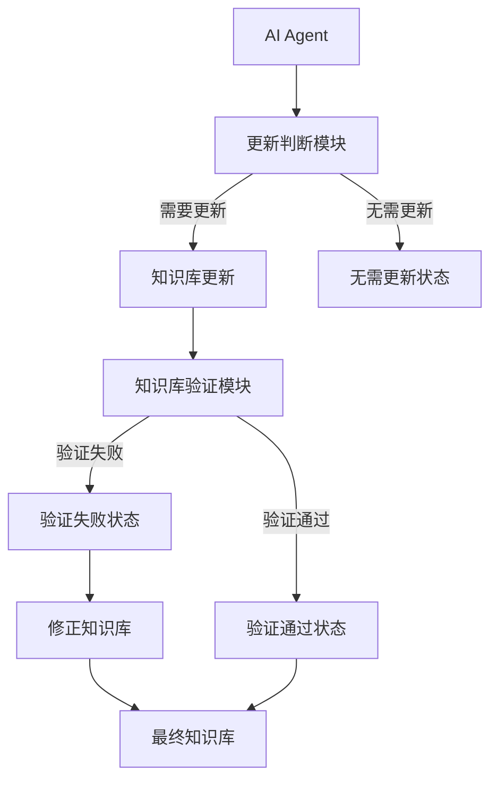

# 构建AI Agent的知识库更新与验证流程

> 关键词：AI Agent、知识库更新、知识库验证、流程构建、数据质量

> 摘要：本文围绕构建AI Agent的知识库更新与验证流程展开深入探讨。首先介绍了相关背景，包括目的范围、预期读者等内容。接着阐述了核心概念及联系，给出了清晰的文本示意图和Mermaid流程图。详细讲解了核心算法原理，并使用Python源代码进行说明。同时给出了相关数学模型和公式，辅以举例让读者更好理解。通过项目实战，从开发环境搭建到源代码实现与解读，全面展示了知识库更新与验证流程的实际操作。分析了该流程在不同场景的实际应用，推荐了学习资源、开发工具框架以及相关论文著作。最后总结了未来发展趋势与挑战，并提供常见问题解答和扩展阅读参考资料，旨在为读者提供全面、深入的AI Agent知识库更新与验证流程的技术指南。

## 1. 背景介绍 
### 1.1 目的和范围
在当今人工智能飞速发展的时代，AI Agent在各个领域得到了广泛应用。知识库作为AI Agent的重要组成部分，存储着大量的知识和信息，是AI Agent进行推理、决策和交互的基础。然而，随着时间的推移和新信息的不断涌现，知识库中的内容需要及时更新和验证，以确保其准确性、完整性和时效性。

本文的目的在于详细阐述如何构建一个高效、可靠的AI Agent知识库更新与验证流程。我们将探讨该流程涉及的核心概念、算法原理、数学模型，并通过实际的项目案例展示其具体实现。范围涵盖了从知识库更新的触发机制、更新策略的制定，到验证方法的选择和验证结果的处理等各个环节。

### 1.2 预期读者
本文主要面向以下几类读者：
- 人工智能开发者：希望了解如何为AI Agent构建知识库更新与验证流程，提升AI Agent的性能和智能化水平。
- 软件架构师：对设计复杂系统的架构感兴趣，尤其是涉及知识库管理和维护的架构。
- 研究人员：专注于人工智能领域的研究，希望深入探讨知识库更新与验证的理论和方法。
- 企业技术负责人：关注如何利用AI Agent提升企业的业务效率和竞争力，对知识库管理的实践经验有需求。

### 1.3 文档结构概述
本文将按照以下结构进行组织：
- 核心概念与联系：介绍AI Agent、知识库更新与验证的核心概念，以及它们之间的相互关系，并通过文本示意图和Mermaid流程图进行直观展示。
- 核心算法原理 & 具体操作步骤：详细讲解用于知识库更新与验证的核心算法，使用Python源代码进行具体实现和说明。
- 数学模型和公式 & 详细讲解 & 举例说明：给出相关的数学模型和公式，对其进行详细解释，并通过具体例子帮助读者理解。
- 项目实战：代码实际案例和详细解释说明：通过一个实际的项目案例，展示如何搭建开发环境、实现源代码，并对代码进行解读和分析。
- 实际应用场景：分析AI Agent知识库更新与验证流程在不同领域的实际应用场景。
- 工具和资源推荐：推荐学习资源、开发工具框架以及相关论文著作。
- 总结：未来发展趋势与挑战：总结AI Agent知识库更新与验证的未来发展趋势，以及可能面临的挑战。
- 附录：常见问题与解答：提供常见问题的解答，帮助读者解决实际遇到的问题。
- 扩展阅读 & 参考资料：提供扩展阅读的建议和相关参考资料，方便读者进一步深入学习。

### 1.4 术语表
#### 1.4.1 核心术语定义
- **AI Agent**：人工智能代理，是一种能够感知环境、进行推理和决策，并采取行动以实现特定目标的软件实体。
- **知识库**：存储知识和信息的集合，通常以结构化或半结构化的方式组织，为AI Agent提供推理和决策的基础。
- **知识库更新**：对知识库中的内容进行修改、添加或删除操作，以反映新的信息和知识。
- **知识库验证**：检查知识库中的内容是否准确、完整和一致，确保其质量符合要求。

#### 1.4.2 相关概念解释
- **知识表示**：将知识以计算机能够理解和处理的方式进行表示，常见的知识表示方法包括逻辑表示、语义网络、框架表示等。
- **数据融合**：将来自不同数据源的信息进行整合和处理，以生成更全面、准确的知识。
- **数据清洗**：对原始数据进行预处理，去除噪声、重复和错误的数据，提高数据质量。

#### 1.4.3 缩略词列表
- **AI**：Artificial Intelligence，人工智能
- **KB**：Knowledge Base，知识库

## 2. 核心概念与联系 

### 核心概念原理
AI Agent的知识库更新与验证流程主要涉及三个核心概念：AI Agent、知识库更新和知识库验证。

AI Agent是整个流程的核心执行体，它通过感知环境获取新的信息，并根据这些信息判断是否需要对知识库进行更新。知识库更新是指对知识库中的内容进行修改、添加或删除操作，以保证知识库的时效性和准确性。知识库验证则是对更新后的知识库进行检查，确保其内容的一致性、完整性和准确性。

### 文本示意图
```plaintext
            +----------------+
            |     AI Agent     |
            +----------------+
                   |
                   | 感知环境获取新信息
                   v
            +----------------+
            |  更新判断模块  |
            +----------------+
                   |
                   | 判断是否需要更新
                   |
           +-------+-------+
           |               |
           v               v
    +-----------+    +-----------+
    | 知识库更新 |    | 无需更新 |
    +-----------+    +-----------+
                   |
                   | 更新知识库
                   v
            +----------------+
            | 知识库验证模块 |
            +----------------+
                   |
                   | 验证知识库
                   |
           +-------+-------+
           |               |
           v               v
    +-----------+    +-----------+
    | 验证通过  |    | 验证失败 |
    +-----------+    +-----------+
                   |
                   | 修正知识库
                   v
            +----------------+
            | 最终知识库     |
            +----------------+
```

### Mermaid流程图


## 3. 核心算法原理 & 具体操作步骤 

### 核心算法原理
#### 基于规则的更新算法
基于规则的更新算法是一种简单而有效的知识库更新方法。它通过定义一系列的规则来判断是否需要对知识库进行更新，以及如何进行更新。例如，当某个数据源提供了新的信息，并且该信息满足特定的规则条件时，就可以将其添加到知识库中。

#### 验证算法
验证算法主要用于检查知识库中的内容是否准确、完整和一致。常见的验证方法包括一致性检查、完整性检查和准确性检查。一致性检查主要检查知识库中的知识是否相互矛盾；完整性检查检查知识库中的知识是否覆盖了所有必要的信息；准确性检查则检查知识库中的知识是否与实际情况相符。

### 具体操作步骤

#### 步骤1：数据收集
AI Agent通过各种数据源收集新的信息，如传感器数据、网络数据等。

#### 步骤2：更新判断
使用基于规则的更新算法，根据收集到的新信息判断是否需要对知识库进行更新。

#### 步骤3：知识库更新
如果需要更新，根据更新规则对知识库进行修改、添加或删除操作。

#### 步骤4：知识库验证
使用验证算法对更新后的知识库进行检查，确保其质量符合要求。

#### 步骤5：修正知识库
如果验证失败，根据验证结果对知识库进行修正，然后再次进行验证，直到验证通过为止。

### Python源代码实现

```python
# 模拟知识库
knowledge_base = {
    "fact1": "This is fact 1",
    "fact2": "This is fact 2"
}

# 模拟数据源
data_source = {
    "fact3": "This is fact 3"
}

# 基于规则的更新算法
def update_knowledge_base(knowledge_base, data_source):
    for key, value in data_source.items():
        if key not in knowledge_base:
            knowledge_base[key] = value
    return knowledge_base

# 验证算法（简单的一致性检查）
def validate_knowledge_base(knowledge_base):
    # 这里可以实现更复杂的验证逻辑
    # 目前简单检查是否有重复的键
    keys = list(knowledge_base.keys())
    if len(set(keys)) == len(keys):
        return True
    return False

# 主流程
def main():
    # 步骤1：数据收集
    # 数据已经在 data_source 中

    # 步骤2：更新判断并更新知识库
    updated_kb = update_knowledge_base(knowledge_base, data_source)

    # 步骤3：知识库验证
    is_valid = validate_knowledge_base(updated_kb)

    if is_valid:
        print("知识库验证通过")
        print("最终知识库:", updated_kb)
    else:
        print("知识库验证失败，需要修正")

if __name__ == "__main__":
    main()
```

## 4. 数学模型和公式 & 详细讲解 & 举例说明 

### 数学模型
在知识库更新与验证过程中，可以使用一些数学模型来描述和分析相关问题。例如，我们可以使用集合论来描述知识库和新信息之间的关系。

设 $KB$ 表示知识库，$D$ 表示新的数据集合。知识库更新可以看作是 $KB$ 和 $D$ 的合并操作，即 $KB_{new} = KB \cup D$。

### 公式
#### 集合合并公式
$KB_{new} = KB \cup D$

#### 一致性检查公式
设 $KB = \{k_1, k_2,..., k_n\}$ 是知识库中的知识集合，对于任意的 $i, j (i \neq j)$，如果 $k_i$ 和 $k_j$ 之间不存在逻辑矛盾，则知识库是一致的。可以用以下公式表示：

$\forall i, j (1 \leq i \neq j \leq n), \neg (k_i \land \neg k_j)$

### 详细讲解
- **集合合并公式**：该公式表示将新的数据集合 $D$ 合并到知识库 $KB$ 中，得到更新后的知识库 $KB_{new}$。在实际应用中，可能需要处理数据冲突的情况，例如当 $KB$ 和 $D$ 中存在相同的知识但内容不同时，需要根据具体的策略进行处理。
- **一致性检查公式**：该公式用于检查知识库中的知识是否一致。如果对于任意两个不同的知识 $k_i$ 和 $k_j$，它们之间不存在逻辑矛盾（即 $k_i$ 为真时 $k_j$ 不能为假），则知识库是一致的。

### 举例说明
假设知识库 $KB = \{k_1: "苹果是水果", k_2: "香蕉是水果"\}$，新的数据集合 $D = \{k_3: "橙子是水果"\}$。

根据集合合并公式 $KB_{new} = KB \cup D$，更新后的知识库 $KB_{new} = \{k_1: "苹果是水果", k_2: "香蕉是水果", k_3: "橙子是水果"\}$。

对于一致性检查，由于 $k_1$、$k_2$ 和 $k_3$ 之间不存在逻辑矛盾，满足 $\forall i, j (1 \leq i \neq j \leq 3), \neg (k_i \land \neg k_j)$，所以更新后的知识库是一致的。

## 5. 项目实战：代码实际案例和详细解释说明 

### 5.1  开发环境搭建
#### 环境要求
- **操作系统**：推荐使用 Linux 或 macOS，也可以使用 Windows。
- **Python 版本**：Python 3.6 及以上。
- **开发工具**：推荐使用 PyCharm 或 Visual Studio Code。

#### 安装依赖库
在项目根目录下创建一个 `requirements.txt` 文件，内容如下：

```plaintext
# 可以根据实际需求添加更多依赖库
```

然后使用以下命令安装依赖库：

```bash
pip install -r requirements.txt
```

### 5.2  源代码详细实现和代码解读
```python
# 模拟知识库
knowledge_base = {
    "city1": "北京是中国的首都",
    "city2": "上海是中国的经济中心"
}

# 模拟数据源
data_source = {
    "city3": "广州是中国南方的重要城市"
}

# 基于规则的更新算法
def update_knowledge_base(knowledge_base, data_source):
    """
    该函数用于更新知识库
    :param knowledge_base: 原知识库
    :param data_source: 新的数据来源
    :return: 更新后的知识库
    """
    for key, value in data_source.items():
        if key not in knowledge_base:
            knowledge_base[key] = value
    return knowledge_base

# 验证算法（简单的一致性检查）
def validate_knowledge_base(knowledge_base):
    """
    该函数用于验证知识库的一致性
    :param knowledge_base: 待验证的知识库
    :return: 验证结果（True 表示通过，False 表示失败）
    """
    # 这里可以实现更复杂的验证逻辑
    # 目前简单检查是否有重复的键
    keys = list(knowledge_base.keys())
    if len(set(keys)) == len(keys):
        return True
    return False

# 主流程
def main():
    # 步骤1：数据收集
    # 数据已经在 data_source 中

    # 步骤2：更新判断并更新知识库
    updated_kb = update_knowledge_base(knowledge_base, data_source)

    # 步骤3：知识库验证
    is_valid = validate_knowledge_base(updated_kb)

    if is_valid:
        print("知识库验证通过")
        print("最终知识库:", updated_kb)
    else:
        print("知识库验证失败，需要修正")

if __name__ == "__main__":
    main()
```

### 5.3  代码解读与分析
- **知识库模拟**：使用字典 `knowledge_base` 模拟知识库，每个键值对表示一条知识。
- **数据源模拟**：使用字典 `data_source` 模拟新的数据来源。
- **更新算法**：`update_knowledge_base` 函数遍历新的数据来源，如果某个键不在知识库中，则将其添加到知识库中。
- **验证算法**：`validate_knowledge_base` 函数通过检查知识库中键的唯一性来进行简单的一致性验证。
- **主流程**：`main` 函数按照数据收集、更新判断、知识库更新、知识库验证的步骤执行，根据验证结果输出相应的信息。

## 6. 实际应用场景 
### 智能客服系统
在智能客服系统中，AI Agent需要根据用户的问题和反馈不断更新知识库。例如，当用户提出一个新的常见问题时，AI Agent可以将该问题及其答案添加到知识库中。同时，为了保证回答的准确性，需要对更新后的知识库进行验证，确保新添加的知识与已有知识不冲突。

### 金融风险评估系统
金融风险评估系统中的AI Agent需要实时更新知识库，以反映最新的市场信息和风险状况。例如，当出现新的金融法规或市场事件时，AI Agent需要将相关信息添加到知识库中。验证过程可以检查知识库中的风险评估模型是否仍然有效，以及新添加的信息是否会影响评估结果的准确性。

### 医疗诊断系统
医疗诊断系统中的AI Agent需要不断更新知识库，以跟上医学研究的最新进展。例如，当发现新的疾病症状或治疗方法时，AI Agent可以将这些信息添加到知识库中。验证过程可以确保知识库中的诊断规则和治疗建议的准确性，避免因错误的知识导致误诊或误治。

## 7. 工具和资源推荐
### 7.1 学习资源推荐
#### 7.1.1 书籍推荐
- 《人工智能：一种现代的方法》：全面介绍了人工智能的基本概念、算法和应用，是人工智能领域的经典教材。
- 《知识图谱：方法、实践与应用》：详细介绍了知识图谱的构建、应用和管理，对于理解知识库的相关概念和技术有很大帮助。

#### 7.1.2 在线课程
- Coursera上的“人工智能基础”课程：由知名教授授课，系统地介绍了人工智能的基础知识和算法。
- edX上的“知识图谱与语义网”课程：深入讲解了知识图谱的理论和实践，适合有一定基础的学习者。

#### 7.1.3 技术博客和网站
- Medium上的人工智能相关博客：有很多专家和开发者分享的最新技术和实践经验。
- 开源中国：提供了丰富的技术文章和开源项目，对于了解人工智能领域的最新动态有很大帮助。

### 7.2 开发工具框架推荐
#### 7.2.1 IDE和编辑器
- PyCharm：功能强大的Python集成开发环境，提供了代码编辑、调试、版本控制等一系列功能。
- Visual Studio Code：轻量级的代码编辑器，支持多种编程语言，有丰富的插件扩展。

#### 7.2.2 调试和性能分析工具
- pdb：Python自带的调试工具，可以帮助开发者定位代码中的问题。
- cProfile：Python的性能分析工具，可以分析代码的执行时间和资源消耗情况。

#### 7.2.3 相关框架和库
- RDFlib：用于处理RDF数据的Python库，在知识图谱和知识库开发中非常有用。
- NLTK：自然语言处理工具包，提供了丰富的文本处理功能，可用于知识库中的文本信息处理。

### 7.3 相关论文著作推荐
#### 7.3.1 经典论文
- “A Taxonomy of Knowledge Representation Formalisms”：对知识表示形式进行了系统的分类和介绍。
- “Knowledge Base Population: Successful Approaches and Challenges”：探讨了知识库填充的方法和面临的挑战。

#### 7.3.2 最新研究成果
可以关注顶级学术会议如AAAI、IJCAI等上发表的关于知识库更新与验证的最新研究论文。

#### 7.3.3 应用案例分析
- 一些知名企业如谷歌、微软等发表的关于AI Agent知识库应用的案例分析报告，对于了解实际应用中的经验和技巧有很大帮助。

## 8. 总结：未来发展趋势与挑战
### 未来发展趋势
- **自动化程度提高**：未来的知识库更新与验证流程将更加自动化，减少人工干预。例如，通过机器学习算法自动识别新的知识，并进行更新和验证。
- **与大数据和云计算的融合**：利用大数据和云计算的强大计算能力，处理大规模的知识库更新和验证任务，提高效率和准确性。
- **多模态知识的处理**：随着人工智能技术的发展，知识库将不仅包含文本信息，还将包含图像、音频、视频等多模态信息。因此，如何处理和验证多模态知识将成为未来的研究热点。

### 挑战
- **数据质量问题**：新的数据来源可能存在噪声、错误和不一致性，如何保证更新后的知识库质量是一个挑战。
- **知识冲突处理**：当新的知识与已有知识发生冲突时，如何选择合适的处理策略，保证知识库的一致性和准确性。
- **计算资源需求**：随着知识库规模的不断增大，更新和验证过程需要大量的计算资源，如何优化算法和架构，降低计算成本是一个亟待解决的问题。

## 9. 附录：常见问题与解答
### 问题1：如何处理知识库更新时的数据冲突？
解答：可以采用以下几种策略处理数据冲突：
- **保留最新数据**：当出现冲突时，保留最新添加的数据。
- **根据可信度判断**：为每条知识设置可信度，保留可信度较高的数据。
- **人工干预**：当无法自动解决冲突时，由人工进行判断和处理。

### 问题2：验证算法的复杂度如何？
解答：验证算法的复杂度取决于具体的验证方法和知识库的规模。简单的一致性检查算法复杂度可能较低，而复杂的语义验证算法复杂度可能较高。在实际应用中，需要根据具体情况选择合适的验证算法。

### 问题3：如何保证知识库更新的实时性？
解答：可以采用以下方法保证知识库更新的实时性：
- **实时数据监控**：通过实时监控数据源，及时发现新的信息并进行更新。
- **异步更新机制**：采用异步更新的方式，避免更新操作对系统性能的影响。

## 10. 扩展阅读 & 参考资料
### 扩展阅读
- 《深度学习》：深入了解深度学习的原理和应用，对于提升AI Agent的性能有很大帮助。
- 《机器学习实战》：通过实际案例学习机器学习的算法和应用，增强实践能力。

### 参考资料
- 相关学术期刊：如《Artificial Intelligence》、《Journal of Artificial Intelligence Research》等。
- 开源项目：如OpenAI的GPT系列、谷歌的BERT等，可以参考其实现原理和代码。

作者：AI天才研究院/AI Genius Institute & 禅与计算机程序设计艺术 /Zen And The Art of Computer Programming