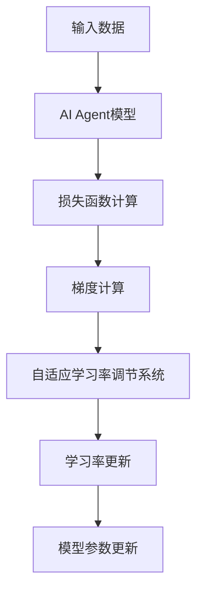

# 构建AI Agent的自适应学习率调节系统

> 关键词：AI Agent、自适应学习率调节、深度学习、优化算法、学习率策略

> 摘要：本文聚焦于构建AI Agent的自适应学习率调节系统。首先介绍了相关背景知识，包括目的范围、预期读者等。接着详细阐述了核心概念，如学习率、自适应调节等，并给出原理和架构的文本示意图及Mermaid流程图。深入探讨了核心算法原理，通过Python源代码详细展示操作步骤。还分析了数学模型和公式，结合实例进行说明。通过项目实战，给出开发环境搭建、源代码实现及解读。探讨了实际应用场景，推荐了学习资源、开发工具框架和相关论文著作。最后总结了未来发展趋势与挑战，解答常见问题并提供扩展阅读和参考资料，旨在帮助读者全面了解和构建AI Agent的自适应学习率调节系统。

## 1. 背景介绍 
### 1.1 目的和范围
在AI Agent的训练过程中，学习率是一个至关重要的超参数。它决定了模型参数更新的步长，直接影响模型的收敛速度和性能。固定学习率在很多情况下难以适应不同阶段的训练需求，可能导致训练初期收敛缓慢，或者在后期出现震荡无法收敛到最优解。因此，构建自适应学习率调节系统的目的在于根据训练的实际情况动态调整学习率，提高AI Agent的训练效率和性能。

本文章的范围涵盖了自适应学习率调节系统的核心概念、算法原理、数学模型、实际应用场景以及相关工具和资源的推荐。同时，通过项目实战详细展示如何在实际开发中构建和应用这样的系统。

### 1.2 预期读者
本文预期读者包括对人工智能、深度学习感兴趣的开发者、研究人员以及相关专业的学生。对于那些在AI Agent训练过程中遇到学习率调整问题，希望深入了解自适应学习率调节机制的读者具有较高的参考价值。

### 1.3 文档结构概述
本文将按照以下结构展开：首先介绍背景知识，让读者了解构建自适应学习率调节系统的必要性和意义。接着阐述核心概念，包括学习率、自适应调节等，以及它们之间的联系，并通过示意图和流程图进行直观展示。然后详细讲解核心算法原理和具体操作步骤，结合Python代码进行说明。之后分析数学模型和公式，并举例说明。通过项目实战，介绍开发环境搭建、源代码实现和解读。探讨实际应用场景，为读者提供实际应用的思路。推荐相关的学习资源、开发工具框架和论文著作。最后总结未来发展趋势与挑战，解答常见问题并提供扩展阅读和参考资料。

### 1.4 术语表
#### 1.4.1 核心术语定义
- **AI Agent**：人工智能代理，是一种能够感知环境、做出决策并采取行动以实现特定目标的智能实体。
- **学习率（Learning Rate）**：在机器学习和深度学习中，学习率是一个超参数，它控制着模型在每次迭代中更新参数的步长。
- **自适应学习率调节（Adaptive Learning Rate Adjustment）**：根据训练过程中的实际情况，如损失函数的变化、梯度的大小等，动态地调整学习率的机制。

#### 1.4.2 相关概念解释
- **梯度下降（Gradient Descent）**：一种常用的优化算法，通过沿着目标函数的负梯度方向更新模型参数，以最小化损失函数。
- **损失函数（Loss Function）**：用于衡量模型预测结果与真实标签之间的差异，是优化模型的目标。

#### 1.4.3 缩略词列表
- **SGD**：随机梯度下降（Stochastic Gradient Descent）
- **Adam**：自适应矩估计（Adaptive Moment Estimation）

## 2. 核心概念与联系 

### 核心概念原理

#### 学习率
学习率 $\alpha$ 决定了模型参数在每次迭代中更新的幅度。在梯度下降算法中，参数更新公式为：

$$\theta_{t+1} = \theta_{t} - \alpha \nabla J(\theta_{t})$$

其中，$\theta_{t}$ 是第 $t$ 次迭代的模型参数，$\nabla J(\theta_{t})$ 是损失函数 $J(\theta)$ 在 $\theta_{t}$ 处的梯度。如果学习率过大，模型可能会跳过最优解，导致无法收敛；如果学习率过小，模型的收敛速度会非常缓慢。

#### 自适应学习率调节
自适应学习率调节的核心思想是根据训练过程中的动态信息，如梯度的大小、损失函数的变化等，自动调整学习率。这样可以在训练初期使用较大的学习率，加快收敛速度；在训练后期使用较小的学习率，提高模型的稳定性和准确性。

### 架构的文本示意图
```plaintext
输入数据 -> AI Agent模型 -> 损失函数计算 -> 梯度计算
     |                          |
     V                          V
自适应学习率调节系统 -> 学习率更新 -> 模型参数更新
```

### Mermaid流程图


## 3. 核心算法原理 & 具体操作步骤 

### 常见的自适应学习率算法

#### Adagrad算法
Adagrad算法根据每个参数的历史梯度平方和来调整学习率。具体来说，对于第 $i$ 个参数 $\theta_{i}$，其学习率更新公式为：

$$\theta_{i,t+1} = \theta_{i,t} - \frac{\alpha}{\sqrt{G_{i,t} + \epsilon}} \nabla J_{i}(\theta_{t})$$

其中，$G_{i,t}$ 是第 $i$ 个参数在 $t$ 时刻之前的梯度平方和，$\epsilon$ 是一个很小的常数，用于避免分母为零。

以下是使用Python实现Adagrad算法的代码：
```python
import numpy as np

class Adagrad:
    def __init__(self, learning_rate=0.01, epsilon=1e-8):
        self.learning_rate = learning_rate
        self.epsilon = epsilon
        self.G = None

    def update(self, params, grads):
        if self.G is None:
            self.G = {}
            for key, val in params.items():
                self.G[key] = np.zeros_like(val)

        for key in params.keys():
            self.G[key] += grads[key] * grads[key]
            params[key] -= self.learning_rate * grads[key] / (np.sqrt(self.G[key]) + self.epsilon)

        return params
```

#### Adam算法
Adam算法结合了Adagrad和RMSProp的优点，同时考虑了梯度的一阶矩（均值）和二阶矩（方差）。其参数更新公式为：

$$m_{t} = \beta_{1}m_{t-1} + (1 - \beta_{1})\nabla J(\theta_{t})$$
$$v_{t} = \beta_{2}v_{t-1} + (1 - \beta_{2})\nabla J(\theta_{t})^2$$
$$\hat{m}_{t} = \frac{m_{t}}{1 - \beta_{1}^t}$$
$$\hat{v}_{t} = \frac{v_{t}}{1 - \beta_{2}^t}$$
$$\theta_{t+1} = \theta_{t} - \frac{\alpha}{\sqrt{\hat{v}_{t}} + \epsilon} \hat{m}_{t}$$

其中，$m_{t}$ 和 $v_{t}$ 分别是梯度的一阶矩和二阶矩估计，$\beta_{1}$ 和 $\beta_{2}$ 是衰减系数，通常分别设置为 0.9 和 0.999。

以下是使用Python实现Adam算法的代码：
```python
import numpy as np

class Adam:
    def __init__(self, learning_rate=0.001, beta1=0.9, beta2=0.999, epsilon=1e-8):
        self.learning_rate = learning_rate
        self.beta1 = beta1
        self.beta2 = beta2
        self.epsilon = epsilon
        self.m = None
        self.v = None
        self.t = 0

    def update(self, params, grads):
        if self.m is None:
            self.m, self.v = {}, {}
            for key, val in params.items():
                self.m[key] = np.zeros_like(val)
                self.v[key] = np.zeros_like(val)

        self.t += 1
        for key in params.keys():
            self.m[key] = self.beta1 * self.m[key] + (1 - self.beta1) * grads[key]
            self.v[key] = self.beta2 * self.v[key] + (1 - self.beta2) * (grads[key] ** 2)

            m_hat = self.m[key] / (1 - self.beta1 ** self.t)
            v_hat = self.v[key] / (1 - self.beta2 ** self.t)

            params[key] -= self.learning_rate * m_hat / (np.sqrt(v_hat) + self.epsilon)

        return params
```

### 具体操作步骤
1. 初始化模型参数和自适应学习率调节系统的超参数（如学习率、衰减系数等）。
2. 从训练数据中选取一个批次的数据，输入到AI Agent模型中进行前向传播，计算损失函数。
3. 计算损失函数关于模型参数的梯度。
4. 使用自适应学习率调节系统根据梯度信息更新学习率。
5. 根据更新后的学习率和梯度更新模型参数。
6. 重复步骤2-5，直到达到预定的训练轮数或满足收敛条件。

## 4. 数学模型和公式 & 详细讲解 & 举例说明 

### Adagrad算法的数学模型和公式
Adagrad算法的核心公式为：

$$\theta_{i,t+1} = \theta_{i,t} - \frac{\alpha}{\sqrt{G_{i,t} + \epsilon}} \nabla J_{i}(\theta_{t})$$

其中，$G_{i,t}$ 是第 $i$ 个参数在 $t$ 时刻之前的梯度平方和，计算公式为：

$$G_{i,t} = \sum_{k=1}^{t} \nabla J_{i}(\theta_{k})^2$$

#### 详细讲解
Adagrad算法的主要思想是对频繁更新的参数使用较小的学习率，对不频繁更新的参数使用较大的学习率。通过累积梯度的平方和，$G_{i,t}$ 可以反映参数的更新频率。当某个参数的梯度平方和较大时，说明该参数更新频繁，此时学习率会相应减小；反之，学习率会增大。

#### 举例说明
假设我们有一个简单的线性回归模型 $y = \theta_{0} + \theta_{1}x$，损失函数为均方误差：

$$J(\theta) = \frac{1}{2m} \sum_{i=1}^{m} (y^{(i)} - (\theta_{0} + \theta_{1}x^{(i)}))^2$$

其中，$m$ 是样本数量，$x^{(i)}$ 和 $y^{(i)}$ 分别是第 $i$ 个样本的输入和输出。

我们使用Adagrad算法更新模型参数 $\theta_{0}$ 和 $\theta_{1}$。假设初始学习率 $\alpha = 0.01$，$\epsilon = 1e-8$。在第 $t$ 次迭代中，计算梯度 $\nabla J(\theta_{t})$，然后更新 $G_{0,t}$ 和 $G_{1,t}$：

$$G_{0,t} = G_{0,t-1} + \nabla J_{0}(\theta_{t})^2$$
$$G_{1,t} = G_{1,t-1} + \nabla J_{1}(\theta_{t})^2$$

最后更新参数：

$$\theta_{0,t+1} = \theta_{0,t} - \frac{\alpha}{\sqrt{G_{0,t} + \epsilon}} \nabla J_{0}(\theta_{t})$$
$$\theta_{1,t+1} = \theta_{1,t} - \frac{\alpha}{\sqrt{G_{1,t} + \epsilon}} \nabla J_{1}(\theta_{t})$$

### Adam算法的数学模型和公式
Adam算法的核心公式前面已经介绍过，这里再次列出：

$$m_{t} = \beta_{1}m_{t-1} + (1 - \beta_{1})\nabla J(\theta_{t})$$
$$v_{t} = \beta_{2}v_{t-1} + (1 - \beta_{2})\nabla J(\theta_{t})^2$$
$$\hat{m}_{t} = \frac{m_{t}}{1 - \beta_{1}^t}$$
$$\hat{v}_{t} = \frac{v_{t}}{1 - \beta_{2}^t}$$
$$\theta_{t+1} = \theta_{t} - \frac{\alpha}{\sqrt{\hat{v}_{t}} + \epsilon} \hat{m}_{t}$$

#### 详细讲解
Adam算法通过计算梯度的一阶矩 $m_{t}$ 和二阶矩 $v_{t}$，并进行偏差修正得到 $\hat{m}_{t}$ 和 $\hat{v}_{t}$，然后根据这些值调整学习率。一阶矩 $m_{t}$ 可以看作是梯度的均值，二阶矩 $v_{t}$ 可以看作是梯度的方差。通过这种方式，Adam算法能够自适应地调整每个参数的学习率，同时考虑了梯度的历史信息和当前信息。

#### 举例说明
同样以简单的线性回归模型为例，在第 $t$ 次迭代中，首先计算梯度 $\nabla J(\theta_{t})$。然后更新一阶矩 $m_{t}$ 和二阶矩 $v_{t}$：

$$m_{0,t} = \beta_{1}m_{0,t-1} + (1 - \beta_{1})\nabla J_{0}(\theta_{t})$$
$$m_{1,t} = \beta_{1}m_{1,t-1} + (1 - \beta_{1})\nabla J_{1}(\theta_{t})$$
$$v_{0,t} = \beta_{2}v_{0,t-1} + (1 - \beta_{2})\nabla J_{0}(\theta_{t})^2$$
$$v_{1,t} = \beta_{2}v_{1,t-1} + (1 - \beta_{2})\nabla J_{1}(\theta_{t})^2$$

接着进行偏差修正：

$$\hat{m}_{0,t} = \frac{m_{0,t}}{1 - \beta_{1}^t}$$
$$\hat{m}_{1,t} = \frac{m_{1,t}}{1 - \beta_{1}^t}$$
$$\hat{v}_{0,t} = \frac{v_{0,t}}{1 - \beta_{2}^t}$$
$$\hat{v}_{1,t} = \frac{v_{1,t}}{1 - \beta_{2}^t}$$

最后更新参数：

$$\theta_{0,t+1} = \theta_{0,t} - \frac{\alpha}{\sqrt{\hat{v}_{0,t}} + \epsilon} \hat{m}_{0,t}$$
$$\theta_{1,t+1} = \theta_{1,t} - \frac{\alpha}{\sqrt{\hat{v}_{1,t}} + \epsilon} \hat{m}_{1,t}$$

## 5. 项目实战：代码实际案例和详细解释说明 

### 5.1  开发环境搭建
- **Python环境**：建议使用Python 3.7及以上版本，可以从Python官方网站（https://www.python.org/downloads/）下载安装。
- **深度学习框架**：使用PyTorch作为深度学习框架，可以通过以下命令安装：
```bash
pip install torch torchvision
```
- **其他依赖库**：安装NumPy、Matplotlib等常用库：
```bash
pip install numpy matplotlib
```

### 5.2  源代码详细实现和代码解读
以下是一个使用PyTorch实现的简单AI Agent训练示例，同时使用Adam算法进行自适应学习率调节：
```python
import torch
import torch.nn as nn
import torch.optim as optim
import numpy as np
import matplotlib.pyplot as plt

# 生成模拟数据
np.random.seed(42)
x = np.linspace(-1, 1, 100)
y = 2 * x + 1 + 0.5 * np.random.randn(100)

x = torch.from_numpy(x).float().view(-1, 1)
y = torch.from_numpy(y).float().view(-1, 1)

# 定义AI Agent模型
class SimpleModel(nn.Module):
    def __init__(self):
        super(SimpleModel, self).__init__()
        self.linear = nn.Linear(1, 1)

    def forward(self, x):
        return self.linear(x)

model = SimpleModel()

# 定义损失函数和优化器
criterion = nn.MSELoss()
optimizer = optim.Adam(model.parameters(), lr=0.01)

# 训练模型
num_epochs = 100
losses = []

for epoch in range(num_epochs):
    # 前向传播
    outputs = model(x)
    loss = criterion(outputs, y)

    # 反向传播和优化
    optimizer.zero_grad()
    loss.backward()
    optimizer.step()

    losses.append(loss.item())

    if (epoch + 1) % 10 == 0:
        print(f'Epoch [{epoch+1}/{num_epochs}], Loss: {loss.item():.4f}')

# 绘制损失曲线
plt.plot(range(num_epochs), losses)
plt.xlabel('Epoch')
plt.ylabel('Loss')
plt.title('Training Loss')
plt.show()
```

### 5.3  代码解读与分析
1. **数据生成**：使用NumPy生成模拟数据 $x$ 和 $y$，并将其转换为PyTorch的张量。
2. **模型定义**：定义一个简单的线性回归模型 `SimpleModel`，包含一个线性层。
3. **损失函数和优化器**：使用均方误差损失函数 `nn.MSELoss()` 和Adam优化器 `optim.Adam()`。
4. **训练过程**：在每个epoch中，进行前向传播计算损失，然后进行反向传播和参数更新。
5. **损失曲线绘制**：使用Matplotlib绘制训练过程中的损失曲线，以便观察模型的训练效果。

通过使用Adam优化器，模型能够自适应地调整学习率，从而更快地收敛到最优解。

## 6. 实际应用场景 
### 图像识别
在图像识别任务中，如手写数字识别、图像分类等，AI Agent需要学习大量的图像特征。自适应学习率调节系统可以帮助模型更快地收敛，提高识别准确率。在训练初期，较大的学习率可以使模型快速探索参数空间，找到大致的最优区域；在训练后期，较小的学习率可以使模型更加精细地调整参数，提高识别精度。

### 自然语言处理
在自然语言处理任务中，如文本分类、机器翻译等，模型需要处理复杂的语言结构和语义信息。自适应学习率调节可以根据不同的训练阶段和数据特点，动态调整学习率，避免模型陷入局部最优解，提高模型的泛化能力。

### 强化学习
在强化学习中，AI Agent需要通过与环境进行交互来学习最优策略。自适应学习率调节系统可以根据Agent的奖励信号和学习进度，动态调整学习率，使Agent能够更快地学习到有效的策略，提高学习效率和性能。

## 7. 工具和资源推荐
### 7.1 学习资源推荐
#### 7.1.1 书籍推荐
- 《深度学习》（Deep Learning）：由Ian Goodfellow、Yoshua Bengio和Aaron Courville撰写，是深度学习领域的经典教材，全面介绍了深度学习的基本概念、算法和应用。
- 《Python深度学习》（Deep Learning with Python）：由Francois Chollet撰写，结合Keras框架，详细介绍了深度学习的实践方法和技巧。

#### 7.1.2 在线课程
- Coursera上的“深度学习专项课程”（Deep Learning Specialization）：由Andrew Ng教授授课，涵盖了深度学习的各个方面，包括神经网络、卷积神经网络、循环神经网络等。
- edX上的“人工智能基础”（Introduction to Artificial Intelligence）：介绍了人工智能的基本概念、算法和应用，为学习自适应学习率调节系统提供了基础。

#### 7.1.3 技术博客和网站
- Medium上的Towards Data Science：汇集了众多数据科学和人工智能领域的优秀文章，包括自适应学习率调节的相关技术和实践经验。
- 机器之心（https://www.alienzoo.com/）：专注于人工智能领域的资讯和技术分享，提供了大量关于深度学习和优化算法的文章。

### 7.2 开发工具框架推荐
#### 7.2.1 IDE和编辑器
- PyCharm：是一款专业的Python集成开发环境，提供了丰富的代码编辑、调试和项目管理功能，适合深度学习项目的开发。
- Jupyter Notebook：是一个交互式的笔记本环境，支持Python代码的实时运行和可视化，方便进行模型实验和数据分析。

#### 7.2.2 调试和性能分析工具
- TensorBoard：是TensorFlow提供的可视化工具，可以用于可视化训练过程中的损失曲线、学习率变化等信息，帮助开发者调试和优化模型。
- PyTorch Profiler：是PyTorch提供的性能分析工具，可以帮助开发者分析模型的运行时间、内存使用等情况，找出性能瓶颈。

#### 7.2.3 相关框架和库
- PyTorch：是一个开源的深度学习框架，提供了丰富的神经网络层和优化算法，支持自适应学习率调节。
- TensorFlow：是另一个广泛使用的深度学习框架，具有强大的分布式训练和模型部署能力，也支持多种自适应学习率调节算法。

### 7.3 相关论文著作推荐
#### 7.3.1 经典论文
- 《Adaptive Subgradient Methods for Online Learning and Stochastic Optimization》：介绍了Adagrad算法，是自适应学习率调节领域的经典论文。
- 《Adam: A Method for Stochastic Optimization》：提出了Adam算法，结合了Adagrad和RMSProp的优点，是目前使用最广泛的自适应学习率调节算法之一。

#### 7.3.2 最新研究成果
- 《AdaBound: Adaptive Gradient Methods with Dynamic Bound of Learning Rate》：提出了AdaBound算法，通过动态调整学习率的上下界，在训练初期使用较大的学习率，在训练后期逐渐收敛到固定学习率。
- 《Lookahead Optimizer: k steps forward, 1 step back》：提出了Lookahead优化器，通过在多个步骤中向前探索，然后再进行一次参数更新，提高了模型的稳定性和收敛速度。

#### 7.3.3 应用案例分析
- 《ImageNet Classification with Deep Convolutional Neural Networks》：介绍了AlexNet在图像分类任务中的应用，展示了深度学习模型在大规模图像数据集上的强大性能。
- 《Attention Is All You Need》：提出了Transformer模型，在自然语言处理领域取得了巨大成功，为自适应学习率调节在该领域的应用提供了案例。

## 8. 总结：未来发展趋势与挑战
### 未来发展趋势
- **更智能的自适应策略**：未来的自适应学习率调节系统将更加智能，能够根据模型的结构、数据的特点和训练的阶段，自动选择最优的学习率调节策略。
- **结合元学习**：元学习是一种学习如何学习的方法，将自适应学习率调节与元学习相结合，可以使模型更快地适应新的任务和数据。
- **多目标自适应调节**：除了考虑损失函数的收敛速度和稳定性，未来的自适应学习率调节系统还将考虑其他目标，如模型的泛化能力、计算效率等。

### 挑战
- **计算资源消耗**：一些复杂的自适应学习率调节算法需要大量的计算资源和内存，这对于大规模模型和数据集的训练来说是一个挑战。
- **超参数调整**：自适应学习率调节算法仍然需要一些超参数，如衰减系数、初始学习率等，如何选择合适的超参数仍然是一个难题。
- **理论分析**：虽然自适应学习率调节算法在实践中取得了很好的效果，但目前对于其理论分析还不够完善，需要进一步深入研究。

## 9. 附录：常见问题与解答
### 问题1：自适应学习率调节一定比固定学习率好吗？
不一定。在某些简单的任务和数据集上，固定学习率可能已经能够取得较好的效果。而在复杂的任务和数据集上，自适应学习率调节通常能够提高模型的训练效率和性能。但自适应学习率调节算法也需要一定的计算资源和超参数调整，因此需要根据具体情况进行选择。

### 问题2：如何选择合适的自适应学习率调节算法？
选择合适的自适应学习率调节算法需要考虑多个因素，如任务的类型、数据集的规模、模型的结构等。一般来说，Adam算法是一个比较通用的选择，适用于大多数任务和数据集。如果数据比较稀疏，Adagrad算法可能更合适。如果需要更快的收敛速度，可以考虑使用AdaBound算法。

### 问题3：自适应学习率调节算法的超参数如何调整？
自适应学习率调节算法的超参数调整通常需要进行实验和调优。可以使用网格搜索、随机搜索等方法来寻找最优的超参数组合。同时，也可以参考相关的研究论文和实践经验，选择合适的初始值。

## 10. 扩展阅读 & 参考资料
- 《深度学习实战》（Deep Learning in Practice）
- 《人工智能：现代方法》（Artificial Intelligence: A Modern Approach）
- 相关学术期刊：《Journal of Artificial Intelligence Research》、《Neural Computation》等

作者：AI天才研究院/AI Genius Institute & 禅与计算机程序设计艺术 /Zen And The Art of Computer Programming