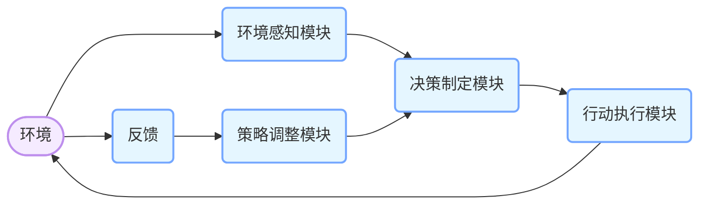

# 构建AI Agent的自适应学习系统

> 关键词：AI Agent、自适应学习系统、机器学习、强化学习、智能决策

> 摘要：本文围绕构建AI Agent的自适应学习系统展开，详细阐述了相关核心概念、算法原理、数学模型等内容。通过实际案例展示了系统的开发过程，分析了其在不同场景下的应用。同时，推荐了学习资源、开发工具和相关论文著作，最后总结了该领域的未来发展趋势与挑战，并对常见问题进行了解答。旨在为开发者和研究者提供全面且深入的指导，助力构建高效、智能的AI Agent自适应学习系统。

## 1. 背景介绍 
### 1.1 目的和范围
随着人工智能技术的飞速发展，AI Agent在各个领域的应用越来越广泛。构建AI Agent的自适应学习系统的目的在于使AI Agent能够根据不同的环境和任务需求，自动调整学习策略和行为模式，以实现更高效、智能的决策和行动。本文章的范围涵盖了自适应学习系统的核心概念、算法原理、数学模型、实际应用案例等方面，旨在为开发者和研究者提供全面且深入的技术指导。

### 1.2 预期读者
本文预期读者包括人工智能领域的开发者、研究者、学生以及对AI Agent和自适应学习系统感兴趣的技术爱好者。无论是初学者想要了解基本概念，还是有一定经验的专业人士希望深入研究算法和应用，都能从本文中获得有价值的信息。

### 1.3 文档结构概述
本文将按照以下结构进行组织：首先介绍背景信息，包括目的、预期读者和文档结构概述；接着阐述核心概念与联系，通过文本示意图和Mermaid流程图展示系统架构；然后详细讲解核心算法原理和具体操作步骤，使用Python源代码进行说明；之后介绍数学模型和公式，并举例说明；再通过项目实战展示代码实际案例和详细解释；接着分析实际应用场景；推荐相关的工具和资源；最后总结未来发展趋势与挑战，解答常见问题，并提供扩展阅读和参考资料。

### 1.4 术语表
#### 1.4.1 核心术语定义
- **AI Agent**：能够感知环境、做出决策并采取行动以实现特定目标的智能实体。
- **自适应学习系统**：一种可以根据环境变化和任务反馈自动调整学习策略和行为的系统。
- **机器学习**：让计算机通过数据学习模式和规律，从而做出预测或决策的技术。
- **强化学习**：一种通过智能体与环境进行交互，根据奖励信号来学习最优行为策略的机器学习方法。

#### 1.4.2 相关概念解释
- **智能决策**：AI Agent根据感知到的环境信息和自身的目标，运用一定的算法和策略做出最优决策的过程。
- **环境感知**：AI Agent通过各种传感器或输入接口获取周围环境信息的能力。
- **策略调整**：根据环境变化和学习反馈，对AI Agent的行为策略进行修改和优化的过程。

#### 1.4.3 缩略词列表
- **RL**：Reinforcement Learning，强化学习
- **ML**：Machine Learning，机器学习
- **Q - learning**：一种基于值函数的强化学习算法

## 2. 核心概念与联系 
### 核心概念原理
AI Agent的自适应学习系统主要基于机器学习和强化学习的原理。机器学习为系统提供了从数据中学习模式和规律的能力，而强化学习则通过智能体与环境的交互，根据奖励信号来学习最优行为策略。

自适应学习系统的核心是能够根据环境的变化和任务的反馈，自动调整学习策略和行为模式。这需要系统具备环境感知、决策制定和策略调整的能力。环境感知模块负责收集环境信息，决策制定模块根据感知到的信息和系统的目标做出决策，策略调整模块则根据反馈结果对决策策略进行优化。

### 架构的文本示意图
一个典型的AI Agent自适应学习系统架构可以描述如下：

AI Agent由环境感知模块、决策制定模块、行动执行模块和策略调整模块组成。环境感知模块通过传感器或输入接口获取环境信息，并将其传递给决策制定模块。决策制定模块根据环境信息和系统的目标，运用一定的算法和策略做出决策。行动执行模块根据决策结果执行相应的行动，与环境进行交互。环境会对AI Agent的行动产生反馈，策略调整模块根据反馈结果对决策策略进行调整，以提高系统的性能和适应性。

### Mermaid流程图


该流程图展示了AI Agent自适应学习系统的工作流程。首先，环境感知模块从环境中获取信息，然后决策制定模块根据这些信息做出决策，行动执行模块执行决策并与环境交互。环境产生的反馈被用于策略调整模块，对决策策略进行优化，形成一个闭环的学习过程。

## 3. 核心算法原理 & 具体操作步骤 
### 强化学习基础
强化学习是构建AI Agent自适应学习系统的核心算法之一。在强化学习中，智能体（AI Agent）与环境进行交互，通过执行行动来改变环境状态，并获得相应的奖励。智能体的目标是学习一个最优策略，使得在长期运行中获得的累积奖励最大化。

#### Q - learning算法原理
Q - learning是一种基于值函数的强化学习算法，其核心思想是通过估计每个状态 - 行动对的价值（Q值）来学习最优策略。Q值表示在某个状态下采取某个行动后，智能体在未来所能获得的累积奖励的期望。

Q - learning的更新公式如下：
$$Q(s_t, a_t) \leftarrow Q(s_t, a_t) + \alpha \left[r_{t+1} + \gamma \max_{a} Q(s_{t+1}, a) - Q(s_t, a_t)\right]$$
其中：
- $s_t$ 表示当前状态
- $a_t$ 表示当前行动
- $r_{t+1}$ 表示执行行动 $a_t$ 后获得的即时奖励
- $s_{t+1}$ 表示执行行动 $a_t$ 后转移到的下一个状态
- $\alpha$ 是学习率，控制每次更新的步长
- $\gamma$ 是折扣因子，用于权衡即时奖励和未来奖励的重要性

#### Python源代码实现
```python
import numpy as np

# 定义Q - learning类
class QLearningAgent:
    def __init__(self, num_states, num_actions, learning_rate=0.1, discount_factor=0.9):
        self.num_states = num_states
        self.num_actions = num_actions
        self.learning_rate = learning_rate
        self.discount_factor = discount_factor
        # 初始化Q表
        self.q_table = np.zeros((num_states, num_actions))

    def choose_action(self, state, epsilon=0.1):
        # epsilon - greedy策略选择行动
        if np.random.uniform(0, 1) < epsilon:
            # 随机选择行动
            action = np.random.choice(self.num_actions)
        else:
            # 选择Q值最大的行动
            action = np.argmax(self.q_table[state, :])
        return action

    def update_q_table(self, state, action, reward, next_state):
        # 根据Q - learning更新公式更新Q表
        max_q_next = np.max(self.q_table[next_state, :])
        self.q_table[state, action] += self.learning_rate * (
            reward + self.discount_factor * max_q_next - self.q_table[state, action]
        )

# 示例使用
if __name__ == "__main__":
    num_states = 10
    num_actions = 4
    agent = QLearningAgent(num_states, num_actions)

    # 模拟一次交互
    state = np.random.randint(0, num_states)
    action = agent.choose_action(state)
    next_state = np.random.randint(0, num_states)
    reward = np.random.randn()

    agent.update_q_table(state, action, reward, next_state)
    print("Updated Q - table:", agent.q_table)
```

### 具体操作步骤
1. **初始化**：初始化Q表，将所有状态 - 行动对的Q值初始化为0。
2. **选择行动**：在每个时间步，智能体根据当前状态和Q表，使用epsilon - greedy策略选择一个行动。epsilon - greedy策略以一定的概率（epsilon）随机选择行动，以探索新的状态 - 行动对；以1 - epsilon的概率选择Q值最大的行动，以利用已有的知识。
3. **执行行动并获取反馈**：智能体执行选择的行动，与环境进行交互，获得即时奖励和下一个状态。
4. **更新Q表**：根据Q - learning更新公式，使用获得的奖励和下一个状态的最大Q值更新当前状态 - 行动对的Q值。
5. **重复步骤2 - 4**：不断重复上述步骤，直到达到终止条件（如达到最大时间步数或满足特定的性能指标）。

## 4. 数学模型和公式 & 详细讲解 & 举例说明 
### 马尔可夫决策过程（MDP）
马尔可夫决策过程是强化学习的理论基础，它可以用来描述智能体与环境的交互过程。一个MDP可以用一个五元组 $\langle S, A, P, R, \gamma \rangle$ 来表示，其中：
- $S$ 是有限的状态集合
- $A$ 是有限的行动集合
- $P(s_{t+1} | s_t, a_t)$ 是状态转移概率，表示在状态 $s_t$ 采取行动 $a_t$ 后转移到状态 $s_{t+1}$ 的概率
- $R(s_t, a_t, s_{t+1})$ 是奖励函数，表示在状态 $s_t$ 采取行动 $a_t$ 转移到状态 $s_{t+1}$ 后获得的奖励
- $\gamma \in [0, 1]$ 是折扣因子，用于权衡即时奖励和未来奖励的重要性

### 价值函数
在强化学习中，有两种重要的价值函数：状态价值函数 $V^{\pi}(s)$ 和状态 - 行动价值函数 $Q^{\pi}(s, a)$。

#### 状态价值函数
状态价值函数 $V^{\pi}(s)$ 表示在策略 $\pi$ 下，从状态 $s$ 开始，智能体所能获得的累积折扣奖励的期望：
$$V^{\pi}(s) = \mathbb{E}_{\pi} \left[\sum_{k=0}^{\infty} \gamma^k r_{t + k + 1} | s_t = s\right]$$

#### 状态 - 行动价值函数
状态 - 行动价值函数 $Q^{\pi}(s, a)$ 表示在策略 $\pi$ 下，从状态 $s$ 采取行动 $a$ 开始，智能体所能获得的累积折扣奖励的期望：
$$Q^{\pi}(s, a) = \mathbb{E}_{\pi} \left[\sum_{k=0}^{\infty} \gamma^k r_{t + k + 1} | s_t = s, a_t = a\right]$$

### 贝尔曼方程
贝尔曼方程描述了价值函数之间的递归关系。

#### 状态价值函数的贝尔曼方程
$$V^{\pi}(s) = \sum_{a \in A} \pi(a | s) \sum_{s' \in S} P(s' | s, a) \left[R(s, a, s') + \gamma V^{\pi}(s')\right]$$

#### 状态 - 行动价值函数的贝尔曼方程
$$Q^{\pi}(s, a) = \sum_{s' \in S} P(s' | s, a) \left[R(s, a, s') + \gamma \sum_{a' \in A} \pi(a' | s') Q^{\pi}(s', a')\right]$$

### 举例说明
考虑一个简单的网格世界环境，智能体在一个 $3 \times 3$ 的网格中移动，目标是到达右上角的目标位置。智能体可以采取四个行动：上、下、左、右。

- **状态集合 $S$**：共有9个状态，每个状态对应网格中的一个位置。
- **行动集合 $A$**：包括上、下、左、右四个行动。
- **状态转移概率 $P$**：假设智能体在网格内移动时，行动执行成功的概率为0.8，随机移动到其他相邻位置的概率为0.2。
- **奖励函数 $R$**：到达目标位置获得奖励10，其他位置获得奖励 - 1。
- **折扣因子 $\gamma$**：设为0.9。

假设智能体当前处于状态 $(1, 1)$（网格的第二行第二列），采取行动“上”。如果行动执行成功，智能体将移动到状态 $(0, 1)$，获得奖励 - 1；如果行动失败，智能体可能随机移动到其他相邻位置。

根据贝尔曼方程，可以计算出状态 $(1, 1)$ 的状态价值函数 $V^{\pi}(1, 1)$ 和状态 - 行动价值函数 $Q^{\pi}(1, 1, \text{上})$。

## 5. 项目实战：代码实际案例和详细解释说明 
### 5.1  开发环境搭建
#### 安装Python
首先，确保你已经安装了Python 3.x版本。可以从Python官方网站（https://www.python.org/downloads/）下载并安装适合你操作系统的版本。

#### 安装必要的库
在项目中，我们将使用NumPy和Matplotlib库。可以使用以下命令进行安装：
```sh
pip install numpy matplotlib
```

### 5.2  源代码详细实现和代码解读
```python
import numpy as np
import matplotlib.pyplot as plt

# 定义网格世界环境
class GridWorld:
    def __init__(self, grid_size=3):
        self.grid_size = grid_size
        self.num_states = grid_size * grid_size
        self.num_actions = 4  # 上、下、左、右
        self.goal_state = grid_size * grid_size - 1  # 目标状态
        self.current_state = 0  # 初始状态

    def reset(self):
        # 重置环境到初始状态
        self.current_state = 0
        return self.current_state

    def step(self, action):
        # 执行行动并返回下一个状态、奖励和是否终止
        x, y = self._state_to_xy(self.current_state)

        if action == 0:  # 上
            new_x = max(x - 1, 0)
            new_y = y
        elif action == 1:  # 下
            new_x = min(x + 1, self.grid_size - 1)
            new_y = y
        elif action == 2:  # 左
            new_x = x
            new_y = max(y - 1, 0)
        elif action == 3:  # 右
            new_x = x
            new_y = min(y + 1, self.grid_size - 1)

        next_state = self._xy_to_state(new_x, new_y)

        if next_state == self.goal_state:
            reward = 10
            done = True
        else:
            reward = -1
            done = False

        self.current_state = next_state
        return next_state, reward, done

    def _state_to_xy(self, state):
        # 将状态转换为二维坐标
        x = state // self.grid_size
        y = state % self.grid_size
        return x, y

    def _xy_to_state(self, x, y):
        # 将二维坐标转换为状态
        return x * self.grid_size + y

# 定义Q - learning智能体
class QLearningAgent:
    def __init__(self, num_states, num_actions, learning_rate=0.1, discount_factor=0.9, epsilon=0.1):
        self.num_states = num_states
        self.num_actions = num_actions
        self.learning_rate = learning_rate
        self.discount_factor = discount_factor
        self.epsilon = epsilon
        self.q_table = np.zeros((num_states, num_actions))

    def choose_action(self, state):
        # epsilon - greedy策略选择行动
        if np.random.uniform(0, 1) < self.epsilon:
            action = np.random.choice(self.num_actions)
        else:
            action = np.argmax(self.q_table[state, :])
        return action

    def update_q_table(self, state, action, reward, next_state):
        # 根据Q - learning更新公式更新Q表
        max_q_next = np.max(self.q_table[next_state, :])
        self.q_table[state, action] += self.learning_rate * (
            reward + self.discount_factor * max_q_next - self.q_table[state, action]
        )

# 训练智能体
def train_agent(env, agent, num_episodes=1000):
    rewards_per_episode = []

    for episode in range(num_episodes):
        state = env.reset()
        total_reward = 0
        done = False

        while not done:
            action = agent.choose_action(state)
            next_state, reward, done = env.step(action)
            agent.update_q_table(state, action, reward, next_state)
            state = next_state
            total_reward += reward

        rewards_per_episode.append(total_reward)

        if episode % 100 == 0:
            print(f"Episode {episode}: Total reward = {total_reward}")

    return rewards_per_episode

# 主函数
if __name__ == "__main__":
    env = GridWorld()
    agent = QLearningAgent(env.num_states, env.num_actions)
    rewards = train_agent(env, agent)

    # 绘制奖励曲线
    plt.plot(rewards)
    plt.xlabel("Episode")
    plt.ylabel("Total Reward")
    plt.title("Training Rewards over Episodes")
    plt.show()
```

### 5.3  代码解读与分析
#### 网格世界环境类 `GridWorld`
- `__init__` 方法：初始化网格世界的参数，包括网格大小、状态数量、行动数量、目标状态和初始状态。
- `reset` 方法：将环境重置到初始状态，并返回初始状态。
- `step` 方法：执行指定的行动，更新环境状态，返回下一个状态、奖励和是否终止的标志。
- `_state_to_xy` 和 `_xy_to_state` 方法：用于状态和二维坐标之间的转换。

#### Q - learning智能体类 `QLearningAgent`
- `__init__` 方法：初始化智能体的参数，包括状态数量、行动数量、学习率、折扣因子、探索率和Q表。
- `choose_action` 方法：使用epsilon - greedy策略选择行动。
- `update_q_table` 方法：根据Q - learning更新公式更新Q表。

#### 训练函数 `train_agent`
该函数用于训练智能体，通过多个回合的交互，让智能体学习最优策略。在每个回合中，智能体从初始状态开始，不断选择行动并与环境交互，直到达到终止条件。同时，记录每个回合的总奖励。

#### 主函数
创建网格世界环境和Q - learning智能体，调用训练函数进行训练，并绘制奖励曲线，直观地展示智能体的训练过程。

## 6. 实际应用场景 
### 游戏领域
在游戏中，AI Agent的自适应学习系统可以让游戏角色根据对手的策略和游戏局势自动调整行为。例如，在实时战略游戏中，AI对手可以根据玩家的战术部署，动态调整自己的资源分配、部队调度和攻击策略，提高游戏的挑战性和趣味性。

### 自动驾驶领域
自动驾驶汽车可以看作是一个AI Agent，自适应学习系统可以让汽车根据不同的路况、交通信号和其他车辆的行为，实时调整行驶速度、方向和车道选择。通过不断学习和优化策略，提高自动驾驶的安全性和效率。

### 金融领域
在金融投资中，AI Agent可以根据市场行情、经济数据和公司财务状况等信息，自适应地调整投资组合。例如，智能投资顾问可以根据市场的波动，实时调整股票、债券和基金的配置比例，以实现投资收益的最大化和风险的最小化。

### 医疗领域
在医疗诊断和治疗中，AI Agent的自适应学习系统可以根据患者的症状、病史和检查结果，提供个性化的诊断建议和治疗方案。同时，系统可以根据治疗效果和新的医学研究成果，不断调整和优化治疗策略，提高医疗质量。

## 7. 工具和资源推荐
### 7.1 学习资源推荐
#### 7.1.1 书籍推荐
- 《强化学习：原理与Python实现》：本书系统地介绍了强化学习的基本原理、算法和应用，通过Python代码示例帮助读者更好地理解和实践。
- 《深度学习》：由Ian Goodfellow、Yoshua Bengio和Aaron Courville合著，是深度学习领域的经典教材，涵盖了神经网络、卷积神经网络、循环神经网络等重要内容。
- 《机器学习》：周志华教授所著，也被称为“西瓜书”，全面介绍了机器学习的基本概念、算法和应用，是机器学习领域的入门佳作。

#### 7.1.2 在线课程
- Coursera上的“强化学习专项课程”：由UC Berkeley的Pieter Abbeel教授等人授课，提供了从基础到高级的强化学习知识体系，包括理论讲解和实践项目。
- edX上的“深度学习微硕士学位课程”：由MIT、伯克利等知名高校提供，涵盖了深度学习的各个方面，包括计算机视觉、自然语言处理等。
- 网易云课堂上的“Python机器学习实战”：通过实际案例介绍Python在机器学习中的应用，适合初学者快速上手。

#### 7.1.3 技术博客和网站
- Medium：上面有很多关于人工智能、机器学习和强化学习的优质博客文章，作者来自世界各地的专业人士和研究者。
- arXiv：一个预印本平台，提供了大量最新的人工智能研究论文，可以及时了解该领域的前沿动态。
- 机器之心：专注于人工智能领域的资讯和技术解读，提供了丰富的行业新闻、技术文章和案例分析。

### 7.2 开发工具框架推荐
#### 7.2.1 IDE和编辑器
- PyCharm：一款专业的Python集成开发环境，提供了代码编辑、调试、代码分析等功能，适合开发Python项目。
- Jupyter Notebook：一个交互式的开发环境，支持Python、R等多种编程语言，适合进行数据分析、模型训练和可视化。
- Visual Studio Code：一款轻量级的代码编辑器，支持多种编程语言和插件扩展，具有丰富的功能和良好的用户体验。

#### 7.2.2 调试和性能分析工具
- PDB：Python自带的调试器，可以帮助开发者定位和解决代码中的问题。
- TensorBoard：TensorFlow提供的可视化工具，可以用于监控模型的训练过程、可视化模型结构和分析性能指标。
- cProfile：Python标准库中的性能分析工具，可以分析代码的运行时间和函数调用次数，帮助优化代码性能。

#### 7.2.3 相关框架和库
- TensorFlow：Google开发的开源机器学习框架，提供了丰富的工具和库，支持深度学习模型的构建、训练和部署。
- PyTorch：Facebook开发的深度学习框架，具有动态图的特点，易于使用和调试，广泛应用于学术界和工业界。
- Stable Baselines3：一个基于PyTorch的强化学习库，提供了多种预训练的强化学习算法和环境，方便开发者快速上手和实验。

### 7.3 相关论文著作推荐
#### 7.3.1 经典论文
- “Q - learning”：由Chris Watkins和Peter Dayan发表，首次提出了Q - learning算法，是强化学习领域的经典之作。
- “Playing Atari with Deep Reinforcement Learning”：由DeepMind团队发表，介绍了使用深度Q网络（DQN）在Atari游戏上取得优异成绩的方法，开创了深度强化学习的先河。
- “Attention Is All You Need”：提出了Transformer模型，在自然语言处理领域取得了巨大成功，推动了该领域的发展。

#### 7.3.2 最新研究成果
- 在arXiv上可以找到很多关于AI Agent自适应学习系统的最新研究论文，例如关于多智能体强化学习、元学习和迁移学习在自适应学习系统中的应用等方面的研究。

#### 7.3.3 应用案例分析
- 一些知名的研究机构和公司会发布关于AI Agent自适应学习系统在不同领域应用的案例分析报告，例如Google DeepMind在AlphaGo和AlphaStar项目中的技术细节和经验分享。

## 8. 总结：未来发展趋势与挑战
### 未来发展趋势
#### 多智能体协作
未来的AI Agent自适应学习系统将更加注重多智能体之间的协作和交互。多个AI Agent可以通过合作完成复杂的任务，例如在自动驾驶场景中，多辆自动驾驶汽车可以通过信息共享和协同决策，提高交通效率和安全性。

#### 与其他技术融合
AI Agent自适应学习系统将与计算机视觉、自然语言处理、物联网等技术深度融合。例如，结合计算机视觉技术，AI Agent可以更好地感知环境；结合自然语言处理技术，AI Agent可以与人类进行更自然的交互。

#### 元学习和迁移学习
元学习和迁移学习将在自适应学习系统中发挥重要作用。元学习可以让AI Agent快速学习新的任务，迁移学习可以将在一个任务上学习到的知识迁移到其他相关任务中，提高学习效率和泛化能力。

### 挑战
#### 数据隐私和安全
在自适应学习过程中，AI Agent需要大量的数据来学习和优化策略。这些数据可能包含用户的隐私信息，因此数据隐私和安全是一个重要的挑战。需要采取有效的措施来保护数据的安全和隐私。

#### 可解释性和可信赖性
AI Agent的决策过程往往是基于复杂的模型和算法，缺乏可解释性。在一些关键领域，如医疗和金融，可解释性和可信赖性是至关重要的。需要研究如何提高AI Agent决策的可解释性和可信赖性。

#### 计算资源需求
训练和运行AI Agent自适应学习系统通常需要大量的计算资源，尤其是在处理大规模数据和复杂模型时。如何降低计算资源需求，提高系统的效率和可扩展性，是一个亟待解决的问题。

## 9. 附录：常见问题与解答
### Q1：什么是AI Agent的自适应学习系统？
A1：AI Agent的自适应学习系统是一种可以让AI Agent根据环境变化和任务反馈自动调整学习策略和行为的系统。通过不断学习和优化，AI Agent能够在不同的环境中实现更高效、智能的决策和行动。

### Q2：强化学习和监督学习有什么区别？
A2：监督学习是基于标记数据进行学习，模型的目标是根据输入数据预测对应的标签。而强化学习是通过智能体与环境的交互，根据奖励信号来学习最优行为策略。监督学习的重点在于拟合数据，而强化学习的重点在于优化决策。

### Q3：如何选择合适的学习率和折扣因子？
A3：学习率控制每次更新的步长，折扣因子用于权衡即时奖励和未来奖励的重要性。一般来说，学习率可以通过实验进行调整，初始值可以设置为0.1或0.01。折扣因子通常设置在0.9 - 0.99之间，具体取值取决于任务的特点和需求。

### Q4：Q - learning算法有哪些局限性？
A4：Q - learning算法的局限性包括：在高维状态和行动空间中，Q表的存储和更新会变得非常困难；对奖励函数的设计比较敏感，不同的奖励函数可能导致不同的学习结果；收敛速度可能较慢，尤其是在复杂的环境中。

## 10. 扩展阅读 & 参考资料
### 扩展阅读
- 《人工智能：一种现代的方法》：全面介绍了人工智能的各个领域，包括知识表示、推理、机器学习、自然语言处理等，是人工智能领域的经典著作。
- 《动手学深度学习》：通过实际代码示例，介绍了深度学习的基本概念和算法，适合初学者快速上手和实践。

### 参考资料
- Sutton, R. S., & Barto, A. G. (2018). Reinforcement learning: An introduction. MIT press.
- Goodfellow, I., Bengio, Y., & Courville, A. (2016). Deep learning. MIT press.
- 周志华. (2016). 机器学习. 清华大学出版社.

作者：AI天才研究院/AI Genius Institute & 禅与计算机程序设计艺术 /Zen And The Art of Computer Programming