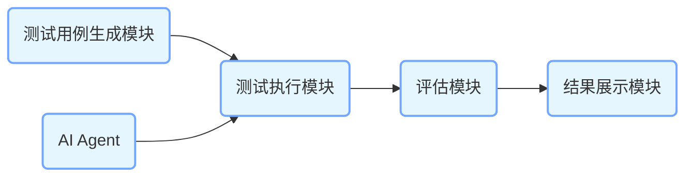

# 构建AI Agent的认知图灵测试系统

> 关键词：AI Agent、认知图灵测试系统、人工智能、图灵测试、认知能力评估

> 摘要：本文聚焦于构建AI Agent的认知图灵测试系统。首先介绍了该系统构建的背景信息，包括目的、预期读者等内容。接着详细阐述了核心概念及联系，通过文本示意图和Mermaid流程图清晰展示。深入讲解了核心算法原理并给出Python代码示例，同时介绍了相关数学模型和公式。通过项目实战，从开发环境搭建到源代码实现及解读进行了全面说明。探讨了系统的实际应用场景，推荐了学习资源、开发工具框架以及相关论文著作。最后总结了未来发展趋势与挑战，还给出了常见问题解答和扩展阅读参考资料，旨在为构建有效的AI Agent认知图灵测试系统提供全面的技术指导。

## 1. 背景介绍 
### 1.1 目的和范围
构建AI Agent的认知图灵测试系统的主要目的是评估AI Agent的认知能力，以判断其是否能像人类一样进行思考和交互。传统的图灵测试主要关注AI能否在对话中表现得像人类，而认知图灵测试系统则更侧重于评估AI Agent的认知能力，如理解复杂问题、推理、学习和适应新环境等。

本系统的范围涵盖了从测试框架的设计、测试用例的生成到测试结果的评估和分析。它可以应用于各种类型的AI Agent，包括聊天机器人、智能助手、自主决策系统等。

### 1.2 预期读者
本文的预期读者包括人工智能领域的研究人员、开发者、测试人员以及对AI Agent认知能力评估感兴趣的技术爱好者。研究人员可以从本文中获取关于认知图灵测试系统的理论和方法，开发者可以借鉴系统的设计和实现思路，测试人员可以利用该系统对AI Agent进行有效的测试，技术爱好者可以了解认知图灵测试的基本概念和应用。

### 1.3 文档结构概述
本文将按照以下结构进行阐述：首先介绍核心概念与联系，包括认知图灵测试系统的原理和架构；接着详细讲解核心算法原理和具体操作步骤，并给出Python源代码示例；然后介绍相关的数学模型和公式，并通过举例说明；之后进行项目实战，包括开发环境搭建、源代码实现和代码解读；再探讨系统的实际应用场景；推荐学习资源、开发工具框架和相关论文著作；最后总结未来发展趋势与挑战，给出常见问题解答和扩展阅读参考资料。

### 1.4 术语表
#### 1.4.1 核心术语定义
- **AI Agent**：人工智能代理，是一种能够感知环境、做出决策并采取行动的智能实体。
- **认知图灵测试**：一种评估AI Agent认知能力的测试方法，通过模拟人类的认知任务来判断AI Agent是否具有类似于人类的认知能力。
- **测试用例**：为了测试AI Agent的认知能力而设计的具体问题或任务。
- **测试框架**：用于组织和管理测试用例的软件架构。
- **测试结果评估**：对AI Agent在测试用例中的表现进行评价和分析的过程。

#### 1.4.2 相关概念解释
- **图灵测试**：由英国数学家艾伦·图灵在1950年提出的一种测试机器是否能够表现出与人类同等智能的方法。测试中，人类评估者与一个人类和一个机器进行对话，如果评估者无法分辨出哪个是人类，哪个是机器，则认为机器通过了图灵测试。
- **认知能力**：指人类或其他智能实体在感知、理解、学习、推理、决策等方面的能力。

#### 1.4.3 缩略词列表
- **AI**：Artificial Intelligence，人工智能
- **NLP**：Natural Language Processing，自然语言处理
- **ML**：Machine Learning，机器学习
- **DL**：Deep Learning，深度学习

## 2. 核心概念与联系 
### 核心概念原理
认知图灵测试系统的核心原理是通过设计一系列具有挑战性的测试用例，来评估AI Agent在不同认知任务上的表现。这些测试用例可以涵盖多个领域，如自然语言理解、逻辑推理、知识表示和学习等。系统会记录AI Agent对每个测试用例的响应，并根据预设的评估标准对其进行评分。

### 架构的文本示意图
认知图灵测试系统主要由以下几个部分组成：
1. **测试用例生成模块**：负责生成各种类型的测试用例，包括自然语言问题、逻辑推理题、知识问答等。
2. **测试执行模块**：将测试用例发送给AI Agent，并记录其响应。
3. **评估模块**：根据预设的评估标准对AI Agent的响应进行评分和分析。
4. **结果展示模块**：将测试结果以直观的方式展示给用户。

### Mermaid流程图


该流程图展示了认知图灵测试系统的主要工作流程。首先，测试用例生成模块生成测试用例，然后测试执行模块将测试用例发送给AI Agent并记录其响应，评估模块对响应进行评分和分析，最后结果展示模块将测试结果展示给用户。

## 3. 核心算法原理 & 具体操作步骤 
### 核心算法原理
认知图灵测试系统的核心算法主要涉及测试用例的生成、响应的评估和结果的分析。以下是一些关键算法的介绍：

#### 测试用例生成算法
测试用例生成算法的目标是生成具有多样性和挑战性的测试用例。可以采用以下方法：
- **规则-based方法**：根据预设的规则生成测试用例。例如，对于自然语言问题，可以根据语法规则和语义知识生成不同类型的问题。
- **数据驱动方法**：从大量的文本数据中挖掘出有价值的问题和任务，并将其作为测试用例。例如，可以使用机器学习算法从新闻文章、学术论文中提取问题。

#### 响应评估算法
响应评估算法用于评估AI Agent对测试用例的响应质量。可以采用以下方法：
- **基于规则的评估**：根据预设的规则对响应进行评估。例如，如果测试用例是一个数学问题，规则可以规定正确答案的格式和范围。
- **基于机器学习的评估**：使用机器学习模型对响应进行分类和评分。例如，可以训练一个分类器来判断响应是否正确。

### 具体操作步骤
以下是构建认知图灵测试系统的具体操作步骤：

#### 步骤1：确定测试领域和任务
首先，需要确定测试的领域和任务，例如自然语言处理、逻辑推理、知识问答等。不同的领域和任务需要设计不同的测试用例和评估标准。

#### 步骤2：生成测试用例
根据确定的测试领域和任务，使用测试用例生成算法生成测试用例。可以将测试用例存储在一个数据库或文件中。

#### 步骤3：实现测试执行模块
实现一个测试执行模块，将测试用例发送给AI Agent，并记录其响应。可以使用网络接口或API与AI Agent进行交互。

#### 步骤4：实现评估模块
根据预设的评估标准，实现一个评估模块，对AI Agent的响应进行评分和分析。可以将评估结果存储在一个数据库或文件中。

#### 步骤5：实现结果展示模块
实现一个结果展示模块，将测试结果以直观的方式展示给用户。可以使用Web界面或命令行界面进行展示。

### Python源代码示例
以下是一个简单的Python代码示例，用于演示认知图灵测试系统的基本功能：

```python
# 测试用例生成模块
def generate_test_cases():
    test_cases = [
        "What is the capital of France?",
        "If A > B and B > C, which is the largest: A, B, or C?",
        "How many planets are there in the solar system?"
    ]
    return test_cases

# 测试执行模块
def execute_tests(ai_agent, test_cases):
    responses = []
    for test_case in test_cases:
        response = ai_agent.answer(test_case)
        responses.append(response)
    return responses

# 评估模块
def evaluate_responses(test_cases, responses):
    correct_answers = {
        "What is the capital of France?": "Paris",
        "If A > B and B > C, which is the largest: A, B, or C?": "A",
        "How many planets are there in the solar system?": "8"
    }
    scores = []
    for i in range(len(test_cases)):
        test_case = test_cases[i]
        response = responses[i]
        if response == correct_answers[test_case]:
            scores.append(1)
        else:
            scores.append(0)
    return scores

# 结果展示模块
def display_results(test_cases, responses, scores):
    for i in range(len(test_cases)):
        test_case = test_cases[i]
        response = responses[i]
        score = scores[i]
        print(f"Test Case: {test_case}")
        print(f"Response: {response}")
        print(f"Score: {score}")
        print()

# 模拟AI Agent
class AI_Agent:
    def answer(self, question):
        if question == "What is the capital of France?":
            return "Paris"
        elif question == "If A > B and B > C, which is the largest: A, B, or C?":
            return "A"
        elif question == "How many planets are there in the solar system?":
            return "8"
        else:
            return "Unknown"

# 主程序
if __name__ == "__main__":
    test_cases = generate_test_cases()
    ai_agent = AI_Agent()
    responses = execute_tests(ai_agent, test_cases)
    scores = evaluate_responses(test_cases, responses)
    display_results(test_cases, responses, scores)
```

## 4. 数学模型和公式 & 详细讲解 & 举例说明 
### 数学模型和公式
#### 准确率（Accuracy）
准确率是评估AI Agent在测试用例中表现的常用指标，其计算公式为：
$$Accuracy = \frac{Number\ of\ correct\ responses}{Total\ number\ of\ test\ cases}$$

#### F1分数（F1 Score）
F1分数是综合考虑准确率和召回率的指标，其计算公式为：
$$F1 = 2 \times \frac{Precision \times Recall}{Precision + Recall}$$
其中，准确率（Precision）和召回率（Recall）的计算公式分别为：
$$Precision = \frac{True\ Positives}{True\ Positives + False\ Positives}$$
$$Recall = \frac{True\ Positives}{True\ Positives + False\ Negatives}$$

### 详细讲解
#### 准确率
准确率表示AI Agent在所有测试用例中正确回答的比例。例如，如果有10个测试用例，AI Agent正确回答了8个，则准确率为 $8/10 = 0.8$ 或 $80\%$。

#### F1分数
F1分数综合考虑了准确率和召回率，适用于处理不平衡数据集的情况。例如，在某些测试用例中，正例和反例的数量可能相差很大，此时仅使用准确率可能无法准确评估AI Agent的性能。F1分数可以在准确率和召回率之间取得平衡。

### 举例说明
假设我们有一个包含10个测试用例的数据集，其中有6个正例和4个反例。AI Agent的预测结果如下：
| 测试用例编号 | 实际标签 | 预测标签 |
| --- | --- | --- |
| 1 | 正例 | 正例 |
| 2 | 正例 | 正例 |
| 3 | 正例 | 正例 |
| 4 | 正例 | 反例 |
| 5 | 正例 | 正例 |
| 6 | 正例 | 反例 |
| 7 | 反例 | 反例 |
| 8 | 反例 | 反例 |
| 9 | 反例 | 正例 |
| 10 | 反例 | 反例 |

根据上述数据，我们可以计算出：
- 真阳性（True Positives）：4
- 假阳性（False Positives）：1
- 真阴性（True Negatives）：3
- 假阴性（False Negatives）：2

准确率为：
$$Accuracy = \frac{4 + 3}{10} = 0.7$$

准确率为：
$$Precision = \frac{4}{4 + 1} = 0.8$$

召回率为：
$$Recall = \frac{4}{4 + 2} = \frac{2}{3} \approx 0.67$$

F1分数为：
$$F1 = 2 \times \frac{0.8 \times 0.67}{0.8 + 0.67} \approx 0.73$$

## 5. 项目实战：代码实际案例和详细解释说明 
### 5.1  开发环境搭建
#### 操作系统
可以选择Windows、Linux或macOS作为开发操作系统。

#### 编程语言
使用Python作为开发语言，Python具有丰富的库和工具，适合开发认知图灵测试系统。

#### 库和框架
- **Flask**：用于构建Web应用程序，实现结果展示模块。
- **NLTK**：用于自然语言处理，辅助测试用例生成和响应评估。
- **Scikit-learn**：用于机器学习，实现基于机器学习的评估算法。

可以使用以下命令安装这些库：
```sh
pip install flask nltk scikit-learn
```

### 5.2  源代码详细实现和代码解读
#### 测试用例生成模块
```python
import random

def generate_test_cases():
    # 自然语言问题
    natural_language_questions = [
        "What is the meaning of 'serendipity'?",
        "Describe the process of photosynthesis.",
        "Who wrote the novel 'Pride and Prejudice'?"
    ]
    # 逻辑推理问题
    logic_questions = [
        "If all cats are mammals and some mammals are predators, are all cats predators?",
        "If A is twice as old as B and B is three years older than C, and C is 5 years old, how old is A?",
        "If the first day of a month is a Monday, what day of the week is the 15th day of the month?"
    ]
    # 知识问答问题
    knowledge_questions = [
        "What is the chemical formula for water?",
        "Which planet is known as the Red Planet?",
        "What is the capital city of Australia?"
    ]
    all_questions = natural_language_questions + logic_questions + knowledge_questions
    random.shuffle(all_questions)
    return all_questions[:5]  # 随机选择5个问题作为测试用例
```
代码解读：该函数生成了不同类型的测试用例，包括自然语言问题、逻辑推理问题和知识问答问题。然后将所有问题打乱顺序，并随机选择5个问题作为测试用例。

#### 测试执行模块
```python
class AI_Agent:
    def answer(self, question):
        # 简单的模拟回答，实际应用中需要调用真实的AI Agent
        if "serendipity" in question:
            return "The occurrence and development of events by chance in a happy or beneficial way."
        elif "photosynthesis" in question:
            return "Photosynthesis is the process by which green plants and some other organisms use sunlight to synthesize foods with the help of chlorophyll and convert carbon dioxide and water into glucose and oxygen."
        elif "Pride and Prejudice" in question:
            return "Jane Austen"
        elif "cats" in question:
            return "No"
        elif "A is twice as old as B" in question:
            return "16"
        elif "first day of a month is a Monday" in question:
            return "Monday"
        elif "chemical formula for water" in question:
            return "H2O"
        elif "Red Planet" in question:
            return "Mars"
        elif "capital city of Australia" in question:
            return "Canberra"
        else:
            return "Unknown"

def execute_tests(ai_agent, test_cases):
    responses = []
    for test_case in test_cases:
        response = ai_agent.answer(test_case)
        responses.append(response)
    return responses
```
代码解读：`AI_Agent`类模拟了一个AI Agent，根据问题的关键词返回相应的回答。`execute_tests`函数将测试用例发送给AI Agent，并记录其响应。

#### 评估模块
```python
from sklearn.metrics import accuracy_score

def evaluate_responses(test_cases, responses):
    correct_answers = {
        "What is the meaning of 'serendipity'?": "The occurrence and development of events by chance in a happy or beneficial way.",
        "Describe the process of photosynthesis.": "Photosynthesis is the process by which green plants and some other organisms use sunlight to synthesize foods with the help of chlorophyll and convert carbon dioxide and water into glucose and oxygen.",
        "Who wrote the novel 'Pride and Prejudice'?": "Jane Austen",
        "If all cats are mammals and some mammals are predators, are all cats predators?": "No",
        "If A is twice as old as B and B is three years older than C, and C is 5 years old, how old is A?": "16",
        "If the first day of a month is a Monday, what day of the week is the 15th day of the month?": "Monday",
        "What is the chemical formula for water?": "H2O",
        "Which planet is known as the Red Planet?": "Mars",
        "What is the capital city of Australia?": "Canberra"
    }
    true_labels = []
    predicted_labels = []
    for i in range(len(test_cases)):
        test_case = test_cases[i]
        response = responses[i]
        true_labels.append(correct_answers.get(test_case, "Unknown"))
        predicted_labels.append(response)
    accuracy = accuracy_score(true_labels, predicted_labels)
    return accuracy
```
代码解读：该函数根据预设的正确答案，将实际标签和预测标签存储在列表中，然后使用`scikit-learn`库的`accuracy_score`函数计算准确率。

#### 结果展示模块
```python
from flask import Flask, render_template_string

app = Flask(__name__)

@app.route('/')
def display_results():
    test_cases = generate_test_cases()
    ai_agent = AI_Agent()
    responses = execute_tests(ai_agent, test_cases)
    accuracy = evaluate_responses(test_cases, responses)
    html_template = """
    <html>
    <head>
        <title>AI Agent Cognitive Turing Test Results</title>
    </head>
    <body>
        <h1>AI Agent Cognitive Turing Test Results</h1>
        <h2>Accuracy: {{ accuracy }}</h2>
        <table border="1">
            <tr>
                <th>Test Case</th>
                <th>Response</th>
            </tr>
            
            <tr>
                <td>{{ test_cases[i] }}</td>
                <td>{{ responses[i] }}</td>
            </tr>
            
        </table>
    </body>
    </html>
    """
    return render_template_string(html_template, test_cases=test_cases, responses=responses, accuracy=accuracy)

if __name__ == "__main__":
    app.run(debug=True)
```
代码解读：该代码使用Flask框架构建了一个Web应用程序，将测试结果以HTML表格的形式展示给用户。用户可以通过访问`http://127.0.0.1:5000`查看测试结果。

### 5.3  代码解读与分析
通过上述代码，我们实现了一个简单的认知图灵测试系统。测试用例生成模块生成了不同类型的测试用例，测试执行模块将测试用例发送给AI Agent并记录其响应，评估模块计算了AI Agent的准确率，结果展示模块将测试结果以Web界面的形式展示给用户。

在实际应用中，需要将`AI_Agent`类替换为真实的AI Agent，例如调用OpenAI的GPT模型。同时，可以进一步优化测试用例生成算法和评估算法，以提高测试的准确性和可靠性。

## 6. 实际应用场景 
### 人工智能研究
在人工智能研究中，认知图灵测试系统可以用于评估新的AI算法和模型的认知能力。研究人员可以使用该系统对不同的AI Agent进行测试，比较它们的性能，从而选择最优的算法和模型。

### 智能助手开发
在智能助手开发过程中，认知图灵测试系统可以用于测试智能助手的理解能力和回答质量。开发人员可以使用该系统对智能助手进行反复测试，发现问题并进行改进，以提高智能助手的用户体验。

### 教育领域
在教育领域，认知图灵测试系统可以用于评估学生的认知能力。教师可以使用该系统设计测试用例，对学生的知识掌握情况和思维能力进行评估，为教学提供参考。

### 金融领域
在金融领域，认知图灵测试系统可以用于评估金融智能系统的风险评估能力和决策能力。金融机构可以使用该系统对金融智能系统进行测试，确保其在复杂的金融环境中能够做出准确的决策。

## 7. 工具和资源推荐
### 7.1 学习资源推荐
#### 7.1.1 书籍推荐
- 《人工智能：一种现代的方法》（Artificial Intelligence: A Modern Approach）：这是一本经典的人工智能教材，涵盖了人工智能的各个领域，包括知识表示、推理、机器学习、自然语言处理等。
- 《深度学习》（Deep Learning）：由Ian Goodfellow、Yoshua Bengio和Aaron Courville合著，是深度学习领域的权威书籍，介绍了深度学习的基本原理和应用。
- 《自然语言处理入门》（Natural Language Processing with Python）：使用Python语言介绍了自然语言处理的基本概念和方法，适合初学者学习。

#### 7.1.2 在线课程
- Coursera上的“人工智能基础”（Foundations of Artificial Intelligence）课程：由斯坦福大学教授Sebastian Thrun和Peter Norvig授课，介绍了人工智能的基本概念和算法。
- edX上的“深度学习专项课程”（Deep Learning Specialization）：由Andrew Ng教授授课，深入介绍了深度学习的原理和应用。
- 慕课网上的“自然语言处理实战”课程：结合实际项目，介绍了自然语言处理的常用技术和方法。

#### 7.1.3 技术博客和网站
- Medium上的Towards Data Science：这是一个专注于数据科学和人工智能的技术博客，提供了大量的高质量文章和教程。
- arXiv：一个预印本服务器，提供了最新的学术论文和研究成果，涵盖了人工智能的各个领域。
- AI Time：一个专注于人工智能领域的技术社区，提供了专家讲座、学术报告和技术文章等资源。

### 7.2 开发工具框架推荐
#### 7.2.1 IDE和编辑器
- PyCharm：一款专业的Python集成开发环境，提供了丰富的代码编辑、调试和版本控制功能。
- Visual Studio Code：一款轻量级的代码编辑器，支持多种编程语言，具有丰富的插件生态系统。
- Jupyter Notebook：一种交互式的编程环境，适合进行数据分析和模型训练。

#### 7.2.2 调试和性能分析工具
- pdb：Python自带的调试器，可以帮助开发者定位和解决代码中的问题。
- cProfile：Python的性能分析工具，可以分析代码的运行时间和内存使用情况。
- TensorBoard：TensorFlow的可视化工具，可以帮助开发者可视化模型的训练过程和性能指标。

#### 7.2.3 相关框架和库
- TensorFlow：一个开源的深度学习框架，提供了丰富的工具和库，用于构建和训练深度学习模型。
- PyTorch：另一个流行的深度学习框架，具有动态图和易于使用的特点。
- Hugging Face Transformers：一个用于自然语言处理的开源库，提供了预训练的模型和工具，方便开发者进行文本分类、问答系统等任务。

### 7.3 相关论文著作推荐
#### 7.3.1 经典论文
- Turing, A. M. (1950). Computing machinery and intelligence. Mind, 59(236), 433-460. 这是图灵提出图灵测试的经典论文。
- McCarthy, J., Minsky, M. L., Rochester, N., & Shannon, C. E. (1955). A proposal for the Dartmouth summer research project on artificial intelligence. 这是人工智能领域的奠基性论文，提出了人工智能的概念。

#### 7.3.2 最新研究成果
- Vaswani, A., Shazeer, N., Parmar, N., Uszkoreit, J., Jones, L., Gomez, A. N.,... & Polosukhin, I. (2017). Attention is all you need. Advances in neural information processing systems, 5998-6008. 这篇论文提出了Transformer模型，是自然语言处理领域的重要突破。
- Brown, T. B., Mann, B., Ryder, N., Subbiah, M., Kaplan, J. D., Dhariwal, P.,... & Amodei, D. (2020). Language models are few-shot learners. Advances in neural information processing systems, 1877-1901. 这篇论文介绍了GPT-3模型，展示了大语言模型在少样本学习方面的强大能力。

#### 7.3.3 应用案例分析
- Bubeck, S., Chandrasekaran, V., Eldan, R., Gehrke, J., Horvitz, E., Kamar, E.,... & Zhang, Y. (2023). Sparks of artificial general intelligence: Early experiments with GPT-4. arXiv preprint arXiv:2303.12712. 这篇论文对GPT-4进行了全面的测试和分析，展示了其在多个领域的应用能力。

## 8. 总结：未来发展趋势与挑战
### 未来发展趋势
#### 多模态测试
未来的认知图灵测试系统将不仅仅局限于文本输入和输出，还将支持图像、音频、视频等多模态的测试用例。这将更全面地评估AI Agent的认知能力，使其能够处理更复杂的现实场景。

#### 自适应测试
自适应测试将根据AI Agent的实时表现动态调整测试用例的难度和类型。如果AI Agent在某个领域表现出色，系统将提供更具挑战性的测试用例；如果表现不佳，系统将降低难度，以更准确地评估其能力边界。

#### 与人类智能的融合
未来的认知图灵测试系统将不仅仅关注AI Agent与人类的相似性，还将探索如何将AI Agent的优势与人类智能相结合，实现人机协同的智能系统。

### 挑战
#### 测试用例的设计
设计具有代表性和挑战性的测试用例是认知图灵测试系统面临的一大挑战。需要考虑到不同领域的知识和技能，以及各种可能的场景和情况，以确保测试结果的准确性和可靠性。

#### 评估标准的制定
制定合理的评估标准也是一个难题。不同的测试用例可能需要不同的评估方法，而且如何综合考虑多个评估指标也是一个需要解决的问题。

#### 计算资源的需求
随着AI Agent的能力不断提高，认知图灵测试系统的计算资源需求也将不断增加。如何在有限的计算资源下实现高效的测试是一个需要解决的问题。

## 9. 附录：常见问题与解答
### 问题1：认知图灵测试系统与传统图灵测试有什么区别？
传统图灵测试主要关注AI能否在对话中表现得像人类，而认知图灵测试系统更侧重于评估AI Agent的认知能力，如理解复杂问题、推理、学习和适应新环境等。

### 问题2：如何确保测试用例的公正性和客观性？
可以采用多种方法来确保测试用例的公正性和客观性。例如，使用大量的历史数据和专家知识来设计测试用例，避免测试用例存在偏见；对测试用例进行多次验证和审核，确保其准确性和合理性。

### 问题3：认知图灵测试系统可以应用于所有类型的AI Agent吗？
认知图灵测试系统可以应用于大多数类型的AI Agent，包括聊天机器人、智能助手、自主决策系统等。但对于一些特定领域的AI Agent，可能需要根据其特点和需求进行定制化的测试用例和评估标准。

### 问题4：如何提高AI Agent在认知图灵测试中的表现？
可以通过以下方法提高AI Agent在认知图灵测试中的表现：
- 增加训练数据：使用更多、更丰富的数据对AI Agent进行训练，提高其知识储备和理解能力。
- 优化算法模型：选择合适的算法和模型，并进行优化和调整，提高AI Agent的推理和决策能力。
- 引入外部知识：将外部知识源（如知识库、百科全书等）引入AI Agent，使其能够获取更全面的信息。

## 10. 扩展阅读 & 参考资料
- 李开复, 王咏刚. 《人工智能》. 文化发展出版社, 2017.
- Mitchell, T. M. 《机器学习》. 机械工业出版社, 2003.
- 周志华. 《机器学习》. 清华大学出版社, 2016.

作者：AI天才研究院/AI Genius Institute & 禅与计算机程序设计艺术 /Zen And The Art of Computer Programming