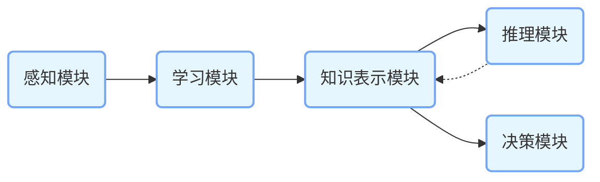

# 构建AI Agent的认知计算模型

> 关键词：AI Agent、认知计算模型、人工智能、知识表示、推理机制

> 摘要：本文围绕构建AI Agent的认知计算模型展开，深入探讨了其相关核心概念、算法原理、数学模型等内容。通过详细的步骤分析和Python代码示例，阐述了如何构建该模型。同时，介绍了项目实战的开发环境搭建、代码实现及解读，探讨了其实际应用场景。此外，还推荐了相关的学习资源、开发工具框架以及论文著作。最后对该领域的未来发展趋势与挑战进行了总结，并给出常见问题解答和扩展阅读参考资料，旨在为读者全面呈现构建AI Agent认知计算模型的理论与实践知识。

## 1. 背景介绍 
### 1.1 目的和范围
随着人工智能技术的不断发展，AI Agent在各个领域的应用越来越广泛。构建AI Agent的认知计算模型的目的在于让AI Agent能够模拟人类的认知过程，具备理解、学习、推理和决策等能力，从而更好地完成各种复杂任务。本文的范围涵盖了从认知计算模型的核心概念、算法原理、数学模型到项目实战等多个方面，旨在为读者提供一个全面的构建AI Agent认知计算模型的知识体系。

### 1.2 预期读者
本文预期读者包括对人工智能领域感兴趣的初学者、从事AI Agent开发的程序员、研究认知计算的科研人员以及相关专业的高校学生。无论你是想了解基本概念，还是希望深入研究技术细节，都能从本文中获得有价值的信息。

### 1.3 文档结构概述
本文首先介绍构建AI Agent认知计算模型的背景信息，包括目的、预期读者和文档结构。接着阐述核心概念与联系，通过文本示意图和Mermaid流程图进行说明。然后详细讲解核心算法原理和具体操作步骤，并给出Python源代码。之后介绍数学模型和公式，结合具体例子进行讲解。在项目实战部分，介绍开发环境搭建、源代码实现和代码解读。随后探讨实际应用场景，推荐相关工具和资源。最后总结未来发展趋势与挑战，给出常见问题解答和扩展阅读参考资料。

### 1.4 术语表
#### 1.4.1 核心术语定义
- **AI Agent**：能够感知环境、进行决策并采取行动以实现特定目标的智能实体。
- **认知计算模型**：模拟人类认知过程的计算模型，包括感知、学习、推理、决策等功能。
- **知识表示**：将知识以计算机能够处理的形式进行表示的方法。
- **推理机制**：根据已知知识推导出新的知识或结论的机制。

#### 1.4.2 相关概念解释
- **感知**：AI Agent通过传感器获取环境信息的过程。
- **学习**：AI Agent根据经验不断改进自身性能的过程。
- **决策**：AI Agent根据感知和学习的结果，选择合适的行动方案的过程。

#### 1.4.3 缩略词列表
- **AI**：Artificial Intelligence（人工智能）
- **ML**：Machine Learning（机器学习）
- **DL**：Deep Learning（深度学习）

## 2. 核心概念与联系 
### 核心概念原理
AI Agent的认知计算模型主要由感知模块、学习模块、知识表示模块、推理模块和决策模块组成。感知模块负责获取环境信息，学习模块根据感知到的信息进行学习和知识更新，知识表示模块将知识以合适的形式存储起来，推理模块根据已知知识进行推理，决策模块根据推理结果做出决策。

### 架构的文本示意图
```plaintext
+----------------+       +----------------+       +----------------+
|    感知模块    | ----> |    学习模块    | ----> |  知识表示模块  |
+----------------+       +----------------+       +----------------+
                               |                          |
                               v                          v
+----------------+       +----------------+       +----------------+
|    推理模块    | <---- |  知识表示模块  | ----> |    决策模块    |
+----------------+       +----------------+       +----------------+
```

### Mermaid流程图


## 3. 核心算法原理 & 具体操作步骤 
### 核心算法原理
在AI Agent的认知计算模型中，常用的算法包括机器学习算法和推理算法。机器学习算法用于学习环境中的模式和规律，推理算法用于根据已知知识进行推理。以下以简单的基于规则的推理算法为例进行说明。

### 具体操作步骤
1. **感知环境信息**：AI Agent通过传感器获取环境信息，如温度、湿度、光照等。
2. **学习环境模式**：使用机器学习算法对感知到的信息进行学习，例如使用决策树算法对数据进行分类。
3. **知识表示**：将学习到的知识以规则的形式表示出来，例如“如果温度高于30度，则开启空调”。
4. **推理过程**：根据当前环境信息和知识表示中的规则进行推理，判断是否需要采取行动。
5. **决策与行动**：根据推理结果做出决策，并采取相应的行动，如开启或关闭设备。

### Python源代码实现
```python
# 定义规则类
class Rule:
    def __init__(self, condition, action):
        self.condition = condition
        self.action = action

    def evaluate(self, state):
        return eval(self.condition, state)

# 定义AI Agent类
class AIAgent:
    def __init__(self):
        self.rules = []
        self.state = {}

    def add_rule(self, rule):
        self.rules.append(rule)

    def update_state(self, new_state):
        self.state.update(new_state)

    def reason(self):
        for rule in self.rules:
            if rule.evaluate(self.state):
                return rule.action
        return None

# 示例使用
agent = AIAgent()
# 添加规则
rule = Rule("state['temperature'] > 30", "Turn on the air conditioner")
agent.add_rule(rule)
# 更新状态
agent.update_state({"temperature": 32})
# 进行推理
action = agent.reason()
print("The agent decides to:", action)
```

## 4. 数学模型和公式 & 详细讲解 & 举例说明 
### 数学模型
在AI Agent的认知计算模型中，机器学习算法常常基于概率模型。例如，朴素贝叶斯分类器基于贝叶斯定理，其数学模型可以表示为：

$$P(C|X) = \frac{P(X|C)P(C)}{P(X)}$$

其中，$P(C|X)$ 是在给定特征 $X$ 的情况下类别 $C$ 的后验概率，$P(X|C)$ 是在类别 $C$ 下特征 $X$ 的似然概率，$P(C)$ 是类别 $C$ 的先验概率，$P(X)$ 是特征 $X$ 的边缘概率。

### 详细讲解
贝叶斯定理的核心思想是通过先验概率和似然概率来计算后验概率。在分类问题中，我们的目标是根据特征 $X$ 来预测类别 $C$，即计算 $P(C|X)$。由于 $P(X)$ 对于所有类别都是相同的，因此在实际计算中可以忽略，只需要比较不同类别下的 $P(X|C)P(C)$ 的大小。

### 举例说明
假设我们有一个简单的天气分类问题，有两个类别：晴天和雨天，特征是温度和湿度。我们已经收集了一些数据，并计算出了先验概率和似然概率。现在，给定一个新的温度和湿度值，我们可以使用朴素贝叶斯分类器来预测天气类别。

```python
import numpy as np

# 先验概率
P_晴天 = 0.7
P_雨天 = 0.3

# 似然概率
# 假设温度和湿度是独立的
# 晴天时温度和湿度的似然概率
P_温度_晴天 = {20: 0.2, 25: 0.5, 30: 0.3}
P_湿度_晴天 = {40: 0.3, 50: 0.5, 60: 0.2}
# 雨天时温度和湿度的似然概率
P_温度_雨天 = {20: 0.5, 25: 0.3, 30: 0.2}
P_湿度_雨天 = {40: 0.1, 50: 0.3, 60: 0.6}

# 新的观测值
温度 = 25
湿度 = 50

# 计算晴天的后验概率（忽略分母 P(X)）
P_晴天_观测值 = P_温度_晴天[温度] * P_湿度_晴天[湿度] * P_晴天
# 计算雨天的后验概率（忽略分母 P(X)）
P_雨天_观测值 = P_温度_雨天[温度] * P_湿度_雨天[湿度] * P_雨天

# 比较后验概率
if P_晴天_观测值 > P_雨天_观测值:
    print("预测为晴天")
else:
    print("预测为雨天")
```

## 5. 项目实战：代码实际案例和详细解释说明 
### 5.1  开发环境搭建
- **操作系统**：推荐使用Linux或Windows操作系统。
- **编程语言**：Python 3.x
- **开发工具**：推荐使用PyCharm或Jupyter Notebook。
- **依赖库**：安装`numpy`、`pandas`、`scikit-learn`等常用库。可以使用以下命令进行安装：
```sh
pip install numpy pandas scikit-learn
```

### 5.2  源代码详细实现和代码解读
以下是一个简单的AI Agent认知计算模型的项目实战代码，该模型用于预测鸢尾花的类别。

```python
import numpy as np
from sklearn.datasets import load_iris
from sklearn.model_selection import train_test_split
from sklearn.tree import DecisionTreeClassifier
from sklearn.metrics import accuracy_score

# 加载鸢尾花数据集
iris = load_iris()
X = iris.data
y = iris.target

# 划分训练集和测试集
X_train, X_test, y_train, y_test = train_test_split(X, y, test_size=0.2, random_state=42)

# 定义AI Agent类
class AIAgent:
    def __init__(self):
        self.model = DecisionTreeClassifier()

    def train(self, X, y):
        self.model.fit(X, y)

    def predict(self, X):
        return self.model.predict(X)

# 创建AI Agent实例
agent = AIAgent()

# 训练AI Agent
agent.train(X_train, y_train)

# 进行预测
y_pred = agent.predict(X_test)

# 计算准确率
accuracy = accuracy_score(y_test, y_pred)
print("预测准确率:", accuracy)
```

### 代码解读与分析
1. **数据加载**：使用`sklearn.datasets.load_iris`函数加载鸢尾花数据集，将特征数据存储在`X`中，标签数据存储在`y`中。
2. **数据划分**：使用`train_test_split`函数将数据集划分为训练集和测试集，测试集占比为20%。
3. **AI Agent类定义**：定义了一个`AIAgent`类，其中`__init__`方法初始化一个决策树分类器，`train`方法用于训练模型，`predict`方法用于进行预测。
4. **模型训练**：创建`AIAgent`实例，并调用`train`方法对模型进行训练。
5. **模型预测**：调用`predict`方法对测试集进行预测，并将预测结果存储在`y_pred`中。
6. **准确率计算**：使用`accuracy_score`函数计算预测准确率，并将结果打印输出。

## 6. 实际应用场景 
### 智能家居
在智能家居系统中，AI Agent可以通过感知环境信息，如温度、湿度、光照等，学习用户的习惯和偏好，根据这些信息进行推理和决策，自动调节家电设备的运行状态，提供更加舒适和便捷的居住环境。

### 智能医疗
在智能医疗领域，AI Agent可以分析患者的病历、检查报告等信息，辅助医生进行疾病诊断和治疗方案制定。同时，还可以实时监测患者的生命体征，及时发出预警。

### 自动驾驶
在自动驾驶系统中，AI Agent通过传感器感知周围环境，学习交通规则和驾驶经验，进行实时推理和决策，控制车辆的行驶方向、速度等，确保行车安全。

### 智能客服
智能客服系统中的AI Agent可以理解用户的问题，根据知识库中的知识进行推理和回答，提供高效的客户服务。

## 7. 工具和资源推荐
### 7.1 学习资源推荐
#### 7.1.1 书籍推荐
- 《人工智能：一种现代的方法》：全面介绍了人工智能的各个领域，包括搜索算法、知识表示、推理、机器学习等。
- 《机器学习》（周志华）：系统地介绍了机器学习的基本概念、算法和应用，是机器学习领域的经典教材。
- 《深度学习》（Ian Goodfellow等）：详细讲解了深度学习的原理、算法和应用，适合深入学习深度学习的读者。

#### 7.1.2 在线课程
- Coursera上的“人工智能基础”课程：由知名教授授课，内容涵盖人工智能的基本概念和算法。
- edX上的“机器学习”课程：提供了丰富的视频教程和实践项目，帮助学习者掌握机器学习的核心知识。
- 中国大学MOOC上的“人工智能导论”课程：国内高校开设的优质课程，适合初学者入门。

#### 7.1.3 技术博客和网站
- Medium：有很多人工智能领域的专业博主分享最新的技术文章和研究成果。
- arXiv：提供了大量的学术论文，涵盖了人工智能的各个领域。
- 机器之心：专注于人工智能领域的资讯和技术分析，提供了很多有价值的文章和报告。

### 7.2 开发工具框架推荐
#### 7.2.1 IDE和编辑器
- PyCharm：功能强大的Python集成开发环境，提供了代码编辑、调试、版本控制等功能。
- Jupyter Notebook：交互式的编程环境，适合进行数据分析和模型开发。
- Visual Studio Code：轻量级的代码编辑器，支持多种编程语言，有丰富的插件扩展。

#### 7.2.2 调试和性能分析工具
- Py-Spy：用于分析Python程序的性能，找出性能瓶颈。
- PDB：Python自带的调试工具，可以帮助开发者定位和解决代码中的问题。
- TensorBoard：用于可视化深度学习模型的训练过程和性能指标。

#### 7.2.3 相关框架和库
- TensorFlow：开源的深度学习框架，提供了丰富的工具和接口，方便开发者构建和训练深度学习模型。
- PyTorch：另一个流行的深度学习框架，具有动态图的特点，易于使用和调试。
- Scikit-learn：用于机器学习的Python库，提供了各种机器学习算法和工具，如分类、回归、聚类等。

### 7.3 相关论文著作推荐
#### 7.3.1 经典论文
- “A Logical Calculus of the Ideas Immanent in Nervous Activity”（Warren McCulloch和Walter Pitts）：提出了神经元模型，为神经网络的发展奠定了基础。
- “Learning Representations by Back-propagating Errors”（David Rumelhart等）：介绍了反向传播算法，推动了神经网络的广泛应用。
- “ImageNet Classification with Deep Convolutional Neural Networks”（Alex Krizhevsky等）：提出了AlexNet模型，开启了深度学习在计算机视觉领域的热潮。

#### 7.3.2 最新研究成果
可以关注顶级学术会议如NeurIPS、ICML、CVPR等的论文，这些会议收录了人工智能领域的最新研究成果。

#### 7.3.3 应用案例分析
可以参考一些实际应用案例的研究报告，了解AI Agent在不同领域的应用情况和效果。例如，一些大型科技公司发布的关于智能家居、自动驾驶等方面的技术报告。

## 8. 总结：未来发展趋势与挑战
### 未来发展趋势
- **多模态融合**：未来的AI Agent将融合多种感知方式，如视觉、听觉、触觉等，实现更加全面和准确的环境感知。
- **知识图谱与推理能力的增强**：通过构建更加复杂和完善的知识图谱，提高AI Agent的推理能力，使其能够处理更加复杂的问题。
- **与人类的深度协作**：AI Agent将与人类进行更加紧密和深度的协作，共同完成各种任务，如医疗诊断、科学研究等。
- **自主学习与进化**：AI Agent将具备更强的自主学习能力，能够在不断的实践中自我进化和提高性能。

### 挑战
- **数据隐私与安全**：随着AI Agent处理的数据量越来越大，数据隐私和安全问题变得更加突出，需要采取有效的措施来保护用户的数据。
- **可解释性与可信赖性**：AI Agent的决策过程往往是黑盒的，缺乏可解释性和可信赖性，这在一些关键领域如医疗、金融等是一个重要的挑战。
- **计算资源需求**：构建复杂的认知计算模型需要大量的计算资源，如何降低计算成本和提高计算效率是一个亟待解决的问题。
- **伦理和法律问题**：AI Agent的广泛应用带来了一系列伦理和法律问题，如责任界定、算法歧视等，需要制定相应的法律法规和伦理准则。

## 9. 附录：常见问题与解答
### 问题1：AI Agent和传统程序有什么区别？
解答：传统程序是按照预先编写的指令执行特定任务，缺乏灵活性和适应性。而AI Agent能够感知环境、学习和适应变化，根据不同的情况做出决策，具有更强的智能性和自主性。

### 问题2：构建AI Agent的认知计算模型需要哪些技能？
解答：需要掌握人工智能的基本概念和算法，如机器学习、深度学习等；熟悉编程语言，如Python；了解知识表示和推理的方法；具备一定的数据分析和处理能力。

### 问题3：如何评估AI Agent的性能？
解答：可以根据具体的应用场景选择合适的评估指标，如准确率、召回率、F1值等。同时，还可以通过实际测试和用户反馈来评估AI Agent的性能。

### 问题4：AI Agent的认知计算模型可以应用于所有领域吗？
解答：虽然AI Agent的认知计算模型具有广泛的应用前景，但并不是所有领域都适合。一些对安全性和可靠性要求极高的领域，如航空航天、核能等，需要更加严格的验证和测试。

## 10. 扩展阅读 & 参考资料
- 《智能系统原理与设计》
- 《认知计算：人工智能的下一个前沿》
- 相关的学术期刊如《Artificial Intelligence》、《Journal of Artificial Intelligence Research》等。

作者：AI天才研究院/AI Genius Institute & 禅与计算机程序设计艺术 /Zen And The Art of Computer Programming