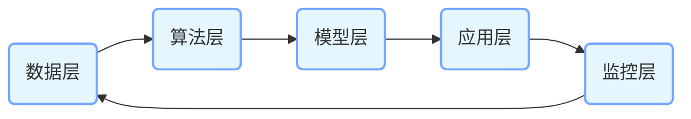

# 构建AI工作流程优化系统：提升企业运营效率

> 关键词：AI工作流程优化系统、企业运营效率、流程自动化、数据分析、机器学习

> 摘要：本文聚焦于构建AI工作流程优化系统以提升企业运营效率这一核心主题。首先介绍了该系统构建的背景信息，包括目的、预期读者等内容。接着阐述了核心概念及其联系，详细讲解了核心算法原理与具体操作步骤，结合数学模型和公式进行深入分析，并通过实际案例展示了系统的开发与应用。还探讨了该系统的实际应用场景，推荐了相关的工具和资源。最后对未来发展趋势与挑战进行总结，同时提供常见问题解答和扩展阅读参考资料，旨在为企业构建和应用AI工作流程优化系统提供全面且深入的指导。

## 1. 背景介绍 
### 1.1 目的和范围
在当今竞争激烈的商业环境中，企业面临着提高运营效率、降低成本、增强竞争力的巨大压力。AI工作流程优化系统旨在利用人工智能技术，对企业现有的工作流程进行全面分析、建模、优化和自动化，从而实现业务流程的高效运行，减少人为错误，提高生产力和客户满意度。

本系统的范围涵盖了企业各个部门的工作流程，包括但不限于人力资源管理、财务管理、市场营销、供应链管理等。通过整合各种数据源，运用机器学习、自然语言处理等技术，系统能够识别流程中的瓶颈和优化点，并提供智能化的解决方案。

### 1.2 预期读者
本文的预期读者主要包括企业的高层管理人员、业务流程分析师、IT技术人员以及对AI在企业应用感兴趣的专业人士。高层管理人员可以通过本文了解AI工作流程优化系统对企业战略和运营的影响；业务流程分析师可以学习如何运用AI技术进行流程分析和优化；IT技术人员可以获取系统开发和实施的相关技术细节；而对AI在企业应用感兴趣的专业人士则可以从中了解到AI技术在企业工作流程中的具体应用场景和价值。

### 1.3 文档结构概述
本文将按照以下结构进行阐述：首先介绍核心概念与联系，帮助读者理解AI工作流程优化系统的基本原理和架构；接着详细讲解核心算法原理和具体操作步骤，包括使用Python代码进行示例；然后介绍相关的数学模型和公式，并通过具体例子进行说明；之后通过项目实战展示系统的开发过程和代码实现；再探讨系统的实际应用场景；随后推荐相关的工具和资源；最后对未来发展趋势与挑战进行总结，并提供常见问题解答和扩展阅读参考资料。

### 1.4 术语表
#### 1.4.1 核心术语定义
- **AI工作流程优化系统**：利用人工智能技术对企业工作流程进行分析、优化和自动化的系统。
- **工作流程**：企业为实现特定业务目标而进行的一系列有序活动。
- **机器学习**：让计算机通过数据学习模式和规律，从而做出预测和决策的技术。
- **自然语言处理**：使计算机能够理解、处理和生成人类语言的技术。
- **流程自动化**：使用软件工具自动执行工作流程中的任务，减少人工干预。

#### 1.4.2 相关概念解释
- **数据挖掘**：从大量数据中发现有价值信息和知识的过程，是机器学习和数据分析的重要基础。
- **智能决策**：利用人工智能技术，根据数据分析结果为企业提供决策建议。
- **业务规则引擎**：用于定义、管理和执行企业业务规则的软件系统，可实现工作流程的自动化控制。

#### 1.4.3 缩略词列表
- **AI**：Artificial Intelligence（人工智能）
- **ML**：Machine Learning（机器学习）
- **NLP**：Natural Language Processing（自然语言处理）
- **RPA**：Robotic Process Automation（机器人流程自动化）

## 2. 核心概念与联系 

### 核心概念原理
AI工作流程优化系统的核心原理是通过收集和分析企业工作流程中的数据，利用机器学习和自然语言处理等技术，识别流程中的模式、瓶颈和优化点，然后通过流程自动化和智能决策来改进工作流程。

系统首先会对企业的工作流程进行建模，将流程中的各个环节和任务进行数字化表示。然后，通过数据采集和整合，获取流程执行过程中的相关数据，如任务完成时间、资源消耗、错误率等。接着，运用机器学习算法对这些数据进行分析，发现流程中的潜在问题和优化机会。例如，通过聚类分析可以将相似的任务分组，以便进行统一的优化；通过关联规则挖掘可以发现任务之间的关联关系，优化任务的执行顺序。

自然语言处理技术则可以用于处理和分析文本数据，如文档、邮件、聊天记录等。例如，通过文本分类可以将不同类型的文档进行分类，以便快速检索和处理；通过情感分析可以了解客户对企业产品或服务的满意度。

最后，系统会根据分析结果生成优化方案，并通过流程自动化工具将优化后的流程进行自动化执行。同时，系统还会实时监测流程的执行情况，不断进行反馈和调整，以确保流程始终处于最优状态。

### 架构的文本示意图
一个典型的AI工作流程优化系统架构可以分为以下几个层次：
1. **数据层**：负责收集、存储和管理企业工作流程中的各种数据，包括结构化数据（如数据库中的数据）和非结构化数据（如文档、图片等）。
2. **算法层**：运用机器学习、自然语言处理等算法对数据进行分析和挖掘，发现流程中的模式和优化点。
3. **模型层**：根据算法层的分析结果，建立工作流程的模型和优化方案。
4. **应用层**：将优化后的工作流程通过流程自动化工具进行实现，并提供用户界面供用户进行操作和管理。
5. **监控层**：实时监测工作流程的执行情况，收集反馈数据，并根据反馈对模型和流程进行调整和优化。

### Mermaid流程图


## 3. 核心算法原理 & 具体操作步骤 

### 核心算法原理
#### 聚类分析
聚类分析是将数据对象分组成为多个类或簇的过程，使得同一簇中的对象具有较高的相似度，而不同簇中的对象具有较大的差异。在AI工作流程优化系统中，聚类分析可以用于将相似的任务或流程环节进行分组，以便进行统一的优化。

常用的聚类算法有K-Means算法。K-Means算法的基本思想是：首先随机选择K个数据点作为初始聚类中心，然后将每个数据点分配到距离其最近的聚类中心所在的簇中，接着重新计算每个簇的聚类中心，重复这个过程直到聚类中心不再发生变化或达到最大迭代次数。

#### 关联规则挖掘
关联规则挖掘是发现数据集中不同项目之间的关联关系的过程。在工作流程优化中，关联规则挖掘可以用于发现任务之间的关联关系，例如哪些任务经常一起执行，从而优化任务的执行顺序。

Apriori算法是一种经典的关联规则挖掘算法。它的基本思想是通过逐层搜索的方式，先找出所有频繁1项集，然后利用频繁1项集生成频繁2项集，以此类推，直到无法生成更大的频繁项集为止。最后，根据频繁项集生成关联规则。

### 具体操作步骤
#### 数据预处理
在进行聚类分析和关联规则挖掘之前，需要对数据进行预处理，包括数据清洗、数据集成、数据变换等步骤。以下是一个使用Python进行数据清洗的示例代码：
```python
import pandas as pd

# 读取数据
data = pd.read_csv('workflow_data.csv')

# 处理缺失值
data = data.dropna()

# 去除重复值
data = data.drop_duplicates()

# 保存处理后的数据
data.to_csv('cleaned_workflow_data.csv', index=False)
```

#### 聚类分析
以下是一个使用K-Means算法进行聚类分析的示例代码：
```python
from sklearn.cluster import KMeans
import pandas as pd

# 读取清洗后的数据
data = pd.read_csv('cleaned_workflow_data.csv')

# 选择需要进行聚类的特征
X = data[['feature1', 'feature2']]

# 创建K-Means模型
kmeans = KMeans(n_clusters=3, random_state=42)

# 训练模型
kmeans.fit(X)

# 获取聚类结果
labels = kmeans.labels_

# 将聚类结果添加到原始数据中
data['cluster'] = labels

# 保存结果
data.to_csv('clustered_workflow_data.csv', index=False)
```

#### 关联规则挖掘
以下是一个使用Apriori算法进行关联规则挖掘的示例代码：
```python
from mlxtend.frequent_patterns import apriori, association_rules
import pandas as pd

# 读取清洗后的数据
data = pd.read_csv('cleaned_workflow_data.csv')

# 对数据进行编码
encoded_data = pd.get_dummies(data[['task1', 'task2', 'task3']])

# 挖掘频繁项集
frequent_itemsets = apriori(encoded_data, min_support=0.1, use_colnames=True)

# 生成关联规则
rules = association_rules(frequent_itemsets, metric="confidence", min_threshold=0.7)

# 保存结果
rules.to_csv('association_rules.csv', index=False)
```

## 4. 数学模型和公式 & 详细讲解 & 举例说明 

### 聚类分析 - K-Means算法
#### 数学模型和公式
K-Means算法的目标是最小化所有数据点到其所属聚类中心的距离之和，即：
$$
J = \sum_{i=1}^{n} \sum_{j=1}^{k} w_{ij} \left \| x_i - \mu_j \right \|^2
$$
其中，$n$ 是数据点的数量，$k$ 是聚类的数量，$x_i$ 是第 $i$ 个数据点，$\mu_j$ 是第 $j$ 个聚类中心，$w_{ij}$ 是一个指示变量，如果 $x_i$ 属于第 $j$ 个簇，则 $w_{ij} = 1$，否则 $w_{ij} = 0$。

#### 详细讲解
K-Means算法通过迭代的方式来求解上述目标函数。具体步骤如下：
1. 随机初始化 $k$ 个聚类中心 $\mu_1, \mu_2, \cdots, \mu_k$。
2. 对于每个数据点 $x_i$，计算其到每个聚类中心的距离 $\left \| x_i - \mu_j \right \|^2$，并将其分配到距离最近的聚类中心所在的簇中。
3. 重新计算每个簇的聚类中心 $\mu_j$，即该簇中所有数据点的平均值：
$$
\mu_j = \frac{\sum_{i=1}^{n} w_{ij} x_i}{\sum_{i=1}^{n} w_{ij}}
$$
4. 重复步骤2和3，直到聚类中心不再发生变化或达到最大迭代次数。

#### 举例说明
假设我们有以下数据集：
$$
X = \begin{bmatrix}
1 & 2 \\
2 & 3 \\
8 & 7 \\
9 & 8
\end{bmatrix}
$$
我们希望将这些数据点分为2个簇。首先，随机初始化2个聚类中心：
$$
\mu_1 = \begin{bmatrix}
1 \\
2
\end{bmatrix}, \mu_2 = \begin{bmatrix}
8 \\
7
\end{bmatrix}
$$
然后，计算每个数据点到聚类中心的距离，并将其分配到距离最近的聚类中心所在的簇中。例如，对于第一个数据点 $x_1 = \begin{bmatrix}
1 \\
2
\end{bmatrix}$，其到 $\mu_1$ 的距离为：
$$
\left \| x_1 - \mu_1 \right \|^2 = \left \| \begin{bmatrix}
1 \\
2
\end{bmatrix} - \begin{bmatrix}
1 \\
2
\end{bmatrix} \right \|^2 = 0
$$
其到 $\mu_2$ 的距离为：
$$
\left \| x_1 - \mu_2 \right \|^2 = \left \| \begin{bmatrix}
1 \\
2
\end{bmatrix} - \begin{bmatrix}
8 \\
7
\end{bmatrix} \right \|^2 = 7^2 + 5^2 = 74
$$
因为 $0 < 74$，所以 $x_1$ 属于第一个簇。

接着，重新计算每个簇的聚类中心。假设第一个簇包含 $x_1$ 和 $x_2$，第二个簇包含 $x_3$ 和 $x_4$，则新的聚类中心为：
$$
\mu_1 = \frac{\begin{bmatrix}
1 \\
2
\end{bmatrix} + \begin{bmatrix}
2 \\
3
\end{bmatrix}}{2} = \begin{bmatrix}
1.5 \\
2.5
\end{bmatrix}
$$
$$
\mu_2 = \frac{\begin{bmatrix}
8 \\
7
\end{bmatrix} + \begin{bmatrix}
9 \\
8
\end{bmatrix}}{2} = \begin{bmatrix}
8.5 \\
7.5
\end{bmatrix}
$$
重复上述步骤，直到聚类中心不再发生变化。

### 关联规则挖掘 - Apriori算法
#### 数学模型和公式
关联规则是形如 $X \Rightarrow Y$ 的表达式，其中 $X$ 和 $Y$ 是项集，且 $X \cap Y = \varnothing$。关联规则的支持度和置信度是衡量其重要性的两个指标。

支持度表示项集 $X$ 和 $Y$ 同时出现的频率，计算公式为：
$$
\text{Support}(X \Rightarrow Y) = \frac{\text{Count}(X \cup Y)}{N}
$$
其中，$\text{Count}(X \cup Y)$ 是项集 $X$ 和 $Y$ 同时出现的次数，$N$ 是数据集的总记录数。

置信度表示在项集 $X$ 出现的情况下，项集 $Y$ 出现的概率，计算公式为：
$$
\text{Confidence}(X \Rightarrow Y) = \frac{\text{Support}(X \cup Y)}{\text{Support}(X)}
$$

#### 详细讲解
Apriori算法的核心思想是通过逐层搜索的方式，先找出所有频繁1项集，然后利用频繁1项集生成频繁2项集，以此类推，直到无法生成更大的频繁项集为止。具体步骤如下：
1. 扫描数据集，计算每个项的支持度，找出所有支持度大于等于最小支持度阈值的项，形成频繁1项集。
2. 利用频繁 $k$ 项集生成候选 $k+1$ 项集。
3. 扫描数据集，计算候选 $k+1$ 项集的支持度，找出所有支持度大于等于最小支持度阈值的候选 $k+1$ 项集，形成频繁 $k+1$ 项集。
4. 重复步骤2和3，直到无法生成更大的频繁项集为止。
5. 根据频繁项集生成关联规则，筛选出置信度大于等于最小置信度阈值的关联规则。

#### 举例说明
假设我们有以下交易数据集：
| 交易ID | 项集 |
| ---- | ---- |
| 1 | {A, B, C} |
| 2 | {A, B} |
| 3 | {B, C} |
| 4 | {A, C} |
| 5 | {A, B, C} |

我们希望找出支持度大于等于0.4，置信度大于等于0.6的关联规则。

首先，扫描数据集，计算每个项的支持度：
- $\text{Support}(A) = \frac{4}{5} = 0.8$
- $\text{Support}(B) = \frac{4}{5} = 0.8$
- $\text{Support}(C) = \frac{3}{5} = 0.6$

因为所有项的支持度都大于等于0.4，所以频繁1项集为 $\{A, B, C\}$。

然后，利用频繁1项集生成候选2项集：$\{A, B\}, \{A, C\}, \{B, C\}$。

接着，扫描数据集，计算候选2项集的支持度：
- $\text{Support}(A, B) = \frac{3}{5} = 0.6$
- $\text{Support}(A, C) = \frac{2}{5} = 0.4$
- $\text{Support}(B, C) = \frac{3}{5} = 0.6$

因为所有候选2项集的支持度都大于等于0.4，所以频繁2项集为 $\{A, B\}, \{A, C\}, \{B, C\}$。

再利用频繁2项集生成候选3项集：$\{A, B, C\}$。

扫描数据集，计算候选3项集的支持度：
- $\text{Support}(A, B, C) = \frac{2}{5} = 0.4$

因为候选3项集的支持度大于等于0.4，所以频繁3项集为 $\{A, B, C\}$。

最后，根据频繁项集生成关联规则，并计算其置信度：
- $A \Rightarrow B$：$\text{Confidence}(A \Rightarrow B) = \frac{\text{Support}(A, B)}{\text{Support}(A)} = \frac{0.6}{0.8} = 0.75$
- $A \Rightarrow C$：$\text{Confidence}(A \Rightarrow C) = \frac{\text{Support}(A, C)}{\text{Support}(A)} = \frac{0.4}{0.8} = 0.5$
- $B \Rightarrow A$：$\text{Confidence}(B \Rightarrow A) = \frac{\text{Support}(A, B)}{\text{Support}(B)} = \frac{0.6}{0.8} = 0.75$
- $B \Rightarrow C$：$\text{Confidence}(B \Rightarrow C) = \frac{\text{Support}(B, C)}{\text{Support}(B)} = \frac{0.6}{0.8} = 0.75$
- $C \Rightarrow A$：$\text{Confidence}(C \Rightarrow A) = \frac{\text{Support}(A, C)}{\text{Support}(C)} = \frac{0.4}{0.6} \approx 0.67$
- $C \Rightarrow B$：$\text{Confidence}(C \Rightarrow B) = \frac{\text{Support}(B, C)}{\text{Support}(C)} = \frac{0.6}{0.6} = 1$

筛选出置信度大于等于0.6的关联规则：$A \Rightarrow B$，$B \Rightarrow A$，$B \Rightarrow C$，$C \Rightarrow A$，$C \Rightarrow B$。

## 5. 项目实战：代码实际案例和详细解释说明 

### 5.1  开发环境搭建
#### 操作系统
可以选择Windows、Linux或macOS操作系统，建议使用Linux系统，因为它在开发和部署方面具有更好的稳定性和兼容性。

#### 编程语言和工具
- **Python**：作为主要的编程语言，它具有丰富的机器学习和数据分析库。
- **Anaconda**：一个Python发行版，包含了许多常用的科学计算库和工具，方便进行环境管理和开发。
- **Jupyter Notebook**：一个交互式的开发环境，适合进行数据探索、模型开发和实验。

#### 安装步骤
1. 下载并安装Anaconda：根据自己的操作系统选择合适的Anaconda版本进行下载和安装。
2. 创建虚拟环境：打开Anaconda Prompt（Windows）或终端（Linux/macOS），执行以下命令创建一个新的虚拟环境：
```bash
conda create -n workflow_optimization python=3.8
```
3. 激活虚拟环境：
```bash
conda activate workflow_optimization
```
4. 安装必要的库：在激活的虚拟环境中，执行以下命令安装必要的库：
```bash
pip install pandas scikit-learn mlxtend
```

### 5.2  源代码详细实现和代码解读
#### 数据加载和预处理
```python
import pandas as pd

# 读取数据
data = pd.read_csv('workflow_data.csv')

# 处理缺失值
data = data.dropna()

# 去除重复值
data = data.drop_duplicates()

# 保存处理后的数据
data.to_csv('cleaned_workflow_data.csv', index=False)
```
代码解读：
- `pd.read_csv('workflow_data.csv')`：使用Pandas库的`read_csv`函数读取CSV文件中的数据。
- `data.dropna()`：删除包含缺失值的行。
- `data.drop_duplicates()`：删除重复的行。
- `data.to_csv('cleaned_workflow_data.csv', index=False)`：将处理后的数据保存到新的CSV文件中，`index=False`表示不保存行索引。

#### 聚类分析
```python
from sklearn.cluster import KMeans
import pandas as pd

# 读取清洗后的数据
data = pd.read_csv('cleaned_workflow_data.csv')

# 选择需要进行聚类的特征
X = data[['feature1', 'feature2']]

# 创建K-Means模型
kmeans = KMeans(n_clusters=3, random_state=42)

# 训练模型
kmeans.fit(X)

# 获取聚类结果
labels = kmeans.labels_

# 将聚类结果添加到原始数据中
data['cluster'] = labels

# 保存结果
data.to_csv('clustered_workflow_data.csv', index=False)
```
代码解读：
- `from sklearn.cluster import KMeans`：从Scikit-learn库中导入K-Means算法。
- `X = data[['feature1', 'feature2']]`：选择需要进行聚类的特征。
- `KMeans(n_clusters=3, random_state=42)`：创建一个K-Means模型，指定聚类的数量为3，随机种子为42，以保证结果的可重复性。
- `kmeans.fit(X)`：使用数据训练K-Means模型。
- `kmeans.labels_`：获取每个数据点的聚类标签。
- `data['cluster'] = labels`：将聚类结果添加到原始数据中。
- `data.to_csv('clustered_workflow_data.csv', index=False)`：将包含聚类结果的数据保存到新的CSV文件中。

#### 关联规则挖掘
```python
from mlxtend.frequent_patterns import apriori, association_rules
import pandas as pd

# 读取清洗后的数据
data = pd.read_csv('cleaned_workflow_data.csv')

# 对数据进行编码
encoded_data = pd.get_dummies(data[['task1', 'task2', 'task3']])

# 挖掘频繁项集
frequent_itemsets = apriori(encoded_data, min_support=0.1, use_colnames=True)

# 生成关联规则
rules = association_rules(frequent_itemsets, metric="confidence", min_threshold=0.7)

# 保存结果
rules.to_csv('association_rules.csv', index=False)
```
代码解读：
- `from mlxtend.frequent_patterns import apriori, association_rules`：从`mlxtend`库中导入Apriori算法和关联规则生成函数。
- `pd.get_dummies(data[['task1', 'task2', 'task3']])`：对数据进行独热编码，将分类变量转换为数值变量。
- `apriori(encoded_data, min_support=0.1, use_colnames=True)`：使用Apriori算法挖掘频繁项集，指定最小支持度阈值为0.1，`use_colnames=True`表示使用原始的列名。
- `association_rules(frequent_itemsets, metric="confidence", min_threshold=0.7)`：根据频繁项集生成关联规则，指定评估指标为置信度，最小置信度阈值为0.7。
- `rules.to_csv('association_rules.csv', index=False)`：将生成的关联规则保存到新的CSV文件中。

### 5.3  代码解读与分析
通过上述代码，我们完成了数据预处理、聚类分析和关联规则挖掘的任务。数据预处理是为了保证数据的质量，去除缺失值和重复值，为后续的分析提供可靠的数据基础。

聚类分析可以帮助我们发现数据中的潜在模式，将相似的任务或流程环节进行分组，从而进行针对性的优化。例如，通过聚类分析我们可以发现某些任务经常一起执行，或者某些任务的执行时间和资源消耗具有相似的特征，我们可以对这些任务进行统一的优化，提高工作效率。

关联规则挖掘则可以帮助我们发现任务之间的关联关系，优化任务的执行顺序。例如，如果我们发现任务A和任务B经常一起执行，且任务A的完成是任务B执行的前提条件，那么我们可以调整任务的执行顺序，确保任务A先完成，从而提高整个工作流程的效率。

## 6. 实际应用场景 
### 人力资源管理
在人力资源管理中，AI工作流程优化系统可以用于招聘、培训、绩效管理等环节。例如，在招聘过程中，系统可以通过自然语言处理技术对简历进行筛选和分析，自动识别符合岗位要求的候选人，减少人工筛选的工作量。在培训方面，系统可以根据员工的技能水平和岗位需求，为员工推荐个性化的培训课程，提高培训效果。在绩效管理中，系统可以实时收集员工的工作数据，自动生成绩效评估报告，为员工提供及时的反馈和激励。

### 财务管理
在财务管理中，系统可以用于预算编制、成本控制、财务报表生成等环节。例如，通过对历史财务数据的分析，系统可以预测未来的收入和支出情况，为预算编制提供参考。在成本控制方面，系统可以实时监测各项费用的支出情况，发现异常支出并及时预警。在财务报表生成方面，系统可以自动收集和整理财务数据，生成准确的财务报表，提高财务工作的效率和准确性。

### 市场营销
在市场营销中，系统可以用于市场调研、客户细分、营销活动策划等环节。例如，通过对社交媒体数据和客户购买行为数据的分析，系统可以了解市场需求和客户偏好，为市场调研提供支持。在客户细分方面，系统可以使用聚类分析算法将客户分为不同的群体，为每个群体制定个性化的营销策略。在营销活动策划方面，系统可以根据客户的特征和行为，推荐合适的营销渠道和活动内容，提高营销活动的效果。

### 供应链管理
在供应链管理中，系统可以用于采购管理、库存管理、物流配送等环节。例如，在采购管理中，系统可以通过对供应商数据和市场价格数据的分析，选择合适的供应商和采购时机，降低采购成本。在库存管理方面，系统可以实时监测库存水平，预测库存需求，优化库存策略，减少库存积压和缺货现象。在物流配送方面，系统可以根据订单信息和交通状况，优化配送路线，提高配送效率。

## 7. 工具和资源推荐
### 7.1 学习资源推荐
#### 7.1.1 书籍推荐
- 《Python机器学习》：由Sebastian Raschka和Vahid Mirjalili所著，这本书详细介绍了Python在机器学习中的应用，包括各种机器学习算法的原理和实现。
- 《数据挖掘：概念与技术》：由Jiawei Han、Jian Pei和Jianxin Yin所著，是数据挖掘领域的经典教材，涵盖了数据挖掘的基本概念、算法和应用。
- 《自然语言处理入门》：由何晗所著，适合初学者入门自然语言处理，介绍了自然语言处理的基本技术和应用场景。

#### 7.1.2 在线课程
- Coursera上的“机器学习”课程：由Andrew Ng教授授课，是机器学习领域的经典课程，介绍了机器学习的基本概念、算法和应用。
- edX上的“数据科学与机器学习微硕士项目”：由多个知名高校联合推出，系统地介绍了数据科学和机器学习的相关知识和技能。
- 阿里云大学的“人工智能基础课程”：提供了丰富的人工智能课程，包括机器学习、自然语言处理等方面的内容。

#### 7.1.3 技术博客和网站
- Medium：一个技术博客平台，上面有很多关于人工智能、机器学习、数据科学等领域的优秀文章。
- Towards Data Science：专注于数据科学和机器学习领域的博客，提供了很多实用的技术文章和案例分析。
- Kaggle：一个数据科学竞赛平台，上面有很多公开的数据集和优秀的解决方案，可以学习到很多实际应用中的技巧和方法。

### 7.2 开发工具框架推荐
#### 7.2.1 IDE和编辑器
- PyCharm：一个专业的Python集成开发环境，提供了丰富的代码编辑、调试、版本控制等功能。
- Jupyter Notebook：一个交互式的开发环境，适合进行数据探索、模型开发和实验，支持多种编程语言。
- Visual Studio Code：一个轻量级的代码编辑器，支持多种编程语言和插件扩展，具有良好的用户体验。

#### 7.2.2 调试和性能分析工具
- Py-Spy：一个Python性能分析工具，可以实时监测Python程序的性能，找出性能瓶颈。
- PDB：Python自带的调试器，可以帮助我们调试Python程序，定位和解决问题。
- TensorBoard：一个用于可视化深度学习模型训练过程和结果的工具，可以帮助我们更好地理解模型的性能和行为。

#### 7.2.3 相关框架和库
- Scikit-learn：一个常用的机器学习库，提供了丰富的机器学习算法和工具，方便进行数据预处理、模型选择和评估等任务。
- TensorFlow：一个开源的深度学习框架，由Google开发，广泛应用于图像识别、自然语言处理等领域。
- PyTorch：另一个开源的深度学习框架，具有动态图和易于使用的特点，受到了很多研究者和开发者的喜爱。

### 7.3 相关论文著作推荐
#### 7.3.1 经典论文
- “A Mathematical Theory of Communication”：由Claude E. Shannon所著，是信息论领域的经典论文，奠定了现代通信理论的基础。
- “Neural Networks and Deep Learning”：由Michael Nielsen所著，是深度学习领域的入门书籍，详细介绍了神经网络和深度学习的基本原理和应用。
- “The Elements of Statistical Learning”：由Trevor Hastie、Robert Tibshirani和Jerome Friedman所著，是统计学习领域的经典教材，涵盖了机器学习的各种算法和理论。

#### 7.3.2 最新研究成果
- 可以关注顶级学术会议和期刊，如NeurIPS（神经信息处理系统大会）、ICML（国际机器学习会议）、JMLR（机器学习研究杂志）等，了解人工智能和机器学习领域的最新研究成果。

#### 7.3.3 应用案例分析
- 可以参考一些知名企业的案例分析，如Google、Amazon、Microsoft等公司在人工智能和机器学习方面的应用案例，学习他们的实践经验和方法。

## 8. 总结：未来发展趋势与挑战
### 未来发展趋势
#### 与物联网的融合
随着物联网技术的发展，越来越多的设备和传感器将产生大量的数据。AI工作流程优化系统可以与物联网相结合，实时收集和分析这些数据，实现对物理世界的智能感知和控制。例如，在制造业中，系统可以通过物联网设备实时监测生产设备的运行状态，预测设备故障，提前进行维护，提高生产效率和质量。

#### 自动化程度的提高
未来，AI工作流程优化系统将实现更高程度的自动化。系统不仅可以自动识别流程中的问题和优化点，还可以自动生成优化方案并进行实施。例如，系统可以自动调整工作流程的参数，优化任务的分配和调度，实现工作流程的自适应优化。

#### 多模态数据的处理
除了传统的结构化和非结构化数据，未来的系统将能够处理更多类型的多模态数据，如图像、音频、视频等。通过对多模态数据的分析，系统可以获取更全面的信息，提供更准确的决策支持。例如，在医疗领域，系统可以结合病历数据、影像数据和基因数据，为医生提供更精准的诊断和治疗建议。

### 挑战
#### 数据隐私和安全
随着系统收集和处理的数据越来越多，数据隐私和安全问题变得越来越重要。企业需要采取有效的措施来保护数据的隐私和安全，防止数据泄露和滥用。例如，采用加密技术对数据进行加密存储和传输，建立严格的访问控制机制，对数据进行定期备份等。

#### 算法的可解释性
人工智能算法，尤其是深度学习算法，往往是黑盒模型，难以解释其决策过程和结果。在企业应用中，算法的可解释性非常重要，因为企业需要了解系统为什么做出这样的决策，以便进行风险评估和决策调整。因此，如何提高算法的可解释性是未来需要解决的一个重要问题。

#### 人才短缺
构建和应用AI工作流程优化系统需要具备人工智能、机器学习、数据分析等多方面知识和技能的专业人才。目前，这类人才非常短缺，企业在招聘和培养人才方面面临着很大的挑战。因此，加强人才培养和引进是企业推动AI工作流程优化系统应用的关键。

## 9. 附录：常见问题与解答
### 1. 构建AI工作流程优化系统需要多少成本？
构建AI工作流程优化系统的成本取决于多个因素，如系统的规模、复杂度、所需的技术和工具、数据的收集和处理成本等。一般来说，小型企业可以从简单的系统开始，成本相对较低；而大型企业可能需要投入更多的资金和资源来构建复杂的系统。此外，还需要考虑系统的维护和升级成本。

### 2. 系统实施需要多长时间？
系统实施的时间也取决于系统的规模和复杂度。一般来说，简单的系统可能只需要几个月的时间就可以完成实施；而复杂的系统可能需要一年甚至更长的时间。在实施过程中，需要进行需求分析、系统设计、开发、测试、部署等多个阶段，每个阶段都需要一定的时间和资源。

### 3. 系统对企业员工的技能要求高吗？
系统对企业员工的技能要求取决于系统的应用场景和功能。对于一些简单的应用场景，员工只需要进行简单的培训就可以使用系统；而对于一些复杂的应用场景，可能需要员工具备一定的数据分析和机器学习知识。企业可以通过培训和学习来提高员工的技能水平，以适应系统的应用。

### 4. 系统的性能和稳定性如何保证？
为了保证系统的性能和稳定性，需要在系统设计和开发过程中采取一系列的措施。例如，选择合适的硬件和软件平台，优化算法和代码，进行充分的测试和验证，建立监控和预警机制等。此外，还需要定期对系统进行维护和升级，及时修复系统中出现的问题。

## 10. 扩展阅读 & 参考资料
### 扩展阅读
- 《人工智能：现代方法》：由Stuart Russell和Peter Norvig所著，是人工智能领域的经典教材，全面介绍了人工智能的各个方面。
- 《大数据时代：生活、工作与思维的大变革》：由维克托·迈尔-舍恩伯格和肯尼斯·库克耶所著，探讨了大数据对社会和经济的影响。
- 《第四次工业革命》：由克劳斯·施瓦布所著，介绍了第四次工业革命的概念、趋势和影响。

### 参考资料
- 《Python数据分析实战》
- 《机器学习实战》
- 《自然语言处理实战：基于Python和深度学习》

作者：AI天才研究院/AI Genius Institute & 禅与计算机程序设计艺术 /Zen And The Art of Computer Programming