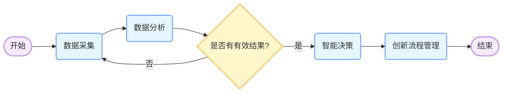

# 构建AI驱动的企业创新管理系统

> 关键词：AI、企业创新管理系统、机器学习、数据分析、创新流程、智能决策

> 摘要：本文聚焦于构建AI驱动的企业创新管理系统。随着人工智能技术的飞速发展，将其应用于企业创新管理领域具有重大意义。文章深入探讨了该系统的核心概念、算法原理、数学模型等理论知识，并通过实际案例展示了系统的开发过程和应用场景。同时，为读者推荐了相关的学习资源、开发工具和论文著作，最后对系统的未来发展趋势与挑战进行了总结，旨在为企业利用AI提升创新管理水平提供全面的指导。

## 1. 背景介绍 
### 1.1 目的和范围
在当今竞争激烈的商业环境中，企业创新能力已成为其生存和发展的关键因素。传统的企业创新管理方式往往效率低下，难以应对快速变化的市场需求。而人工智能技术的出现，为企业创新管理带来了新的机遇。本文的目的在于详细阐述如何构建一个AI驱动的企业创新管理系统，以提高企业创新管理的效率和质量。

本文的范围涵盖了从系统的核心概念、算法原理、数学模型到实际开发和应用的全过程。通过深入分析和实践案例，为企业和开发者提供全面的技术指导和实践经验。

### 1.2 预期读者
本文的预期读者主要包括企业管理人员、创新管理部门人员、人工智能开发者、软件工程师以及对企业创新管理和人工智能技术感兴趣的研究人员。企业管理人员可以从中了解如何利用AI提升企业创新管理水平；开发者和工程师可以获取系统开发的技术细节和实践经验；研究人员可以将其作为进一步研究的参考资料。

### 1.3 文档结构概述
本文将按照以下结构进行组织：
1. **核心概念与联系**：介绍AI驱动的企业创新管理系统的核心概念、原理和架构，并通过文本示意图和Mermaid流程图进行直观展示。
2. **核心算法原理 & 具体操作步骤**：详细讲解系统中使用的核心算法原理，并使用Python源代码进行阐述。
3. **数学模型和公式 & 详细讲解 & 举例说明**：介绍系统所涉及的数学模型和公式，并通过具体例子进行详细讲解。
4. **项目实战：代码实际案例和详细解释说明**：通过实际项目案例，展示系统的开发环境搭建、源代码实现和代码解读。
5. **实际应用场景**：探讨系统在不同企业场景中的实际应用。
6. **工具和资源推荐**：为读者推荐相关的学习资源、开发工具和论文著作。
7. **总结：未来发展趋势与挑战**：对系统的未来发展趋势进行展望，并分析可能面临的挑战。
8. **附录：常见问题与解答**：解答读者在学习和实践过程中可能遇到的常见问题。
9. **扩展阅读 & 参考资料**：提供相关的扩展阅读材料和参考资料。

### 1.4 术语表
#### 1.4.1 核心术语定义
- **AI（Artificial Intelligence）**：人工智能，是指计算机系统能够执行通常需要人类智能才能完成的任务，如学习、推理、解决问题等。
- **企业创新管理系统**：用于管理企业创新活动的信息系统，包括创新项目的规划、执行、监控和评估等环节。
- **机器学习（Machine Learning）**：人工智能的一个分支，让计算机通过数据学习模式和规律，从而进行预测和决策。
- **数据分析（Data Analysis）**：对大量数据进行收集、清洗、处理和分析，以提取有价值的信息和知识。

#### 1.4.2 相关概念解释
- **创新流程**：企业进行创新活动的一系列步骤和环节，包括创意产生、筛选、开发、商业化等。
- **智能决策**：利用人工智能技术，根据数据分析结果为企业提供决策支持。
- **知识图谱**：一种语义网络，用于表示实体之间的关系和知识。

#### 1.4.3 缩略词列表
- **AI**：Artificial Intelligence
- **ML**：Machine Learning
- **NLP**：Natural Language Processing

## 2. 核心概念与联系 
### 核心概念原理
AI驱动的企业创新管理系统的核心原理是利用人工智能技术，对企业创新过程中的各种数据进行收集、分析和处理，以支持企业的创新决策和管理。该系统主要包括以下几个核心概念：

- **数据采集**：通过各种渠道收集企业创新相关的数据，如市场数据、技术数据、员工创意等。
- **数据分析**：利用机器学习和数据分析技术，对采集到的数据进行挖掘和分析，提取有价值的信息和知识。
- **智能决策**：根据数据分析结果，为企业提供智能决策支持，如创意筛选、项目评估、资源分配等。
- **创新流程管理**：对企业的创新流程进行自动化管理，提高创新效率和质量。

### 架构的文本示意图
```plaintext
+----------------------+
| 数据采集层           |
| - 市场数据收集       |
| - 技术数据收集       |
| - 员工创意收集       |
+----------------------+
| 数据分析层           |
| - 数据清洗与预处理   |
| - 机器学习模型训练   |
| - 数据分析与挖掘     |
+----------------------+
| 智能决策层           |
| - 创意筛选与评估     |
| - 项目优先级排序     |
| - 资源分配建议       |
+----------------------+
| 创新流程管理层       |
| - 创新项目规划       |
| - 项目执行监控       |
| - 项目成果评估       |
+----------------------+
```

### Mermaid流程图


这个流程图展示了AI驱动的企业创新管理系统的基本工作流程。首先进行数据采集，然后对采集到的数据进行分析。根据分析结果判断是否有有效结果，如果有则进行智能决策，最后进行创新流程管理。如果分析结果无效，则返回数据采集阶段重新开始。

## 3. 核心算法原理 & 具体操作步骤 
### 核心算法原理
在AI驱动的企业创新管理系统中，常用的核心算法包括机器学习算法和自然语言处理算法。下面以支持向量机（SVM）和文本分类算法为例进行详细讲解。

#### 支持向量机（SVM）
支持向量机是一种常用的机器学习算法，用于分类和回归分析。其基本思想是在特征空间中找到一个最优的超平面，将不同类别的数据分开，并且使分类间隔最大。

假设我们有一个训练数据集 $\{(x_1, y_1), (x_2, y_2), \cdots, (x_n, y_n)\}$，其中 $x_i \in \mathbb{R}^d$ 是输入特征向量，$y_i \in \{-1, +1\}$ 是对应的类别标签。SVM的目标是找到一个超平面 $w^T x + b = 0$，使得对于所有的正类样本 $y_i = +1$，有 $w^T x_i + b \geq 1$；对于所有的负类样本 $y_i = -1$，有 $w^T x_i + b \leq -1$。同时，要使分类间隔 $\frac{2}{\|w\|}$ 最大，即 $\|w\|$ 最小。

#### 文本分类算法
文本分类是自然语言处理中的一个重要任务，用于将文本数据分类到不同的类别中。常用的文本分类算法包括朴素贝叶斯、逻辑回归和深度学习模型等。

以朴素贝叶斯算法为例，其基本思想是基于贝叶斯定理，假设特征之间相互独立。给定一个文本 $x$ 和类别集合 $C = \{c_1, c_2, \cdots, c_k\}$，朴素贝叶斯算法通过计算 $P(c_i|x)$ 来确定文本 $x$ 属于哪个类别，其中 $P(c_i|x) = \frac{P(x|c_i)P(c_i)}{P(x)}$。由于 $P(x)$ 对于所有类别都是相同的，因此只需要比较 $P(x|c_i)P(c_i)$ 的大小即可。

### 具体操作步骤

#### 支持向量机（SVM）的Python实现
```python
import numpy as np
from sklearn import svm
from sklearn.datasets import make_classification
from sklearn.model_selection import train_test_split

# 生成示例数据集
X, y = make_classification(n_samples=100, n_features=4, random_state=0)

# 划分训练集和测试集
X_train, X_test, y_train, y_test = train_test_split(X, y, test_size=0.2, random_state=0)

# 创建SVM分类器
clf = svm.SVC(kernel='linear')

# 训练模型
clf.fit(X_train, y_train)

# 预测
y_pred = clf.predict(X_test)

# 计算准确率
accuracy = np.mean(y_pred == y_test)
print(f"Accuracy: {accuracy}")
```

#### 文本分类算法（朴素贝叶斯）的Python实现
```python
from sklearn.datasets import fetch_20newsgroups
from sklearn.feature_extraction.text import TfidfVectorizer
from sklearn.naive_bayes import MultinomialNB
from sklearn.pipeline import Pipeline

# 加载数据集
categories = ['alt.atheism', 'soc.religion.christian']
twenty_train = fetch_20newsgroups(subset='train', categories=categories, shuffle=True, random_state=42)

# 创建文本分类管道
text_clf = Pipeline([
    ('tfidf', TfidfVectorizer()),
    ('clf', MultinomialNB()),
])

# 训练模型
text_clf.fit(twenty_train.data, twenty_train.target)

# 加载测试数据集
twenty_test = fetch_20newsgroups(subset='test', categories=categories, shuffle=True, random_state=42)

# 预测
predicted = text_clf.predict(twenty_test.data)

# 计算准确率
accuracy = np.mean(predicted == twenty_test.target)
print(f"Accuracy: {accuracy}")
```

以上代码分别展示了支持向量机和朴素贝叶斯文本分类算法的Python实现。通过这些算法，可以对企业创新相关的数据进行分类和分析，为企业的创新决策提供支持。

## 4. 数学模型和公式 & 详细讲解 & 举例说明 
### 支持向量机（SVM）的数学模型和公式
#### 原始问题
支持向量机的原始问题可以表示为一个带约束的优化问题：

$$
\begin{aligned}
\min_{w, b} &\quad \frac{1}{2} \|w\|^2 \\
\text{s.t.} &\quad y_i (w^T x_i + b) \geq 1, \quad i = 1, 2, \cdots, n
\end{aligned}
$$

其中，$w$ 是超平面的法向量，$b$ 是偏置项，$x_i$ 是输入特征向量，$y_i$ 是对应的类别标签。

#### 拉格朗日对偶问题
为了求解上述带约束的优化问题，我们可以引入拉格朗日乘子 $\alpha_i \geq 0$，构造拉格朗日函数：

$$
L(w, b, \alpha) = \frac{1}{2} \|w\|^2 - \sum_{i=1}^{n} \alpha_i (y_i (w^T x_i + b) - 1)
$$

然后，对 $w$ 和 $b$ 求偏导数并令其为零，得到：

$$
\begin{aligned}
\frac{\partial L}{\partial w} &= w - \sum_{i=1}^{n} \alpha_i y_i x_i = 0 \\
\frac{\partial L}{\partial b} &= -\sum_{i=1}^{n} \alpha_i y_i = 0
\end{aligned}
$$

将上述结果代入拉格朗日函数，得到拉格朗日对偶问题：

$$
\begin{aligned}
\max_{\alpha} &\quad \sum_{i=1}^{n} \alpha_i - \frac{1}{2} \sum_{i=1}^{n} \sum_{j=1}^{n} \alpha_i \alpha_j y_i y_j x_i^T x_j \\
\text{s.t.} &\quad \sum_{i=1}^{n} \alpha_i y_i = 0 \\
&\quad \alpha_i \geq 0, \quad i = 1, 2, \cdots, n
\end{aligned}
$$

#### 求解过程
求解拉格朗日对偶问题可以得到最优的拉格朗日乘子 $\alpha^*$。然后，根据 $\frac{\partial L}{\partial w} = 0$ 可以得到最优的法向量 $w^* = \sum_{i=1}^{n} \alpha_i^* y_i x_i$。最后，通过支持向量（即满足 $\alpha_i^* > 0$ 的样本）可以计算出偏置项 $b^*$。

#### 举例说明
假设我们有一个二维数据集，包含两个类别：正类（$y = +1$）和负类（$y = -1$）。数据集如下：

$$
\begin{aligned}
x_1 &= (3, 3), \quad y_1 = +1 \\
x_2 &= (4, 3), \quad y_2 = +1 \\
x_3 &= (1, 1), \quad y_3 = -1
\end{aligned}
$$

我们可以使用上述公式求解SVM的最优超平面。首先，构造拉格朗日对偶问题：

$$
\begin{aligned}
\max_{\alpha} &\quad \alpha_1 + \alpha_2 + \alpha_3 - \frac{1}{2} \left( \alpha_1^2 + \alpha_2^2 + \alpha_3^2 + 2 \alpha_1 \alpha_2 - 2 \alpha_1 \alpha_3 - 2 \alpha_2 \alpha_3 \right) \\
\text{s.t.} &\quad \alpha_1 + \alpha_2 - \alpha_3 = 0 \\
&\quad \alpha_1 \geq 0, \quad \alpha_2 \geq 0, \quad \alpha_3 \geq 0
\end{aligned}
$$

通过求解上述对偶问题，我们可以得到最优的拉格朗日乘子 $\alpha_1^*$、$\alpha_2^*$ 和 $\alpha_3^*$，进而计算出最优的法向量 $w^*$ 和偏置项 $b^*$，得到最优超平面 $w^{*T} x + b^* = 0$。

### 朴素贝叶斯文本分类的数学模型和公式
#### 贝叶斯定理
贝叶斯定理是朴素贝叶斯算法的基础，其公式为：

$$
P(c|x) = \frac{P(x|c)P(c)}{P(x)}
$$

其中，$P(c|x)$ 是给定文本 $x$ 属于类别 $c$ 的概率，$P(x|c)$ 是在类别 $c$ 下文本 $x$ 出现的概率，$P(c)$ 是类别 $c$ 的先验概率，$P(x)$ 是文本 $x$ 出现的概率。

#### 朴素贝叶斯假设
朴素贝叶斯算法假设特征之间相互独立，即：

$$
P(x|c) = \prod_{i=1}^{n} P(x_i|c)
$$

其中，$x = (x_1, x_2, \cdots, x_n)$ 是文本 $x$ 的特征向量。

#### 分类决策规则
在朴素贝叶斯文本分类中，我们通过比较 $P(c|x)$ 的大小来确定文本 $x$ 属于哪个类别。由于 $P(x)$ 对于所有类别都是相同的，因此只需要比较 $P(x|c)P(c)$ 的大小即可。即：

$$
\hat{c} = \arg \max_{c \in C} P(x|c)P(c)
$$

其中，$\hat{c}$ 是预测的类别，$C$ 是类别集合。

#### 举例说明
假设我们有一个文本分类任务，要将文本分为两个类别：体育和科技。我们有以下训练数据：

| 文本 | 类别 |
| --- | --- |
| 篮球比赛很精彩 | 体育 |
| 智能手机性能强大 | 科技 |
| 足球赛事吸引众多观众 | 体育 |
| 人工智能技术发展迅速 | 科技 |

我们可以计算每个类别的先验概率 $P(c)$ 和每个特征在每个类别下的条件概率 $P(x_i|c)$。例如，对于类别“体育”，其先验概率 $P(体育) = \frac{2}{4} = 0.5$。对于特征“篮球”，在类别“体育”下的条件概率 $P(篮球|体育) = \frac{1}{2}$。

假设我们有一个新的文本“篮球科技结合带来新体验”，我们可以计算该文本属于每个类别的概率：

$$
\begin{aligned}
P(体育|篮球科技结合带来新体验) &\propto P(篮球|体育)P(科技|体育)P(结合|体育)P(带来|体育)P(新体验|体育)P(体育) \\
P(科技|篮球科技结合带来新体验) &\propto P(篮球|科技)P(科技|科技)P(结合|科技)P(带来|科技)P(新体验|科技)P(科技)
\end{aligned}
$$

通过比较上述两个概率的大小，我们可以确定该文本属于哪个类别。

## 5. 项目实战：代码实际案例和详细解释说明 
### 5.1  开发环境搭建
#### 硬件环境
- **处理器**：Intel Core i5及以上
- **内存**：8GB及以上
- **硬盘**：至少500GB可用空间

#### 软件环境
- **操作系统**：Windows 10、Linux（如Ubuntu 18.04及以上）或macOS
- **Python版本**：Python 3.7及以上
- **开发工具**：推荐使用Anaconda作为Python环境管理工具，以及PyCharm作为集成开发环境（IDE）。

#### 安装必要的Python库
在命令行中使用以下命令安装必要的Python库：
```sh
pip install numpy pandas scikit-learn matplotlib seaborn
```

### 5.2  源代码详细实现和代码解读
#### 数据采集模块
```python
import pandas as pd

def collect_data(file_path):
    """
    从CSV文件中采集数据
    :param file_path: CSV文件路径
    :return: 采集到的数据
    """
    data = pd.read_csv(file_path)
    return data

# 示例使用
file_path = 'innovation_data.csv'
data = collect_data(file_path)
print(data.head())
```
**代码解读**：
- `collect_data` 函数接受一个CSV文件路径作为参数，使用 `pandas` 库的 `read_csv` 函数读取文件内容，并返回采集到的数据。
- 最后，我们调用 `collect_data` 函数并打印数据的前几行。

#### 数据分析模块
```python
from sklearn.model_selection import train_test_split
from sklearn.linear_model import LogisticRegression
from sklearn.metrics import accuracy_score

def analyze_data(data):
    """
    对采集到的数据进行分析
    :param data: 采集到的数据
    :return: 模型准确率
    """
    # 假设数据的最后一列是目标变量
    X = data.iloc[:, :-1]
    y = data.iloc[:, -1]
    
    # 划分训练集和测试集
    X_train, X_test, y_train, y_test = train_test_split(X, y, test_size=0.2, random_state=42)
    
    # 创建逻辑回归模型
    model = LogisticRegression()
    
    # 训练模型
    model.fit(X_train, y_train)
    
    # 预测
    y_pred = model.predict(X_test)
    
    # 计算准确率
    accuracy = accuracy_score(y_test, y_pred)
    return accuracy

# 示例使用
accuracy = analyze_data(data)
print(f"Model accuracy: {accuracy}")
```
**代码解读**：
- `analyze_data` 函数接受采集到的数据作为参数，首先将数据划分为特征变量 `X` 和目标变量 `y`。
- 然后使用 `train_test_split` 函数将数据划分为训练集和测试集。
- 接着创建一个逻辑回归模型，并使用训练集数据进行训练。
- 最后使用测试集数据进行预测，并计算模型的准确率。

#### 智能决策模块
```python
def make_decision(accuracy):
    """
    根据模型准确率做出决策
    :param accuracy: 模型准确率
    :return: 决策结果
    """
    if accuracy > 0.8:
        decision = "继续推进创新项目"
    else:
        decision = "重新评估创新方案"
    return decision

# 示例使用
decision = make_decision(accuracy)
print(f"Decision: {decision}")
```
**代码解读**：
- `make_decision` 函数接受模型准确率作为参数，根据准确率的大小做出决策。
- 如果准确率大于0.8，则建议继续推进创新项目；否则，建议重新评估创新方案。

### 5.3  代码解读与分析
通过上述代码，我们实现了一个简单的AI驱动的企业创新管理系统的核心模块，包括数据采集、数据分析和智能决策。

- **数据采集模块**：负责从CSV文件中采集企业创新相关的数据，为后续的分析和决策提供基础。
- **数据分析模块**：使用逻辑回归模型对采集到的数据进行分析，评估创新项目的可行性，并计算模型的准确率。
- **智能决策模块**：根据模型的准确率做出决策，为企业的创新管理提供支持。

需要注意的是，上述代码只是一个简单的示例，实际的企业创新管理系统可能需要更复杂的算法和更完善的功能。

## 6. 实际应用场景 
### 创意筛选与评估
在企业创新过程中，往往会产生大量的创意。AI驱动的企业创新管理系统可以对这些创意进行筛选和评估。通过对创意文本进行自然语言处理和机器学习分析，系统可以判断创意的可行性、创新性和商业价值，帮助企业快速筛选出有潜力的创意。

### 项目优先级排序
企业通常同时开展多个创新项目，但资源有限。系统可以根据项目的预期收益、风险程度、技术难度等因素，使用机器学习算法对项目进行优先级排序，帮助企业合理分配资源，提高创新效率。

### 市场趋势预测
系统可以收集和分析市场数据，如行业动态、竞争对手信息、消费者需求等。通过时间序列分析、深度学习等算法，预测市场趋势，为企业的创新战略提供决策支持。

### 员工创新能力评估
系统可以记录员工在创新过程中的表现，如提出的创意数量、创意的质量、参与项目的贡献等。通过数据分析和机器学习算法，评估员工的创新能力，为企业的人才培养和激励提供依据。

### 创新流程自动化
系统可以对企业的创新流程进行自动化管理，如创意提交、审核、项目立项、执行监控等。通过工作流引擎和规则引擎，实现创新流程的自动化执行，减少人工干预，提高创新效率和质量。

## 7. 工具和资源推荐
### 7.1 学习资源推荐
#### 7.1.1 书籍推荐
- 《人工智能：一种现代的方法》（Artificial Intelligence: A Modern Approach）：这是一本经典的人工智能教材，涵盖了人工智能的各个领域，包括搜索算法、机器学习、自然语言处理等。
- 《Python机器学习》（Python Machine Learning）：本书详细介绍了使用Python进行机器学习的方法和技术，适合初学者入门。
- 《企业创新管理》：全面介绍了企业创新管理的理论和实践，帮助读者了解企业创新的流程和方法。

#### 7.1.2 在线课程
- Coursera上的“机器学习”课程：由斯坦福大学教授Andrew Ng主讲，是机器学习领域的经典课程。
- edX上的“人工智能基础”课程：介绍了人工智能的基本概念、算法和应用。
- 中国大学MOOC上的“企业创新管理”课程：结合中国企业的实际案例，讲解企业创新管理的理论和实践。

#### 7.1.3 技术博客和网站
- Medium：一个技术博客平台，有很多关于人工智能和企业创新管理的优质文章。
- Towards Data Science：专注于数据分析和机器学习的技术博客，提供了很多实用的教程和案例。
- 36氪：关注科技创新和创业动态，提供了很多关于企业创新的新闻和分析。

### 7.2 开发工具框架推荐
#### 7.2.1 IDE和编辑器
- PyCharm：一款专业的Python集成开发环境，提供了丰富的代码编辑、调试和分析功能。
- Jupyter Notebook：一个交互式的开发环境，适合进行数据分析和机器学习实验。
- Visual Studio Code：一款轻量级的代码编辑器，支持多种编程语言和插件扩展。

#### 7.2.2 调试和性能分析工具
- TensorBoard：TensorFlow的可视化工具，用于监控模型训练过程和分析模型性能。
- Py-Spy：一个轻量级的Python性能分析工具，可以实时监控Python程序的CPU使用情况和函数调用栈。
- cProfile：Python标准库中的性能分析模块，用于分析Python程序的性能瓶颈。

#### 7.2.3 相关框架和库
- TensorFlow：一个开源的机器学习框架，提供了丰富的深度学习模型和工具。
- PyTorch：另一个流行的深度学习框架，具有动态图和易于使用的特点。
- Scikit-learn：一个简单易用的机器学习库，提供了各种机器学习算法和工具。

### 7.3 相关论文著作推荐
#### 7.3.1 经典论文
- “Support-Vector Networks”：介绍了支持向量机的基本原理和算法，是机器学习领域的经典论文。
- “A Mathematical Theory of Communication”：奠定了信息论的基础，对自然语言处理和机器学习有重要影响。
- “ImageNet Classification with Deep Convolutional Neural Networks”：提出了AlexNet卷积神经网络，开启了深度学习在计算机视觉领域的革命。

#### 7.3.2 最新研究成果
- 关注顶级学术会议，如NeurIPS（神经信息处理系统大会）、ICML（国际机器学习会议）、CVPR（计算机视觉与模式识别会议）等，这些会议上会发表很多关于人工智能和企业创新管理的最新研究成果。
- 查阅顶级学术期刊，如Journal of Artificial Intelligence Research（JAIR）、Artificial Intelligence等，了解领域内的前沿研究。

#### 7.3.3 应用案例分析
- 《哈佛商业评论》：经常发表关于企业创新管理的案例分析文章，介绍了很多企业在创新实践中的成功经验和失败教训。
- 各大咨询公司的研究报告，如麦肯锡、波士顿咨询等，提供了很多关于企业创新管理的行业洞察和应用案例。

## 8. 总结：未来发展趋势与挑战
### 未来发展趋势
#### 与物联网的深度融合
随着物联网技术的发展，企业创新管理系统将与物联网设备深度融合。通过收集物联网设备产生的大量数据，系统可以更全面地了解企业的生产、运营和市场情况，为创新决策提供更准确的依据。

#### 强化学习的应用
强化学习是一种通过智能体与环境进行交互来学习最优策略的机器学习方法。在企业创新管理中，强化学习可以用于优化创新流程、资源分配和决策制定，提高企业的创新效率和竞争力。

#### 知识图谱的应用
知识图谱可以将企业的各种知识和信息进行整合和表示，形成一个语义网络。在企业创新管理系统中，知识图谱可以用于知识发现、智能推荐和决策支持，帮助企业更好地利用内部和外部知识资源。

#### 个性化创新服务
未来的企业创新管理系统将更加注重个性化服务。根据企业的行业特点、发展阶段和创新需求，系统可以为企业提供定制化的创新解决方案和服务，提高企业的创新效果。

### 挑战
#### 数据质量和安全问题
AI驱动的企业创新管理系统依赖于大量的数据，但数据质量和安全问题是一个挑战。数据可能存在噪声、缺失值和错误，需要进行清洗和预处理。同时，企业需要保护数据的安全和隐私，防止数据泄露和滥用。

#### 算法可解释性问题
一些复杂的人工智能算法，如深度学习模型，往往是黑盒模型，难以解释其决策过程和结果。在企业创新管理中，决策者需要了解算法的决策依据，以便做出合理的决策。因此，提高算法的可解释性是一个重要的挑战。

#### 人才短缺问题
构建和应用AI驱动的企业创新管理系统需要具备人工智能、数据分析和企业管理等多方面知识的复合型人才。目前，这类人才短缺，企业需要加大人才培养和引进的力度。

#### 组织文化和变革问题
引入AI驱动的企业创新管理系统可能会对企业的组织文化和工作方式产生影响。企业需要进行组织变革，培养员工的创新意识和数字技能，以适应新的管理模式。

## 9. 附录：常见问题与解答
### 1. 构建AI驱动的企业创新管理系统需要多少成本？
构建AI驱动的企业创新管理系统的成本取决于多个因素，如系统的功能复杂度、数据规模、开发团队的技术水平等。一般来说，小型企业的简单系统可能需要几万元到几十万元的开发成本，而大型企业的复杂系统可能需要数百万元甚至更多。

### 2. 系统的实施周期有多长？
系统的实施周期也因项目的复杂程度而异。简单的系统可能在几个月内完成实施，而复杂的系统可能需要一年以上的时间。实施周期包括需求分析、系统设计、开发、测试、上线等多个阶段。

### 3. 如何保证系统与企业现有业务系统的集成？
在系统设计阶段，需要充分考虑与企业现有业务系统的集成。可以采用接口技术，如RESTful API，实现系统之间的数据交互和业务协同。同时，需要进行充分的测试，确保集成的稳定性和可靠性。

### 4. 系统对企业员工的技术要求高吗？
系统的使用对企业员工的技术要求因系统的功能和操作方式而异。一般来说，系统会提供友好的用户界面和操作指南，降低员工的使用难度。同时，企业可以为员工提供培训，帮助他们掌握系统的使用方法。

### 5. 如何评估系统的效果？
可以从多个方面评估系统的效果，如创新效率的提升、创新项目的成功率、企业的经济效益等。可以设定具体的指标，如创意筛选的准确率、项目执行的周期缩短率等，定期对系统进行评估和优化。

## 10. 扩展阅读 & 参考资料
### 扩展阅读
- 《创新者的窘境》（The Innovator's Dilemma）：探讨了企业在创新过程中面临的挑战和困境，以及如何应对这些挑战。
- 《人类简史：从动物到上帝》（Sapiens: A Brief History of Humankind）：从人类进化的角度探讨了创新和技术发展对人类社会的影响。
- 《未来简史：从智人到神人》（Homo Deus: A Brief History of Tomorrow）：对未来人类社会的发展趋势进行了展望，包括人工智能、生物技术等领域的发展对人类的影响。

### 参考资料
- 相关的学术论文和研究报告，可以通过学术数据库，如IEEE Xplore、ACM Digital Library等进行查找。
- 各大科技公司的官方文档和技术博客，如Google AI、Microsoft AI等，提供了很多关于人工智能技术的最新进展和应用案例。
- 行业协会和研究机构发布的报告和白皮书，如中国人工智能产业发展联盟（AIIA）、国际数据公司（IDC）等，提供了关于人工智能和企业创新管理的行业洞察和趋势分析。

作者：AI天才研究院/AI Genius Institute & 禅与计算机程序设计艺术 /Zen And The Art of Computer Programming