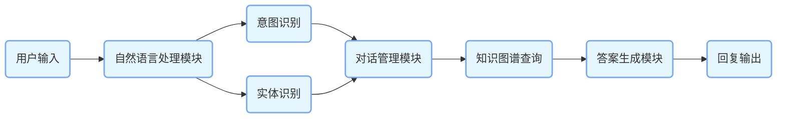

# 构建AI驱动的企业智能助手：从概念到落地

> 关键词：AI驱动、企业智能助手、概念落地、自然语言处理、机器学习

> 摘要：本文围绕构建AI驱动的企业智能助手展开，从背景介绍出发，详细阐述其核心概念、算法原理、数学模型等内容。通过项目实战案例展示具体的开发过程和代码实现，探讨了企业智能助手在实际中的应用场景。同时，推荐了相关的学习资源、开发工具框架以及论文著作。最后对其未来发展趋势与挑战进行总结，并给出常见问题解答和扩展阅读参考资料，旨在为企业构建智能助手提供全面的指导和思路。

## 1. 背景介绍 
### 1.1 目的和范围
随着人工智能技术的飞速发展，企业面临着提升效率、优化服务和增强竞争力的需求。构建AI驱动的企业智能助手成为满足这些需求的有效途径。本文的目的是全面介绍如何从概念到落地构建这样的智能助手，涵盖从基本概念的理解、核心技术的掌握到实际项目开发和应用的全过程。范围包括但不限于智能助手的架构设计、算法实现、实际应用场景以及相关的工具和资源。

### 1.2 预期读者
本文预期读者包括企业的技术决策者、软件开发者、人工智能爱好者以及对提升企业运营效率感兴趣的管理人员。对于技术人员，可从中获取具体的技术实现细节和开发经验；对于管理人员，能了解智能助手的潜在价值和应用方式，为企业的数字化转型提供决策依据。

### 1.3 文档结构概述
本文首先介绍背景信息，让读者了解构建AI驱动企业智能助手的目的和适用人群。接着阐述核心概念与联系，明确智能助手的原理和架构。然后详细讲解核心算法原理和具体操作步骤，结合Python代码进行说明。之后介绍数学模型和公式，并举例说明其应用。通过项目实战展示代码实现和详细解释。探讨实际应用场景，为企业提供参考。推荐相关的工具和资源，帮助读者进一步学习和开发。最后总结未来发展趋势与挑战，给出常见问题解答和扩展阅读参考资料。

### 1.4 术语表
#### 1.4.1 核心术语定义
- **AI驱动**：指利用人工智能技术，如机器学习、自然语言处理等，为系统提供智能决策和交互能力。
- **企业智能助手**：是一种基于人工智能技术，能够理解企业业务需求，与员工或客户进行自然语言交互，提供信息和服务的软件系统。
- **自然语言处理（NLP）**：是人工智能的一个分支，研究如何让计算机理解和处理人类语言，包括文本分析、语义理解、机器翻译等。
- **机器学习（ML）**：是一门多领域交叉学科，涉及概率论、统计学、逼近论、凸分析、算法复杂度理论等多门学科。它专门研究计算机怎样模拟或实现人类的学习行为，以获取新的知识或技能，重新组织已有的知识结构使之不断改善自身的性能。

#### 1.4.2 相关概念解释
- **对话管理**：负责管理智能助手与用户之间的对话流程，包括对话状态的跟踪、回复策略的选择等。
- **知识图谱**：是一种语义网络，用于表示实体之间的关系和知识，为智能助手提供丰富的背景知识。
- **意图识别**：是自然语言处理中的一个重要任务，旨在确定用户输入的文本所表达的意图，以便智能助手做出相应的回应。

#### 1.4.3 缩略词列表
- **NLP**：Natural Language Processing（自然语言处理）
- **ML**：Machine Learning（机器学习）
- **RNN**：Recurrent Neural Network（循环神经网络）
- **LSTM**：Long Short-Term Memory（长短期记忆网络）
- **API**：Application Programming Interface（应用程序编程接口）

## 2. 核心概念与联系 
### 核心概念原理
AI驱动的企业智能助手主要基于自然语言处理和机器学习技术。自然语言处理使智能助手能够理解用户的自然语言输入，包括文本和语音。它通过分词、词性标注、句法分析、语义理解等步骤，将用户输入转化为计算机能够处理的形式。机器学习则用于训练智能助手的模型，使其能够根据历史数据进行学习和预测。例如，通过监督学习可以训练意图识别模型，根据用户的输入预测其意图；通过强化学习可以优化对话管理策略，提高智能助手的交互效果。

### 架构示意图


这个架构图展示了AI驱动的企业智能助手的主要工作流程。用户输入经过自然语言处理模块进行分词、词性标注等处理，然后进行意图识别和实体识别。对话管理模块根据识别结果和当前对话状态进行决策，可能会查询知识图谱获取相关信息。最后，答案生成模块根据查询结果生成回复并输出给用户。

## 3. 核心算法原理 & 具体操作步骤 
### 意图识别算法原理
意图识别是智能助手的关键环节之一，常用的算法有基于机器学习的分类算法，如支持向量机（SVM）、朴素贝叶斯（Naive Bayes）和深度学习算法，如循环神经网络（RNN）及其变体长短期记忆网络（LSTM）。这里以LSTM为例进行讲解。

LSTM是一种特殊的RNN，能够解决传统RNN在处理长序列时的梯度消失问题。它通过门控机制来控制信息的流动，包括输入门、遗忘门和输出门。输入门决定哪些新信息将被添加到细胞状态中，遗忘门决定哪些信息将从细胞状态中被遗忘，输出门决定从细胞状态中输出哪些信息。

### Python代码实现
```python
import numpy as np
import tensorflow as tf
from tensorflow.keras.preprocessing.text import Tokenizer
from tensorflow.keras.preprocessing.sequence import pad_sequences
from tensorflow.keras.models import Sequential
from tensorflow.keras.layers import Embedding, LSTM, Dense

# 示例数据
texts = ["查询今天的会议安排", "预定明天的会议室", "查找销售报告"]
labels = [0, 1, 2]

# 分词和编码
tokenizer = Tokenizer()
tokenizer.fit_on_texts(texts)
sequences = tokenizer.texts_to_sequences(texts)

# 填充序列
max_length = max([len(seq) for seq in sequences])
padded_sequences = pad_sequences(sequences, maxlen=max_length)

# 构建LSTM模型
model = Sequential()
model.add(Embedding(input_dim=len(tokenizer.word_index) + 1, output_dim=100, input_length=max_length))
model.add(LSTM(128))
model.add(Dense(3, activation='softmax'))

# 编译模型
model.compile(optimizer='adam', loss='sparse_categorical_crossentropy', metrics=['accuracy'])

# 训练模型
model.fit(padded_sequences, np.array(labels), epochs=10)

# 预测
new_text = ["查询明天的会议安排"]
new_sequence = tokenizer.texts_to_sequences(new_text)
new_padded_sequence = pad_sequences(new_sequence, maxlen=max_length)
prediction = model.predict(new_padded_sequence)
predicted_label = np.argmax(prediction)
print("预测的意图标签:", predicted_label)
```
### 具体操作步骤
1. **数据准备**：收集包含用户输入和对应意图标签的数据集。对文本数据进行分词和编码，将其转换为数值序列。
2. **模型构建**：使用Keras构建LSTM模型，包括嵌入层、LSTM层和全连接层。
3. **模型编译**：选择合适的优化器、损失函数和评估指标，编译模型。
4. **模型训练**：使用准备好的数据集对模型进行训练。
5. **模型预测**：使用训练好的模型对新的用户输入进行预测，得到意图标签。

## 4. 数学模型和公式 & 详细讲解 & 举例说明 
### LSTM的数学模型
LSTM的核心是细胞状态 $C_t$ 和三个门控机制：输入门 $i_t$、遗忘门 $f_t$ 和输出门 $o_t$。以下是LSTM的主要公式：

遗忘门：
$$f_t = \sigma(W_f[h_{t-1}, x_t] + b_f)$$

输入门：
$$i_t = \sigma(W_i[h_{t-1}, x_t] + b_i)$$
$$\tilde{C}_t = \tanh(W_C[h_{t-1}, x_t] + b_C)$$

细胞状态更新：
$$C_t = f_t \odot C_{t-1} + i_t \odot \tilde{C}_t$$

输出门：
$$o_t = \sigma(W_o[h_{t-1}, x_t] + b_o)$$
$$h_t = o_t \odot \tanh(C_t)$$

其中，$x_t$ 是当前时刻的输入，$h_{t-1}$ 是上一时刻的隐藏状态，$W$ 是权重矩阵，$b$ 是偏置向量，$\sigma$ 是sigmoid函数，$\tanh$ 是双曲正切函数，$\odot$ 表示逐元素相乘。

### 详细讲解
- **遗忘门**：决定哪些信息将从细胞状态中被遗忘。它接收上一时刻的隐藏状态 $h_{t-1}$ 和当前时刻的输入 $x_t$，通过sigmoid函数将输出映射到 $[0, 1]$ 之间，表示每个信息的保留概率。
- **输入门**：由两部分组成。第一部分通过sigmoid函数决定哪些新信息将被添加到细胞状态中，第二部分通过tanh函数创建一个新的候选向量 $\tilde{C}_t$。
- **细胞状态更新**：将遗忘门的输出与上一时刻的细胞状态相乘，遗忘一些不必要的信息，然后将输入门的输出与候选向量相乘，添加新的信息。
- **输出门**：决定从细胞状态中输出哪些信息。它通过sigmoid函数决定输出的比例，然后将其与细胞状态的tanh输出相乘，得到当前时刻的隐藏状态 $h_t$。

### 举例说明
假设我们有一个LSTM单元，输入维度为3，隐藏状态维度为2。在某个时刻 $t$，输入 $x_t = [0.1, 0.2, 0.3]$，上一时刻的隐藏状态 $h_{t-1} = [0.4, 0.5]$。我们可以根据上述公式计算各个门控和细胞状态的更新。

首先，计算遗忘门：
$$f_t = \sigma(W_f[h_{t-1}, x_t] + b_f)$$
假设 $W_f$ 是一个 $2 \times 5$ 的矩阵，$b_f$ 是一个长度为2的向量。通过矩阵乘法和sigmoid函数计算得到 $f_t$。

同理，计算输入门、候选向量和细胞状态更新，最后计算输出门和当前时刻的隐藏状态 $h_t$。

## 5. 项目实战：代码实际案例和详细解释说明 
### 5.1  开发环境搭建
1. **安装Python**：建议使用Python 3.7及以上版本。可以从Python官方网站（https://www.python.org/downloads/）下载安装包进行安装。
2. **安装必要的库**：使用pip命令安装以下库：
```bash
pip install tensorflow
pip install numpy
pip install scikit-learn
```
3. **选择开发工具**：可以使用PyCharm、Jupyter Notebook等开发工具。

### 5.2  源代码详细实现和代码解读
```python
import numpy as np
import tensorflow as tf
from sklearn.model_selection import train_test_split
from tensorflow.keras.preprocessing.text import Tokenizer
from tensorflow.keras.preprocessing.sequence import pad_sequences
from tensorflow.keras.models import Sequential
from tensorflow.keras.layers import Embedding, LSTM, Dense

# 示例数据
texts = ["查询今天的会议安排", "预定明天的会议室", "查找销售报告", "取消会议", "更新项目进度"]
labels = [0, 1, 2, 3, 4]

# 分词和编码
tokenizer = Tokenizer()
tokenizer.fit_on_texts(texts)
sequences = tokenizer.texts_to_sequences(texts)

# 填充序列
max_length = max([len(seq) for seq in sequences])
padded_sequences = pad_sequences(sequences, maxlen=max_length)

# 划分训练集和测试集
X_train, X_test, y_train, y_test = train_test_split(padded_sequences, np.array(labels), test_size=0.2, random_state=42)

# 构建LSTM模型
model = Sequential()
model.add(Embedding(input_dim=len(tokenizer.word_index) + 1, output_dim=100, input_length=max_length))
model.add(LSTM(128))
model.add(Dense(5, activation='softmax'))

# 编译模型
model.compile(optimizer='adam', loss='sparse_categorical_crossentropy', metrics=['accuracy'])

# 训练模型
model.fit(X_train, y_train, epochs=10, validation_data=(X_test, y_test))

# 评估模型
loss, accuracy = model.evaluate(X_test, y_test)
print("测试集损失:", loss)
print("测试集准确率:", accuracy)

# 预测
new_text = ["查询明天的会议安排"]
new_sequence = tokenizer.texts_to_sequences(new_text)
new_padded_sequence = pad_sequences(new_sequence, maxlen=max_length)
prediction = model.predict(new_padded_sequence)
predicted_label = np.argmax(prediction)
print("预测的意图标签:", predicted_label)
```
### 代码解读与分析
1. **数据准备**：
    - 使用 `Tokenizer` 对文本数据进行分词和编码，将文本转换为数值序列。
    - 使用 `pad_sequences` 对序列进行填充，使所有序列长度一致。
    - 使用 `train_test_split` 函数将数据集划分为训练集和测试集。
2. **模型构建**：
    - 使用 `Sequential` 模型构建LSTM模型。
    - `Embedding` 层将输入的数值序列转换为向量表示。
    - `LSTM` 层进行序列建模。
    - `Dense` 层进行分类，使用 `softmax` 激活函数输出概率分布。
3. **模型编译**：
    - 使用 `adam` 优化器进行参数更新。
    - 使用 `sparse_categorical_crossentropy` 作为损失函数，适用于多分类问题。
    - 使用 `accuracy` 作为评估指标。
4. **模型训练**：
    - 使用 `fit` 方法对模型进行训练，指定训练集和验证集，训练10个epoch。
5. **模型评估**：
    - 使用 `evaluate` 方法对模型在测试集上的性能进行评估，输出损失和准确率。
6. **模型预测**：
    - 对新的文本进行分词、编码和填充，然后使用训练好的模型进行预测，输出预测的意图标签。

## 6. 实际应用场景 
### 客户服务
企业智能助手可以集成到企业的客服系统中，自动回答客户的常见问题，提供产品信息和解决方案。例如，电商企业的智能助手可以回答客户关于商品价格、库存、配送等问题，提高客户服务效率和满意度。

### 内部办公
在企业内部，智能助手可以帮助员工查询信息、安排会议、处理工作流程等。例如，员工可以通过智能助手查询公司的规章制度、项目进度，或者提交请假申请、报销申请等。

### 销售与营销
智能助手可以分析客户的需求和偏好，为销售和营销团队提供有价值的信息。例如，根据客户的历史购买记录和浏览行为，智能助手可以推荐合适的产品和服务，提高销售转化率。

### 数据分析与决策支持
智能助手可以对企业的数据进行分析和挖掘，为管理层提供决策支持。例如，分析销售数据、市场趋势等，帮助企业制定合理的战略和计划。

## 7. 工具和资源推荐
### 7.1 学习资源推荐
#### 7.1.1 书籍推荐
- 《深度学习》（Deep Learning）：由Ian Goodfellow、Yoshua Bengio和Aaron Courville撰写，是深度学习领域的经典教材，涵盖了深度学习的基本概念、算法和应用。
- 《Python自然语言处理》（Natural Language Processing with Python）：介绍了使用Python进行自然语言处理的方法和技术，包括文本处理、词性标注、句法分析等。
- 《机器学习》（Machine Learning）：周志华著，全面介绍了机器学习的基本概念、算法和应用，是机器学习领域的优秀教材。

#### 7.1.2 在线课程
- Coursera上的“深度学习专项课程”（Deep Learning Specialization）：由Andrew Ng教授授课，涵盖了深度学习的各个方面，包括神经网络、卷积神经网络、循环神经网络等。
- edX上的“自然语言处理基础”（Foundations of Natural Language Processing）：介绍了自然语言处理的基本概念和技术，适合初学者。
- 网易云课堂上的“人工智能实战”课程：结合实际项目，讲解人工智能的应用和开发。

#### 7.1.3 技术博客和网站
- Medium：有许多关于人工智能和机器学习的优秀博客文章，涵盖了最新的研究成果和实践经验。
- Towards Data Science：专注于数据科学和机器学习领域，提供了大量的技术文章和案例分析。
- 开源中国：国内知名的开源技术社区，有许多关于人工智能和软件开发的技术文章和讨论。

### 7.2 开发工具框架推荐
#### 7.2.1 IDE和编辑器
- PyCharm：专业的Python集成开发环境，提供了丰富的代码编辑、调试和项目管理功能。
- Jupyter Notebook：交互式的开发环境，适合进行数据分析和模型实验。
- Visual Studio Code：轻量级的代码编辑器，支持多种编程语言和插件扩展。

#### 7.2.2 调试和性能分析工具
- TensorBoard：TensorFlow的可视化工具，可以用于监控模型的训练过程、查看模型的结构和性能指标。
- Py-Spy：Python性能分析工具，可以分析Python程序的CPU使用率和函数调用时间。
- Memory Profiler：Python内存分析工具，可以监控Python程序的内存使用情况。

#### 7.2.3 相关框架和库
- TensorFlow：开源的机器学习框架，提供了丰富的深度学习模型和工具，支持分布式训练和部署。
- PyTorch：另一个流行的深度学习框架，具有动态图和易于使用的特点，适合研究和开发。
- NLTK：Python的自然语言处理工具包，提供了丰富的文本处理和分析功能，如分词、词性标注、命名实体识别等。

### 7.3 相关论文著作推荐
#### 7.3.1 经典论文
- “Long Short-Term Memory”：Sepp Hochreiter和Jürgen Schmidhuber于1997年发表的论文，介绍了LSTM的基本原理和结构。
- “Attention Is All You Need”：Ashish Vaswani等人于2017年发表的论文，提出了Transformer模型，是自然语言处理领域的重要突破。
- “BERT: Pre-training of Deep Bidirectional Transformers for Language Understanding”：Jacob Devlin等人于2018年发表的论文，介绍了BERT模型，在多个自然语言处理任务上取得了优异的成绩。

#### 7.3.2 最新研究成果
- 在各大顶级学术会议上，如NeurIPS（神经信息处理系统大会）、ACL（计算语言学协会年会）等，会有关于人工智能和自然语言处理的最新研究成果发表。可以关注这些会议的论文集和报告。
- 一些知名的学术期刊，如Journal of Artificial Intelligence Research（JAIR）、Artificial Intelligence等，也会发表高质量的研究论文。

#### 7.3.3 应用案例分析
- 许多科技公司会在自己的官方博客上分享人工智能的应用案例，如Google、Microsoft、Facebook等。可以关注这些公司的博客，了解他们在实际项目中的应用经验和技术方案。
- 一些行业报告和研究机构的分析文章也会提供企业智能助手的应用案例和市场趋势分析。

## 8. 总结：未来发展趋势与挑战
### 未来发展趋势
- **多模态交互**：未来的企业智能助手将支持多种模态的交互，如语音、文本、图像、视频等。用户可以通过不同的方式与智能助手进行交流，提高交互的便利性和效率。
- **个性化服务**：智能助手将更加注重个性化服务，根据用户的历史行为、偏好和需求，提供个性化的推荐和解决方案。例如，为不同的员工提供不同的工作建议，为不同的客户提供不同的产品推荐。
- **与其他系统的集成**：企业智能助手将与企业的其他信息系统，如ERP、CRM等进行深度集成，实现数据的共享和业务流程的自动化。例如，智能助手可以直接从ERP系统中获取订单信息，为客户提供实时的订单状态查询。
- **知识增强**：通过引入知识图谱和外部知识库，智能助手将拥有更丰富的知识，能够回答更复杂的问题，提供更准确的信息和建议。

### 挑战
- **数据质量和隐私保护**：构建智能助手需要大量的高质量数据，但数据的收集、整理和标注是一项艰巨的任务。同时，数据隐私保护也是一个重要的问题，企业需要确保用户数据的安全和隐私。
- **语义理解的准确性**：虽然自然语言处理技术取得了很大的进展，但在语义理解方面仍然存在挑战。智能助手需要准确理解用户的意图和上下文，避免误解和错误回复。
- **模型的可解释性**：深度学习模型通常是黑盒模型，难以解释其决策过程和结果。在企业应用中，模型的可解释性非常重要，例如在金融、医疗等领域，需要了解模型的决策依据。
- **技术更新换代快**：人工智能技术发展迅速，新的算法和模型不断涌现。企业需要不断学习和更新技术，以保持智能助手的竞争力。

## 9. 附录：常见问题与解答
### 问题1：构建企业智能助手需要多少数据？
解答：数据量的需求取决于多个因素，如任务的复杂程度、模型的类型等。一般来说，对于简单的意图识别任务，几百条到几千条数据可能就足够了；对于更复杂的任务，如对话生成，可能需要数万条甚至更多的数据。此外，数据的质量也非常重要，需要确保数据的准确性和多样性。

### 问题2：如何评估智能助手的性能？
解答：可以使用多种指标来评估智能助手的性能，如准确率、召回率、F1值等。对于意图识别任务，可以使用分类准确率来评估模型的性能；对于对话生成任务，可以使用人工评估和自动评估指标，如困惑度、BLEU分数等。此外，还可以通过用户反馈和实际应用效果来评估智能助手的性能。

### 问题3：智能助手可以处理多种语言吗？
解答：可以。通过使用多语言的数据集进行训练，以及选择支持多语言的模型和工具，智能助手可以处理多种语言。例如，Google的BERT模型支持多种语言，可以用于多语言的自然语言处理任务。

### 问题4：如何保护智能助手的数据安全？
解答：可以采取以下措施来保护智能助手的数据安全：
- 对数据进行加密处理，确保数据在传输和存储过程中的安全性。
- 限制数据的访问权限，只有授权人员才能访问和处理数据。
- 定期进行数据备份，以防止数据丢失。
- 遵守相关的数据保护法规和标准，如GDPR等。

## 10. 扩展阅读 & 参考资料
### 扩展阅读
- 《人工智能时代的企业转型》：探讨了人工智能技术对企业的影响和企业如何进行数字化转型。
- 《自然语言处理入门》：进一步深入介绍自然语言处理的技术和应用。
- 《深度学习实战》：通过实际案例介绍深度学习的开发和应用。

### 参考资料
- Goodfellow, I., Bengio, Y., & Courville, A. (2016). Deep Learning. MIT Press.
- Bird, S., Klein, E., & Loper, E. (2009). Natural Language Processing with Python. O'Reilly Media.
- Zhou, Z. H. (2016). Machine Learning. Tsinghua University Press.

作者：AI天才研究院/AI Genius Institute & 禅与计算机程序设计艺术 /Zen And The Art of Computer Programming