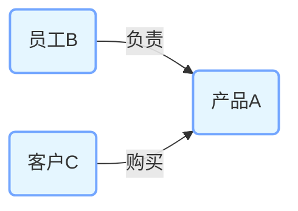

# 构建AI驱动的企业知识管理系统：智能知识图谱

> 关键词：AI、企业知识管理系统、智能知识图谱、知识表示、知识推理

> 摘要：本文深入探讨了如何构建AI驱动的企业知识管理系统——智能知识图谱。首先介绍了相关背景，包括目的、预期读者等内容。接着阐述了智能知识图谱的核心概念与联系，通过文本示意图和Mermaid流程图进行清晰展示。详细讲解了核心算法原理，并用Python源代码进行阐述，同时给出了相关数学模型和公式及举例说明。在项目实战部分，提供了开发环境搭建、源代码实现及解读等内容。还探讨了实际应用场景，推荐了相关工具和资源。最后总结了未来发展趋势与挑战，并给出常见问题解答和参考资料，旨在为企业构建智能知识图谱的知识管理系统提供全面而深入的技术指导。

## 1. 背景介绍 
### 1.1 目的和范围
在当今数字化时代，企业积累了海量的知识和信息，这些知识分散在各个部门、系统和员工的头脑中，缺乏有效的整合和管理。构建AI驱动的企业知识管理系统——智能知识图谱的目的在于实现企业知识的高效组织、存储、检索和应用，提升企业的知识利用效率，促进知识的共享和创新。

本文章的范围涵盖了智能知识图谱的基本概念、核心算法、数学模型、项目实战、实际应用场景以及相关工具和资源推荐等方面，旨在为企业和技术人员提供全面的技术指导，帮助他们理解和构建智能知识图谱的企业知识管理系统。

### 1.2 预期读者
本文的预期读者包括企业的知识管理部门人员、IT技术人员、人工智能开发者、软件架构师以及对企业知识管理和智能知识图谱感兴趣的研究人员。这些读者可能具有不同的技术背景和专业知识，本文将以深入浅出的方式进行讲解，使不同层次的读者都能从中获得有价值的信息。

### 1.3 文档结构概述
本文将按照以下结构进行阐述：首先介绍背景信息，包括目的、预期读者和文档结构概述等；接着讲解智能知识图谱的核心概念与联系，通过文本示意图和流程图进行直观展示；然后详细阐述核心算法原理和具体操作步骤，并用Python代码进行说明；之后介绍数学模型和公式，并举例说明；在项目实战部分，提供开发环境搭建、源代码实现及解读等内容；再探讨实际应用场景；接着推荐相关的工具和资源；最后总结未来发展趋势与挑战，给出常见问题解答和参考资料。

### 1.4 术语表
#### 1.4.1 核心术语定义
- **智能知识图谱**：是一种基于图的数据结构，由实体（节点）和关系（边）组成，用于表示企业的知识和信息，结合人工智能技术实现知识的智能管理和应用。
- **知识表示**：将企业的知识和信息以计算机能够理解和处理的方式进行表示，例如使用三元组（实体1，关系，实体2）来表示知识。
- **知识推理**：利用已有的知识和规则，推导出新的知识和结论的过程。
- **实体**：指知识图谱中的对象，例如企业的产品、员工、客户等。
- **关系**：指实体之间的联系，例如“属于”、“负责”、“购买”等。

#### 1.4.2 相关概念解释
- **语义网络**：是一种知识表示方法，通过节点和边来表示概念和概念之间的关系，与知识图谱有相似之处，但知识图谱更强调结构化和标准化。
- **本体**：是对概念和概念之间关系的一种形式化描述，用于定义知识图谱的语义和结构。
- **机器学习**：是人工智能的一个分支，通过数据和算法让计算机自动学习和改进，在知识图谱中可用于实体识别、关系抽取等任务。

#### 1.4.3 缩略词列表
- **AI**：Artificial Intelligence，人工智能
- **KG**：Knowledge Graph，知识图谱
- **NLP**：Natural Language Processing，自然语言处理

## 2. 核心概念与联系 
智能知识图谱的核心概念包括实体、关系和属性。实体是知识图谱中的基本对象，例如企业的产品、员工、客户等。关系表示实体之间的联系，例如“属于”、“负责”、“购买”等。属性则是实体的特征和描述，例如产品的价格、员工的职位等。

### 文本示意图
智能知识图谱可以用一个图来表示，其中节点表示实体，边表示关系。例如，一个简单的企业知识图谱可能包含以下实体和关系：
- 实体：产品A、员工B、客户C
- 关系：员工B负责产品A，客户C购买产品A

可以用如下文本示意图表示：
```plaintext
员工B --[负责]--> 产品A
客户C --[购买]--> 产品A
```

### Mermaid流程图


智能知识图谱的核心联系在于通过实体和关系的组合，将企业的知识和信息进行有机整合。通过知识图谱，我们可以方便地查询和推理企业的知识，例如查询某个员工负责的产品，或者推理某个客户可能感兴趣的产品。

## 3. 核心算法原理 & 具体操作步骤 
### 实体识别算法
实体识别是知识图谱构建的重要步骤，其目的是从文本中识别出实体。一种常用的实体识别算法是基于条件随机场（CRF）的算法。

#### 算法原理
条件随机场是一种概率图模型，用于对序列数据进行标注。在实体识别中，我们将文本看作一个序列，每个词看作一个节点，通过学习词之间的上下文信息来预测每个词的实体标签。

#### Python源代码实现
```python
import nltk
from nltk.corpus import conll2002
from nltk.tag import CRFTagger

# 加载数据
train_sents = list(conll2002.iob_sents('esp.train'))
test_sents = list(conll2002.iob_sents('esp.testb'))

# 训练CRF模型
ct = CRFTagger()
ct.train(train_sents, 'model.crf.tagger')

# 测试模型
print(ct.evaluate(test_sents))
```

### 关系抽取算法
关系抽取是从文本中提取实体之间的关系。一种常用的关系抽取算法是基于深度学习的算法，例如卷积神经网络（CNN）。

#### 算法原理
卷积神经网络通过卷积层提取文本的特征，然后通过全连接层进行分类，判断实体之间的关系。

#### Python源代码实现
```python
import torch
import torch.nn as nn
import torch.optim as optim
from torch.utils.data import Dataset, DataLoader

# 定义数据集类
class RelationDataset(Dataset):
    def __init__(self, data, labels):
        self.data = data
        self.labels = labels

    def __len__(self):
        return len(self.data)

    def __getitem__(self, idx):
        return self.data[idx], self.labels[idx]

# 定义卷积神经网络模型
class CNNRelationExtractor(nn.Module):
    def __init__(self, vocab_size, embedding_dim, hidden_dim, output_dim):
        super(CNNRelationExtractor, self).__init__()
        self.embedding = nn.Embedding(vocab_size, embedding_dim)
        self.conv1 = nn.Conv1d(embedding_dim, hidden_dim, kernel_size=3, padding=1)
        self.fc = nn.Linear(hidden_dim, output_dim)

    def forward(self, x):
        x = self.embedding(x)
        x = x.permute(0, 2, 1)
        x = self.conv1(x)
        x = torch.max(x, dim=2)[0]
        x = self.fc(x)
        return x

# 训练模型
vocab_size = 10000
embedding_dim = 100
hidden_dim = 200
output_dim = 10
model = CNNRelationExtractor(vocab_size, embedding_dim, hidden_dim, output_dim)
criterion = nn.CrossEntropyLoss()
optimizer = optim.Adam(model.parameters(), lr=0.001)

# 加载数据
data = torch.randint(0, vocab_size, (100, 20))
labels = torch.randint(0, output_dim, (100,))
dataset = RelationDataset(data, labels)
dataloader = DataLoader(dataset, batch_size=10, shuffle=True)

# 训练模型
for epoch in range(10):
    for inputs, targets in dataloader:
        optimizer.zero_grad()
        outputs = model(inputs)
        loss = criterion(outputs, targets)
        loss.backward()
        optimizer.step()
    print(f'Epoch {epoch+1}, Loss: {loss.item()}')
```

### 具体操作步骤
1. **数据收集**：收集企业的各种知识和信息，包括文档、报表、数据库等。
2. **数据预处理**：对收集到的数据进行清洗、分词、标注等预处理操作。
3. **实体识别**：使用实体识别算法从预处理后的数据中识别出实体。
4. **关系抽取**：使用关系抽取算法从预处理后的数据中提取实体之间的关系。
5. **知识图谱构建**：将识别出的实体和抽取的关系组合成知识图谱。
6. **知识图谱存储**：将构建好的知识图谱存储到数据库中，例如图数据库。
7. **知识图谱查询和推理**：使用查询语言和推理算法对知识图谱进行查询和推理。

## 4. 数学模型和公式 & 详细讲解 & 举例说明 
### 条件随机场（CRF）模型
#### 数学模型
条件随机场是一种概率图模型，其数学模型可以表示为：
$$
P(y|x) = \frac{1}{Z(x)} \exp\left(\sum_{i=1}^{n} \sum_{k=1}^{K} \lambda_k f_k(y_{i-1}, y_i, x, i)\right)
$$
其中，$x$ 是输入序列，$y$ 是输出序列，$Z(x)$ 是归一化因子，$\lambda_k$ 是特征函数 $f_k$ 的权重。

#### 详细讲解
条件随机场通过特征函数来捕捉序列中相邻元素之间的依赖关系。特征函数可以是基于词的特征、词性的特征等。通过学习特征函数的权重，条件随机场可以对序列进行标注。

#### 举例说明
假设我们有一个句子 “John works at Google”，我们要对这个句子进行实体识别，标注出人名和组织机构名。我们可以定义以下特征函数：
- $f_1(y_{i-1}, y_i, x, i) = 1$ 如果 $y_i$ 是人名且 $x_i$ 是 “John”
- $f_2(y_{i-1}, y_i, x, i) = 1$ 如果 $y_i$ 是组织机构名且 $x_i$ 是 “Google”

通过学习这些特征函数的权重，条件随机场可以正确地标注出 “John” 是人名，“Google” 是组织机构名。

### 卷积神经网络（CNN）模型
#### 数学模型
卷积神经网络的数学模型可以表示为：
$$
y = f(W \ast x + b)
$$
其中，$x$ 是输入数据，$W$ 是卷积核，$\ast$ 表示卷积操作，$b$ 是偏置，$f$ 是激活函数。

#### 详细讲解
卷积神经网络通过卷积层提取输入数据的特征。卷积核在输入数据上滑动，进行卷积操作，得到特征图。通过多个卷积层和池化层的组合，卷积神经网络可以提取不同层次的特征。

#### 举例说明
假设我们有一个文本序列，每个词用一个向量表示。我们可以使用一个卷积核来提取文本的特征。例如，一个大小为 3 的卷积核可以提取相邻三个词的特征。通过多个卷积核的组合，我们可以提取不同的特征。

## 5. 项目实战：代码实际案例和详细解释说明 
### 5.1  开发环境搭建
#### 安装Python
首先需要安装Python，建议使用Python 3.7及以上版本。可以从Python官方网站（https://www.python.org/downloads/）下载并安装。

#### 安装相关库
使用以下命令安装项目所需的相关库：
```sh
pip install nltk torch transformers
```

#### 安装图数据库
可以选择使用Neo4j作为图数据库。从Neo4j官方网站（https://neo4j.com/download/）下载并安装Neo4j社区版。

### 5.2  源代码详细实现和代码解读
#### 实体识别代码实现
```python
import nltk
from nltk.corpus import conll2002
from nltk.tag import CRFTagger

# 下载数据
nltk.download('conll2002')

# 加载数据
train_sents = list(conll2002.iob_sents('esp.train'))
test_sents = list(conll2002.iob_sents('esp.testb'))

# 训练CRF模型
ct = CRFTagger()
ct.train(train_sents, 'model.crf.tagger')

# 测试模型
print(ct.evaluate(test_sents))

# 对新句子进行实体识别
new_sentence = 'Juan trabaja en la empresa XYZ.'
tags = ct.tag(new_sentence.split())
print(tags)
```

#### 代码解读
1. **数据下载**：使用 `nltk.download('conll2002')` 下载CoNLL 2002数据集。
2. **数据加载**：使用 `conll2002.iob_sents` 加载训练集和测试集。
3. **模型训练**：使用 `CRFTagger` 训练CRF模型，并保存到 `model.crf.tagger` 文件中。
4. **模型测试**：使用 `evaluate` 方法评估模型的准确率。
5. **实体识别**：使用 `tag` 方法对新句子进行实体识别。

#### 关系抽取代码实现
```python
import torch
import torch.nn as nn
import torch.optim as optim
from torch.utils.data import Dataset, DataLoader
from transformers import BertTokenizer, BertModel

# 定义数据集类
class RelationDataset(Dataset):
    def __init__(self, texts, labels, tokenizer, max_length):
        self.texts = texts
        self.labels = labels
        self.tokenizer = tokenizer
        self.max_length = max_length

    def __len__(self):
        return len(self.texts)

    def __getitem__(self, idx):
        text = self.texts[idx]
        label = self.labels[idx]
        encoding = self.tokenizer.encode_plus(
            text,
            add_special_tokens=True,
            max_length=self.max_length,
            padding='max_length',
            truncation=True,
            return_tensors='pt'
        )
        return {
            'input_ids': encoding['input_ids'].flatten(),
            'attention_mask': encoding['attention_mask'].flatten(),
            'labels': torch.tensor(label, dtype=torch.long)
        }

# 定义关系抽取模型
class RelationExtractor(nn.Module):
    def __init__(self, num_classes):
        super(RelationExtractor, self).__init__()
        self.bert = BertModel.from_pretrained('bert-base-multilingual-cased')
        self.fc = nn.Linear(self.bert.config.hidden_size, num_classes)

    def forward(self, input_ids, attention_mask):
        outputs = self.bert(input_ids=input_ids, attention_mask=attention_mask)
        pooled_output = outputs.pooler_output
        logits = self.fc(pooled_output)
        return logits

# 训练模型
texts = ['Juan trabaja en la empresa XYZ.', 'María es amiga de Pedro.']
labels = [0, 1]
tokenizer = BertTokenizer.from_pretrained('bert-base-multilingual-cased')
max_length = 128
dataset = RelationDataset(texts, labels, tokenizer, max_length)
dataloader = DataLoader(dataset, batch_size=2, shuffle=True)

num_classes = 2
model = RelationExtractor(num_classes)
criterion = nn.CrossEntropyLoss()
optimizer = optim.Adam(model.parameters(), lr=2e-5)

for epoch in range(3):
    for batch in dataloader:
        input_ids = batch['input_ids']
        attention_mask = batch['attention_mask']
        labels = batch['labels']

        optimizer.zero_grad()
        logits = model(input_ids, attention_mask)
        loss = criterion(logits, labels)
        loss.backward()
        optimizer.step()
    print(f'Epoch {epoch+1}, Loss: {loss.item()}')
```

#### 代码解读
1. **数据集类定义**：定义 `RelationDataset` 类，用于加载和处理数据。
2. **模型定义**：定义 `RelationExtractor` 类，使用BERT模型作为特征提取器，然后通过全连接层进行分类。
3. **数据加载**：使用 `DataLoader` 加载数据集。
4. **模型训练**：使用交叉熵损失函数和Adam优化器训练模型。

### 5.3  代码解读与分析
#### 实体识别代码分析
- **优点**：CRF模型可以利用上下文信息进行实体识别，准确率较高。
- **