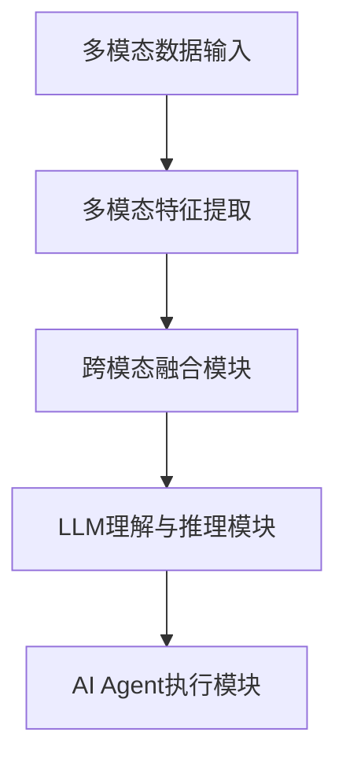

# 构建LLM支持的AI Agent多模态事件理解

> 关键词：LLM、AI Agent、多模态事件理解、自然语言处理、计算机视觉、跨模态融合

> 摘要：本文聚焦于构建由大语言模型（LLM）支持的AI Agent多模态事件理解系统。首先介绍了相关背景，包括目的范围、预期读者等。接着阐述核心概念与联系，通过文本示意图和Mermaid流程图进行清晰展示。详细讲解了核心算法原理，并用Python代码说明具体操作步骤，同时给出数学模型和公式并举例。在项目实战部分，从开发环境搭建到源代码实现及解读进行了全面阐述。还探讨了实际应用场景，推荐了学习、开发相关的工具和资源，最后总结了未来发展趋势与挑战，并提供常见问题解答和扩展阅读参考资料，旨在为相关领域的研究者和开发者提供全面且深入的技术指导。

## 1. 背景介绍 
### 1.1 目的和范围
在当今数字化时代，信息呈现出多样化和多模态的特点，单一模态的数据已无法满足复杂场景下的理解需求。构建LLM支持的AI Agent多模态事件理解系统的目的在于让AI Agent能够像人类一样，综合处理文本、图像、音频等多种模态的信息，从而更准确、全面地理解现实世界中的事件。本系统的范围涵盖了从多模态数据的采集、处理、融合，到基于LLM的事件理解和推理等多个环节。

### 1.2 预期读者
本文预期读者包括自然语言处理、计算机视觉、人工智能等领域的研究者和开发者，对多模态技术感兴趣的学生，以及希望将多模态事件理解应用于实际项目的企业技术人员。

### 1.3 文档结构概述
本文将按照以下结构展开：首先介绍核心概念与联系，帮助读者建立基本的知识框架；接着详细讲解核心算法原理和具体操作步骤，为实际开发提供理论支持；然后给出数学模型和公式，并通过举例加深理解；在项目实战部分，将介绍开发环境搭建、源代码实现和代码解读；之后探讨实际应用场景；再推荐相关的工具和资源；最后总结未来发展趋势与挑战，提供常见问题解答和扩展阅读参考资料。

### 1.4 术语表
#### 1.4.1 核心术语定义
- **LLM（Large Language Model）**：大语言模型，是一种基于深度学习的语言模型，通过在大规模文本数据上进行训练，能够生成自然语言文本、回答问题等。
- **AI Agent**：人工智能代理，是一种能够感知环境、做出决策并执行行动的智能实体。
- **多模态事件理解**：指综合处理文本、图像、音频等多种模态的数据，以理解现实世界中的事件。
- **跨模态融合**：将不同模态的数据进行整合和处理，以获取更全面的信息。

#### 1.4.2 相关概念解释
- **自然语言处理（NLP）**：研究如何让计算机理解和处理人类语言的技术，包括文本分类、情感分析、机器翻译等任务。
- **计算机视觉（CV）**：研究如何让计算机理解和处理图像和视频的技术，包括目标检测、图像分类、语义分割等任务。
- **深度学习**：一种基于神经网络的机器学习方法，通过多层神经元的非线性变换来学习数据的特征和模式。

#### 1.4.3 缩略词列表
- **LLM**：Large Language Model
- **AI**：Artificial Intelligence
- **NLP**：Natural Language Processing
- **CV**：Computer Vision
- **CNN**：Convolutional Neural Network
- **RNN**：Recurrent Neural Network
- **Transformer**：一种基于自注意力机制的深度学习模型

## 2. 核心概念与联系 
### 核心概念原理
LLM支持的AI Agent多模态事件理解系统主要涉及三个核心概念：LLM、AI Agent和多模态事件理解。LLM作为语言理解和生成的核心组件，能够处理文本信息并生成自然语言回复。AI Agent则是整个系统的执行主体，它能够感知环境中的多模态数据，调用LLM进行事件理解和推理，并根据推理结果做出决策和执行行动。多模态事件理解是系统的目标，通过融合文本、图像、音频等多种模态的数据，AI Agent能够更全面地理解现实世界中的事件。

### 架构的文本示意图
```plaintext
+-------------------+
| 多模态数据输入    |
| (文本、图像、音频)|
+-------------------+
          |
          v
+-------------------+
| 多模态特征提取    |
| (NLP、CV、音频处理)|
+-------------------+
          |
          v
+-------------------+
| 跨模态融合模块    |
| (特征拼接、注意力机制等)|
+-------------------+
          |
          v
+-------------------+
| LLM理解与推理模块 |
| (事件理解、决策生成)|
+-------------------+
          |
          v
+-------------------+
| AI Agent执行模块  |
| (行动决策、任务执行)|
+-------------------+
```

### Mermaid流程图


## 3. 核心算法原理 & 具体操作步骤 
### 核心算法原理
本系统的核心算法主要包括多模态特征提取、跨模态融合和LLM理解与推理三个部分。

#### 多模态特征提取
- **文本特征提取**：可以使用预训练的语言模型（如BERT、GPT等）来提取文本的特征。这些模型在大规模文本数据上进行了预训练，能够学习到语言的语义和语法信息。
- **图像特征提取**：常用的方法是使用卷积神经网络（CNN），如ResNet、VGG等。这些网络可以自动学习图像的特征，将图像转换为向量表示。
- **音频特征提取**：可以使用Mel频率倒谱系数（MFCC）、对数梅尔频谱等方法来提取音频的特征。

#### 跨模态融合
跨模态融合的目的是将不同模态的特征进行整合，以获取更全面的信息。常用的方法包括特征拼接、注意力机制等。

#### LLM理解与推理
使用预训练的LLM（如GPT-3、ChatGPT等）对融合后的特征进行处理，进行事件理解和推理。LLM可以根据输入的信息生成自然语言回复，并做出决策。

### 具体操作步骤（Python代码示例）
```python
import torch
from transformers import AutoTokenizer, AutoModel
import torchvision.models as models
import librosa
import numpy as np

# 文本特征提取
def text_feature_extraction(text):
    tokenizer = AutoTokenizer.from_pretrained('bert-base-uncased')
    model = AutoModel.from_pretrained('bert-base-uncased')
    inputs = tokenizer(text, return_tensors='pt')
    outputs = model(**inputs)
    text_features = outputs.last_hidden_state.mean(dim=1).squeeze()
    return text_features

# 图像特征提取
def image_feature_extraction(image):
    resnet = models.resnet18(pretrained=True)
    resnet.eval()
    image = torch.randn(1, 3, 224, 224)  # 示例图像
    with torch.no_grad():
        image_features = resnet(image).squeeze()
    return image_features

# 音频特征提取
def audio_feature_extraction(audio_path):
    audio, sr = librosa.load(audio_path)
    mfccs = librosa.feature.mfcc(y=audio, sr=sr, n_mfcc=13)
    audio_features = np.mean(mfccs, axis=1)
    return torch.tensor(audio_features)

# 跨模态融合（特征拼接）
def cross_modal_fusion(text_features, image_features, audio_features):
    features = torch.cat((text_features, image_features, audio_features), dim=0)
    return features

# 示例使用
text = "这是一个示例文本"
image = None  # 这里可以替换为实际的图像
audio_path = "example_audio.wav"

text_features = text_feature_extraction(text)
image_features = image_feature_extraction(image)
audio_features = audio_feature_extraction(audio_path)

fused_features = cross_modal_fusion(text_features, image_features, audio_features)
print(fused_features.shape)
```

## 4. 数学模型和公式 & 详细讲解 & 举例说明 
### 多模态特征提取
#### 文本特征提取
假设输入的文本为 $x_{text} = [w_1, w_2, \cdots, w_n]$，其中 $w_i$ 表示第 $i$ 个词。使用预训练的语言模型 $M_{text}$ 对文本进行编码，得到每个词的隐藏状态 $h_i$：
$$h_i = M_{text}(w_i)$$
然后将所有词的隐藏状态进行平均，得到文本的特征向量 $f_{text}$：
$$f_{text} = \frac{1}{n} \sum_{i=1}^{n} h_i$$

#### 图像特征提取
假设输入的图像为 $x_{image}$，使用卷积神经网络 $M_{image}$ 对图像进行特征提取，得到图像的特征向量 $f_{image}$：
$$f_{image} = M_{image}(x_{image})$$

#### 音频特征提取
假设输入的音频信号为 $x_{audio}$，使用音频特征提取方法（如MFCC）得到音频的特征矩阵 $F_{audio}$，然后对矩阵的每一列进行平均，得到音频的特征向量 $f_{audio}$：
$$f_{audio} = \frac{1}{m} \sum_{j=1}^{m} F_{audio}^j$$
其中 $m$ 是特征矩阵的列数。

### 跨模态融合
#### 特征拼接
将文本、图像和音频的特征向量进行拼接，得到融合后的特征向量 $f_{fused}$：
$$f_{fused} = [f_{text}; f_{image}; f_{audio}]$$

#### 注意力机制
假设文本、图像和音频的特征向量分别为 $f_{text}$、$f_{image}$ 和 $f_{audio}$，注意力机制可以计算每个模态的权重，然后对特征向量进行加权求和。具体步骤如下：
1. 计算每个模态的注意力分数 $s_i$：
$$s_{text} = W_{text} f_{text}$$
$$s_{image} = W_{image} f_{image}$$
$$s_{audio} = W_{audio} f_{audio}$$
其中 $W_{text}$、$W_{image}$ 和 $W_{audio}$ 是可学习的权重矩阵。
2. 对注意力分数进行softmax归一化，得到每个模态的注意力权重 $a_i$：
$$a_{text} = \frac{\exp(s_{text})}{\exp(s_{text}) + \exp(s_{image}) + \exp(s_{audio})}$$
$$a_{image} = \frac{\exp(s_{image})}{\exp(s_{text}) + \exp(s_{image}) + \exp(s_{audio})}$$
$$a_{audio} = \frac{\exp(s_{audio})}{\exp(s_{text}) + \exp(s_{image}) + \exp(s_{audio})}$$
3. 对特征向量进行加权求和，得到融合后的特征向量 $f_{fused}$：
$$f_{fused} = a_{text} f_{text} + a_{image} f_{image} + a_{audio} f_{audio}$$

### 举例说明
假设文本特征向量 $f_{text} = [0.1, 0.2, 0.3]$，图像特征向量 $f_{image} = [0.4, 0.5, 0.6]$，音频特征向量 $f_{audio} = [0.7, 0.8, 0.9]$。

#### 特征拼接
融合后的特征向量为：
$$f_{fused} = [0.1, 0.2, 0.3, 0.4, 0.5, 0.6, 0.7, 0.8, 0.9]$$

#### 注意力机制
假设注意力权重矩阵 $W_{text} = [1, 0, 0]$，$W_{image} = [0, 1, 0]$，$W_{audio} = [0, 0, 1]$，则注意力分数为：
$$s_{text} = 0.1$$
$$s_{image} = 0.5$$
$$s_{audio} = 0.9$$
注意力权重为：
$$a_{text} = \frac{\exp(0.1)}{\exp(0.1) + \exp(0.5) + \exp(0.9)} \approx 0.2$$
$$a_{image} = \frac{\exp(0.5)}{\exp(0.1) + \exp(0.5) + \exp(0.9)} \approx 0.3$$
$$a_{audio} = \frac{\exp(0.9)}{\exp(0.1) + \exp(0.5) + \exp(0.9)} \approx 0.5$$
融合后的特征向量为：
$$f_{fused} = 0.2 \times [0.1, 0.2, 0.3] + 0.3 \times [0.4, 0.5, 0.6] + 0.5 \times [0.7, 0.8, 0.9]$$
$$= [0.02 + 0.12 + 0.35, 0.04 + 0.15 + 0.4, 0.06 + 0.18 + 0.45]$$
$$= [0.49, 0.59, 0.69]$$

## 5. 项目实战：代码实际案例和详细解释说明 
### 5.1  开发环境搭建
#### 安装Python
确保已经安装了Python 3.7及以上版本。可以从Python官方网站（https://www.python.org/downloads/）下载并安装。

#### 创建虚拟环境
使用虚拟环境可以避免不同项目之间的依赖冲突。可以使用`venv`模块创建虚拟环境：
```bash
python -m venv myenv
```
激活虚拟环境：
- 在Windows上：
```bash
myenv\Scripts\activate
```
- 在Linux/Mac上：
```bash
source myenv/bin/activate
```

#### 安装依赖库
在虚拟环境中安装所需的依赖库：
```bash
pip install torch transformers torchvision librosa
```

### 5.2  源代码详细实现和代码解读
```python
import torch
from transformers import AutoTokenizer, AutoModel
import torchvision.models as models
import librosa
import numpy as np

# 文本特征提取
def text_feature_extraction(text):
    # 加载预训练的BERT分词器和模型
    tokenizer = AutoTokenizer.from_pretrained('bert-base-uncased')
    model = AutoModel.from_pretrained('bert-base-uncased')
    # 对输入文本进行分词并转换为PyTorch张量
    inputs = tokenizer(text, return_tensors='pt')
    # 输入文本通过BERT模型得到输出
    outputs = model(**inputs)
    # 取最后一层隐藏状态的平均值作为文本特征
    text_features = outputs.last_hidden_state.mean(dim=1).squeeze()
    return text_features

# 图像特征提取
def image_feature_extraction(image):
    # 加载预训练的ResNet-18模型
    resnet = models.resnet18(pretrained=True)
    # 设置模型为评估模式
    resnet.eval()
    # 示例图像，实际应用中需要替换为真实图像
    image = torch.randn(1, 3, 224, 224)
    with torch.no_grad():
        # 图像通过ResNet-18模型得到特征
        image_features = resnet(image).squeeze()
    return image_features

# 音频特征提取
def audio_feature_extraction(audio_path):
    # 加载音频文件
    audio, sr = librosa.load(audio_path)
    # 提取MFCC特征
    mfccs = librosa.feature.mfcc(y=audio, sr=sr, n_mfcc=13)
    # 对MFCC特征矩阵的每一列求平均值得到音频特征
    audio_features = np.mean(mfccs, axis=1)
    return torch.tensor(audio_features)

# 跨模态融合（特征拼接）
def cross_modal_fusion(text_features, image_features, audio_features):
    # 将文本、图像和音频特征拼接在一起
    features = torch.cat((text_features, image_features, audio_features), dim=0)
    return features

# 示例使用
text = "这是一个示例文本"
image = None  # 这里可以替换为实际的图像
audio_path = "example_audio.wav"

# 提取文本特征
text_features = text_feature_extraction(text)
# 提取图像特征
image_features = image_feature_extraction(image)
# 提取音频特征
audio_features = audio_feature_extraction(audio_path)

# 进行跨模态融合
fused_features = cross_modal_fusion(text_features, image_features, audio_features)
print(fused_features.shape)
```

### 5.3  代码解读与分析
- **文本特征提取**：使用`transformers`库中的`AutoTokenizer`和`AutoModel`加载预训练的BERT模型，对输入文本进行分词和编码，然后取最后一层隐藏状态的平均值作为文本特征。
- **图像特征提取**：使用`torchvision`库中的`resnet18`模型，将图像输入到模型中得到图像特征。
- **音频特征提取**：使用`librosa`库加载音频文件，并提取MFCC特征，对特征矩阵的每一列求平均值得到音频特征。
- **跨模态融合**：使用`torch.cat`函数将文本、图像和音频特征拼接在一起，得到融合后的特征向量。

## 6. 实际应用场景 
### 智能安防
在智能安防系统中，AI Agent可以通过监控摄像头获取视频图像，通过麦克风获取音频信息，同时结合报警文本信息，综合分析是否存在异常事件，如入侵、火灾等。例如，当摄像头检测到有人进入禁区，同时麦克风接收到异常的声音，并且报警文本提示可能存在危险时，AI Agent可以快速做出响应，通知安保人员。

### 智能客服
在智能客服场景中，AI Agent可以同时处理客户的文本咨询、语音提问和发送的图片信息。例如，客户在咨询产品问题时，可能会发送一张产品的图片并描述问题，AI Agent可以通过多模态事件理解，更准确地理解客户的需求，提供更精准的解决方案。

### 自动驾驶
在自动驾驶领域，AI Agent需要处理来自摄像头、雷达、激光雷达等多种传感器的信息，包括图像、点云数据等。通过多模态事件理解，AI Agent可以更好地识别道路、交通标志、其他车辆和行人，做出更安全、合理的驾驶决策。

### 医疗诊断
在医疗诊断中，AI Agent可以结合患者的病历文本、医学影像（如X光、CT等）和音频信息（如心脏听诊、呼吸音等）进行综合分析，辅助医生进行疾病诊断。例如，通过分析患者的病历文本了解症状和病史，通过医学影像检测病变，通过音频信息判断器官功能，从而提高诊断的准确性。

## 7. 工具和资源推荐
### 7.1 学习资源推荐
#### 7.1.1 书籍推荐
- 《深度学习》（Deep Learning）：由Ian Goodfellow、Yoshua Bengio和Aaron Courville所著，是深度学习领域的经典教材，涵盖了神经网络、卷积神经网络、循环神经网络等多个方面的内容。
- 《自然语言处理入门》：作者何晗，适合初学者入门自然语言处理，介绍了文本分类、情感分析、命名实体识别等常见任务的实现方法。
- 《计算机视觉：算法与应用》（Computer Vision: Algorithms and Applications）：Richard Szeliski所著，全面介绍了计算机视觉的基本概念、算法和应用，包括图像滤波、特征提取、目标检测等内容。

#### 7.1.2 在线课程
- Coursera上的“深度学习专项课程”（Deep Learning Specialization）：由Andrew Ng教授授课，包括神经网络和深度学习、改善深层神经网络、结构化机器学习项目等多个课程，深入讲解了深度学习的理论和实践。
- edX上的“自然语言处理基础”（Foundations of Natural Language Processing）：介绍了自然语言处理的基本概念和方法，包括词法分析、句法分析、语义分析等内容。
- Udemy上的“计算机视觉实战：OpenCV与Python”（Computer Vision with OpenCV and Python）：通过实际项目介绍了如何使用OpenCV和Python进行计算机视觉开发，包括图像滤波、特征提取、目标检测等任务。

#### 7.1.3 技术博客和网站
- Medium：上面有很多关于人工智能、自然语言处理、计算机视觉等领域的技术博客文章，作者来自世界各地的研究者和开发者。
- arXiv：是一个预印本平台，提供了大量的学术论文，包括人工智能领域的最新研究成果。
- Hugging Face：是一个专注于自然语言处理的开源社区，提供了大量的预训练模型、数据集和工具，方便开发者进行研究和开发。

### 7.2 开发工具框架推荐
#### 7.2.1 IDE和编辑器
- PyCharm：是一款专门为Python开发设计的集成开发环境（IDE），提供了代码编辑、调试、版本控制等功能，适合专业开发者使用。
- Jupyter Notebook：是一个交互式的开发环境，支持Python、R等多种编程语言，方便进行数据探索、模型训练和结果可视化。
- Visual Studio Code：是一款轻量级的代码编辑器，支持多种编程语言和插件扩展，具有丰富的代码编辑和调试功能。

#### 7.2.2 调试和性能分析工具
- PyTorch Profiler：是PyTorch提供的性能分析工具，可以帮助开发者分析模型的运行时间、内存使用等情况，优化模型性能。
- TensorBoard：是TensorFlow提供的可视化工具，也可以用于PyTorch模型的可视化，支持查看模型的训练过程、损失曲线、梯度分布等信息。
- cProfile：是Python标准库中的性能分析工具，可以分析Python代码的运行时间和函数调用次数，帮助开发者找出性能瓶颈。

#### 7.2.3 相关框架和库
- PyTorch：是一个开源的深度学习框架，提供了丰富的神经网络层和优化算法，支持GPU加速，广泛应用于自然语言处理、计算机视觉等领域。
- TensorFlow：是另一个流行的深度学习框架，具有强大的分布式训练和模型部署能力，也提供了丰富的工具和库。
- OpenCV：是一个开源的计算机视觉库，提供了大量的图像处理和计算机视觉算法，包括图像滤波、特征提取、目标检测等功能。

### 7.3 相关论文著作推荐
#### 7.3.1 经典论文
- “Attention Is All You Need”：提出了Transformer模型，是自然语言处理领域的重要突破，为后续的大语言模型发展奠定了基础。
- “ImageNet Classification with Deep Convolutional Neural Networks”：介绍了AlexNet模型，开启了深度学习在计算机视觉领域的大规模应用。
- “Sequence to Sequence Learning with Neural Networks”：提出了序列到序列（Seq2Seq）模型，用于处理自然语言处理中的机器翻译等任务。

#### 7.3.2 最新研究成果
- 关注arXiv上的最新论文，特别是关于多模态学习、大语言模型等方面的研究成果。例如，一些研究尝试将LLM与多模态数据结合，提高AI Agent的多模态事件理解能力。
- 参加相关的学术会议，如NeurIPS、ICML、CVPR等，了解最新的研究动态和技术趋势。

#### 7.3.3 应用案例分析
- 一些知名科技公司的技术博客会分享他们在多模态事件理解方面的应用案例，如Google、Microsoft、Facebook等。通过学习这些案例，可以了解实际应用中的技术选型、模型优化和系统架构设计。

## 8. 总结：未来发展趋势与挑战
### 未来发展趋势
#### 更强大的LLM与多模态融合
随着大语言模型技术的不断发展，未来的LLM将具有更强的语言理解和生成能力，能够更好地处理多模态数据。同时，多模态融合的方法也将不断创新，提高AI Agent对多模态事件的理解精度。

#### 跨领域应用拓展
LLM支持的AI Agent多模态事件理解技术将在更多领域得到应用，如教育、金融、娱乐等。例如，在教育领域，AI Agent可以根据学生的文本提问、语音回答和表情图像，提供个性化的学习建议。

#### 智能化和自主化
AI Agent将变得更加智能化和自主化，能够在复杂的环境中自主感知、决策和执行行动。例如，在智能家居系统中，AI Agent可以根据用户的语音指令、行为图像和环境数据，自动调节家电设备的运行状态。

### 挑战
#### 数据融合和对齐问题
不同模态的数据具有不同的特征和分布，如何有效地将它们融合和对齐是一个挑战。例如，文本和图像的特征维度和语义信息差异较大，需要开发更有效的跨模态融合方法。

#### 计算资源和效率
处理多模态数据需要大量的计算资源，特别是在使用大语言模型时。如何提高计算效率，降低计算成本，是一个亟待解决的问题。

#### 语义理解和推理能力
虽然LLM在语言理解方面取得了很大进展，但在多模态事件理解中，仍然需要提高对语义的理解和推理能力。例如，如何从多模态数据中准确地理解事件的因果关系和上下文信息。

## 9. 附录：常见问题与解答
### 问题1：如何选择合适的预训练模型进行多模态特征提取？
解答：选择预训练模型时，需要考虑任务的特点和数据的类型。对于文本特征提取，可以选择在大规模文本数据上预训练的语言模型，如BERT、GPT等。对于图像特征提取，可以选择在ImageNet等大规模图像数据集上预训练的卷积神经网络，如ResNet、VGG等。对于音频特征提取，可以根据音频的类型和任务选择合适的预训练模型或特征提取方法。

### 问题2：跨模态融合时，特征拼接和注意力机制哪种方法更好？
解答：特征拼接和注意力机制各有优缺点。特征拼接简单直接，适用于模态之间信息互补性较强的情况。注意力机制可以根据不同模态的重要性动态分配权重，适用于模态之间信息重要性差异较大的情况。在实际应用中，可以根据具体任务和数据特点选择合适的方法，也可以将两种方法结合使用。

### 问题3：如何评估LLM支持的AI Agent多模态事件理解系统的性能？
解答：可以使用多种指标来评估系统的性能，如准确率、召回率、F1值等。对于文本理解任务，可以使用准确率和F1值来评估；对于图像和音频识别任务，可以使用准确率和召回率来评估。此外，还可以通过人工评估的方式，让人类专家对系统的输出结果进行评价，判断其是否符合实际情况。

## 10. 扩展阅读 & 参考资料
### 扩展阅读
- 《人工智能：一种现代的方法》（Artificial Intelligence: A Modern Approach）：全面介绍了人工智能的基本概念、算法和应用，是人工智能领域的经典教材。
- 《多模态机器学习：基础与应用》（Multimodal Machine Learning: Foundations and Applications）：专门介绍了多模态机器学习的理论和方法，包括多模态数据的表示、融合和分析等内容。
- 《深度学习实战》（Deep Learning in Practice）：通过实际项目介绍了深度学习的应用，包括图像识别、自然语言处理、语音识别等领域。

### 参考资料
- Hugging Face官方文档：https://huggingface.co/docs
- PyTorch官方文档：https://pytorch.org/docs/stable/index.html
- TensorFlow官方文档：https://www.tensorflow.org/api_docs
- OpenCV官方文档：https://docs.opencv.org/

作者：AI天才研究院/AI Genius Institute & 禅与计算机程序设计艺术 /Zen And The Art of Computer Programming