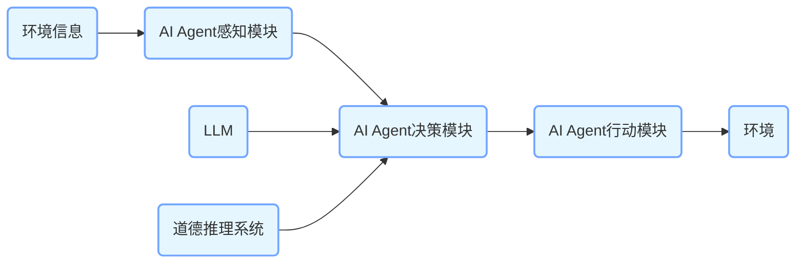

# 构建LLM支持的AI Agent道德推理系统

> 关键词：LLM（大语言模型）、AI Agent、道德推理系统、人工智能伦理、决策机制

> 摘要：本文聚焦于构建基于LLM支持的AI Agent道德推理系统。随着人工智能技术的飞速发展，AI Agent在各个领域的应用日益广泛，其决策和行为的道德性变得至关重要。文章首先介绍了构建该系统的背景，包括目的、预期读者、文档结构和相关术语。接着深入探讨了核心概念及其联系，详细阐述了核心算法原理和具体操作步骤，并给出了Python源代码示例。通过数学模型和公式进一步解释了系统的工作机制，并结合实际案例进行说明。在项目实战部分，介绍了开发环境搭建、源代码实现和代码解读。同时，分析了该系统的实际应用场景，推荐了相关的学习资源、开发工具和论文著作。最后，总结了系统的未来发展趋势与挑战，并对常见问题进行了解答，为构建更完善的AI Agent道德推理系统提供了全面的参考。

## 1. 背景介绍 
### 1.1 目的和范围
随着人工智能技术的不断进步，AI Agent已经广泛应用于医疗、金融、交通等众多领域。然而，AI Agent在做出决策和执行任务时可能会面临道德困境，例如自动驾驶汽车在遇到不可避免的碰撞时如何选择碰撞对象，医疗AI在资源分配时如何权衡不同患者的利益等。构建LLM支持的AI Agent道德推理系统的目的在于使AI Agent能够在复杂的情境中进行道德判断和推理，从而做出符合道德规范的决策。

本系统的范围涵盖了利用LLM的强大语言理解和生成能力，为AI Agent提供道德知识和推理框架。系统将考虑多种道德理论和原则，如功利主义、义务论等，并根据具体情境进行综合分析。同时，系统将支持不同领域的应用，确保AI Agent在各种场景下都能进行有效的道德推理。

### 1.2 预期读者
本文的预期读者包括人工智能领域的研究人员、开发者、伦理学家以及对AI道德问题感兴趣的相关人士。研究人员可以从本文中获取关于构建道德推理系统的理论和方法，为进一步的研究提供参考。开发者可以根据文章中的代码示例和实现步骤，将道德推理功能集成到自己的AI Agent项目中。伦理学家可以通过本文了解技术手段在解决AI道德问题中的应用，促进跨学科的交流与合作。

### 1.3 文档结构概述
本文将按照以下结构进行组织：
- 核心概念与联系：介绍LLM、AI Agent和道德推理系统的核心概念，以及它们之间的联系。
- 核心算法原理 & 具体操作步骤：详细阐述系统的核心算法原理，并给出具体的操作步骤和Python代码示例。
- 数学模型和公式 & 详细讲解 & 举例说明：通过数学模型和公式解释系统的工作机制，并结合实际案例进行说明。
- 项目实战：代码实际案例和详细解释说明：介绍开发环境搭建、源代码实现和代码解读。
- 实际应用场景：分析系统在不同领域的实际应用场景。
- 工具和资源推荐：推荐相关的学习资源、开发工具和论文著作。
- 总结：未来发展趋势与挑战：总结系统的未来发展趋势和面临的挑战。
- 附录：常见问题与解答：解答读者在构建系统过程中可能遇到的常见问题。
- 扩展阅读 & 参考资料：提供相关的扩展阅读材料和参考资料。

### 1.4 术语表
#### 1.4.1 核心术语定义
- **LLM（大语言模型）**：是一种基于深度学习的自然语言处理模型，具有强大的语言理解和生成能力，能够处理各种自然语言任务，如文本生成、问答系统等。
- **AI Agent**：是一种能够感知环境、进行决策并采取行动的人工智能实体。它可以自主地完成各种任务，如智能客服、自动驾驶等。
- **道德推理系统**：是一种能够根据道德原则和规范，对具体情境进行分析和判断，从而做出道德决策的系统。
- **道德困境**：指在决策过程中，面临多种相互冲突的道德原则和利益，难以做出符合所有道德要求的选择的情况。

#### 1.4.2 相关概念解释
- **功利主义**：是一种道德理论，认为行为的道德价值取决于其产生的总体利益。在功利主义的视角下，应该选择能够最大化总体幸福或利益的行为。
- **义务论**：强调行为的道德价值在于其本身是否符合道德义务和原则，而不考虑其后果。例如，遵守承诺、不伤害他人等都是义务论所强调的道德原则。
- **道德规范**：是社会或群体所公认的行为准则和道德标准，用于指导人们的行为和决策。

#### 1.4.3 缩略词列表
- **LLM**：Large Language Model（大语言模型）
- **AI**：Artificial Intelligence（人工智能）

## 2. 核心概念与联系 

### 核心概念原理
#### LLM（大语言模型）
LLM是基于Transformer架构的深度学习模型，通过在大规模文本数据上进行预训练，学习到语言的统计规律和语义信息。它可以接受文本输入，并生成自然语言的输出。例如，当输入一个问题时，LLM可以根据其学习到的知识和模式，生成相应的答案。

#### AI Agent
AI Agent是一个具有自主性的智能实体，它由感知模块、决策模块和行动模块组成。感知模块用于获取环境信息，决策模块根据感知到的信息和内部的知识进行决策，行动模块则根据决策结果采取相应的行动。例如，一个自动驾驶汽车可以看作是一个AI Agent，它通过传感器感知道路环境，决策模块根据感知信息决定行驶速度和方向，行动模块控制汽车的行驶。

#### 道德推理系统
道德推理系统是为AI Agent提供道德判断和决策支持的系统。它基于道德理论和原则，对AI Agent面临的情境进行分析和评估，为AI Agent提供符合道德规范的决策建议。例如，在医疗资源分配的场景中，道德推理系统可以根据患者的病情、预后等因素，结合公平、效益等道德原则，为AI Agent提供合理的资源分配方案。

### 架构的文本示意图
```plaintext
              +---------------------+
              |     LLM             |
              |  (大语言模型)       |
              +---------------------+
                     |
                     | 提供道德知识和推理能力
                     v
+---------------------+        +---------------------+
|     AI Agent        |        | 道德推理系统        |
| (感知、决策、行动) |        | (道德分析、判断)    |
+---------------------+        +---------------------+
```

### Mermaid流程图


该流程图展示了LLM、AI Agent和道德推理系统之间的交互过程。AI Agent的感知模块从环境中获取信息，决策模块结合LLM提供的知识和道德推理系统的建议进行决策，最后行动模块根据决策结果对环境产生影响。

## 3. 核心算法原理 & 具体操作步骤 

### 核心算法原理
本系统的核心算法基于LLM的文本生成能力和规则推理机制。具体来说，系统将AI Agent面临的情境以文本形式输入到LLM中，LLM根据其预训练的知识生成可能的道德判断和决策建议。同时，系统还会根据预设的道德规则和原则对生成的结果进行筛选和评估，确保决策符合道德要求。

### 具体操作步骤
#### 步骤1：情境表示
将AI Agent面临的情境转化为自然语言文本。例如，在自动驾驶汽车的场景中，情境可以表示为“前方道路突然出现行人，刹车来不及，此时有两条可选路径，一条会撞到行人，另一条会撞到路边的电线杆”。

#### 步骤2：LLM推理
将情境文本输入到LLM中，LLM生成可能的道德判断和决策建议。例如，LLM可能会生成“应该尽量避免撞到行人，选择撞到电线杆”。

#### 步骤3：规则评估
根据预设的道德规则和原则对LLM生成的结果进行评估。例如，预设的规则可能包括“不伤害无辜生命”，如果LLM生成的结果符合该规则，则认为该结果是合理的。

#### 步骤4：决策输出
将经过评估的合理决策建议输出给AI Agent，AI Agent根据建议进行决策和行动。

### Python源代码示例
```python
import openai

# 设置OpenAI API密钥
openai.api_key = "your_api_key"

def moral_reasoning(situation):
    # 步骤2：LLM推理
    prompt = f"在以下情境中，应该做出怎样的道德决策：{situation}"
    response = openai.Completion.create(
        engine="text-davinci-003",
        prompt=prompt,
        max_tokens=100
    )
    decision = response.choices[0].text.strip()
    
    # 步骤3：规则评估
    # 这里简单假设一个规则：不伤害无辜生命
    if "不伤害无辜生命" in decision.lower():
        valid_decision = True
    else:
        valid_decision = False
    
    if valid_decision:
        return decision
    else:
        return "未找到符合道德规则的决策"

# 步骤1：情境表示
situation = "前方道路突然出现行人，刹车来不及，此时有两条可选路径，一条会撞到行人，另一条会撞到路边的电线杆"

# 步骤4：决策输出
result = moral_reasoning(situation)
print(result)
```

在上述代码中，首先定义了一个`moral_reasoning`函数，该函数接受一个情境文本作为输入。在函数内部，使用OpenAI的API进行LLM推理，生成可能的决策建议。然后，根据预设的道德规则对生成的结果进行评估，如果符合规则，则返回该决策建议，否则返回“未找到符合道德规则的决策”。最后，定义了一个具体的情境，并调用`moral_reasoning`函数进行道德推理，将结果打印输出。

## 4. 数学模型和公式 & 详细讲解 & 举例说明 

### 数学模型
本系统的数学模型可以基于多属性决策理论。假设AI Agent面临的情境可以用一组属性 $A = \{a_1, a_2, \cdots, a_n\}$ 来描述，每个属性对应一个权重 $w_i$，表示该属性在道德决策中的重要性。同时，有 $m$ 个可选的决策方案 $D = \{d_1, d_2, \cdots, d_m\}$，每个决策方案在每个属性上有一个得分 $s_{ij}$，表示该决策方案在第 $i$ 个属性上的表现。

### 数学公式
决策方案 $d_j$ 的综合得分 $S_j$ 可以通过以下公式计算：
$$S_j = \sum_{i=1}^{n} w_i s_{ij}$$

其中，$w_i$ 是属性 $a_i$ 的权重，且 $\sum_{i=1}^{n} w_i = 1$；$s_{ij}$ 是决策方案 $d_j$ 在属性 $a_i$ 上的得分。

### 详细讲解
- **属性权重**：属性权重 $w_i$ 反映了每个属性在道德决策中的相对重要性。例如，在医疗资源分配的场景中，患者的病情严重程度可能具有较高的权重，而患者的社会地位可能具有较低的权重。
- **属性得分**：属性得分 $s_{ij}$ 表示决策方案 $d_j$ 在属性 $a_i$ 上的表现。例如，在自动驾驶汽车的场景中，如果属性 $a_i$ 是“避免伤害行人”，决策方案 $d_j$ 是“选择撞到电线杆”，则 $s_{ij}$ 可以根据该决策方案避免伤害行人的程度进行打分。
- **综合得分**：综合得分 $S_j$ 是决策方案 $d_j$ 在所有属性上的加权得分之和。通过比较不同决策方案的综合得分，可以选择得分最高的决策方案作为最终的道德决策。

### 举例说明
假设在医疗资源分配的场景中，有两个患者 $P_1$ 和 $P_2$，需要分配一台呼吸机。考虑两个属性：病情严重程度（权重 $w_1 = 0.8$）和康复可能性（权重 $w_2 = 0.2$）。有两个决策方案：$d_1$ 是将呼吸机分配给 $P_1$，$d_2$ 是将呼吸机分配给 $P_2$。

- 对于决策方案 $d_1$：
  - 在病情严重程度属性上的得分 $s_{11} = 0.9$
  - 在康复可能性属性上的得分 $s_{21} = 0.7$

- 对于决策方案 $d_2$：
  - 在病情严重程度属性上的得分 $s_{12} = 0.6$
  - 在康复可能性属性上的得分 $s_{22} = 0.8$

根据上述公式，计算两个决策方案的综合得分：
- 决策方案 $d_1$ 的综合得分：
$$S_1 = w_1 s_{11} + w_2 s_{21} = 0.8 \times 0.9 + 0.2 \times 0.7 = 0.72 + 0.14 = 0.86$$

- 决策方案 $d_2$ 的综合得分：
$$S_2 = w_1 s_{12} + w_2 s_{22} = 0.8 \times 0.6 + 0.2 \times 0.8 = 0.48 + 0.16 = 0.64$$

由于 $S_1 > S_2$，因此应该选择决策方案 $d_1$，即将呼吸机分配给 $P_1$。

## 5. 项目实战：代码实际案例和详细解释说明 

### 5.1  开发环境搭建
#### 安装Python
首先，需要安装Python编程语言。可以从Python官方网站（https://www.python.org/downloads/） 下载适合自己操作系统的Python版本，并按照安装向导进行安装。

#### 安装必要的库
本项目需要使用`openai`库进行LLM推理，以及`numpy`库进行数学计算。可以使用以下命令进行安装：
```sh
pip install openai numpy
```

#### 获取OpenAI API密钥
要使用OpenAI的API，需要注册一个OpenAI账号，并获取API密钥。可以在OpenAI的官方网站（https://platform.openai.com/account/api-keys） 上创建API密钥。

### 5.2  源代码详细实现和代码解读
```python
import openai
import numpy as np

# 设置OpenAI API密钥
openai.api_key = "your_api_key"

# 定义属性权重
weights = np.array([0.8, 0.2])

# 定义道德推理函数
def moral_reasoning(situation, attributes, weight):
    # 步骤2：LLM推理
    prompt = f"在以下情境中，应该做出怎样的道德决策：{situation}"
    response = openai.Completion.create(
        engine="text-davinci-003",
        prompt=prompt,
        max_tokens=100
    )
    decision = response.choices[0].text.strip()
    
    # 步骤3：规则评估
    # 这里简单假设一个规则：不伤害无辜生命
    if "不伤害无辜生命" in decision.lower():
        valid_decision = True
    else:
        valid_decision = False
    
    if valid_decision:
        # 计算综合得分
        scores = []
        for attribute in attributes:
            # 这里简单假设得分是根据决策中是否包含属性关键字来确定
            if attribute in decision.lower():
                scores.append(1)
            else:
                scores.append(0)
        scores = np.array(scores)
        overall_score = np.dot(weights, scores)
        return decision, overall_score
    else:
        return "未找到符合道德规则的决策", 0

# 步骤1：情境表示
situation = "有两个患者P1和P2，需要分配一台呼吸机，P1病情严重但康复可能性较低，P2病情较轻但康复可能性较高"
attributes = ["病情严重", "康复可能性高"]

# 步骤4：决策输出
result, score = moral_reasoning(situation, attributes, weights)
print(f"决策结果：{result}")
print(f"综合得分：{score}")
```

### 5.3  代码解读与分析
- **导入必要的库**：导入`openai`库用于与OpenAI的API进行交互，导入`numpy`库用于进行数学计算。
- **设置API密钥**：将自己的OpenAI API密钥赋值给`openai.api_key`变量。
- **定义属性权重**：使用`numpy`数组定义属性的权重，这里假设病情严重程度的权重为0.8，康复可能性的权重为0.2。
- **定义道德推理函数**：`moral_reasoning`函数接受情境文本、属性列表和属性权重作为输入。在函数内部，首先进行LLM推理，生成可能的决策建议。然后根据预设的道德规则对生成的结果进行评估，如果符合规则，则计算该决策方案在各个属性上的得分，并根据权重计算综合得分。最后返回决策结果和综合得分。
- **情境表示**：定义一个具体的情境文本和属性列表。
- **决策输出**：调用`moral_reasoning`函数进行道德推理，并将结果和综合得分打印输出。

## 6. 实际应用场景 
### 医疗领域
在医疗资源分配方面，如器官移植、呼吸机分配等场景中，AI Agent可以利用道德推理系统根据患者的病情严重程度、康复可能性、等待时间等因素，结合公平、效益等道德原则，做出合理的资源分配决策。同时，在医疗诊断和治疗方案选择中，道德推理系统可以帮助医生考虑患者的自主权、利益最大化等因素，提供符合道德规范的建议。

### 交通领域
在自动驾驶汽车中，当遇到不可避免的碰撞时，道德推理系统可以帮助车辆做出符合道德的决策，如尽量避免伤害行人、优先保护车内乘客等。此外，在交通流量管理中，AI Agent可以根据道德原则合理分配道路资源，提高交通效率的同时保障公平性。

### 金融领域
在金融投资决策中，道德推理系统可以帮助投资者考虑环境、社会和治理（ESG）因素，避免投资于不道德或对社会有害的企业。同时，在金融监管中，AI Agent可以利用道德推理系统识别和防范金融欺诈、内幕交易等不道德行为。

### 教育领域
在在线教育平台中，AI Agent可以根据学生的学习情况和需求，结合公平、个性化等道德原则，提供合理的学习建议和资源分配方案。此外，在教育评估中，道德推理系统可以帮助评估者考虑学生的全面发展和个性差异，做出客观公正的评价。

## 7. 工具和资源推荐
### 7.1 学习资源推荐
#### 7.1.1 书籍推荐
- 《人工智能伦理》：本书全面介绍了人工智能领域的伦理问题，包括道德理论、技术挑战和政策建议等方面，为理解AI道德推理系统提供了理论基础。
- 《计算伦理学》：探讨了计算机技术在道德决策中的应用，以及如何构建符合道德规范的计算系统，对构建AI Agent道德推理系统具有重要的参考价值。

#### 7.1.2 在线课程
- Coursera上的“人工智能伦理”课程：由知名高校的教授授课，系统地介绍了人工智能伦理的基本概念、理论和方法。
- edX上的“计算伦理学”课程：提供了丰富的案例分析和实践项目，帮助学习者深入理解计算伦理学的应用。

#### 7.1.3 技术博客和网站
- Medium上的人工智能伦理专栏：汇集了众多专家和学者的文章，分享了最新的人工智能伦理研究成果和实践经验。
- AI Ethics Lab网站：提供了人工智能伦理领域的研究报告、案例分析和工具资源，是了解该领域动态的重要平台。

### 7.2 开发工具框架推荐
#### 7.2.1 IDE和编辑器
- PyCharm：是一款专门为Python开发设计的集成开发环境，提供了丰富的代码编辑、调试和项目管理功能，适合开发基于Python的AI Agent道德推理系统。
- Visual Studio Code：是一款轻量级的代码编辑器，支持多种编程语言和插件扩展，具有良好的用户体验和开发效率。

#### 7.2.2 调试和性能分析工具
- pdb：是Python自带的调试器，可以帮助开发者逐行调试代码，查找和解决问题。
- cProfile：是Python的性能分析工具，可以分析代码的运行时间和内存使用情况，帮助开发者优化代码性能。

#### 7.2.3 相关框架和库
- OpenAI API：提供了强大的大语言模型接口，方便开发者使用LLM进行文本生成和推理。
- Hugging Face Transformers：是一个开源的自然语言处理库，包含了多种预训练的语言模型和工具，可用于构建和训练自己的语言模型。

### 7.3 相关论文著作推荐
#### 7.3.1 经典论文
- “The Moral Machine Experiment”：该论文通过大规模的在线实验，研究了人们在自动驾驶汽车道德困境中的决策偏好，为构建自动驾驶汽车的道德推理系统提供了实证依据。
- “Ethics of Artificial Intelligence and Robotics”：全面探讨了人工智能和机器人领域的伦理问题，提出了一系列的伦理原则和框架。

#### 7.3.2 最新研究成果
- 近期发表在顶级学术期刊如《Nature》《Science》上的关于AI伦理和道德推理的研究论文，反映了该领域的最新研究动态和前沿成果。

#### 7.3.3 应用案例分析
- 一些实际应用案例的研究报告，如医疗AI、自动驾驶等领域的道德推理系统应用案例，详细介绍了系统的设计、实现和评估过程，为开发者提供了宝贵的实践经验。

## 8. 总结：未来发展趋势与挑战
### 未来发展趋势
- **多模态融合**：未来的AI Agent道德推理系统将不仅仅依赖于文本信息，还将融合图像、语音等多模态信息，以更全面地理解情境，做出更准确的道德决策。
- **个性化道德推理**：系统将考虑用户的个性化道德价值观和偏好，为不同的用户提供符合其个人道德标准的决策建议。
- **跨学科合作**：构建AI Agent道德推理系统需要计算机科学、伦理学、心理学等多学科的合作，未来这种跨学科的研究和应用将更加深入和广泛。

### 挑战
- **道德标准的多样性**：不同的文化、宗教和个人可能有不同的道德标准和价值观，如何在系统中统一和处理这些多样性是一个巨大的挑战。
- **数据偏见**：训练数据中可能存在偏见，导致系统的道德判断出现偏差。如何识别和消除数据偏见，确保系统的公正性和客观性是需要解决的问题。
- **可解释性**：AI Agent的道德决策过程往往是复杂和不透明的，如何提高系统的可解释性，让用户理解决策的依据和过程是一个重要的挑战。

## 9. 附录：常见问题与解答
### 问题1：如何选择合适的LLM用于道德推理系统？
解答：选择合适的LLM需要考虑多个因素，如模型的性能、规模、训练数据、API可用性等。一般来说，规模较大、在自然语言处理任务上表现较好的模型更适合用于道德推理系统。同时，要确保模型的训练数据具有多样性和公正性，避免引入偏见。此外，选择具有良好API支持的模型可以方便开发和集成。

### 问题2：如何处理道德规则之间的冲突？
解答：当道德规则之间发生冲突时，可以采用以下方法进行处理：一是根据规则的优先级进行排序，优先遵循优先级较高的规则；二是通过多属性决策模型，综合考虑各种因素和规则，计算不同决策方案的综合得分，选择得分最高的方案；三是引入伦理专家的意见，对冲突进行人工判断和协调。

### 问题3：如何评估道德推理系统的性能？
解答：评估道德推理系统的性能可以从多个方面进行，如决策的准确性、合理性、公正性等。可以通过构建测试数据集，包含不同类型的道德困境和情境，让系统进行决策，并与人工专家的决策进行比较。同时，还可以进行用户调查和反馈，了解用户对系统决策的满意度和信任度。

## 10. 扩展阅读 & 参考资料
### 扩展阅读
- 《人工智能：现代方法》：全面介绍了人工智能的基本概念、算法和应用，对理解AI Agent和相关技术有很大帮助。
- 《道德哲学导论》：深入探讨了各种道德理论和原则，为构建道德推理系统提供了哲学基础。

### 参考资料
- OpenAI官方文档：https://platform.openai.com/docs/
- Hugging Face Transformers官方文档：https://huggingface.co/docs/transformers/index

作者：AI天才研究院/AI Genius Institute & 禅与计算机程序设计艺术 /Zen And The Art of Computer Programming