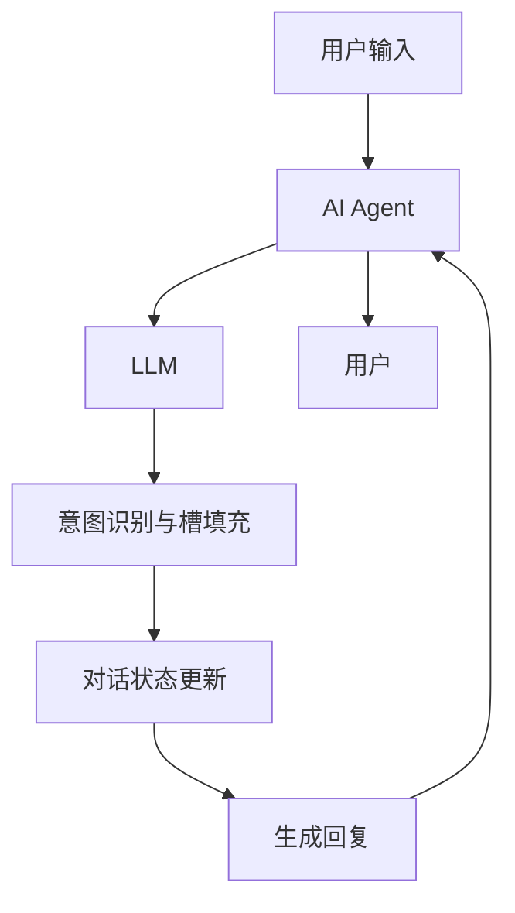

# 构建LLM驱动的AI Agent多轮对话状态追踪

> 关键词：LLM、AI Agent、多轮对话、状态追踪、对话管理

> 摘要：本文聚焦于构建由大语言模型（LLM）驱动的AI Agent多轮对话状态追踪系统。首先介绍了相关背景知识，包括目的、预期读者等内容。接着详细阐述了核心概念与联系，通过文本示意图和Mermaid流程图清晰展示其原理和架构。深入讲解了核心算法原理，并用Python代码进行具体操作步骤的说明。同时给出了数学模型和公式，并举例解释。通过项目实战，从开发环境搭建到源代码实现及解读，完整呈现开发过程。分析了实际应用场景，推荐了学习、开发工具和相关论文著作。最后总结未来发展趋势与挑战，还提供了常见问题解答和扩展阅读参考资料，旨在为开发者和研究者提供全面的技术指导。

## 1. 背景介绍 
### 1.1 目的和范围
在当今人工智能快速发展的时代，多轮对话系统成为了人机交互的重要方式。基于大语言模型（LLM）构建的AI Agent具有强大的语言理解和生成能力，但在多轮对话中，准确追踪对话状态是实现高效、智能交互的关键。本文的目的是详细探讨如何构建一个LLM驱动的AI Agent多轮对话状态追踪系统，涵盖从核心概念、算法原理到实际项目开发的全过程。通过深入研究，为开发者提供一套完整的技术方案，帮助他们在实际应用中更好地实现多轮对话的状态管理。

### 1.2 预期读者
本文主要面向对人工智能、自然语言处理领域有一定了解的开发者、研究人员以及相关技术爱好者。对于正在从事多轮对话系统开发，希望利用LLM提升系统性能的开发者，本文将提供具体的技术实现思路和代码示例；对于研究人员，本文的理论分析和数学模型部分可以为他们的研究提供参考；而技术爱好者可以通过阅读本文，深入了解LLM驱动的多轮对话状态追踪的技术原理和应用场景。

### 1.3 文档结构概述
本文将按照以下结构进行详细阐述：
- 核心概念与联系：介绍相关核心概念，并用文本示意图和Mermaid流程图展示其原理和架构。
- 核心算法原理 & 具体操作步骤：讲解核心算法的原理，并使用Python代码进行详细说明。
- 数学模型和公式 & 详细讲解 & 举例说明：给出数学模型和公式，并通过具体例子进行解释。
- 项目实战：从开发环境搭建到源代码实现及解读，完整呈现项目开发过程。
- 实际应用场景：分析该系统在不同领域的实际应用场景。
- 工具和资源推荐：推荐学习资源、开发工具框架和相关论文著作。
- 总结：未来发展趋势与挑战：总结该技术的未来发展趋势和面临的挑战。
- 附录：常见问题与解答：解答读者在学习和实践过程中可能遇到的常见问题。
- 扩展阅读 & 参考资料：提供相关的扩展阅读材料和参考资料。

### 1.4 术语表
#### 1.4.1 核心术语定义
- **LLM（Large Language Model）**：大语言模型，是一种基于深度学习的语言模型，通过在大规模文本数据上进行训练，能够学习到语言的统计规律和语义信息，具备强大的语言理解和生成能力。
- **AI Agent**：人工智能代理，是一种能够感知环境、做出决策并采取行动的智能实体。在多轮对话系统中，AI Agent可以理解用户的输入，根据对话状态生成合适的回复。
- **多轮对话**：指用户与系统之间进行多次交互的对话过程，系统需要在整个对话过程中保持对上下文的理解和状态的追踪。
- **对话状态追踪**：在多轮对话中，记录和更新对话的当前状态，包括用户的意图、已提及的信息、对话的主题等，以便系统能够根据当前状态生成合适的回复。

#### 1.4.2 相关概念解释
- **上下文理解**：在多轮对话中，理解当前对话与之前对话内容之间的关联和含义。通过上下文理解，系统可以更好地把握用户的意图和对话的整体语境。
- **意图识别**：分析用户输入的文本，确定用户的主要意图，例如查询信息、请求服务、进行交互等。意图识别是对话状态追踪的重要组成部分。
- **槽填充**：在识别用户意图的基础上，提取用户输入中的关键信息，这些信息通常被称为“槽”。例如，在查询航班信息的对话中，“出发地”、“目的地”、“出发时间”等就是槽。

#### 1.4.3 缩略词列表
- **LLM**：Large Language Model
- **API**：Application Programming Interface
- **NLP**：Natural Language Processing
- **RNN**：Recurrent Neural Network
- **LSTM**：Long Short-Term Memory

## 2. 核心概念与联系 
### 核心概念原理
在LLM驱动的AI Agent多轮对话状态追踪系统中，核心概念包括LLM、AI Agent、对话状态和状态追踪机制。

LLM作为基础模型，为AI Agent提供强大的语言理解和生成能力。它通过在大规模文本数据上进行训练，学习到语言的模式和语义信息，能够对用户输入的文本进行准确的理解和分析。

AI Agent是系统的执行主体，负责与用户进行交互。它接收用户的输入，利用LLM进行意图识别和槽填充，根据对话状态生成合适的回复。

对话状态是对当前对话的一种抽象表示，它包含了用户的意图、已提及的信息、对话的主题等。对话状态随着对话的进行不断更新，反映了对话的动态变化。

状态追踪机制是系统的核心，它负责记录和更新对话状态。通过对用户输入和系统回复的分析，状态追踪机制能够准确地捕捉对话的变化，确保系统能够根据当前状态生成合理的回复。

### 架构的文本示意图
```plaintext
用户 <-> AI Agent <-> LLM
|           |
|           |
对话状态追踪模块
```
在这个架构中，用户与AI Agent进行交互，AI Agent将用户输入传递给LLM进行处理。LLM对输入进行分析，提取意图和槽信息。AI Agent根据LLM的输出和当前对话状态生成回复。对话状态追踪模块负责记录和更新对话状态，确保系统能够在多轮对话中保持上下文的连贯性。

### Mermaid流程图

该流程图展示了系统的工作流程。用户输入首先被AI Agent接收，然后传递给LLM进行处理。LLM进行意图识别和槽填充，将结果反馈给AI Agent。AI Agent根据这些结果更新对话状态，并生成回复。最后，回复被发送给用户，完成一轮对话。

## 3. 核心算法原理 & 具体操作步骤 
### 核心算法原理
在LLM驱动的AI Agent多轮对话状态追踪系统中，核心算法主要包括意图识别和槽填充。

意图识别的目的是确定用户输入的主要意图。常见的方法是使用分类模型，将用户输入映射到预定义的意图类别中。可以使用基于规则的方法、机器学习方法或深度学习方法进行意图识别。

槽填充的任务是从用户输入中提取关键信息。可以使用序列标注模型，将每个词标记为相应的槽类型。例如，在查询航班信息的对话中，将“北京”标记为“出发地”，将“上海”标记为“目的地”。

### 具体操作步骤
以下是使用Python代码实现意图识别和槽填充的具体步骤：

```python
import torch
from transformers import AutoTokenizer, AutoModelForSequenceClassification

# 加载预训练的意图识别模型
tokenizer = AutoTokenizer.from_pretrained("bert-base-chinese")
model = AutoModelForSequenceClassification.from_pretrained("bert-base-chinese", num_labels=5)

# 定义意图类别
intent_labels = ["查询信息", "请求服务", "进行交互", "确认信息", "结束对话"]

def intent_recognition(text):
    # 对输入文本进行编码
    inputs = tokenizer(text, return_tensors="pt")
    # 模型推理
    outputs = model(**inputs)
    # 获取预测结果
    logits = outputs.logits
    predicted_class_id = torch.argmax(logits, dim=-1).item()
    # 返回意图类别
    return intent_labels[predicted_class_id]

# 示例输入
text = "我想查询明天从北京到上海的航班信息"
intent = intent_recognition(text)
print(f"用户意图: {intent}")

# 槽填充可以使用序列标注模型，这里简单示例使用正则表达式提取关键信息
import re

def slot_filling(text):
    # 提取出发地和目的地
    pattern = r"从(.*)到(.*)"
    match = re.search(pattern, text)
    if match:
        departure = match.group(1)
        destination = match.group(2)
        return {"出发地": departure, "目的地": destination}
    return {}

slots = slot_filling(text)
print(f"提取的槽信息: {slots}")
```
在上述代码中，首先使用`transformers`库加载预训练的BERT模型进行意图识别。通过对输入文本进行编码，然后进行模型推理，获取预测的意图类别。接着，使用正则表达式进行简单的槽填充，提取出发地和目的地信息。

## 4. 数学模型和公式 & 详细讲解 & 举例说明 
### 意图识别的数学模型
在意图识别中，通常使用分类模型。假设输入文本为 $x$，预定义的意图类别集合为 $Y = \{y_1, y_2, \cdots, y_n\}$。分类模型的目标是学习一个函数 $f: X \to Y$，将输入文本 $x$ 映射到最可能的意图类别 $y$。

常见的分类模型使用softmax函数进行概率计算。对于输入文本 $x$，模型输出一个概率分布 $P(y|x)$，表示输入文本 $x$ 属于每个意图类别 $y$ 的概率。softmax函数的定义如下：
$$
P(y_i|x) = \frac{e^{z_i}}{\sum_{j=1}^{n} e^{z_j}}
$$
其中，$z_i$ 是模型对于类别 $y_i$ 的得分。

### 举例说明
假设我们有三个意图类别：“查询信息”、“请求服务”、“进行交互”，模型对于输入文本的得分分别为 $z_1 = 2$，$z_2 = 1$，$z_3 = 3$。则每个类别对应的概率计算如下：
$$
P(\text{查询信息}|x) = \frac{e^{2}}{e^{2} + e^{1} + e^{3}} \approx 0.24
$$
$$
P(\text{请求服务}|x) = \frac{e^{1}}{e^{2} + e^{1} + e^{3}} \approx 0.09
$$
$$
P(\text{进行交互}|x) = \frac{e^{3}}{e^{2} + e^{1} + e^{3}} \approx 0.67
$$
根据概率分布，模型预测输入文本的意图类别为“进行交互”。

### 槽填充的数学模型
槽填充通常使用序列标注模型，如条件随机场（CRF）或基于深度学习的模型。假设输入文本为 $x = (x_1, x_2, \cdots, x_m)$，每个词 $x_i$ 对应的槽标签集合为 $T = \{t_1, t_2, \cdots, t_k\}$。序列标注模型的目标是学习一个函数 $g: X^m \to T^m$，为输入文本中的每个词分配一个槽标签。

在基于深度学习的模型中，通常使用循环神经网络（RNN）或长短时记忆网络（LSTM）对输入文本进行编码，然后使用全连接层进行标签预测。

### 举例说明
假设输入文本为“我想查询明天从北京到上海的航班信息”，经过序列标注模型处理后，每个词对应的槽标签如下：
| 词 | 槽标签 |
| ---- | ---- |
| 我 | O |
| 想 | O |
| 查询 | O |
| 明天 | 出发时间 |
| 从 | O |
| 北京 | 出发地 |
| 到 | O |
| 上海 | 目的地 |
| 的 | O |
| 航班 | O |
| 信息 | O |

其中，“O” 表示该词不属于任何槽。

## 5. 项目实战：代码实际案例和详细解释说明 
### 5.1  开发环境搭建
为了实现LLM驱动的AI Agent多轮对话状态追踪系统，我们需要搭建相应的开发环境。以下是具体步骤：

1. **安装Python**：确保你的系统中已经安装了Python 3.6或更高版本。可以从Python官方网站（https://www.python.org/downloads/）下载并安装。

2. **创建虚拟环境**：建议使用虚拟环境来管理项目的依赖。可以使用`venv`或`conda`创建虚拟环境。例如，使用`venv`创建虚拟环境的命令如下：
```bash
python -m venv myenv
source myenv/bin/activate  # 激活虚拟环境（Windows使用 myenv\Scripts\activate）
```

3. **安装必要的库**：安装`transformers`、`torch`等必要的库。可以使用`pip`进行安装：
```bash
pip install transformers torch
```

### 5.2  源代码详细实现和代码解读
以下是一个完整的LLM驱动的AI Agent多轮对话状态追踪系统的源代码示例：

```python
import torch
from transformers import AutoTokenizer, AutoModelForSequenceClassification
import re

# 加载预训练的意图识别模型
tokenizer = AutoTokenizer.from_pretrained("bert-base-chinese")
model = AutoModelForSequenceClassification.from_pretrained("bert-base-chinese", num_labels=5)

# 定义意图类别
intent_labels = ["查询信息", "请求服务", "进行交互", "确认信息", "结束对话"]

# 意图识别函数
def intent_recognition(text):
    inputs = tokenizer(text, return_tensors="pt")
    outputs = model(**inputs)
    logits = outputs.logits
    predicted_class_id = torch.argmax(logits, dim=-1).item()
    return intent_labels[predicted_class_id]

# 槽填充函数
def slot_filling(text):
    pattern = r"从(.*)到(.*)"
    match = re.search(pattern, text)
    if match:
        departure = match.group(1)
        destination = match.group(2)
        return {"出发地": departure, "目的地": destination}
    return {}

# 对话状态类
class DialogueState:
    def __init__(self):
        self.intent = None
        self.slots = {}

    def update(self, intent, slots):
        self.intent = intent
        self.slots.update(slots)

    def __str__(self):
        return f"意图: {self.intent}, 槽信息: {self.slots}"

# AI Agent类
class AIAgent:
    def __init__(self):
        self.state = DialogueState()

    def process_input(self, text):
        # 意图识别
        intent = intent_recognition(text)
        # 槽填充
        slots = slot_filling(text)
        # 更新对话状态
        self.state.update(intent, slots)
        # 根据对话状态生成回复
        if intent == "查询信息":
            if "出发地" in self.state.slots and "目的地" in self.state.slots:
                return f"您想查询从{self.state.slots['出发地']}到{self.state.slots['目的地']}的信息，我将为您查找相关内容。"
            else:
                return "请您提供更详细的信息，例如出发地和目的地。"
        elif intent == "结束对话":
            return "感谢您的使用，再见！"
        else:
            return "我不太理解您的意思，请您重新描述一下。"

# 主程序
if __name__ == "__main__":
    agent = AIAgent()
    while True:
        user_input = input("请输入您的问题（输入 '结束对话' 退出）: ")
        if user_input == "结束对话":
            response = agent.process_input(user_input)
            print(response)
            break
        response = agent.process_input(user_input)
        print(f"AI Agent回复: {response}")
        print(f"当前对话状态: {agent.state}")
```

### 5.3  代码解读与分析
- **意图识别**：`intent_recognition`函数使用预训练的BERT模型对用户输入进行意图识别。通过对输入文本进行编码，然后进行模型推理，获取预测的意图类别。
- **槽填充**：`slot_filling`函数使用正则表达式从用户输入中提取关键信息，这里主要提取出发地和目的地信息。
- **对话状态类**：`DialogueState`类用于记录和管理对话状态，包括意图和槽信息。`update`方法用于更新对话状态。
- **AI Agent类**：`AIAgent`类是系统的核心，负责处理用户输入。`process_input`方法首先进行意图识别和槽填充，然后更新对话状态，最后根据对话状态生成回复。
- **主程序**：在主程序中，创建了一个`AIAgent`对象，通过循环不断接收用户输入，并调用`process_input`方法进行处理。当用户输入“结束对话”时，退出循环。

## 6. 实际应用场景 
### 智能客服
在智能客服场景中，LLM驱动的AI Agent多轮对话状态追踪系统可以帮助客服人员更高效地处理客户咨询。通过准确追踪对话状态，系统能够理解客户的意图和需求，提供个性化的解决方案。例如，客户咨询关于产品的使用方法、售后政策等问题，系统可以根据对话状态提供相应的信息，并在必要时引导客户进行进一步的操作。

### 智能助手
智能助手如语音助手、聊天机器人等也可以应用该系统。用户可以通过与智能助手进行多轮对话，完成各种任务，如查询天气、设置提醒、预订机票等。系统能够根据对话状态准确理解用户的需求，并提供相应的服务。

### 智能教育
在智能教育领域，该系统可以用于智能辅导和学习系统。学生可以与系统进行多轮对话，询问课程内容、解答问题等。系统可以根据对话状态了解学生的学习情况，提供针对性的学习建议和辅导。

## 7. 工具和资源推荐
### 7.1 学习资源推荐
#### 7.1.1 书籍推荐
- 《自然语言处理入门》：这本书详细介绍了自然语言处理的基础知识和常用技术，包括词法分析、句法分析、语义理解等内容，适合初学者入门。
- 《深度学习》：深度学习是LLM的基础，这本书全面介绍了深度学习的原理、算法和应用，对于深入理解LLM有很大帮助。
- 《Python自然语言处理实战》：结合Python代码，介绍了自然语言处理的实际应用，包括文本分类、情感分析、命名实体识别等内容，适合有一定编程基础的读者。

#### 7.1.2 在线课程
- Coursera上的“Natural Language Processing Specialization”：由顶尖大学的教授授课，系统介绍了自然语言处理的各个方面，包括语言模型、机器翻译、问答系统等。
- edX上的“Deep Learning for Natural Language Processing”：专注于深度学习在自然语言处理中的应用，包括循环神经网络、卷积神经网络、注意力机制等内容。
- 哔哩哔哩上有很多关于自然语言处理和LLM的视频教程，适合初学者快速入门。

#### 7.1.3 技术博客和网站
- Hugging Face博客：提供了关于LLM和自然语言处理的最新研究成果和技术应用，同时还有很多开源代码和模型可供使用。
- Medium上的自然语言处理相关文章：有很多行业专家和研究者分享他们的经验和见解，对于了解最新技术动态很有帮助。
- 开源中国、InfoQ等技术网站也经常发布自然语言处理和人工智能方面的文章。

### 7.2 开发工具框架推荐
#### 7.2.1 IDE和编辑器
- PyCharm：功能强大的Python集成开发环境，提供了代码编辑、调试、版本控制等一系列功能，适合大型项目的开发。
- Visual Studio Code：轻量级的代码编辑器，支持多种编程语言和插件扩展，对于快速开发和调试代码非常方便。
- Jupyter Notebook：交互式的开发环境，适合进行数据分析、模型训练和实验验证。

#### 7.2.2 调试和性能分析工具
- TensorBoard：用于可视化深度学习模型的训练过程和性能指标，帮助开发者更好地理解模型的训练情况。
- Py-Spy：用于分析Python代码的性能瓶颈，找出代码中耗时较长的部分，进行优化。
- cProfile：Python自带的性能分析工具，可以统计函数的调用次数、执行时间等信息。

#### 7.2.3 相关框架和库
- Transformers：Hugging Face开发的开源库，提供了大量预训练的语言模型和工具，方便开发者进行自然语言处理任务的开发。
- PyTorch：深度学习框架，具有动态图机制，易于使用和调试，很多LLM都是基于PyTorch实现的。
- NLTK：自然语言处理工具包，提供了丰富的语料库和处理工具，适合初学者进行自然语言处理的实验和学习。

### 7.3 相关论文著作推荐
#### 7.3.1 经典论文
- “Attention Is All You Need”：提出了Transformer架构，是现代LLM的基础，对自然语言处理领域产生了深远影响。
- “BERT: Pre-training of Deep Bidirectional Transformers for Language Understanding”：介绍了BERT模型，通过预训练和微调的方式在多个自然语言处理任务上取得了优异的成绩。
- “GPT: Generative Pretrained Transformer”：提出了GPT模型，开创了基于生成式预训练的自然语言处理方法。

#### 7.3.2 最新研究成果
- 关注顶级学术会议如ACL、EMNLP、NeurIPS等的最新论文，了解LLM和自然语言处理领域的最新研究进展。
- arXiv上也有很多关于LLM的预印本论文，可以及时获取最新的研究成果。

#### 7.3.3 应用案例分析
- 研究一些实际应用案例的论文，了解LLM在不同领域的应用方法和效果。例如，智能客服、智能医疗、智能金融等领域的应用案例分析。

## 8. 总结：未来发展趋势与挑战
### 未来发展趋势
- **更强大的语言模型**：随着计算资源的不断提升和训练技术的不断改进，未来的LLM将具有更强大的语言理解和生成能力，能够处理更加复杂和多样化的任务。
- **多模态融合**：将语言与图像、音频等多种模态信息进行融合，实现更加丰富和自然的人机交互。例如，用户可以通过语音和手势与系统进行交互，系统能够同时理解语言和视觉信息。
- **个性化服务**：根据用户的历史对话记录、兴趣爱好等信息，为用户提供个性化的服务和推荐。例如，智能助手可以根据用户的日常习惯，提前为用户准备好相关的信息和提醒。

### 面临的挑战
- **数据隐私和安全**：LLM需要大量的数据进行训练，这些数据可能包含用户的敏感信息。如何保护数据的隐私和安全，防止数据泄露和滥用，是一个重要的挑战。
- **模型可解释性**：LLM通常是基于深度学习的黑盒模型，其决策过程难以解释。在一些关键领域，如医疗、金融等，模型的可解释性至关重要。如何提高LLM的可解释性，是当前研究的热点问题。
- **计算资源需求**：训练和运行LLM需要大量的计算资源，这限制了其在一些场景下的应用。如何降低LLM的计算成本，提高其效率，是未来需要解决的问题。

## 9. 附录：常见问题与解答
### 问题1：如何选择合适的LLM进行多轮对话状态追踪？
解答：选择合适的LLM需要考虑多个因素，如模型的规模、性能、适用场景等。一般来说，规模较大的模型通常具有更好的语言理解和生成能力，但也需要更多的计算资源。可以根据项目的实际需求和资源情况选择合适的模型。例如，对于小型项目，可以选择一些轻量级的模型；对于大型项目，可以选择如GPT、BERT等大型模型。

### 问题2：如何处理用户输入中的模糊信息？
解答：处理用户输入中的模糊信息可以采用以下方法：
- 询问澄清：当系统无法准确理解用户的意图时，可以通过询问用户进一步的信息来澄清。例如，“您说的‘那个地方’具体是指哪里呢？”
- 上下文推理：结合对话的上下文信息，对用户的模糊信息进行推理和猜测。例如，根据之前的对话提到的地点，推测用户所说的“那里”可能指的是该地点。
- 概率判断：使用概率模型对用户的意图进行判断，选择最可能的意图进行处理。

### 问题3：如何评估多轮对话状态追踪系统的性能？
解答：可以使用以下指标来评估多轮对话状态追踪系统的性能：
- **准确率**：指系统正确识别用户意图和填充槽信息的比例。
- **召回率**：指系统能够正确识别的用户意图和槽信息在实际存在的意图和槽信息中的比例。
- **F1值**：综合考虑准确率和召回率的指标，用于衡量系统的整体性能。
- **对话成功率**：指系统能够成功完成对话任务的比例。

## 10. 扩展阅读 & 参考资料
### 扩展阅读
- 《人工智能：现代方法》：全面介绍了人工智能的各个领域，包括自然语言处理、机器学习、知识表示等内容，对于深入理解人工智能有很大帮助。
- 《神经网络与深度学习》：详细介绍了神经网络和深度学习的原理、算法和应用，对于理解LLM的底层原理有很大帮助。
- 《自然语言处理实战：基于Transformer的原理和应用》：结合Transformer架构，介绍了自然语言处理的实际应用，包括文本分类、机器翻译、问答系统等内容。

### 参考资料
- Hugging Face官方文档：https://huggingface.co/docs
- PyTorch官方文档：https://pytorch.org/docs/stable/index.html
- NLTK官方文档：https://www.nltk.org/

作者：AI天才研究院/AI Genius Institute & 禅与计算机程序设计艺术 /Zen And The Art of Computer Programming