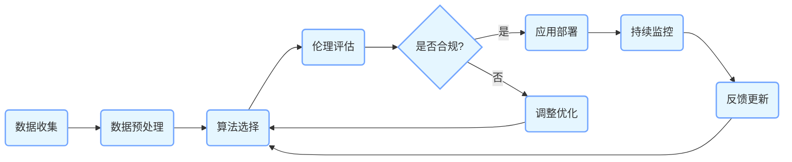

# 构建企业级AI伦理顾问：确保AI应用的道德合规

> 关键词：企业级AI伦理顾问、AI道德合规、AI伦理框架、算法透明度、公平性与偏见

> 摘要：本文聚焦于构建企业级AI伦理顾问这一关键议题，旨在帮助企业确保其AI应用符合道德规范。首先介绍了构建AI伦理顾问的背景，包括目的、预期读者、文档结构和相关术语。接着阐述了核心概念及联系，通过文本示意图和Mermaid流程图进行清晰展示。详细讲解了核心算法原理和具体操作步骤，并用Python代码进行说明。同时给出了相关数学模型和公式，并举例解释。通过项目实战，包括开发环境搭建、源代码实现和解读，深入分析了如何在实际中应用。探讨了实际应用场景，推荐了学习资源、开发工具框架和相关论文著作。最后总结了未来发展趋势与挑战，提供常见问题解答和扩展阅读参考资料，为企业构建AI伦理顾问提供全面且深入的指导。

## 1. 背景介绍 
### 1.1 目的和范围
随着人工智能技术在企业中的广泛应用，AI系统所带来的伦理问题日益凸显，如算法偏见、隐私侵犯、责任界定不清等。构建企业级AI伦理顾问的目的在于为企业提供一套全面的解决方案，确保其AI应用在道德和法律层面上合规。本文章的范围涵盖了从AI伦理的基本概念、核心算法原理、数学模型到实际项目开发和应用场景的各个方面，旨在帮助企业理解和实施AI伦理顾问系统。

### 1.2 预期读者
本文的预期读者包括企业的技术管理人员、AI开发者、数据科学家、企业战略规划人员以及对AI伦理问题感兴趣的研究人员。这些读者希望了解如何构建和应用企业级AI伦理顾问，以确保企业的AI应用符合道德规范，提升企业的社会形象和竞争力。

### 1.3 文档结构概述
本文将按照以下结构进行组织：首先介绍核心概念与联系，包括AI伦理的基本原理和架构；接着详细阐述核心算法原理和具体操作步骤，并给出Python代码示例；然后介绍相关的数学模型和公式，并举例说明；通过项目实战展示如何在实际中构建和应用AI伦理顾问系统；探讨AI伦理顾问在不同场景下的实际应用；推荐学习资源、开发工具框架和相关论文著作；最后总结未来发展趋势与挑战，提供常见问题解答和扩展阅读参考资料。

### 1.4 术语表
#### 1.4.1 核心术语定义
- **AI伦理顾问**：一种为企业提供AI应用道德合规指导和评估的系统或机制，帮助企业识别、分析和解决AI伦理问题。
- **算法透明度**：指算法的设计、实现和决策过程能够被理解和解释，让用户和利益相关者清楚算法是如何工作的。
- **公平性与偏见**：公平性指AI系统在不同群体之间的表现是公正的，不存在对特定群体的歧视；偏见则是指AI系统在数据、算法或决策过程中存在不公平的倾向。
- **隐私保护**：确保个人或组织的数据不被未经授权的访问、使用或披露，保护用户的隐私权益。
- **可解释性**：AI系统的决策和输出能够以人类可理解的方式进行解释，让用户明白系统为什么做出这样的决策。

#### 1.4.2 相关概念解释
- **道德合规**：企业的AI应用符合社会公认的道德准则和法律法规，避免对个人、社会造成负面影响。
- **利益相关者**：与企业的AI应用有利益关系的个人或组织，包括用户、员工、合作伙伴、监管机构等。
- **风险评估**：对AI应用可能带来的伦理风险进行识别、分析和评估，以便采取相应的措施进行防范和管理。

#### 1.4.3 缩略词列表
- **AI**：Artificial Intelligence，人工智能
- **ML**：Machine Learning，机器学习
- **DL**：Deep Learning，深度学习
- **GDPR**：General Data Protection Regulation，通用数据保护条例

## 2. 核心概念与联系 

### 核心概念原理
企业级AI伦理顾问的核心原理是基于一系列的伦理原则和标准，对企业的AI应用进行全面的评估和指导。这些伦理原则包括公平性、透明度、隐私保护、可解释性等。通过建立一个伦理框架，将这些原则转化为具体的评估指标和方法，对AI系统的设计、开发、部署和使用过程进行监控和管理。

### 架构的文本示意图
```plaintext
企业级AI伦理顾问架构

|-- 数据层
|   |-- 训练数据
|   |-- 测试数据
|   |-- 元数据
|
|-- 算法层
|   |-- 公平性检测算法
|   |-- 透明度评估算法
|   |-- 隐私保护算法
|   |-- 可解释性算法
|
|-- 评估层
|   |-- 伦理指标评估
|   |-- 风险评估
|   |-- 合规性评估
|
|-- 决策层
|   |-- 建议生成
|   |-- 决策支持
|
|-- 用户界面层
|   |-- 可视化展示
|   |-- 交互功能
```

### Mermaid流程图


这个流程图展示了企业级AI伦理顾问的工作流程。首先进行数据收集和预处理，然后选择合适的算法进行伦理评估。评估结果判断AI应用是否合规，如果合规则进行应用部署，同时进行持续监控和反馈更新；如果不合规则进行调整优化，重新进行评估。整个过程形成一个闭环，确保AI应用始终符合伦理要求。

## 3. 核心算法原理 & 具体操作步骤 

### 公平性检测算法原理
公平性检测算法的核心目标是检测AI系统在不同群体之间是否存在偏见。常见的方法是通过计算不同群体的预测结果差异来评估公平性。例如，对于一个分类问题，我们可以计算不同性别、种族群体的误分类率，如果差异超过一定阈值，则认为存在公平性问题。

以下是一个简单的Python代码示例，用于检测二分类问题中的公平性：

```python
import numpy as np

def fairness_detection(y_true, y_pred, group):
    """
    公平性检测函数
    :param y_true: 真实标签
    :param y_pred: 预测标签
    :param group: 群体标签
    :return: 不同群体的误分类率差异
    """
    unique_groups = np.unique(group)
    error_rates = []
    for g in unique_groups:
        group_indices = np.where(group == g)[0]
        group_y_true = y_true[group_indices]
        group_y_pred = y_pred[group_indices]
        error_rate = np.mean(group_y_true!= group_y_pred)
        error_rates.append(error_rate)
    
    max_error = max(error_rates)
    min_error = min(error_rates)
    fairness_diff = max_error - min_error
    return fairness_diff

# 示例数据
y_true = np.array([0, 1, 0, 1, 0, 1])
y_pred = np.array([0, 1, 1, 0, 0, 1])
group = np.array([0, 1, 0, 1, 0, 1])

fairness_diff = fairness_detection(y_true, y_pred, group)
print(f"公平性差异: {fairness_diff}")
```

### 透明度评估算法原理
透明度评估算法主要关注算法的可解释性和可理解性。一种常见的方法是使用特征重要性分析，通过计算每个特征对模型预测结果的贡献程度，来解释模型的决策过程。

以下是一个使用随机森林进行特征重要性分析的Python代码示例：

```python
from sklearn.ensemble import RandomForestClassifier
import pandas as pd
import matplotlib.pyplot as plt

# 示例数据
data = pd.read_csv('example_data.csv')
X = data.drop('target', axis=1)
y = data['target']

# 训练随机森林模型
model = RandomForestClassifier()
model.fit(X, y)

# 获取特征重要性
feature_importances = model.feature_importances_
feature_names = X.columns

# 绘制特征重要性图
plt.figure(figsize=(10, 6))
plt.bar(feature_names, feature_importances)
plt.xlabel('特征')
plt.ylabel('重要性')
plt.title('特征重要性分析')
plt.xticks(rotation=45)
plt.show()
```

### 具体操作步骤
1. **数据收集**：收集与AI应用相关的数据，包括训练数据、测试数据和元数据。确保数据的完整性和准确性。
2. **数据预处理**：对收集到的数据进行清洗、转换和归一化等操作，以便后续的算法处理。
3. **算法选择**：根据具体的伦理评估需求，选择合适的公平性检测、透明度评估、隐私保护和可解释性算法。
4. **伦理评估**：使用选定的算法对AI系统进行伦理评估，计算相应的伦理指标和风险值。
5. **结果分析**：对评估结果进行分析，判断AI应用是否符合伦理要求。如果存在问题，需要进一步分析原因并提出改进措施。
6. **调整优化**：根据分析结果，对AI系统进行调整和优化，如调整算法参数、改进数据质量等，以提高其伦理合规性。
7. **持续监控**：在AI应用部署后，持续对其进行监控，及时发现和处理新出现的伦理问题。

## 4. 数学模型和公式 & 详细讲解 & 举例说明 

### 公平性评估公式
公平性评估常用的指标是差异影响率（Disparate Impact Ratio，DIR）。差异影响率定义为受保护群体（如少数族裔）的正预测率与非受保护群体的正预测率之比。公式如下：

$$DIR = \frac{PPR_{protected}}{PPR_{unprotected}}$$

其中，$PPR_{protected}$ 是受保护群体的正预测率，$PPR_{unprotected}$ 是非受保护群体的正预测率。正预测率的计算公式为：

$$PPR = \frac{TP}{TP + FP}$$

其中，$TP$ 是真正例数，$FP$ 是假正例数。

**举例说明**：假设一个贷款审批系统，有100名男性和100名女性申请贷款。男性中有80人获得批准（$TP_{male}=80$，$FP_{male}=20$），女性中有60人获得批准（$TP_{female}=60$，$FP_{female}=40$）。

男性的正预测率为：

$$PPR_{male} = \frac{80}{80 + 20} = 0.8$$

女性的正预测率为：

$$PPR_{female} = \frac{60}{60 + 40} = 0.6$$

差异影响率为：

$$DIR = \frac{0.6}{0.8} = 0.75$$

一般来说，如果 $DIR$ 小于0.8，则认为存在公平性问题。

### 特征重要性计算公式
在随机森林中，特征重要性是通过计算每个特征在所有决策树中的平均不纯度减少来衡量的。假设一个特征 $f$ 在第 $i$ 棵决策树中的不纯度减少为 $\Delta I_{i,f}$，则该特征的重要性 $FI_f$ 计算公式为：

$$FI_f = \frac{1}{N} \sum_{i=1}^{N} \Delta I_{i,f}$$

其中，$N$ 是决策树的数量。

**举例说明**：假设一个随机森林模型有10棵决策树，特征 $A$ 在第1棵决策树中的不纯度减少为0.2，在第2棵决策树中的不纯度减少为0.3，以此类推。则特征 $A$ 的重要性为：

$$FI_A = \frac{0.2 + 0.3 + \cdots}{10}$$

通过计算每个特征的重要性，我们可以了解哪些特征对模型的决策影响最大，从而提高模型的透明度和可解释性。

## 5. 项目实战：代码实际案例和详细解释说明 

### 5.1  开发环境搭建
#### 操作系统
建议使用Linux系统，如Ubuntu 18.04或更高版本，因为Linux系统在开发和部署AI应用方面具有良好的稳定性和兼容性。

#### Python环境
安装Python 3.7或更高版本。可以使用Anaconda来管理Python环境，以下是安装步骤：
1. 从Anaconda官网下载适合你操作系统的Anaconda安装包。
2. 打开终端，进入下载目录，运行以下命令进行安装：
```bash
bash Anaconda3-2021.11-Linux-x86_64.sh
```
3. 按照安装向导的提示完成安装。安装完成后，重启终端，输入以下命令验证安装：
```bash
python --version
```

#### 安装必要的库
使用以下命令安装项目所需的Python库：
```bash
pip install numpy pandas scikit-learn matplotlib
```

### 5.2  源代码详细实现和代码解读
以下是一个完整的项目示例，用于构建一个简单的企业级AI伦理顾问系统，对一个二分类模型进行公平性和透明度评估。

```python
import numpy as np
import pandas as pd
from sklearn.ensemble import RandomForestClassifier
from sklearn.model_selection import train_test_split
from sklearn.metrics import accuracy_score

# 数据加载和预处理
def load_data():
    data = pd.read_csv('example_data.csv')
    X = data.drop('target', axis=1)
    y = data['target']
    group = data['group']  # 群体标签
    X_train, X_test, y_train, y_test, group_train, group_test = train_test_split(X, y, group, test_size=0.2, random_state=42)
    return X_train, X_test, y_train, y_test, group_train, group_test

# 公平性检测函数
def fairness_detection(y_true, y_pred, group):
    unique_groups = np.unique(group)
    error_rates = []
    for g in unique_groups:
        group_indices = np.where(group == g)[0]
        group_y_true = y_true[group_indices]
        group_y_pred = y_pred[group_indices]
        error_rate = np.mean(group_y_true!= group_y_pred)
        error_rates.append(error_rate)
    
    max_error = max(error_rates)
    min_error = min(error_rates)
    fairness_diff = max_error - min_error
    return fairness_diff

# 透明度评估函数
def transparency_evaluation(model, X):
    feature_importances = model.feature_importances_
    feature_names = X.columns
    return feature_importances, feature_names

# 主函数
def main():
    # 加载数据
    X_train, X_test, y_train, y_test, group_train, group_test = load_data()
    
    # 训练模型
    model = RandomForestClassifier()
    model.fit(X_train, y_train)
    
    # 模型预测
    y_pred = model.predict(X_test)
    
    # 公平性评估
    fairness_diff = fairness_detection(y_test, y_pred, group_test)
    print(f"公平性差异: {fairness_diff}")
    
    # 透明度评估
    feature_importances, feature_names = transparency_evaluation(model, X_test)
    print("特征重要性:")
    for i in range(len(feature_names)):
        print(f"{feature_names[i]}: {feature_importances[i]}")
    
    # 模型准确率
    accuracy = accuracy_score(y_test, y_pred)
    print(f"模型准确率: {accuracy}")

if __name__ == "__main__":
    main()
```

### 5.3  代码解读与分析
1. **数据加载和预处理**：`load_data` 函数用于加载数据，并将其分为训练集和测试集。同时，提取群体标签，用于后续的公平性评估。
2. **公平性检测**：`fairness_detection` 函数通过计算不同群体的误分类率差异来评估公平性。如果差异较大，则说明模型可能存在公平性问题。
3. **透明度评估**：`transparency_evaluation` 函数使用随机森林模型的特征重要性来评估模型的透明度。通过查看每个特征的重要性，我们可以了解模型的决策过程。
4. **主函数**：`main` 函数是整个项目的入口，负责调用上述函数完成数据加载、模型训练、预测、公平性评估、透明度评估和准确率计算等任务。

通过这个项目示例，我们可以看到如何使用Python和相关库来构建一个简单的企业级AI伦理顾问系统，对AI模型进行伦理评估。

## 6. 实际应用场景 
### 金融领域
在金融领域，AI技术被广泛应用于信贷审批、风险评估、投资决策等方面。企业级AI伦理顾问可以帮助金融机构确保其AI系统在评估客户信用时不存在性别、种族等方面的偏见，保证公平放贷。同时，提高算法的透明度，让客户清楚了解自己的信用评估结果是如何得出的，增强客户对金融机构的信任。

### 医疗领域
在医疗领域，AI可用于疾病诊断、治疗方案推荐等。AI伦理顾问可以确保AI系统在诊断过程中对不同患者群体的公平性，避免因患者的年龄、性别、种族等因素导致误诊或漏诊。此外，保护患者的隐私数据，确保数据不被滥用，也是AI伦理顾问的重要任务。

### 招聘领域
企业在招聘过程中使用AI技术进行简历筛选和面试评估。AI伦理顾问可以防止AI系统在筛选简历时对特定群体存在偏见，如女性、少数族裔等。同时，提供算法的可解释性，让应聘者了解自己的简历是如何被评估的，提高招聘过程的公正性和透明度。

### 交通领域
在自动驾驶、智能交通管理等方面，AI技术发挥着重要作用。AI伦理顾问可以确保自动驾驶系统在决策过程中考虑到所有道路使用者的安全和公平性，避免因算法偏见导致对某些群体的不利影响。同时，保障交通数据的隐私和安全，防止数据泄露带来的风险。

## 7. 工具和资源推荐
### 7.1 学习资源推荐
#### 7.1.1 书籍推荐
- 《AI 3.0》：本书深入探讨了人工智能的发展现状、面临的挑战和未来的发展趋势，对AI伦理问题也有详细的讨论。
- 《算法霸权：数学杀伤性武器的威胁与应对》：揭示了算法在社会各个领域中可能带来的不公平和危害，以及如何通过伦理和法律手段来应对。
- 《人工智能时代的人类角色》：从哲学和社会学的角度探讨了人工智能对人类社会的影响，以及如何确保AI的发展符合人类的价值观。

#### 7.1.2 在线课程
- Coursera上的“AI Ethics”课程：由知名高校教授授课，系统介绍了AI伦理的基本概念、原则和方法。
- edX上的“Responsible AI”课程：聚焦于如何在实际项目中应用AI伦理原则，培养学员的实践能力。
- Udemy上的“AI and Machine Learning Ethics”课程：提供了丰富的案例分析和实践项目，帮助学员深入理解AI伦理问题。

#### 7.1.3 技术博客和网站
- Medium上的AI伦理相关博客：有许多专家和从业者分享关于AI伦理的最新研究成果和实践经验。
- IEEE Spectrum：关注人工智能、机器人技术等前沿科技领域，经常发表关于AI伦理的深度报道和分析文章。
- AI Now Institute：致力于研究人工智能对社会的影响，发布了许多关于AI伦理的研究报告和政策建议。

### 7.2 开发工具框架推荐
#### 7.2.1 IDE和编辑器
- PyCharm：功能强大的Python集成开发环境，提供代码编辑、调试、版本控制等一系列功能，适合开发大型AI项目。
- Jupyter Notebook：交互式的开发环境，支持代码、文本、图表等多种形式的展示，方便进行数据分析和模型实验。
- Visual Studio Code：轻量级的代码编辑器，支持多种编程语言和插件扩展，可用于快速开发和调试AI代码。

#### 7.2.2 调试和性能分析工具
- TensorBoard：TensorFlow提供的可视化工具，可用于监控模型的训练过程、查看模型结构和性能指标等。
- Py-Spy：用于分析Python代码的性能瓶颈，找出耗时较长的函数和代码段。
- Scalene：一款高性能的Python代码分析器，能够实时监测CPU和内存使用情况，帮助优化代码性能。

#### 7.2.3 相关框架和库
- AIF360：由IBM开发的AI公平性框架，提供了一系列用于检测和缓解AI算法中偏见的工具和算法。
- LIME：局部可解释模型无关解释（Local Interpretable Model-agnostic Explanations）的Python库，用于解释机器学习模型的预测结果。
- SHAP：SHapley Additive exPlanations的Python库，通过计算特征的Shapley值来解释模型的决策过程。

### 7.3 相关论文著作推荐
#### 7.3.1 经典论文
- “Fairness in Machine Learning”：这篇论文系统地介绍了机器学习中的公平性问题，提出了多种公平性评估指标和算法。
- “Why Should I Trust You?”：探讨了如何提高机器学习模型的可解释性，提出了一种基于局部解释的方法。
- “Algorithmic Bias Detection and Mitigation: Best Practices and Policies to Reduce Consumer Harms”：分析了算法偏见可能带来的危害，并提出了一系列检测和缓解算法偏见的最佳实践和政策建议。

#### 7.3.2 最新研究成果
- 每年的NeurIPS、ICML、AAAI等顶级AI学术会议上都会有大量关于AI伦理的最新研究成果发表，可以关注这些会议的论文集。
- 一些知名学术期刊，如Journal of Artificial Intelligence Research、Artificial Intelligence等，也会发表高质量的AI伦理研究论文。

#### 7.3.3 应用案例分析
- 许多企业和研究机构会发布关于AI伦理应用案例的报告，如Google、Microsoft等公司的AI伦理实践报告，这些案例可以为我们提供实际应用中的经验和教训。

## 8. 总结：未来发展趋势与挑战
### 未来发展趋势
- **法规和标准的完善**：随着AI技术的广泛应用，各国政府和国际组织将加强对AI伦理的监管，制定更加完善的法规和标准，企业需要更加严格地遵守这些要求。
- **技术创新**：为了更好地解决AI伦理问题，未来将涌现出更多的创新技术，如可解释性AI、公平性增强算法等，这些技术将进一步提高AI系统的伦理合规性。
- **跨学科合作**：AI伦理问题涉及计算机科学、哲学、社会学、法学等多个学科领域，未来需要加强跨学科合作，共同推动AI伦理的发展。
- **公众参与**：公众对AI伦理问题的关注度将不断提高，企业需要更加注重公众的意见和反馈，积极参与公众讨论，提高AI应用的社会接受度。

### 挑战
- **伦理原则的多样性**：不同的文化、价值观和利益相关者对AI伦理原则的理解和侧重点可能不同，如何在多种伦理原则之间取得平衡是一个挑战。
- **技术的复杂性**：随着AI技术的不断发展，其复杂性也在不断增加，如深度学习模型的黑盒性使得其决策过程难以解释，增加了伦理评估的难度。
- **数据的质量和隐私**：AI系统的性能和伦理合规性很大程度上依赖于数据的质量和隐私保护。如何确保数据的准确性、完整性和安全性，防止数据泄露和滥用是一个重要挑战。
- **实施成本**：构建和实施企业级AI伦理顾问系统需要投入大量的人力、物力和财力，对于一些中小企业来说，可能面临实施成本过高的问题。

## 9. 附录：常见问题与解答
### 问题1：AI伦理顾问系统是否可以完全消除AI应用中的伦理问题？
答：虽然AI伦理顾问系统可以帮助企业识别和解决大部分伦理问题，但由于AI技术的复杂性和伦理问题的多样性，无法完全消除所有的伦理问题。AI伦理顾问系统只是一种辅助工具，需要企业在整个AI应用的生命周期中持续关注和管理伦理问题。

### 问题2：如何选择适合企业的AI伦理评估算法？
答：选择适合企业的AI伦理评估算法需要考虑多个因素，如企业的业务需求、AI应用的类型、数据的特点等。一般来说，可以根据具体的伦理评估指标，如公平性、透明度、隐私保护等，选择相应的算法。同时，也可以参考相关的研究成果和行业最佳实践。

### 问题3：企业在实施AI伦理顾问系统时，需要哪些部门的参与？
答：企业在实施AI伦理顾问系统时，需要多个部门的参与，包括技术部门、法律部门、业务部门和公关部门等。技术部门负责系统的开发和维护；法律部门负责确保系统符合法律法规；业务部门提供业务需求和数据；公关部门负责与公众沟通，提高企业的社会形象。

### 问题4：AI伦理顾问系统的实施对企业的业务有什么影响？
答：AI伦理顾问系统的实施对企业的业务有积极的影响。一方面，它可以帮助企业避免因伦理问题导致的法律风险和声誉损失，提高企业的社会形象和竞争力；另一方面，它可以促进企业的创新和可持续发展，提高客户对企业的信任度。

## 10. 扩展阅读 & 参考资料
### 扩展阅读
- 《人类简史：从动物到上帝》：探讨了人类的进化历程和人类社会的发展，有助于从更宏观的角度理解AI对人类社会的影响。
- 《未来简史：从智人到神人》：对未来人类社会的发展进行了大胆的预测，包括AI技术在未来的作用和挑战。
- 《智能时代》：介绍了人工智能在各个领域的应用和发展趋势，以及对人类生活和工作的影响。

### 参考资料
- [AI Now Institute](https://ainowinstitute.org/)
- [IEEE Global Initiative on Ethics of Autonomous and Intelligent Systems](https://ethicsinaction.ieee.org/)
- [European Commission - Ethics Guidelines for Trustworthy AI](https://ec.europa.eu/digital-single-market/en/news/ethics-guidelines-trustworthy-ai)

作者：AI天才研究院/AI Genius Institute & 禅与计算机程序设计艺术 /Zen And The Art of Computer Programming