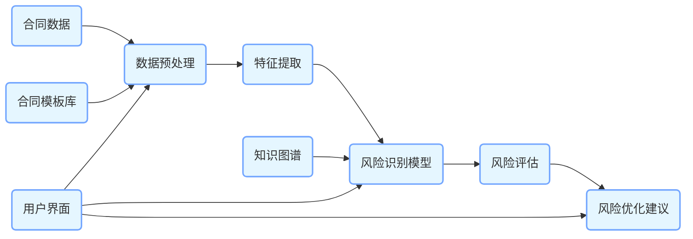

# 构建企业级AI合同管理助手：风险识别与优化

> 关键词：企业级AI，合同管理助手，风险识别，风险优化，自然语言处理

> 摘要：本文聚焦于构建企业级AI合同管理助手，详细阐述其在合同风险识别与优化方面的应用。从背景介绍出发，深入剖析核心概念与联系，包括相关原理和架构，接着介绍核心算法原理及具体操作步骤，结合数学模型和公式进行说明。通过项目实战展示代码实际案例，分析其在实际应用场景中的作用，同时推荐相关工具和资源。最后总结未来发展趋势与挑战，为企业在合同管理领域引入AI技术提供全面的指导。

## 1. 背景介绍 
### 1.1 目的和范围
在当今企业运营中，合同管理是一项至关重要且复杂的工作。随着业务规模的扩大和交易的频繁，企业面临着海量合同的处理和管理任务。合同中隐藏着各种潜在风险，如法律风险、财务风险、合规风险等，如果不能及时准确地识别和处理这些风险，可能会给企业带来巨大的损失。

本文的目的是构建一个企业级AI合同管理助手，该助手能够利用先进的人工智能技术，特别是自然语言处理（NLP）和机器学习算法，对合同文本进行深入分析，实现合同风险的自动识别，并提供相应的优化建议。其范围涵盖了从合同数据的获取、预处理，到风险识别算法的设计与实现，再到风险优化策略的制定等整个合同管理流程。

### 1.2 预期读者
本文主要面向企业的合同管理人员、法务人员、IT技术人员以及对企业级AI应用感兴趣的研究人员。对于合同管理人员和法务人员来说，了解如何利用AI技术提升合同管理效率和风险防控能力是至关重要的；而IT技术人员可以从本文中获取构建AI合同管理系统的技术细节和实现思路；研究人员则可以通过本文了解该领域的最新研究动态和应用案例。

### 1.3 文档结构概述
本文将按照以下结构进行组织：首先介绍核心概念与联系，包括AI合同管理助手的原理和架构；接着详细阐述核心算法原理及具体操作步骤，并结合Python源代码进行说明；然后给出数学模型和公式，并举例说明其在风险识别中的应用；通过项目实战展示代码实际案例，包括开发环境搭建、源代码实现和代码解读；分析实际应用场景，说明AI合同管理助手在企业中的具体作用；推荐相关的工具和资源，帮助读者进一步学习和实践；最后总结未来发展趋势与挑战，并提供常见问题解答和扩展阅读参考资料。

### 1.4 术语表
#### 1.4.1 核心术语定义
- **企业级AI合同管理助手**：利用人工智能技术，特别是自然语言处理和机器学习算法，为企业提供合同管理服务的智能系统，能够实现合同风险识别、合同条款分析、合同生成等功能。
- **风险识别**：通过对合同文本的分析，找出其中可能存在的风险因素，如法律漏洞、财务风险、违约风险等。
- **风险优化**：根据风险识别的结果，提出相应的改进建议和措施，以降低合同风险。
- **自然语言处理（NLP）**：计算机科学与语言学的交叉领域，旨在让计算机能够理解、处理和生成人类语言。
- **机器学习**：一门多领域交叉学科，涉及概率论、统计学、逼近论、凸分析、算法复杂度理论等多门学科。它专门研究计算机怎样模拟或实现人类的学习行为，以获取新的知识或技能，重新组织已有的知识结构使之不断改善自身的性能。

#### 1.4.2 相关概念解释
- **合同条款分析**：对合同中的各项条款进行详细解读和分析，包括条款的含义、权利义务关系、违约责任等。
- **合同模板库**：存储各种类型合同模板的数据库，方便企业快速生成合同。
- **知识图谱**：一种语义网络，用于表示实体之间的关系，在合同管理中可以用于构建合同知识体系，辅助风险识别和分析。

#### 1.4.3 缩略词列表
- **NLP**：Natural Language Processing（自然语言处理）
- **ML**：Machine Learning（机器学习）
- **AI**：Artificial Intelligence（人工智能）
- **API**：Application Programming Interface（应用程序编程接口）

## 2. 核心概念与联系 

### 核心概念原理
企业级AI合同管理助手的核心原理基于自然语言处理和机器学习技术。自然语言处理技术用于对合同文本进行预处理、语义理解和信息提取，将非结构化的合同文本转化为结构化的数据，以便后续的分析和处理。机器学习算法则用于对提取的信息进行建模和分析，识别合同中的风险因素，并预测可能的风险事件。

具体来说，自然语言处理技术包括以下几个方面：
- **文本预处理**：对合同文本进行清洗、分词、词性标注等操作，去除噪声信息，将文本转化为适合机器学习算法处理的格式。
- **命名实体识别（NER）**：识别合同文本中的实体，如公司名称、人名、地名、日期、金额等，为后续的信息提取和分析提供基础。
- **关系抽取**：分析合同文本中实体之间的关系，如合同双方的权利义务关系、违约责任关系等。
- **文本分类**：将合同文本分类到不同的类别中，如销售合同、采购合同、租赁合同等，以便根据不同的合同类型进行针对性的风险分析。

机器学习算法主要包括以下几种：
- **监督学习**：使用有标签的数据进行训练，学习输入数据和输出标签之间的映射关系。在合同风险识别中，可以使用监督学习算法对合同文本进行分类，判断合同是否存在风险。
- **无监督学习**：使用无标签的数据进行训练，发现数据中的潜在结构和模式。在合同管理中，可以使用无监督学习算法对合同文本进行聚类分析，将相似的合同归为一类，以便进行批量处理和风险分析。
- **深度学习**：一种基于人工神经网络的机器学习方法，能够自动从大量数据中学习特征和模式。在合同风险识别中，可以使用深度学习算法对合同文本进行语义理解和风险预测。

### 架构示意图
以下是企业级AI合同管理助手的架构示意图：



### 架构说明
- **合同数据**：包括企业内部的各种合同文本，如纸质合同的扫描件、电子合同文件等。
- **数据预处理**：对合同数据进行清洗、分词、词性标注等操作，将非结构化的合同文本转化为结构化的数据。
- **特征提取**：从预处理后的数据中提取有用的特征，如合同条款的关键词、实体关系等。
- **风险识别模型**：使用机器学习或深度学习算法对提取的特征进行建模和分析，识别合同中的风险因素。
- **风险评估**：根据风险识别模型的输出，对合同的风险程度进行评估。
- **风险优化建议**：根据风险评估的结果，提出相应的改进建议和措施，以降低合同风险。
- **知识图谱**：存储合同领域的知识和规则，为风险识别模型提供辅助信息。
- **合同模板库**：存储各种类型的合同模板，方便企业快速生成合同。
- **用户界面**：提供用户与AI合同管理助手进行交互的接口，用户可以上传合同文件、查看风险评估结果和优化建议等。

## 3. 核心算法原理 & 具体操作步骤 

### 核心算法原理
在企业级AI合同管理助手的风险识别中，我们可以使用基于深度学习的文本分类算法，如卷积神经网络（CNN）。CNN是一种前馈神经网络，它通过卷积层、池化层和全连接层对输入的文本数据进行特征提取和分类。

卷积层通过卷积核在输入文本上滑动，提取文本的局部特征。池化层对卷积层的输出进行下采样，减少特征的维度，同时保留重要的特征信息。全连接层将池化层的输出进行连接，输出最终的分类结果。

### 具体操作步骤
#### 步骤1：数据收集和预处理
首先，我们需要收集企业内部的合同数据，并对其进行预处理。预处理包括以下几个步骤：
- **数据清洗**：去除合同文本中的噪声信息，如空格、标点符号、特殊字符等。
- **分词**：将合同文本分割成单个的词语或词组。
- **词性标注**：为每个词语标注其词性，如名词、动词、形容词等。
- **去除停用词**：去除合同文本中的停用词，如“的”、“是”、“在”等。

以下是使用Python和NLTK库进行数据预处理的示例代码：

```python
import nltk
from nltk.corpus import stopwords
from nltk.tokenize import word_tokenize
import string

# 下载停用词和分词器
nltk.download('stopwords')
nltk.download('punkt')

def preprocess_text(text):
    # 转换为小写
    text = text.lower()
    # 去除标点符号
    text = text.translate(str.maketrans('', '', string.punctuation))
    # 分词
    tokens = word_tokenize(text)
    # 去除停用词
    stop_words = set(stopwords.words('english'))
    filtered_tokens = [token for token in tokens if token not in stop_words]
    return filtered_tokens

# 示例合同文本
contract_text = "This is a sample contract text. It contains some important information."
preprocessed_tokens = preprocess_text(contract_text)
print(preprocessed_tokens)
```

#### 步骤2：特征提取
在预处理后的数据基础上，我们需要提取有用的特征。在文本分类中，常用的特征提取方法是词袋模型（Bag of Words）和词嵌入（Word Embedding）。

词袋模型将文本表示为一个向量，向量的每个维度表示一个词语，向量的值表示该词语在文本中出现的频率。词嵌入则将词语表示为一个低维的向量，通过向量的相似度来表示词语之间的语义关系。

以下是使用Python和Scikit-learn库进行词袋模型特征提取的示例代码：

```python
from sklearn.feature_extraction.text import CountVectorizer

# 示例合同文本列表
contract_texts = [
    "This is a sample contract text. It contains some important information.",
    "Another sample contract text with different content."
]

# 预处理合同文本
preprocessed_texts = [' '.join(preprocess_text(text)) for text in contract_texts]

# 创建词袋模型
vectorizer = CountVectorizer()
feature_matrix = vectorizer.fit_transform(preprocessed_texts)

# 输出特征矩阵
print(feature_matrix.toarray())
print(vectorizer.get_feature_names_out())
```

#### 步骤3：模型训练
使用提取的特征和标注好的标签数据对CNN模型进行训练。在训练过程中，我们需要定义模型的结构、损失函数和优化器。

以下是使用Python和Keras库构建和训练CNN模型的示例代码：

```python
from keras.models import Sequential
from keras.layers import Embedding, Conv1D, GlobalMaxPooling1D, Dense
from sklearn.model_selection import train_test_split
import numpy as np

# 示例特征矩阵和标签
X = feature_matrix.toarray()
y = np.array([0, 1])  # 示例标签

# 划分训练集和测试集
X_train, X_test, y_train, y_test = train_test_split(X, y, test_size=0.2, random_state=42)

# 构建CNN模型
model = Sequential()
model.add(Embedding(input_dim=len(vectorizer.get_feature_names_out()), output_dim=100, input_length=X_train.shape[1]))
model.add(Conv1D(filters=128, kernel_size=5, activation='relu'))
model.add(GlobalMaxPooling1D())
model.add(Dense(1, activation='sigmoid'))

# 编译模型
model.compile(optimizer='adam', loss='binary_crossentropy', metrics=['accuracy'])

# 训练模型
model.fit(X_train, y_train, epochs=10, batch_size=32, validation_data=(X_test, y_test))
```

#### 步骤4：风险识别和评估
使用训练好的CNN模型对新的合同文本进行风险识别和评估。将合同文本进行预处理和特征提取后，输入到模型中，得到合同的风险预测结果。

以下是使用训练好的模型进行风险预测的示例代码：

```python
# 新的合同文本
new_contract_text = "This is a new contract with potential risks."
preprocessed_new_text = ' '.join(preprocess_text(new_contract_text))
new_feature_vector = vectorizer.transform([preprocessed_new_text]).toarray()

# 风险预测
risk_prediction = model.predict(new_feature_vector)
print("Risk prediction:", risk_prediction)
```

## 4. 数学模型和公式 & 详细讲解 & 举例说明 

### 卷积神经网络（CNN）的数学模型
卷积神经网络（CNN）的核心是卷积层，卷积层的数学模型可以表示为：

$$
y_{i,j}^l = f\left(\sum_{m=0}^{M-1}\sum_{n=0}^{N-1}w_{m,n}^l x_{i+m,j+n}^{l-1} + b^l\right)
$$

其中，$y_{i,j}^l$ 是第 $l$ 层卷积层在位置 $(i,j)$ 处的输出，$f$ 是激活函数，$w_{m,n}^l$ 是第 $l$ 层卷积核在位置 $(m,n)$ 处的权重，$x_{i+m,j+n}^{l-1}$ 是第 $l-1$ 层输入在位置 $(i+m,j+n)$ 处的值，$b^l$ 是第 $l$ 层的偏置。

### 池化层的数学模型
池化层的作用是对卷积层的输出进行下采样，常用的池化方法是最大池化。最大池化的数学模型可以表示为：

$$
y_{i,j}^l = \max_{m=0}^{M-1}\max_{n=0}^{N-1} x_{iM+m,jN+n}^{l-1}
$$

其中，$y_{i,j}^l$ 是第 $l$ 层池化层在位置 $(i,j)$ 处的输出，$x_{iM+m,jN+n}^{l-1}$ 是第 $l-1$ 层输入在位置 $(iM+m,jN+n)$ 处的值，$M$ 和 $N$ 是池化窗口的大小。

### 全连接层的数学模型
全连接层将池化层的输出进行连接，输出最终的分类结果。全连接层的数学模型可以表示为：

$$
y_k^L = f\left(\sum_{j=0}^{J-1}w_{kj}^L x_j^{L-1} + b_k^L\right)
$$

其中，$y_k^L$ 是第 $L$ 层全连接层在第 $k$ 个神经元的输出，$f$ 是激活函数，$w_{kj}^L$ 是第 $L$ 层全连接层在第 $k$ 个神经元和第 $j$ 个输入之间的权重，$x_j^{L-1}$ 是第 $L-1$ 层输入在第 $j$ 个神经元的值，$b_k^L$ 是第 $L$ 层全连接层在第 $k$ 个神经元的偏置。

### 举例说明
假设我们有一个输入文本的长度为 $T$，词汇表的大小为 $V$，我们使用词袋模型将文本表示为一个长度为 $V$ 的向量 $x$。我们使用一个卷积核大小为 $K$ 的卷积层对输入向量进行卷积操作，卷积核的数量为 $F$。

卷积层的输出是一个长度为 $T-K+1$ 的向量 $y$，其中每个元素 $y_i$ 是通过卷积核与输入向量的一个长度为 $K$ 的子向量进行卷积得到的。

然后，我们使用一个最大池化层对卷积层的输出进行下采样，池化窗口的大小为 $P$。池化层的输出是一个长度为 $\lfloor\frac{T-K+1}{P}\rfloor$ 的向量 $z$。

最后，我们使用一个全连接层将池化层的输出进行连接，输出一个长度为 $C$ 的向量 $o$，其中 $C$ 是分类的类别数。

## 5. 项目实战：代码实际案例和详细解释说明 

### 5.1  开发环境搭建
为了实现企业级AI合同管理助手，我们需要搭建以下开发环境：
- **操作系统**：Windows、Linux或Mac OS
- **Python版本**：Python 3.6及以上
- **开发工具**：PyCharm、Jupyter Notebook等
- **必要的Python库**：NLTK、Scikit-learn、Keras、TensorFlow等

可以使用以下命令安装必要的Python库：

```sh
pip install nltk scikit-learn keras tensorflow
```

### 5.2  源代码详细实现和代码解读
以下是一个完整的企业级AI合同管理助手的源代码实现：

```python
import nltk
from nltk.corpus import stopwords
from nltk.tokenize import word_tokenize
import string
from sklearn.feature_extraction.text import CountVectorizer
from sklearn.model_selection import train_test_split
from keras.models import Sequential
from keras.layers import Embedding, Conv1D, GlobalMaxPooling1D, Dense
import numpy as np

# 下载停用词和分词器
nltk.download('stopwords')
nltk.download('punkt')

def preprocess_text(text):
    # 转换为小写
    text = text.lower()
    # 去除标点符号
    text = text.translate(str.maketrans('', '', string.punctuation))
    # 分词
    tokens = word_tokenize(text)
    # 去除停用词
    stop_words = set(stopwords.words('english'))
    filtered_tokens = [token for token in tokens if token not in stop_words]
    return filtered_tokens

# 示例合同文本列表
contract_texts = [
    "This is a sample contract text. It contains some important information.",
    "Another sample contract text with different content.",
    "This contract has high - risk terms.",
    "A normal contract without obvious risks."
]

# 示例标签
labels = [0, 0, 1, 0]

# 预处理合同文本
preprocessed_texts = [' '.join(preprocess_text(text)) for text in contract_texts]

# 创建词袋模型
vectorizer = CountVectorizer()
feature_matrix = vectorizer.fit_transform(preprocessed_texts)

# 划分训练集和测试集
X = feature_matrix.toarray()
y = np.array(labels)
X_train, X_test, y_train, y_test = train_test_split(X, y, test_size=0.2, random_state=42)

# 构建CNN模型
model = Sequential()
model.add(Embedding(input_dim=len(vectorizer.get_feature_names_out()), output_dim=100, input_length=X_train.shape[1]))
model.add(Conv1D(filters=128, kernel_size=5, activation='relu'))
model.add(GlobalMaxPooling1D())
model.add(Dense(1, activation='sigmoid'))

# 编译模型
model.compile(optimizer='adam', loss='binary_crossentropy', metrics=['accuracy'])

# 训练模型
model.fit(X_train, y_train, epochs=10, batch_size=32, validation_data=(X_test, y_test))

# 新的合同文本
new_contract_text = "This is a new contract with potential risks."
preprocessed_new_text = ' '.join(preprocess_text(new_contract_text))
new_feature_vector = vectorizer.transform([preprocessed_new_text]).toarray()

# 风险预测
risk_prediction = model.predict(new_feature_vector)
print("Risk prediction:", risk_prediction)
```

### 代码解读与分析
- **数据预处理**：`preprocess_text` 函数对合同文本进行预处理，包括转换为小写、去除标点符号、分词和去除停用词。
- **特征提取**：使用 `CountVectorizer` 类创建词袋模型，将合同文本转换为特征矩阵。
- **模型构建**：使用Keras构建一个简单的CNN模型，包括嵌入层、卷积层、池化层和全连接层。
- **模型训练**：使用 `fit` 方法对模型进行训练，设置训练的轮数、批次大小和验证数据。
- **风险预测**：对新的合同文本进行预处理和特征提取后，使用训练好的模型进行风险预测。

## 6. 实际应用场景 
企业级AI合同管理助手在以下实际应用场景中具有重要作用：
- **合同审核**：在合同签订前，AI合同管理助手可以对合同文本进行快速审核，识别其中的风险因素，为法务人员和合同管理人员提供决策支持。
- **合同风险监控**：对已签订的合同进行实时监控，及时发现合同执行过程中的风险变化，提醒企业采取相应的措施。
- **合同模板优化**：通过对大量合同文本的分析，AI合同管理助手可以发现合同模板中存在的问题和不足，为合同模板的优化提供建议。
- **合同知识管理**：构建合同知识图谱，将合同中的知识和规则进行整合和管理，方便企业员工查询和使用。

## 7. 工具和资源推荐
### 7.1 学习资源推荐
#### 7.1.1 书籍推荐
- 《自然语言处理入门》：作者何晗，本书系统地介绍了自然语言处理的基本概念、方法和技术，适合初学者入门。
- 《深度学习》：作者Ian Goodfellow、Yoshua Bengio和Aaron Courville，本书是深度学习领域的经典教材，涵盖了深度学习的理论、算法和应用。
- 《Python自然语言处理》：作者Steven Bird、Ewan Klein和Edward Loper，本书介绍了如何使用Python进行自然语言处理，包括文本处理、词性标注、命名实体识别等。

#### 7.1.2 在线课程
- Coursera上的“自然语言处理专项课程”：由深度学习领域的知名学者授课，涵盖了自然语言处理的多个方面，包括词嵌入、循环神经网络、注意力机制等。
- edX上的“深度学习微硕士项目”：提供了深度学习的系统学习路径，包括卷积神经网络、循环神经网络、生成对抗网络等。
- 阿里云大学上的“人工智能基础课程”：介绍了人工智能的基本概念、算法和应用，适合初学者学习。

#### 7.1.3 技术博客和网站
- Medium：一个技术博客平台，上面有很多关于自然语言处理、机器学习和深度学习的优秀文章。
- arXiv：一个预印本平台，提供了大量的学术论文，涵盖了人工智能的各个领域。
- Kaggle：一个数据科学竞赛平台，上面有很多关于自然语言处理和机器学习的竞赛和数据集，可以通过参与竞赛来提高自己的实践能力。

### 7.2 开发工具框架推荐
#### 7.2.1 IDE和编辑器
- PyCharm：一款专业的Python集成开发环境，提供了代码编辑、调试、版本控制等功能，适合Python项目的开发。
- Jupyter Notebook：一个交互式的开发环境，支持Python、R等多种编程语言，适合数据探索和模型实验。
- Visual Studio Code：一款轻量级的代码编辑器，支持多种编程语言和插件，适合快速开发和调试。

#### 7.2.2 调试和性能分析工具
- TensorBoard：TensorFlow的可视化工具，可以用于可视化模型的训练过程、损失函数、准确率等指标。
- Py-Spy：一个Python性能分析工具，可以用于分析Python程序的CPU使用情况和函数调用时间。
- Memory Profiler：一个Python内存分析工具，可以用于分析Python程序的内存使用情况。

#### 7.2.3 相关框架和库
- NLTK：自然语言处理工具包，提供了丰富的文本处理功能，如分词、词性标注、命名实体识别等。
- Scikit-learn：机器学习工具包，提供了多种机器学习算法和模型评估指标，适合快速开发和实验。
- Keras：一个高级神经网络API，支持TensorFlow、Theano等后端，适合快速构建和训练深度学习模型。
- TensorFlow：一个开源的深度学习框架，提供了丰富的深度学习算法和工具，适合大规模的深度学习项目开发。

### 7.3 相关论文著作推荐
#### 7.3.1 经典论文
- “Convolutional Neural Networks for Sentence Classification”：提出了使用卷积神经网络进行句子分类的方法，为文本分类任务提供了新的思路。
- “Distributed Representations of Words and Phrases and their Compositionality”：介绍了Word2Vec算法，用于将词语表示为低维的向量，提高了自然语言处理任务的性能。
- “Attention Is All You Need”：提出了Transformer模型，引入了注意力机制，在自然语言处理领域取得了显著的成果。

#### 7.3.2 最新研究成果
- 关注arXiv和顶级学术会议（如ACL、EMNLP、ICML等）上的最新研究论文，了解自然语言处理和机器学习领域的最新发展动态。

#### 7.3.3 应用案例分析
- 研究一些企业级AI合同管理系统的应用案例，了解其在实际应用中的效果和挑战，为自己的项目提供参考。

## 8. 总结：未来发展趋势与挑战
### 未来发展趋势
- **多模态融合**：将文本、图像、语音等多种模态的数据进行融合，提高合同风险识别的准确性和全面性。
- **知识图谱增强**：结合知识图谱技术，将合同领域的知识和规则融入到AI合同管理助手中，实现更智能的风险识别和分析。
- **自动化流程**：实现合同管理的全流程自动化，包括合同生成、审核、签署、执行等环节，提高合同管理的效率和质量。
- **个性化服务**：根据企业的不同需求和业务特点，提供个性化的合同管理服务，满足企业的多样化需求。

### 挑战
- **数据质量问题**：合同数据往往存在噪声、不完整、不一致等问题，需要进行大量的数据清洗和预处理工作，以提高数据质量。
- **模型可解释性**：深度学习模型通常是黑盒模型，难以解释其决策过程和结果，需要研究可解释的人工智能技术，提高模型的可解释性。
- **隐私和安全问题**：合同数据包含企业的敏感信息，需要采取有效的隐私保护和安全措施，防止数据泄露和滥用。
- **法律和合规问题**：在使用AI技术进行合同管理时，需要遵守相关的法律法规和行业规范，确保合同管理活动的合法性和合规性。

## 9. 附录：常见问题与解答
### 问题1：如何提高合同风险识别的准确率？
解答：可以从以下几个方面提高合同风险识别的准确率：
- 增加训练数据的数量和质量，确保数据涵盖各种类型的合同和风险情况。
- 选择合适的特征提取方法和机器学习算法，根据具体问题进行调整和优化。
- 结合领域知识和规则，构建知识图谱，为风险识别提供辅助信息。
- 进行模型评估和调优，使用交叉验证、网格搜索等方法选择最优的模型参数。

### 问题2：AI合同管理助手能否完全替代人工审核？
解答：目前AI合同管理助手还不能完全替代人工审核。虽然AI技术可以快速处理大量的合同文本，识别其中的风险因素，但在一些复杂的法律问题、业务背景理解和决策判断方面，仍然需要人工的专业知识和经验。因此，AI合同管理助手可以作为人工审核的辅助工具，提高审核效率和准确性。

### 问题3：如何保护合同数据的隐私和安全？
解答：可以采取以下措施保护合同数据的隐私和安全：
- 对合同数据进行加密处理，确保数据在传输和存储过程中的安全性。
- 建立严格的访问控制机制，限制对合同数据的访问权限，只有授权人员才能访问和处理数据。
- 定期进行数据备份，防止数据丢失和损坏。
- 遵守相关的法律法规和行业规范，如《网络安全法》、《数据保护法》等，确保数据处理活动的合法性和合规性。

## 10. 扩展阅读 & 参考资料
- 《企业合同管理指南》
- 《人工智能与法律》
- 相关的学术期刊和会议论文，如ACM Transactions on Intelligent Systems and Technology、Proceedings of the Annual Meeting of the Association for Computational Linguistics等。
- 各大科技公司的技术博客，如Google AI Blog、Facebook AI Research等。

作者：AI天才研究院/AI Genius Institute & 禅与计算机程序设计艺术 /Zen And The Art of Computer Programming