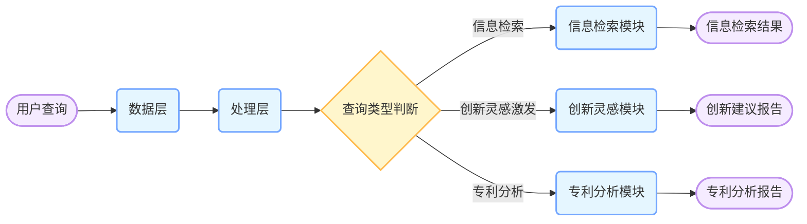

# 构建企业级AI研发助手：加速创新与专利申请流程

> 关键词：企业级AI研发助手、创新加速、专利申请流程、AI技术应用、研发效率提升

> 摘要：本文聚焦于构建企业级AI研发助手，旨在阐述其对于加速企业创新以及优化专利申请流程的重要作用。首先介绍了相关背景知识，包括构建该助手的目的、适用读者、文档结构和术语定义等。接着详细讲解了核心概念与联系，通过文本示意图和Mermaid流程图展示其架构原理。然后深入探讨了核心算法原理，并用Python代码进行详细说明，同时给出了相关数学模型和公式。在项目实战部分，提供了开发环境搭建、源代码实现及解读。之后分析了实际应用场景，推荐了学习资源、开发工具框架和相关论文著作。最后对未来发展趋势与挑战进行总结，并列出常见问题解答和扩展阅读参考资料，为企业构建和应用AI研发助手提供全面且深入的指导。

## 1. 背景介绍 
### 1.1 目的和范围
在当今竞争激烈的商业环境中，企业的创新能力和专利储备是其核心竞争力的重要组成部分。然而，传统的研发和专利申请流程往往面临着效率低下、信息获取困难、创新灵感缺乏等问题。构建企业级AI研发助手的目的在于利用先进的人工智能技术，为企业研发人员提供智能化的辅助支持，加速创新过程，提高专利申请的成功率和效率。

本文章的范围涵盖了企业级AI研发助手的核心概念、算法原理、数学模型、项目实战、实际应用场景等多个方面，旨在为企业提供一个全面的构建和应用指南。

### 1.2 预期读者
本文的预期读者主要包括企业的研发管理人员、研发工程师、专利申请人员、AI技术开发者以及对企业创新和AI应用感兴趣的专业人士。通过阅读本文，读者可以深入了解企业级AI研发助手的相关知识和技术，为企业的研发和专利工作提供新的思路和方法。

### 1.3 文档结构概述
本文将按照以下结构进行详细阐述：
1. 背景介绍：介绍构建企业级AI研发助手的目的、预期读者和文档结构。
2. 核心概念与联系：讲解企业级AI研发助手的核心概念、原理和架构，通过文本示意图和Mermaid流程图进行展示。
3. 核心算法原理 & 具体操作步骤：深入探讨核心算法原理，并用Python代码详细说明具体操作步骤。
4. 数学模型和公式 & 详细讲解 & 举例说明：给出相关数学模型和公式，并进行详细讲解和举例说明。
5. 项目实战：代码实际案例和详细解释说明，包括开发环境搭建、源代码实现和代码解读。
6. 实际应用场景：分析企业级AI研发助手在实际中的应用场景。
7. 工具和资源推荐：推荐学习资源、开发工具框架和相关论文著作。
8. 总结：未来发展趋势与挑战：对企业级AI研发助手的未来发展趋势和面临的挑战进行总结。
9. 附录：常见问题与解答：列出常见问题并给出解答。
10. 扩展阅读 & 参考资料：提供扩展阅读内容和参考资料。

### 1.4 术语表
#### 1.4.1 核心术语定义
- **企业级AI研发助手**：一种基于人工智能技术的智能化工具，为企业研发人员在研发和专利申请过程中提供辅助支持，包括信息检索、创新灵感激发、专利分析等功能。
- **创新加速**：通过各种手段和技术，缩短企业从创意产生到产品或技术实现的时间，提高创新效率。
- **专利申请流程**：企业从确定专利申请项目到最终获得专利授权的一系列步骤，包括专利检索、申请文件撰写、审查和授权等环节。

#### 1.4.2 相关概念解释
- **自然语言处理（NLP）**：是人工智能的一个重要领域，主要研究如何让计算机理解和处理人类语言，在企业级AI研发助手中可用于信息检索、文本分析等。
- **机器学习（ML）**：是一门多领域交叉学科，涉及概率论、统计学、逼近论、凸分析、算法复杂度理论等多门学科。它专门研究计算机怎样模拟或实现人类的学习行为，以获取新的知识或技能，重新组织已有的知识结构使之不断改善自身的性能。在企业级AI研发助手中可用于创新预测、专利分类等。

#### 1.4.3 缩略词列表
- **NLP**：Natural Language Processing（自然语言处理）
- **ML**：Machine Learning（机器学习）
- **AI**：Artificial Intelligence（人工智能）

## 2. 核心概念与联系 

### 核心概念原理
企业级AI研发助手的核心原理是综合运用自然语言处理、机器学习等人工智能技术，对海量的研发数据、专利文献等进行分析和挖掘，为研发人员提供有价值的信息和建议。

其主要功能包括：
1. **信息检索**：研发人员可以通过自然语言查询相关的技术资料、专利文献等，AI研发助手能够快速准确地从海量数据中检索出所需信息。
2. **创新灵感激发**：通过对已有专利和技术的分析，发现潜在的创新点和技术空白，为研发人员提供创新灵感。
3. **专利分析**：对专利的有效性、创新性、侵权风险等进行评估，帮助企业制定合理的专利战略。

### 架构的文本示意图
企业级AI研发助手的架构主要包括数据层、处理层和应用层，具体如下：
- **数据层**：存储各种研发数据和专利文献，包括内部数据库和外部数据源。
- **处理层**：对数据进行清洗、预处理、特征提取等操作，运用自然语言处理和机器学习算法进行分析和挖掘。
- **应用层**：为研发人员提供具体的应用功能，如信息检索界面、创新建议报告、专利分析报告等。

### Mermaid流程图


## 3. 核心算法原理 & 具体操作步骤 

### 核心算法原理
企业级AI研发助手主要运用以下核心算法：
1. **文本相似度算法**：用于信息检索中，计算用户查询语句与文档之间的相似度，找出最相关的文档。常用的文本相似度算法有余弦相似度、Jaccard相似度等。
2. **主题模型算法**：如Latent Dirichlet Allocation（LDA），用于对专利文献进行主题分析，发现潜在的主题和技术趋势，为创新灵感激发提供支持。
3. **分类算法**：如支持向量机（SVM）、决策树等，用于对专利进行分类，帮助企业进行专利管理和分析。

### 具体操作步骤（以文本相似度算法为例）
以下是使用Python实现余弦相似度算法的具体步骤和代码：
```python
import numpy as np
from sklearn.feature_extraction.text import TfidfVectorizer

def cosine_similarity(text1, text2):
    # 将文本转换为TF-IDF向量
    vectorizer = TfidfVectorizer()
    tfidf_matrix = vectorizer.fit_transform([text1, text2])
    # 计算余弦相似度
    cosine_sim = np.dot(tfidf_matrix[0], tfidf_matrix[1].T).toarray()[0][0]
    return cosine_sim

# 示例
query = "人工智能在企业研发中的应用"
document = "企业利用人工智能技术加速研发过程"
similarity = cosine_similarity(query, document)
print(f"查询语句与文档的余弦相似度为: {similarity}")
```
### 代码解释
1. **导入必要的库**：导入`numpy`用于数值计算，`TfidfVectorizer`用于将文本转换为TF-IDF向量。
2. **定义余弦相似度函数**：
    - 使用`TfidfVectorizer`将输入的两个文本转换为TF-IDF矩阵。
    - 计算两个向量的点积，得到余弦相似度。
3. **示例应用**：定义一个查询语句和一个文档，调用余弦相似度函数计算相似度并输出结果。

## 4. 数学模型和公式 & 详细讲解 & 举例说明 

### 余弦相似度数学模型和公式
余弦相似度是通过计算两个向量的夹角余弦值来评估它们的相似度。对于两个向量 $\vec{A}$ 和 $\vec{B}$，余弦相似度的计算公式为：
$$
\cos(\theta) = \frac{\vec{A} \cdot \vec{B}}{\|\vec{A}\| \|\vec{B}\|}
$$
其中，$\vec{A} \cdot \vec{B}$ 表示两个向量的点积，$\|\vec{A}\|$ 和 $\|\vec{B}\|$ 分别表示两个向量的模。

### 详细讲解
- 点积：$\vec{A} \cdot \vec{B} = \sum_{i=1}^{n} A_i B_i$，其中 $A_i$ 和 $B_i$ 分别是向量 $\vec{A}$ 和 $\vec{B}$ 的第 $i$ 个元素。
- 向量的模：$\|\vec{A}\| = \sqrt{\sum_{i=1}^{n} A_i^2}$，$\|\vec{B}\| = \sqrt{\sum_{i=1}^{n} B_i^2}$。

余弦相似度的取值范围是 $[-1, 1]$，值越接近 1 表示两个向量越相似，值越接近 -1 表示两个向量越不相似。

### 举例说明
假设有两个向量 $\vec{A} = [1, 2, 3]$ 和 $\vec{B} = [2, 4, 6]$，计算它们的余弦相似度：
1. 计算点积：$\vec{A} \cdot \vec{B} = 1\times2 + 2\times4 + 3\times6 = 2 + 8 + 18 = 28$
2. 计算向量的模：
    - $\|\vec{A}\| = \sqrt{1^2 + 2^2 + 3^2} = \sqrt{1 + 4 + 9} = \sqrt{14}$
    - $\|\vec{B}\| = \sqrt{2^2 + 4^2 + 6^2} = \sqrt{4 + 16 + 36} = \sqrt{56} = 2\sqrt{14}$
3. 计算余弦相似度：
$$
\cos(\theta) = \frac{\vec{A} \cdot \vec{B}}{\|\vec{A}\| \|\vec{B}\|} = \frac{28}{\sqrt{14} \times 2\sqrt{14}} = \frac{28}{2\times14} = 1
$$
由于余弦相似度为 1，说明这两个向量完全相似。

## 5. 项目实战：代码实际案例和详细解释说明 

### 5.1  开发环境搭建
#### 操作系统
建议使用 Linux 或 macOS 系统，这些系统对 Python 开发有较好的支持。

#### Python 环境
安装 Python 3.7 及以上版本，可以使用 Anaconda 进行 Python 环境的管理。

#### 依赖库安装
使用以下命令安装必要的依赖库：
```sh
pip install numpy scikit-learn pandas
```

### 5.2  源代码详细实现和代码解读
以下是一个简单的企业级AI研发助手信息检索模块的源代码示例：
```python
import pandas as pd
from sklearn.feature_extraction.text import TfidfVectorizer
from sklearn.metrics.pairwise import cosine_similarity

# 加载专利文献数据
def load_data(file_path):
    data = pd.read_csv(file_path)
    return data

# 计算文本相似度
def calculate_similarity(query, documents):
    vectorizer = TfidfVectorizer()
    tfidf_matrix = vectorizer.fit_transform([query] + documents)
    query_vector = tfidf_matrix[0]
    document_vectors = tfidf_matrix[1:]
    similarities = cosine_similarity(query_vector, document_vectors).flatten()
    return similarities

# 信息检索
def information_retrieval(query, data, top_n=5):
    documents = data['abstract'].tolist()
    similarities = calculate_similarity(query, documents)
    sorted_indices = similarities.argsort()[::-1]
    top_documents = data.iloc[sorted_indices[:top_n]]
    return top_documents

# 主函数
def main():
    file_path = 'patent_data.csv'
    data = load_data(file_path)
    query = "人工智能在医疗领域的应用"
    top_documents = information_retrieval(query, data)
    print(top_documents)

if __name__ == "__main__":
    main()
```
### 代码解读
1. **加载专利文献数据**：`load_data` 函数使用 `pandas` 库加载存储专利文献数据的 CSV 文件。
2. **计算文本相似度**：`calculate_similarity` 函数使用 `TfidfVectorizer` 将查询语句和文档转换为 TF-IDF 向量，然后使用 `cosine_similarity` 函数计算查询语句与文档之间的余弦相似度。
3. **信息检索**：`information_retrieval` 函数根据计算得到的相似度对文档进行排序，选择相似度最高的前 `top_n` 个文档作为检索结果。
4. **主函数**：`main` 函数调用上述函数，加载数据，进行信息检索并输出结果。

### 5.3  代码解读与分析
通过上述代码，我们实现了一个简单的信息检索模块。其核心思想是将查询语句和文档转换为向量表示，然后计算向量之间的相似度，根据相似度对文档进行排序，从而找到最相关的文档。

在实际应用中，可以根据需要对代码进行扩展，例如增加数据预处理步骤、优化相似度计算算法等，以提高信息检索的准确性和效率。

## 6. 实际应用场景 
### 研发过程中的信息检索
研发人员在进行技术研究和产品开发时，需要获取大量的相关信息。企业级AI研发助手可以通过自然语言查询，快速准确地从海量的研发数据和专利文献中检索出所需信息，帮助研发人员节省时间和精力。

### 创新灵感激发
AI研发助手可以对已有专利和技术进行分析，发现潜在的创新点和技术空白。例如，通过主题模型算法分析专利文献的主题分布，找出热门主题和新兴趋势，为研发人员提供创新灵感。

### 专利申请流程优化
在专利申请过程中，AI研发助手可以对专利的有效性、创新性、侵权风险等进行评估。通过对大量专利数据的分析，帮助企业判断专利申请的可行性，制定合理的专利战略，提高专利申请的成功率。

### 技术竞争分析
企业级AI研发助手可以对竞争对手的专利情况进行分析，了解竞争对手的技术优势和劣势，为企业的研发决策提供参考。例如，分析竞争对手的专利布局，发现潜在的技术竞争领域，提前进行技术储备。

## 7. 工具和资源推荐
### 7.1 学习资源推荐
#### 7.1.1 书籍推荐
- 《Python 自然语言处理》：全面介绍了Python在自然语言处理领域的应用，包括文本处理、词性标注、命名实体识别等内容。
- 《机器学习实战》：通过实际案例介绍了机器学习的基本算法和应用，帮助读者快速掌握机器学习的实践技能。
- 《专利信息分析与利用》：系统阐述了专利信息分析的方法和技巧，以及如何利用专利信息进行技术创新和战略决策。

#### 7.1.2 在线课程
- Coursera上的“自然语言处理专项课程”：由顶尖高校的教授授课，深入讲解自然语言处理的理论和实践。
- edX上的“机器学习基础”：提供了机器学习的基础知识和算法实现，适合初学者学习。
- 中国大学MOOC上的“专利信息分析与利用”：结合实际案例，介绍了专利信息分析的方法和工具。

#### 7.1.3 技术博客和网站
- Towards Data Science：发布了大量关于数据科学、机器学习和人工智能的技术文章和教程。
- 机器之心：专注于人工智能领域的资讯和技术分享，提供了丰富的行业动态和技术解读。
- 国家知识产权局官网：提供了大量的专利信息和相关政策法规，是了解专利领域的重要渠道。

### 7.2 开发工具框架推荐
#### 7.2.1 IDE和编辑器
- PyCharm：一款专业的Python集成开发环境，提供了丰富的代码编辑、调试和版本控制功能。
- Jupyter Notebook：一种交互式的开发环境，适合进行数据探索和模型验证，支持多种编程语言。
- Visual Studio Code：一款轻量级的代码编辑器，具有丰富的插件生态系统，支持Python开发。

#### 7.2.2 调试和性能分析工具
- PDB：Python自带的调试器，可以帮助开发者定位代码中的错误。
- cProfile：Python的性能分析工具，可以分析代码的运行时间和函数调用情况。
- TensorBoard：用于可视化深度学习模型的训练过程和性能指标。

#### 7.2.3 相关框架和库
- NLTK：自然语言处理工具包，提供了丰富的文本处理功能和语料库。
- Scikit-learn：机器学习库，包含了各种机器学习算法和工具，方便进行模型训练和评估。
- Pandas：数据处理和分析库，提供了高效的数据结构和数据操作方法。

### 7.3 相关论文著作推荐
#### 7.3.1 经典论文
- 《Latent Dirichlet Allocation》：介绍了LDA主题模型的原理和算法，是主题模型领域的经典论文。
- 《Support-Vector Networks》：提出了支持向量机的概念和算法，在机器学习领域具有重要的影响力。
- 《A Mathematical Theory of Communication》：奠定了信息论的基础，对自然语言处理和机器学习有重要的启示作用。

#### 7.3.2 最新研究成果
- 关注顶级学术会议如ACL（计算语言学协会年会）、ICML（国际机器学习会议）、KDD（知识发现与数据挖掘会议）等上发表的最新研究成果，了解企业级AI研发助手相关领域的前沿技术。

#### 7.3.3 应用案例分析
- 研究国内外企业在构建和应用AI研发助手方面的成功案例，分析其技术选型、应用场景和实施效果，为自身企业的实践提供参考。

## 8. 总结：未来发展趋势与挑战
### 未来发展趋势
1. **多模态融合**：未来的企业级AI研发助手将不仅仅局限于文本分析，还将融合图像、语音、视频等多模态数据，提供更加全面和准确的信息支持。
2. **智能化程度提升**：随着人工智能技术的不断发展，AI研发助手的智能化程度将不断提高，能够更加准确地理解研发人员的需求，提供更加个性化的服务。
3. **与企业信息系统深度集成**：AI研发助手将与企业的研发管理系统、知识产权管理系统等深度集成，实现数据的共享和业务流程的自动化，提高企业的整体运营效率。

### 挑战
1. **数据质量和安全问题**：企业级AI研发助手需要处理大量的敏感数据，如研发数据、专利信息等，数据质量和安全是需要解决的重要问题。
2. **算法复杂度和可解释性**：一些先进的人工智能算法如深度学习算法具有较高的复杂度，其决策过程难以解释，这在企业应用中可能会带来一定的风险。
3. **人才短缺**：构建和应用企业级AI研发助手需要具备人工智能、自然语言处理、专利分析等多方面知识的复合型人才，目前这类人才相对短缺。

## 9. 附录：常见问题与解答
### 问题1：企业级AI研发助手需要多少数据才能正常工作？
解答：数据量的需求取决于具体的应用场景和算法。一般来说，数据量越大，模型的性能越好。对于信息检索和主题分析等任务，至少需要数千条专利文献数据才能获得较好的效果。

### 问题2：如何保证AI研发助手的信息检索结果的准确性？
解答：可以通过以下方法提高信息检索结果的准确性：
- 对数据进行清洗和预处理，去除噪声和无用信息。
- 优化相似度计算算法，如使用更复杂的文本特征表示方法。
- 引入人工反馈机制，对检索结果进行评估和调整。

### 问题3：AI研发助手能否替代研发人员进行创新？
解答：AI研发助手不能替代研发人员进行创新，但可以为研发人员提供有价值的信息和建议，帮助他们更好地进行创新。创新需要人类的创造力和思维能力，AI研发助手只是一种辅助工具。

## 10. 扩展阅读 & 参考资料
### 扩展阅读
- 《人工智能时代的企业创新》：探讨了人工智能技术对企业创新的影响和机遇。
- 《专利战略与企业竞争优势》：介绍了企业如何制定有效的专利战略，提升自身的竞争优势。
- 《自然语言处理入门》：适合初学者深入学习自然语言处理的基础知识和技术。

### 参考资料
- 国家知识产权局发布的相关政策法规和统计数据。
- 学术数据库如IEEE Xplore、ACM Digital Library等上的相关研究论文。
- 开源项目如NLTK、Scikit-learn等的官方文档和代码仓库。

作者：AI天才研究院/AI Genius Institute & 禅与计算机程序设计艺术 /Zen And The Art of Computer Programming