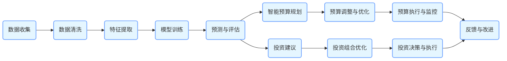

# 构建企业级AI财务顾问：智能预算规划与投资建议

> 关键词：企业级AI财务顾问、智能预算规划、投资建议、机器学习、数据分析

> 摘要：本文围绕构建企业级AI财务顾问展开，重点探讨智能预算规划与投资建议两大核心功能。详细介绍了相关核心概念、算法原理、数学模型，通过项目实战展示具体代码实现与分析。阐述了其在企业财务管理中的实际应用场景，推荐了学习、开发相关的工具和资源，最后总结了未来发展趋势与挑战，并给出常见问题解答及扩展阅读参考资料，旨在为企业构建高效的AI财务顾问系统提供全面的技术指导和实践思路。

## 1. 背景介绍 
### 1.1 目的和范围
在当今数字化时代，企业面临着日益复杂的财务决策环境。传统的财务顾问模式往往受限于人力和经验，难以满足企业对高效、精准财务决策的需求。构建企业级AI财务顾问的目的在于利用人工智能技术，为企业提供智能预算规划和投资建议，帮助企业优化财务资源配置，降低财务风险，提高投资回报率。

本文的范围主要涵盖了构建企业级AI财务顾问系统的核心技术和方法，包括核心概念的介绍、算法原理的阐述、数学模型的建立、项目实战的展示以及实际应用场景的分析等方面。

### 1.2 预期读者
本文的预期读者包括企业财务管理人员、AI技术开发者、金融分析师以及对企业级AI财务顾问感兴趣的专业人士。对于财务管理人员来说，本文可以帮助他们了解如何利用AI技术提升企业财务管理水平；对于AI技术开发者，本文提供了具体的算法实现和代码示例，有助于他们进行相关系统的开发；对于金融分析师，本文可以为他们提供新的分析思路和方法。

### 1.3 文档结构概述
本文将按照以下结构进行组织：
1. **背景介绍**：阐述构建企业级AI财务顾问的目的和范围，明确预期读者，并对文档结构进行概述。
2. **核心概念与联系**：介绍与企业级AI财务顾问相关的核心概念，如智能预算规划、投资建议等，并展示它们之间的联系。
3. **核心算法原理 & 具体操作步骤**：详细讲解用于智能预算规划和投资建议的核心算法原理，并给出具体的操作步骤，同时使用Python源代码进行阐述。
4. **数学模型和公式 & 详细讲解 & 举例说明**：建立相关的数学模型，给出相应的公式，并进行详细讲解和举例说明。
5. **项目实战：代码实际案例和详细解释说明**：通过实际项目案例，展示如何实现企业级AI财务顾问系统，包括开发环境搭建、源代码详细实现和代码解读。
6. **实际应用场景**：介绍企业级AI财务顾问在不同场景下的实际应用。
7. **工具和资源推荐**：推荐学习、开发相关的工具和资源，包括书籍、在线课程、技术博客、开发工具框架和相关论文著作等。
8. **总结：未来发展趋势与挑战**：总结企业级AI财务顾问的未来发展趋势，并分析面临的挑战。
9. **附录：常见问题与解答**：对常见问题进行解答，帮助读者更好地理解和应用相关技术。
10. **扩展阅读 & 参考资料**：提供扩展阅读的相关资料，方便读者进一步深入学习。

### 1.4 术语表
#### 1.4.1 核心术语定义
- **企业级AI财务顾问**：利用人工智能技术，为企业提供财务决策支持的系统，包括智能预算规划和投资建议等功能。
- **智能预算规划**：通过分析企业的历史财务数据、业务数据和市场数据等，利用机器学习算法自动生成合理的预算计划。
- **投资建议**：根据企业的财务状况、风险偏好和市场趋势等因素，利用数据分析和机器学习模型为企业提供投资方向和投资组合的建议。
- **机器学习**：一门多领域交叉学科，涉及概率论、统计学、逼近论、凸分析、算法复杂度理论等多门学科。它专门研究计算机怎样模拟或实现人类的学习行为，以获取新的知识或技能，重新组织已有的知识结构使之不断改善自身的性能。
- **数据分析**：指用适当的统计分析方法对收集来的大量数据进行分析，将它们加以汇总和理解并消化，以求最大化地开发数据的功能，发挥数据的作用。

#### 1.4.2 相关概念解释
- **预算编制**：企业根据战略规划和经营目标，对未来一定时期内的收入、成本、费用等进行预测和规划的过程。
- **投资组合**：由投资人或金融机构所持有的股票、债券、金融衍生产品等组成的集合。投资组合的目的是分散风险、实现资产的优化配置。
- **风险评估**：对投资项目或投资组合的风险进行评估和分析的过程，包括市场风险、信用风险、流动性风险等。

#### 1.4.3 缩略词列表
- **AI**：Artificial Intelligence，人工智能
- **ML**：Machine Learning，机器学习
- **PCA**：Principal Component Analysis，主成分分析
- **SVM**：Support Vector Machine，支持向量机
- **LSTM**：Long Short-Term Memory，长短期记忆网络

## 2. 核心概念与联系 

### 核心概念原理
#### 智能预算规划
智能预算规划是企业级AI财务顾问的核心功能之一。其原理是通过收集企业的历史财务数据、业务数据和市场数据等多源数据，利用机器学习算法对这些数据进行分析和挖掘，找出数据中的规律和趋势。例如，通过分析企业过去几年的销售数据、成本数据和费用数据，预测未来一段时间内的收入、成本和费用情况。然后，根据企业的战略目标和经营计划，结合预测结果，生成合理的预算计划。智能预算规划可以帮助企业合理安排财务资源，提高资金使用效率，降低财务风险。

#### 投资建议
投资建议是企业级AI财务顾问的另一个重要功能。其原理是综合考虑企业的财务状况、风险偏好和市场趋势等因素，利用数据分析和机器学习模型对各种投资项目进行评估和分析。例如，通过分析股票的历史价格数据、财务报表数据和行业数据，预测股票的未来走势；通过分析债券的信用评级、利率走势和市场供求关系，评估债券的投资价值。然后，根据评估结果，为企业提供投资方向和投资组合的建议。投资建议可以帮助企业优化投资决策，提高投资回报率，实现资产的保值增值。

### 架构的文本示意图
企业级AI财务顾问系统主要由数据层、算法层和应用层组成。

- **数据层**：负责收集、存储和管理企业的各种财务数据、业务数据和市场数据等。数据来源包括企业内部的财务系统、业务系统和外部的金融数据提供商等。
- **算法层**：利用机器学习、数据分析等算法对数据层的数据进行处理和分析。包括数据清洗、特征提取、模型训练和预测等环节。常用的算法包括线性回归、逻辑回归、决策树、支持向量机、神经网络等。
- **应用层**：将算法层的分析结果以可视化的方式呈现给用户，为用户提供智能预算规划和投资建议等服务。应用层可以通过网页、移动应用等方式与用户进行交互。

### Mermaid 流程图


该流程图展示了企业级AI财务顾问系统的主要流程，包括数据收集、数据清洗、特征提取、模型训练、预测与评估、智能预算规划、投资建议、预算调整与优化、投资组合优化、预算执行与监控、投资决策与执行以及反馈与改进等环节。

## 3. 核心算法原理 & 具体操作步骤 

### 智能预算规划算法原理及Python实现
#### 线性回归算法原理
线性回归是一种用于预测连续数值的机器学习算法。其基本思想是通过找到一条直线或超平面，使得数据点到该直线或超平面的距离之和最小。对于一元线性回归，其模型可以表示为：

$$y = \beta_0 + \beta_1x + \epsilon$$

其中，$y$ 是因变量，$x$ 是自变量，$\beta_0$ 和 $\beta_1$ 是模型的参数，$\epsilon$ 是误差项。

对于多元线性回归，其模型可以表示为：

$$y = \beta_0 + \beta_1x_1 + \beta_2x_2 + \cdots + \beta_nx_n + \epsilon$$

其中，$x_1, x_2, \cdots, x_n$ 是自变量，$\beta_0, \beta_1, \cdots, \beta_n$ 是模型的参数。

#### 具体操作步骤
1. **数据收集**：收集企业的历史财务数据，如销售收入、成本、费用等。
2. **数据清洗**：对收集到的数据进行清洗，去除缺失值、异常值等。
3. **特征选择**：选择与预算规划相关的特征，如时间、季节、市场需求等。
4. **模型训练**：使用线性回归算法对数据进行训练，得到模型的参数。
5. **预测**：使用训练好的模型对未来的预算进行预测。

#### Python代码实现
```python
import numpy as np
from sklearn.linear_model import LinearRegression

# 示例数据
X = np.array([[1], [2], [3], [4], [5]])
y = np.array([2, 4, 6, 8, 10])

# 创建线性回归模型
model = LinearRegression()

# 训练模型
model.fit(X, y)

# 预测未来预算
future_X = np.array([[6]])
predicted_y = model.predict(future_X)

print("预测的预算值为:", predicted_y[0])
```

### 投资建议算法原理及Python实现
#### 支持向量机算法原理
支持向量机是一种用于分类和回归的机器学习算法。其基本思想是通过找到一个最优的超平面，将不同类别的数据点分开。对于线性可分的情况，支持向量机可以找到一个唯一的最优超平面；对于线性不可分的情况，支持向量机可以通过引入核函数将数据映射到高维空间，使得数据在高维空间中线性可分。

#### 具体操作步骤
1. **数据收集**：收集各种投资项目的历史数据，如股票价格、债券收益率等。
2. **数据清洗**：对收集到的数据进行清洗，去除缺失值、异常值等。
3. **特征提取**：提取与投资项目相关的特征，如收益率、波动率、市盈率等。
4. **模型训练**：使用支持向量机算法对数据进行训练，得到模型的参数。
5. **预测与评估**：使用训练好的模型对投资项目进行预测和评估，为企业提供投资建议。

#### Python代码实现
```python
from sklearn import datasets
from sklearn.model_selection import train_test_split
from sklearn.svm import SVC

# 加载示例数据集
iris = datasets.load_iris()
X = iris.data
y = iris.target

# 划分训练集和测试集
X_train, X_test, y_train, y_test = train_test_split(X, y, test_size=0.3, random_state=42)

# 创建支持向量机模型
model = SVC()

# 训练模型
model.fit(X_train, y_train)

# 预测
predictions = model.predict(X_test)

# 评估模型
accuracy = model.score(X_test, y_test)
print("模型的准确率为:", accuracy)
```

## 4. 数学模型和公式 & 详细讲解 & 举例说明 

### 智能预算规划的数学模型
#### 线性回归模型
如前面所述，线性回归模型的一般形式为：

$$y = \beta_0 + \beta_1x_1 + \beta_2x_2 + \cdots + \beta_nx_n + \epsilon$$

其中，$y$ 是因变量（如预算值），$x_1, x_2, \cdots, x_n$ 是自变量（如时间、市场需求等），$\beta_0, \beta_1, \cdots, \beta_n$ 是模型的参数，$\epsilon$ 是误差项。

模型的目标是找到一组参数 $\beta_0, \beta_1, \cdots, \beta_n$，使得误差项 $\epsilon$ 的平方和最小，即：

$$\min_{\beta_0, \beta_1, \cdots, \beta_n} \sum_{i=1}^{m} (y_i - (\beta_0 + \beta_1x_{i1} + \beta_2x_{i2} + \cdots + \beta_nx_{in}))^2$$

其中，$m$ 是样本数量，$y_i$ 是第 $i$ 个样本的因变量值，$x_{i1}, x_{i2}, \cdots, x_{in}$ 是第 $i$ 个样本的自变量值。

#### 举例说明
假设我们要预测企业的销售收入，我们可以选择时间作为自变量。已知过去 5 年的销售收入数据如下：

| 年份 | 销售收入（万元） |
| ---- | ---- |
| 2017 | 100 |
| 2018 | 120 |
| 2019 | 140 |
| 2020 | 160 |
| 2021 | 180 |

我们可以使用线性回归模型来预测 2022 年的销售收入。设年份为 $x$，销售收入为 $y$，则线性回归模型为：

$$y = \beta_0 + \beta_1x + \epsilon$$

通过最小二乘法求解模型的参数 $\beta_0$ 和 $\beta_1$，得到：

$$\beta_1 = \frac{\sum_{i=1}^{n} (x_i - \bar{x})(y_i - \bar{y})}{\sum_{i=1}^{n} (x_i - \bar{x})^2}$$

$$\beta_0 = \bar{y} - \beta_1\bar{x}$$

其中，$\bar{x}$ 和 $\bar{y}$ 分别是 $x$ 和 $y$ 的均值。

计算得到 $\beta_0 = 60$，$\beta_1 = 20$，则线性回归模型为：

$$y = 60 + 20x$$

将 $x = 2022$ 代入模型，得到预测的销售收入为：

$$y = 60 + 20\times2022 = 40500$$（万元）

### 投资建议的数学模型
#### 夏普比率模型
夏普比率是一种用于评估投资组合绩效的指标，它衡量了投资组合在承担单位风险时所获得的超额回报。其计算公式为：

$$Sharpe Ratio = \frac{R_p - R_f}{\sigma_p}$$

其中，$R_p$ 是投资组合的预期收益率，$R_f$ 是无风险收益率，$\sigma_p$ 是投资组合的标准差。

#### 举例说明
假设一个投资组合的预期收益率为 15%，无风险收益率为 3%，标准差为 20%，则该投资组合的夏普比率为：

$$Sharpe Ratio = \frac{0.15 - 0.03}{0.2} = 0.6$$

夏普比率越高，说明投资组合在承担单位风险时所获得的超额回报越高，投资组合的绩效越好。

## 5. 项目实战：代码实际案例和详细解释说明 

### 5.1  开发环境搭建
#### 操作系统
推荐使用 Linux 或 macOS 操作系统，也可以使用 Windows 操作系统。

#### 编程语言
使用 Python 作为开发语言，Python 具有丰富的机器学习和数据分析库，如 NumPy、Pandas、Scikit-learn 等。

#### 开发工具
推荐使用 Jupyter Notebook 或 PyCharm 作为开发工具。Jupyter Notebook 适合进行交互式开发和数据分析，PyCharm 适合进行大规模项目的开发和调试。

#### 安装必要的库
在命令行中使用以下命令安装必要的库：
```bash
pip install numpy pandas scikit-learn matplotlib
```

### 5.2  源代码详细实现和代码解读
#### 智能预算规划代码实现
```python
import numpy as np
import pandas as pd
from sklearn.linear_model import LinearRegression
import matplotlib.pyplot as plt

# 读取数据
data = pd.read_csv('budget_data.csv')

# 提取特征和目标变量
X = data[['time']].values
y = data['budget'].values

# 创建线性回归模型
model = LinearRegression()

# 训练模型
model.fit(X, y)

# 预测未来预算
future_time = np.array([[10]])  # 假设预测第 10 期的预算
predicted_budget = model.predict(future_time)

print("预测的预算值为:", predicted_budget[0])

# 可视化结果
plt.scatter(X, y, color='blue')
plt.plot(X, model.predict(X), color='red')
plt.xlabel('时间')
plt.ylabel('预算')
plt.title('智能预算规划')
plt.show()
```

#### 代码解读
1. **数据读取**：使用 Pandas 库读取存储在 `budget_data.csv` 文件中的历史预算数据。
2. **特征提取**：从数据中提取时间作为特征，预算作为目标变量。
3. **模型创建**：创建线性回归模型。
4. **模型训练**：使用历史数据对模型进行训练。
5. **预测**：使用训练好的模型对未来的预算进行预测。
6. **可视化**：使用 Matplotlib 库将历史数据和预测结果可视化。

#### 投资建议代码实现
```python
import numpy as np
import pandas as pd
from sklearn.svm import SVC
from sklearn.model_selection import train_test_split
from sklearn.metrics import accuracy_score

# 读取数据
data = pd.read_csv('investment_data.csv')

# 提取特征和目标变量
X = data.drop('label', axis=1).values
y = data['label'].values

# 划分训练集和测试集
X_train, X_test, y_train, y_test = train_test_split(X, y, test_size=0.2, random_state=42)

# 创建支持向量机模型
model = SVC()

# 训练模型
model.fit(X_train, y_train)

# 预测
predictions = model.predict(X_test)

# 评估模型
accuracy = accuracy_score(y_test, predictions)
print("模型的准确率为:", accuracy)
```

#### 代码解读
1. **数据读取**：使用 Pandas 库读取存储在 `investment_data.csv` 文件中的投资项目数据。
2. **特征提取**：从数据中提取除标签以外的所有列作为特征，标签作为目标变量。
3. **数据划分**：将数据划分为训练集和测试集。
4. **模型创建**：创建支持向量机模型。
5. **模型训练**：使用训练集数据对模型进行训练。
6. **预测**：使用训练好的模型对测试集数据进行预测。
7. **评估**：使用准确率指标评估模型的性能。

### 5.3  代码解读与分析
#### 智能预算规划代码分析
- **优点**：线性回归模型简单易懂，计算效率高，适合处理线性关系的数据。通过可视化结果，可以直观地观察到数据的趋势和模型的拟合效果。
- **缺点**：线性回归模型假设数据之间存在线性关系，对于非线性关系的数据，模型的拟合效果可能不佳。

#### 投资建议代码分析
- **优点**：支持向量机模型可以处理线性和非线性分类问题，具有较好的泛化能力。通过评估模型的准确率，可以了解模型的性能。
- **缺点**：支持向量机模型的训练时间较长，对于大规模数据集，训练效率较低。

## 6. 实际应用场景 
### 企业预算管理
企业级AI财务顾问可以帮助企业进行智能预算规划，根据企业的历史财务数据、业务数据和市场数据等，自动生成合理的预算计划。例如，企业可以使用AI财务顾问预测未来一段时间内的销售收入、成本和费用，从而制定相应的预算目标。同时，AI财务顾问可以实时监控预算的执行情况，及时发现预算偏差并提供调整建议，帮助企业实现预算的动态管理。

### 投资决策支持
企业在进行投资决策时，往往需要考虑多种因素，如投资项目的风险、收益、市场前景等。企业级AI财务顾问可以通过对各种投资项目的数据分析和评估，为企业提供投资建议。例如，AI财务顾问可以分析股票的基本面数据和技术指标，预测股票的未来走势；可以评估债券的信用风险和利率风险，为企业选择合适的债券投资项目。同时，AI财务顾问可以根据企业的风险偏好和投资目标，为企业构建最优的投资组合，实现资产的优化配置。

### 财务风险预警
企业在经营过程中面临着各种财务风险，如市场风险、信用风险、流动性风险等。企业级AI财务顾问可以通过对企业的财务数据和市场数据的实时监测和分析，及时发现潜在的财务风险，并提供预警信息。例如，AI财务顾问可以分析企业的资产负债率、流动比率等财务指标，评估企业的偿债能力和流动性风险；可以监测市场利率、汇率等因素的变化，评估企业的市场风险。当发现风险指标超过预警阈值时，AI财务顾问可以及时向企业管理人员发出警报，帮助企业采取相应的风险应对措施。

## 7. 工具和资源推荐
### 7.1 学习资源推荐
#### 7.1.1 书籍推荐
- 《Python数据分析实战》：本书详细介绍了使用Python进行数据分析的方法和技巧，包括数据获取、数据清洗、数据可视化等内容，适合初学者学习。
- 《机器学习实战》：本书通过大量的实际案例，介绍了机器学习的基本算法和应用，包括分类、回归、聚类等算法，适合有一定编程基础的读者学习。
- 《深度学习》：本书是深度学习领域的经典著作，详细介绍了深度学习的基本原理、算法和应用，适合深入学习深度学习的读者阅读。

#### 7.1.2 在线课程
- Coursera上的“机器学习”课程：由斯坦福大学教授Andrew Ng主讲，是机器学习领域的经典课程，适合初学者学习。
- edX上的“深度学习”课程：由伯克利大学教授Aurélien Géron主讲，介绍了深度学习的基本原理和应用，适合有一定机器学习基础的读者学习。
- 网易云课堂上的“Python数据分析与机器学习实战”课程：该课程结合实际案例，介绍了使用Python进行数据分析和机器学习的方法和技巧，适合初学者学习。

#### 7.1.3 技术博客和网站
- Medium：是一个技术博客平台，上面有很多关于人工智能、机器学习、数据分析等领域的优质文章。
- Kaggle：是一个数据科学竞赛平台，上面有很多关于数据分析、机器学习的实际案例和开源代码，可以帮助读者学习和实践。
- Towards Data Science：是一个专注于数据科学和机器学习的博客网站，上面有很多关于数据分析、机器学习的技术文章和教程。

### 7.2 开发工具框架推荐
#### 7.2.1 IDE和编辑器
- Jupyter Notebook：是一个交互式开发环境，适合进行数据分析和机器学习的实验和开发。
- PyCharm：是一个专业的Python集成开发环境，适合进行大规模项目的开发和调试。
- Visual Studio Code：是一个轻量级的代码编辑器，支持多种编程语言，具有丰富的插件和扩展功能。

#### 7.2.2 调试和性能分析工具
- PDB：是Python自带的调试工具，可以帮助开发者调试代码。
- TensorBoard：是TensorFlow的可视化工具，可以帮助开发者监控模型的训练过程和性能。
- Py-Spy：是一个Python性能分析工具，可以帮助开发者找出代码中的性能瓶颈。

#### 7.2.3 相关框架和库
- NumPy：是Python的一个科学计算库，提供了高效的数组操作和数学函数。
- Pandas：是Python的一个数据分析库，提供了数据结构和数据分析工具。
- Scikit-learn：是Python的一个机器学习库，提供了多种机器学习算法和工具。
- TensorFlow：是Google开发的一个深度学习框架，提供了高效的深度学习模型训练和部署工具。
- PyTorch：是Facebook开发的一个深度学习框架，具有动态图和易于使用的特点。

### 7.3 相关论文著作推荐
#### 7.3.1 经典论文
- 《A Few Useful Things to Know about Machine Learning》：这篇论文介绍了机器学习的一些基本概念和方法，以及在实际应用中需要注意的问题。
- 《Deep Learning》：这篇论文是深度学习领域的经典论文，介绍了深度学习的基本原理和应用。
- 《Support-Vector Networks》：这篇论文是支持向量机领域的经典论文，介绍了支持向量机的基本原理和算法。

#### 7.3.2 最新研究成果
- 《Attention Is All You Need》：这篇论文提出了Transformer模型，是自然语言处理领域的重要研究成果。
- 《Generative Adversarial Networks》：这篇论文提出了生成对抗网络（GAN），是生成式模型领域的重要研究成果。
- 《BERT: Pre-training of Deep Bidirectional Transformers for Language Understanding》：这篇论文提出了BERT模型，是自然语言处理领域的重要研究成果。

#### 7.3.3 应用案例分析
- 《Applying Machine Learning to Personalized Financial Advice》：这篇论文介绍了如何使用机器学习技术为个人提供个性化的财务建议。
- 《AI-Powered Financial Planning and Analysis》：这篇论文介绍了如何使用人工智能技术进行财务规划和分析。
- 《Using Machine Learning for Investment Portfolio Optimization》：这篇论文介绍了如何使用机器学习技术进行投资组合优化。

## 8. 总结：未来发展趋势与挑战
### 未来发展趋势
#### 智能化程度不断提高
随着人工智能技术的不断发展，企业级AI财务顾问的智能化程度将不断提高。未来，AI财务顾问将能够更加准确地理解企业的财务需求和业务情况，提供更加个性化、智能化的财务决策支持。例如，AI财务顾问可以通过自然语言处理技术与企业管理人员进行交互，更加方便地获取企业的财务信息和需求；可以通过深度学习技术对大量的财务数据和市场数据进行分析和挖掘，发现更多的潜在价值和规律。

#### 与其他技术融合发展
企业级AI财务顾问将与其他技术如区块链、物联网等融合发展。区块链技术可以提供安全、可靠的财务数据存储和共享平台，保证财务数据的真实性和完整性；物联网技术可以实时采集企业的生产、销售等数据，为AI财务顾问提供更加丰富的数据源。通过与其他技术的融合发展，企业级AI财务顾问将能够为企业提供更加全面、深入的财务决策支持。

#### 应用场景不断拓展
企业级AI财务顾问的应用场景将不断拓展。除了智能预算规划和投资建议等传统应用场景外，AI财务顾问还将应用于企业的税务筹划、风险管理、财务审计等领域。例如，AI财务顾问可以通过对企业的财务数据和税务政策的分析，为企业提供最优的税务筹划方案；可以通过对企业的风险指标的实时监测和分析，为企业提供风险管理建议；可以通过对企业的财务报表的自动化审计，提高审计效率和准确性。

### 挑战
#### 数据质量和安全问题
企业级AI财务顾问的性能和效果依赖于大量的高质量财务数据。然而，在实际应用中，企业的财务数据往往存在质量不高、不完整、不准确等问题，这将影响AI财务顾问的分析和预测结果。同时，财务数据涉及企业的商业机密和敏感信息，数据安全问题也是企业面临的重要挑战。如何保证财务数据的质量和安全，是企业级AI财务顾问发展面临的重要问题。

#### 算法可解释性问题
人工智能算法往往被视为“黑匣子”，其决策过程和结果难以解释。在企业级AI财务顾问中，算法的可解释性问题尤为重要。企业管理人员需要了解AI财务顾问的决策依据和过程，以便做出合理的财务决策。如何提高人工智能算法的可解释性，是企业级AI财务顾问发展面临的另一个重要问题。

#### 人才短缺问题
企业级AI财务顾问的开发和应用需要既懂人工智能技术又懂财务管理的复合型人才。然而，目前市场上这类复合型人才非常短缺，这将制约企业级AI财务顾问的发展。如何培养和吸引更多的复合型人才，是企业级AI财务顾问发展面临的重要挑战。

## 9. 附录：常见问题与解答
### 1. 企业级AI财务顾问与传统财务顾问有什么区别？
企业级AI财务顾问利用人工智能技术，能够处理大量的财务数据和市场数据，提供更加准确、高效的财务决策支持。与传统财务顾问相比，AI财务顾问具有以下优势：
- **数据处理能力强**：可以处理海量的财务数据和市场数据，发现更多的潜在价值和规律。
- **决策速度快**：可以实时分析和处理数据，快速提供财务决策建议。
- **个性化服务**：可以根据企业的财务状况、风险偏好和经营目标等因素，提供个性化的财务决策支持。

### 2. 企业级AI财务顾问的准确性如何保证？
企业级AI财务顾问的准确性可以通过以下方式保证：
- **数据质量**：确保收集到的财务数据和市场数据准确、完整、可靠。
- **算法选择**：选择合适的机器学习算法和模型，根据数据的特点和问题的性质进行调整和优化。
- **模型评估和验证**：使用交叉验证、留出法等方法对模型进行评估和验证，确保模型的泛化能力和准确性。
- **实时监测和更新**：实时监测模型的性能和效果，根据新的数据和情况对模型进行更新和优化。

### 3. 企业级AI财务顾问是否会取代传统财务人员？
企业级AI财务顾问不会完全取代传统财务人员。虽然AI财务顾问可以提供高效、准确的财务决策支持，但在一些方面，传统财务人员仍然具有不可替代的作用。例如，传统财务人员具有丰富的财务管理经验和专业知识，能够理解企业的业务和财务需求，与企业管理人员进行有效的沟通和协作；在处理复杂的财务问题和决策时，传统财务人员可以发挥主观能动性和判断力，提供更加全面、深入的分析和建议。因此，企业级AI财务顾问和传统财务人员可以相互补充，共同为企业的财务管理提供支持。

### 4. 企业级AI财务顾问的实施成本高吗？
企业级AI财务顾问的实施成本包括硬件设备、软件系统、数据采集和处理、人员培训等方面的费用。具体的实施成本取决于企业的规模、需求和应用场景等因素。一般来说，对于大型企业，实施成本相对较高；对于小型企业，可以选择一些轻量级的AI财务顾问解决方案，实施成本相对较低。同时，随着人工智能技术的不断发展和普及，AI财务顾问的实施成本也在逐渐降低。

## 10. 扩展阅读 & 参考资料
### 扩展阅读
- 《人工智能时代的财务管理变革》
- 《智能财务：新技术驱动的财务管理创新》
- 《金融科技：重塑未来金融格局》

### 参考资料
- 《机器学习》（周志华著）
- 《Python机器学习实战》（Sebastian Raschka著）
- 《深度学习入门：基于Python的理论与实现》（斋藤康毅著）

作者：AI天才研究院/AI Genius Institute & 禅与计算机程序设计艺术 /Zen And The Art of Computer Programming