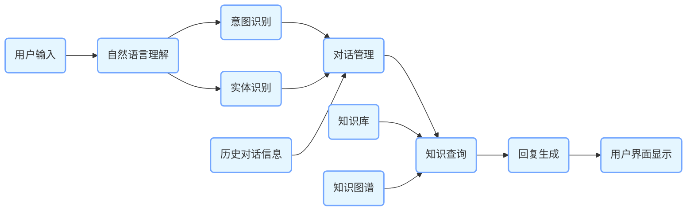

# 构建企业级对话式AI Agent：提升内部沟通效率

> 关键词：企业级、对话式AI Agent、内部沟通效率、自然语言处理、智能交互

> 摘要：本文聚焦于构建企业级对话式AI Agent以提升内部沟通效率这一重要主题。首先介绍了相关背景，包括目的、预期读者等内容。接着阐述了核心概念与联系，深入剖析其原理和架构，并通过Mermaid流程图进行直观展示。详细讲解了核心算法原理，结合Python源代码进行说明，同时给出数学模型和公式并举例。通过项目实战，从开发环境搭建到源代码实现与解读，全面展示了构建过程。探讨了实际应用场景，推荐了相关的工具和资源。最后总结未来发展趋势与挑战，提供常见问题解答和扩展阅读参考资料，旨在为企业构建对话式AI Agent提供全面、深入的技术指导。

## 1. 背景介绍 
### 1.1 目的和范围
在当今竞争激烈的商业环境中，企业内部沟通的效率直接影响着企业的运营效率和竞争力。传统的沟通方式，如邮件、会议等，存在信息传递不及时、沟通成本高、信息理解偏差等问题。企业级对话式AI Agent的出现为解决这些问题提供了新的思路和方法。

本文的目的在于详细阐述如何构建企业级对话式AI Agent，以提升企业内部沟通效率。范围涵盖了从核心概念的理解到具体算法实现，从项目实战到实际应用场景的分析，以及相关工具和资源的推荐等方面。

### 1.2 预期读者
本文预期读者包括企业的技术决策者、IT部门人员、对AI技术在企业应用感兴趣的管理人员，以及从事自然语言处理、人工智能相关领域的技术人员和研究人员。对于希望通过引入对话式AI Agent来优化企业内部沟通流程的企业和个人具有重要的参考价值。

### 1.3 文档结构概述
本文将按照以下结构进行阐述：首先介绍背景信息，让读者了解构建企业级对话式AI Agent的必要性和本文的整体范围；接着讲解核心概念与联系，包括相关原理和架构，并通过流程图进行直观展示；然后详细介绍核心算法原理，结合Python源代码进行说明，同时给出数学模型和公式并举例；通过项目实战，从开发环境搭建到源代码实现与解读，全面展示构建过程；探讨实际应用场景，分析其在不同场景下的应用价值；推荐相关的工具和资源，为读者提供学习和实践的方向；最后总结未来发展趋势与挑战，提供常见问题解答和扩展阅读参考资料。

### 1.4 术语表
#### 1.4.1 核心术语定义
- **对话式AI Agent**：一种能够理解自然语言并与用户进行对话交互的人工智能系统，它可以根据用户的输入提供相应的回答和服务，在企业内部可用于信息查询、任务分配、流程引导等多种沟通场景。
- **自然语言处理（NLP）**：是计算机科学、人工智能和语言学的交叉领域，主要研究如何让计算机理解、处理和生成自然语言，是对话式AI Agent实现智能交互的关键技术。
- **意图识别**：在对话式AI Agent中，意图识别是指分析用户输入的文本，确定用户的真实意图，例如查询信息、请求帮助、下达任务等，以便系统做出准确的响应。
- **实体识别**：识别文本中具有特定意义的实体，如人名、地名、组织机构名、产品名等，有助于更准确地理解用户的需求。

#### 1.4.2 相关概念解释
- **深度学习**：是一种基于人工神经网络的机器学习方法，通过多层神经网络对大量数据进行学习和训练，能够自动提取数据中的特征和模式，在自然语言处理任务中取得了很好的效果。
- **知识图谱**：是一种语义网络，用于表示实体之间的关系和知识。在对话式AI Agent中，知识图谱可以提供丰富的背景知识，帮助系统更好地理解用户的问题并给出准确的回答。

#### 1.4.3 缩略词列表
- **NLP**：Natural Language Processing（自然语言处理）
- **RNN**：Recurrent Neural Network（循环神经网络）
- **LSTM**：Long Short-Term Memory（长短期记忆网络）
- **GRU**：Gated Recurrent Unit（门控循环单元）
- **Transformer**：一种基于注意力机制的深度学习模型

## 2. 核心概念与联系 
### 核心概念原理
对话式AI Agent的核心原理基于自然语言处理技术，主要包括以下几个关键步骤：
1. **自然语言理解（NLU）**：对用户输入的自然语言文本进行分析和理解，包括分词、词性标注、句法分析、意图识别、实体识别等任务。通过这些任务，将用户的自然语言转换为计算机能够理解的结构化表示。
2. **对话管理**：负责管理对话的流程和状态，根据用户的意图和历史对话信息，决定如何选择合适的回答策略和生成相应的回复。对话管理需要考虑多轮对话的连贯性和上下文信息的利用。
3. **自然语言生成（NLG）**：根据对话管理的决策，将计算机内部的结构化信息转换为自然语言文本，生成符合人类语言习惯的回复。自然语言生成需要考虑语言的流畅性、准确性和多样性。

### 架构的文本示意图
企业级对话式AI Agent的架构通常包括以下几个主要部分：
1. **用户界面层**：提供用户与AI Agent进行交互的接口，如网页界面、移动端应用、即时通讯工具等。用户通过这些界面输入自然语言文本，接收AI Agent的回复。
2. **对话服务层**：负责处理用户的输入请求，进行自然语言理解、对话管理和自然语言生成等核心任务。该层通常包括多个组件，如意图识别模块、实体识别模块、对话状态跟踪模块、回复生成模块等。
3. **知识服务层**：提供AI Agent所需的知识和数据支持，包括知识库、知识图谱、数据库等。知识服务层可以为对话服务层提供背景知识，帮助系统更好地理解用户的问题并给出准确的回答。
4. **数据存储层**：用于存储用户的对话记录、系统的配置信息、训练数据等。数据存储层可以为系统的优化和改进提供数据支持。

### Mermaid流程图

该流程图展示了企业级对话式AI Agent的主要处理流程。用户输入自然语言文本后，首先进行自然语言理解，包括意图识别和实体识别。然后对话管理模块根据用户的意图、实体信息和历史对话信息进行决策，进行知识查询。最后根据查询结果生成回复并显示给用户。

## 3. 核心算法原理 & 具体操作步骤 
### 意图识别算法原理
意图识别是对话式AI Agent的关键任务之一，常用的算法包括基于机器学习的方法和基于深度学习的方法。这里我们以基于深度学习的Transformer模型为例进行讲解。

Transformer模型是一种基于注意力机制的深度学习模型，它能够捕捉文本中的长距离依赖关系，在自然语言处理任务中取得了很好的效果。Transformer模型的核心是多头注意力机制，通过对输入序列的不同位置进行加权求和，得到每个位置的表示。

以下是一个简单的基于Transformer的意图识别的Python代码示例：
```python
import torch
import torch.nn as nn
import torch.optim as optim
from torch.utils.data import Dataset, DataLoader
from transformers import BertTokenizer, BertModel

# 定义数据集类
class IntentDataset(Dataset):
    def __init__(self, texts, labels, tokenizer, max_length):
        self.texts = texts
        self.labels = labels
        self.tokenizer = tokenizer
        self.max_length = max_length

    def __len__(self):
        return len(self.texts)

    def __getitem__(self, idx):
        text = self.texts[idx]
        label = self.labels[idx]
        encoding = self.tokenizer.encode_plus(
            text,
            add_special_tokens=True,
            max_length=self.max_length,
            padding='max_length',
            truncation=True,
            return_tensors='pt'
        )
        return {
            'input_ids': encoding['input_ids'].flatten(),
            'attention_mask': encoding['attention_mask'].flatten(),
            'labels': torch.tensor(label, dtype=torch.long)
        }

# 定义模型类
class IntentClassifier(nn.Module):
    def __init__(self, num_classes):
        super(IntentClassifier, self).__init__()
        self.bert = BertModel.from_pretrained('bert-base-uncased')
        self.dropout = nn.Dropout(0.1)
        self.fc = nn.Linear(self.bert.config.hidden_size, num_classes)

    def forward(self, input_ids, attention_mask):
        outputs = self.bert(input_ids=input_ids, attention_mask=attention_mask)
        pooled_output = outputs.pooler_output
        pooled_output = self.dropout(pooled_output)
        logits = self.fc(pooled_output)
        return logits

# 训练模型
def train_model(model, dataloader, optimizer, criterion, device, epochs):
    model.train()
    for epoch in range(epochs):
        total_loss = 0
        for batch in dataloader:
            input_ids = batch['input_ids'].to(device)
            attention_mask = batch['attention_mask'].to(device)
            labels = batch['labels'].to(device)

            optimizer.zero_grad()
            logits = model(input_ids, attention_mask)
            loss = criterion(logits, labels)
            loss.backward()
            optimizer.step()
            total_loss += loss.item()
        print(f'Epoch {epoch + 1}/{epochs}, Loss: {total_loss / len(dataloader)}')

# 示例数据
texts = ["查询今天的会议安排", "我想请假"]
labels = [0, 1]
num_classes = 2
max_length = 128
tokenizer = BertTokenizer.from_pretrained('bert-base-uncased')
dataset = IntentDataset(texts, labels, tokenizer, max_length)
dataloader = DataLoader(dataset, batch_size=2, shuffle=True)

device = torch.device('cuda' if torch.cuda.is_available() else 'cpu')
model = IntentClassifier(num_classes).to(device)
optimizer = optim.Adam(model.parameters(), lr=2e-5)
criterion = nn.CrossEntropyLoss()

train_model(model, dataloader, optimizer, criterion, device, epochs=3)
```
### 具体操作步骤
1. **数据准备**：收集和整理用于意图识别的训练数据，包括文本和对应的意图标签。
2. **数据预处理**：使用分词器对文本进行分词，并将其转换为模型能够接受的输入格式，如词向量表示。
3. **模型定义**：定义基于Transformer的意图识别模型，包括Bert模型和全连接层。
4. **模型训练**：使用训练数据对模型进行训练，通过优化器和损失函数不断调整模型的参数。
5. **模型评估**：使用测试数据对训练好的模型进行评估，计算准确率、召回率等指标，评估模型的性能。

## 4. 数学模型和公式 & 详细讲解 & 举例说明 
### 多头注意力机制数学模型
多头注意力机制是Transformer模型的核心，其数学模型可以表示为：
$$
\text{MultiHead}(Q, K, V) = \text{Concat}(\text{head}_1, \ldots, \text{head}_h)W^O
$$
其中，
$$
\text{head}_i = \text{Attention}(QW_i^Q, KW_i^K, VW_i^V)
$$
$$
\text{Attention}(Q, K, V) = \text{softmax}\left(\frac{QK^T}{\sqrt{d_k}}\right)V
$$
- $Q$、$K$、$V$ 分别是查询矩阵、键矩阵和值矩阵。
- $W_i^Q$、$W_i^K$、$W_i^V$ 是可学习的投影矩阵，用于将输入投影到不同的子空间。
- $d_k$ 是键向量的维度。
- $W^O$ 是输出投影矩阵。

### 详细讲解
多头注意力机制通过将输入的查询、键和值分别投影到多个子空间，并行地计算多个注意力头，然后将这些头的输出拼接起来并进行线性变换得到最终的输出。这样可以让模型从不同的表示子空间中捕捉输入序列的不同特征，提高模型的表达能力。

### 举例说明
假设我们有一个输入序列 $x = [x_1, x_2, x_3]$，其中每个 $x_i$ 是一个向量。我们将 $x$ 分别投影到查询、键和值矩阵 $Q$、$K$、$V$ 中。然后计算注意力分数：
$$
\text{scores} = \frac{QK^T}{\sqrt{d_k}}
$$
对于每个查询向量，注意力分数表示它与所有键向量的相关性。接着使用softmax函数将注意力分数归一化，得到注意力权重：
$$
\text{weights} = \text{softmax}(\text{scores})
$$
最后，将注意力权重与值矩阵相乘，得到每个查询向量的上下文表示：
$$
\text{context} = \text{weights}V
$$
通过多头注意力机制，我们可以并行地计算多个这样的上下文表示，然后将它们拼接起来并进行线性变换，得到最终的输出。

## 5. 项目实战：代码实际案例和详细解释说明 
### 5.1  开发环境搭建
1. **安装Python**：确保系统中安装了Python 3.6或以上版本。可以从Python官方网站（https://www.python.org/downloads/） 下载并安装。
2. **安装深度学习框架**：本文使用PyTorch作为深度学习框架，可以根据自己的系统和CUDA版本选择合适的安装方式。可以使用以下命令安装：
```bash
pip install torch torchvision
```
3. **安装自然语言处理库**：安装`transformers`库，用于使用预训练的Bert模型。可以使用以下命令安装：
```bash
pip install transformers
```

### 5.2  源代码详细实现和代码解读
以下是一个完整的企业级对话式AI Agent的实现示例，包括意图识别、对话管理和回复生成：
```python
import torch
import torch.nn as nn
import torch.optim as optim
from torch.utils.data import Dataset, DataLoader
from transformers import BertTokenizer, BertModel
import random

# 定义数据集类
class IntentDataset(Dataset):
    def __init__(self, texts, labels, tokenizer, max_length):
        self.texts = texts
        self.labels = labels
        self.tokenizer = tokenizer
        self.max_length = max_length

    def __len__(self):
        return len(self.texts)

    def __getitem__(self, idx):
        text = self.texts[idx]
        label = self.labels[idx]
        encoding = self.tokenizer.encode_plus(
            text,
            add_special_tokens=True,
            max_length=self.max_length,
            padding='max_length',
            truncation=True,
            return_tensors='pt'
        )
        return {
            'input_ids': encoding['input_ids'].flatten(),
            'attention_mask': encoding['attention_mask'].flatten(),
            'labels': torch.tensor(label, dtype=torch.long)
        }

# 定义意图识别模型类
class IntentClassifier(nn.Module):
    def __init__(self, num_classes):
        super(IntentClassifier, self).__init__()
        self.bert = BertModel.from_pretrained('bert-base-uncased')
        self.dropout = nn.Dropout(0.1)
        self.fc = nn.Linear(self.bert.config.hidden_size, num_classes)

    def forward(self, input_ids, attention_mask):
        outputs = self.bert(input_ids=input_ids, attention_mask=attention_mask)
        pooled_output = outputs.pooler_output
        pooled_output = self.dropout(pooled_output)
        logits = self.fc(pooled_output)
        return logits

# 训练意图识别模型
def train_intent_model(model, dataloader, optimizer, criterion, device, epochs):
    model.train()
    for epoch in range(epochs):
        total_loss = 0
        for batch in dataloader:
            input_ids = batch['input_ids'].to(device)
            attention_mask = batch['attention_mask'].to(device)
            labels = batch['labels'].to(device)

            optimizer.zero_grad()
            logits = model(input_ids, attention_mask)
            loss = criterion(logits, labels)
            loss.backward()
            optimizer.step()
            total_loss += loss.item()
        print(f'Epoch {epoch + 1}/{epochs}, Loss: {total_loss / len(dataloader)}')

# 定义对话管理类
class DialogManager:
    def __init__(self):
        self.intent_mapping = {
            0: "查询信息",
            1: "请假申请"
        }
        self.reply_mapping = {
            "查询信息": ["这是您要查询的信息：[信息内容]", "相关信息如下：[信息内容]"],
            "请假申请": ["已收到您的请假申请，我们会尽快处理。", "您的请假申请已提交，后续会有相关人员与您联系。"]
        }

    def get_reply(self, intent):
        intent_name = self.intent_mapping.get(intent)
        if intent_name:
            replies = self.reply_mapping.get(intent_name)
            if replies:
                return random.choice(replies)
        return "抱歉，我不理解您的问题。"

# 示例数据
texts = ["查询今天的会议安排", "我想请假"]
labels = [0, 1]
num_classes = 2
max_length = 128
tokenizer = BertTokenizer.from_pretrained('bert-base-uncased')
dataset = IntentDataset(texts, labels, tokenizer, max_length)
dataloader = DataLoader(dataset, batch_size=2, shuffle=True)

device = torch.device('cuda' if torch.cuda.is_available() else 'cpu')
intent_model = IntentClassifier(num_classes).to(device)
optimizer = optim.Adam(intent_model.parameters(), lr=2e-5)
criterion = nn.CrossEntropyLoss()

# 训练意图识别模型
train_intent_model(intent_model, dataloader, optimizer, criterion, device, epochs=3)

# 初始化对话管理器
dialog_manager = DialogManager()

# 模拟用户输入
user_input = "我想请假"
encoding = tokenizer.encode_plus(
    user_input,
    add_special_tokens=True,
    max_length=max_length,
    padding='max_length',
    truncation=True,
    return_tensors='pt'
)
input_ids = encoding['input_ids'].to(device)
attention_mask = encoding['attention_mask'].to(device)

intent_model.eval()
with torch.no_grad():
    logits = intent_model(input_ids, attention_mask)
    intent = torch.argmax(logits, dim=1).item()

reply = dialog_manager.get_reply(intent)
print(f"用户输入: {user_input}")
print(f"AI Agent回复: {reply}")
```
### 5.3  代码解读与分析
1. **数据集类**：`IntentDataset`类用于处理训练数据，将文本转换为模型能够接受的输入格式。
2. **意图识别模型类**：`IntentClassifier`类基于Bert模型，通过全连接层将Bert模型的输出映射到意图类别上。
3. **训练函数**：`train_intent_model`函数用于训练意图识别模型，通过优化器和损失函数不断调整模型的参数。
4. **对话管理类**：`DialogManager`类用于管理对话流程，根据意图识别的结果选择合适的回复。
5. **模拟用户输入**：最后部分模拟用户输入，通过意图识别模型得到用户的意图，然后通过对话管理器得到相应的回复。

## 6. 实际应用场景 
### 信息查询
企业内部员工可以通过对话式AI Agent查询各种信息，如公司政策、部门流程、项目进展等。AI Agent可以快速准确地提供相关信息，减少员工查找信息的时间和成本。

### 任务分配与跟踪
管理者可以通过AI Agent向员工分配任务，并实时跟踪任务的进展情况。员工也可以通过AI Agent汇报任务完成情况，提高任务管理的效率。

### 流程引导
对于新员工或不熟悉业务流程的员工，AI Agent可以提供流程引导，帮助他们完成各种业务操作，如入职流程、报销流程、请假流程等，减少错误和提高工作效率。

### 智能客服
在企业内部，AI Agent可以作为智能客服，回答员工的常见问题，解决员工在工作中遇到的问题，提供及时的帮助和支持。

## 7. 工具和资源推荐
### 7.1 学习资源推荐
#### 7.1.1 书籍推荐
- 《自然语言处理入门》：作者何晗，本书系统地介绍了自然语言处理的基本概念、算法和技术，适合初学者入门。
- 《深度学习》：作者Ian Goodfellow、Yoshua Bengio和Aaron Courville，本书是深度学习领域的经典教材，全面介绍了深度学习的理论和实践。
- 《Python自然语言处理》：作者Steven Bird、Ewan Klein和Edward Loper，本书介绍了如何使用Python进行自然语言处理，提供了丰富的实例和代码。

#### 7.1.2 在线课程
- Coursera上的“Natural Language Processing Specialization”：由斯坦福大学教授授课，系统地介绍了自然语言处理的各个方面。
- edX上的“Introduction to Artificial Intelligence”：介绍了人工智能的基本概念和技术，包括自然语言处理部分。
- 哔哩哔哩上的相关自然语言处理教程：有很多博主分享了自然语言处理的学习经验和代码实现，适合初学者学习。

#### 7.1.3 技术博客和网站
- Hugging Face Blog：提供了关于自然语言处理和深度学习的最新研究成果和技术分享。
- Towards Data Science：一个数据科学和人工智能领域的博客平台，有很多高质量的文章和教程。
- 机器之心：关注人工智能领域的前沿技术和应用，提供了丰富的资讯和技术文章。

### 7.2 开发工具框架推荐
#### 7.2.1 IDE和编辑器
- PyCharm：一款功能强大的Python集成开发环境，提供了代码编辑、调试、版本控制等功能，适合Python开发。
- Visual Studio Code：一款轻量级的代码编辑器，支持多种编程语言，有丰富的插件可以扩展功能。

#### 7.2.2 调试和性能分析工具
- PyTorch Profiler：PyTorch自带的性能分析工具，可以帮助开发者分析模型的性能瓶颈。
- TensorBoard：一个可视化工具，可以用于可视化模型的训练过程和性能指标。

#### 7.2.3 相关框架和库
- PyTorch：一个开源的深度学习框架，提供了丰富的深度学习模型和工具，适合自然语言处理任务。
- Transformers：Hugging Face开发的自然语言处理库，提供了大量的预训练模型和工具，方便开发者快速实现自然语言处理任务。
- NLTK：一个Python自然语言处理库，提供了丰富的自然语言处理工具和数据集，适合初学者学习和实践。

### 7.3 相关论文著作推荐
#### 7.3.1 经典论文
- “Attention Is All You Need”：介绍了Transformer模型的原理和实现，是自然语言处理领域的经典论文。
- “BERT: Pre-training of Deep Bidirectional Transformers for Language Understanding”：介绍了Bert模型的预训练方法和应用，在自然语言处理任务中取得了很好的效果。

#### 7.3.2 最新研究成果
- 关注ACL（Association for Computational Linguistics）、EMNLP（Conference on Empirical Methods in Natural Language Processing）等自然语言处理领域的顶级会议，了解最新的研究成果。

#### 7.3.3 应用案例分析
- 可以参考一些企业级对话式AI Agent的应用案例分析，了解实际应用中的问题和解决方案，如微软的Azure Bot Service、百度的UNIT等。

## 8. 总结：未来发展趋势与挑战
### 未来发展趋势
1. **多模态交互**：未来的对话式AI Agent将不仅支持文本交互，还将支持语音、图像、视频等多模态交互方式，提供更加自然和丰富的交互体验。
2. **个性化服务**：根据用户的历史对话记录、偏好和行为习惯，为用户提供个性化的服务和推荐，提高用户满意度。
3. **知识融合**：将知识图谱、数据库等多种知识源进行融合，为AI Agent提供更加全面和准确的知识支持，提高回答的质量和准确性。
4. **跨语言交互**：支持多种语言的交互，满足全球化企业的需求，促进不同语言和文化背景的人员之间的沟通和协作。

### 挑战
1. **自然语言理解的准确性**：自然语言具有多样性和歧义性，如何提高自然语言理解的准确性是一个长期的挑战。
2. **知识更新和维护**：企业的知识和业务流程不断变化，如何及时更新和维护AI Agent的知识库是一个重要的问题。
3. **隐私和安全**：对话式AI Agent涉及到用户的敏感信息，如何保障用户的隐私和数据安全是一个必须解决的问题。
4. **用户接受度**：部分用户可能对AI Agent的交互方式和回答质量存在疑虑，如何提高用户的接受度和信任度是推广对话式AI Agent的关键。

## 9. 附录：常见问题与解答
### 1. 对话式AI Agent的训练数据从哪里获取？
训练数据可以从企业内部的历史对话记录、文档、知识库等数据源中获取。也可以通过众包、人工标注等方式收集额外的数据。

### 2. 如何提高对话式AI Agent的性能？
可以通过以下方法提高性能：使用更多的训练数据、选择合适的模型和算法、进行模型调优和优化、引入知识图谱等外部知识源。

### 3. 对话式AI Agent如何与企业现有的系统集成？
可以通过API接口、中间件等方式与企业现有的系统集成，实现数据的交互和共享。

### 4. 对话式AI Agent的部署方式有哪些？
可以部署在企业内部的服务器上，也可以使用云服务提供商的平台进行部署，如阿里云、腾讯云、亚马逊云等。

## 10. 扩展阅读 & 参考资料
- 《人工智能：现代方法》，作者Stuart Russell和Peter Norvig，介绍了人工智能的基本概念、算法和技术。
- 《Python深度学习》，作者Francois Chollet，介绍了如何使用Python进行深度学习，提供了丰富的实例和代码。
- Hugging Face官方文档：https://huggingface.co/docs/transformers/index
- PyTorch官方文档：https://pytorch.org/docs/stable/index.html

作者：AI天才研究院/AI Genius Institute & 禅与计算机程序设计艺术 /Zen And The Art of Computer Programming