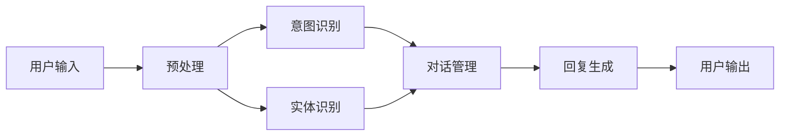

# 构建企业级对话式AI助手：提升员工生产力

> 关键词：企业级对话式AI助手、员工生产力、自然语言处理、人工智能、智能交互

> 摘要：本文聚焦于企业级对话式AI助手的构建及其对提升员工生产力的重要作用。详细介绍了相关核心概念、算法原理、数学模型，通过项目实战展示了具体开发过程。同时探讨了实际应用场景，推荐了学习资源、开发工具及相关论文著作。最后对未来发展趋势与挑战进行总结，并给出常见问题解答和参考资料，旨在为企业构建高效的对话式AI助手提供全面指导。

## 1. 背景介绍 
### 1.1 目的和范围
在当今数字化时代，企业面临着提高运营效率和员工生产力的巨大挑战。企业级对话式AI助手作为一种新兴技术，能够通过自然语言交互为员工提供快速准确的信息和支持，从而提升工作效率。本文的目的在于深入探讨如何构建一个高效的企业级对话式AI助手，涵盖从核心概念到实际应用的各个方面，包括算法原理、数学模型、项目实战等内容。

### 1.2 预期读者
本文预期读者包括企业的技术管理人员、AI开发者、对提升员工生产力感兴趣的企业决策者以及相关领域的研究人员。对于希望了解企业级对话式AI助手技术和应用的人士具有较高的参考价值。

### 1.3 文档结构概述
本文将按照以下结构展开：首先介绍核心概念与联系，包括相关原理和架构；接着阐述核心算法原理及具体操作步骤，并使用Python代码进行详细说明；然后讲解数学模型和公式，并举例说明；通过项目实战展示代码实际案例和详细解释；探讨实际应用场景；推荐相关工具和资源；最后总结未来发展趋势与挑战，提供常见问题解答和参考资料。

### 1.4 术语表
#### 1.4.1 核心术语定义
- **企业级对话式AI助手**：一种专门为企业设计的，能够通过自然语言与员工进行交互，提供信息、解决问题和协助完成任务的人工智能系统。
- **自然语言处理（NLP）**：计算机科学与人工智能领域中的一个重要方向，旨在让计算机能够理解、处理和生成人类语言。
- **对话管理**：负责管理对话的流程和状态，确保对话的连贯性和逻辑性。
- **意图识别**：分析用户输入的文本，确定用户的意图和需求。
- **实体识别**：从文本中识别出具有特定意义的实体，如人名、地名、组织机构名等。

#### 1.4.2 相关概念解释
- **深度学习**：一种基于人工神经网络的机器学习方法，通过构建多层神经网络来学习数据的特征和模式。
- **预训练模型**：在大规模数据上进行预先训练的模型，这些模型可以学习到通用的语言知识和特征，在具体任务上进行微调后可以取得更好的效果。
- **强化学习**：一种通过智能体与环境进行交互，根据环境反馈的奖励信号来学习最优策略的机器学习方法。

#### 1.4.3 缩略词列表
- **NLP**：Natural Language Processing（自然语言处理）
- **RNN**：Recurrent Neural Network（循环神经网络）
- **LSTM**：Long Short-Term Memory（长短期记忆网络）
- **GRU**：Gated Recurrent Unit（门控循环单元）
- **BERT**：Bidirectional Encoder Representations from Transformers（基于变换器的双向编码器表示）

## 2. 核心概念与联系 

### 核心概念原理
企业级对话式AI助手的核心原理基于自然语言处理和人工智能技术。其主要工作流程包括用户输入、意图识别、实体识别、对话管理和回复生成。用户通过自然语言向AI助手提出问题或请求，AI助手首先对输入进行处理，识别用户的意图和其中包含的实体信息。然后，对话管理模块根据当前对话状态和历史信息，决定如何响应用户。最后，回复生成模块根据对话管理的决策，生成合适的回复文本。

### 架构的文本示意图
```plaintext
用户输入 --> 预处理 --> 意图识别 --> 实体识别 --> 对话管理 --> 回复生成 --> 用户输出
```

### Mermaid流程图


## 3. 核心算法原理 & 具体操作步骤 

### 意图识别算法原理
意图识别是对话式AI助手的关键步骤之一，常用的算法包括基于机器学习的方法和基于深度学习的方法。这里我们以基于深度学习的卷积神经网络（CNN）为例进行讲解。

CNN的基本原理是通过卷积层提取文本的局部特征，池化层对特征进行降维，最后通过全连接层进行分类。以下是使用Python和Keras库实现意图识别的示例代码：

```python
import numpy as np
from keras.preprocessing.text import Tokenizer
from keras.preprocessing.sequence import pad_sequences
from keras.models import Sequential
from keras.layers import Embedding, Conv1D, GlobalMaxPooling1D, Dense

# 示例数据
texts = ["我想查询订单状态", "帮我预订会议室", "查找明天的会议安排"]
labels = [0, 1, 2]

# 分词和编码
tokenizer = Tokenizer(num_words=1000)
tokenizer.fit_on_texts(texts)
sequences = tokenizer.texts_to_sequences(texts)

# 填充序列
max_length = 20
padded_sequences = pad_sequences(sequences, maxlen=max_length)

# 构建CNN模型
model = Sequential()
model.add(Embedding(input_dim=1000, output_dim=100, input_length=max_length))
model.add(Conv1D(filters=128, kernel_size=5, activation='relu'))
model.add(GlobalMaxPooling1D())
model.add(Dense(3, activation='softmax'))

# 编译模型
model.compile(optimizer='adam', loss='sparse_categorical_crossentropy', metrics=['accuracy'])

# 训练模型
model.fit(padded_sequences, np.array(labels), epochs=10, batch_size=1)
```

### 具体操作步骤
1. **数据准备**：收集和整理包含用户意图和对应标签的文本数据。
2. **分词和编码**：使用Tokenizer对文本进行分词，并将其转换为数字序列。
3. **填充序列**：将所有序列填充到相同的长度，以便输入到神经网络中。
4. **构建模型**：使用Keras构建CNN模型，包括嵌入层、卷积层、池化层和全连接层。
5. **编译模型**：指定优化器、损失函数和评估指标。
6. **训练模型**：使用准备好的数据对模型进行训练。

## 4. 数学模型和公式 & 详细讲解 & 举例说明 

### 卷积操作
卷积操作是CNN的核心，其数学公式如下：

$$y_{i} = \sum_{j=0}^{k-1} w_{j} x_{i+j} + b$$

其中，$y_{i}$ 是卷积输出的第 $i$ 个元素，$w_{j}$ 是卷积核的第 $j$ 个元素，$x_{i+j}$ 是输入序列的第 $i+j$ 个元素，$b$ 是偏置项，$k$ 是卷积核的大小。

### 举例说明
假设输入序列为 $x = [1, 2, 3, 4, 5]$，卷积核为 $w = [1, 0, 1]$，偏置项 $b = 0$。卷积操作的过程如下：

- 当 $i = 0$ 时，$y_{0} = w_{0} x_{0} + w_{1} x_{1} + w_{2} x_{2} = 1\times1 + 0\times2 + 1\times3 = 4$
- 当 $i = 1$ 时，$y_{1} = w_{0} x_{1} + w_{1} x_{2} + w_{2} x_{3} = 1\times2 + 0\times3 + 1\times4 = 6$
- 当 $i = 2$ 时，$y_{2} = w_{0} x_{2} + w_{1} x_{3} + w_{2} x_{4} = 1\times3 + 0\times4 + 1\times5 = 8$

因此，卷积输出为 $y = [4, 6, 8]$。

### 池化操作
池化操作通常用于降低特征的维度，常用的池化方法有最大池化和平均池化。最大池化的数学公式如下：

$$y_{i} = \max_{j\in S_{i}} x_{j}$$

其中，$y_{i}$ 是池化输出的第 $i$ 个元素，$S_{i}$ 是第 $i$ 个池化窗口内的元素集合。

### 举例说明
假设输入序列为 $x = [4, 6, 8]$，池化窗口大小为 2。最大池化的过程如下：

- 当 $i = 0$ 时，$S_{0} = [4, 6]$，$y_{0} = \max([4, 6]) = 6$
- 当 $i = 1$ 时，$S_{1} = [6, 8]$，$y_{1} = \max([6, 8]) = 8$

因此，最大池化输出为 $y = [6, 8]$。

## 5. 项目实战：代码实际案例和详细解释说明 

### 5.1  开发环境搭建
- **操作系统**：建议使用Linux或Windows操作系统。
- **Python版本**：Python 3.6及以上。
- **开发工具**：推荐使用PyCharm或Jupyter Notebook。
- **依赖库**：安装必要的Python库，如TensorFlow、Keras、NLTK等。可以使用以下命令进行安装：
```bash
pip install tensorflow keras nltk
```

### 5.2  源代码详细实现和代码解读
以下是一个简单的企业级对话式AI助手的完整代码示例：

```python
import nltk
from nltk.tokenize import word_tokenize
from nltk.stem import WordNetLemmatizer
import numpy as np
import random
import json
import tensorflow as tf
from tensorflow.keras.models import Sequential
from tensorflow.keras.layers import Dense, Activation, Dropout
from tensorflow.keras.optimizers import SGD

# 下载必要的NLTK数据
nltk.download('punkt')
nltk.download('wordnet')

# 读取数据
with open('intents.json') as file:
    intents = json.load(file)

# 初始化词形还原器
lemmatizer = WordNetLemmatizer()

# 初始化列表
words = []
classes = []
documents = []
ignore_letters = ['!', '?', ',', '.']

# 处理数据
for intent in intents['intents']:
    for pattern in intent['patterns']:
        # 分词
        word_list = word_tokenize(pattern)
        words.extend(word_list)
        # 添加文档到corpus
        documents.append((word_list, intent['tag']))
        # 添加标签到classes列表
        if intent['tag'] not in classes:
            classes.append(intent['tag'])

# 词形还原和去重
words = [lemmatizer.lemmatize(word.lower()) for word in words if word not in ignore_letters]
words = sorted(set(words))
classes = sorted(set(classes))

# 保存数据
np.save('words.npy', words)
np.save('classes.npy', classes)

# 创建训练数据
training = []
output_empty = [0] * len(classes)

for doc in documents:
    bag = []
    word_patterns = doc[0]
    word_patterns = [lemmatizer.lemmatize(word.lower()) for word in word_patterns]
    for word in words:
        bag.append(1) if word in word_patterns else bag.append(0)

    output_row = list(output_empty)
    output_row[classes.index(doc[1])] = 1
    training.append([bag, output_row])

random.shuffle(training)
training = np.array(training)

train_x = list(training[:, 0])
train_y = list(training[:, 1])

# 构建模型
model = Sequential()
model.add(Dense(128, input_shape=(len(train_x[0]),), activation='relu'))
model.add(Dropout(0.5))
model.add(Dense(64, activation='relu'))
model.add(Dropout(0.5))
model.add(Dense(len(train_y[0]), activation='softmax'))

# 编译模型
sgd = SGD(lr=0.01, decay=1e-6, momentum=0.9, nesterov=True)
model.compile(loss='categorical_crossentropy', optimizer=sgd, metrics=['accuracy'])

# 训练模型
hist = model.fit(np.array(train_x), np.array(train_y), epochs=200, batch_size=5, verbose=1)
model.save('chatbot_model.h5', hist)

print("模型训练完成！")

# 辅助函数
def clean_up_sentence(sentence):
    sentence_words = word_tokenize(sentence)
    sentence_words = [lemmatizer.lemmatize(word.lower()) for word in sentence_words]
    return sentence_words

def bag_of_words(sentence):
    sentence_words = clean_up_sentence(sentence)
    bag = [0] * len(words)
    for w in sentence_words:
        for i, word in enumerate(words):
            if word == w:
                bag[i] = 1
    return np.array(bag)

def predict_class(sentence):
    bow = bag_of_words(sentence)
    res = model.predict(np.array([bow]))[0]
    ERROR_THRESHOLD = 0.25
    results = [[i, r] for i, r in enumerate(res) if r > ERROR_THRESHOLD]

    results.sort(key=lambda x: x[1], reverse=True)
    return_list = []
    for r in results:
        return_list.append({'intent': classes[r[0]], 'probability': str(r[1])})
    return return_list

def get_response(intents_list, intents_json):
    tag = intents_list[0]['intent']
    list_of_intents = intents_json['intents']
    for i in list_of_intents:
        if i['tag'] == tag:
            result = random.choice(i['responses'])
            break
    return result

# 测试对话
while True:
    message = input("你有什么问题？（输入'退出'结束对话）：")
    if message == '退出':
        break
    ints = predict_class(message)
    res = get_response(ints, intents)
    print(res)
```

### 5.3  代码解读与分析
1. **数据读取和预处理**：从 `intents.json` 文件中读取数据，对文本进行分词、词形还原和去重处理，生成词汇表和标签列表。
2. **训练数据创建**：将文本转换为词袋模型，创建训练数据的输入和输出。
3. **模型构建和训练**：使用Keras构建一个简单的神经网络模型，编译并训练模型。
4. **辅助函数**：定义了清理句子、生成词袋、预测意图和获取回复的辅助函数。
5. **测试对话**：通过循环不断接收用户输入，预测意图并生成回复，直到用户输入“退出”结束对话。

## 6. 实际应用场景 
企业级对话式AI助手在多个场景中具有重要应用价值：
- **客服支持**：快速响应客户咨询，解答常见问题，提高客户满意度。
- **员工培训**：为新员工提供培训资料和指导，帮助他们快速了解公司业务和流程。
- **任务管理**：协助员工安排任务、设置提醒，提高工作效率。
- **信息查询**：帮助员工快速获取公司内部的各种信息，如政策文件、部门联系方式等。
- **智能决策**：分析数据并提供决策建议，支持企业管理者做出更明智的决策。

## 7. 工具和资源推荐
### 7.1 学习资源推荐
#### 7.1.1 书籍推荐
- 《Python自然语言处理》：介绍了使用Python进行自然语言处理的基本方法和技术。
- 《深度学习》：全面阐述了深度学习的原理和应用。
- 《人工智能：一种现代的方法》：是人工智能领域的经典教材，涵盖了多个方面的知识。

#### 7.1.2 在线课程
- Coursera上的“自然语言处理专项课程”：由顶尖高校的教授授课，内容丰富全面。
- edX上的“深度学习基础”：帮助学习者快速掌握深度学习的基础知识。

#### 7.1.3 技术博客和网站
- Medium：有许多关于人工智能和自然语言处理的优质博客文章。
- arXiv：提供最新的学术研究论文。
- Hugging Face：专注于自然语言处理的开源社区，提供了大量的预训练模型和工具。

### 7.2 开发工具框架推荐
#### 7.2.1 IDE和编辑器
- PyCharm：功能强大的Python集成开发环境，提供代码编辑、调试、版本控制等功能。
- Jupyter Notebook：交互式编程环境，适合进行数据探索和模型开发。

#### 7.2.2 调试和性能分析工具
- TensorBoard：用于可视化TensorFlow模型的训练过程和性能指标。
- Py-Spy：可以对Python代码进行性能分析，找出性能瓶颈。

#### 7.2.3 相关框架和库
- TensorFlow：开源的深度学习框架，提供了丰富的工具和模型。
- Keras：高级神经网络API，简化了模型的构建和训练过程。
- NLTK：自然语言处理工具包，包含了许多常用的算法和数据集。

### 7.3 相关论文著作推荐
#### 7.3.1 经典论文
- “Attention Is All You Need”：提出了Transformer架构，是自然语言处理领域的重要突破。
- “BERT: Pre-training of Deep Bidirectional Transformers for Language Understanding”：介绍了BERT预训练模型，在多个自然语言处理任务上取得了优异的成绩。

#### 7.3.2 最新研究成果
- 关注arXiv上关于对话式AI、自然语言处理的最新研究论文，了解行业的最新动态。

#### 7.3.3 应用案例分析
- 可以参考一些企业级对话式AI助手的实际应用案例，学习他们的经验和做法。

## 8. 总结：未来发展趋势与挑战
### 未来发展趋势
- **多模态交互**：未来的对话式AI助手将支持语音、图像、视频等多种模态的交互，提供更加丰富和自然的用户体验。
- **个性化服务**：根据用户的历史行为和偏好，为用户提供个性化的服务和推荐。
- **与其他系统的集成**：与企业的其他系统，如CRM、ERP等进行深度集成，实现数据共享和业务流程自动化。
- **知识图谱的应用**：利用知识图谱丰富AI助手的知识储备，提高回答的准确性和专业性。

### 挑战
- **数据隐私和安全**：企业级对话式AI助手需要处理大量的敏感数据，如何保障数据的隐私和安全是一个重要挑战。
- **语义理解的准确性**：虽然自然语言处理技术取得了很大进展，但在复杂语义的理解和处理上仍然存在不足。
- **模型的可解释性**：深度学习模型通常是黑盒模型，难以解释其决策过程，这在企业应用中可能会带来一定的风险。

## 9. 附录：常见问题与解答
### 问题1：如何提高意图识别的准确率？
答：可以通过增加训练数据的数量和多样性、使用更复杂的模型（如预训练模型）、进行数据增强等方法来提高意图识别的准确率。

### 问题2：企业级对话式AI助手的部署方式有哪些？
答：常见的部署方式包括本地部署、云部署和混合部署。本地部署适合对数据安全要求较高的企业；云部署具有成本低、易于扩展等优点；混合部署则结合了两者的优势。

### 问题3：如何评估对话式AI助手的性能？
答：可以使用准确率、召回率、F1值等指标来评估意图识别和实体识别的性能；使用对话满意度、任务完成率等指标来评估对话管理和回复生成的性能。

## 10. 扩展阅读 & 参考资料
- 《自然语言处理入门》
- 《深度学习实战》
- 官方文档：TensorFlow、Keras、NLTK等
- 行业报告：如Gartner关于人工智能的报告

作者：AI天才研究院/AI Genius Institute & 禅与计算机程序设计艺术 /Zen And The Art of Computer Programming