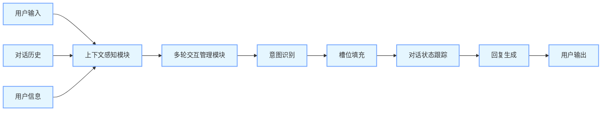

# 构建企业级对话系统：上下文感知与多轮交互管理

> 关键词：企业级对话系统、上下文感知、多轮交互管理、自然语言处理、人工智能

> 摘要：本文聚焦于构建企业级对话系统中的上下文感知与多轮交互管理这两个关键方面。详细阐述了相关核心概念、算法原理、数学模型，并通过实际项目案例展示了如何实现上下文感知与多轮交互管理。同时，探讨了该技术在不同实际场景中的应用，推荐了学习资源、开发工具框架以及相关论文著作。最后对企业级对话系统的未来发展趋势与挑战进行了总结，并给出常见问题解答和扩展阅读参考资料，旨在为开发者和研究者提供全面深入的技术指导。

## 1. 背景介绍 
### 1.1 目的和范围
随着人工智能技术的飞速发展，企业级对话系统在客户服务、智能助手等领域的应用越来越广泛。构建具有上下文感知与多轮交互管理能力的对话系统，可以显著提升用户体验，提高企业的服务效率和竞争力。本文的目的在于深入探讨如何构建这样的企业级对话系统，涵盖了从核心概念、算法原理到实际项目开发和应用的全过程。

### 1.2 预期读者
本文主要面向从事自然语言处理、人工智能领域的开发者、研究人员，以及对企业级对话系统感兴趣的技术爱好者。对于希望了解如何构建高效对话系统，解决上下文感知和多轮交互问题的人员具有较高的参考价值。

### 1.3 文档结构概述
本文将按照以下结构进行组织：首先介绍核心概念与联系，包括上下文感知和多轮交互管理的原理和架构；接着阐述核心算法原理及具体操作步骤，并使用Python代码进行详细说明；然后介绍相关的数学模型和公式，并举例说明；通过实际项目案例展示如何实现上下文感知与多轮交互管理；探讨该技术在不同实际场景中的应用；推荐学习资源、开发工具框架以及相关论文著作；最后总结未来发展趋势与挑战，给出常见问题解答和扩展阅读参考资料。

### 1.4 术语表
#### 1.4.1 核心术语定义
- **企业级对话系统**：为企业业务服务的对话系统，能够处理企业与用户之间的交互，提供准确的信息和服务。
- **上下文感知**：对话系统能够理解当前对话所处的上下文信息，包括之前的对话内容、用户的历史行为等，从而更准确地理解用户的意图。
- **多轮交互管理**：在对话过程中，系统能够有效地管理多轮对话，记录对话状态，根据用户的输入和上下文信息进行合理的回复，确保对话的连贯性和逻辑性。
- **自然语言处理（NLP）**：研究如何让计算机理解和处理人类语言的技术领域，是构建对话系统的基础。

#### 1.4.2 相关概念解释
- **对话状态跟踪**：在多轮对话中，记录和更新对话的当前状态，包括用户的意图、槽位信息等。
- **意图识别**：分析用户输入的文本，确定用户的意图，例如查询信息、下单等。
- **槽位填充**：从用户输入中提取关键信息，填充到相应的槽位中，例如在查询航班信息时，提取出发地、目的地、日期等信息。

#### 1.4.3 缩略词列表
- **NLP**：Natural Language Processing（自然语言处理）
- **RNN**：Recurrent Neural Network（循环神经网络）
- **LSTM**：Long Short-Term Memory（长短期记忆网络）
- **GRU**：Gated Recurrent Unit（门控循环单元）

## 2. 核心概念与联系 
### 上下文感知原理
上下文感知是企业级对话系统的重要特性之一，它使得系统能够理解对话的上下文信息，从而更准确地理解用户的意图。上下文信息可以包括对话历史、用户的个人信息、当前的对话场景等。例如，在一个酒店预订对话中，用户先询问了酒店的价格，接着询问酒店的位置，系统需要根据之前的对话历史，知道用户关注的是同一家酒店，从而准确地回答酒店的位置信息。

### 多轮交互管理原理
多轮交互管理负责在对话过程中有效地管理多轮对话，确保对话的连贯性和逻辑性。它需要记录对话的状态，包括用户的意图、槽位信息等，并根据当前的对话状态和用户的输入生成合理的回复。例如，在一个机票预订对话中，系统需要询问用户出发地、目的地、日期等信息，当用户提供了部分信息后，系统需要根据已有的信息和对话状态，继续询问其他必要的信息，直到完成机票预订。

### 核心概念架构示意图

该架构图展示了企业级对话系统中上下文感知与多轮交互管理的核心流程。用户输入首先经过上下文感知模块，结合对话历史和用户信息，然后进入多轮交互管理模块。在多轮交互管理模块中，进行意图识别、槽位填充和对话状态跟踪，最后生成回复输出给用户。

## 3. 核心算法原理 & 具体操作步骤 
### 意图识别算法：基于深度学习的方法
意图识别是对话系统中的关键步骤，它的目的是确定用户输入的文本所表达的意图。这里我们介绍一种基于深度学习的意图识别算法，使用循环神经网络（RNN）及其变体，如长短期记忆网络（LSTM）或门控循环单元（GRU）。

```python
import tensorflow as tf
from tensorflow.keras.preprocessing.text import Tokenizer
from tensorflow.keras.preprocessing.sequence import pad_sequences
from tensorflow.keras.models import Sequential
from tensorflow.keras.layers import Embedding, LSTM, Dense

# 示例数据
sentences = ["我想查询航班信息", "我要预订酒店", "我想了解旅游景点"]
labels = [0, 1, 2]

# 分词
tokenizer = Tokenizer()
tokenizer.fit_on_texts(sentences)
word_index = tokenizer.word_index
sequences = tokenizer.texts_to_sequences(sentences)

# 填充序列
max_length = 10
padded_sequences = pad_sequences(sequences, maxlen=max_length)

# 构建模型
model = Sequential([
    Embedding(input_dim=len(word_index) + 1, output_dim=16, input_length=max_length),
    LSTM(16),
    Dense(3, activation='softmax')
])

# 编译模型
model.compile(optimizer='adam', loss='sparse_categorical_crossentropy', metrics=['accuracy'])

# 训练模型
model.fit(padded_sequences, labels, epochs=10)

# 预测
test_sentence = ["我想查询航班信息"]
test_sequence = tokenizer.texts_to_sequences(test_sentence)
test_padded = pad_sequences(test_sequence, maxlen=max_length)
predictions = model.predict(test_padded)
predicted_label = tf.argmax(predictions, axis=1).numpy()[0]
print("预测的意图标签:", predicted_label)
```
### 具体操作步骤
1. **数据准备**：收集包含用户输入和对应意图标签的数据集，对文本数据进行分词处理，将文本转换为数字序列，并进行填充，使其长度一致。
2. **模型构建**：使用`Sequential`模型构建一个包含嵌入层、LSTM层和全连接层的神经网络。
3. **模型编译**：选择合适的优化器、损失函数和评估指标，对模型进行编译。
4. **模型训练**：将准备好的数据输入模型进行训练，设置训练的轮数。
5. **模型预测**：使用训练好的模型对新的用户输入进行预测，得到预测的意图标签。

### 槽位填充算法：基于条件随机场（CRF）
槽位填充的目的是从用户输入中提取关键信息，填充到相应的槽位中。这里我们介绍一种基于条件随机场（CRF）的槽位填充算法。

```python
import numpy as np
from sklearn_crfsuite import CRF

# 示例数据
sentences = [["我", "想", "查询", "北京", "到", "上海", "的", "航班", "信息"],
             ["我", "要", "预订", "广州", "的", "酒店"]]
tags = [["O", "O", "O", "B-出发地", "O", "B-目的地", "O", "O", "O"],
        ["O", "O", "O", "B-地点", "O", "B-业务对象"]]

# 特征提取
def word2features(sent, i):
    word = sent[i]
    features = {
        'bias': 1.0,
        'word.lower()': word.lower(),
        'word.isupper()': word.isupper(),
        'word.istitle()': word.istitle(),
        'word.isdigit()': word.isdigit()
    }
    if i > 0:
        word1 = sent[i - 1]
        features.update({
            '-1:word.lower()': word1.lower(),
            '-1:word.istitle()': word1.istitle(),
            '-1:word.isupper()': word1.isupper()
        })
    else:
        features['BOS'] = True
    if i < len(sent) - 1:
        word1 = sent[i + 1]
        features.update({
            '+1:word.lower()': word1.lower(),
            '+1:word.istitle()': word1.istitle(),
            '+1:word.isupper()': word1.isupper()
        })
    else:
        features['EOS'] = True
    return features

def sent2features(sent):
    return [word2features(sent, i) for i in range(len(sent))]

X = [sent2features(s) for s in sentences]
y = tags

# 训练CRF模型
crf = CRF(algorithm='lbfgs', c1=0.1, c2=0.1, max_iterations=100, all_possible_transitions=True)
crf.fit(X, y)

# 预测
test_sentence = ["我", "想", "查询", "深圳", "到", "成都", "的", "航班", "信息"]
test_features = sent2features(test_sentence)
predicted_tags = crf.predict_single(test_features)
print("预测的槽位标签:", predicted_tags)
```
### 具体操作步骤
1. **数据准备**：收集包含用户输入和对应槽位标签的数据集。
2. **特征提取**：为每个词语提取特征，包括词语本身的属性以及前后词语的属性。
3. **模型训练**：使用`CRF`模型对提取的特征和槽位标签进行训练。
4. **模型预测**：对新的用户输入提取特征，使用训练好的模型进行预测，得到预测的槽位标签。

## 4. 数学模型和公式 & 详细讲解 & 举例说明 
### 意图识别的数学模型
在基于深度学习的意图识别中，我们使用的是神经网络模型。以一个简单的多层感知机（MLP）为例，假设输入层有 $n$ 个神经元，隐藏层有 $m$ 个神经元，输出层有 $k$ 个神经元。输入向量为 $\mathbf{x} \in \mathbb{R}^n$，隐藏层的输出向量为 $\mathbf{h} \in \mathbb{R}^m$，输出层的输出向量为 $\mathbf{y} \in \mathbb{R}^k$。

隐藏层的计算可以表示为：
$$
\mathbf{h} = f(\mathbf{W}_1\mathbf{x} + \mathbf{b}_1)
$$
其中，$\mathbf{W}_1 \in \mathbb{R}^{m \times n}$ 是输入层到隐藏层的权重矩阵，$\mathbf{b}_1 \in \mathbb{R}^m$ 是隐藏层的偏置向量，$f$ 是激活函数，例如 sigmoid 函数或 ReLU 函数。

输出层的计算可以表示为：
$$
\mathbf{y} = \text{softmax}(\mathbf{W}_2\mathbf{h} + \mathbf{b}_2)
$$
其中，$\mathbf{W}_2 \in \mathbb{R}^{k \times m}$ 是隐藏层到输出层的权重矩阵，$\mathbf{b}_2 \in \mathbb{R}^k$ 是输出层的偏置向量，$\text{softmax}$ 函数用于将输出转换为概率分布。

例如，在前面的意图识别代码中，输入层的神经元数量由输入序列的长度决定，隐藏层使用了一个 LSTM 层，输出层有 3 个神经元，分别对应 3 种不同的意图。通过训练，模型学习到合适的权重矩阵和偏置向量，使得对于输入的文本序列，能够输出正确的意图概率分布。

### 槽位填充的数学模型
条件随机场（CRF）是一种用于序列标注的概率图模型。假设输入序列为 $\mathbf{x} = (x_1, x_2, \cdots, x_n)$，对应的标签序列为 $\mathbf{y} = (y_1, y_2, \cdots, y_n)$。CRF 的目标是计算给定输入序列 $\mathbf{x}$ 下，标签序列 $\mathbf{y}$ 的条件概率 $P(\mathbf{y}|\mathbf{x})$。

CRF 的条件概率可以表示为：
$$
P(\mathbf{y}|\mathbf{x}) = \frac{1}{Z(\mathbf{x})} \exp \left( \sum_{i=1}^n \sum_{k=1}^K \lambda_k t_k(y_{i-1}, y_i, \mathbf{x}, i) + \sum_{i=1}^n \sum_{l=1}^L \mu_l s_l(y_i, \mathbf{x}, i) \right)
$$
其中，$Z(\mathbf{x})$ 是归一化因子，$t_k(y_{i-1}, y_i, \mathbf{x}, i)$ 是转移特征函数，$s_l(y_i, \mathbf{x}, i)$ 是状态特征函数，$\lambda_k$ 和 $\mu_l$ 是对应的特征权重。

在前面的槽位填充代码中，通过训练 CRF 模型，学习到合适的特征权重，使得对于输入的词语序列，能够输出正确的槽位标签序列。

## 5. 项目实战：代码实际案例和详细解释说明 
### 5.1  开发环境搭建
- **操作系统**：推荐使用 Linux 或 macOS 系统，也可以使用 Windows 系统。
- **Python 版本**：建议使用 Python 3.7 及以上版本。
- **依赖库安装**：使用以下命令安装所需的依赖库：
```bash
pip install tensorflow scikit-learn sklearn-crfsuite
```

### 5.2  源代码详细实现和代码解读
```python
import tensorflow as tf
from tensorflow.keras.preprocessing.text import Tokenizer
from tensorflow.keras.preprocessing.sequence import pad_sequences
from tensorflow.keras.models import Sequential
from tensorflow.keras.layers import Embedding, LSTM, Dense
from sklearn_crfsuite import CRF
import numpy as np

# 示例数据
sentences = ["我想查询航班信息", "我要预订酒店", "我想了解旅游景点"]
labels = [0, 1, 2]
slot_sentences = [["我", "想", "查询", "北京", "到", "上海", "的", "航班", "信息"],
                  ["我", "要", "预订", "广州", "的", "酒店"]]
slot_tags = [["O", "O", "O", "B-出发地", "O", "B-目的地", "O", "O", "O"],
             ["O", "O", "O", "B-地点", "O", "B-业务对象"]]

# 意图识别部分
# 分词
tokenizer = Tokenizer()
tokenizer.fit_on_texts(sentences)
word_index = tokenizer.word_index
sequences = tokenizer.texts_to_sequences(sentences)

# 填充序列
max_length = 10
padded_sequences = pad_sequences(sequences, maxlen=max_length)

# 构建模型
model = Sequential([
    Embedding(input_dim=len(word_index) + 1, output_dim=16, input_length=max_length),
    LSTM(16),
    Dense(3, activation='softmax')
])

# 编译模型
model.compile(optimizer='adam', loss='sparse_categorical_crossentropy', metrics=['accuracy'])

# 训练模型
model.fit(padded_sequences, labels, epochs=10)

# 槽位填充部分
# 特征提取
def word2features(sent, i):
    word = sent[i]
    features = {
        'bias': 1.0,
        'word.lower()': word.lower(),
        'word.isupper()': word.isupper(),
        'word.istitle()': word.istitle(),
        'word.isdigit()': word.isdigit()
    }
    if i > 0:
        word1 = sent[i - 1]
        features.update({
            '-1:word.lower()': word1.lower(),
            '-1:word.istitle()': word1.istitle(),
            '-1:word.isupper()': word1.isupper()
        })
    else:
        features['BOS'] = True
    if i < len(sent) - 1:
        word1 = sent[i + 1]
        features.update({
            '+1:word.lower()': word1.lower(),
            '+1:word.istitle()': word1.istitle(),
            '+1:word.isupper()': word1.isupper()
        })
    else:
        features['EOS'] = True
    return features

def sent2features(sent):
    return [word2features(sent, i) for i in range(len(sent))]

X = [sent2features(s) for s in slot_sentences]
y = slot_tags

# 训练CRF模型
crf = CRF(algorithm='lbfgs', c1=0.1, c2=0.1, max_iterations=100, all_possible_transitions=True)
crf.fit(X, y)

# 对话系统主循环
while True:
    user_input = input("请输入你的问题：")
    if user_input.lower() == 'exit':
        break
    
    # 意图识别
    test_sequence = tokenizer.texts_to_sequences([user_input])
    test_padded = pad_sequences(test_sequence, maxlen=max_length)
    predictions = model.predict(test_padded)
    predicted_intent = tf.argmax(predictions, axis=1).numpy()[0]
    
    # 槽位填充
    words = [char for char in user_input]
    test_features = sent2features(words)
    predicted_tags = crf.predict_single(test_features)
    
    print("预测的意图标签:", predicted_intent)
    print("预测的槽位标签:", predicted_tags)
```
### 代码解读与分析
1. **数据准备**：定义了示例的句子和对应的意图标签，以及槽位填充的句子和对应的槽位标签。
2. **意图识别**：使用`Tokenizer`对句子进行分词，将文本转换为数字序列，并进行填充。构建一个包含嵌入层、LSTM 层和全连接层的神经网络模型，编译并训练模型。
3. **槽位填充**：定义了特征提取函数，将词语序列转换为特征序列。使用`CRF`模型对特征序列和槽位标签进行训练。
4. **对话系统主循环**：不断接收用户输入，对用户输入进行意图识别和槽位填充，并输出预测结果。当用户输入`exit`时，退出循环。

## 6. 实际应用场景 
### 客户服务
在企业的客户服务场景中，上下文感知与多轮交互管理的对话系统可以为客户提供更加个性化和高效的服务。例如，客户在咨询产品信息时，可能会提出多个相关问题，系统可以根据上下文信息，准确理解客户的需求，并提供连贯的回答。同时，在处理客户投诉或问题解决时，系统可以通过多轮交互，逐步收集必要的信息，为客户提供准确的解决方案。

### 智能助手
智能助手可以集成到企业的办公系统中，帮助员工快速获取信息和完成任务。例如，员工可以通过语音或文本与智能助手进行交互，查询会议安排、请假流程等信息。系统可以根据员工的历史查询记录和上下文信息，提供更加精准的服务。

### 电商平台
在电商平台中，对话系统可以帮助用户进行商品搜索、订单查询、售后服务等操作。通过上下文感知和多轮交互，系统可以更好地理解用户的购物需求，推荐合适的商品，并处理用户的订单问题。例如，用户在查询商品时，可能会提出一些个性化的要求，系统可以通过多轮交互，逐步明确用户的需求，为用户提供符合要求的商品推荐。

## 7. 工具和资源推荐
### 7.1 学习资源推荐
#### 7.1.1 书籍推荐
- 《自然语言处理入门》：这本书适合初学者，系统地介绍了自然语言处理的基本概念、算法和技术，包括分词、词性标注、命名实体识别等。
- 《深度学习》：由 Ian Goodfellow、Yoshua Bengio 和 Aaron Courville 编写，是深度学习领域的经典教材，涵盖了神经网络、卷积神经网络、循环神经网络等内容。
- 《Python自然语言处理》：详细介绍了如何使用 Python 进行自然语言处理，包括使用 NLTK、SpaCy 等工具库。

#### 7.1.2 在线课程
- Coursera 上的“Natural Language Processing Specialization”：由斯坦福大学的教授授课，全面介绍了自然语言处理的各个方面，包括词向量、序列模型、机器翻译等。
- edX 上的“Deep Learning for Natural Language Processing”：深入探讨了深度学习在自然语言处理中的应用，包括循环神经网络、注意力机制等。

#### 7.1.3 技术博客和网站
- Medium 上的“Towards Data Science”：有很多关于自然语言处理和人工智能的高质量文章，涵盖了最新的研究成果和实践经验。
- 机器之心：提供了丰富的人工智能和自然语言处理领域的资讯和技术文章。

### 7.2 开发工具框架推荐
#### 7.2.1 IDE和编辑器
- PyCharm：一款功能强大的 Python 集成开发环境，提供了代码编辑、调试、版本控制等功能。
- Visual Studio Code：轻量级的代码编辑器，支持多种编程语言，有丰富的插件扩展。

#### 7.2.2 调试和性能分析工具
- TensorBoard：TensorFlow 提供的可视化工具，可以用于查看模型的训练过程、性能指标等。
- cProfile：Python 内置的性能分析工具，可以帮助开发者找出代码中的性能瓶颈。

#### 7.2.3 相关框架和库
- TensorFlow：一个开源的深度学习框架，提供了丰富的工具和库，用于构建和训练神经网络模型。
- PyTorch：另一个流行的深度学习框架，具有动态图的优势，适合快速原型开发。
- NLTK：Python 中的自然语言处理工具包，提供了分词、词性标注、命名实体识别等功能。
- SpaCy：一个高效的自然语言处理库，提供了预训练的模型和快速的处理速度。

### 7.3 相关论文著作推荐
#### 7.3.1 经典论文
- “Attention Is All You Need”：提出了 Transformer 模型，是自然语言处理领域的重要突破，为后续的 BERT、GPT 等模型奠定了基础。
- “Long Short-Term Memory”：介绍了长短期记忆网络（LSTM），解决了传统循环神经网络中的梯度消失和梯度爆炸问题。

#### 7.3.2 最新研究成果
- BERT 系列论文：包括“BERT: Pre-training of Deep Bidirectional Transformers for Language Understanding”等，提出了基于预训练的语言模型，在自然语言处理的多个任务中取得了优异的成绩。
- GPT 系列论文：如“Generative Pretrained Transformer”等，展示了生成式预训练模型在语言生成任务中的强大能力。

#### 7.3.3 应用案例分析
- “Dialogue Systems for Customer Service: A Survey”：对客户服务领域的对话系统进行了全面的综述，包括系统架构、算法和应用案例。
- “Building Conversational AI Systems: With Examples Using Rasa and TensorFlow”：详细介绍了如何使用 Rasa 和 TensorFlow 构建对话系统，并给出了实际的应用案例。

## 8. 总结：未来发展趋势与挑战
### 未来发展趋势
- **多模态交互**：未来的企业级对话系统将不仅仅局限于文本和语音交互，还将支持图像、视频等多模态交互方式，提供更加丰富和自然的用户体验。
- **知识图谱融合**：将知识图谱与对话系统相结合，使系统能够利用丰富的知识信息，提供更加准确和全面的回答。
- **个性化服务**：根据用户的个人信息、历史行为和偏好，为用户提供个性化的服务和推荐，提高用户的满意度和忠诚度。

### 挑战
- **上下文理解的准确性**：尽管目前的上下文感知技术已经取得了一定的进展，但在复杂的对话场景中，仍然存在上下文理解不准确的问题，需要进一步提高技术的准确性和鲁棒性。
- **多轮交互的管理复杂性**：随着对话轮数的增加，多轮交互的管理变得越来越复杂，需要设计更加高效和智能的算法来管理对话状态和生成合理的回复。
- **数据隐私和安全**：企业级对话系统需要处理大量的用户数据，包括个人信息和业务数据，如何保证数据的隐私和安全是一个重要的挑战。

## 9. 附录：常见问题与解答
### 问题1：如何提高意图识别的准确率？
答：可以从以下几个方面提高意图识别的准确率：
- 增加训练数据的数量和多样性，使模型能够学习到更多的意图模式。
- 选择合适的特征和模型结构，例如使用深度学习模型和更复杂的特征工程。
- 进行模型调优，调整模型的超参数，如学习率、批量大小等。

### 问题2：槽位填充中如何处理未登录词？
答：可以采用以下方法处理未登录词：
- 使用预训练的词向量，如 Word2Vec、GloVe 等，将未登录词映射到向量空间中。
- 设计一些规则或特征来处理未登录词，例如根据词语的形态、上下文等信息进行判断。
- 采用字符级别的模型，直接处理字符序列，避免未登录词的问题。

### 问题3：如何实现对话系统的上下文感知？
答：可以通过以下方式实现对话系统的上下文感知：
- 记录对话历史，包括用户的输入和系统的回复，作为上下文信息的一部分。
- 使用对话状态跟踪技术，记录对话的当前状态，如用户的意图、槽位信息等。
- 结合用户的个人信息和历史行为，提供更加个性化的上下文感知服务。

## 10. 扩展阅读 & 参考资料
- Jurafsky, D., & Martin, J. H. (2021). Speech and Language Processing. Pearson.
- Chollet, F. (2017). Deep Learning with Python. Manning Publications.
- https://www.tensorflow.org/
- https://pytorch.org/
- https://www.nltk.org/
- https://spacy.io/

作者：AI天才研究院/AI Genius Institute & 禅与计算机程序设计艺术 /Zen And The Art of Computer Programming