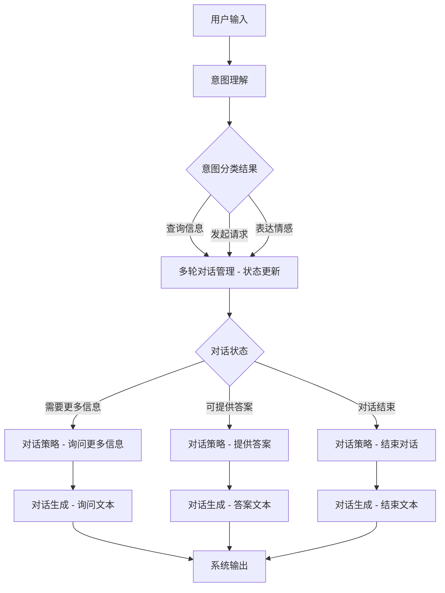

# 构建企业级对话系统：多轮对话管理与意图理解的深度整合

> 关键词：企业级对话系统、多轮对话管理、意图理解、深度整合、自然语言处理

> 摘要：本文围绕构建企业级对话系统展开，聚焦于多轮对话管理与意图理解的深度整合。首先介绍了相关背景，包括目的、预期读者等内容。接着阐述核心概念，给出了原理和架构的文本示意图与 Mermaid 流程图。详细讲解了核心算法原理，并使用 Python 源代码进行说明，同时介绍了相关数学模型和公式。通过项目实战案例，从开发环境搭建到代码详细实现与解读，全面展示了系统的构建过程。还探讨了实际应用场景，推荐了学习资源、开发工具框架以及相关论文著作。最后总结了未来发展趋势与挑战，给出常见问题解答和扩展阅读参考资料，旨在为企业级对话系统的构建提供全面、深入的技术指导。

## 1. 背景介绍 
### 1.1 目的和范围
在当今数字化时代，企业面临着海量的客户咨询和交互需求。构建企业级对话系统能够显著提升客户服务效率、降低人力成本，并为客户提供更加个性化、便捷的服务体验。本文章的目的在于深入探讨如何将多轮对话管理与意图理解进行深度整合，以构建出高效、智能的企业级对话系统。范围涵盖了从核心概念的介绍、算法原理的讲解、数学模型的分析，到项目实战的具体实现以及实际应用场景的探讨等多个方面。

### 1.2 预期读者
本文预期读者主要包括从事自然语言处理、人工智能相关领域的开发者、软件架构师、CTO 等技术人员，以及对企业级对话系统构建感兴趣的研究人员和学生。同时，企业中负责客户服务、业务流程优化等相关工作的管理人员也可以从本文中了解到构建对话系统对企业发展的重要性和具体实现思路。

### 1.3 文档结构概述
本文将按照以下结构进行详细阐述：首先介绍背景信息，让读者了解构建企业级对话系统的目的和预期读者。接着深入讲解核心概念，包括多轮对话管理和意图理解的原理与联系，并给出相应的文本示意图和 Mermaid 流程图。然后详细阐述核心算法原理和具体操作步骤，使用 Python 源代码进行说明。同时，介绍相关的数学模型和公式，并通过举例进行详细讲解。通过项目实战，展示开发环境搭建、源代码实现和代码解读。探讨实际应用场景，为企业提供参考。推荐学习资源、开发工具框架和相关论文著作，帮助读者进一步深入学习。最后总结未来发展趋势与挑战，给出常见问题解答和扩展阅读参考资料。

### 1.4 术语表
#### 1.4.1 核心术语定义
- **企业级对话系统**：是一种面向企业应用的智能对话系统，能够处理企业业务场景下的各种用户咨询和交互需求，为企业客户提供服务和支持。
- **多轮对话管理**：指在对话过程中，系统能够跟踪和管理多轮交互信息，根据上下文理解用户意图，确保对话的连贯性和逻辑性。
- **意图理解**：是自然语言处理中的一个重要任务，旨在识别用户输入文本背后的真实意图，例如查询信息、发起请求、表达情感等。

#### 1.4.2 相关概念解释
- **自然语言处理（NLP）**：是人工智能的一个重要分支，主要研究如何让计算机理解和处理人类语言。在企业级对话系统中，NLP 技术用于实现意图理解、对话生成等功能。
- **对话状态跟踪**：是多轮对话管理中的一个关键环节，用于记录和更新对话过程中的状态信息，包括用户意图、上下文信息等，以便系统能够根据当前状态做出合理的响应。

#### 1.4.3 缩略词列表
- **NLP**：Natural Language Processing（自然语言处理）
- **RNN**：Recurrent Neural Network（循环神经网络）
- **LSTM**：Long Short-Term Memory（长短期记忆网络）
- **GRU**：Gated Recurrent Unit（门控循环单元）

## 2. 核心概念与联系 

### 多轮对话管理原理
多轮对话管理是企业级对话系统的核心组成部分，它的主要任务是处理用户与系统之间的多轮交互。在多轮对话中，用户的意图可能会随着对话的进行而发生变化，系统需要根据上下文信息来理解用户的真实意图，并做出合理的响应。

多轮对话管理的基本原理包括对话状态跟踪、对话策略选择和对话生成。对话状态跟踪用于记录和更新对话过程中的状态信息，例如用户的历史请求、系统的响应、当前的对话主题等。对话策略选择则根据当前的对话状态，选择合适的对话策略，例如询问用户更多信息、提供相关建议、结束对话等。对话生成则根据选择的对话策略，生成相应的自然语言文本作为系统的响应。

### 意图理解原理
意图理解是自然语言处理中的一个重要任务，它的主要目的是识别用户输入文本背后的真实意图。在企业级对话系统中，意图理解可以帮助系统准确地理解用户的需求，从而提供更加精准的服务。

意图理解的基本原理包括文本特征提取、模型训练和意图分类。文本特征提取用于从用户输入的文本中提取有用的特征信息，例如词向量、词性标注、句法结构等。模型训练则使用提取的文本特征和标注好的训练数据，训练一个意图分类模型，例如神经网络、决策树等。意图分类则使用训练好的模型，对用户输入的文本进行意图分类，输出用户的真实意图。

### 核心概念架构的文本示意图
```plaintext
企业级对话系统
├── 多轮对话管理
│   ├── 对话状态跟踪
│   │   ├── 记录用户历史请求
│   │   ├── 记录系统响应
│   │   ├── 记录当前对话主题
│   ├── 对话策略选择
│   │   ├── 根据对话状态选择策略
│   │   ├── 询问更多信息
│   │   ├── 提供建议
│   │   ├── 结束对话
│   ├── 对话生成
│       ├── 根据策略生成响应文本
├── 意图理解
│   ├── 文本特征提取
│   │   ├── 词向量
│   │   ├── 词性标注
│   │   ├── 句法结构
│   ├── 模型训练
│   │   ├── 使用训练数据训练模型
│   │   ├── 神经网络
│   │   ├── 决策树
│   ├── 意图分类
│       ├── 对用户输入进行分类
```

### Mermaid 流程图


## 3. 核心算法原理 & 具体操作步骤 

### 意图理解算法 - 基于深度学习的方法
在意图理解中，深度学习方法已经成为主流。其中，循环神经网络（RNN）及其变体长短期记忆网络（LSTM）和门控循环单元（GRU）在处理序列数据方面表现出色。下面以 LSTM 为例，介绍意图理解的算法原理和具体操作步骤。

#### 算法原理
LSTM 是一种特殊的 RNN，它能够有效地解决传统 RNN 中的梯度消失问题，从而更好地处理长序列数据。在意图理解中，LSTM 可以用于学习文本序列中的语义信息，从而实现意图分类。

LSTM 的核心是细胞状态 $C_t$，它可以在序列中传递信息。LSTM 通过三个门控机制来控制细胞状态的更新，分别是输入门 $i_t$、遗忘门 $f_t$ 和输出门 $o_t$。具体公式如下：

输入门：
$$i_t = \sigma(W_{ii}x_t + W_{hi}h_{t-1} + b_i)$$

遗忘门：
$$f_t = \sigma(W_{if}x_t + W_{hf}h_{t-1} + b_f)$$

细胞状态更新：
$$\tilde{C}_t = \tanh(W_{ic}x_t + W_{hc}h_{t-1} + b_c)$$
$$C_t = f_t \odot C_{t-1} + i_t \odot \tilde{C}_t$$

输出门：
$$o_t = \sigma(W_{io}x_t + W_{ho}h_{t-1} + b_o)$$
$$h_t = o_t \odot \tanh(C_t)$$

其中，$x_t$ 是当前时刻的输入，$h_{t-1}$ 是上一时刻的隐藏状态，$W$ 是权重矩阵，$b$ 是偏置向量，$\sigma$ 是 sigmoid 函数，$\tanh$ 是双曲正切函数，$\odot$ 是逐元素相乘。

#### 具体操作步骤
1. **数据预处理**：将原始文本数据进行清洗、分词等处理，并将其转换为词向量表示。
2. **模型构建**：使用 Keras 或 PyTorch 等深度学习框架构建 LSTM 模型。
3. **模型训练**：使用标注好的训练数据对模型进行训练，调整模型的参数。
4. **意图分类**：使用训练好的模型对用户输入的文本进行意图分类。

#### Python 源代码实现
```python
import numpy as np
from tensorflow.keras.preprocessing.text import Tokenizer
from tensorflow.keras.preprocessing.sequence import pad_sequences
from tensorflow.keras.models import Sequential
from tensorflow.keras.layers import Embedding, LSTM, Dense

# 示例数据
texts = ["我想查询订单状态", "我要投诉你们的服务", "给我推荐一款手机"]
labels = [0, 1, 2]

# 数据预处理
tokenizer = Tokenizer()
tokenizer.fit_on_texts(texts)
sequences = tokenizer.texts_to_sequences(texts)
max_length = max([len(seq) for seq in sequences])
padded_sequences = pad_sequences(sequences, maxlen=max_length)

# 构建 LSTM 模型
model = Sequential()
model.add(Embedding(input_dim=len(tokenizer.word_index) + 1, output_dim=100, input_length=max_length))
model.add(LSTM(128))
model.add(Dense(3, activation='softmax'))

# 编译模型
model.compile(optimizer='adam', loss='sparse_categorical_crossentropy', metrics=['accuracy'])

# 模型训练
model.fit(padded_sequences, np.array(labels), epochs=10, batch_size=1)

# 意图分类
new_text = ["我想查询订单状态"]
new_sequence = tokenizer.texts_to_sequences(new_text)
new_padded_sequence = pad_sequences(new_sequence, maxlen=max_length)
prediction = model.predict(new_padded_sequence)
predicted_label = np.argmax(prediction)
print("预测的意图标签:", predicted_label)
```

### 多轮对话管理算法 - 基于有限状态机的方法
有限状态机（FSM）是一种常用的多轮对话管理算法，它将对话过程抽象为有限个状态和状态之间的转移。在多轮对话中，系统根据当前的对话状态和用户的输入，选择合适的状态转移，从而实现对话的管理。

#### 算法原理
有限状态机由一组状态 $S$、一组输入符号 $I$、一个状态转移函数 $\delta$ 和一个初始状态 $s_0$ 组成。状态转移函数 $\delta$ 定义了在当前状态下，接收到某个输入符号时，系统应该转移到的下一个状态。

在多轮对话管理中，状态可以表示对话的不同阶段，例如询问用户信息、提供答案、结束对话等。输入符号可以表示用户的意图，例如查询信息、发起请求等。系统根据当前的对话状态和用户的意图，使用状态转移函数 $\delta$ 来更新对话状态。

#### 具体操作步骤
1. **定义状态和输入符号**：根据对话的业务需求，定义有限状态机的状态和输入符号。
2. **定义状态转移函数**：根据对话的逻辑，定义状态转移函数 $\delta$。
3. **初始化对话状态**：将对话状态初始化为初始状态 $s_0$。
4. **处理用户输入**：根据用户的输入，确定输入符号，并使用状态转移函数 $\delta$ 更新对话状态。
5. **生成系统响应**：根据当前的对话状态，生成相应的系统响应。

#### Python 源代码实现
```python
# 定义状态和输入符号
states = ["START", "ASK_INFO", "PROVIDE_ANSWER", "END"]
inputs = ["QUERY_INFO", "REQUEST_SERVICE", "END_DIALOG"]

# 定义状态转移函数
transition_table = {
    ("START", "QUERY_INFO"): "ASK_INFO",
    ("START", "REQUEST_SERVICE"): "ASK_INFO",
    ("ASK_INFO", "QUERY_INFO"): "PROVIDE_ANSWER",
    ("ASK_INFO", "REQUEST_SERVICE"): "PROVIDE_ANSWER",
    ("PROVIDE_ANSWER", "END_DIALOG"): "END"
}

# 初始化对话状态
current_state = "START"

# 处理用户输入
user_input = "QUERY_INFO"
if (current_state, user_input) in transition_table:
    next_state = transition_table[(current_state, user_input)]
    current_state = next_state
    print("当前对话状态:", current_state)
else:
    print("无效的输入，无法转移状态")
```

## 4. 数学模型和公式 & 详细讲解 & 举例说明 

### 意图理解中的数学模型
在意图理解中，常用的数学模型是分类模型，例如逻辑回归、支持向量机、神经网络等。下面以逻辑回归为例，介绍意图理解中的数学模型和公式。

#### 逻辑回归模型
逻辑回归是一种常用的二分类模型，它可以通过线性回归的方式来预测一个样本属于某个类别的概率。在意图理解中，逻辑回归可以用于将用户输入的文本分类为不同的意图类别。

逻辑回归的模型公式如下：
$$P(y = 1|x) = \frac{1}{1 + e^{-(w^T x + b)}}$$

其中，$x$ 是输入特征向量，$w$ 是权重向量，$b$ 是偏置项，$P(y = 1|x)$ 是样本 $x$ 属于正类别的概率。

#### 损失函数
逻辑回归使用对数损失函数（也称为交叉熵损失函数）来衡量模型的预测结果与真实标签之间的差异。对数损失函数的公式如下：
$$L(w, b) = -\frac{1}{N} \sum_{i=1}^{N} [y_i \log(P(y_i = 1|x_i)) + (1 - y_i) \log(1 - P(y_i = 1|x_i))]$$

其中，$N$ 是样本数量，$y_i$ 是第 $i$ 个样本的真实标签。

#### 优化算法
为了最小化损失函数 $L(w, b)$，可以使用梯度下降算法来更新权重向量 $w$ 和偏置项 $b$。梯度下降算法的更新公式如下：
$$w = w - \alpha \frac{\partial L(w, b)}{\partial w}$$
$$b = b - \alpha \frac{\partial L(w, b)}{\partial b}$$

其中，$\alpha$ 是学习率。

#### 举例说明
假设我们有一个简单的意图理解任务，要将用户输入的文本分类为“查询信息”和“发起请求”两类。我们可以使用逻辑回归模型来解决这个问题。

首先，我们需要将文本数据转换为特征向量。例如，我们可以使用词袋模型将文本转换为向量表示。然后，我们可以使用逻辑回归模型进行训练和预测。

以下是一个使用 Python 和 Scikit-learn 库实现的简单示例：
```python
from sklearn.feature_extraction.text import CountVectorizer
from sklearn.linear_model import LogisticRegression

# 示例数据
texts = ["我想查询订单状态", "我要投诉你们的服务"]
labels = [0, 1]

# 特征提取
vectorizer = CountVectorizer()
X = vectorizer.fit_transform(texts)

# 模型训练
model = LogisticRegression()
model.fit(X, labels)

# 预测
new_text = ["我想查询订单状态"]
new_X = vectorizer.transform(new_text)
prediction = model.predict(new_X)
print("预测结果:", prediction)
```

### 多轮对话管理中的数学模型
在多轮对话管理中，有限状态机是一种常用的数学模型。有限状态机可以用图论的方式来表示，其中状态是图的节点，状态转移是图的边。

#### 状态转移概率
在实际应用中，状态转移可能不是确定性的，而是具有一定的概率。例如，在某个状态下，接收到某个输入符号时，系统可能有一定的概率转移到不同的状态。我们可以使用状态转移概率矩阵来表示这种不确定性。

假设有限状态机有 $n$ 个状态，$m$ 个输入符号。状态转移概率矩阵 $P$ 是一个 $n \times m \times n$ 的三维矩阵，其中 $P_{i,j,k}$ 表示在状态 $i$ 下，接收到输入符号 $j$ 时，转移到状态 $k$ 的概率。

#### 举例说明
假设我们有一个简单的多轮对话系统，有三个状态：“START”、“ASK_INFO”、“PROVIDE_ANSWER”，两个输入符号：“QUERY_INFO”、“REQUEST_SERVICE”。状态转移概率矩阵如下：
| 状态 | 输入符号 | 转移到“START” | 转移到“ASK_INFO” | 转移到“PROVIDE_ANSWER” |
|------|----------|---------------|------------------|------------------------|
| START | QUERY_INFO | 0 | 0.8 | 0.2 |
| START | REQUEST_SERVICE | 0 | 0.9 | 0.1 |
| ASK_INFO | QUERY_INFO | 0 | 0 | 1 |
| ASK_INFO | REQUEST_SERVICE | 0 | 0 | 1 |

在实际对话过程中，系统可以根据状态转移概率矩阵来选择下一个状态。例如，在“START”状态下，接收到“QUERY_INFO”输入符号时，系统有 0.8 的概率转移到“ASK_INFO”状态，有 0.2 的概率转移到“PROVIDE_ANSWER”状态。

## 5. 项目实战：代码实际案例和详细解释说明 

### 5.1  开发环境搭建
#### 操作系统
可以选择 Linux（如 Ubuntu）、Windows 或 macOS 作为开发操作系统。这里以 Ubuntu 为例进行说明。

#### Python 环境
安装 Python 3.7 或更高版本。可以使用以下命令进行安装：
```bash
sudo apt update
sudo apt install python3 python3-pip
```

#### 依赖库安装
安装项目所需的依赖库，包括 TensorFlow、Keras、Scikit-learn 等。可以使用以下命令进行安装：
```bash
pip3 install tensorflow keras scikit-learn
```

### 5.2  源代码详细实现和代码解读
#### 整体架构
我们将构建一个简单的企业级对话系统，整合多轮对话管理和意图理解。系统的整体架构包括意图理解模块、多轮对话管理模块和对话生成模块。

#### 意图理解模块
```python
import numpy as np
from tensorflow.keras.preprocessing.text import Tokenizer
from tensorflow.keras.preprocessing.sequence import pad_sequences
from tensorflow.keras.models import Sequential
from tensorflow.keras.layers import Embedding, LSTM, Dense

# 示例数据
texts = ["我想查询订单状态", "我要投诉你们的服务", "给我推荐一款手机"]
labels = [0, 1, 2]

# 数据预处理
tokenizer = Tokenizer()
tokenizer.fit_on_texts(texts)
sequences = tokenizer.texts_to_sequences(texts)
max_length = max([len(seq) for seq in sequences])
padded_sequences = pad_sequences(sequences, maxlen=max_length)

# 构建 LSTM 模型
model = Sequential()
model.add(Embedding(input_dim=len(tokenizer.word_index) + 1, output_dim=100, input_length=max_length))
model.add(LSTM(128))
model.add(Dense(3, activation='softmax'))

# 编译模型
model.compile(optimizer='adam', loss='sparse_categorical_crossentropy', metrics=['accuracy'])

# 模型训练
model.fit(padded_sequences, np.array(labels), epochs=10, batch_size=1)

def intent_recognition(text):
    new_sequence = tokenizer.texts_to_sequences([text])
    new_padded_sequence = pad_sequences(new_sequence, maxlen=max_length)
    prediction = model.predict(new_padded_sequence)
    predicted_label = np.argmax(prediction)
    return predicted_label
```
**代码解读**：
- 首先，我们定义了示例数据 `texts` 和对应的标签 `labels`。
- 使用 `Tokenizer` 对文本数据进行分词和编码，将文本转换为序列。
- 使用 `pad_sequences` 对序列进行填充，使其长度一致。
- 构建 LSTM 模型，包括嵌入层、LSTM 层和全连接层。
- 编译模型，使用 `adam` 优化器和 `sparse_categorical_crossentropy` 损失函数。
- 训练模型 10 个 epoch。
- 定义 `intent_recognition` 函数，用于对输入文本进行意图识别。

#### 多轮对话管理模块
```python
# 定义状态和输入符号
states = ["START", "ASK_INFO", "PROVIDE_ANSWER", "END"]
inputs = ["QUERY_INFO", "REQUEST_SERVICE", "END_DIALOG"]

# 定义状态转移函数
transition_table = {
    ("START", "QUERY_INFO"): "ASK_INFO",
    ("START", "REQUEST_SERVICE"): "ASK_INFO",
    ("ASK_INFO", "QUERY_INFO"): "PROVIDE_ANSWER",
    ("ASK_INFO", "REQUEST_SERVICE"): "PROVIDE_ANSWER",
    ("PROVIDE_ANSWER", "END_DIALOG"): "END"
}

# 初始化对话状态
current_state = "START"

def dialogue_management(user_input):
    global current_state
    intent = intent_recognition(user_input)
    if intent == 0:
        input_symbol = "QUERY_INFO"
    elif intent == 1:
        input_symbol = "REQUEST_SERVICE"
    elif intent == 2:
        input_symbol = "END_DIALOG"
    if (current_state, input_symbol) in transition_table:
        next_state = transition_table[(current_state, input_symbol)]
        current_state = next_state
    return current_state
```
**代码解读**：
- 定义了有限状态机的状态和输入符号。
- 定义了状态转移函数 `transition_table`。
- 初始化对话状态为 `START`。
- 定义 `dialogue_management` 函数，用于处理用户输入。首先调用 `intent_recognition` 函数进行意图识别，然后根据意图确定输入符号，最后使用状态转移函数更新对话状态。

#### 对话生成模块
```python
def dialogue_generation(state):
    if state == "ASK_INFO":
        return "请问您需要查询或请求的具体内容是什么？"
    elif state == "PROVIDE_ANSWER":
        return "以下是您需要的信息。"
    elif state == "END":
        return "对话结束，感谢您的咨询。"
    return "我不太明白您的意思，请您重新描述一下。"
```
**代码解读**：
- 定义 `dialogue_generation` 函数，根据当前的对话状态生成相应的系统响应。

#### 主程序
```python
while True:
    user_input = input("请输入您的问题：")
    if user_input.lower() == "exit":
        break
    state = dialogue_management(user_input)
    response = dialogue_generation(state)
    print("系统回复：", response)
```
**代码解读**：
- 使用 `while` 循环不断接收用户输入，直到用户输入 `exit` 退出。
- 调用 `dialogue_management` 函数处理用户输入，更新对话状态。
- 调用 `dialogue_generation` 函数根据当前状态生成系统响应。
- 输出系统响应。

### 5.3  代码解读与分析
#### 意图理解模块
- 使用 LSTM 模型进行意图识别，能够处理文本序列中的语义信息，提高意图识别的准确性。
- 数据预处理步骤包括分词、编码和填充，确保输入数据的格式一致。
- 模型训练使用了 `sparse_categorical_crossentropy` 损失函数，适用于多分类问题。

#### 多轮对话管理模块
- 使用有限状态机进行对话管理，通过状态转移函数实现对话状态的更新。
- 根据意图识别结果确定输入符号，从而选择合适的状态转移。

#### 对话生成模块
- 根据当前的对话状态生成相应的系统响应，提供了简单的对话交互能力。

#### 整体系统
- 整个系统将意图理解、多轮对话管理和对话生成模块进行了整合，实现了一个简单的企业级对话系统。
- 通过不断接收用户输入，更新对话状态并生成响应，实现了多轮对话的功能。

## 6. 实际应用场景 
### 客户服务
在企业的客户服务场景中，对话系统可以自动处理客户的咨询和投诉。通过多轮对话管理，系统可以根据客户的问题逐步询问更多信息，例如订单编号、问题描述等，然后根据意图理解的结果提供准确的解决方案。例如，客户询问订单状态，系统可以先询问订单编号，然后查询并提供订单的当前状态信息。

### 智能客服机器人
智能客服机器人可以集成到企业的网站、APP 等平台上，为用户提供实时的服务。用户可以通过与机器人对话来获取产品信息、进行购买咨询等。多轮对话管理可以确保对话的连贯性和逻辑性，意图理解可以准确识别用户的需求，从而提供个性化的服务。例如，用户询问某款手机的性能，机器人可以进一步询问用户对手机的具体关注点，如处理器、摄像头等，然后提供详细的产品信息。

### 业务流程自动化
在企业的业务流程中，对话系统可以用于自动化一些重复性的任务。例如，在人力资源管理中，对话系统可以帮助员工查询考勤信息、申请休假等。通过多轮对话管理，系统可以引导员工完成整个业务流程，意图理解可以确保系统准确理解员工的需求。例如，员工发起休假申请，系统可以询问休假日期、原因等信息，然后自动处理申请流程。

### 智能营销
在营销场景中，对话系统可以与潜在客户进行沟通，了解他们的需求和兴趣。通过多轮对话管理，系统可以逐步引导客户了解产品或服务的特点和优势，意图理解可以帮助系统准确把握客户的购买意向。例如，系统可以询问客户对产品的预算、使用场景等信息，然后推荐合适的产品。

## 7. 工具和资源推荐
### 7.1 学习资源推荐
#### 7.1.1 书籍推荐
- 《自然语言处理入门》：这本书适合初学者，详细介绍了自然语言处理的基本概念和方法，包括分词、词性标注、命名实体识别等。
- 《深度学习》：由 Ian Goodfellow、Yoshua Bengio 和 Aaron Courville 所著，是深度学习领域的经典教材，涵盖了神经网络、卷积神经网络、循环神经网络等内容。
- 《Python 自然语言处理实战》：通过实际案例介绍了如何使用 Python 进行自然语言处理，包括文本分类、情感分析、信息提取等。

#### 7.1.2 在线课程
- Coursera 上的“Natural Language Processing Specialization”：由斯坦福大学的教授授课，全面介绍了自然语言处理的各个方面，包括词向量、循环神经网络、注意力机制等。
- edX 上的“Deep Learning Specialization”：由 Andrew Ng 教授授课，深入讲解了深度学习的原理和应用，对于理解意图理解和多轮对话管理中的深度学习算法有很大帮助。
- 网易云课堂上的“Python 自然语言处理实战教程”：结合实际项目，介绍了如何使用 Python 进行自然语言处理的开发。

#### 7.1.3 技术博客和网站
- 博客园：有很多自然语言处理和人工智能领域的技术博客，提供了丰富的学习资源和实践经验。
- 开源中国：关注开源技术的发展，有很多关于自然语言处理开源项目的介绍和分享。
- Hugging Face：提供了丰富的自然语言处理模型和工具，同时也有很多技术文章和教程。

### 7.2 开发工具框架推荐
#### 7.2.1 IDE和编辑器
- PyCharm：是一款专业的 Python 集成开发环境，提供了代码编辑、调试、版本控制等功能，非常适合 Python 开发。
- Visual Studio Code：是一款轻量级的代码编辑器，支持多种编程语言，通过安装插件可以实现 Python 开发的各种功能。
- Jupyter Notebook：是一个交互式的开发环境，适合进行数据分析和模型实验，方便代码的编写和展示。

#### 7.2.2 调试和性能分析工具
- TensorBoard：是 TensorFlow 提供的可视化工具，可以用于监控模型的训练过程，查看损失函数、准确率等指标的变化。
- Py-Spy：是一个轻量级的 Python 性能分析工具，可以用于分析 Python 代码的性能瓶颈，找出耗时较长的函数和代码段。
- cProfile：是 Python 标准库中的性能分析模块，可以用于统计函数的调用次数和执行时间。

#### 7.2.3 相关框架和库
- TensorFlow：是一个开源的深度学习框架，提供了丰富的神经网络模型和工具，支持分布式训练和模型部署。
- PyTorch：是另一个流行的深度学习框架，具有动态图的特点，易于使用和调试，在学术界和工业界都有广泛的应用。
- Scikit-learn：是一个用于机器学习的 Python 库，提供了各种机器学习算法和工具，包括分类、回归、聚类等。
- NLTK：是一个自然语言处理工具包，提供了丰富的语料库和处理工具，包括分词、词性标注、命名实体识别等。

### 7.3 相关论文著作推荐
#### 7.3.1 经典论文
- “Attention Is All You Need”：提出了 Transformer 模型，引入了注意力机制，在自然语言处理领域取得了巨大的成功。
- “Long Short-Term Memory”：介绍了长短期记忆网络（LSTM）的原理和应用，解决了传统 RNN 中的梯度消失问题。
- “Convolutional Neural Networks for Sentence Classification”：将卷积神经网络应用于文本分类任务，取得了很好的效果。

#### 7.3.2 最新研究成果
- 在 ACL（Association for Computational Linguistics）、EMNLP（Conference on Empirical Methods in Natural Language Processing）等自然语言处理领域的顶级会议上，可以找到最新的研究成果和技术进展。
- ArXiv 是一个预印本平台，上面有很多自然语言处理领域的最新研究论文，可以及时了解到行业的前沿动态。

#### 7.3.3 应用案例分析
- 《智能对话系统实战》：通过实际案例介绍了智能对话系统的设计和开发过程，包括意图理解、多轮对话管理、对话生成等方面的应用。
- 一些企业的技术博客和分享会，会介绍他们在构建企业级对话系统方面的实践经验和应用案例，可以从中学习到实际应用中的技巧和方法。

## 8. 总结：未来发展趋势与挑战
### 未来发展趋势
#### 多模态融合
未来的企业级对话系统将不仅仅局限于文本交互，还会融合语音、图像、视频等多种模态信息。例如，用户可以通过语音与系统进行对话，同时系统可以根据用户上传的图片提供相关的信息和建议。多模态融合可以提供更加丰富和自然的交互体验，提高对话系统的实用性和用户满意度。

#### 知识图谱的应用
知识图谱可以将大量的知识进行结构化表示，为对话系统提供更加丰富的背景知识。通过将知识图谱与意图理解和多轮对话管理相结合，系统可以更好地理解用户的问题，提供更加准确和全面的答案。例如，在回答用户关于某个历史人物的问题时，系统可以从知识图谱中获取该人物的详细信息，包括生平事迹、相关事件等。

#### 个性化服务
随着大数据和人工智能技术的发展，企业级对话系统将能够更好地了解用户的个性化需求和偏好。通过对用户历史对话数据的分析和挖掘，系统可以为用户提供更加个性化的服务和推荐。例如，根据用户的购买历史和兴趣爱好，推荐适合用户的产品和服务。

#### 跨语言交互
在全球化的背景下，企业需要面对不同语言的用户。未来的对话系统将具备跨语言交互的能力，能够支持多种语言的输入和输出。用户可以使用自己的母语与系统进行对话，系统可以自动进行语言翻译和理解，实现跨语言的交流和服务。

### 挑战
#### 数据质量和数量
构建高效的企业级对话系统需要大量高质量的训练数据。然而，数据的收集、标注和清洗是一项非常耗时和费力的工作。同时，数据的质量也会直接影响模型的性能。如何获取足够多、高质量的数据是当前面临的一个挑战。

#### 语义理解的准确性
尽管自然语言处理技术取得了很大的进展，但在语义理解方面仍然存在一定的局限性。人类语言具有丰富的语义和歧义性，系统很难准确地理解用户的真实意图。如何提高语义理解的准确性，减少误解和误判，是需要解决的一个重要问题。

#### 对话的连贯性和逻辑性
在多轮对话中，保持对话的连贯性和逻辑性是一个挑战。系统需要能够根据上下文信息理解用户的意图，并且做出合理的响应。然而，在实际对话中，用户的意图可能会随时发生变化，系统需要具备足够的灵活性和适应性来应对这种变化。

#### 安全性和隐私保护
企业级对话系统需要处理大量的用户信息，包括个人隐私和敏感信息。如何保障用户信息的安全和隐私，防止信息泄露和滥用，是企业需要重视的一个问题。同时，系统也需要具备一定的安全机制，防止恶意攻击和滥用。

## 9. 附录：常见问题与解答
### 问题 1：如何选择合适的意图理解算法？
解答：选择合适的意图理解算法需要考虑多个因素，包括数据量、数据类型、任务复杂度等。如果数据量较小，可以选择一些简单的机器学习算法，如逻辑回归、决策树等。如果数据量较大，且文本序列较长，可以选择深度学习算法，如 LSTM、GRU、Transformer 等。同时，还可以根据具体的任务需求选择合适的特征提取方法，如词袋模型、词向量、预训练模型等。

### 问题 2：多轮对话管理中如何处理用户的异常输入？
解答：在多轮对话管理中，用户的输入可能会出现异常情况，例如输入不完整、输入错误、输入与当前对话状态无关等。可以通过以下几种方式处理用户的异常输入：
- 提示用户重新输入：当系统无法理解用户的输入时，可以提示用户重新描述问题，提供更多的信息。
- 引导用户回到正常对话流程：如果用户的输入与当前对话状态无关，可以引导用户回到正常的对话流程，例如询问用户是否要继续之前的话题。
- 提供默认回复：对于一些常见的异常输入，可以提供默认的回复，例如“我不太明白您的意思，请您换一种表达方式”。

### 问题 3：如何评估企业级对话系统的性能？
解答：评估企业级对话系统的性能可以从多个方面进行，包括意图理解准确率、对话成功率、用户满意度等。
- 意图理解准确率：可以使用测试数据集对意图理解模型进行评估，计算模型的准确率、召回率、F1 值等指标。
- 对话成功率：可以通过模拟用户对话的方式，统计对话能够成功完成的比例。对话成功的标准可以根据具体的业务需求进行定义，例如是否能够提供准确的答案、是否能够完成业务流程等。
- 用户满意度：可以通过用户调查、反馈等方式收集用户的满意度信息，了解用户对对话系统的使用体验和评价。

### 问题 4：如何优化企业级对话系统的性能？
解答：可以从以下几个方面优化企业级对话系统的性能：
- 数据优化：收集更多高质量的训练数据，对数据进行清洗和标注，提高数据的质量。
- 模型优化：选择合适的算法和模型结构，调整模型的参数，进行模型融合等，提高模型的性能。
- 对话策略优化：优化对话策略，提高对话的连贯性和逻辑性，根据用户的反馈不断调整对话策略。
- 系统架构优化：优化系统的架构，提高系统的响应速度和处理能力，确保系统的稳定性和可靠性。

## 10. 扩展阅读 & 参考资料
### 扩展阅读
- 《人工智能：现代方法》：全面介绍了人工智能的各个领域，包括自然语言处理、机器学习、知识表示等，对于深入理解企业级对话系统的相关技术有很大帮助。
- 《对话系统技术原理与应用实践》：详细介绍了对话系统的技术原理和应用实践，包括意图理解、对话管理、对话生成等方面的内容。

### 参考资料
- 《自然语言处理简明教程》：提供了自然语言处理的基础知识和常用算法，是学习自然语言处理的重要参考资料。
- 相关的学术论文和研究报告，如 ACL、EMNLP 等会议的论文，可以了解到自然语言处理领域的最新研究成果和技术进展。
- 开源项目的文档和代码，如 TensorFlow、PyTorch 等框架的官方文档，可以学习到如何使用这些工具进行开发。

作者：AI天才研究院/AI Genius Institute & 禅与计算机程序设计艺术 /Zen And The Art of Computer Programming