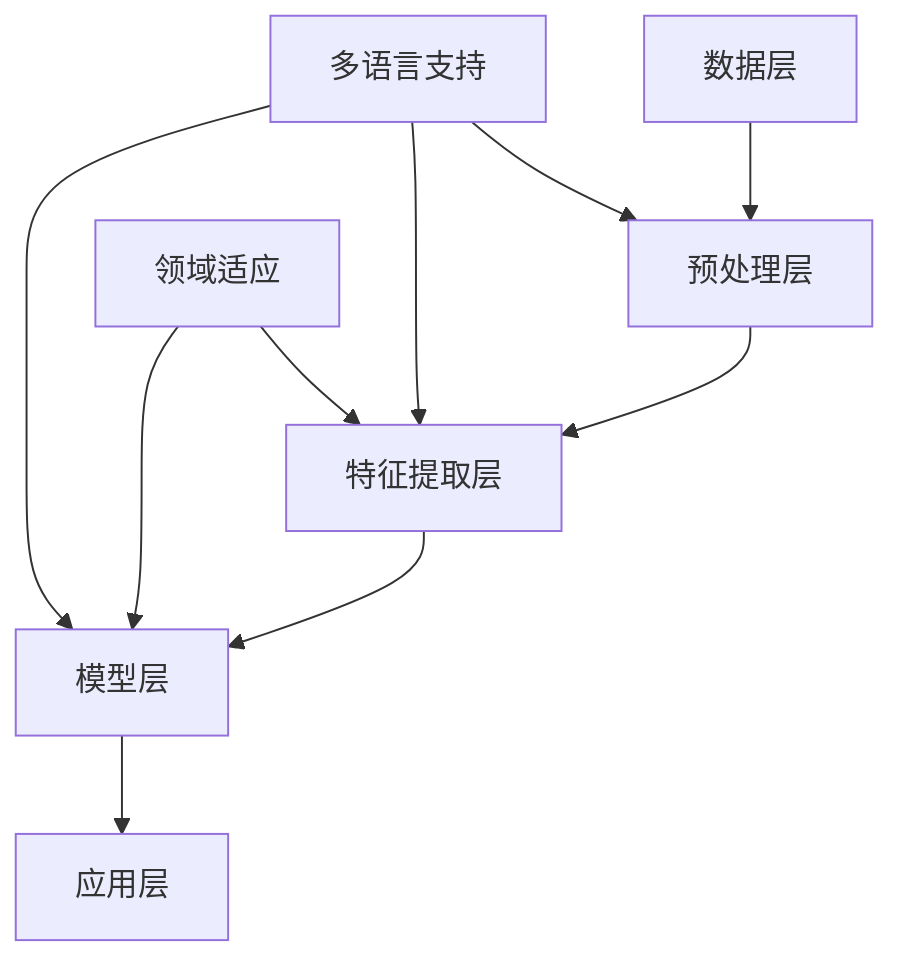

# 构建企业级自然语言处理引擎：多语言支持与领域适应

> 关键词：企业级自然语言处理引擎、多语言支持、领域适应、NLP技术、语言模型

> 摘要：本文聚焦于构建企业级自然语言处理引擎，重点探讨多语言支持与领域适应两个关键方面。首先介绍了构建该引擎的背景，包括目的、预期读者、文档结构和相关术语。接着阐述核心概念与联系，通过文本示意图和Mermaid流程图展示其原理和架构。详细讲解核心算法原理及具体操作步骤，并用Python代码进行阐述。深入分析数学模型和公式，辅以举例说明。通过项目实战，给出代码实际案例并详细解释。列举了该引擎的实际应用场景，推荐了学习资源、开发工具框架和相关论文著作。最后总结未来发展趋势与挑战，解答常见问题并提供扩展阅读和参考资料，旨在为企业构建高效、多语言、适应不同领域的自然语言处理引擎提供全面的指导。

## 1. 背景介绍 
### 1.1 目的和范围
在当今全球化的商业环境中，企业面临着处理来自不同语言和领域的大量文本数据的挑战。构建企业级自然语言处理（NLP）引擎，实现多语言支持和领域适应具有重要的战略意义。本文章的目的在于为企业提供一套全面的技术指导，帮助企业构建能够处理多种语言文本、适应不同业务领域需求的NLP引擎。范围涵盖了从核心概念的介绍、算法原理的讲解、数学模型的分析，到项目实战的代码实现，以及实际应用场景的探讨和相关资源的推荐。

### 1.2 预期读者
本文预期读者包括企业的技术决策者、NLP工程师、数据科学家、软件开发人员以及对自然语言处理技术感兴趣的研究人员。技术决策者可以通过本文了解构建企业级NLP引擎的整体架构和技术要点，为企业的技术选型和战略规划提供参考。NLP工程师和数据科学家可以从本文中获取详细的算法原理和代码实现，用于实际项目的开发。软件开发人员可以学习到如何将NLP技术集成到企业的应用系统中。研究人员可以通过本文了解该领域的最新发展趋势和研究成果。

### 1.3 文档结构概述
本文将按照以下结构进行组织：首先介绍构建企业级NLP引擎的背景信息，包括目的、预期读者、文档结构和相关术语。接着阐述核心概念与联系，通过文本示意图和Mermaid流程图展示引擎的原理和架构。然后详细讲解核心算法原理及具体操作步骤，并用Python代码进行阐述。深入分析数学模型和公式，辅以举例说明。通过项目实战，给出代码实际案例并详细解释。列举该引擎的实际应用场景，推荐学习资源、开发工具框架和相关论文著作。最后总结未来发展趋势与挑战，解答常见问题并提供扩展阅读和参考资料。

### 1.4 术语表
#### 1.4.1 核心术语定义
- **自然语言处理（NLP）**：是一门研究如何让计算机理解、处理和生成人类语言的学科。它涉及到多个领域，如机器学习、深度学习、语言学等。
- **企业级自然语言处理引擎**：是一种专门为企业设计的NLP系统，能够处理大规模的文本数据，满足企业在不同业务场景下的需求。
- **多语言支持**：指NLP引擎能够处理多种不同语言的文本数据，包括语言识别、分词、词性标注等任务。
- **领域适应**：是指NLP引擎能够适应不同业务领域的语言特点和需求，提高在特定领域的处理效果。

#### 1.4.2 相关概念解释
- **语言模型**：是一种用于计算语言序列概率的模型，它可以帮助NLP引擎理解语言的结构和语义。常见的语言模型包括统计语言模型和神经网络语言模型。
- **词向量**：是一种将词语表示为向量的技术，它可以将词语的语义信息转化为向量空间中的数值表示，方便计算机进行处理。
- **迁移学习**：是一种机器学习技术，它可以将在一个领域中学习到的知识迁移到另一个领域中，从而提高模型在新领域的性能。

#### 1.4.3 缩略词列表
- **NLP**：Natural Language Processing（自然语言处理）
- **API**：Application Programming Interface（应用程序编程接口）
- **RNN**：Recurrent Neural Network（循环神经网络）
- **LSTM**：Long Short-Term Memory（长短期记忆网络）
- **GRU**：Gated Recurrent Unit（门控循环单元）
- **BERT**：Bidirectional Encoder Representations from Transformers（基于Transformer的双向编码器表示）

## 2. 核心概念与联系 

### 核心概念原理
企业级自然语言处理引擎的核心目标是实现多语言支持和领域适应。多语言支持需要解决不同语言的语法、词汇、语义等方面的差异，而领域适应则需要让引擎能够理解特定领域的专业术语和语言习惯。

在多语言支持方面，首先需要进行语言识别，确定输入文本的语言类型。然后针对不同语言进行分词、词性标注、命名实体识别等预处理操作。为了实现这些功能，通常会使用多语言语言模型，如mBERT（Multilingual BERT），它可以学习多种语言之间的共享表示。

在领域适应方面，迁移学习是一种常用的技术。通过在大规模通用语料上预训练一个语言模型，然后在特定领域的语料上进行微调，可以让模型快速适应新的领域。此外，还可以使用领域特定的特征工程和模型融合技术，提高模型在特定领域的性能。

### 架构的文本示意图
企业级自然语言处理引擎的架构可以分为以下几个层次：
1. **数据层**：包括多种语言的文本数据和不同领域的语料库。这些数据可以来自企业内部的业务系统、互联网、社交媒体等。
2. **预处理层**：对输入的文本数据进行清洗、分词、词性标注、命名实体识别等预处理操作。不同语言的预处理方法可能会有所不同。
3. **特征提取层**：将预处理后的文本数据转化为计算机能够处理的特征表示，如词向量、句向量等。可以使用预训练的语言模型来提取特征。
4. **模型层**：使用各种机器学习和深度学习模型进行文本分类、情感分析、信息抽取等任务。模型可以根据不同的语言和领域进行调整和优化。
5. **应用层**：将处理结果应用到企业的具体业务场景中，如客户服务、市场营销、智能客服等。

### Mermaid流程图


该流程图展示了企业级自然语言处理引擎的整体架构，以及多语言支持和领域适应在各个层次的作用。数据层提供原始的文本数据，经过预处理层的处理后，进入特征提取层提取特征。模型层使用这些特征进行各种NLP任务，最终将处理结果应用到应用层。多语言支持和领域适应贯穿整个流程，确保引擎能够处理多种语言和适应不同领域的需求。

## 3. 核心算法原理 & 具体操作步骤 

### 核心算法原理
#### 多语言语言模型（如mBERT）
mBERT是一种基于Transformer架构的多语言预训练语言模型。它在大规模的多语言语料上进行无监督学习，学习到了多种语言之间的共享表示。mBERT的核心思想是通过双向编码器来捕捉文本中的上下文信息。

在预训练阶段，mBERT使用了两种任务：掩码语言模型（Masked Language Model，MLM）和下一句预测（Next Sentence Prediction，NSP）。在MLM任务中，模型需要预测被掩码的词语；在NSP任务中，模型需要判断两个句子是否是连续的。

#### 迁移学习
迁移学习是一种将在一个领域中学习到的知识迁移到另一个领域的技术。在企业级NLP引擎中，通常会先在大规模的通用语料上预训练一个语言模型，然后在特定领域的语料上进行微调。微调的过程就是在特定领域的语料上继续训练模型，让模型适应新的领域。

### 具体操作步骤及Python代码实现
#### 步骤1：安装必要的库
```python
!pip install transformers
```

#### 步骤2：加载mBERT模型
```python
from transformers import BertTokenizer, BertModel

# 加载mBERT的分词器和模型
tokenizer = BertTokenizer.from_pretrained('bert-base-multilingual-cased')
model = BertModel.from_pretrained('bert-base-multilingual-cased')
```

#### 步骤3：对输入文本进行分词
```python
text = "这是一个中文句子。This is an English sentence."
inputs = tokenizer(text, return_tensors='pt')
```

#### 步骤4：使用mBERT模型提取特征
```python
outputs = model(**inputs)
last_hidden_states = outputs.last_hidden_state
```

#### 步骤5：在特定领域的语料上进行微调
```python
import torch
from torch.utils.data import Dataset, DataLoader
from transformers import AdamW

# 定义一个自定义数据集类
class CustomDataset(Dataset):
    def __init__(self, texts, labels, tokenizer, max_length):
        self.texts = texts
        self.labels = labels
        self.tokenizer = tokenizer
        self.max_length = max_length

    def __len__(self):
        return len(self.texts)

    def __getitem__(self, idx):
        text = str(self.texts[idx])
        label = self.labels[idx]
        encoding = self.tokenizer.encode_plus(
            text,
            add_special_tokens=True,
            max_length=self.max_length,
            padding='max_length',
            truncation=True,
            return_tensors='pt'
        )
        return {
            'input_ids': encoding['input_ids'].flatten(),
            'attention_mask': encoding['attention_mask'].flatten(),
            'labels': torch.tensor(label, dtype=torch.long)
        }

# 假设我们有特定领域的文本数据和标签
texts = ["领域特定的文本1", "领域特定的文本2"]
labels = [0, 1]

# 创建数据集和数据加载器
dataset = CustomDataset(texts, labels, tokenizer, max_length=128)
dataloader = DataLoader(dataset, batch_size=2, shuffle=True)

# 定义优化器和损失函数
optimizer = AdamW(model.parameters(), lr=2e-5)
criterion = torch.nn.CrossEntropyLoss()

# 微调模型
device = torch.device('cuda' if torch.cuda.is_available() else 'cpu')
model.to(device)
model.train()

for epoch in range(3):
    for batch in dataloader:
        input_ids = batch['input_ids'].to(device)
        attention_mask = batch['attention_mask'].to(device)
        labels = batch['labels'].to(device)

        outputs = model(input_ids, attention_mask=attention_mask)
        logits = outputs.last_hidden_state[:, 0, :]
        loss = criterion(logits, labels)

        optimizer.zero_grad()
        loss.backward()
        optimizer.step()
```

以上代码展示了如何使用mBERT模型进行多语言文本处理，并在特定领域的语料上进行微调。首先加载mBERT的分词器和模型，然后对输入文本进行分词和特征提取。最后，定义一个自定义数据集类，创建数据加载器，使用AdamW优化器和交叉熵损失函数对模型进行微调。

## 4. 数学模型和公式 & 详细讲解 & 举例说明 

### 掩码语言模型（MLM）
#### 数学模型和公式
在掩码语言模型中，给定一个输入序列 $x = [x_1, x_2,..., x_n]$，随机选择一些词语进行掩码，得到掩码后的序列 $\tilde{x}$。模型的目标是预测被掩码的词语。假设被掩码的词语位置为 $i_1, i_2,..., i_k$，模型需要计算在给定 $\tilde{x}$ 的条件下，这些位置的词语的概率分布。

数学公式如下：
$$P(x_{i_j} | \tilde{x}) = \text{softmax}(W \cdot h_{i_j} + b)$$
其中，$h_{i_j}$ 是位置 $i_j$ 的隐藏状态，$W$ 是输出层的权重矩阵，$b$ 是偏置向量。

#### 详细讲解
在预训练阶段，模型通过大量的无监督数据学习到了词语之间的上下文关系。当遇到掩码的词语时，模型会根据上下文信息来预测该词语的概率分布。通过最小化预测概率分布和真实词语之间的交叉熵损失，模型不断调整自身的参数，从而学习到更好的语言表示。

#### 举例说明
假设输入序列为 "The dog [MASK] in the park."，模型需要预测 [MASK] 位置的词语。模型会根据上下文 "The dog" 和 "in the park" 来计算每个词语的概率。例如，预测结果可能是 "runs" 的概率最高，那么模型就会认为 [MASK] 位置的词语是 "runs"。

### 下一句预测（NSP）
#### 数学模型和公式
在NSP任务中，给定两个句子 $A$ 和 $B$，模型需要判断 $B$ 是否是 $A$ 的下一句。模型将 $A$ 和 $B$ 拼接成一个序列 $[CLS] A [SEP] B [SEP]$，并通过一个二分类器来判断 $B$ 是否是 $A$ 的下一句。

数学公式如下：
$$P(y | [CLS]) = \text{softmax}(W_{cls} \cdot h_{[CLS]} + b_{cls})$$
其中，$h_{[CLS]}$ 是 $[CLS]$ 标记的隐藏状态，$W_{cls}$ 是二分类器的权重矩阵，$b_{cls}$ 是偏置向量，$y$ 是标签（0 表示 $B$ 不是 $A$ 的下一句，1 表示 $B$ 是 $A$ 的下一句）。

#### 详细讲解
NSP任务的目的是让模型学习到句子之间的语义连贯性。通过在大规模的文本数据上进行训练，模型可以学习到句子之间的逻辑关系，从而提高对文本的理解能力。

#### 举例说明
假设句子 $A$ 为 "I went to the supermarket."，句子 $B$ 为 "I bought some fruits."，模型会判断 $B$ 是 $A$ 的下一句，输出标签为 1。如果句子 $B$ 为 "The moon is very bright."，模型会判断 $B$ 不是 $A$ 的下一句，输出标签为 0。

### 迁移学习中的微调
#### 数学模型和公式
在迁移学习中，微调的目标是在特定领域的语料上继续训练预训练模型，让模型适应新的领域。假设预训练模型的参数为 $\theta_0$，微调的损失函数为 $L(\theta)$，则微调的目标是最小化以下损失函数：
$$\min_{\theta} L(\theta)$$
通常使用随机梯度下降（SGD）或其变种（如Adam、AdamW）来更新模型的参数：
$$\theta_{t+1} = \theta_t - \alpha \cdot \nabla_{\theta} L(\theta_t)$$
其中，$\alpha$ 是学习率，$\nabla_{\theta} L(\theta_t)$ 是损失函数关于参数 $\theta$ 在第 $t$ 步的梯度。

#### 详细讲解
在微调过程中，预训练模型已经学习到了通用的语言知识。通过在特定领域的语料上进行训练，模型可以根据新的领域数据调整自身的参数，从而提高在新领域的性能。微调的过程通常只需要较少的训练数据和较短的训练时间。

#### 举例说明
假设我们有一个在大规模通用语料上预训练的mBERT模型，现在要将其应用到医疗领域。我们可以收集一些医疗领域的文本数据，并使用上述的微调方法在这些数据上继续训练模型。经过微调后，模型可以更好地理解医疗领域的专业术语和语言习惯，提高在医疗领域的NLP任务的性能。

## 5. 项目实战：代码实际案例和详细解释说明 

### 5.1  开发环境搭建
#### 操作系统
可以选择常见的操作系统，如Windows、Linux（如Ubuntu）或macOS。本案例以Ubuntu 20.04为例。

#### Python环境
建议使用Python 3.7及以上版本。可以使用Anaconda来管理Python环境：
```bash
# 下载Anaconda安装包
wget https://repo.anaconda.com/archive/Anaconda3-2021.11-Linux-x86_64.sh

# 安装Anaconda
bash Anaconda3-2021.11-Linux-x86_64.sh

# 创建一个新的Python环境
conda create -n nlp_engine python=3.8

# 激活环境
conda activate nlp_engine
```

#### 安装必要的库
```bash
pip install transformers torch pandas numpy scikit-learn
```

### 5.2  源代码详细实现和代码解读
#### 数据准备
假设我们有一个包含多种语言和不同领域的文本分类数据集，数据格式为CSV文件，包含两列：`text` 和 `label`。

```python
import pandas as pd
from sklearn.model_selection import train_test_split

# 读取数据
data = pd.read_csv('data.csv')

# 划分训练集和测试集
train_data, test_data = train_test_split(data, test_size=0.2, random_state=42)

train_texts = train_data['text'].tolist()
train_labels = train_data['label'].tolist()
test_texts = test_data['text'].tolist()
test_labels = test_data['label'].tolist()
```

#### 定义数据集类
```python
from torch.utils.data import Dataset
from transformers import BertTokenizer

class CustomDataset(Dataset):
    def __init__(self, texts, labels, tokenizer, max_length):
        self.texts = texts
        self.labels = labels
        self.tokenizer = tokenizer
        self.max_length = max_length

    def __len__(self):
        return len(self.texts)

    def __getitem__(self, idx):
        text = str(self.texts[idx])
        label = self.labels[idx]
        encoding = self.tokenizer.encode_plus(
            text,
            add_special_tokens=True,
            max_length=self.max_length,
            padding='max_length',
            truncation=True,
            return_tensors='pt'
        )
        return {
            'input_ids': encoding['input_ids'].flatten(),
            'attention_mask': encoding['attention_mask'].flatten(),
            'labels': label
        }

# 加载mBERT的分词器
tokenizer = BertTokenizer.from_pretrained('bert-base-multilingual-cased')

# 创建数据集
train_dataset = CustomDataset(train_texts, train_labels, tokenizer, max_length=128)
test_dataset = CustomDataset(test_texts, test_labels, tokenizer, max_length=128)
```

#### 定义模型
```python
import torch
from torch import nn
from transformers import BertModel

class BertClassifier(nn.Module):
    def __init__(self, num_classes):
        super(BertClassifier, self).__init__()
        self.bert = BertModel.from_pretrained('bert-base-multilingual-cased')
        self.dropout = nn.Dropout(0.1)
        self.fc = nn.Linear(self.bert.config.hidden_size, num_classes)

    def forward(self, input_ids, attention_mask):
        outputs = self.bert(input_ids=input_ids, attention_mask=attention_mask)
        pooled_output = outputs.pooler_output
        pooled_output = self.dropout(pooled_output)
        logits = self.fc(pooled_output)
        return logits

# 定义模型
num_classes = len(set(train_labels))
model = BertClassifier(num_classes)
```

#### 训练模型
```python
from torch.utils.data import DataLoader
from transformers import AdamW
from tqdm import tqdm

# 创建数据加载器
train_dataloader = DataLoader(train_dataset, batch_size=16, shuffle=True)
test_dataloader = DataLoader(test_dataset, batch_size=16, shuffle=False)

# 定义优化器和损失函数
optimizer = AdamW(model.parameters(), lr=2e-5)
criterion = nn.CrossEntropyLoss()

# 训练模型
device = torch.device('cuda' if torch.cuda.is_available() else 'cpu')
model.to(device)

num_epochs = 3
for epoch in range(num_epochs):
    model.train()
    total_loss = 0
    for batch in tqdm(train_dataloader):
        input_ids = batch['input_ids'].to(device)
        attention_mask = batch['attention_mask'].to(device)
        labels = batch['labels'].to(device)

        optimizer.zero_grad()
        logits = model(input_ids, attention_mask)
        loss = criterion(logits, labels)
        loss.backward()
        optimizer.step()
        total_loss += loss.item()

    print(f'Epoch {epoch + 1}/{num_epochs}, Loss: {total_loss / len(train_dataloader)}')
```

#### 评估模型
```python
from sklearn.metrics import accuracy_score

model.eval()
predictions = []
true_labels = []

with torch.no_grad():
    for batch in test_dataloader:
        input_ids = batch['input_ids'].to(device)
        attention_mask = batch['attention_mask'].to(device)
        labels = batch['labels'].to(device)

        logits = model(input_ids, attention_mask)
        preds = torch.argmax(logits, dim=1)
        predictions.extend(preds.cpu().tolist())
        true_labels.extend(labels.cpu().tolist())

accuracy = accuracy_score(true_labels, predictions)
print(f'Test Accuracy: {accuracy}')
```

### 5.3  代码解读与分析
#### 数据准备部分
首先使用 `pandas` 库读取CSV文件，并使用 `sklearn` 库的 `train_test_split` 函数将数据划分为训练集和测试集。将文本数据和标签分别存储在列表中，以便后续处理。

#### 数据集类部分
定义了一个自定义的数据集类 `CustomDataset`，继承自 `torch.utils.data.Dataset`。在 `__init__` 方法中初始化文本数据、标签、分词器和最大长度。在 `__getitem__` 方法中，对每个样本进行分词处理，并返回输入ID、注意力掩码和标签。

#### 模型定义部分
定义了一个基于mBERT的文本分类模型 `BertClassifier`，继承自 `torch.nn.Module`。在 `__init__` 方法中加载预训练的mBERT模型，并添加一个全连接层用于分类。在 `forward` 方法中，将输入ID和注意力掩码传入mBERT模型，获取池化输出，经过Dropout层后传入全连接层得到logits。

#### 训练部分
使用 `torch.utils.data.DataLoader` 创建训练数据加载器和测试数据加载器。定义优化器 `AdamW` 和损失函数 `CrossEntropyLoss`。在训练过程中，将模型设置为训练模式，遍历训练数据加载器，计算损失并进行反向传播和参数更新。

#### 评估部分
将模型设置为评估模式，遍历测试数据加载器，获取模型的预测结果和真实标签。使用 `sklearn.metrics.accuracy_score` 计算测试集的准确率。

通过以上代码，我们实现了一个基于mBERT的多语言文本分类模型，并在特定领域的数据集上进行了训练和评估。

## 6. 实际应用场景 
### 客户服务
企业级自然语言处理引擎可以应用于客户服务领域，实现智能客服系统。通过多语言支持，系统可以处理来自不同国家和地区客户的咨询和投诉。例如，当客户使用中文、英文、日语等不同语言提出问题时，引擎可以准确识别语言类型，并进行相应的处理。通过领域适应，系统可以理解特定行业的专业术语，如金融、医疗等领域的问题，提供更准确的回答。智能客服系统可以自动回答常见问题，提高客户服务效率，减少人工客服的工作量。

### 市场营销
在市场营销领域，NLP引擎可以分析社交媒体、新闻文章等文本数据，了解消费者的需求和反馈。通过多语言支持，企业可以收集全球范围内的市场信息。例如，分析不同国家消费者对产品的评价和意见，以便进行产品改进和市场推广。通过领域适应，引擎可以更好地理解市场营销领域的语言特点，如广告文案、促销活动等，帮助企业制定更有效的营销策略。

### 信息抽取
企业级NLP引擎可以用于信息抽取任务，从大量的文本数据中提取有用的信息。例如，从新闻文章中提取事件、人物、时间、地点等关键信息，从合同文档中提取条款、金额、日期等信息。通过多语言支持，引擎可以处理不同语言的文本数据，扩大信息抽取的范围。通过领域适应，引擎可以提高在特定领域信息抽取的准确率，如金融领域的财务报表分析、医疗领域的病历信息抽取等。

### 文档分类
在企业的文档管理中，NLP引擎可以对文档进行自动分类。例如，将合同文档分为销售合同、采购合同、租赁合同等类别，将新闻文章分为政治、经济、娱乐等类别。通过多语言支持，引擎可以处理不同语言的文档。通过领域适应，引擎可以根据企业的特定需求进行文档分类，提高文档管理的效率。

### 舆情监测
企业需要及时了解公众对自身品牌、产品和服务的评价和态度。NLP引擎可以用于舆情监测，分析社交媒体、新闻媒体等渠道的文本数据，识别正面和负面评价，以及热点话题。通过多语言支持，企业可以监测全球范围内的舆情信息。通过领域适应，引擎可以更好地理解特定行业的舆情特点，如金融行业的市场动态、医疗行业的药品安全等，为企业提供准确的舆情分析报告。

## 7. 工具和资源推荐
### 7.1 学习资源推荐
#### 7.1.1 书籍推荐
- 《自然语言处理入门》：作者何晗，本书以入门为目标，全面介绍了自然语言处理的基础技术和常用方法，适合初学者阅读。
- 《深度学习》：作者Ian Goodfellow、Yoshua Bengio和Aaron Courville，本书是深度学习领域的经典教材，其中包含了自然语言处理的相关内容，如循环神经网络、卷积神经网络等。
- 《Speech and Language Processing》：作者Daniel Jurafsky和James H. Martin，本书是自然语言处理领域的权威教材，涵盖了从基础理论到高级应用的各个方面，是学习自然语言处理的必读之书。

#### 7.1.2 在线课程
- Coursera上的“Natural Language Processing Specialization”：由DeepLearning.AI和斯坦福大学联合推出，课程内容涵盖了自然语言处理的各个方面，包括词向量、循环神经网络、注意力机制等。
- edX上的“Introduction to Natural Language Processing”：由华盛顿大学提供，课程介绍了自然语言处理的基本概念和方法，适合初学者。
- 哔哩哔哩上的一些自然语言处理相关的视频教程：有很多博主分享了自然语言处理的学习经验和代码实现，内容丰富多样。

#### 7.1.3 技术博客和网站
- Hugging Face博客：Hugging Face是自然语言处理领域的知名公司，其博客上经常分享最新的研究成果和技术应用，如Transformer模型、预训练语言模型等。
- Medium上的自然语言处理相关文章：Medium上有很多自然语言处理领域的专家和爱好者分享自己的经验和见解，文章质量较高。
- 开源中国：开源中国是国内知名的开源技术社区，上面有很多自然语言处理的开源项目和技术文章。

### 7.2 开发工具框架推荐
#### 7.2.1 IDE和编辑器
- PyCharm：是一款专门为Python开发设计的集成开发环境，具有代码编辑、调试、版本控制等功能，非常适合自然语言处理项目的开发。
- Jupyter Notebook：是一种交互式的开发环境，可以实时运行代码、展示结果，方便进行数据探索和模型调试。
- Visual Studio Code：是一款轻量级的代码编辑器，支持多种编程语言和插件扩展，也可以用于自然语言处理项目的开发。

#### 7.2.2 调试和性能分析工具
- TensorBoard：是TensorFlow提供的可视化工具，可以用于监控模型的训练过程、可视化模型的结构和性能指标等。
- PyTorch Profiler：是PyTorch提供的性能分析工具，可以帮助开发者找出代码中的性能瓶颈，优化模型的训练和推理速度。
- cProfile：是Python标准库中的性能分析工具，可以分析Python代码的运行时间和函数调用次数，帮助开发者优化代码性能。

#### 7.2.3 相关框架和库
- Transformers：是Hugging Face开发的一个开源库，提供了各种预训练的语言模型，如BERT、GPT、XLNet等，方便开发者进行自然语言处理任务的开发。
- NLTK：是Python中最常用的自然语言处理库之一，提供了丰富的文本处理工具和语料库，如分词、词性标注、命名实体识别等。
- SpaCy：是另一个流行的自然语言处理库，具有高效、易用的特点，支持多种语言的处理，提供了预训练的模型和可视化工具。

### 7.3 相关论文著作推荐
#### 7.3.1 经典论文
- “Attention Is All You Need”：这篇论文提出了Transformer架构，是自然语言处理领域的里程碑式成果，为后续的预训练语言模型奠定了基础。
- “BERT: Pre-training of Deep Bidirectional Transformers for Language Understanding”：这篇论文介绍了BERT模型，通过双向编码器和掩码语言模型的预训练方法，在多个自然语言处理任务上取得了优异的成绩。
- “GloVe: Global Vectors for Word Representation”：这篇论文提出了GloVe词向量模型，通过全局的词共现统计信息来学习词向量，具有较好的性能和可解释性。

#### 7.3.2 最新研究成果
- “RoBERTa: A Robustly Optimized BERT Pretraining Approach”：这篇论文对BERT模型进行了优化，通过调整预训练的参数和方法，提高了模型的性能。
- “XLNet: Generalized Autoregressive Pretraining for Language Understanding”：这篇论文提出了XLNet模型，结合了自回归和自编码的优点，在多个自然语言处理任务上取得了优于BERT的成绩。
- “ELECTRA: Pre-training Text Encoders as Discriminators Rather Than Generators”：这篇论文提出了ELECTRA模型，通过判别式的预训练方法，提高了模型的训练效率和性能。

#### 7.3.3 应用案例分析
- “Applying Deep Learning to Answer Selection: A Study and An Open Task”：这篇论文介绍了如何使用深度学习技术解决问答选择问题，给出了具体的应用案例和实验结果。
- “Natural Language Processing for Healthcare: A Survey”：这篇论文对自然语言处理在医疗领域的应用进行了综述，包括病历信息抽取、医疗问答系统等方面的应用案例。
- “Using Natural Language Processing to Improve Customer Service: A Case Study”：这篇论文通过一个实际案例，介绍了如何使用自然语言处理技术提高客户服务的效率和质量。

## 8. 总结：未来发展趋势与挑战
### 未来发展趋势
#### 多模态融合
未来的企业级自然语言处理引擎将不仅仅局限于处理文本数据，还会融合图像、音频、视频等多种模态的数据。例如，在智能客服系统中，除了处理客户的文本咨询，还可以通过语音识别技术处理语音咨询，通过图像识别技术处理客户上传的图片问题。多模态融合可以提供更丰富的信息，提高自然语言处理的效果。

#### 低资源语言支持
目前的自然语言处理技术主要集中在英语、中文等少数高资源语言上，对于低资源语言的支持还比较有限。未来，随着对全球市场的拓展，企业将需要处理更多低资源语言的文本数据。因此，开发针对低资源语言的自然语言处理技术将成为一个重要的发展趋势。这可能包括使用迁移学习、少样本学习等技术，利用高资源语言的知识来提高低资源语言的处理效果。

#### 可解释性和可信赖性
随着自然语言处理技术在企业关键业务中的应用越来越广泛，模型的可解释性和可信赖性变得越来越重要。企业需要了解模型的决策过程和依据，以便做出合理的决策。未来的研究将致力于开发可解释的自然语言处理模型，例如通过可视化技术展示模型的决策过程，通过规则提取技术将模型的决策转化为可理解的规则。

#### 强化学习与自然语言处理的结合
强化学习是一种通过智能体与环境交互来学习最优策略的技术。将强化学习与自然语言处理相结合，可以让自然语言处理系统更加智能和灵活。例如，在智能对话系统中，通过强化学习可以让系统根据用户的反馈不断调整自己的回答策略，提高对话的质量和效果。

### 挑战
#### 数据隐私和安全
企业级自然语言处理引擎需要处理大量的文本数据，这些数据可能包含用户的敏感信息，如个人身份信息、财务信息等。因此，数据隐私和安全是一个重要的挑战。企业需要采取有效的措施来保护数据的隐私和安全，例如数据加密、访问控制、匿名化处理等。

#### 模型复杂度和计算资源
随着自然语言处理技术的发展，模型的复杂度越来越高，需要的计算资源也越来越多。训练一个大规模的预训练语言模型需要大量的计算资源和时间，这对于企业来说是一个巨大的挑战。企业需要寻找更高效的训练算法和硬件平台，以降低计算成本和提高训练效率。

#### 领域知识的融合
不同的业务领域具有不同的语言特点和专业知识，如何将领域知识有效地融合到自然语言处理模型中是一个挑战。例如，在医疗领域，模型需要理解医学术语和疾病诊断标准；在金融领域，模型需要理解金融市场和投资策略。目前的自然语言处理模型主要基于通用语料进行训练，对于领域知识的融合还不够充分。

#### 语言多样性和文化差异
世界上存在着丰富的语言和文化，不同的语言和文化具有不同的语法、词汇和表达方式。在多语言支持方面，如何处理语言多样性和文化差异是一个挑战。例如，一些语言可能没有明确的分词边界，一些文化中的隐喻和习语在其他文化中可能难以理解。企业需要开发更加灵活和适应性强的自然语言处理技术，以应对语言多样性和文化差异带来的挑战。

## 9. 附录：常见问题与解答
### 问题1：如何选择适合企业的预训练语言模型？
解答：选择适合企业的预训练语言模型需要考虑以下几个因素：
- **语言支持**：如果企业需要处理多种语言的文本数据，建议选择多语言预训练模型，如mBERT、XLM-R等。
- **任务类型**：不同的预训练模型在不同的任务上可能表现不同。例如，BERT在文本分类、情感分析等任务上表现较好，而GPT在文本生成任务上表现较好。
- **计算资源**：一些大规模的预训练模型需要较多的计算资源，企业需要根据自身的计算资源情况选择合适的模型。
- **领域适应性**：如果企业有特定的业务领域需求，可以选择在该领域上进行过微调的预训练模型，或者在通用预训练模型的基础上进行微调。

### 问题2：在进行领域适应时，需要多少特定领域的语料？
解答：需要的特定领域语料数量取决于多个因素，如领域的复杂程度、预训练模型的性能、任务的难度等。一般来说，如果领域与通用语料的差异较小，可能只需要少量的特定领域语料进行微调即可；如果领域差异较大，可能需要较多的语料。通常建议先使用少量的语料进行尝试，观察模型的性能提升情况，然后根据需要逐步增加语料数量。

### 问题3：如何提高多语言支持的效果？
解答：可以从以下几个方面提高多语言支持的效果：
- **使用多语言预训练模型**：如mBERT、XLM-R等，这些模型在大规模的多语言语料上进行了预训练，学习到了多种语言之间的共享表示。
- **增加多语言训练数据**：收集更多不同语言的文本数据，用于模型的训练和微调。
- **考虑语言特点**：不同的语言具有不同的语法、词汇和表达方式，在预处理和模型设计时需要考虑这些特点。例如，一些语言可能需要特殊的分词方法。
- **进行跨语言迁移学习**：利用一种语言的知识来提高另一种语言的处理效果。例如，在资源丰富的语言上训练模型，然后将模型迁移到资源较少的语言上。

### 问题4：如何评估企业级自然语言处理引擎的性能？
解答：可以从以下几个方面评估企业级自然语言处理引擎的性能：
- **准确率**：对于分类、命名实体识别等任务，准确率是一个重要的评估指标。可以使用测试集上的准确率来评估模型的性能。
- **召回率**：在信息抽取等任务中，召回率可以衡量模型能够正确识别出的信息的比例。
- **F1值**：F1值是准确率和召回率的调和平均值，可以综合考虑准确率和召回率。
- **响应时间**：在实际应用中，引擎的响应时间也是一个重要的指标。可以通过测试引擎处理不同长度文本的时间来评估响应时间。
- **用户满意度**：最终的评估还需要考虑用户的满意度。可以通过用户调查、反馈等方式了解用户对引擎的使用体验和满意度。

## 10. 扩展阅读 & 参考资料
### 扩展阅读
- 《Natural Language Processing with Python》：这本书详细介绍了如何使用Python进行自然语言处理，包含了大量的代码示例和实际应用案例。
- 《Neural Network Methods for Natural Language Processing》：本书深入探讨了神经网络在自然语言处理中的应用，适合有一定机器学习基础的读者阅读。
- 《The Handbook of Natural Language Processing》：这是一本自然语言处理领域的综合性手册，涵盖了自然语言处理的各个方面，是深入学习自然语言处理的重要参考资料。

### 参考资料
- Hugging Face官方文档：https://huggingface.co/docs
- NLTK官方文档：https://www.nltk.org/
- SpaCy官方文档：https://spacy.io/
- TensorFlow官方文档：https://www.tensorflow.org/
- PyTorch官方文档：https://pytorch.org/

作者：AI天才研究院/AI Genius Institute & 禅与计算机程序设计艺术 /Zen And The Art of Computer Programming