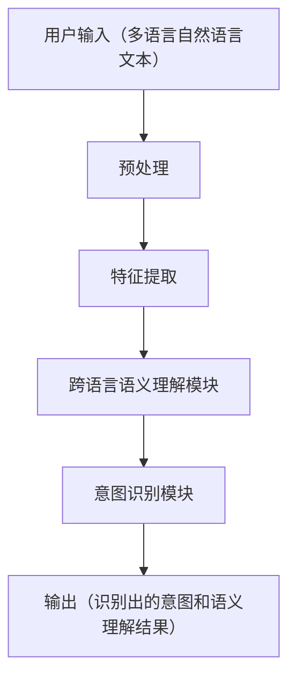

# 构建企业级自然语言理解系统：跨语言语义理解与意图识别

> 关键词：企业级自然语言理解系统、跨语言语义理解、意图识别、自然语言处理、语义分析、机器学习、深度学习

> 摘要：本文围绕构建企业级自然语言理解系统展开，重点探讨跨语言语义理解与意图识别技术。首先介绍了相关背景知识，包括系统构建的目的、预期读者、文档结构等。接着详细阐述了核心概念、算法原理、数学模型等内容，通过 Python 代码示例深入讲解算法实现。然后给出项目实战案例，从开发环境搭建到代码详细实现与解读，全面展示系统构建过程。还介绍了该系统的实际应用场景，推荐了学习资源、开发工具框架和相关论文著作。最后对未来发展趋势与挑战进行总结，并提供常见问题解答和扩展阅读参考资料，旨在为企业级自然语言理解系统的构建提供全面、深入的技术指导。

## 1. 背景介绍 
### 1.1 目的和范围
在全球化的大背景下，企业面临着多语言交流的需求，需要处理来自不同语言背景的用户自然语言输入。构建企业级自然语言理解系统的目的在于实现跨语言的语义理解和意图识别，从而更好地服务用户，提升企业的智能化水平和服务质量。本系统的范围涵盖了多种常见语言，能够处理各种自然语言文本，包括但不限于客户咨询、用户反馈、文本分类等场景。

### 1.2 预期读者
本文的预期读者包括自然语言处理领域的研究人员、企业的技术开发人员、对人工智能和自然语言处理感兴趣的学生以及相关企业的技术决策者。对于研究人员，本文可以提供跨语言语义理解与意图识别的最新技术和研究思路；对于开发人员，能够获取具体的技术实现细节和代码示例；对于学生，可以作为学习自然语言处理的参考资料；对于技术决策者，可以帮助其了解构建企业级自然语言理解系统的必要性和可行性。

### 1.3 文档结构概述
本文首先介绍构建企业级自然语言理解系统的背景知识，包括目的、读者和文档结构等。然后深入探讨核心概念与联系，通过文本示意图和 Mermaid 流程图进行直观展示。接着详细讲解核心算法原理和具体操作步骤，结合 Python 代码进行阐述。之后介绍数学模型和公式，并通过举例说明加深理解。再通过项目实战案例，展示系统的开发环境搭建、源代码实现和代码解读。随后介绍系统的实际应用场景，推荐相关的学习资源、开发工具框架和论文著作。最后对未来发展趋势与挑战进行总结，提供常见问题解答和扩展阅读参考资料。

### 1.4 术语表
#### 1.4.1 核心术语定义
- **自然语言理解（Natural Language Understanding，NLU）**：指计算机能够理解人类自然语言的含义，包括语义、语法和语用等方面。
- **跨语言语义理解**：在不同语言之间实现对文本语义的准确理解，消除语言差异带来的障碍。
- **意图识别**：分析用户自然语言输入的真实意图，例如用户是在询问信息、提出请求还是表达情感等。
- **语义分析**：对文本的语义信息进行分析，确定其含义和逻辑关系。
- **机器学习**：让计算机通过数据学习模式和规律，从而实现预测和决策的技术。
- **深度学习**：一种基于人工神经网络的机器学习方法，能够自动从大量数据中学习复杂的模式和特征。

#### 1.4.2 相关概念解释
- **词向量**：将词语表示为向量形式，使得计算机能够处理和分析词语之间的语义关系。
- **预训练模型**：在大规模语料库上进行预训练的模型，能够学习到通用的语言知识和特征，可用于各种自然语言处理任务。
- **注意力机制**：一种能够自动关注文本中重要部分的机制，有助于提高模型的性能和理解能力。

#### 1.4.3 缩略词列表
- **NLU**：Natural Language Understanding（自然语言理解）
- **NLP**：Natural Language Processing（自然语言处理）
- **RNN**：Recurrent Neural Network（循环神经网络）
- **LSTM**：Long Short-Term Memory（长短期记忆网络）
- **GRU**：Gated Recurrent Unit（门控循环单元）
- **BERT**：Bidirectional Encoder Representations from Transformers（基于变换器的双向编码器表示）

## 2. 核心概念与联系 

### 核心概念原理
#### 自然语言理解
自然语言理解是自然语言处理的核心任务之一，它旨在让计算机理解人类自然语言的含义。其原理基于对语言的各个层面进行分析，包括词汇、语法、语义和语用等。通过对文本的分词、词性标注、句法分析和语义角色标注等处理，计算机可以逐步理解文本的结构和含义。

#### 跨语言语义理解
跨语言语义理解的关键在于消除不同语言之间的差异，找到不同语言文本之间的语义对应关系。这通常需要借助多语言词向量、跨语言预训练模型等技术。多语言词向量可以将不同语言的词语映射到同一向量空间中，使得语义相近的词语在向量空间中距离较近。跨语言预训练模型则可以学习到不同语言之间的通用语言知识和特征，从而实现跨语言的语义理解。

#### 意图识别
意图识别的原理是通过对用户自然语言输入的分析，提取出用户的真实意图。这可以通过机器学习和深度学习方法实现，例如使用分类算法将用户输入分类到不同的意图类别中。常见的意图类别包括信息查询、任务请求、情感表达等。

### 架构的文本示意图
```plaintext
用户输入（多语言自然语言文本）
|
|-- 预处理（分词、词性标注等）
|
|-- 特征提取（词向量、句向量等）
|
|-- 跨语言语义理解模块（多语言预训练模型）
|
|-- 意图识别模块（分类算法）
|
|-- 输出（识别出的意图和语义理解结果）
```

### Mermaid 流程图


## 3. 核心算法原理 & 具体操作步骤 

### 核心算法原理
#### 词向量表示
词向量是将词语表示为向量形式的技术，常见的词向量模型有 Word2Vec、GloVe 等。以 Word2Vec 为例，它基于神经网络，通过预测词语的上下文来学习词语的向量表示。具体来说，Word2Vec 有两种模型：Skip-gram 和 Continuous Bag-of-Words（CBOW）。Skip-gram 模型通过当前词语预测其上下文词语，而 CBOW 模型则通过上下文词语预测当前词语。

#### 预训练模型
预训练模型如 BERT 是基于 Transformer 架构的双向编码器。BERT 通过在大规模语料库上进行无监督学习，学习到通用的语言知识和特征。在跨语言语义理解中，可以使用多语言 BERT 模型，它能够处理多种语言的文本，并学习到不同语言之间的语义联系。

#### 意图识别算法
常见的意图识别算法包括支持向量机（SVM）、逻辑回归、深度学习模型如卷积神经网络（CNN）和循环神经网络（RNN）及其变体（LSTM、GRU）等。深度学习模型在处理自然语言序列数据方面具有优势，能够自动学习到文本中的语义信息和模式。

### 具体操作步骤
#### 数据预处理
- **分词**：将文本分割成单个词语或子词。在多语言环境中，需要使用相应语言的分词工具，例如中文可以使用 jieba 分词，英文可以使用 NLTK 或 SpaCy 等工具。
- **词性标注**：为每个词语标注其词性，例如名词、动词、形容词等。这有助于后续的语义分析和特征提取。
- **去除停用词**：去除文本中的停用词，如“的”、“是”、“和”等，这些词语通常对语义理解和意图识别的贡献较小。

#### 特征提取
- **词向量提取**：使用预训练的词向量模型（如 Word2Vec、GloVe 或多语言 BERT）将词语转换为向量表示。
- **句向量生成**：将词向量组合成句向量，可以使用简单的平均池化方法，也可以使用更复杂的方法如基于注意力机制的句向量表示。

#### 模型训练
- **选择合适的模型**：根据任务需求和数据特点选择合适的意图识别模型，如 CNN、LSTM 或预训练模型微调。
- **划分数据集**：将数据集划分为训练集、验证集和测试集，用于模型的训练、调优和评估。
- **训练模型**：使用训练集对模型进行训练，通过优化损失函数来调整模型的参数。

#### 模型评估和优化
- **评估指标**：使用准确率、召回率、F1 值等指标评估模型的性能。
- **模型优化**：根据评估结果对模型进行优化，例如调整模型的超参数、增加训练数据等。

### Python 源代码实现
```python
import torch
from transformers import AutoTokenizer, AutoModel
from sklearn.model_selection import train_test_split
from sklearn.svm import SVC
from sklearn.metrics import accuracy_score
import numpy as np

# 加载多语言 BERT 模型和分词器
tokenizer = AutoTokenizer.from_pretrained('bert-base-multilingual-cased')
model = AutoModel.from_pretrained('bert-base-multilingual-cased')

# 示例数据
texts = ["这是一个中文句子", "This is an English sentence"]
labels = [0, 1]

# 数据预处理和特征提取
def get_embeddings(texts):
    embeddings = []
    for text in texts:
        inputs = tokenizer(text, return_tensors='pt')
        outputs = model(**inputs)
        cls_embedding = outputs.last_hidden_state[:, 0, :].detach().numpy()
        embeddings.append(cls_embedding)
    return np.vstack(embeddings)

X = get_embeddings(texts)
y = np.array(labels)

# 划分数据集
X_train, X_test, y_train, y_test = train_test_split(X, y, test_size=0.2, random_state=42)

# 训练意图识别模型（使用 SVM）
svm_model = SVC()
svm_model.fit(X_train, y_train)

# 模型评估
y_pred = svm_model.predict(X_test)
accuracy = accuracy_score(y_test, y_pred)
print(f"Accuracy: {accuracy}")
```

## 4. 数学模型和公式 & 详细讲解 & 举例说明 

### 词向量模型
#### Word2Vec 模型
Word2Vec 的 Skip-gram 模型的目标是最大化给定中心词 $w_c$ 预测上下文词 $w_o$ 的概率。其数学公式为：
$$
\max_{\theta} \prod_{t=1}^{T} \prod_{-m \leq j \leq m, j \neq 0} P(w_{t+j} | w_t; \theta)
$$
其中，$T$ 是语料库中的词数，$m$ 是上下文窗口的大小，$\theta$ 是模型的参数。

$P(w_{o} | w_{c})$ 可以通过 softmax 函数计算：
$$
P(w_{o} | w_{c}) = \frac{\exp(\mathbf{v}_{o}^{T} \mathbf{v}_{c})}{\sum_{w=1}^{V} \exp(\mathbf{v}_{w}^{T} \mathbf{v}_{c})}
$$
其中，$\mathbf{v}_{o}$ 和 $\mathbf{v}_{c}$ 分别是上下文词和中心词的向量表示，$V$ 是词汇表的大小。

#### 举例说明
假设我们有一个简单的语料库：["I like apples", "She likes bananas"]。以“like” 为中心词，上下文窗口大小为 1，那么上下文词为 “I” 和 “apples”。Word2Vec 模型会通过学习最大化预测 “I” 和 “apples” 的概率来更新 “like” 的向量表示。

### 预训练模型（BERT）
BERT 模型基于 Transformer 架构，其核心是多头自注意力机制。多头自注意力机制的计算公式为：
$$
\text{MultiHead}(Q, K, V) = \text{Concat}(\text{head}_1, \ldots, \text{head}_h) W^O
$$
其中，$\text{head}_i = \text{Attention}(QW_i^Q, KW_i^K, VW_i^V)$，$W_i^Q$、$W_i^K$、$W_i^V$ 和 $W^O$ 是可学习的参数矩阵。

$\text{Attention}$ 函数的计算公式为：
$$
\text{Attention}(Q, K, V) = \text{softmax}\left(\frac{QK^T}{\sqrt{d_k}}\right) V
$$
其中，$Q$、$K$ 和 $V$ 分别是查询、键和值矩阵，$d_k$ 是键的维度。

#### 举例说明
假设我们有一个输入句子 “The cat is on the mat”，BERT 模型会将其转换为词向量序列，然后通过多头自注意力机制计算每个词与其他词之间的关联程度。例如，“cat” 可能会与 “mat” 有较强的关联，因为它们在语义上有一定的联系。

### 意图识别模型（逻辑回归）
逻辑回归是一种常用的二分类模型，其输出概率的计算公式为：
$$
P(y = 1 | \mathbf{x}) = \frac{1}{1 + \exp(-(\mathbf{w}^T \mathbf{x} + b))}
$$
其中，$\mathbf{x}$ 是输入特征向量，$\mathbf{w}$ 是权重向量，$b$ 是偏置项。

#### 举例说明
假设我们要判断一个句子是正面情感还是负面情感，输入特征 $\mathbf{x}$ 可以是句子的词向量表示。逻辑回归模型会根据 $\mathbf{x}$ 计算出句子是正面情感的概率 $P(y = 1 | \mathbf{x})$，如果该概率大于 0.5，则判断为正面情感，否则判断为负面情感。

## 5. 项目实战：代码实际案例和详细解释说明 

### 5.1  开发环境搭建
#### 操作系统
可以选择 Linux（如 Ubuntu）、Windows 或 macOS 作为开发环境的操作系统。

#### Python 环境
安装 Python 3.6 及以上版本，可以使用 Anaconda 或 Miniconda 来管理 Python 环境。

#### 依赖库安装
使用以下命令安装所需的依赖库：
```sh
pip install torch transformers scikit-learn numpy
```

### 5.2  源代码详细实现和代码解读
```python
import torch
from transformers import AutoTokenizer, AutoModel
from sklearn.model_selection import train_test_split
from sklearn.svm import SVC
from sklearn.metrics import accuracy_score
import numpy as np

# 加载多语言 BERT 模型和分词器
tokenizer = AutoTokenizer.from_pretrained('bert-base-multilingual-cased')
model = AutoModel.from_pretrained('bert-base-multilingual-cased')

# 示例数据
texts = ["这是一个中文句子", "This is an English sentence", "这是另一个中文句子", "Another English sentence"]
labels = [0, 1, 0, 1]

# 数据预处理和特征提取
def get_embeddings(texts):
    embeddings = []
    for text in texts:
        # 使用分词器将文本转换为输入张量
        inputs = tokenizer(text, return_tensors='pt')
        # 输入到 BERT 模型中
        outputs = model(**inputs)
        # 提取 [CLS] 标记的嵌入作为句子的表示
        cls_embedding = outputs.last_hidden_state[:, 0, :].detach().numpy()
        embeddings.append(cls_embedding)
    return np.vstack(embeddings)

X = get_embeddings(texts)
y = np.array(labels)

# 划分数据集
X_train, X_test, y_train, y_test = train_test_split(X, y, test_size=0.2, random_state=42)

# 训练意图识别模型（使用 SVM）
svm_model = SVC()
svm_model.fit(X_train, y_train)

# 模型评估
y_pred = svm_model.predict(X_test)
accuracy = accuracy_score(y_test, y_pred)
print(f"Accuracy: {accuracy}")
```

### 代码解读与分析
1. **模型和分词器加载**：使用 `AutoTokenizer` 和 `AutoModel` 从 Hugging Face 的模型库中加载多语言 BERT 模型和分词器。
2. **数据预处理和特征提取**：`get_embeddings` 函数将文本转换为 BERT 模型的输入，然后提取 [CLS] 标记的嵌入作为句子的表示。
3. **数据集划分**：使用 `train_test_split` 函数将数据集划分为训练集和测试集。
4. **模型训练**：使用 SVM 模型对训练集进行训练。
5. **模型评估**：使用测试集对训练好的模型进行评估，计算准确率。

## 6. 实际应用场景 
### 客户服务
企业可以使用自然语言理解系统来处理客户的咨询和反馈，实现自动问答和意图识别。例如，在电商平台中，系统可以自动识别客户的问题类型，如商品咨询、订单查询、售后问题等，并提供相应的解决方案。在多语言环境下，系统可以处理不同语言的客户咨询，提高客户服务的效率和质量。

### 智能助手
智能助手如 Siri、小爱同学等都依赖于自然语言理解