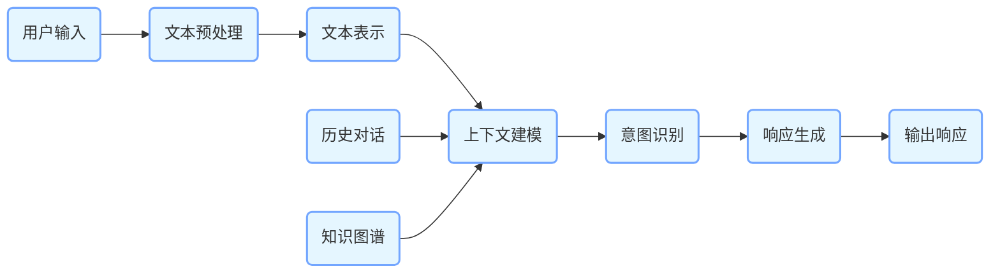

# 构建具有上下文理解能力的AI Agent

> 关键词：AI Agent、上下文理解能力、自然语言处理、机器学习、深度学习、智能交互、知识图谱

> 摘要：本文围绕构建具有上下文理解能力的AI Agent展开深入探讨。首先介绍了相关背景，包括目的范围、预期读者、文档结构和术语表。接着阐述核心概念与联系，给出原理和架构的示意图及流程图。详细讲解核心算法原理，通过Python代码示例展示具体操作步骤。对涉及的数学模型和公式进行详细说明并举例。通过项目实战展示代码的实际应用和详细解读。分析实际应用场景，推荐学习资源、开发工具框架和相关论文著作。最后总结未来发展趋势与挑战，提供常见问题解答和扩展阅读参考资料，旨在为开发者和研究者提供全面的技术指导和思路。

## 1. 背景介绍 
### 1.1 目的和范围
随着人工智能技术的不断发展，人们对智能交互的需求日益增长。具有上下文理解能力的AI Agent能够更好地理解用户的意图，提供更加准确和个性化的服务。本文的目的在于详细阐述如何构建这样的AI Agent，涵盖从核心概念、算法原理到实际项目开发的全过程。范围包括相关的理论知识、技术实现以及实际应用场景的分析。

### 1.2 预期读者
本文主要面向对人工智能、自然语言处理等领域感兴趣的开发者、研究者和技术爱好者。无论是初学者希望了解基本概念和原理，还是有一定经验的专业人士寻求深入的技术实现细节，都能从本文中获得有价值的信息。

### 1.3 文档结构概述
本文将按照以下结构进行组织：首先介绍相关背景知识，包括目的、读者群体和文档结构。接着阐述核心概念与联系，展示其原理和架构。详细讲解核心算法原理和具体操作步骤，结合Python代码进行说明。介绍涉及的数学模型和公式，并举例说明。通过项目实战展示代码的实际应用和详细解读。分析实际应用场景，推荐学习资源、开发工具框架和相关论文著作。最后总结未来发展趋势与挑战，提供常见问题解答和扩展阅读参考资料。

### 1.4 术语表
#### 1.4.1 核心术语定义
- **AI Agent**：人工智能代理，是一种能够感知环境、进行决策并采取行动以实现特定目标的智能实体。
- **上下文理解能力**：指AI Agent能够理解当前对话或任务所处的情境，包括之前的交互信息、相关的背景知识等，从而更好地理解用户意图。
- **自然语言处理（NLP）**：是人工智能的一个重要领域，主要研究如何让计算机处理和理解人类语言。
- **机器学习**：是一门多领域交叉学科，涉及概率论、统计学、逼近论、凸分析、算法复杂度理论等多门学科。它专门研究计算机怎样模拟或实现人类的学习行为，以获取新的知识或技能，重新组织已有的知识结构使之不断改善自身的性能。
- **深度学习**：是机器学习的一个分支领域，它是一种基于对数据进行表征学习的方法。深度学习通过构建具有很多层的神经网络模型，自动从大量数据中学习特征和模式。

#### 1.4.2 相关概念解释
- **知识图谱**：是一种语义网络，用于表示实体、概念及其之间的关系。在AI Agent中，知识图谱可以为上下文理解提供丰富的背景知识。
- **注意力机制**：是深度学习中的一种技术，它可以让模型在处理输入时，更加关注重要的部分，从而提高模型的性能。

#### 1.4.3 缩略词列表
- **NLP**：自然语言处理（Natural Language Processing）
- **ML**：机器学习（Machine Learning）
- **DL**：深度学习（Deep Learning）
- **RNN**：循环神经网络（Recurrent Neural Network）
- **LSTM**：长短期记忆网络（Long Short-Term Memory）
- **GRU**：门控循环单元（Gated Recurrent Unit）
- **Transformer**：一种基于注意力机制的深度学习模型

## 2. 核心概念与联系 
### 核心概念原理
具有上下文理解能力的AI Agent的核心原理在于综合运用自然语言处理、机器学习和深度学习等技术，对用户输入的文本进行分析和理解。具体来说，它需要完成以下几个关键步骤：
1. **文本表示**：将输入的文本转换为计算机能够处理的数值表示，例如词向量、句向量等。
2. **上下文建模**：考虑当前文本所处的上下文信息，包括之前的对话历史、相关的背景知识等，以更好地理解用户的意图。
3. **意图识别**：根据文本表示和上下文信息，判断用户的意图，例如查询信息、执行任务等。
4. **响应生成**：根据用户的意图，生成合适的响应，例如文本回答、执行操作等。

### 架构示意图

该示意图展示了具有上下文理解能力的AI Agent的基本架构。用户输入经过文本预处理后，转换为文本表示。上下文建模模块结合历史对话和知识图谱等信息，对文本表示进行进一步处理。意图识别模块根据处理后的信息判断用户的意图，响应生成模块根据意图生成合适的响应并输出。

### 核心概念联系
文本表示是整个系统的基础，它为后续的上下文建模、意图识别和响应生成提供了数值表示。上下文建模利用历史对话和知识图谱等信息，增强对用户意图的理解。意图识别是关键步骤，它决定了AI Agent应该采取的行动。响应生成则根据意图生成合适的输出，完成与用户的交互。这些核心概念相互关联，共同构成了具有上下文理解能力的AI Agent的核心功能。

## 3. 核心算法原理 & 具体操作步骤 
### 核心算法原理
在构建具有上下文理解能力的AI Agent时，常用的算法包括循环神经网络（RNN）及其变体（如LSTM、GRU）、Transformer等。下面以Transformer为例，介绍其核心算法原理。

Transformer是一种基于注意力机制的深度学习模型，它主要由编码器和解码器两部分组成。编码器负责对输入的文本进行编码，解码器负责根据编码信息生成输出。

#### 注意力机制
注意力机制允许模型在处理输入时，动态地关注输入序列中的不同部分。具体来说，对于输入序列 $X = [x_1, x_2,..., x_n]$，注意力机制计算每个位置的注意力分数，然后根据这些分数对输入进行加权求和，得到一个新的表示。

注意力分数的计算通常使用点积注意力公式：
$$Attention(Q, K, V) = softmax(\frac{QK^T}{\sqrt{d_k}})V$$
其中，$Q$ 是查询矩阵，$K$ 是键矩阵，$V$ 是值矩阵，$d_k$ 是键的维度。

#### Transformer架构
Transformer的编码器和解码器都由多个相同的层组成，每个层包含多头注意力机制和前馈神经网络。多头注意力机制通过多个不同的注意力头并行计算，增强模型的表达能力。

### 具体操作步骤
以下是使用Python和PyTorch实现一个简单的Transformer模型的具体步骤：

```python
import torch
import torch.nn as nn
import torch.nn.functional as F

# 定义多头注意力机制
class MultiHeadAttention(nn.Module):
    def __init__(self, d_model, num_heads):
        super(MultiHeadAttention, self).__init__()
        assert d_model % num_heads == 0, "d_model must be divisible by num_heads"
        
        self.d_model = d_model
        self.num_heads = num_heads
        self.d_k = d_model // num_heads
        
        self.W_q = nn.Linear(d_model, d_model)
        self.W_k = nn.Linear(d_model, d_model)
        self.W_v = nn.Linear(d_model, d_model)
        self.W_o = nn.Linear(d_model, d_model)
        
    def forward(self, Q, K, V, mask=None):
        batch_size = Q.size(0)
        
        # 线性变换
        Q = self.W_q(Q)
        K = self.W_k(K)
        V = self.W_v(V)
        
        # 分割头
        Q = Q.view(batch_size, -1, self.num_heads, self.d_k).transpose(1, 2)
        K = K.view(batch_size, -1, self.num_heads, self.d_k).transpose(1, 2)
        V = V.view(batch_size, -1, self.num_heads, self.d_k).transpose(1, 2)
        
        # 计算注意力分数
        attn_scores = torch.matmul(Q, K.transpose(-2, -1)) / torch.sqrt(torch.tensor(self.d_k, dtype=torch.float32))
        
        if mask is not None:
            attn_scores = attn_scores.masked_fill(mask == 0, -1e9)
        
        # 应用softmax函数
        attn_probs = F.softmax(attn_scores, dim=-1)
        
        # 加权求和
        output = torch.matmul(attn_probs, V)
        
        # 合并头
        output = output.transpose(1, 2).contiguous().view(batch_size, -1, self.d_model)
        
        # 线性变换
        output = self.W_o(output)
        
        return output

# 定义前馈神经网络
class PositionwiseFeedForward(nn.Module):
    def __init__(self, d_model, d_ff):
        super(PositionwiseFeedForward, self).__init__()
        self.fc1 = nn.Linear(d_model, d_ff)
        self.fc2 = nn.Linear(d_ff, d_model)
        self.relu = nn.ReLU()
        
    def forward(self, x):
        return self.fc2(self.relu(self.fc1(x)))

# 定义编码器层
class EncoderLayer(nn.Module):
    def __init__(self, d_model, num_heads, d_ff, dropout):
        super(EncoderLayer, self).__init__()
        self.self_attn = MultiHeadAttention(d_model, num_heads)
        self.feed_forward = PositionwiseFeedForward(d_model, d_ff)
        self.norm1 = nn.LayerNorm(d_model)
        self.norm2 = nn.LayerNorm(d_model)
        self.dropout = nn.Dropout(dropout)
        
    def forward(self, x, mask):
        # 多头注意力机制
        attn_output = self.self_attn(x, x, x, mask)
        x = self.norm1(x + self.dropout(attn_output))
        
        # 前馈神经网络
        ff_output = self.feed_forward(x)
        x = self.norm2(x + self.dropout(ff_output))
        
        return x

# 定义编码器
class Encoder(nn.Module):
    def __init__(self, num_layers, d_model, num_heads, d_ff, dropout):
        super(Encoder, self).__init__()
        self.layers = nn.ModuleList([EncoderLayer(d_model, num_heads, d_ff, dropout) for _ in range(num_layers)])
        
    def forward(self, x, mask):
        for layer in self.layers:
            x = layer(x, mask)
        return x

# 定义Transformer模型
class Transformer(nn.Module):
    def __init__(self, num_layers, d_model, num_heads, d_ff, dropout):
        super(Transformer, self).__init__()
        self.encoder = Encoder(num_layers, d_model, num_heads, d_ff, dropout)
        
    def forward(self, src, src_mask):
        encoder_output = self.encoder(src, src_mask)
        return encoder_output

# 示例使用
if __name__ == "__main__":
    # 模型参数
    num_layers = 2
    d_model = 128
    num_heads = 8
    d_ff = 512
    dropout = 0.1
    
    # 创建模型
    model = Transformer(num_layers, d_model, num_heads, d_ff, dropout)
    
    # 输入数据
    batch_size = 32
    seq_length = 10
    src = torch.randn(batch_size, seq_length, d_model)
    src_mask = torch.ones(batch_size, 1, seq_length)
    
    # 前向传播
    output = model(src, src_mask)
    print(output.shape)
```

### 代码解释
1. **MultiHeadAttention类**：实现了多头注意力机制，包括线性变换、分割头、计算注意力分数、应用softmax函数、加权求和和合并头等步骤。
2. **PositionwiseFeedForward类**：实现了前馈神经网络，包括两个线性层和一个ReLU激活函数。
3. **EncoderLayer类**：实现了编码器层，包括多头注意力机制和前馈神经网络，并使用LayerNorm进行归一化。
4. **Encoder类**：实现了编码器，由多个编码器层组成。
5. **Transformer类**：实现了Transformer模型，包括编码器。
6. **示例使用**：创建了一个Transformer模型，并进行了前向传播，输出结果的形状为 `(batch_size, seq_length, d_model)`。

## 4. 数学模型和公式 & 详细讲解 & 举例说明 
### 文本表示
在自然语言处理中，常用的文本表示方法是词向量。词向量将每个单词映射到一个低维的向量空间中，使得语义相似的单词在向量空间中距离较近。

#### 词嵌入
词嵌入是一种将单词转换为向量的方法，常用的词嵌入模型包括Word2Vec、GloVe等。假设我们有一个词表 $V$，大小为 $|V|$，词嵌入矩阵 $E$ 的形状为 $(|V|, d)$，其中 $d$ 是词向量的维度。对于一个单词 $w$，其词向量可以通过查找词嵌入矩阵得到：
$$\mathbf{v}_w = E[w]$$

#### 句向量
为了表示一个句子，我们可以将句子中的每个单词的词向量进行组合。一种简单的方法是将所有词向量求平均：
$$\mathbf{v}_{sent} = \frac{1}{n} \sum_{i=1}^{n} \mathbf{v}_{w_i}$$
其中，$n$ 是句子中单词的数量，$\mathbf{v}_{w_i}$ 是第 $i$ 个单词的词向量。

### 注意力机制
如前所述，注意力机制的核心公式是点积注意力公式：
$$Attention(Q, K, V) = softmax(\frac{QK^T}{\sqrt{d_k}})V$$

#### 详细讲解
- $Q$、$K$、$V$ 分别是查询矩阵、键矩阵和值矩阵，它们的形状分别为 $(batch\_size, seq\_length, d_k)$、$(batch\_size, seq\_length, d_k)$ 和 $(batch\_size, seq\_length, d_v)$。
- $QK^T$ 计算查询和键之间的相似度，得到一个形状为 $(batch\_size, seq\_length, seq\_length)$ 的矩阵。
- $\frac{QK^T}{\sqrt{d_k}}$ 是为了防止点积结果过大，导致softmax函数的梯度消失。
- $softmax$ 函数将相似度矩阵转换为概率分布，使得每行的和为1。
- $softmax(\frac{QK^T}{\sqrt{d_k}})V$ 对值矩阵进行加权求和，得到最终的输出。

#### 举例说明
假设我们有一个输入序列 $X = [x_1, x_2, x_3]$，词向量维度为 $d = 4$。我们将 $X$ 分别作为查询、键和值，即 $Q = K = V = X$。假设 $d_k = 4$，则：
$$Q = \begin{bmatrix}
\mathbf{v}_{x_1} \\
\mathbf{v}_{x_2} \\
\mathbf{v}_{x_3}
\end{bmatrix} = \begin{bmatrix}
1 & 2 & 3 & 4 \\
5 & 6 & 7 & 8 \\
9 & 10 & 11 & 12
\end{bmatrix}$$
$$K^T = \begin{bmatrix}
1 & 5 & 9 \\
2 & 6 & 10 \\
3 & 7 & 11 \\
4 & 8 & 12
\end{bmatrix}$$
$$QK^T = \begin{bmatrix}
1\times1 + 2\times2 + 3\times3 + 4\times4 & 1\times5 + 2\times6 + 3\times7 + 4\times8 & 1\times9 + 2\times10 + 3\times11 + 4\times12 \\
5\times1 + 6\times2 + 7\times3 + 8\times4 & 5\times5 + 6\times6 + 7\times7 + 8\times8 & 5\times9 + 6\times10 + 7\times11 + 8\times12 \\
9\times1 + 10\times2 + 11\times3 + 12\times4 & 9\times5 + 10\times6 + 11\times7 + 12\times8 & 9\times9 + 10\times10 + 11\times11 + 12\times12
\end{bmatrix} = \begin{bmatrix}
30 & 70 & 110 \\
70 & 174 & 278 \\
110 & 278 & 446
\end{bmatrix}$$
$$\frac{QK^T}{\sqrt{d_k}} = \begin{bmatrix}
15 & 35 & 55 \\
35 & 87 & 139 \\
55 & 139 & 223
\end{bmatrix}$$
$$softmax(\frac{QK^T}{\sqrt{d_k}}) = \begin{bmatrix}
0.000 & 0.002 & 0.998 \\
0.000 & 0.023 & 0.977 \\
0.000 & 0.057 & 0.943
\end{bmatrix}$$
假设 $V$ 与 $Q$ 相同，则：
$$Attention(Q, K, V) = softmax(\frac{QK^T}{\sqrt{d_k}})V = \begin{bmatrix}
0.000\times\mathbf{v}_{x_1} + 0.002\times\mathbf{v}_{x_2} + 0.998\times\mathbf{v}_{x_3} \\
0.000\times\mathbf{v}_{x_1} + 0.023\times\mathbf{v}_{x_2} + 0.977\times\mathbf{v}_{x_3} \\
0.000\times\mathbf{v}_{x_1} + 0.057\times\mathbf{v}_{x_2} + 0.943\times\mathbf{v}_{x_3}
\end{bmatrix}$$

### 损失函数
在训练具有上下文理解能力的AI Agent时，常用的损失函数是交叉熵损失函数。假设我们有一个分类任务，模型的输出是一个概率分布 $\hat{y}$，真实标签是 $y$，则交叉熵损失函数定义为：
$$L = -\sum_{i=1}^{C} y_i \log(\hat{y}_i)$$
其中，$C$ 是类别数，$y_i$ 是第 $i$ 个类别的真实标签（0或1），$\hat{y}_i$ 是模型预测的第 $i$ 个类别的概率。

## 5. 项目实战：代码实际案例和详细解释说明 
### 5.1  开发环境搭建
#### 安装Python
首先，确保你已经安装了Python 3.6或更高版本。你可以从Python官方网站（https://www.python.org/downloads/）下载并安装Python。

#### 安装依赖库
我们将使用PyTorch作为深度学习框架，同时还需要安装一些其他的依赖库，如NumPy、pandas等。可以使用以下命令进行安装：
```sh
pip install torch numpy pandas
```

### 5.2  源代码详细实现和代码解读
以下是一个简单的具有上下文理解能力的AI Agent的实现示例，我们将使用Transformer模型进行意图识别。

```python
import torch
import torch.nn as nn
import torch.optim as optim
from torch.utils.data import Dataset, DataLoader
import pandas as pd
import numpy as np
from sklearn.model_selection import train_test_split
from sklearn.preprocessing import LabelEncoder

# 定义数据集类
class IntentDataset(Dataset):
    def __init__(self, texts, labels, tokenizer, max_length):
        self.texts = texts
        self.labels = labels
        self.tokenizer = tokenizer
        self.max_length = max_length
        
    def __len__(self):
        return len(self.texts)
    
    def __getitem__(self, idx):
        text = self.texts[idx]
        label = self.labels[idx]
        
        encoding = self.tokenizer.encode_plus(
            text,
            add_special_tokens=True,
            max_length=self.max_length,
            padding='max_length',
            truncation=True,
            return_tensors='pt'
        )
        
        input_ids = encoding['input_ids'].flatten()
        attention_mask = encoding['attention_mask'].flatten()
        
        return {
            'input_ids': input_ids,
            'attention_mask': attention_mask,
            'labels': torch.tensor(label, dtype=torch.long)
        }

# 定义Transformer模型
class TransformerModel(nn.Module):
    def __init__(self, num_classes, d_model, num_heads, num_layers, d_ff, dropout):
        super(TransformerModel, self).__init__()
        self.embedding = nn.Embedding(10000, d_model)  # 假设词表大小为10000
        self.transformer = Transformer(num_layers, d_model, num_heads, d_ff, dropout)
        self.fc = nn.Linear(d_model, num_classes)
        
    def forward(self, input_ids, attention_mask):
        embedded = self.embedding(input_ids)
        output = self.transformer(embedded, attention_mask.unsqueeze(1).unsqueeze(2))
        pooled_output = output[:, 0, :]  # 取[CLS]标记的输出
        logits = self.fc(pooled_output)
        return logits

# 训练模型
def train_model(model, train_dataloader, optimizer, criterion, device):
    model.train()
    total_loss = 0
    
    for batch in train_dataloader:
        input_ids = batch['input_ids'].to(device)
        attention_mask = batch['attention_mask'].to(device)
        labels = batch['labels'].to(device)
        
        optimizer.zero_grad()
        
        logits = model(input_ids, attention_mask)
        loss = criterion(logits, labels)
        
        loss.backward()
        optimizer.step()
        
        total_loss += loss.item()
    
    return total_loss / len(train_dataloader)

# 评估模型
def evaluate_model(model, test_dataloader, criterion, device):
    model.eval()
    total_loss = 0
    correct_predictions = 0
    total_predictions = 0
    
    with torch.no_grad():
        for batch in test_dataloader:
            input_ids = batch['input_ids'].to(device)
            attention_mask = batch['attention_mask'].to(device)
            labels = batch['labels'].to(device)
            
            logits = model(input_ids, attention_mask)
            loss = criterion(logits, labels)
            
            total_loss += loss.item()
            
            predictions = torch.argmax(logits, dim=1)
            correct_predictions += (predictions == labels).sum().item()
            total_predictions += labels.size(0)
    
    accuracy = correct_predictions / total_predictions
    return total_loss / len(test_dataloader), accuracy

# 主函数
def main():
    # 加载数据
    data = pd.read_csv('intent_data.csv')
    texts = data['text'].tolist()
    labels = data['label'].tolist()
    
    # 标签编码
    label_encoder = LabelEncoder()
    labels = label_encoder.fit_transform(labels)
    
    # 划分训练集和测试集
    train_texts, test_texts, train_labels, test_labels = train_test_split(texts, labels, test_size=0.2, random_state=42)
    
    # 定义分词器
    from transformers import BertTokenizer
    tokenizer = BertTokenizer.from_pretrained('bert-base-uncased')
    
    # 创建数据集和数据加载器
    max_length = 128
    train_dataset = IntentDataset(train_texts, train_labels, tokenizer, max_length)
    test_dataset = IntentDataset(test_texts, test_labels, tokenizer, max_length)
    
    batch_size = 16
    train_dataloader = DataLoader(train_dataset, batch_size=batch_size, shuffle=True)
    test_dataloader = DataLoader(test_dataset, batch_size=batch_size, shuffle=False)
    
    # 定义模型参数
    num_classes = len(set(labels))
    d_model = 128
    num_heads = 8
    num_layers = 2
    d_ff = 512
    dropout = 0.1
    
    # 创建模型
    model = TransformerModel(num_classes, d_model, num_heads, num_layers, d_ff, dropout)
    
    # 定义优化器和损失函数
    optimizer = optim.Adam(model.parameters(), lr=1e-4)
    criterion = nn.CrossEntropyLoss()
    
    # 设备选择
    device = torch.device('cuda' if torch.cuda.is_available() else 'cpu')
    model.to(device)
    
    # 训练模型
    num_epochs = 10
    for epoch in range(num_epochs):
        train_loss = train_model(model, train_dataloader, optimizer, criterion, device)
        test_loss, test_accuracy = evaluate_model(model, test_dataloader, criterion, device)
        
        print(f'Epoch {epoch+1}/{num_epochs}, Train Loss: {train_loss:.4f}, Test Loss: {test_loss:.4f}, Test Accuracy: {test_accuracy:.4f}')

if __name__ == "__main__":
    main()
```

### 5.3  代码解读与分析
1. **IntentDataset类**：自定义数据集类，用于加载和处理文本数据。它将文本转换为输入ID和注意力掩码，并返回对应的标签。
2. **TransformerModel类**：定义了一个基于Transformer的意图识别模型，包括词嵌入层、Transformer编码器和全连接层。
3. **train_model函数**：用于训练模型，包括前向传播、计算损失、反向传播和参数更新。
4. **evaluate_model函数**：用于评估模型，计算测试集的损失和准确率。
5. **main函数**：主函数，负责加载数据、划分训练集和测试集、创建数据集和数据加载器、定义模型参数、创建模型、定义优化器和损失函数、选择设备、训练模型和评估模型。

### 代码分析
- 该代码使用了PyTorch和Transformers库，实现了一个简单的具有上下文理解能力的AI Agent的意图识别模型。
- 通过使用Transformer模型，模型能够更好地捕捉文本中的上下文信息，提高意图识别的准确率。
- 代码中使用了交叉熵损失函数和Adam优化器，进行模型的训练和优化。

## 6. 实际应用场景 
### 智能客服
在智能客服场景中，具有上下文理解能力的AI Agent可以更好地理解用户的问题和需求。例如，用户在咨询产品信息时，可能会提出多个相关的问题，AI Agent能够根据之前的对话历史，准确理解用户的意图，提供更加准确和详细的回答。同时，AI Agent还可以根据用户的反馈，动态调整回答策略，提高用户满意度。

### 智能助手
智能助手如语音助手、聊天机器人等，可以利用上下文理解能力为用户提供更加个性化的服务。例如，当用户询问“明天天气怎么样”后，又询问“适合穿什么衣服”，AI Agent能够结合之前的天气查询信息，给出合适的穿衣建议。此外，智能助手还可以根据用户的使用习惯和偏好，提供个性化的推荐和提醒服务。

### 智能教育
在智能教育领域，具有上下文理解能力的AI Agent可以作为学习伙伴，帮助学生更好地理解知识。例如，当学生在学习过程中遇到问题时，AI Agent能够根据学生之前的学习记录和问题历史，提供针对性的解答和辅导。同时，AI Agent还可以根据学生的学习进度和表现，调整教学策略，实现个性化学习。

### 智能金融
在金融领域，AI Agent可以用于客户服务、风险评估等方面。例如，在客户咨询理财产品时，AI Agent能够根据客户的资产状况、风险偏好和之前的咨询历史，为客户提供合适的产品推荐。在风险评估方面，AI Agent可以结合客户的交易记录、信用历史等信息，准确评估客户的风险水平。

## 7. 工具和资源推荐
### 7.1 学习资源推荐
#### 7.1.1 书籍推荐
- 《深度学习》（Deep Learning）：由Ian Goodfellow、Yoshua Bengio和Aaron Courville所著，是深度学习领域的经典教材，全面介绍了深度学习的基本概念、算法和应用。
- 《自然语言处理入门》（Natural Language Processing with Python）：由Steven Bird、Ewan Klein和Edward Loper所著，使用Python语言介绍了自然语言处理的基本技术和方法。
- 《人工智能：一种现代的方法》（Artificial Intelligence: A Modern Approach）：由Stuart Russell和Peter Norvig所著，是人工智能领域的经典教材，涵盖了人工智能的各个方面，包括搜索、知识表示、推理、机器学习等。

#### 7.1.2 在线课程
- Coursera上的“深度学习专项课程”（Deep Learning Specialization）：由Andrew Ng教授授课，包括五门课程，全面介绍了深度学习的基本概念、算法和应用。
- edX上的“自然语言处理基础”（Foundations of Natural Language Processing）：由哥伦比亚大学的教授授课，介绍了自然语言处理的基本技术和方法。
- 哔哩哔哩上的一些优质AI相关视频：有很多博主分享了人工智能、自然语言处理等方面的学习经验和教程，适合初学者快速入门。

#### 7.1.3 技术博客和网站
- arXiv：是一个收集物理学、数学、计算机科学等领域预印本论文的网站，提供了最新的研究成果和技术动态。
- Medium：是一个技术博客平台，有很多人工智能、自然语言处理等领域的专家分享自己的经验和见解。
- 机器之心：是一个专注于人工智能领域的科技媒体，提供了最新的行业资讯、技术文章和研究报告。

### 7.2 开发工具框架推荐
#### 7.2.1 IDE和编辑器
- PyCharm：是一款专门为Python开发设计的集成开发环境（IDE），提供了丰富的功能和工具，如代码编辑、调试、版本控制等。
- Jupyter Notebook：是一个基于Web的交互式计算环境，适合进行数据探索、模型训练和可视化等工作。
- Visual Studio Code：是一款轻量级的代码编辑器，支持多种编程语言和插件，具有丰富的扩展功能。

#### 7.2.2 调试和性能分析工具
- PyTorch Profiler：是PyTorch提供的性能分析工具，可以帮助开发者分析模型的性能瓶颈，优化代码。
- TensorBoard：是TensorFlow提供的可视化工具，可以用于可视化模型的训练过程、损失曲线、准确率等指标。
- cProfile：是Python标准库中的性能分析工具，可以帮助开发者分析代码的运行时间和函数调用情况。

#### 7.2.3 相关框架和库
- PyTorch：是一个开源的深度学习框架，提供了丰富的神经网络层和优化算法，易于使用和扩展。
- Transformers：是Hugging Face开发的一个开源库，提供了多种预训练的语言模型，如BERT、GPT等，方便开发者进行自然语言处理任务。
- NLTK：是一个开源的自然语言处理工具包，提供了多种文本处理和分析的功能，如分词、词性标注、命名实体识别等。

### 7.3 相关论文著作推荐
#### 7.3.1 经典论文
- “Attention Is All You Need”：提出了Transformer模型，是自然语言处理领域的经典论文，为后续的研究和应用奠定了基础。
- “BERT: Pre-training of Deep Bidirectional Transformers for Language Understanding”：介绍了BERT模型，通过预训练和微调的方式，在多个自然语言处理任务上取得了优异的成绩。
- “Long Short-Term Memory”：提出了长短期记忆网络（LSTM），解决了传统循环神经网络（RNN）中的梯度消失和梯度爆炸问题。

#### 7.3.2 最新研究成果
- 关注arXiv上的最新论文，了解自然语言处理和人工智能领域的最新研究进展。
- 参加相关的学术会议，如ACL（Association for Computational Linguistics）、EMNLP（Conference on Empirical Methods in Natural Language Processing）等，获取最新的研究成果和技术动态。

#### 7.3.3 应用案例分析
- 研究一些知名的AI Agent应用案例，如Siri、小爱同学等，了解它们的设计思路和实现方法。
- 分析一些企业级的智能客服系统、智能助手系统等，学习它们在实际应用中的经验和教训。

## 8. 总结：未来发展趋势与挑战
### 未来发展趋势
#### 更强的上下文理解能力
未来的AI Agent将具备更强的上下文理解能力，不仅能够理解文本的语义信息，还能够理解文本背后的情感、意图和文化背景等。例如，在多轮对话中，AI Agent能够更好地跟踪对话历史，理解用户的隐含意图，提供更加准确和个性化的回答。

#### 多模态融合
随着技术的发展，AI Agent将不再局限于文本交互，而是实现多模态融合，包括语音、图像、视频等。例如，用户可以通过语音、手势等多种方式与AI Agent进行交互，AI Agent能够综合处理多种模态的信息，提供更加丰富和直观的服务。

#### 与知识图谱深度融合
知识图谱可以为AI Agent提供丰富的背景知识，未来的AI Agent将与知识图谱深度融合，实现更加智能的推理和决策。例如，当用户询问一个问题时，AI Agent可以从知识图谱中获取相关的信息，进行推理和分析，提供更加准确和全面的回答。

#### 个性化和定制化服务
未来的AI Agent将能够根据用户的个性化需求和偏好，提供定制化的服务。例如，在智能教育领域，AI Agent可以根据学生的学习进度、兴趣爱好等，为学生制定个性化的学习计划和辅导方案。

### 挑战
#### 数据质量和隐私问题
构建具有上下文理解能力的AI Agent需要大量的高质量数据进行训练。然而，数据的收集、标注和管理面临着诸多挑战，如数据质量参差不齐、数据隐私保护等。如何解决这些问题，确保数据的质量和安全性，是未来需要面对的重要挑战之一。

#### 计算资源和效率问题
深度学习模型通常需要大量的计算资源进行训练和推理，尤其是对于大规模的语言模型。如何提高计算效率，降低计算成本，是未来需要解决的关键问题之一。此外，如何在资源受限的设备上实现高效的AI Agent，也是一个挑战。

#### 语义理解和推理能力的提升
尽管目前的AI Agent在自然语言处理方面取得了很大的进展，但在语义理解和推理能力方面仍然存在不足。如何让AI Agent更好地理解人类语言的语义和逻辑，进行复杂的推理和决策，是未来需要深入研究的问题。

#### 伦理和法律问题
随着AI Agent的广泛应用，伦理和法律问题也日益凸显。例如，AI Agent的决策是否公平、透明，是否会对人类造成伤害等。如何制定相应的伦理和法律规范，确保AI Agent的安全和可靠应用，是未来需要解决的重要问题之一。

## 9. 附录：常见问题与解答
### 问题1：如何提高AI Agent的上下文理解能力？
答：可以从以下几个方面提高AI Agent的上下文理解能力：
- 使用更强大的深度学习模型，如Transformer及其变体，这些模型能够更好地捕捉文本中的上下文信息。
- 引入知识图谱，为AI Agent提供丰富的背景知识，帮助其更好地理解文本的语义和逻辑。
- 采用多模态融合技术，综合处理语音、图像、视频等多种模态的信息，提高对上下文的理解能力。
- 增加训练数据的多样性和规模，让AI Agent在更多的场景下学习和理解上下文信息。

### 问题2：在实际应用中，如何选择合适的深度学习模型？
答：选择合适的深度学习模型需要考虑以下几个因素：
- 任务类型：不同的任务需要不同的模型，例如，文本分类任务可以选择简单的全连接神经网络或卷积神经网络，而序列生成任务则可以选择循环神经网络或Transformer模型。
- 数据规模：如果数据规模较小，可以选择简单的模型，避免过拟合；如果数据规模较大，可以选择复杂的模型，以充分利用数据的信息。
- 计算资源：复杂的模型通常需要更多的计算资源进行训练和推理，如果计算资源有限，需要选择合适的模型。
- 模型性能：可以通过实验比较不同模型在测试集上的性能，选择性能最优的模型。

### 问题3：如何处理数据中的噪声和异常值？
答：可以采用以下方法处理数据中的噪声和异常值：
- 数据清洗：通过删除、替换等方式去除数据中的噪声和异常值。
- 数据平滑：使用平滑技术，如移动平均、指数平滑等，对数据进行平滑处理，减少噪声的影响。
- 异常检测：使用异常检测算法，如基于统计的方法、基于机器学习的方法等，检测数据中的异常值，并进行相应的处理。
- 特征工程：通过特征选择、特征提取等方法，减少噪声和异常值对模型的影响。

### 问题4：如何评估AI Agent的性能？
答：可以从以下几个方面评估AI Agent的性能：
- 准确率：指AI Agent正确回答问题的比例，是最常用的评估指标之一。
- 召回率：指AI Agent能够正确识别出的相关问题的比例，反映了AI Agent的覆盖能力。
- F1值：是准确率和召回率的调和平均值，综合考虑了准确率和召回率。
- 响应时间：指AI Agent从接收到用户请求到给出响应的时间，反映了AI Agent的实时性。
- 用户满意度：通过用户调查等方式收集用户对AI Agent的满意度评价，反映了AI Agent的实际使用效果。

## 10. 扩展阅读 & 参考资料
### 扩展阅读
- 《人工智能时代的人类未来》：探讨了人工智能对人类社会的影响和挑战，以及人类如何应对这些挑战。
- 《未来简史：从智人到神人》：从历史和未来的角度，探讨了人类的发展和未来的走向，包括人工智能在其中的作用。
- 《智能时代》：介绍了智能时代的特点和发展趋势，以及人工智能在各个领域的应用。

### 参考资料
- Goodfellow, I., Bengio, Y., & Courville, A. (2016). Deep Learning. MIT Press.
- Bird, S., Klein, E., & Loper, E. (2009). Natural Language Processing with Python. O'Reilly Media.
- Russell, S. J., & Norvig, P. (2016). Artificial Intelligence: A Modern Approach. Pearson.
- Vaswani, A., Shazeer, N., Parmar, N., Uszkoreit, J., Jones, L., Gomez, A. N.,... & Polosukhin, I. (2017). Attention is all you need. Advances in neural information processing systems, 5998-6008.
- Devlin, J., Chang, M. W., Lee, K., & Toutanova, K. (2018). Bert: Pre-training of deep bidirectional transformers for language understanding. arXiv preprint arXiv:1810.04805.
- Hochreiter, S., & Schmidhuber, J. (1997). Long short-term memory. Neural computation, 9(8), 1735-1780.

作者：AI天才研究院/AI Genius Institute & 禅与计算机程序设计艺术 /Zen And The Art of Computer Programming