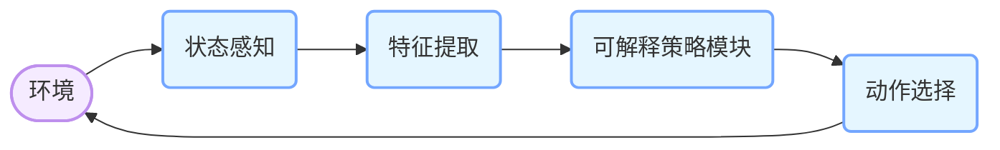

# 构建具有可解释性强化学习能力的AI Agent

> 关键词：可解释性强化学习、AI Agent、决策过程、透明度、策略解释

> 摘要：本文聚焦于构建具有可解释性强化学习能力的AI Agent。首先介绍了相关背景，包括研究目的、预期读者和文档结构等。接着阐述了核心概念与联系，通过文本示意图和Mermaid流程图进行清晰展示。详细讲解了核心算法原理，结合Python源代码进行说明，并给出了数学模型和公式。通过项目实战，展示了代码实现和详细解读。分析了实际应用场景，推荐了学习资源、开发工具框架以及相关论文著作。最后总结了未来发展趋势与挑战，还包含常见问题解答和扩展阅读参考资料，旨在为读者全面深入地介绍如何构建可解释的强化学习AI Agent。

## 1. 背景介绍 
### 1.1 目的和范围
强化学习在诸多领域取得了显著成果，然而其决策过程往往缺乏透明度，难以被人类理解。构建具有可解释性强化学习能力的AI Agent的目的在于解决这一问题，使AI Agent的决策过程能够以人类可理解的方式呈现出来。本文章的范围涵盖了可解释性强化学习的核心概念、算法原理、数学模型、项目实战以及实际应用场景等方面，旨在为读者提供全面而深入的知识体系，帮助他们掌握构建可解释性强化学习AI Agent的方法和技术。

### 1.2 预期读者
本文预期读者包括对人工智能、强化学习领域感兴趣的研究人员、开发者，以及希望了解可解释性AI技术的相关从业者。对于正在学习强化学习，希望进一步探索可解释性问题的学生和初学者也具有一定的参考价值。

### 1.3 文档结构概述
本文将按照以下结构进行组织：首先介绍核心概念与联系，让读者对可解释性强化学习和AI Agent有基本的认识；接着详细讲解核心算法原理和具体操作步骤，并结合Python代码进行说明；然后给出数学模型和公式，并举例说明；通过项目实战展示代码的实际实现和详细解读；分析实际应用场景；推荐相关的工具和资源；最后总结未来发展趋势与挑战，还设有附录解答常见问题，并提供扩展阅读和参考资料。

### 1.4 术语表
#### 1.4.1 核心术语定义
- **强化学习（Reinforcement Learning）**：一种机器学习范式，智能体（Agent）通过与环境进行交互，根据环境反馈的奖励信号来学习最优的行为策略。
- **AI Agent**：人工智能中的一个实体，能够感知环境，做出决策并采取行动，以实现特定的目标。
- **可解释性（Interpretability）**：指模型的决策过程和结果能够被人类理解和解释的程度。
- **策略（Policy）**：在强化学习中，策略是指智能体根据当前状态选择行动的规则。

#### 1.4.2 相关概念解释
- **状态（State）**：环境在某一时刻的描述，是智能体决策的依据。例如在围棋游戏中，棋盘上棋子的分布就是一个状态。
- **动作（Action）**：智能体在某个状态下可以采取的行为。在围棋中，落子的位置就是一个动作。
- **奖励（Reward）**：环境对智能体采取的动作给予的反馈信号，用于指导智能体学习最优策略。比如在游戏中，赢得一局可以获得正奖励，输掉则获得负奖励。

#### 1.4.3 缩略词列表
- **RL**：Reinforcement Learning（强化学习）
- **DQN**：Deep Q-Network（深度Q网络）
- **PPO**：Proximal Policy Optimization（近端策略优化）

## 2. 核心概念与联系 
### 核心概念原理
可解释性强化学习的核心在于让强化学习中的AI Agent的决策过程变得透明。传统的强化学习方法，如深度Q网络（DQN）和近端策略优化（PPO），虽然在很多任务中表现出色，但它们的决策过程往往隐藏在复杂的神经网络参数中，难以被人类理解。可解释性强化学习的目标就是打破这种黑盒状态，通过各种方法揭示AI Agent是如何根据环境状态做出决策的。

一种常见的方法是基于特征重要性分析。在强化学习中，环境状态通常由多个特征组成。通过分析这些特征对决策的影响程度，可以确定哪些特征在决策过程中起到了关键作用。例如，在自动驾驶场景中，环境状态可能包括车辆的速度、前方障碍物的距离、交通信号灯的状态等特征。通过特征重要性分析，可以了解AI Agent在做出决策（如加速、减速、转弯等）时，哪些特征是最重要的。

另一种方法是生成决策规则。可以将AI Agent的决策过程转化为一组易于理解的规则。例如，在医疗诊断场景中，AI Agent可以根据患者的症状和检查结果做出诊断决策。通过生成决策规则，可以将这些决策过程表示为“如果患者出现症状A且检查结果B，则诊断为疾病C”的形式，从而使医生能够理解AI Agent的决策依据。

### 架构的文本示意图
```plaintext
可解释性强化学习AI Agent架构

+-------------------+
|      环境（Env）   |
+-------------------+
        |
        v
+-------------------+
|    状态感知模块   |
+-------------------+
        |
        v
+-------------------+
|    特征提取模块   |
+-------------------+
        |
        v
+-------------------+
| 可解释策略模块（决策规则生成、特征重要性分析等） |
+-------------------+
        |
        v
+-------------------+
|    动作选择模块   |
+-------------------+
        |
        v
+-------------------+
|      环境（Env）   |
+-------------------+
```

### Mermaid流程图


## 3. 核心算法原理 & 具体操作步骤 
### 核心算法原理
这里我们以基于特征重要性分析的可解释性强化学习为例，详细讲解其算法原理。

假设我们使用深度Q网络（DQN）作为基础的强化学习算法。DQN通过一个神经网络来近似最优动作价值函数 $Q(s,a)$，其中 $s$ 表示状态，$a$ 表示动作。在训练过程中，DQN通过不断与环境交互，根据奖励信号更新神经网络的参数，以使得 $Q(s,a)$ 尽可能接近真实的最优动作价值。

为了实现可解释性，我们需要分析状态特征对动作价值的影响。一种简单的方法是使用梯度分析。具体来说，我们可以计算动作价值函数 $Q(s,a)$ 关于状态特征 $x_i$ 的梯度 $\frac{\partial Q(s,a)}{\partial x_i}$。梯度的大小表示该特征对动作价值的影响程度，梯度的正负表示该特征的增加是会提高还是降低动作价值。

### 具体操作步骤
1. **初始化DQN网络**：随机初始化DQN网络的参数 $\theta$。
2. **收集经验数据**：AI Agent与环境进行交互，收集状态 $s$、动作 $a$、奖励 $r$ 和下一个状态 $s'$ 组成的经验数据 $(s,a,r,s')$，并存储在经验回放缓冲区中。
3. **训练DQN网络**：从经验回放缓冲区中随机采样一批经验数据，计算损失函数并更新DQN网络的参数 $\theta$。损失函数通常使用均方误差损失：
   $$L(\theta) = \mathbb{E}_{(s,a,r,s') \sim D}[(r + \gamma \max_{a'} Q(s',a';\theta^-) - Q(s,a;\theta))^2]$$
   其中 $D$ 表示经验回放缓冲区，$\gamma$ 是折扣因子，$\theta^-$ 是目标网络的参数。
4. **计算特征重要性**：对于一个给定的状态 $s$ 和动作 $a$，计算动作价值函数 $Q(s,a)$ 关于状态特征 $x_i$ 的梯度 $\frac{\partial Q(s,a)}{\partial x_i}$，作为该特征的重要性指标。

### Python源代码实现
```python
import torch
import torch.nn as nn
import torch.optim as optim
import random
import numpy as np

# 定义DQN网络
class DQN(nn.Module):
    def __init__(self, input_dim, output_dim):
        super(DQN, self).__init__()
        self.fc1 = nn.Linear(input_dim, 64)
        self.fc2 = nn.Linear(64, 64)
        self.fc3 = nn.Linear(64, output_dim)

    def forward(self, x):
        x = torch.relu(self.fc1(x))
        x = torch.relu(self.fc2(x))
        x = self.fc3(x)
        return x

# 经验回放缓冲区
class ReplayBuffer:
    def __init__(self, capacity):
        self.capacity = capacity
        self.buffer = []
        self.position = 0

    def push(self, state, action, reward, next_state):
        if len(self.buffer) < self.capacity:
            self.buffer.append(None)
        self.buffer[self.position] = (state, action, reward, next_state)
        self.position = (self.position + 1) % self.capacity

    def sample(self, batch_size):
        batch = random.sample(self.buffer, batch_size)
        state, action, reward, next_state = map(np.stack, zip(*batch))
        return state, action, reward, next_state

    def __len__(self):
        return len(self.buffer)

# 训练DQN网络
def train_dqn(env, input_dim, output_dim, num_episodes=1000, batch_size=32, gamma=0.99, lr=0.001):
    dqn = DQN(input_dim, output_dim)
    target_dqn = DQN(input_dim, output_dim)
    target_dqn.load_state_dict(dqn.state_dict())
    optimizer = optim.Adam(dqn.parameters(), lr=lr)
    replay_buffer = ReplayBuffer(10000)

    for episode in range(num_episodes):
        state = env.reset()
        done = False
        while not done:
            state_tensor = torch.FloatTensor(state).unsqueeze(0)
            q_values = dqn(state_tensor)
            action = torch.argmax(q_values, dim=1).item()
            next_state, reward, done, _ = env.step(action)
            replay_buffer.push(state, action, reward, next_state)
            state = next_state

            if len(replay_buffer) >= batch_size:
                states, actions, rewards, next_states = replay_buffer.sample(batch_size)
                states_tensor = torch.FloatTensor(states)
                actions_tensor = torch.LongTensor(actions).unsqueeze(1)
                rewards_tensor = torch.FloatTensor(rewards).unsqueeze(1)
                next_states_tensor = torch.FloatTensor(next_states)

                q_values = dqn(states_tensor).gather(1, actions_tensor)
                next_q_values = target_dqn(next_states_tensor).max(1)[0].unsqueeze(1)
                target_q_values = rewards_tensor + gamma * next_q_values

                loss = nn.MSELoss()(q_values, target_q_values)
                optimizer.zero_grad()
                loss.backward()
                optimizer.step()

        if episode % 10 == 0:
            target_dqn.load_state_dict(dqn.state_dict())

    return dqn

# 计算特征重要性
def compute_feature_importance(dqn, state, action):
    state_tensor = torch.FloatTensor(state).unsqueeze(0)
    state_tensor.requires_grad = True
    q_values = dqn(state_tensor)
    q_value = q_values[0][action]
    q_value.backward()
    gradients = state_tensor.grad.squeeze().numpy()
    return gradients
```

## 4. 数学模型和公式 & 详细讲解 & 举例说明 
### 深度Q网络（DQN）的数学模型
深度Q网络（DQN）是一种基于价值的强化学习算法，其核心是通过一个神经网络来近似最优动作价值函数 $Q^*(s,a)$。动作价值函数 $Q(s,a)$ 表示在状态 $s$ 下采取动作 $a$ 并遵循某一策略 $\pi$ 后所能获得的期望累积奖励：
$$Q^{\pi}(s,a) = \mathbb{E}_{\tau \sim \pi} \left[ \sum_{t=0}^{\infty} \gamma^t r_t \mid s_0 = s, a_0 = a \right]$$
其中 $\tau = (s_0,a_0,r_0,s_1,a_1,r_1,\cdots)$ 是一个状态 - 动作 - 奖励序列，$\gamma \in [0,1]$ 是折扣因子，用于平衡即时奖励和未来奖励的重要性。

最优动作价值函数 $Q^*(s,a)$ 定义为：
$$Q^*(s,a) = \max_{\pi} Q^{\pi}(s,a)$$

DQN使用一个神经网络 $Q(s,a;\theta)$ 来近似 $Q^*(s,a)$，其中 $\theta$ 是神经网络的参数。在训练过程中，通过最小化损失函数来更新 $\theta$。损失函数通常使用均方误差损失：
$$L(\theta) = \mathbb{E}_{(s,a,r,s') \sim D}[(r + \gamma \max_{a'} Q(s',a';\theta^-) - Q(s,a;\theta))^2]$$
其中 $D$ 是经验回放缓冲区，$\theta^-$ 是目标网络的参数，目标网络的参数定期从主网络复制过来，以提高训练的稳定性。

### 特征重要性分析的数学公式
为了分析状态特征对动作价值的影响，我们计算动作价值函数 $Q(s,a)$ 关于状态特征 $x_i$ 的梯度 $\frac{\partial Q(s,a)}{\partial x_i}$。梯度的大小表示该特征对动作价值的影响程度，梯度的正负表示该特征的增加是会提高还是降低动作价值。

### 举例说明
假设我们有一个简单的二维状态空间，状态 $s = [x_1, x_2]$，动作空间包含两个动作 $a_1$ 和 $a_2$。我们使用一个简单的DQN网络 $Q(s,a;\theta)$ 来近似动作价值函数。

在某一时刻，我们得到一个状态 $s = [2, 3]$，并选择动作 $a_1$。我们可以通过计算 $\frac{\partial Q(s,a_1)}{\partial x_1}$ 和 $\frac{\partial Q(s,a_1)}{\partial x_2}$ 来分析状态特征 $x_1$ 和 $x_2$ 对动作价值 $Q(s,a_1)$ 的影响。

假设计算得到 $\frac{\partial Q(s,a_1)}{\partial x_1} = 0.5$ 和 $\frac{\partial Q(s,a_1)}{\partial x_2} = -0.3$。这意味着状态特征 $x_1$ 的增加会提高动作价值 $Q(s,a_1)$，而状态特征 $x_2$ 的增加会降低动作价值 $Q(s,a_1)$，并且 $x_1$ 的影响程度比 $x_2$ 更大。

## 5. 项目实战：代码实际案例和详细解释说明 
### 5.1  开发环境搭建
为了实现可解释性强化学习的项目，我们需要搭建相应的开发环境。以下是具体的步骤：

1. **安装Python**：推荐使用Python 3.7及以上版本。可以从Python官方网站（https://www.python.org/downloads/）下载并安装。
2. **安装深度学习框架**：我们使用PyTorch作为深度学习框架。可以通过以下命令安装：
   ```sh
   pip install torch torchvision
   ```
3. **安装OpenAI Gym**：OpenAI Gym是一个用于开发和比较强化学习算法的工具包。可以通过以下命令安装：
   ```sh
   pip install gym
   ```

### 5.2  源代码详细实现和代码解读
以下是一个完整的项目实战代码，结合前面介绍的DQN和特征重要性分析：

```python
import torch
import torch.nn as nn
import torch.optim as optim
import random
import numpy as np
import gym

# 定义DQN网络
class DQN(nn.Module):
    def __init__(self, input_dim, output_dim):
        super(DQN, self).__init__()
        self.fc1 = nn.Linear(input_dim, 64)
        self.fc2 = nn.Linear(64, 64)
        self.fc3 = nn.Linear(64, output_dim)

    def forward(self, x):
        x = torch.relu(self.fc1(x))
        x = torch.relu(self.fc2(x))
        x = self.fc3(x)
        return x

# 经验回放缓冲区
class ReplayBuffer:
    def __init__(self, capacity):
        self.capacity = capacity
        self.buffer = []
        self.position = 0

    def push(self, state, action, reward, next_state):
        if len(self.buffer) < self.capacity:
            self.buffer.append(None)
        self.buffer[self.position] = (state, action, reward, next_state)
        self.position = (self.position + 1) % self.capacity

    def sample(self, batch_size):
        batch = random.sample(self.buffer, batch_size)
        state, action, reward, next_state = map(np.stack, zip(*batch))
        return state, action, reward, next_state

    def __len__(self):
        return len(self.buffer)

# 训练DQN网络
def train_dqn(env, input_dim, output_dim, num_episodes=1000, batch_size=32, gamma=0.99, lr=0.001):
    dqn = DQN(input_dim, output_dim)
    target_dqn = DQN(input_dim, output_dim)
    target_dqn.load_state_dict(dqn.state_dict())
    optimizer = optim.Adam(dqn.parameters(), lr=lr)
    replay_buffer = ReplayBuffer(10000)

    for episode in range(num_episodes):
        state = env.reset()
        done = False
        while not done:
            state_tensor = torch.FloatTensor(state).unsqueeze(0)
            q_values = dqn(state_tensor)
            action = torch.argmax(q_values, dim=1).item()
            next_state, reward, done, _ = env.step(action)
            replay_buffer.push(state, action, reward, next_state)
            state = next_state

            if len(replay_buffer) >= batch_size:
                states, actions, rewards, next_states = replay_buffer.sample(batch_size)
                states_tensor = torch.FloatTensor(states)
                actions_tensor = torch.LongTensor(actions).unsqueeze(1)
                rewards_tensor = torch.FloatTensor(rewards).unsqueeze(1)
                next_states_tensor = torch.FloatTensor(next_states)

                q_values = dqn(states_tensor).gather(1, actions_tensor)
                next_q_values = target_dqn(next_states_tensor).max(1)[0].unsqueeze(1)
                target_q_values = rewards_tensor + gamma * next_q_values

                loss = nn.MSELoss()(q_values, target_q_values)
                optimizer.zero_grad()
                loss.backward()
                optimizer.step()

        if episode % 10 == 0:
            target_dqn.load_state_dict(dqn.state_dict())

    return dqn

# 计算特征重要性
def compute_feature_importance(dqn, state, action):
    state_tensor = torch.FloatTensor(state).unsqueeze(0)
    state_tensor.requires_grad = True
    q_values = dqn(state_tensor)
    q_value = q_values[0][action]
    q_value.backward()
    gradients = state_tensor.grad.squeeze().numpy()
    return gradients

# 主函数
if __name__ == "__main__":
    env = gym.make('CartPole-v1')
    input_dim = env.observation_space.shape[0]
    output_dim = env.action_space.n

    # 训练DQN网络
    dqn = train_dqn(env, input_dim, output_dim)

    # 测试并计算特征重要性
    state = env.reset()
    state_tensor = torch.FloatTensor(state).unsqueeze(0)
    q_values = dqn(state_tensor)
    action = torch.argmax(q_values, dim=1).item()
    gradients = compute_feature_importance(dqn, state, action)

    print("Selected action:", action)
    print("Feature importance:", gradients)

    env.close()
```

### 代码解读与分析
1. **DQN网络定义**：`DQN` 类定义了一个简单的三层全连接神经网络，用于近似动作价值函数。输入层的维度为状态空间的维度，输出层的维度为动作空间的维度。
2. **经验回放缓冲区**：`ReplayBuffer` 类用于存储智能体与环境交互的经验数据，通过随机采样的方式提高训练的稳定性。
3. **训练DQN网络**：`train_dqn` 函数实现了DQN网络的训练过程。在每个episode中，智能体与环境交互，收集经验数据并存储在经验回放缓冲区中。当缓冲区中的数据足够时，随机采样一批数据进行训练，更新DQN网络的参数。
4. **计算特征重要性**：`compute_feature_importance` 函数通过计算动作价值函数关于状态特征的梯度，来分析状态特征对动作价值的影响。
5. **主函数**：在主函数中，我们创建了一个 `CartPole-v1` 环境，训练DQN网络，并选择一个动作，计算该动作下状态特征的重要性。

## 6. 实际应用场景 
### 自动驾驶
在自动驾驶领域，可解释性强化学习的AI Agent具有重要的应用价值。自动驾驶系统需要在复杂的交通环境中做出决策，如加速、减速、转弯等。可解释性强化学习可以帮助我们理解AI Agent是如何根据环境状态（如车辆的速度、前方障碍物的距离、交通信号灯的状态等）做出决策的。例如，当AI Agent决定刹车时，我们可以通过分析状态特征的重要性，了解是前方障碍物的距离、车辆的速度还是其他因素导致了这个决策。这对于提高自动驾驶系统的安全性和可靠性非常重要，同时也有助于监管机构和公众对自动驾驶技术的信任。

### 医疗诊断
在医疗诊断领域，可解释性强化学习的AI Agent可以辅助医生进行疾病诊断。AI Agent可以根据患者的症状、检查结果等信息做出诊断决策。通过生成决策规则或分析特征重要性，医生可以理解AI Agent的决策依据，从而更好地与AI Agent合作，提高诊断的准确性和效率。例如，在癌症诊断中，AI Agent可以分析患者的基因数据、影像数据等特征，判断患者是否患有癌症。医生可以通过查看AI Agent生成的决策规则，了解哪些特征在诊断过程中起到了关键作用，从而更好地理解诊断结果。

### 金融投资
在金融投资领域，可解释性强化学习的AI Agent可以用于投资组合优化和交易决策。AI Agent可以根据市场数据（如股票价格、成交量、宏观经济指标等）做出投资决策。可解释性强化学习可以帮助投资者理解AI Agent是如何根据这些数据做出决策的，从而更好地评估投资风险和收益。例如，当AI Agent决定买入某只股票时，投资者可以通过分析状态特征的重要性，了解是股票的价格走势、公司的财务状况还是其他因素导致了这个决策。

## 7. 工具和资源推荐
### 7.1 学习资源推荐
#### 7.1.1 书籍推荐
- 《Reinforcement Learning: An Introduction》（《强化学习：原理与Python实现》）：这是一本强化学习领域的经典教材，全面介绍了强化学习的基本概念、算法和应用。
- 《Interpretable Machine Learning》（《可解释机器学习》）：这本书专门介绍了可解释机器学习的方法和技术，对于理解可解释性强化学习有很大的帮助。

#### 7.1.2 在线课程
- Coursera上的《Reinforcement Learning Specialization》：由DeepMind的研究人员授课，系统地介绍了强化学习的理论和实践。
- edX上的《Interpretable Machine Learning》：该课程深入讲解了可解释机器学习的各种方法和技术。

#### 7.1.3 技术博客和网站
- OpenAI博客（https://openai.com/blog/）：OpenAI是人工智能领域的领先研究机构，其博客上经常发布关于强化学习和可解释性AI的最新研究成果。
- Medium上的Towards Data Science（https://towardsdatascience.com/）：这是一个数据科学和机器学习领域的知名博客平台，有很多关于强化学习和可解释性的优质文章。

### 7.2 开发工具框架推荐
#### 7.2.1 IDE和编辑器
- PyCharm：一款专门为Python开发设计的集成开发环境，具有强大的代码编辑、调试和分析功能。
- Jupyter Notebook：一个交互式的开发环境，非常适合进行数据探索、模型训练和可视化。

#### 7.2.2 调试和性能分析工具
- TensorBoard：一个用于可视化深度学习模型训练过程的工具，可以帮助我们监控模型的损失函数、准确率等指标。
- PyTorch Profiler：PyTorch提供的性能分析工具，可以帮助我们找出代码中的性能瓶颈。

#### 7.2.3 相关框架和库
- PyTorch：一个开源的深度学习框架，提供了丰富的神经网络层和优化算法，非常适合实现强化学习算法。
- Stable Baselines3：一个基于PyTorch的强化学习库，提供了多种预训练的强化学习算法和环境，方便我们进行快速开发和实验。

### 7.3 相关论文著作推荐
#### 7.3.1 经典论文
- “Human-level control through deep reinforcement learning”（《通过深度强化学习实现人类水平的控制》）：这篇论文介绍了深度Q网络（DQN）算法，开启了深度强化学习的时代。
- “Explaining and Harnessing Adversarial Examples”（《解释和利用对抗样本》）：虽然这篇论文主要讨论的是对抗样本问题，但其中关于模型可解释性的思想对可解释性强化学习有一定的启发。

#### 7.3.2 最新研究成果
- “Interpretable Reinforcement Learning through Policy Extraction”（《通过策略提取实现可解释的强化学习》）：这篇论文提出了一种通过策略提取实现可解释性强化学习的方法。
- “Towards Robust Interpretability with Self-Explaining Neural Networks”（《通过自解释神经网络实现鲁棒的可解释性》）：该论文介绍了一种自解释神经网络的方法，可用于提高模型的可解释性。

#### 7.3.3 应用案例分析
- “Autonomous Vehicle Decision-Making with Interpretable Reinforcement Learning”（《使用可解释强化学习的自动驾驶车辆决策》）：这篇论文介绍了可解释强化学习在自动驾驶领域的应用案例。
- “Medical Diagnosis with Interpretable Reinforcement Learning Agents”（《使用可解释强化学习智能体进行医疗诊断》）：该论文探讨了可解释强化学习在医疗诊断领域的应用。

## 8. 总结：未来发展趋势与挑战
### 未来发展趋势
- **融合多种可解释性方法**：未来的可解释性强化学习可能会融合多种可解释性方法，如特征重要性分析、决策规则生成、可视化等，以提供更全面、更深入的解释。
- **应用于更多领域**：随着可解释性强化学习技术的不断发展，它将应用于更多的领域，如工业自动化、农业、教育等，为这些领域带来更智能、更可靠的决策支持。
- **与人类协作**：可解释性强化学习的AI Agent将与人类更加紧密地协作。人类可以通过理解AI Agent的决策过程，更好地与AI Agent进行交互和合作，共同完成复杂的任务。

### 挑战
- **解释的准确性和可靠性**：如何确保可解释性方法提供的解释准确、可靠是一个挑战。有时候，可解释性方法可能会给出一些误导性的解释，影响人类对AI Agent决策的理解。
- **计算效率**：一些可解释性方法可能会增加计算复杂度，降低算法的运行效率。如何在保证可解释性的同时，提高算法的计算效率是一个需要解决的问题。
- **人类理解的局限性**：即使提供了可解释性，人类对复杂的解释可能仍然难以理解。如何设计出更易于人类理解的解释方式是一个挑战。

## 9. 附录：常见问题与解答
### 问题1：可解释性强化学习与传统强化学习有什么区别？
传统强化学习主要关注如何让智能体学习到最优的行为策略，以最大化累积奖励。而可解释性强化学习在学习最优策略的基础上，还要求智能体的决策过程能够被人类理解和解释。传统强化学习的决策过程往往隐藏在复杂的神经网络参数中，难以被人类理解，而可解释性强化学习通过各种方法揭示决策的依据。

### 问题2：可解释性强化学习的方法有哪些？
常见的可解释性强化学习方法包括特征重要性分析、决策规则生成、可视化等。特征重要性分析通过计算状态特征对动作价值的影响程度，确定哪些特征在决策过程中起到了关键作用。决策规则生成将智能体的决策过程转化为一组易于理解的规则。可视化则通过图形化的方式展示智能体的决策过程。

### 问题3：可解释性强化学习在实际应用中有哪些困难？
可解释性强化学习在实际应用中面临一些困难，如解释的准确性和可靠性、计算效率、人类理解的局限性等。确保可解释性方法提供的解释准确、可靠是一个挑战，一些可解释性方法可能会增加计算复杂度，降低算法的运行效率。此外，即使提供了可解释性，人类对复杂的解释可能仍然难以理解。

## 10. 扩展阅读 & 参考资料
### 扩展阅读
- 《Deep Reinforcement Learning Hands-On》（《深度强化学习实战》）：这本书提供了更多关于深度强化学习的实战案例和技巧。
- 《Explanation in Artificial Intelligence: Insights from the Social Sciences》（《人工智能中的解释：来自社会科学的见解》）：该书从社会科学的角度探讨了人工智能可解释性的问题。

### 参考资料
- Sutton, R. S., & Barto, A. G. (2018). Reinforcement Learning: An Introduction. MIT press.
- Molnar, C. (2019). Interpretable Machine Learning. Lulu.com.
- Mnih, V., Kavukcuoglu, K., Silver, D., Rusu, A. A., Veness, J., Bellemare, M. G.,... & Petersen, S. (2015). Human-level control through deep reinforcement learning. Nature, 518(7540), 529-533.

作者：AI天才研究院/AI Genius Institute & 禅与计算机程序设计艺术 /Zen And The Art of Computer Programming